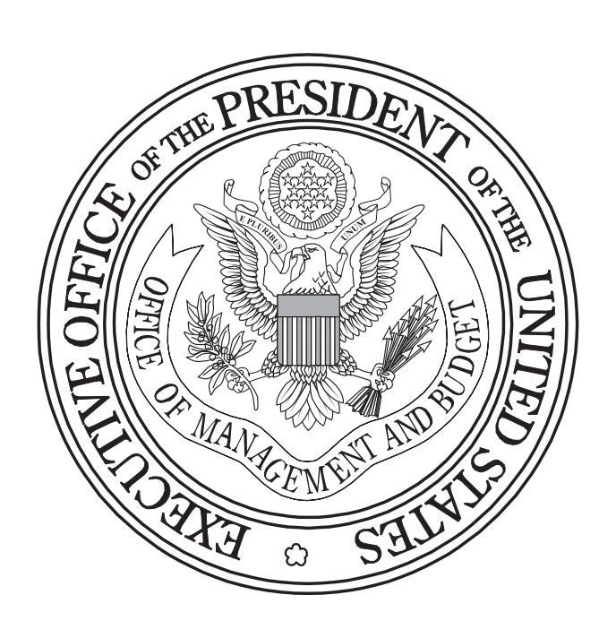
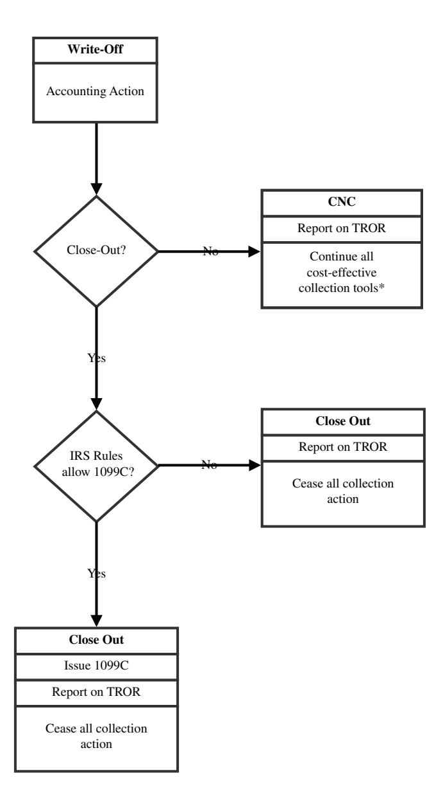
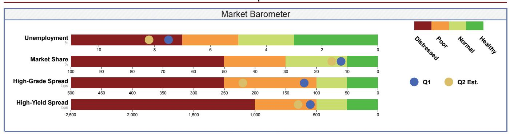
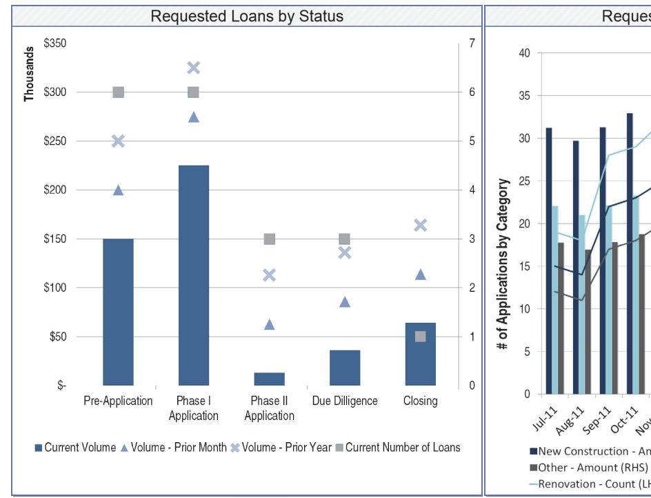
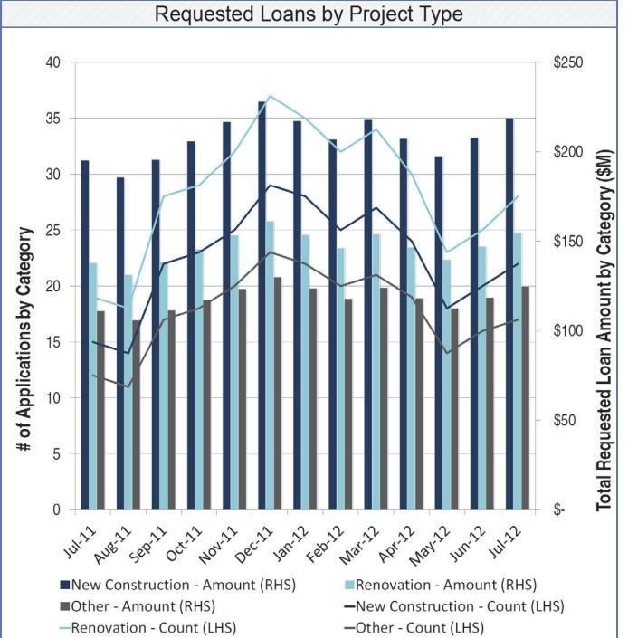
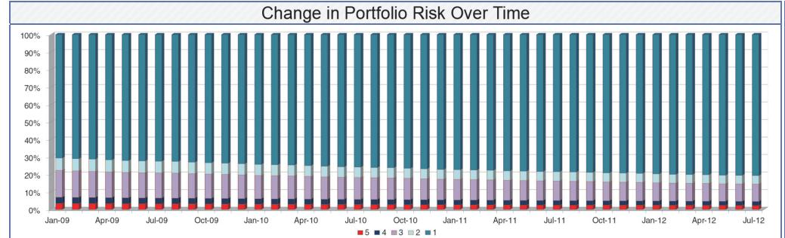
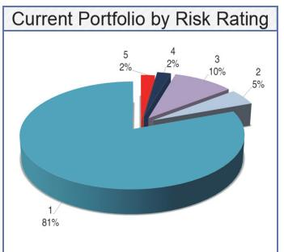

# CIRCULAR NO. A-129

# POLICIES FOR FEDERAL CREDIT PROGRAMS AND NON-TAX RECEIVABLES

EXECUTIVE OFFICE OF THE PRESIDENT OFFICE OF MANAGEMENT AND BUDGET JANUARY 2013

# **transMittal lEttEr**

# EXECUTIVE OFFICE OF THE PRESIDENT OFFICE OF MANAGEMENT AND BUDGET WASHINGTON, D.C . 20503

# January 2013

CIRCULAR NO. A-129 Revised

# TO THE HEADS OF EXECUTIVE DEPARTMENTS AND ESTABLISHMENTS

SUBJECT: Policies for Federal Credit Programs and Non-Tax Receivables

Federal credit programs are created to accomplish a variety of social and economic goals. Agencies must implement budget policies and management practices that ensure the goals of credit programs are met while properly identifying and controlling costs. In addition, Federal receivables, whether from credit programs or other non-tax sources, must be serviced and collected in an efficient and effective manner to protect the value of the Federal Government's assets.

# GENERAL INFORMATION

- 1. Purpose. This Circular prescribes policies and procedures for justifying, designing, and managing Federal credit programs and for collecting non-tax receivables. It sets principles for designing credit programs, including: the preparation and review oflegislation and regulations; budgeting for the subsidy costs and administrative expenses of credit programs, and minimizing unintended costs to the Government; and improving the efficiency and effectiveness of Federal credit programs. It also sets standards for extending credit, managing lenders participating in Government guaranteed loan programs, servicing credit and non-tax receivables, and collecting delinquent debt.
- 2. Authority. This Circular is issued under several authorities, including but not limited to (i) the following statutes, as amended and codified: ofthe Budget and Accounting Act of 1921, as amended; the Budget and Accounting Act of 1950; the Debt Collection Act of 1982; Section 2653 of Public Law 98- 369; the Federal Credit Reform Act of 1990; the Chief Financial Officers Act of 1990; and the Cash Management Improvement Act Amendments of 1992; (ii) Executive Order 8248, as amended; and (iii) pre-existing common law authority to charge interest on debts and to offset payments to collect debts administratively.

# 3. Coverage.

- a. *Applicability.* The provisions ofthis Circular apply to all credit programs of the Federal Government, including:
  - (1) Direct loan programs;
  - (2) Loan guarantee programs and loan insurance programs in which the Federal Government bears a legal liability to pay for all or part of the principal or interest in the event of borrower default; and

(3) Loans or other financial assets acquired by a Federal agency (or a receiver or conservator acting for a Federal agency), including those acquired as a result of a claim payment on a defaulted guaranteed or insured loan or in fulfillment of a Federal deposit insurance commitment.

Sections IV and V ("Managing the Federal Government's Receivables" and "Delinquent Debt Collection") also apply to receivables due to the Government from the sale of goods and services; fines, fees, duties, leases, rents, royalties, financed payments, and penalties; overpayments to beneficiaries, grantees, contractors, and Federal employees; and similar debts and financial instruments.

- b. *Exclusions Under the Debt Collection Acts.* Certain debt collection techniques authorized or mandated by the provisions of the Debt Collection Act of 1982, as amended by the Debt Collection Improvement Act of 1996, do not apply to debts arising under the Internal Revenue Code, certain sections ofthe Social Security Act, or the tarifflaws ofthe United States.
- c. *Other Statutory Exclusions.* The policies and standards of this Circular do not apply when they are statutorily prohibited, or are inconsistent with a program's statutory requirements. However, agencies are required to periodically review legislation affecting the form of assistance and/or financial standards for credit programs to justify continuance of any non-conformance.
- **4. Rescission.** This Circular rescinds and replaces *OMB Circular No. A-129* (revised), dated November 2000. This Circular supplements, and does not supersede, the requirements applicable to budget submissions under *OMB Circular No. A-ll* and requirements applicable to proposed legislation and testimony under *OMB Circular No. A-19.*
- **5. Effective Date.** This Circular is effective immediately.
- **6. Inquiries.** Further information on the implementation of credit management and debt collection policies may be found in the Department ofthe Treasury's Financial Management Service *Managing Federal Receivables,* in OMB Memorandum M-04-1 0 *Debt Collection Improvement Act Requirements,*  and in OMB's *Government-wide 5-Year Plan* for financial management submitted annually to Congress.

For inquiries concerning budget and legislative policy for credit programs contact the Office of Management and Budget, Budget Review Division, Budget Analysis Branch, Room 6001, New Executive Office Building, 725 17th Street, NW, Washington, DC 20503; (202) 395-3945 or email CSC2@omb.eop.gov. Questions on all other sections of this Circular should be directed to the Office of Federal Financial Management (202) 395-4534.

7. **Definitions.** Unless otherwise defined in this Circular, key terms used in this Circular are defined in *OMB Circular No. A-11.* 

/'

*(* 

Yrrre~ents

\v *0*

*Deputy Director for Management* 

**Appendices (5)** 

# TABLE OF CONTENTS

|      |         | TABLE OF CONTENTS                                                                            | Page |
|------|---------|----------------------------------------------------------------------------------------------|------|
| Tra  | nsmitta | ıl Letter                                                                                    | i    |
| I.   | RESP    | ONSIBILITIES OF DEPARTMENTS AND AGENCIES                                                     | 1    |
|      | A.      | Office of Management and Budget.                                                             | 1    |
|      | В.      | Department of the Treasury.                                                                  | 1    |
|      | C.      | Federal Credit Policy Council.                                                               | 1    |
|      | D.      | Department and Agencies.                                                                     | 2    |
| II.  | BUDO    | GET AND LEGISLATIVE POLICY FOR CREDIT PROGRAMS                                               | 3    |
|      | A.      | Program Reviews and Evidence-Building.                                                       | 3    |
|      | В.      | Form of Assistance.                                                                          | 4    |
|      | C.      | Financial Standards.                                                                         | 5    |
|      | D.      | Implementation.                                                                              | 7    |
| III. | CREI    | OIT EXTENSION AND MANAGEMENT POLICY                                                          | 8    |
|      | A.      | Credit Extension Policies.                                                                   | 8    |
|      | В.      | Credit Program Management.                                                                   | 10   |
|      | C.      | Management of Guaranteed Loan Lenders and Servicers.                                         | 12   |
| IV.  | MAN     | AGING THE FEDERAL GOVERNMENT'S RECEIVABLES                                                   | 14   |
|      | A.      | Accounting and Financial Reporting.                                                          | 14   |
|      | В.      | Loan Servicing Requirements.                                                                 | 15   |
|      | C.      | Asset Resolution.                                                                            | 16   |
| V.   | DELI    | NQUENT DEBT COLLECTION                                                                       | 17   |
|      | A.      | Standards for Defining Delinquent and Defaulted Debt                                         | 17   |
|      | B.      | Administrative Collection of Debts.                                                          | 18   |
|      | C.      | Referrals to the Department of Justice.                                                      | 20   |
|      | D.      | Interest, Penalties and Administrative Costs.                                                | 21   |
|      | E.      | Termination of Collection, Write-Off, Use of Currently Not Collectible (CNC), and Close-Out. | 21   |
| ATT  | CACHN   | IENT: Write-Off/Close-out Processes for Receivables                                          | 23   |
| App  | endix A | A: Program Reviews                                                                           | A-1  |
| App  | endix I | 3: Model Bill Language for Credit Programs                                                   | B-1  |
| App  | endix ( | C: Management and Oversight Structures                                                       |      |
| App  | endix I | D: Effective Reporting for Data-Driven Decision Making                                       | D-1  |
| App  | endix I | E: Communications Policies                                                                   | E-1  |

i

# I. **resPoNsibilities of dePartmeNts aNd ageNCies**

| refereNCes |                                                                                                                   |  |  |
|------------|-------------------------------------------------------------------------------------------------------------------|--|--|
|            | Federal Credit Reform Act of 1990 (FCRA), 2 U.S.C. § 661 et. seq.                                                 |  |  |
|            | Debt Collection Act of 1982 (DCA); Debt Collection Improvement Act of 1996 (DCIA), 31 U.S.C. §3701, 3711-3720E |  |  |
|            | Federal Debt Collection Procedures Act of 1990                                                                    |  |  |
| statutory  | Budget and Accounting Act of 1921                                                                                 |  |  |
|            | Budget and Accounting Act of 1950                                                                                 |  |  |
|            | Chief Financial Officers Act of 1990 (CFO Act)                                                                    |  |  |
|            | Cash Management Improvement Act                                                                                   |  |  |

- A. **Office of Management and Budget.** The Office of Management and Budget (OMB) is responsible for reviewing legislation to establish new credit programs or to expand or modify existing credit programs; monitoring agency conformance with the Federal Credit Reform Act of 1990 (FCRA); formulating and reviewing agency credit reporting standards and requirements; reviewing and clearing testimony pertaining to credit programs and debt collection; reviewing agency budget submissions for credit programs and debt collection activities; developing and maintaining the Federal credit subsidy calculator used to calculate the cost of credit programs; formulating and reviewing agency implementation of credit management and debt collection policy; approving agency credit management and debt collection plans; working with agencies to identify and implement common policies, processes, or other resources to increase efficiency of credit program portfolio management functions; and providing training to credit agencies.
- B. **department of the treasury.** The Department of the Treasury (Treasury), acting through the Office of Domestic Finance, works with OMB to develop Federal credit policies and review legislation to create new credit programs or to expand or modify existing credit programs. Treasury, through its Financial Management Service (FMS), promulgates Governmentwide debt collection regulations implementing the debt collection provisions of the Debt Collection Improvement Act of 1996 (DCIA). FMS works with the Federal program agencies to identify debt that is eligible for referral to Treasury for cross-servicing and offset, and to establish target dates for referral. Performance measures for annual referral and collection goals are set in conjunction with FMS, agencies, and OMB. In accordance with the DCIA and other Federal laws, FMS conducts offsets of eligible Federal and State payments, including tax refunds, to collect Federal non-tax debts, as well as State debts, through the Treasury Offset Program (TOP). FMS also provides collection services for delinquent non-tax Federal debts (referred to as cross-servicing), and maintains a private collection agency contract for referral and collection of delinquent debts. Additionally, FMS issues operational and procedural guidelines regarding Governmentwide credit management and debt collection such as *[Managing Federal Receivables](http://www.fms.treas.gov/debt/Guidance_MFR.html)* and *[Guide to the Federal Credit](http://www.fms.treas.gov/fedreg/guidance/fedcreditbureauguide.pdf) [Bureau Program](http://www.fms.treas.gov/fedreg/guidance/fedcreditbureauguide.pdf).* FMS, under its program responsibility for credit and debt management and as an active member of the Federal Credit Policy Council, assists in improving credit and debt management activities Government-wide.
- C. **federal Credit Policy Council.** The Federal Credit Policy Council (FCPC) is an interagency forum convened by OMB that a) provides advice and assistance to OMB and Treasury in the formulation and implementation of credit policies, and b) serves as a mechanism to foster interagency collaboration and sharing of best practices. Membership consists of representatives from OMB and other representatives from the Executive Office of the President, Treasury, and the Chief Financial Officer (CFO), Chief Risk Officer and other senior official(s) from each participating Federal credit or debt collection agency. The major credit and debt collection agencies represented include the Departments of Agriculture, Commerce, Education, Energy, Health and Human Services, Housing and Urban Development, Interior, Justice, Labor, State, Transportation, Veterans Affairs and the Agency for International Development, the Export-Import Bank, the Federal Deposit Insurance Corporation, the Overseas Private Investment Corporation, and the Small Business Administration. Other departments and agencies may be invited to participate in the FCPC. The FCPC will establish standing and ad-hoc work groups as needed to focus on issues specific to Federal credit programs and debt collection.

D. **department and agencies.** Departments and agencies shall manage credit programs and all non-tax receivables in accordance with their statutory authorities and the provisions of this Circular to protect the Government's assets and to minimize losses in relation to social benefits provided. Specifically, agencies shall ensure that Federal credit program legislation, regulations, and policies are designed and administered in compliance with the principles of this Circular; the costs of credit programs are budgeted for and controlled in accordance with FCRA; and that credit programs are designed and administered in a manner that most effectively and efficiently achieves policy goals while minimizing taxpayer risk.

*To achieve these objectives, agencies shall*:

- 1. Ensure that the statutory and regulatory requirements and standards set forth in this and other applicable OMB circulars, Treasury regulations, and supplementary guidance set forth in the Treasury/FMS *[Managing Federal Receivables](http://www.fms.treas.gov/debt/Guidance_MFR.html)*  are incorporated into agency regulations, policies, and procedures for credit programs and debt collection activities;
- 2. Propose new or revised legislation, regulations, and forms as necessary to ensure consistency with the provisions of this Circular;
- 3. Submit legislation and testimony affecting credit programs for review under *[OMB Circular No. A-19,](http://www.whitehouse.gov/omb/circulars_a019/) Legislative Coordination and Clearance* and budget proposals for review under *[OMB Circular No. A-11](http://www.whitehouse.gov/omb/circulars_a11_current_year_a11_toc), Preparation, Submission, and Execution of the Budget*;
- 4. Operate each credit program under a robust management and oversight structure, with clear and accountable lines of authority and responsibilities for administering programs and independent risk management functions; monitoring programs in terms of programmatic goals and performance within acceptable risk thresholds; and taking action to improve or maintain efficiency and effectiveness;
- 5. Make every effort to effectively target Federal assistance, and mitigate risk by a) following appropriate screening standards and procedures for eligibility and determination of creditworthiness, and b) making sure that lenders and servicers participating in Federal credit programs meet all applicable financial and programmatic requirements;
- 6. Establish appropriate internal controls over programmatic functions and operations, in accordance with the standards established in this Circular, and *[OMB Circular No. A-123](http://www.whitehouse.gov/omb/circulars_default/), Management's Responsibility for Internal Control*;
- 7. Assign to the agency CFO, in accordance with the Chief Financial Officers Act of 1990 (CFO Act), responsibility for directing, managing, and providing policy guidance and oversight of agency financial management personnel, activities, and operations, including the implementation of asset management systems for credit management and debt collection;
- 8. Establish oversight and governance structures, as appropriate, to coordinate credit management and debt collection activities, and ensure full consideration of credit management and debt collection issues by all interested and affected Federal organizations;
- 9. Employ robust diagnostic and reporting frameworks, including dashboards and watch lists, so that all levels of the organization receive appropriate information to inform proactive portfolio management, and program decisions are informed by robust data analytics that provide senior policy officials and other credit program managers a clear understanding of a program's performance towards policy goals and risk, and the effects of such decisions;
- 10. Evaluate Federal credit programs' effectiveness in achieving program goals in accordance with the guidance set forth in this Circular and in *[OMB Circular No. A-11](http://www.whitehouse.gov/omb/circulars_a11_current_year_a11_toc)*, Part 6, including strategic program reviews at least once every two years, or under other such timeframe as approved by OMB;
- 11. Ensure that informed and cost effective decisions are made concerning portfolio administration, including full consideration of contracting out for servicing or selling the portfolio;
- 12. Effectively manage delinquent debt, including the use of all available techniques, as appropriate, to collect delinquent debts, such as those found in the *[Federal Claims Collection Standards](http://ecfr.gpoaccess.gov/cgi/t/text/text-idx?c=ecfr&tpl=/ecfrbrowse/Title31/31cfr902_main_02.tpl)* and Treasury regulations, including demand

letters, administrative offset, salary offset, tax refund offset, private collection agencies, cross-servicing by Treasury, administrative wage garnishment, and litigation, and the write-off of delinquent debts as soon as they are determined to be uncollectible;

- 13. Submit timely and accurate financial management and performance data to OMB and Treasury, to support evaluation of the Government's credit management and debt collection programs and policies;
- 14. Prepare, as part of the agency CFO Financial Management 5-Year Plan, a Credit Management and Debt Collection Plan for effectively managing credit extension, account servicing, portfolio management and delinquent debt collection. The plan must ensure agency compliance with the standards in this Circular; and
- 15. Manage data in loan applications and documents for individuals in accordance with the [Privacy Act of 1974](http://transition.usaid.gov/policy/egov/pa_1974.pdf), as amended by the [Computer Matching and Privacy Protection Act of 1988](http://www.irs.gov/irm/part11/irm_11-003-039.html), and the [Right to Financial Privacy Act of](http://www.fdic.gov/regulations/laws/rules/6500-2550.html)  [1978,](http://www.fdic.gov/regulations/laws/rules/6500-2550.html) as amended. The [Privacy Act of 1974](http://transition.usaid.gov/policy/egov/pa_1974.pdf) does not apply to loans and debts of commercial organizations.

# II. **budget aNd legislative PoliCY for Credit Programs**

Federal credit assistance should be provided only when it is necessary and the best method to achieve clearly-specified Federal objectives. Use of private credit markets should be encouraged, and any impairment of such markets or misallocation of the nation's resources through the operation of Federal credit programs should be minimized.

### A. **Program reviews and evidence-building.**

| refereNCes |                                                                   |  |
|------------|-------------------------------------------------------------------|--|
| statutory  | Federal Credit Reform Act of 1990 (FCRA), 2 U.S.C. § 661 et. seq. |  |
| guidance   | OMB Circular No. A-11                                             |  |

Agencies shall periodically evaluate programs in terms of the policy goals of the program, and the program's effectiveness towards addressing those goals. Such reviews should be performed on a biennial basis, or other timeframe approved by OMB. Program reviews should be written analyses submitted to OMB as part of the agency's budget request, or other mechanism acceptable to OMB, along with electronic copies of completed evaluations and other studies. (For guidance on program evaluation and evidence required in support of the agency's budget submission, see *[OMB Memorandum M-12-14](http://www.whitehouse.gov/sites/default/files/omb/memoranda/2012/m-12-14_1.pdf)*.) Agencies may be required to perform such reviews or evidence-building more frequently for significant programs or programs experiencing a major change, such as a change in purpose or scope, a change in how the program is administered, or a change in external factors that are likely to affect program operations, impact, and/or cost. In addition, program reviews should be submitted to OMB for new credit programs, and for reauthorizing, expanding, or significantly changing existing credit programs. Such reviews should explain the rationale for proposed changes, provide evidence (evaluations and other strong analytics about relevant data) of past program impacts, and, if new delivery designs are being proposed, lay out why the design changes are expected to improve program impact or costs. Credit program reviews under this section must address, at a minimum:

- 1. The Federal objectives to be achieved, including:
  - a. Whether the credit program is intended to:
    - i. Correct a capital market imperfection, which should be defined and quantified;
    - ii. Subsidize borrowers or other beneficiaries, who should be identified; and/or
    - iii. Encourage certain activities, which should be specified.
  - b. Why they cannot be achieved without Federal credit assistance, including:
    - i. A description of existing and potential private sources of credit by type of institution, and the availability, terms and conditions, and cost of credit to borrowers;

ii. An explanation as to whether and why these private sources of financing must be supplemented and/or subsidized; and

- iii. Whether any Federal credit or non-credit program exists that addresses a similar need and why it or a modification to it would not be sufficient to address the need.
- 2. The scope of the program, including the amount of Federal credit assistance estimated necessary to efficiently meet the intended Federal objectives, and where appropriate, the time horizon of Federal investment.
- 3. The justification for use of a credit subsidy. The review should provide an explanation of why a credit subsidy is the most efficient way of providing assistance, including how it aids in overcoming capital market imperfections, how it would assist the identified borrowers or beneficiaries or would encourage the identified activities, why it would be preferable to other forms of assistance such as grants or technical assistance, and the degree of subsidy necessary to achieve the Federal objectives.
- 4. The estimated net economic benefits of the program or program change. The review should estimate or, when the program exists, measure the benefits expected from the program or program change, including the amount by which the distribution of credit is expected to be altered and the favored activity is expected to increase, and analyze any economic costs associated with the program. Information on conducting a cost-benefit analysis can be found in *[OMB](http://www.whitehouse.gov/sites/default/files/omb/assets/a94/a094.pdf)  [Circular No. A-94](http://www.whitehouse.gov/sites/default/files/omb/assets/a94/a094.pdf)*.
- 5. The effects on private capital markets. The review should estimate the extent to which the program substitutes directly or indirectly for private lending, and analyze any elements of program design that encourage and supplement private lending activity, with the objective that private lending is displaced to the smallest degree possible by agency programs.
- 6. The estimated subsidy level. The review should provide an explicit estimate of the subsidy, as required by FCRA. If loan assets are to be sold or are to be included in a prepayment program for programmatic or other reasons, then the subsidy estimate should include the effects of the loan asset sales. For guidance on loan asset sales, see the DCIA, *[OMB Circular No. A-11,](http://www.whitehouse.gov/omb/circulars_a11_current_year_a11_toc)* and the Treasury/FMS *[Managing Federal Receivables](http://www.fms.treas.gov/debt/Guidance_MFR.html).* Loan asset sales/prepayment programs must be conducted in accordance with policies in this Circular and procedures in *[Managing Federal](http://www.fms.treas.gov/debt/Guidance_MFR.html) [Receivables,](http://www.fms.treas.gov/debt/Guidance_MFR.html)* including the prohibitions against the financing of prepayments by tax-exempt borrowing and sales with recourse except where specifically authorized by statute. The cost of any guarantee placed on the asset sold requires budget authority.
- 7. The administrative resource requirements. The review should include an examination of the agency's current capacity to administer the new or expanded program and an estimation of any additional resources that would be needed, and an explicit estimate of the expected annual administrative costs including extension, servicing, collection, and management and oversight functions.

### B. **form of assistance.**

| refereNCes |                                                                                                            |  |
|------------|------------------------------------------------------------------------------------------------------------|--|
| statutory  | Federal Credit Reform Act of 1990 (FCRA), 2 U.S.C. § 661 et. seq. Internal Revenue Code, Section 149(b) |  |

When Federal credit assistance is necessary to meet a Federal objective, loan guarantees should be favored over direct loans, unless attaining the Federal objective requires a subsidy, deeper than can be provided by a loan guarantee.

1. Loan guarantees may provide several advantages over direct loans. These advantages include: private sector credit servicing (which tends to be more efficient), private sector analysis of the borrower's creditworthiness (which tends to allocate resources more efficiently), involvement of borrowers with private sector lenders (which promotes their movement to private credit), and lower portfolio management costs for agencies.

- 2. Loan guarantees, by removing part or all of the credit risk of a transaction, change the allocation of economic resources. Loan guarantees may make credit available when private financial sources would not otherwise do so, or guarantees may support credit to borrowers under more favorable terms than would otherwise be granted. This reallocation of credit may impose a cost on the Government and/or the economy.
- 3. Direct loans usually offer borrowers lower interest rates and longer maturities than loans available from private financial sources, even those with a Federal guarantee. The use of direct loans, however, may displace private financial sources and increase the possibility that the terms and conditions on which Federal credit assistance is offered will not reflect changes in financial market conditions. The costs to the Government and the economy are therefore likely to be greater.
- 4. Direct or indirect guarantees of tax-exempt obligations are prohibited under Section 149(b) of the Internal Revenue Code. Guarantees of tax-exempt obligations are an inefficient way of allocating Federal credit. Assistance to the borrower, through the tax exemption and the guarantee, provides interest savings to the borrower that are smaller than the tax revenue loss to the Government. It is generally thought that the cost to the taxpayer is greater than the benefit to the borrower. The Internal Revenue Code provides some exceptions to this requirement; see Section 149(b) for further details.
- 5. To preclude the possibility that Federal agencies will guarantee tax-exempt obligations, either directly or indirectly, agencies will:
  - a. Not guarantee federally tax-exempt obligations;
  - b. Provide that effective subordination of a direct or guaranteed loan to tax-exempt obligations will render the guarantee void. To avoid effective subordination, the direct or guaranteed loan and the tax-exempt obligation should be repaid using separate dedicated revenue streams or otherwise separate sources of funding, and should be separately collateralized. In addition, the direct or guaranteed loan terms, such as grace periods, repayment schedules, and availability of deferrals, should be consistent with private sector standards to ensure that they do not create effective subordination;
  - c. Prohibit use of a Federal guarantee as collateral to secure a tax-exempt obligation;
  - d. Prohibit Federal guarantees of loans funded by tax-exempt obligations; and
  - e. Prohibit the linkage of Federal guarantees with tax-exempt obligations. For example, such prohibited linkage occurs if the project is unlikely to be financed without the Federal guarantee covering a portion of the cost. In such cases, the Federal guarantee is, in effect, enabling the tax-exempt obligation to be issued, since without the guarantee the project would not be viable to receive any financing. Therefore, the tax-exempt obligation is dependent on and linked to the Federal guarantee.
- 6. Where a large degree of subsidy is justified, comparable to that which would be provided by guaranteed tax-exempt obligations, agencies should consider the use of direct loans.

### C. **financial standards.**

| refereNCes |                                                                                                                                                                                              |  |
|------------|----------------------------------------------------------------------------------------------------------------------------------------------------------------------------------------------|--|
| statutory  | Federal Credit Reform Act of 1990 (FCRA), 2 U.S.C. § 661 et. seq.                                                                                                                            |  |
|            | Chief Financial Officers Act of 1990 (CFO Act)                                                                                                                                               |  |
| guidance   | OMB Circular No. A-11                                                                                                                                                                        |  |
|            | Federal Accounting Standards Advisory Board: Statement of Federal Financial Accounting Stan dards No. 2 Accounting for Direct Loans and Loan Guarantees, as amended; Statement of Federal |  |
|            | Financial Accounting Standards No. 18 Amendments to Accounting Standards for Direct Loans and Loan Guarantees; and Statement of Federal Financial Accounting Standards No. 19 Technical   |  |
|            | Amendments to Accounting Standards for Direct Loans and Loan Guarantees in Statement of Fed eral Financial Accounting Standards No. 2.                                                    |  |

In accordance with FCRA, agencies must analyze and control the risk and cost of their programs.

Agencies must develop statistical models predictive of defaults and other deviations from loan contracts. Agencies are required to estimate subsidy costs and to obtain budget authority to cover such costs before obligating direct loans and committing loan guarantees. Specific instructions for budget justification, subsidy cost estimation (including analytical support for model assumptions), and budget execution under FCRA are provided in *OMB Circular No. A-11*.

Agencies shall follow sound financial practices in the design and administration of their credit programs. Where program objectives cannot be achieved while following sound financial practices, the cost of these deviations shall be justified in agency budget submissions with a cost-benefit analysis and all deviations should be reevaluated in any program review performed under the requirements above. Unless a deviation has been approved by OMB, agencies should follow the financial practices discussed below.

- 1. Lenders and borrowers who participate in Federal credit programs should have a substantial stake in full repayment in accordance with the loan contract.
  - a. Private lenders who extend credit that is guaranteed by the Government should bear at least 20 percent of the loss from a default. Loan guarantees that cover 100 percent of any losses on a loan encourage private lenders to exercise less caution than they otherwise would in evaluating loan requests. The level of guarantee should be no more than necessary to achieve program purposes. Loans for borrowers who are deemed to pose less of a risk should receive a lower guarantee.
  - b. Borrowers should have an equity interest in any asset being financed with the credit assistance, and business borrowers should have substantial capital or equity at risk in their business (see Section III.A.3.b for additional discussion).
  - c. Programs in which the Government bears more than 80 percent of any loss should be periodically reviewed to determine whether the private sector has become able to bear a greater share of the risk.
- 2. Agencies should establish interest and fee structures for direct loans and loan guarantees and should review these structures at least annually. Documentation of the performance of these annual reviews for credit programs is considered sufficient to meet the review requirement described in Section 902(a)(8) of the CFO Act.
  - a. Interest and fees should be set at levels that minimize default and other subsidy costs, of the direct loan or loan guarantee, while supporting achievement of the program's policy objectives.
  - b. Agencies must request an appropriation in accordance with FCRA for default and other subsidy costs not covered by interest and fees.
  - c. Unless inconsistent with program purposes, and where authorized by law, riskier borrowers should be charged more than those who pose less risk. In order to avoid an unintended additional subsidy to riskier borrowers within the eligible class and to support the extension of credit to those riskier borrowers, programs that, for public policy purposes, do not adhere to this guideline, should justify the extra subsidy conveyed to the higher-risk borrowers in their annual budget submissions to OMB.
- 3. Contractual agreements should include all covenants and restrictions (e.g., liability insurance) necessary to protect the Federal Government's interest.
  - a. Maturities on loans should be shorter than the estimated useful economic life of any assets financed.
  - b. The Government's claims should not be subordinated to the claims of other creditors, as in the case of a borrower's default on either a direct loan or a guaranteed loan. Subordination increases the risk of loss to the Government, since other creditors would have first claim on the borrower's assets.
- 4. In order to minimize inadvertent changes in the amount of subsidy, interest rates to be charged on direct loans and any interest supplements for guaranteed loans should be specified by reference to the market rate on a benchmark Treasury security rather than as an absolute level. A specific fixed interest rate should not be cited in legislation or in regulation, because such a rate could soon become outdated, unintentionally changing the extent of the subsidy.

- a. The benchmark financial market instrument should be a marketable Treasury security with a similar maturity to the direct loans being made or the non-Federal loans being guaranteed. When the rate on the Government loan is intended to be different than the benchmark rate, it should be stated as a percentage of that rate. The benchmark Treasury security must be cited specifically in agency budget justifications.
- b. Interest rates applicable to new loans should be reviewed at least quarterly and adjusted to reflect changes in the benchmark interest rate. Loan contracts may provide for either fixed or floating interest rates.
- 5. Maximum amounts of direct loan obligations and loan guarantee commitments should be specifically authorized in advance in annual appropriations acts, except for mandatory programs exempt from the appropriations requirements under Section 504(c) of FCRA.
- 6. Financing for Federal credit programs should be provided by Treasury in accordance with FCRA. Guarantees of the timely payment of 100 percent of the loan principal and interest against all risk create a debt obligation that is the credit risk equivalent of a Treasury security. Accordingly, a Federal agency other than the Department of the Treasury may not issue, sell, or guarantee an obligation of a type that is ordinarily financed in investment securities markets, as determined by the Secretary of the Treasury, unless the terms of the obligation provide that it may not be held by a person or entity other than the Federal Financing Bank (FFB) or another Federal agency. In exceptional circumstances, the Secretary of the Treasury may waive this requirement with respect to obligations that the Secretary determines: 1) are not suitable for investment for the FFB because of the risks entailed in such obligations; or 2) are, or will be, financed in a manner that is least disruptive of private finance markets and institutions; or 3) are, or will be, based on the Secretary's consultation with OMB and the guaranteeing agency, financed in a manner that will best meet the goals of the program. The benefits of using the FFB must not expand the degree of subsidy.
- 7. Federal loan contracts should be standardized where practicable. Documents similar to those used in the private sector should be used whenever possible, especially for loan guarantees.

### D. **implementation.**

| refereNCes |                                                                   |  |
|------------|-------------------------------------------------------------------|--|
| statutory  | Federal Credit Reform Act of 1990 (FCRA), 2 U.S.C. § 661 et. seq. |  |
|            | GPRA Modernization Act of 2010                                    |  |
| guidance   | OMB Circular No. A-11                                             |  |
|            | OMB Circular No. A-19                                             |  |

The provisions of Section II will be implemented through the *[OMB Circular No. A-19](http://www.whitehouse.gov/omb/circulars_a019/)* legislative review process and the *[OMB](http://www.whitehouse.gov/omb/circulars_a11_current_year_a11_toc) [Circular No. A-11](http://www.whitehouse.gov/omb/circulars_a11_current_year_a11_toc)* budget justification and submission process. For accounting standards for Federal credit programs, see the Federal Accounting Standards Advisory Board standards: *[Statement of Federal Financial Accounting Standards No. 2](http://www.fasab.gov/pdffiles/sffas-2.pdf) (SSFAS) Accounting for Direct Loans and Loan Guarantees*, as amended by SFFAS [No. 18](http://www.fasab.gov/pdffiles/sffas18.pdf) and [No. 19](http://www.fasab.gov/pdffiles/sffas-19.pdf).

- 1. Proposed legislation on credit programs, reviews of credit proposals made by others, and testimony on credit activities submitted by agencies under the *[OMB Circular No. A-19](http://www.whitehouse.gov/omb/circulars_a019/)* legislative review process should conform to the provisions of this Circular.
  - Whenever agencies propose provisions or language not in conformity with the policies of this Circular, they will be required to provide justification in writing to OMB for a deviation from the requirement, and state the time period for which the deviation is requested. Deviations, where granted, will typically be time-limited, and must be periodically reevaluated as part of the program review (Section II.A).
- 2. Additional guidance for program reviews of legislative and budgetary proposals is included as Appendix A to this Circular. Agencies should use the model bill language provided in Appendix B in developing and reviewing authorizing legislation, unless OMB has approved the use of alternative language that includes the same substantive elements.

3. Every two years, or on an alternate schedule approved by OMB, the agency's annual budget submission (required by *[OMB Circular No. A-11](http://www.whitehouse.gov/omb/circulars_a11_current_year_a11_toc)*, Section 25) should include the program review in Section II.A, and additional information including but not limited to:

- a. The agency's plan for periodic, results-oriented evaluations of the effectiveness of the program and program practices, and the use of relevant program evaluations and/or other analyses of program effectiveness or causes of escalating program costs. A program evaluation is a formal assessment, through objective measurement and systematic analysis, addressing the manner and extent to which credit programs achieve intended objectives. While agencies should generally conduct these evaluations at the program level, some analyses may be more appropriate at the level of the goals in agencies' strategic plans and annual performance plans required by the GPRA Modernization Act of 2010. (For further guidance, please see *[OMB Circular No. A-11](http://www.whitehouse.gov/omb/circulars_a11_current_year_a11_toc)*, Part 6);
- b. A review of the changes in financial markets and the status of borrowers and beneficiaries to verify that the continuation of the credit program is required to meet Federal objectives, to update its justification, and to recommend changes in its design and operation to improve efficiency and effectiveness; and
- c. Proposed changes to improve the efficiency and effectiveness of a program, including changes to correct those cases where existing legislation, regulations, or program policies are not in conformity with the policies of this Circular. When an agency does not deem a change in existing legislation, regulations, or program policies to be desirable, it will provide a justification for retaining the non-conformance.

### III. **Credit exteNsioN aNd maNagemeNt PoliCY**

# A. **Credit extension Policies.**

| refereNCes |                                                                                                                                     |  |
|------------|-------------------------------------------------------------------------------------------------------------------------------------|--|
| statutory  | 18 U.S.C. § 1001                                                                                                                    |  |
|            | Debt Collection Act of 1982 (DCA); Debt Collection Improvement Act of 1996 (DCIA), 31 U.S.C. §3701, 3711-3720E                   |  |
|            | 31 U.S.C. § 7701(d)                                                                                                                 |  |
| regulatory | 31 C.F.R. Part 285.13                                                                                                               |  |
|            | Executive Order 13,019, Federal Register Vol. 61, No. 193, 51763                                                                    |  |
| guidance   | Treasury/FMS Managing Federal Receivables, Treasury Report on Receivables (TROR), and Guide to the Federal Credit Bureau Program |  |

### 1. **applicant screening.**

- a. *Program Eligibility.* Federal credit granting agencies and private lenders in guaranteed loan programs shall determine whether applicants comply with statutory, regulatory, and administrative eligibility requirements for loan assistance. Where consistent with program objectives, borrowers should be required to certify and document that they have been unable to obtain credit from private sources on reasonable terms. In addition, application forms must require the borrower to certify the accuracy of information being provided. (False information is subject to penalties under 18 U.S.C. § 1001.)
- b. *Delinquency on Federal Debt.* Agencies should determine if the applicant is delinquent on any Federal debt, including tax debt. Agencies should include a question on loan application forms asking applicants if they have such delinquencies. In addition, agencies and guaranteed loan lenders shall use credit bureaus as a screening tool. Agencies are also encouraged to use other appropriate databases, such as the Department of Housing and Urban Development's [Credit Alert Verification Reporting System](http://portal.hud.gov/hudportal/HUD?src=/program_offices/housing/sfh/sys/caivrs) and Treasury's [Do Not Pay List](http://donotpay.treas.gov/index.htm) to identify delinquencies on Federal debt.

Processing of applications shall be suspended when applicants are delinquent on Federal tax or non-tax debts, including judgment liens against property for a debt to the Federal Government, and are therefore not eligible to receive Federal loans, loan guarantees or insurance. (See 31 U.S.C. § 3720B regarding non-tax debts.) This provision does not apply to disaster loans or a marketing assistance loan or loan deficiency payment under Subtitle C of the Agricultural Market Transition Act ([7 U.S.C. 7231](http://uscode.house.gov/uscode-cgi/fastweb.exe?getdoc+uscview+t05t08+4598+0++%28%29  AND %28%287%29 ADJ USC%29%3ACITE AND %28USC w%2F10 %287231%29%29%3ACITE         ), et. seq.). Agencies should review and comply with 31 U.S.C. § 3720B and 31 C.F.R. 285.13 before extending credit. Processing should continue only when the debtor satisfactorily resolves the debts (e.g., pays in full or negotiates a new repayment plan).

- c. *Creditworthiness.* Where creditworthiness is a criterion for loan approval, agencies and private lenders shall determine if applicants have the ability to repay the loan, taking into consideration the applicant's history of repaying debt. Credit reports and supplementary data sources, such as financial statements and tax returns, should be used to verify or determine employment, income, assets held, and credit history.
- d. *Delinquent Child Support.* Agencies shall deny Federal financial assistance to individuals who are subject to administrative offset to collect delinquent child support payments. See Executive Order 13,019, 61 Federal Register 51,763 (1996). The Attorney General has issued *[Minimum Due Process Guidelines: Denial of Federal Financial](http://www.fms.treas.gov/debt/attygendueproc.html) [Assistance Pursuant to Executive Order 13,019](http://www.fms.treas.gov/debt/attygendueproc.html)*, which agencies shall include in their procedures or regulations promulgated for the purpose of denying Federal financial assistance in accordance with Executive Order 13,019.
- e. *Taxpayer Identification Number.* Pursuant to 31 U.S.C. § 7701(d), agencies must obtain the taxpayer identification number (TIN) of all persons doing business with the agency. All agencies and lenders extending credit shall require the applicant or borrower to supply a TIN as a prerequisite to obtaining credit or assistance.
- 2. **loan documentation.** Loan origination files should contain loan applications, credit bureau reports, credit analyses, loan contracts, and other documents necessary to conform to private sector standards for that type of loan. Accurate and complete documentation is critical to providing proper servicing of the debt, pursuing collection of delinquent debt, and in the case of guaranteed loans, processing claim payments. Additional information on documentation requirements is available in *Managing Federal Receivables*.
- 3. **Collateral requirements.** For many types of loans, the Government can reduce its risk of default and potential losses through well managed collateral requirements.
  - a. *Appraisals of Real Property.* Appraisals of real property serving as collateral for a direct or guaranteed loan must be conducted in accordance with the following guidelines:
    - i. Agencies should require that all appraisals be consistent with the [Uniform Standards of Professional Appraisal](http://www.uspap.org/)  [Practice](http://www.uspap.org/), promulgated by the Appraisal Standards Board of the Appraisal Foundation. Agencies shall prescribe additional appraisal standards as appropriate.
    - ii. Agencies should ensure that a State-licensed or certified appraiser prepares an appraisal for all credit transactions over \$100,000 (\$250,000 for business loans). (This does not include loans with no cash out and those transactions where the collateral is not a major factor in the decision to extend credit.) Agencies shall determine which of these transactions because of the size and/or complexity must be performed by a State-licensed or certified appraiser. Agencies may also designate direct or guaranteed loan transactions not exceeding \$100,000 (\$250,000 for business loans) that require the services of a State-licensed or certified appraiser.
  - b. *Loan to Value Ratios.* In some credit programs, the primary purpose of the loan is to finance the acquisition of an asset, such as a single family home, which then serves as collateral for the loan. Agencies should ensure that borrowers assume an equity interest in such assets in order to reduce defaults and Government losses. Federal agencies should explicitly define the components of the loan to value ratio (LTV) for both direct and guaranteed loan programs. Financing should be limited by not offering terms (including the financing of closing costs) that result in an LTV equal to or greater than 100 percent. Further, the loan maturity should be shorter than the estimated useful economic life of the collateral.

c. *Liquidation of Real Property Collateral for Guaranteed Loans.* In general, it is not in the Federal Government's financial interest to assume the responsibility for managing and disposing of real property serving as collateral on defaulted guaranteed loans. Private lenders should be required to liquidate, through litigation if necessary, any real property collateral for a defaulted guaranteed loan before filing a default claim with the credit granting agency.

d. *Asset Management Standards and Systems.* Agencies should establish policies and procedures for the acquisition, management, and disposal of real property acquired as a result of direct or guaranteed loan defaults in a manner that is consistent with policy goals, maximizing efficiency and minimizing taxpayer cost. Agencies should establish inventory management systems to track all costs, including contractual costs, of maintaining and selling property. Inventory management systems should also generate management reports, provide controls and monitoring capabilities, and summarize information for OMB and Treasury. (See Treasury Report on Receivables (TROR).)

# B. **Credit Program management.**

- 1. **management and oversight.** Agencies must have robust management and oversight frameworks for credit programs to monitor the program's progress towards achieving policy goals within acceptable risk thresholds, and to take action where appropriate to increase efficiency and effectiveness. This framework must be reinforced with appropriate internal controls.
  - a. *Lines of Authority, Program Goals, and Risk Thresholds.* Agencies must have and should codify clearly-defined lines of authority and communication. Through these structures, management should establish explicit programmatic policy goals and acceptable risk thresholds, and metrics to evaluate the program's effectiveness against these goals, and assess the program on an on-going basis.
    - i. *Clearly-Defined Lines of Authority and Communication.* Agency management frameworks may include councils or boards, and must include individuals with necessary program and/or financial expertise and stature. Representation should include, but not be limited to, the agency CFO, the Chief Risk Officer, and the senior official(s) for program offices with credit activities or non-tax receivables. Agency credit management may seek input from the agency's Inspector General based on findings and conclusions from past audits and investigations.
    - ii. *Performance and Other Indicators and Risk Thresholds.* Senior management must also establish appropriate performance and other indicators for the program, and establish risk thresholds to balance policy goals with risks and costs to the taxpayer. Such indicators should be reviewed periodically, and coordinated with OMB. Agency management structures should clearly delineate accountable parties and responsibilities for:
      - a. Defining policy performance indicators linked to the statutory purpose of the program or to the underlying market failure that the credit program is designed to correct and the nature of the risks the program faces;
      - b. Reviewing and approving major risk-related policies, practices, underwriting standards, and policy performance metrics, and such policies as may delineate thresholds whereby additional approvals of potential credit assistance may be required;
      - c. Monitoring the efficiency and effectiveness of each program with respect to policy, risk management, and cost objectives; and
      - d. Assessing past performance and taking actions necessary to meet such goals more effectively and efficiently.
    - iii. *Risk Management*. Agencies should develop oversight and control functions that are sufficiently independent of program management and have expertise and stature within the organization to identify emerging issues using real-time information about the outstanding portfolio, including credit and operational risks.
  - b. *Internal Controls for Credit Programs.* 
    - i. *Separation of Duties.* Federal credit agencies shall structure their programmatic operations in a manner that separates critical functions as appropriate, given the program structure and type of assistance. These critical functions may include:

- a. Promoting the program to prospective applicants;
- b. Reviewing and approving applications for credit assistance;
- c. Monitoring and servicing the outstanding portfolio;
- d. Reviewing and approving modifications to outstanding loans;
- e. Collecting delinquent debts; and
- f. Conducting comprehensive risk management.
- ii. *Communications Policy.* Agencies shall establish and document a policy for communications with credit counterparties and other stakeholders, including but not limited to applicants and lenders, to govern interaction during any period when an agency decision on credit support is pending, or when there is a reasonable possibility that the terms and conditions of existing credit support may be amended.

The objective of the communications policy is to provide clear guidance regarding communications with non-Executive Branch entities, and should address the following points:

- a. Identify the types of communications that are required, permissible, and prohibited, along with any accompanying rules and procedures;
- b. Cover the agency's employees and contractors and make clear who within the agency is responsible for handling such communications; and
- c. Protect information that is business confidential, market sensitive, and/or pre-decisional and deliberative
- iii. *Outsourcing Programmatic Functions to Contractors.* Agencies are responsible for determining whether to retain operations within the agency or to outsource some functions to outside parties. In making this determination, the agency should ensure that the best interests of taxpayers are protected.
  - a. Agencies must retain those responsibilities that are inherently Governmental and critical functions and take actions, before and after contract award, to prevent contractor performance of such functions and overreliance on contractors in "closely associated" and critical functions, as determined in accordance with [Office](http://www.gpo.gov/fdsys/pkg/FR-2011-09-12/pdf/2011-23165.pdf) [of Federal Procurement Policy \(OFPP\) Policy Letter 11-01,](http://www.gpo.gov/fdsys/pkg/FR-2011-09-12/pdf/2011-23165.pdf) *[Performance of Inherently Governmental and](http://www.gpo.gov/fdsys/pkg/FR-2011-09-12/pdf/2011-23165.pdf/) [Critical Functions](http://www.gpo.gov/fdsys/pkg/FR-2011-09-12/pdf/2011-23165.pdf/)*. Agencies are also required to develop agency-level procedures, provide training, and designate senior officials to be responsible for implementation of these policies.
  - b. In those cases where operations are outsourced, the agency should establish agreements to ensure appropriate oversight over contractor operations and procedures. Agencies shall require reporting on all performance metrics and outcomes necessary to inform senior officials about the outstanding portfolio and conduct risk management functions, as well as information about contractor practices.
- 2. **data-driven decision making.** Agencies must have monitoring, diagnostic, and reporting mechanisms in place to provide senior-level policy officials and credit program managers a clear understanding of a program's performance. Such mechanisms should include regular collections, analysis, and reporting of key information and trends, and also be sufficiently flexible to deliver any analysis necessary to identify and respond appropriately to any developing issues in the portfolio. Ensuring that both policy officials and program managers have a feedback loop into program performance will enable agencies to focus attention on delivering program results in the most effective and efficient ways. Reporting parameters, including the timing and form for reporting to OMB, should be coordinated with OMB, and reviewed periodically to identify any needed updates to capture relevant information and program changes.
  - a. *Timely Reporting.* High-level credit performance data should be supplied to the appropriate senior-level official and the OMB examiner with primary responsibility for the program in the form of a dashboard, or similarly high-level report, on at least a quarterly basis, or other schedule agreeable to the relevant senior official or OMB, as appropri-

ate. Agencies should also produce lists that highlight potential loans or types of loans that may warrant additional management oversight for senior management.

b. *Appropriate Report Types.* Depending on the program, reporting documents should include pipeline reports, portfolio dashboards, watch lists, internal operations, reporting and lender monitoring (for guaranteed programs).

# C. **management of guaranteed loan lenders and servicers.**

| refereNCes |                                           |
|------------|-------------------------------------------|
| guidance   | Treasury/FMS Managing Federal Receivables |

# 1. **lender and servicer eligibility.**

- a. *Participation Criteria.* Federal credit granting agencies shall establish and publish in the Federal Register specific eligibility criteria for lender or servicer participation in Federal credit programs. These criteria should include:
  - i. Requirements that the lender or servicer is not currently debarred/suspended from participation in a Government contract or delinquent on a Government debt;
  - ii. Qualification requirements for principal officers and staff of the lender or servicer;
  - iii. Fidelity/surety bonding and/or errors and omissions insurance with the Federal Government as a loss payee, where appropriate, for new or non-regulated lenders or lenders with questionable performance under Federal guarantee programs; and
  - iv. Financial and capital requirements for lenders not regulated by a Federal financial institution regulatory agency, including minimum net worth requirements based on business volume.
- b. *Review of Eligibility.* Agencies shall review and document a lender's or servicer's eligibility for continued participation in a Federal credit program at least every two years. Ideally, these reviews should be conducted in conjunction with on-site reviews of lender or servicer operations (see Section III.C.3) or other required reviews, such as renewal of a lender or servicing agreement (see Section III.C.2). Lenders or servicers not meeting standards for continued participation should be decertified. In addition to the participation criteria above, agencies should consider lender or servicer performance as a critical factor in determining continued eligibility for participation.
- c. *Fees.* When authorized and appropriated for such purposes, agencies should assess non-refundable fees to defray the costs of determining and reviewing lender or servicer eligibility.
- d. *Decertification.* Agencies should establish specific procedures to decertify lenders, end servicing contracts, or take other appropriate action any time there is:
  - i. Significant and/or continuing non-conformance with agency standards; and/or
  - ii. Failure to meet financial and capital requirements or other eligibility criteria.

Agency procedures should define the process and establish timetables by which decertified lenders or former servicers can apply for reinstatement of eligibility for Federal credit programs.

- e. *Loan Servicers.* Lenders or agencies transferring and/or assigning the right to service loans to a loan servicer should use only servicers meeting applicable standards set by the Federal agency. Where appropriate, agencies may adopt standards for loan servicers established by a Government Sponsored Enterprise (GSE) or a similar organization (e.g., Government National Mortgage Association for single family mortgages) and/or may authorize lenders to use servicers that have been approved by a GSE or similar organization.
- 2. **agreements.** Agencies should enter into written agreements with lenders that have been determined to be eligible for participation in a guaranteed loan program. Lender agreements and servicing contracts should incorporate general

participation requirements, performance standards and other applicable requirements of this Circular. Agencies are encouraged, where not prohibited by authorizing legislation, to set a fixed duration for the agreement to ensure a formal review of the lender or servicer eligibility for continued participation in the program.

- a. *General Participation Requirements.* Lender agreements should include:
  - i. Requirements for lender or servicer eligibility, including participation criteria, eligibility reviews, fees, reporting, and decertification (see Section III.C.1, above);
  - ii. Agency and lender responsibilities for sharing the risk of loan defaults (see Section II.C.1.a); and, where feasible
  - iii. Maximum delinquency, default and claims rates for lenders or servicers, taking into account individual program characteristics.
- b. *Lender Performance Standards.* Agencies should include due diligence requirements for originating, servicing, and collecting loans in their lender agreements. This may be accomplished by referencing agency regulations or guidelines. Examples of due diligence standards include collection procedures for past due accounts, delinquent debtor counseling procedures and litigation to enforce loan contracts.
  - Agencies should ensure, through the claims review process, that lenders have met these standards prior to making a claim payment. Agencies should reduce claim amounts or reject claims for lender non-performance.
- c. *Reporting Requirements.* Federal credit granting agencies should require certain data to monitor the health of their credit portfolios, track and evaluate lender and servicer performance, and satisfy OMB, Treasury, and other reporting requirements which include the *[Treasury Report on Receivables \(TROR](http://www.fms.treas.gov/debt/dmrpts.html))*. Examples of the data that agencies must maintain include:
  - i. *Activity Indicators*. Number and amount of outstanding loans at the beginning and end of the reporting period and the agency share of risk in the case of a guaranteed loan; number and amount of loans made during the reporting period; and number and amount of loans terminated during the period.
  - ii. *Status Indicators*. A schedule showing the number and amount of past due loans by "age" of the delinquency, and the number and amount of loans in default, foreclosure or liquidation (when the lender is responsible for such activities).
  - Agencies may have several sources for such data, but some or all of the information may best be obtained from lenders and servicers. Lender agreements should require lenders to report necessary information frequently, but at a minimum on a monthly basis (or other reporting period based on the level of lending and payment activity).
- d. *Loan Servicers.* Lender agreements must specify that loan servicers must meet applicable participation requirements and performance standards. The agreement should also specify that servicers acquiring loans must provide any information necessary for the lender to comply with reporting requirements to the agency. Servicers may not resell the loans except to qualified servicers.
- 3. **lender and servicer reviews.** To evaluate and enforce lender and servicer performance, agencies should conduct onsite reviews, prioritizing such reviews based on performance and exposure. Agencies should summarize review findings in written reports with recommended corrective actions and submit them to agency review boards. (See Section I.D.8.)

Reviews should be conducted biennially where possible; however, agencies should conduct annual on-site reviews of all lenders and servicers with substantial loan volume or whose:

- a. Financial performance measures indicate a deterioration in their credit portfolio;
- b. Portfolio has a high level of delinquency or default for loans less than one year old;
- c. Overall default or delinquency rates rise above acceptable levels; or

d. Poor performance results in payment collections, including monetary penalties, or an abnormally high number of reduced or rejected claims.

Agencies are encouraged to develop a lender/servicer classification system, which assigns a risk rating based on the above factors. This risk rating can be used to establish priorities for on-site reviews and monitor the effectiveness of required corrective actions.

Reviews should be conducted by agency program compliance staff, Inspector General staff, and/or independent auditors. Where possible, agencies with similar programs should coordinate their reviews to minimize the burden on lenders/servicers and maximize use of scarce resources. Agencies should also utilize the monitoring efforts of GSEs and similar organizations for guaranteed loans that have been "pooled."

4. **Corrective actions.** If a review indicates that the lender/servicer is not in conformance with all program requirements, agencies should determine the seriousness of the problem. For minor non-compliance, agencies and the lender or servicer should agree on corrective actions. However, agencies should establish penalties for more serious and frequent offenses. Penalties may include loss of guarantees, reprimands, probation, suspension, and decertification.

### IV. **maNagiNg tHe federal goverNmeNt's reCeivables**

Agencies must service and collect debts, including defaulted guaranteed loans they have acquired, in a manner that best protects the value of the assets. Mechanisms must be in place to collect and record payments and provide accounting and management information for effective stewardship. Agencies should collect data on the status of their portfolios on a monthly basis although they are only required to report quarterly. These servicing activities can be carried out by the agency, or by third parties (such as private lenders or guaranty agencies), or a contract with a private sector firm. Unless otherwise exempt, the DCIA, codified at 31 U.S.C. § 3711, requires Federal agencies to transfer any non-tax debt which is over 180 days delinquent to Treasury/FMS for debt collection action (31 C.F.R. Part 285). Agencies may refer debts that are less than 180 days delinquent. Under certain conditions, it may be advantageous to sell loans or other debts to avoid the necessity of debt servicing.

### A. **accounting and financial reporting.**

| refereNCes |                                                                                                                                                                                                                                                                                                                                                                                                                                                                                                                                         |  |
|------------|-----------------------------------------------------------------------------------------------------------------------------------------------------------------------------------------------------------------------------------------------------------------------------------------------------------------------------------------------------------------------------------------------------------------------------------------------------------------------------------------------------------------------------------------|--|
| statutory  | Federal Credit Reform Act of 1990 (FCRA), 2 U.S.C. § 661                                                                                                                                                                                                                                                                                                                                                                                                                                                                                |  |
|            | Debt Collection Act of 1982 (DCA); Debt Collection Improvement Act of 1996 (DCIA); 31 U.S.C. § 3711, 3719                                                                                                                                                                                                                                                                                                                                                                                                                            |  |
|            | Chief Financial Officers Act of 1990 (CFO Act)                                                                                                                                                                                                                                                                                                                                                                                                                                                                                          |  |
|            | Government Performance and Results Act of 1993 (GPRA)                                                                                                                                                                                                                                                                                                                                                                                                                                                                                   |  |
|            | GPRA Modernization Act of 2010                                                                                                                                                                                                                                                                                                                                                                                                                                                                                                          |  |
| regulatory | 31 C.F.R. Part 285                                                                                                                                                                                                                                                                                                                                                                                                                                                                                                                      |  |
| guidance   | OMB Circular No. A-127                                                                                                                                                                                                                                                                                                                                                                                                                                                                                                                  |  |
|            | Instructions for the Treasury Report on Receivables (TROR)                                                                                                                                                                                                                                                                                                                                                                                                                                                                              |  |
|            | Treasury/FMS Managing Federal Receivables                                                                                                                                                                                                                                                                                                                                                                                                                                                                                               |  |
|            | Federal Accounting Standards Advisory Board: Statement of Federal Financial Accounting Stan dards No. 2 Accounting for Direct Loans and Loan Guarantees, as amended; Statement of Federal Financial Accounting Standards No. 18 Amendments to Accounting Standards for Direct Loans and Loan Guarantees; and Statement of Federal Financial Accounting Standards No. 19 Technical Amendments to Accounting Standards for Direct Loans and Loan Guarantees in Statement of Fed eral Financial Accounting Standards No. 2. |  |

- 1. **accounting and financial reporting systems.** Agencies shall establish accounting and financial reporting systems to meet the standards provided in this Circular, *OMB Circular No. A-127 Financial Management Systems* and other Government-wide requirements. These systems shall be capable of accounting for obligations and outlays and of meeting the reporting requirements of OMB and Treasury, including those associated with FCRA and the CFO Act.
- 2. **agency reports.** Agencies should use comprehensive reports on the status of loan portfolios and receivables to evaluate effectiveness, to support proactive management of the program portfolio, and to enable data-driven decision making.

Agencies shall prepare, in accordance with the CFO Act and OMB guidance, annual financial statements that include information about loan programs and other receivables. Agencies should also collect data for program performance measures, including both measures of programmatic effectiveness in achieving its policy goals, and financial performance measures such as the rate of loan principal repayment, delinquency rates, default rates, recovery rates, comparisons of actual to expected subsidy costs, and administrative costs, consistent with the GPRA Modernization Act of 2010 and FCRA.

Agencies are also required to report quarterly to Treasury on the status and condition of their non-tax delinquent portfolio on the *TROR*. Due to a timing difference between the submissions of fiscal year-end data for the *TROR*, and data used for agency financial statements, the data in these two reports may not be identical. Agencies should be able to explain and reconcile any differences between the two reports.

B. **loan servicing requirements.** Agency servicing requirements, whether performed in-house or by another agency or private sector firm, must meet the standards described below and in Treasury/FMS *Managing Federal Receivables*.

| refereNCes |                                                                                                                               |
|------------|-------------------------------------------------------------------------------------------------------------------------------|
| statutory  | Privacy Act of 1974 Debt Collection Act of 1982 (DCA); Debt Collection Improvement Act of 1996 (DCIA); 31 U.S.C. § 3711 |
| guidance   | Treasury/FMS Managing Federal Receivables, and Guide to the Federal Credit Bureau Program                                     |

- 1. **documentation**. Approved loan files (or other systems of records) shall contain adequate and up-to-date information reflecting terms and conditions of the loan, payment history, including occurrences of delinquencies and defaults, and any subsequent loan actions which result in payment deferrals, refinancing, or rescheduling.
- 2. **billing and Collections.** Agencies shall ensure that there is routine invoicing of payments and that efficient mechanisms are in place to collect and record payments. When making payments and where appropriate, borrowers should be encouraged to use agency systems established by Treasury that collect payments electronically, such as pre-authorized debits and credit cards.
- 3. **escrow accounts.** Agency servicing systems must process tax and insurance deposits for housing and other long-term real estate loans through escrow accounts. Agencies should establish escrow accounts at the time of loan origination and payments for housing and other long-term real estate loans through an escrow account.
- 4. **referring account information to Credit reporting agencies.** Agency servicing systems must be able to identify and refer debts to credit bureaus in accordance with the requirements of 31 U.S.C. § 3711. Agencies shall refer all non-tax, non-tariff commercial accounts (current and delinquent) and all delinquent non-tariff and non-tax consumer accounts. Agencies may report current consumer debts as well and are encouraged to do so. The reporting of current data (in addition to any delinquencies) provides a truer picture of indebtedness while simultaneously reflecting accounts that the borrower has maintained in good standing. There is no minimum dollar threshold, e.g., accounts (debts) owed for as low as \$5 may be referred to credit reporting agencies. Agencies shall require lenders participating in Federal credit programs to provide information relating to the extension of credit to consumer or commercial credit reporting agencies, as appropriate. For additional information, agencies should refer to Treasury/FMS *Guide to the Federal Credit Bureau Program*.

# C. **asset resolution.**

| refereNCes |                                                                                                        |  |
|------------|--------------------------------------------------------------------------------------------------------|--|
| statutory  | Federal Credit Reform Act of 1990 (FCRA), 2 U.S.C. § 661                                               |  |
|            | Debt Collection Act of 1982 (DCA), Debt Collection Improvement Act of 1996 (DCIA), 31 U.S.C. § 3711 |  |
| guidance   | OMB Circular No. A-11, Part 5                                                                          |  |

1. The DCIA, authorizes agencies to sell any non-tax debt owed to the United States that is more than 90 days delinquent, subject to the provisions of FCRA. The Administration's budget policy is that agencies are required to sell any non-tax debts that are delinquent for more than one year for which collection action has been terminated, if the Secretary of the Treasury determines that the sale is in the best interest of the United States Government. Agencies are required to sell the debts for cash or a combination of cash and profit participation, if such an arrangement is more advantageous to the Government, and make the sales without recourse. Loan sales should result in shifting agency staff resources from servicing to mission critical functions.

Beginning in FY 2000, for programs with \$100 million in assets (unpaid principal balance) that are delinquent for more than two years, the agency is expected to dispose of such assets expeditiously. Agencies may request from OMB, an exception for the following:

- a. Loans to foreign countries and entities;
- b. Loans in structured forbearance, when conversion to repayment status is expected within 24 months or after statutory requirements are met;
- c. Loans that are written off as unenforceable e.g., due to death, disability, or bankruptcy;
- d. Loans that have been submitted to Treasury for collection, including collection by offset, and are expected to be extinguished within three (3) years;
- e. Loans in adjudication or foreclosure; and
- f. Student loans.

Agencies shall provide to OMB an annual list of loans that are exempted.

- 2. **evaluate asset Portfolio.** On an annual basis, agencies shall take steps to evaluate and analyze existing asset portfolios and programs associated therewith, to determine if there are avenues to:
  - a. *Improve Credit Management and Recoveries.* Improvement in current management, performance, and recoveries of asset portfolios shall be reviewed against current marketplace practices.
  - b. *Realize Administrative Savings.* Analyses of current asset portfolio practices shall include the benefit of transferring all or some portion of the portfolio to the private sector. Agencies shall develop a staffing utilization plan to ensure that when asset sales result in a decreased workload, staff are shifted to priority workload mission critical functions.
  - c. *Initiate Prepayment.* Agencies shall initiate prepayment programs when statutorily mandated or, if upon analysis of an existing asset portfolio practice, it is deemed appropriate. Prepayment programs may be initiated without the approval of OMB. Delinquent borrowers may participate in a prepayment program only if past due principal, interest, and charges are paid in full prior to their request to prepay the balance owed.
- 3. **financial asset services.** Agencies shall engage the services of outside contractors as deemed necessary to assist in their asset resolution programs. Contractors providing various types of asset services are available through the General Services Administration's [Multiple Award Schedule](http://www.gsa.gov/portal/category/26247) for Financial Asset Services as follows:
  - a. Program Financial Advisors;

- b. Transaction Specialists;
- c. Due Diligence Contractors;
- d. Loan Service/Asset Managers; and
- e. Equity Monitors/Transaction Assistants.
- 4. **loan Prepayments and loan asset sales guidelines.** OMB and Treasury jointly will update existing guidelines and procedures to implement loan prepayment and loan asset sales. In accordance with the agreed upon procedures, agencies conducting such prepayment and loan asset sales programs will consult with both OMB and Treasury throughout the prepayment and loan asset sales processes to ensure consistency with the agreed upon policies and guidelines. Unless an agency can document from its past experience that the sale of certain types of loan assets is not economically viable, a financial advisor shall be engaged by each agency to conduct a portfolio valuation and to compare pricing options for a proposed prepayment plan or loan asset sale. Based on the financial advisor's report, the agencies will develop a prepayment or loan asset sales schedule and plan, including an analysis of the pricing option selected. As part of the ongoing consultation between OMB, Treasury, and the agencies, prior to proceeding with their prepayment or loan asset sales, the agencies will submit their final prepayment or loan asset sales plans and proposed pricing options to OMB and Treasury for review in order to ensure that any undue cost to the Government or additional subsidy to the borrower is avoided. The agency Chief Financial Officer will certify that an agency loan prepayment and loan asset sales program is in compliance with the agreed upon guidelines. See Part 5 of *OMB Circular No. A-11*.

### V. **deliNQueNt debt ColleCtioN**

A. **Standards for Defining Delinquent and Defaulted Debt.** 

| refereNCes |                                                                                                                    |  |
|------------|--------------------------------------------------------------------------------------------------------------------|--|
| statutory  | Debt Collection Act of 1982 (DCA); Debt Collection Improvement Act of 1996 (DCIA), 31 U.S.C. § 3701, 3711-3720E |  |
| regulatory | 31 C.F.R. 900                                                                                                      |  |
|            | Federal Claims Collection Standards                                                                                |  |
| guidance   | Treasury/FMS Managing Federal Receivables                                                                          |  |

Agencies shall have a fair but aggressive program to recover delinquent debt, including defaulted guaranteed loans acquired by the Federal Government. Each agency will establish a collection strategy consistent with its statutory authority that seeks to return the debtor to a current payment status or, failing that, maximize collection on the debt.

The Federal Claims Collections Standards define delinquent debt in general terms. Agency regulations may further define delinquency to meet specific types of debt or program requirements.

- 1. **direct loans.** Agencies shall consider a direct loan account to be delinquent if a payment has not been made by the date specified in the agreement or instrument (including a post-delinquency payment agreement), unless other satisfactory payment arrangements have been made.
- 2. **guaranteed loans.** Loans guaranteed or insured by the Federal Government are in default when the borrower breaches the loan agreement with the private sector lender. A default to the Federal Government occurs when the Federal credit granting agency repurchases the loan, pays a loss claim or pays reinsurance on the loan. Prior to establishing a receivable on the agency financial records, each agency must consider statutory and regulatory authority applicable to the debt in order to determine if the agency has a legal right to subject the debt to the collection provisions of this Circular.
- 3. **other debt.** Overpayments to contractors, grantees, employees, and beneficiaries; fines; fees; penalties; and other debts are delinquent when the debtor does not pay or resolve the debt by the date specified in the agency's initial written demand for payment (which generally should be within 30 days from the date the agency mailed notification of the debt to the debtor).

# B. **administrative Collection of debts.**

| refereNCes |                                                                                                                                         |  |
|------------|-----------------------------------------------------------------------------------------------------------------------------------------|--|
| statutory  | 5 U.S.C. § 5514                                                                                                                         |  |
|            | 15 U.S.C. § 1673                                                                                                                        |  |
|            | 26 U.S.C. § 6402                                                                                                                        |  |
|            | Debt Collection Act of 1982 (DCA); Debt Collection Improvement Act of 1996 (DCIA), 31 U.S.C. § 3701, 3711-3720E                      |  |
|            | Fair Debt Collection Practices Act                                                                                                      |  |
| regulatory | 5 C.F.R. 550 Subpart K                                                                                                                  |  |
|            | 26 C.F.R. 301.6402-1 through 7                                                                                                          |  |
|            | 31 C.F.R. Part 285                                                                                                                      |  |
|            | 31 C.F.R. Part 901                                                                                                                      |  |
|            | Federal Claims Collections Standards                                                                                                    |  |
|            | Federal Acquisitions Regulations, Subpart 32.6                                                                                          |  |
|            | Treasury Financial Manual Volume 1 Part 4 Chapter 4000                                                                                  |  |
| guidance   | Treasury/FMS Managing Federal Receivables, Cross-servicing/offset guidance documents, and Guide to the Federal Credit Bureau Program |  |

Agencies shall promptly act on the collection of delinquent debts, using all available collection tools to maximize collections. Agencies shall transfer debts delinquent 180 days or more to the Treasury/FMS or Treasury-designated debt collection centers for further collection actions and resolution, and are strongly encouraged to transfer debts that are less than 180 days delinquent in cases where it is anticipated to improve collectability, and would be consistent with program policy goals and other requirements. Exceptions to this requirement (e.g., the debt has been referred for litigation) can be found in 31 U.S.C.§ 3711 and 31 C.F.R. Part 285.12(d).

- 1. **Collection strategy.** Agencies shall maintain an accurate and timely reporting system to identify and monitor delinquent receivables. Each agency shall develop a systematic process for the collection of delinquent accounts. Collection strategies shall take full advantage of available collection tools while recognizing program needs and statutory authority.
- 2. **Collection tools for debts less than 180 days delinquent.** Agencies may use the following collection tools when the debt is fewer than 180 days delinquent:
  - a. *Demand Letters.* As soon as an account becomes delinquent, agencies should send demand letters to the debtor. The demand letter must give the debtor notice of each form of collection action and type of financial penalty the agency plans to use, including all required notifications for referral to cross-servicing and the Treasury Offset Program (TOP). Additional demand letters may be sent if necessary. See 31 U.S.C. § 3711, and 31 C.F.R. Parts 285 and 901.2

For consumer accounts, the first demand letter or initial billing notice should include the 60 day notification requirement of the agency's intent to refer to a credit bureau. Once the 60 day period has passed, the agency should initiate reporting if the account has not been resolved. This will also enable uninterrupted reporting to credit bureaus by cross-servicing agencies. The 60 day notification of intent to refer to a credit bureau is not required for commercial accounts (or accounts with state, tribal, or local governments) (See Treasury/FMS *Guide to the Federal Credit Bureau Program*).

- b. *Internal Offset.* If the agency that is owed the debt also makes payments to the debtor, the agency may use internal offset to the extent permitted by that agency's statutes and regulations and the common law. Delinquent debts owed by an agency's employees may be offset in accordance with statutes and regulations administered by the Office of Personnel Management. (See OPM regulations and statutes.)
- c. *Treasury Offset Program (TOP).* Agencies may collect delinquent debt, which is less than 180 days delinquent, by referring those debts to Treasury/FMS in order to offset Federal payments due to the debtor. Payments which Treasury will offset include certain benefit payments, Federal retirement payments, salaries, vendor payments, tax refunds, and other Federal and State payments as allowed by law. (See 31 U.S.C. § 3716, 31 U.S.C. § 3720A, 31 C.F.R. Part 285, 26 C.F.R. 301.6402, 31 C.F.R. Chapter II, Part 901.3, and *Federal Acquisition Regulations*, Subpart 32.6.) If a Federal payment has not yet been initiated in TOP, agencies may request that the paying agency perform the offset.
- d. *Administrative Wage Garnishment*. Agencies have the authority to administratively garnish the wages of delinquent debtors in order to recover delinquent debt. The maximum garnishment for any one debt is 15 percent of disposable pay. Multiple garnishments from all sources against one debtor's wages may not exceed 25 percent of disposable pay of an individual. (See 31 U.S.C. § 3720D, 31 C.F.R. Part 285.11 and 15 U.S.C. § 1673(a)(2)).
- e. *Contracting with Private Collection Agencies.* Treasury has contracted with private collection agencies that may be used by Federal agencies to provide assistance in the recovery of delinquent debt owed to the Government. (See 31 U.S.C. § 3711, 31 U.S.C. § 3718, 31 C.F.R. Parts 285 and 901, and Fair Debt Collection Practices Act.) Agencies may also transfer debts to Treasury prior to 180 days for the purpose of referral to private collection agencies.
- f. *Treasury Cross-Servicing.* Agencies may transfer debts to Treasury for full servicing at any time after the due process requirements. (See 31 C.F.R. Part 285.)
- 3. **Collection of debts that are over 180 days delinquent.** This paragraph sets forth Treasury's collection procedures for debts which are over 180 days delinquent.
  - a. *Treasury Offset Program.* The DCIA requires that all agencies recover debt delinquent more than 180 days by referring those debts to the Treasury for offset of tax refunds and other Federal payments. Agencies must refer all accounts for offset in accordance with guidance provided by the Department of the Treasury/FMS. (See *Federal Claims Collection Standards*, 31 U.S.C. § 3716, 31 U.S.C. § 3720A, and 31 C.F.R. Part 285.) The following types of offset are undertaken in TOP (See 31 U.S.C. § 3716, 31 U.S.C. § 3720A, 31 C.F.R. Part 285, 26 C.F.R. 301.6402, 31 C.F.R. Chapter II, Part 901.3, and *Federal Acquisition Regulations*, Subpart 32.6):
    - i. Tax Refund Offset;
    - ii. Vendor Offset;
    - iii. Federal Retirement Offset;
    - iv. Salary Offset;
    - v. Benefit Offset (includes all benefit payments incorporated into the program); and
    - vi. Other Federal payments as allowed by law (as such payments are allowed into the program).
  - b. *Cross-Servicing.* The DCIA requires that all debts owed to agencies which are more than 180 days delinquent shall be transferred to Treasury/FMS or a Treasury-designated debt collection center for servicing. The DCIA contains provisions and requirements for exempting certain classes of debts from being transferred for servicing. (See 31 U.S.C. § 3711, 31 C.F.R. Part 285, and I TFM 4-4000.) Once debts are transferred to Treasury, agencies must cease all collection activities other than maintaining accounts for TOP.

Once Treasury has received a debt for servicing, the appropriate debt collection actions will be taken. These actions may include sending demand letters; phone calls to delinquent debtors; credit bureau reporting; referring debtors to TOP; referring debtors to private collection agencies; administrative wage garnishment; and any other available debt collection tool.

### C. **referrals to the department of Justice.**

### 1. **referral for litigation.**

| refereNCes |                                                                                                        |  |
|------------|--------------------------------------------------------------------------------------------------------|--|
| statutory  | Federal Debt Collection Practices Act, 15 U.S.C. § 1692, et seq.                                       |  |
|            | 28 U.S.C. § 3001, 3002                                                                                 |  |
|            | Debt Collection Act of 1982 (DCA); Debt Collection Improvement Act of 1996 (DCIA), 31 U.S.C. § 3711 |  |
| regulatory | 31 C.F.R. Part 904                                                                                     |  |
|            | Federal Claims Collection Standards                                                                    |  |
| guidance   | Treasury/FMS Litigation Referral Process Handbook, and Managing Federal Receivables, Ap pendix 8    |  |

Agencies, including Treasury/FMS or Treasury-designated debt collection centers, shall refer delinquent accounts to the Department of Justice (DOJ), or use other litigation authority that may be available, as soon as there is sufficient reason to conclude that full or partial recovery of the debt can best be achieved through litigation. Referrals to DOJ should be made in accordance with the *Federal Claims Collection Standards*. If the debtor does not come forward with a voluntary payment after the claim has been referred for litigation, a lawsuit shall be initiated promptly.

- a. In consultation with DOJ, agencies shall establish a system to account for: i) claims referred to DOJ, and ii) claims closed by DOJ and returned to the respective agencies.
- b. Agencies shall stop the use of any collection activities including TOP and refrain from further contact with the debtor once a claim has been referred to DOJ. As part of the litigation process, DOJ will refer post-judgment debtors to TOP.
- c. Agencies shall promptly notify DOJ of any payments received on a debtor's account after referral of the claim for litigation.
- d. DOJ shall account to agencies for monies or property collected on claims referred by the agencies.

### 2. **referral for approval of Compromise offer.**

| refereNCes |                                                                                                       |  |
|------------|-------------------------------------------------------------------------------------------------------|--|
| statutory  | Debt Collection Act of 1982 (DCA); Debt Collection Improvement Act of 1996 (DCIA), 31 U.S.C. §3711 |  |
| regulatory | 31 C.F.R. Part 902                                                                                    |  |
|            | Federal Claims Collection Standards                                                                   |  |
| guidance   | Treasury/FMS Managing Federal Receivables                                                             |  |

Agencies may compromise a debt within their jurisdiction when the principal balance of the debt does not exceed \$100,000 (or any higher amount authorized by the U.S. Attorney General). Unless otherwise provided by law, when the principal balance of the debt is greater than \$100,000 (or any higher amount authorized by the U.S. Attorney General), the compromise authority rests with the Department of Justice. (See 31 C.F.R. Part 902.)

# 3. **referral for approval to terminate Collection activity.**

| refereNCes |                                                                                                       |  |
|------------|-------------------------------------------------------------------------------------------------------|--|
| statutory  | Debt Collection Act of 1982 (DCA); Debt Collection Improvement Act of 1996 (DCIA), 31 U.S.C. §3711 |  |
| regulatory | 31 C.F.R. Part 902                                                                                    |  |
|            | Federal Claims Collection Standards                                                                   |  |
| guidance   | Treasury/FMS Managing Federal Receivables                                                             |  |

Agencies may terminate collection on a debt within their jurisdiction when the principal balance of the debt does not exceed \$100,000 (or any higher amount authorized by the U.S. Attorney General). Unless otherwise provided by law, when the principal balance of the debt is greater than \$100,000 (or any higher amount authorized by the U.S. Attorney General), the authority to terminate rests with the Department of Justice. (See 31 C.F.R. Part 902.)

### D. **interest, Penalties and administrative Costs.**

|            | refereNCes                                                                                            |
|------------|-------------------------------------------------------------------------------------------------------|
| statutory  | Debt Collection Act of 1982 (DCA); Debt Collection Improvement Act of 1996 (DCIA), 31 U.S.C. §3717 |
| regulatory | 31 C.F.R. Part 901.9                                                                                  |
|            | Federal Claims Collection Standards                                                                   |
| guidance   | Treasury/FMS Managing Federal Receivables, Chapter 4                                                  |

Interest, penalties and administrative costs should be added to all debts unless a specific statute, regulation, loan agreement, contract, or court order prohibits such charges or sets criteria for their assessment. Agencies shall assess late payment interest on delinquent debts. Further, agencies shall assess a penalty charge of not more than six percent (6%) per year for failure to pay a debt more than ninety (90) days past due, unless a statute, regulation required by statute, loan agreement, or contract prohibits charging interest or assessing charges or explicitly fixes the interest rate or charges. (See [31 U.S.C. § 3717\(e\) and \(g\)\)](http://uscode.house.gov/download/pls/31C37.txt). A debt is delinquent when the scheduled payment is not paid in full by the payment due date contained in the initial demand letter or by the date specified in the applicable agreement or instrument. Agencies shall assess administrative costs to cover the cost of processing and handling delinquent debt. Agencies must adjust the interest rate on delinquent debt to conform to the rate established by a U.S. Court when a judgment has been obtained.

# E. **termination of Collection, Write-off, use of Currently Not Collectible (CNC), and Close-out.**

| refereNCes |                                                                                                       |  |  |  |
|------------|-------------------------------------------------------------------------------------------------------|--|--|--|
| statutory  | Debt Collection Act of 1982 (DCA); Debt Collection Improvement Act of 1996 (DCIA), 31 U.S.C. §3711 |  |  |  |
| regulatory | 26 C.F.R. Part 1.6050P-O                                                                              |  |  |  |
|            | 31 C.F.R. Part 903                                                                                    |  |  |  |
|            | Federal Claims Collection Standards                                                                   |  |  |  |
| guidance   | Federal Credit Policy Working Group Final Report on Write-off Policy, dated 12/15/98                  |  |  |  |
|            | Treasury/FMS Managing Federal Receivables                                                             |  |  |  |

### 1. **Write-off.**

All debt must be adequately reserved for in the allowance account. All write-offs must be made through the allowance account. Under no circumstances are debts to be written off directly to expense.

Generally, write-off is mandatory for delinquent debt older than two years unless documented and justified to OMB in consultation with Treasury. Once the debt is written-off, the agency must either classify the debt as currently not collectible (CNC) or close-out the debt. Cost effective collection efforts should continue, specifically, if an agency determines that continued collection efforts after mandatory write-off are likely to yield higher returns. In such cases the written-off debt is not closed out but classified as CNC. The collection process continues until the agency determines it is no longer cost effective to pursue collection. At that point, the debt should be closed-out.

Under no circumstances should internal controls be compromised by the write-off or reclassification of debt. Very small percentages of debt older than two years can frequently result in amounts that, while immaterial to the overall debt and write-off balances, are large enough to pose a risk of fraud and abuse. If collection efforts are on-going then adequate internal controls must be maintained.

In those cases where material collections can be documented to occur after two years, debt cannot be written off until the estimated collections become immaterial.

- a. *Currently Not Collectible (CNC) Classification.* During the period debts are classified as CNC, agencies should maintain the debt for administrative offset and other collection tools, as described in the *Federal Claims Collection Standards* until: i) the debt is paid; ii) the debt is closed out; iii) all collection actions are legally precluded; or iv) the debt is sold, whichever occurs first.
- b. *Close-Out Classification.* When an agency closes out a debt, the agency must file a [Form 1099C](http://www.irs.gov/pub/irs-pdf/f1099c.pdf) with the Internal Revenue Service (IRS) where required, and notify the debtor in accordance with the Internal Revenue Code (26 U.S.C. § 6050P) and IRS regulations 26 C.F.R. Part 1.6050O-P. The 1099C reports the uncollectible debt as potential income to the debtor which may be taxable at the debtor's current tax rate. Reporting the discharge of indebtedness to the IRS results in a potential benefit to the Federal Government, because any payments made to the IRS augment government receipts. Agencies should report closed-out debts on *TROR*. Agencies generally should stop all collection activity, including the sale of debts, once debts are closed out. Agencies must not close out debts which have been sold or are scheduled to be sold. (See the attached Write-off/Close-out Process for Receivables.)

### 2. **termination and suspension**.

"Termination" and "suspension" of debt collection are legal procedures, which are separate and distinct from the accounting procedure of "write-off." Agencies shall consult the *Federal Claims Collection Standards*, Part 903 for requirements that must be met prior to terminating or suspending collection. An agency's determination to terminate or suspend debt collection action can be revisited at any time and has no effect on a debtor's rights.

# **attachMEnt: WritE-Off/clOsE-Out PrOcEssEs fOr rEcEivaBlEs**

Write-off occurs when the agency determines that the likelihood of collection is less than 50%, but no later than two years from the date of delinquency.

\* Debt collection tools are described in Section V of this Circular. Agencies should use all tools, as appropriate, prior to and after the debt is written off.

# **aPPEndix a: PrOgraM rEviEWs**

# **intrOductiOn**

In-depth program reviews are essential to ensure that Federal resources are used effectively. In the case of Federal credit programs, these evaluations should assess whether programs are achieving policy goals while mitigating risk and cost to the taxpayer and minimizing displacement of private credit markets. Periodic program reviews can help inform agencies' strategies and budget decisions, and enable management to identify appropriate actions—including improvements to daily processes, structural changes to improve management and oversight, or proposals to better target assistance. The purpose of these reviews is to assess the core questions related to credit programs, and they may be supplemented by other evaluations that provide a more in-depth analysis of a particular component of a program.

Program reviews under this Circular should be performed on a biennial basis, or other timeframe approved by OMB, and submitted to OMB as part of the agency's budget request, or other mechanism acceptable to OMB. Agencies may be required to perform reviews more frequently for significant programs or programs experiencing a major change, such as a change in purpose or scope, or a change in how the program is administered. In addition, any proposals submitted to OMB for new credit programs, and for reauthorizing or expanding existing credit programs, should also be accompanied by such a written analysis, and related evaluations or studies. Agencies should consult with OMB on the timing, structure, and content of reviews under this requirement.

This Appendix sets forth guidelines and best practices for performing these program reviews. It explains the required components outlined in this Circular (see Sections II.A, and II.D), and provides an overview of key considerations for quality analyses. It also provides an example structure for agency program reviews, and an example checklist for such reviews.

# **cOMPOnEnts Of PrOgraM rEviEWs**

Program reviews required under Section I.D.10 of this Circular are designed to provide timely, results-oriented information that examines the Federal objectives of the program and the program's progress toward achieving policy goals in light of established risk thresholds, and identifies opportunities to maximize the effectiveness and efficiency of the program. The analyses will help inform budget, management, and policy decisions.

Program reviews include both qualitative and quantitative analyses. Specifically, qualitative descriptions of policy objectives, market factors, performance trends, program administration, and other relevant factors should be paired with quantitative elements (where applicable) to highlight program performance towards measureable targets. Analyses should incorporate regular program reporting, supplemented by any additional relevant information, including external data sources and analyses. In addition to historical data, program reviews should analyze trends, and use such analyses to project estimates of future program volume and changes in risk and cost.

These reviews should be clearly structured and address all of the required elements in this Circular. Program reviews must include a request and justification for waivers from requirements of this Circular (if applicable); key findings supported by qualitative and quantitative analyses; and proposals to improve the program's efficiency and effectiveness, per Section II.D. Program reviews should also cover each element outlined in Section II.A, more specifically:

- 1. The Federal objectives to be achieved, including what the program is intended to do (e.g., correct a market failure, subsidize specific borrowers, and/ or encourage certain activities) and why these objectives cannot be achieved without Federal credit assistance.
- 2. The scope of the program, including the estimated amount of Federal credit assistance necessary to efficiently meet the intended Federal objectives, and the time horizon of Federal investment where applicable.
- 3. The justification for the use of a particular credit subsidy.
- 4. The estimated net economic benefits of the program and any proposed program change.
- 5. The realized and potential effects on private capital markets.

**a-2 Circular No. a–129** 

- 6. The estimated subsidy level, i.e., estimated program subsidy costs.
- 7. The administrative resource requirements including the estimated costs of extension, servicing, collection and management and oversight structures, both on an annual basis, and estimated costs over the lifetime of the program.

# **ExaMPlE structurE fOr PrOgraM rEviEW**

The following example provides guidelines that agencies could follow when performing program analyses, whether in satisfaction of the biennial review requirements, or as support for a proposal to create, expand, or change a Federal credit program.

- 1. **executive summary and background.** The executive summary and background section would provide a high-level overview of the program, findings of the review, and recommendations for improving the program. It should clearly articulate the Federal objective(s) the program is intended to achieve, and highlight any critical risks or significant changes in cost.
- 2. **Program analysis.** This section would provide a detailed analysis of all aspects of the program. While the structure and depth of the analysis may vary given specific program characteristics, program reviews should address all of the elements outlined in Section II.A of this Circular.
  - a. *Program Overview.* The analysis should evaluate the need for the program, and review the program's objectives and scope. It would explain what the Federal objectives are, why they cannot be achieved without credit assistance, and why other Federal and non-Federal activities are not sufficient to meet these objectives. The analysis should consider the context of the program, including the environment that it is operating within. For example, if the program is intended to correct a market failure, the analysis should review relevant market trends to identify conditions giving rise to the imperfection and how the program is targeted to address the failure. The analysis should consider the extent to which other Federal and non-Federal programs are targeting similar goals. The degree of subsidy should also be analyzed. The subsidy analysis can include: the mechanisms for implementing the program (including any subsidies to lenders or other counterparties); terms and conditions of the program credit assistance and how it compares to private market credit terms; and the relative costs to the borrowers compared to private credit, and/ or total subsidy provided by the Government including other tools, where appropriate. The analysis should also identify any area where a program is not consistent with the requirements of this Circular, and evaluate the effects of any deviation and whether it is still necessary.
  - b. *Performance.* Program reviews should assess the progress of the program over time in meeting its policy goals and staying within risk and cost thresholds using outcome-based measures. Agencies should outline risk thresholds defined by clear metrics, and provide justification for why these thresholds represent an acceptable level of risk given the program's policy goals. In addition to evaluating economic benefits, agencies should analyze the Federal and non-Federal costs imposed by the program, including economic costs and the effects on private capital markets. Finally, this section should include quantitative and qualitative explanations of the key metrics and significant changes in program performance.
  - c. *Management and Oversight.* The analysis should evaluate program administration, including program governing documents, management and oversight, operations, and risk-mitigation strategies. This should include an examination of the program administrative costs and critical risks. Where possible, agencies should seek to identify costs for different program functions, including origination, servicing, monitoring, and resolution of troubled loans, as well as lifetime estimated administrative costs for credit assistance. An evaluation of program management and oversight structures (See Appendix C: Management and Oversight Structures) should address any management and internal control issues, including those identified by auditors or Inspectors General. This section should also include identification of any failures, audit or other findings with respect to management and oversight or internal controls, and actions taken in response to such issues.
- 3. **findings.** Program reviews should articulate key findings—specifically, how well the program is performing in terms of its policy goals and established risk thresholds. In particular, this section should explain the key successes, chal-

lenges, and risks identified in the analysis, and provide a brief explanation of the evidence underlying each finding, and the strength of such evidence. Successes may include improved targeting via administrative changes, meeting or exceeding program performance targets while remaining within established risk thresholds, or otherwise achieving the program's Federal objectives. A review of the program's challenges may include barriers to achieving these goals, such as existing legislation, regulations, or unnecessary or otherwise inefficient program subsidies or processes. Risks may include emerging or existing risks that are within the agency's control, or external factors that could negatively impact the program's effectiveness. Problems or risks that may compromise the ability of the program to accomplish Federal goals and efforts to address problems or mitigate risks should be highlighted.

4. **recommendations**. In providing recommendations for improving the program, this section should explain how each recommendation responds to the findings identified in the previous section. Recommendations may be legislative, regulatory, or administrative in nature. For each recommendation, clarify estimated resource requirements, degree of effort associated with implementation, and any challenges. As appropriate, the section should also recommend options to address significant program risks, which may include taking steps to mitigate risks, changing program processes or policies, and/or terminating some programmatic activities. This section should also include a request for any waiver, or extension of a waiver, from policies or requirements outlined in this Circular. Requests must be accompanied by analytical justification, and indicate the specific period of time for which the waiver is requested.

# **an ExaMPlE chEcklist fOr crEdit PrOgraM rEviEWs**

|   | The following checklist is an example that may be used by OMB to facilitate a program review:                                                                                  |  |
|---|--------------------------------------------------------------------------------------------------------------------------------------------------------------------------------|--|
| ‡ | Program title                                                                                                                                                                  |  |
| ‡ | Form of assistance (direct or guarantee)                                                                                                                                       |  |
| ‡ | Federal objectives of this program (See Section II.A.1.a)                                                                                                                      |  |
| ‡ | Reasons why Federal credit assistance is the best means to achieve these objectives. (See Section II.A.1.b.)                                                                   |  |
| ‡ | Where applicable, include draft legislation. Any draft bill establishing a credit program should contain the elements re flected in Appendix B of this Circular, including: |  |
|   | o Authorization to extend direct loans or make loan guarantees subject to the requirements of the Federal Credit Re                                                         |  |

- o Authorization and requirement for a subsidy appropriation.
- o Cap on volume of obligations or commitments. (See Section II.C.5.)
- o Terms and conditions defined sufficiently and precisely enough to estimate subsidy rate. (State estimated subsidy of this program (rate and dollar amount).) (See Section II.A.6)
- o Authorization of administrative expenses.

form Act of 1990, as amended.

- Describe briefly the existing and potential private sources of credit (and type of institution). (See Section II.A.1.b.i)
- Explain reasons why private sources of financing and their terms and conditions must be supplemented and subsidized, including (See Section II.A.1.b.ii):
  - o To correct a defined capital market imperfection;
  - o To subsidize identified borrowers or other beneficiaries; and/or
  - o To encourage certain specified activities.
- State the scope of the program, the amount of Federal credit assistance estimated necessary to efficiently meet the intended Federal objectives, reasons why a Federal credit subsidy is the most efficient way of providing assistance, how it provides

**a-4 Circular No. a–129** 

assistance in overcoming market imperfections, and how it assists the identified borrowers or beneficiaries or encourages the identified activities. (See Sections II.A.2, II.A.3.) Summarize briefly the benefits expected from the program. Can the value of these benefits (or some of these benefits), and costs associated with the program be estimated in dollar terms? If so, state the estimate of their value. Further information on conducting cost-benefit analysis can be found in *[OMB Circular No. A-94](http://www.whitehouse.gov/omb/circulars_a094/)*. (See Section II.A.4.) Describe any elements of program design which encourage and supplement private lending activity, such that private lending is displaced to the smallest degree possible by agency programs. (See Section II.A.5.) Estimate the expected administrative (including origination, servicing, and collection) resource requirements and costs of the credit program. (See Section II.A.7.) Verify the structure is consistent with prohibitions (See Section II.B.5.): o Agencies will not guarantee federally tax-exempt obligations directly or indirectly. o Agencies will not subordinate direct loans to tax-exempt obligations and will provide that effective subordination of guaranteed loans to tax-exempt obligations will render the guarantee void. Describe how the program structure encourages risk sharing (See Section II.C.1.): o Lenders and borrowers share a substantial stake in full repayment according to the loan contract. o Private lenders who extend Government-guaranteed credit bear at least 20 percent of any potential losses. o Borrowers deemed to pose less of a risk receive a lower guarantee as a percentage of the total loan amount. o Borrowers have an equity interest in any asset being financed by the credit assistance. Explain fees and interest rates, and how they are consistent with credit policies (See Section II.C.2.): o Interest and fees are set at levels that minimize default and other subsidy costs. o Interest rates charged to borrowers (or interest supplements) not set at an absolute level, but instead set by reference to the rate (yield) on a benchmark Treasury security. Confirm terms and conditions protect the Government's interest: o Contractual agreements include all covenants and restrictions (e.g., liability insurance) necessary to protect the Federal Government's interest. (See Section II.C.3.) o Maturities on loans are shorter than the estimated useful economic life of any assets financed. (See Section II.C.3.a.) o The Government's claims on assets not subordinated to the claim of other lenders in the case of a borrower's default. (See Section II.C.3.b.)

o Loan contracts to be standardized and private sector documents used to the extent possible. (See Section II.C.7.)

Describe the methods used to evaluate the program and the results of evaluations that have been made, and include sup-

Provide proposed changes to improve the efficiency and effectiveness of the program based on the findings described

porting analyses or other evidence. (See Section II.D. 3.a.)

above. (See Section II.D.3.b.)

the interest rate of the benchmark financial instrument.

# **aPPEndix B: MOdEl Bill languagE fOr crEdit PrOgraMs**

**sEc. 1 titlE** 

| ٨ | D:11 |  |
|---|------|--|

| A Bill                                                                                                                                                                                                                                                                                                                                                                                                                                                                                                                                                                                                                    |
|---------------------------------------------------------------------------------------------------------------------------------------------------------------------------------------------------------------------------------------------------------------------------------------------------------------------------------------------------------------------------------------------------------------------------------------------------------------------------------------------------------------------------------------------------------------------------------------------------------------------------|
| Be it enacted by the Senate and House of Representatives of the United States of America in Congress assembled,                                                                                                                                                                                                                                                                                                                                                                                                                                                                                                           |
| That, this Act may be cited as " ."                                                                                                                                                                                                                                                                                                                                                                                                                                                                                                                                                                                       |
| sEc. 2 authOrizatiOn                                                                                                                                                                                                                                                                                                                                                                                                                                                                                                                                                                                                      |
| (a) The Administrator is authorized to make or guarantee loans to [Define eligible applicants].                                                                                                                                                                                                                                                                                                                                                                                                                                                                                                                           |
| (b) There are authorized to be appropriated \$ for the cost of direct loans or loan guarantees authorized in subsection (1) and \$ for administrative expenses for fiscal year and such sums as shall be necessary for each fiscal year thereaf ter. [The amounts authorized must be consistent with the amounts proposed in the President's budget for that fiscal year. Generally, a specific amount should be specified for the first fiscal year and sums for subsequent fiscal years (see OMB Circular No. A-19.)]                                                                                          |
| (c) Within the resources and authority available, gross obligations for the principal amount of direct loans offered by the Administrator will not exceed \$, or the amount specified in appropriations acts for fiscal year and such sums as shall be necessary for each fiscal year thereafter. Commitments to guarantee loans may be made by the Administrator only to the extent that the total loan principal, any part of which is guaranteed, will not exceed \$, or the amount specified in appro priations acts for fiscal year and such sums as shall be necessary for each fiscal year thereafter. |
| sEc. 3 tErMs and cOnditiOns                                                                                                                                                                                                                                                                                                                                                                                                                                                                                                                                                                                               |
| Loans made or guaranteed under this Act will be on such terms and conditions as the Administrator may prescribe, except that:                                                                                                                                                                                                                                                                                                                                                                                                                                                                                             |
| (a) The Administrator will allow credit to any prospective borrower only when it is necessary to alleviate a credit market imperfec tion, or when it is necessary to achieve specified Federal objectives by providing a credit subsidy and a credit subsidy is the most efficient way to meet those objectives on a borrower-by-borrower basis.                                                                                                                                                                                                                                                                    |
| (b) The final maturity of loans made or guaranteed within a period shall not exceed years, or percent of the use ful life of any physical asset to be financed by the loan, whichever is less as determined by the Administrator.                                                                                                                                                                                                                                                                                                                                                                                      |
| (c) No loan guaranteed to any one borrower will exceed 80 percent of the loss on the loan. Borrowers who are deemed to pose less of a risk will receive a lower guarantee as a percentage of the loan amount.                                                                                                                                                                                                                                                                                                                                                                                                          |
| (d) No loan made or guaranteed will be subordinated to another debt contracted by the borrower or to any other claims against the borrowers in the case of default.                                                                                                                                                                                                                                                                                                                                                                                                                                                    |
| (e) No loan will be guaranteed unless the Administrator determines that the lender is responsible and that adequate provision is made for servicing the loan on reasonable terms and protecting the financial interest of the United States.                                                                                                                                                                                                                                                                                                                                                                           |
| (f) No loan will be guaranteed if the income from such loan is excluded form gross income for the purposes of Chapter 1 of the Internal Revenue Code of 1986, as amended, or if the guarantee provides significant collateral or security, as determined by the Administrator, for other obligations the income from which is so excluded.                                                                                                                                                                                                                                                                          |
| (g) Direct loans and interest supplements on guaranteed loans will be at an interest rate that is set by reference to a benchmark in terest rate (yield) on marketable Treasury securities with a similar maturity to the direct loans being made or the non-Federal loans being guaranteed. The minimum interest rate of these loans will be (at) ( percent above) (no more than percent below) the interest rate of the benchmark financial instrument.                                                                                                                                                        |
| (h) The minimum interest rate of new loans will be adjusted every quarter (month(s)) (weeks) (days) to take account of changes in                                                                                                                                                                                                                                                                                                                                                                                                                                                                                         |

(i) Fees or premiums for loan guarantee or insurance coverage will be set at levels that minimize the cost to the Government (as defined in Section 502 of the Federal Credit Reform Act of 1990, as amended) of such coverage, while supporting achievement of **b-2 omb Circular No. a–129** 

the program's objectives. The minimum guarantee fee or insurance premium will be (at) (no more than \_\_\_\_\_\_\_ percent below) the level sufficient to cover the agency's costs for paying all of the estimated costs to the Government of the expected default claims and other obligations. Loan guarantee fees will be reviewed every \_\_\_\_\_\_\_ month(s) to ensure that the fees assessed on new loan guarantees are at a level sufficient to cover the referenced percentage of the agency's most recent estimates of its costs.

- (j) Any guarantee will be conclusive evidence that said guarantee has been properly obtained; that the underlying loan qualified for such guarantee; and that, but for fraud or material misrepresentation by the holder, such guarantee will be presumed to be valid, legal, and enforceable.
- (k) The Administrator will prescribe explicit standards for use in periodically assessing the credit risk of new and existing direct loans or guaranteed loans. The Administrator must find that there is a reasonable assurance of repayment before extending credit assistance.
- (l) New direct loans may not be obligated and new loan guarantees may not be committed except to the extent that appropriations of budget authority to cover their costs are made in advance, as required in Section 504 of the Federal Credit Reform Act of 1990, as amended.

# **sEc. 4 PayMEnt Of lOssEs**

- (a) If, as a result of a default by a borrower under a guaranteed loan, after the holder thereof has made such further collection efforts and instituted such enforcement proceedings as the Administrator may require, the Administrator determines that the holder has suffered a loss, the Administrator will pay to such holder \_\_\_\_\_\_\_ percent of such loss, as specified in the guarantee contract. Upon making any such payment, the Administrator will be subrogated to all the rights of the recipient of the payment. The Administrator will be entitled to recover from the borrower the amount of any payments made pursuant to any guarantee entered into under this Act.
- (b) The Attorney General will take such action as may be appropriate to enforce any right accruing to the United States as a result of the issuance of any guarantee under this Act.
- (c) Nothing in this section will be construed to preclude any forbearance for the benefit of the borrower which may be agreed upon by the parties to the guaranteed loan and approved by the Administrator, provided that budget authority for any resulting subsidy costs as defined under the Federal Credit Reform Act of 1990, as amended, is available.
- (d) Notwithstanding any other provision of law relating to the acquisition, handling, or disposal of property by the United States, the Administrator will have the right in his discretion to complete, recondition, reconstruct, renovate, repair, maintain, operate, or sell any property acquired by him pursuant to the provisions of this Act.

# **aPPEndix c: ManagEMEnt and OvErsight structurEs**

# **intrOductiOn and cOntExt**

Effective management and oversight structures are essential to meeting agency responsibilities outlined in Section I.D.8 of this Circular. This Appendix outlines key objectives and features of management and oversight structures, includes questions helpful to developing the appropriate structures for a given program or agency, and also provides an example of one possible effective oversight framework: an agency-wide credit council.

Agencies must have robust management and oversight structures for credit programs to monitor a program's progress towards achieving policy goals, to assess the program's success in remaining within acceptable risk thresholds, and to take action where appropriate. Successful management and oversight structures should be designed to achieve the program policy objectives while minimizing undue risk and cost to the taxpayer. Therefore, they should reflect the program's scope, policy goals, and risks.

Such structures should be supported through lines of authority that foster accountability and clear delegations of responsibility for administering programs and performing independent risk management functions. These structures should also include mechanisms for effective monitoring of performance with respect to policy goals and risks, and facilitate actions to improve or maintain program efficiency and effectiveness. Effective management and oversight relies on robust reporting systems (see Section III.B.2 of this Circular and Appendix D: Effective Reporting for Data-Driven Decision Making). Moreover, such structures should be reinforced with appropriate internal controls.

# **kEy OBJEctivEs and fEaturEs**

# *Oversight Structures*

Agencies should maintain effective and timely oversight of their credit programs, individually and in aggregate, and facilitate senior management engagement at appropriate levels. Management and oversight structures will vary by agency and in some cases may differ by program within an agency.1Although a program may have its own management functions and the majority of credit decisions may be made at the program level, senior agency officials should review key policies and monitor the size and nature of credit exposures within their respective agency. Agencies should periodically evaluate their management structures to determine how such structures can be strengthened through program reviews, as required under Section I.D.10 of this Circular. Effective oversight of an organization as a whole is one of the most fundamental requirements of prudent program management, and as such, these structures should achieve the following objectives:

- ● Appropriate oversight and governance of policies, procedures, policy performance indicators, and risk tolerances for the administration of credit programs;
- ● Clear and formal identification throughout the organization of specific individuals accountable for program policy goals, operations, and risk management functions, including defining performance metrics and risk thresholds, approving credit decisions, and having oversight responsibility;
- ● Clearly-defined authorities, and accompanying limits on those authorities, for individuals and managers;
- ● Creation and/ or maintenance of a culture of risk management within the organization that includes a strong commitment from senior management;
- ● Functions that will allow for an independent viewpoint on important matters without reducing the accountability of senior officials and program managers;
- ● Evaluation of risk management structures, practices, and processes, both at the program level and on a more comprehensive basis;
- ● Monitoring of program efficiency and effectiveness, and progress towards achieving policy goals within acceptable risk thresholds; and

1For instance, an agency with a relatively small credit portfolio will likely have different needs than an agency with a very large credit portfolio. Similarly, programs with large numbers of similar, relatively small loans will have different needs than programs that provide project financing, with large loans of various sizes and customized terms.

**C-2 Circular No. a–129** 

● Oversight of individual credit assistance or modification decisions that exceed pre-determined thresholds, as appropriate.

A forum, such as a credit council, can serve as a key tool for agencies to achieve many of the objectives of an effective oversight structure. Such a forum would allow for senior agency officials, program managers, and risk managers to meet on a regular basis to review the operating policies, practices, and controls of credit programs and discuss significant risk exposures and credit developments within the agency. An illustrative example of a credit council is included in this Appendix.

# *Risk Management Structures*

Credit programs face a wide variety of risks, from credit to operational to market risks. Risk may also have to do with an agency's progress (or lack thereof) towards meeting policy goals. Effective risk management functions are generally characterized by independence, expertise, and stature within the organization. The goal of risk management functions is to achieve policy outcomes at lowest cost to the taxpayer within pre-determined risk thresholds, and to identify, measure, monitor, and control risks that may reduce the agency's ability to achieve its objectives or may prove excessive. Risk management functions should identify issues in a timely manner to allow for proactive management of the program and facilitate informed, data-driven decision-making.

Risk management functions are generally expected to have the following characteristics:

- ● Clearly-defined responsibilities and accountability, which typically include:
  - • Supporting senior officials by informing important policy decisions involving risk and policy trade-offs throughout the loan lifecycle, including the creation or expansion of programs;
  - • Helping senior management develop and implement core policies and procedures with respect to risk management, including defining risk appetite, and establishing risk thresholds accordingly. Risk appetite defines the amount and type of risk an organization is willing to take in pursuit of its objectives;
  - • Ensuring the current risk levels and processes are consistent with the established risk thresholds and policies;
  - • Supporting implementation of effective controls, which may include a quality control or loan review function that monitors for underwriting errors or other deviations from acceptable practice;
  - • Developing strong reporting systems and analysis that incorporate quantitative and qualitative information to provide effective organization-wide views of risk;
  - • Identifying emerging risks, concentrations, and other situations that should be properly assessed; and
  - • Elevating critical issues to appropriate levels within an agency in a timely fashion.
- ● Independence from credit program administration. Professionals engaged in risk management should work closely with the management and staff of the various programs. Such functions are generally more effective when strong working relationships exist. However, professionals engaged in risk management should have well-defined roles, sufficient stature within the organization, and clear reporting lines to senior officials that provide for sufficient independence and ability to raise issues that may not have been identified by program management. In cases of small programs where the same people are in charge of underwriting and oversight, agencies should take steps to facilitate the independence of the risk management function.
- ● Appropriate knowledge and skills. Agencies should ensure that risk management staff possess the experience and expertise necessary to perform their duties and support sound operations.

While the most effective risk management functions depend on a variety of factors, agencies should strongly consider the formalization of risk management functions through the creation of a risk management office led by a Chief Risk Officer. Under any structure, the agency should clearly identify who at the agency is responsible for these functions.

# **kEy QuEstiOns**

As agency officials develop enhanced program oversight and risk management structures, they should focus on how to implement practices that are most appropriate for their specific circumstances. The list of questions below is intended to help agencies in reviewing and strengthening their current practices and policies.

- ● **risk.** What are the key risks that the agency's programs face? How should quantifiable risk thresholds be identified and tracked, how often should they be reassessed? How should the agency monitor and control risks arising from its credit activities in real time?
- ● **Policies and Procedures.** How should each program review and approve major risk-related policies, practices, underwriting standards, and policy performance metrics, and how should such policies delineate thresholds whereby additional approvals of potential credit assistance may be required?
- ● **Key Credit decisions.** What oversight should exist for the key credit decisions that the agency makes? Who should be informed and/ or have to approve these decisions? What information should be communicated to whom on these decisions and how?
- ● **Policy goals.** How can the evaluation of program effectiveness be designed to link policy performance metrics to the statutory purpose of the program and to the underlying market failure that the credit program is designed to correct? How should the program or agency monitor the performance of each program with respect to policy goals and financial outcomes?
- ● **independence.** How can the agency ensure independence of credit and risk functions to facilitate identification, elevation and appropriate responses to potential or existing risks? How can the reporting structure allow for this independence and promote equal stature within the organization for risk officials and those responsible for underwriting?
- ● **Program diversity.** How should the diversity of credit activities, both within credit programs and across the agency's credit programs, impact management and oversight structures?
- ● **Current structure.** What are current agency management and oversight structures, and what are the interactions between the credit program and other offices in the agency? What, if any, issues with the current oversight and risk management frameworks have been identified by internal program stakeholders, agency partners, or auditors?

**C-4 Circular No. a–129** 

# **illustrativE ExaMPlE: agEncy-WidE crEdit cOuncil**

Agency-wide credit councils can be a very effective management and oversight mechanism. They can help support an organization-wide culture focused on program results and accountability by creating a forum for senior leaders, program managers, and risk managers to discuss and actively manage credit programs. Membership, structures, and duties of a given council would need to be tailored to the specifics of the agency and its programs.2 Below is an example of an agency-wide credit council designed to oversee several credit programs, each of which provide a small number of large loans and loan guarantees. Loan characteristics vary greatly by program, and each loan has customized contract terms and conditions, established through negotiation with the borrower and other counterparties.3In this example, an agency-wide framework was chosen because the agency's credit programs support different aspects of the same sector.

# **membership**

Membership should include senior program and finance officials (such as the Administrator, Deputy Secretary, Chief Risk Officer (CRO), and Chief Financial Officer (CFO)), as well as representatives from important functional areas, such as the Office of the General Counsel. It should also include the senior official for each of the agency's credit programs, officials responsible for policy development, and other representatives as the Secretary deems prudent, subject to pre-defined limitations. To facilitate discussion and voting, such councils should generally seek to have an odd number of members, and be of sufficient size.

The Council should meet in person regularly, but no less than once per quarter. In accordance with Section III.B.2 of this Circular and Appendix D: Effective Reporting for Data-Driven Decision Making, Council members and support staff should receive regular reports on program performance and risks to inform deliberations and decisions.

# **Chairmanship and its duties**

A senior agency official, such as the Administrator, Deputy Secretary, CRO, or CFO should serve as Chair of the Council. The Chair should name another Council member as Vice-Chair. The Vice-Chair should serve the role of Chair in the event of the Chair's absence from a meeting.4

# **responsibilities**

- 1. **Program design and implementation.** The Council should set the agency's credit policies and oversee the agency's credit programs, including reviewing existing guidance and formulating new guidance. At a minimum, guidance should set forth the agency's risk tolerances, key performance measures, and guidelines for managing the application process and for assessing financial viability and other key application characteristics. In addition, the Council should oversee programs' administration of and compliance with these policies and procedures, supported by clearly-defined lines of authority within the management structure.
- 2. **underwriting.** If appropriate to the program, the Council may provide recommendations on specific credit decisions. Alternatively, the Council may choose to set guidelines for how approvals should be made, and establish thresholds and criteria that require only a subset of credit decisions to be reviewed by the Credit Council.
- 3. **monitoring/ servicing, risk management, and loss mitigation.** The Council should oversee and manage the agency's enterprise-wide risks, such as its credit and operational risks, including the program's status relative to the pre-determined risk tolerances.

2 In some cases, a bureau-wide or program-level council may be more appropriate, given program diversity, organizational structure, or other characteristics.

3Agency-wide credit councils may also be useful for portfolio programs, with smaller loan sizes and similar terms and conditions for each program.

4The Chair or Vice-Chair could potentially be the CRO, or other accountable official for risk management for agencies that do not have a formal CRO.

# **aPPEndix d: EffEctivE rEPOrting fOr data-drivEn dEcisiOn Making**

# **intrOductiOn**

Effective data reporting as required under Section I.D.9 of this Circular is necessary to support strong credit program management and oversight. Effective reporting also provides parties at all levels of the organization with accurate, timely information on program performance, early warning of issues that may arise, and analytics to drive decision making. Agencies should coordinate reporting parameters with OMB to make sure the unique needs of each program are addressed. This includes the parameters for the quarterly summary reports of program performance that agencies are required to provide to senior level officials and OMB per Section III.B.2.a of this Circular.

The nature of a program's reporting will depend on its specific policy goals, key risks and cost drivers, operational structure, and other program-specific factors. However, there are common objectives that reporting structures must meet. This appendix provides an overview of key objectives and considerations for effective data reporting, descriptions of common types of reports, and some examples of program reports.

# **kEy OBJEctivEs and cOnsidEratiOns fOr EffEctivE rEPOrting**

Reporting systems should convey necessary information to the appropriate people in a timely fashion to make sure that decision makers and parties at all levels of the organization understand program performance, and other information needed to proactively manage the program. Reporting should facilitate the flow of information and discussion across the organization, and the escalation of emerging issues to the appropriate level, including senior officials within the program agency or other Federal stakeholders. While reporting should be tailored to programs' particular circumstances, it should provide concise, standardized reporting of key information, trends, and findings, including material areas of divergence between projected and actual performance. Reporting systems should also have sufficient flexibility and adapt as necessary to new developments and emerging issues.

While effective program reporting will vary across agencies and programs, it should cover all aspects of program performance. Key objectives of effective reporting include but are not limited to:

- ● **targeted reporting.** Reports should be tailored for the audience by including data that is relevant to the authorities and responsibilities of that audience. Reports for program staff should generally be more frequent and detailed than reports to senior leadership or other Federal stakeholders.
- ● **findings and Proposed actions.** Strong reporting clearly conveys the main message of the data—whether program performance is in accordance with expectations and where there are emerging issues. Graphics, tables, and trend analysis that compare performance over time and against expectations and other information can provide critical context for understanding program performance. Where appropriate, the reporting may also include brief explanations of significant findings that offer insight into actions that could be taken to respond to improve program performance.
- ● **Policy goals.** Reporting should cover performance indicators, typically outcome-based metrics that track the program's progress toward achieving policy goals. For example, in a loan guarantee program that seeks to address a market failure due to lack of private market experience, the performance indicator reporting may include tracking borrower graduation to fully-private financing.
- ● **Portfolio Performance risks.** Agencies should identify programmatic and financial risks, and report information the agency needs to manage risks. This may include reporting on portfolio concentrations in geographic or technology areas, market risks that can affect credit performance, or other external factors that can affect the program such as market shifts. Reporting may include scoring or rating systems for agencies to segment and evaluate program performance. For example, an agency may develop a credit scoring approach for portfolio loan programs to identify portfolio segments at higher risk of default to target loss mitigation actions, or segments where a lower degree of subsidy may be sufficient to achieve policy goals. Similarly, for an infrastructure loan program a risk rating system can be used to evaluate the overall riskiness of a portfolio across diverse transactions, and individual deals in the context of the program's established policy goals and risk thresholds.

**d-2 Circular No. a–129** 

● **administrative risks.** Reporting should cover administrative risks specific to the program, including operational risks. This may include trend reporting on costs of origination, servicing, and managing the portfolio, or reporting on any operational interruptions. It may also include the status of key contracts (such as servicing or collection) to make sure that they do not expire.

● **special reporting.** Where a certain function, loan, or loan type that merits greater management attention is not covered by existing reports, a program may need to develop new reports to make sure program staff and leadership are appropriately informed.

# **cOMMOn tyPEs Of rEPOrts**

A reporting system will generally be made up of a variety of types of reports. The following are common types of reports:

- ● **High-level dashboards.** Such a dashboard should use quantitative and qualitative information to summarize performance in meeting policy goals and address key risks. The dashboard should generally be no more than a few pages and should be tailored for the program's characteristics. Key statistics should include relevant information on program activity, current performance trends, and forward-looking indicators of risk. In addition, it should include a high-level qualitative discussion noting areas that merit increased management focus. For example, a program that provides a small number of large loans might have a dashboard that provides metrics on the performance of the existing loans, a list of loans that are at heightened risk of financial distress, a summary of the status of current applications, and metrics on external factors such as particular market trends that may affect the portfolio's health. Section III.B.2.a of this Circular requires programs to provide high-level summary performance data to agency leadership and OMB, in a dashboard or similar form. The dashboard should be distributed at least quarterly, but more frequent reporting may be required.
- ● **more detailed dashboards.** Program staff will likely need more frequent and detailed reporting to effectively manage their areas of responsibility. The frequency, content and nature of these reports will depend on the particular program and the responsibilities of the report's recipient, though reports should be automated and generated using the same data that feeds into high-level dashboards. For example, a servicing manager might have a weekly report with payment processing, loan status, or other statistics that affect the servicing operations, whereas a budget analyst may receive quarterly aggregated information necessary to better project future costs.
- ● **Pipeline reports.** Programs originating new loans may wish to develop reports providing key information on open applications, including characteristics, quantity and timing. For example, a credit program that provides small business financing may have a daily report tracking current year originations against available appropriations authority and against historical averages. An infrastructure program may have a pipeline report that tracks the requested loan amount, project type, application status, and other characteristics for each application, against program policy targets.
- ● **Watch lists.** Programs may maintain a watch list that provides key information on loans, loan types, sectors, or other areas that may require greater management focus due to programmatic or financial risk, and summarize changes in internal risk ratings or credit scores. For example, a program that provides a small number of large loan guarantees might maintain a list of specific loans that may require agency action to mitigate risk, along with information on the loan, the issue that suggests greater focus is warranted, and a description of what steps the program is taking to mitigate the risk.
- ● **Program operations reports.** Programs may develop reports on their operations that could include metrics on customer service, employee productivity, and administrative spending. In addition, programs that are being established or are facing significant operational changes may wish to report on the progress towards the implementation plan milestones and risks. For example, a program that provides many small loans and is focused on customer service might have a monthly dashboard for program management that provides information on call center performance (such as a breakdown of call time, dropped calls, reasons that individuals call, and accuracy of information provided), community outreach (such as number of people attending sessions providing loan introduction, or communications that result in successful applications), and overall applicant satisfaction (such as customer service scores, or complaint resolution metrics).

# **ExaMPlEs Of rEPOrts**

Although reports will vary based on program characteristics, each report should be designed for a clear purpose. In designing specific reports, agencies should be guided by the answers to the following questions.

- ● Who is the target audience, and why do they need this report?
- ● What information does the target audience need to effectively identify issues, provide input, or take action?
- ● How can the information be best conveyed? How detailed should the information be? Should the information be presented quantitatively and/or qualitatively? Are historical trends needed?
- ● When should the relevant information be reported to the target audience so that they can take appropriate action?
- ● How often does the target audience need the report?

The Attachment to this Appendix includes three example reports for a hypothetical loan infrastructure program: a high-level dashboard; a pipeline report; and a watch list. Each report is targeted towards senior leadership and other high-level decision makers. The program has been operating since fiscal year 2006 and mainly provides financing for new construction and renovation projects. A central policy objective of the program is to support economic development through financing projects in underserved communities such as high-poverty or rural areas, where borrowers have difficulty obtaining financing on reasonable terms. Awards are made through a competitive process.

**d-4 Circular No. a–129** 

# Example High-Level Dashboard - Q2

Within tolerance= Warning= Immediate attention needed= ΔQ = Change from prior quarter YOY = Year over year (% = YOY ratio, \$= nominal change)

# Highlights

- Loan to ABC Inc. for \$XXXm is expected to default in the next month absent mitigation actions. Staff is currently in workout negotiations with the borrower and relevant counterparties (see more).
- Staff Turnover: The program has experienced high turnover in the underwriting and monitoring functions, and is operating with several vacancies in critical areas. Program is activity recruiting senior finance talent.
- High poverty areas policy target: Program continues to fall short of its high poverty investment target due to a lack of qualified borrower applications. Staff are investigating the possibility of providing technical assistance to high poverty area borrowers.

# Financial / Policy

|             | Today  | ΔQ   | YOY  | Target   |                         | Today  | ΔQ   | YOY  | Target |  |
|-------------|--------|------|------|----------|-------------------------|--------|------|------|--------|--|
| Obligated   | \$[x]M | [x]% | [x]% | \$[x]M   | Underserved Communities |        |      |      |        |  |
| Disbursed   | \$[x]M | [x]% | [x]% |          | Rural community         | \$[x]M | [x]% | [x]% | [x]%   |  |
| Outstanding | \$[x]M | [x]% | [x]% | > \$[x]M | High poverty area       | [x]M   | [x]% | [x]% | [x]%   |  |
|             |        |      |      |          | Medium poverty area     | [x]M   | [x]% | [x]% | [x]%   |  |

|                  | Today         | ΔQ            | YOY           | Target        |  |  |  |
|------------------|---------------|---------------|---------------|---------------|--|--|--|
| By Project Type  |               |               |               |               |  |  |  |
| New construction | [x]% / \$[x]M | [x]% / \$[x]M | [x]% / \$[x]M | [x]% / \$[x]M |  |  |  |
| Renovation       | [x]% / \$[x]M | [x]% / \$[x]M | [x]% / \$[x]M | [x]% / \$[x]M |  |  |  |
| Other            | [x]% / \$[x]M | [x]% / \$[x]M | [x]% / \$[x]M | [x]% / \$[x]M |  |  |  |
| By Project Phase |               |               |               |               |  |  |  |
| Planning         | [x]% / \$[x]M | [x]% / \$[x]M | [x]% / \$[x]M |               |  |  |  |
| Construction     | [x]% / \$[x]M | [x]% / \$[x]M | [x]% / \$[x]M |               |  |  |  |
| Grace period     | [x]% / \$[x]M | [x]% / \$[x]M | [x]% / \$[x]M |               |  |  |  |
| Repayment        | [x]% / \$[x]M | [x]% / \$[x]M | [x]% / \$[x]M |               |  |  |  |

One of the policy goals of this example program is to fund projects in underserved communities where borrowers have difficulty obtaining financing on reasonable terms. This table shows program performance relative to policy targets, and prior year performance.

| Today ΔQ YOY Target |               |               |               |               |  |  |  |  |
|------------------------------|---------------|---------------|---------------|---------------|--|--|--|--|
| Risk Rating 1                | [x]% / \$[x]M | [x]% / \$[x]M | [x]% / \$[x]M | [x]% / \$[x]M |  |  |  |  |
| Risk Rating 2                | [x]% / \$[x]M | [x]% / \$[x]M | [x]% / \$[x]M | [x]% / \$[x]M |  |  |  |  |
| Risk Rating 3                | [x]% / \$[x]M | [x]% / \$[x]M | [x]% / \$[x]M | [x]% / \$[x]M |  |  |  |  |
| Risk Rating 4                | [x]% / \$[x]M | [x]% / \$[x]M | [x]% / \$[x]M | [x]% / \$[x]M |  |  |  |  |
| Risk Rating 5                | [x]% / \$[x]M | [x]% / \$[x]M | [x]% / \$[x]M | [x]% / \$[x]M |  |  |  |  |

Obligations by project type and phase shows amount of total obligations (all cohorts) represented by each of the three project types as well as by each project phase. This allows decision makers to easily see the types of investments supported by the program and progress towards project completion. ΔQ and YOY show if the program is converging to policy targets over time.

This table shows the total obligated amounts by borrower risk rating relative to pre-established risk thresholds. Decision makers can quickly see the program's relative risk and how those amounts are changing over time. Significant changes or departure from target thresholds (due to downgraded risk ratings for example) would indicate a problem warrant additional attention.

|                                   | Today  | ΔQ                                        | YOY  | Target |     |
|-----------------------------------|--------|-------------------------------------------|------|--------|-----|
| Expected Losses / Gains (Nominal) |        |                                           |      |        |     |
| Expected loss (gain): lifetime    | \$[x]M | [x]%                                      | [x]% | \$[x]M |     |
| Expected loss (gain): 2 year      | \$[x]M | [x]%                                      | [x]% | \$[x]M | 4 % |
| Delinquencies                     |        |                                           |      |        |     |
| 30-59 days                        |        | [x]% / \$[x]M [x]% / \$[x]M [x]% / \$[x]M |      |        |     |
| 60-89 days                        |        | [x]% / \$[x]M [x]% / \$[x]M [x]% / \$[x]M |      |        |     |
| 90-119 days                       |        | [x]% / \$[x]M [x]% / \$[x]M [x]% / \$[x]M |      |        |     |
| 120+ days                         |        | [x]% / \$[x]M [x]% / \$[x]M [x]% / \$[x]M |      |        |     |
| Write-offs                        |        |                                           |      |        |     |
| Total write-offs                  |        | [x]% / \$[x]M [x]% / \$[x]M [x]% / \$[x]M |      |        |     |
|                                   |        |                                           |      |        |     |

The credit risk table shows various financial risk metrics. Table shows forecasts for expected losses (or gains), the amount and severity of delinquencies, and write-offs as well as the changes from the previous quarter and year over year. Significant changes in any of these metrics may warrant additional attention.

Cumulative claim rates shown by cohort. The program target risk average is low investment grade (Baa/BBB), so an industry average Baa default curve is included for comparison. This chart allows decision makers to see program claim rates relative to targets. Data indicates that claim rates are lower than target, and would warrant additional attention and/or update of the program's risk rating method.

# Market / Operational

Provides an overview of key market indicators found to have an impact on program performance. Shaded areas indicate severity of each indicator relative to forecasted program performance. Data is provided for the completed first quarter and the partially complete second quarter.

|   | Operational Risk: Self Assessed |       |            |            |  |  |  |
|---|---------------------------------|-------|------------|------------|--|--|--|
|   |                                 | Today | $\Delta Q$ | YOY        |  |  |  |
|   | Underwriting                    | [1-5] | [1-5][+/-] | [1-5][+/-] |  |  |  |
| Δ | Loan Servicing                  | [1-5] | [1-5][+/-] | [1-5][+/-] |  |  |  |
|   | Risk Rating Accuracy            | [1-5] | [1-5][+/-] | [1-5][+/-] |  |  |  |
| 8 | Staff Levels                    | [1-5] | [1-5][+/-] | [1-5][+/-] |  |  |  |
|   | IT Infrastructure               | [1-5] | [1-5][+/-] | [1-5][+/-] |  |  |  |

Provides overview of key operational risk areas. Program has indicated a possible emerging issue with their loan servicing contract and indicated that immediate action is required to address critical vacancies resulting from recent turnover.

# **Definitions**

- Expected Loss (Gain): The nominal average the program anticipates will be lost or gained in the time period (lifetime or 2 years).
- Risk Rating (1-5): Loans are categorized a risk rating from 1 (lowest) to 5 (highest) based on borrower characteristics, economic trends, delinquency, and loan officer assessment.
- High-Grade Spread: The difference between rates for government bonds and investment-grade bonds based on FINRA-Bloomberg Investment Grade U.S. Corporate Bond Index compared to 5-year Treasuries.
- High-Yield Spread: The difference between rates for government bonds and junk bonds based on FINRA-Bloomberg Active High Yield U.S. Corporate Bond Index compared to 5-year Treasuries.

**d-6 Circular No. a–129** 

# Example Pipeline Report - Q2

\$ in Thousands

| Category            | Application Date | Status                  | Requested Loan Amount | Total Project Cost | Preliminary Risk Rating | Project Policy Type | Original Est. Closing Date | Scheduled Closing Date |  |  |
|---------------------|---------------------|-------------------------|--------------------------|-----------------------|----------------------------|------------------------|-------------------------------|---------------------------|--|--|
| New Construction | mm/dd/yyyy          | Pre-Application         | \$50,000                 | \$125,000             | N/A                        | xxxxxxx                | mm/dd/yyyy                    | mm/dd/yyyy                |  |  |
| New Construction | mm/dd/yyyy          | Phase I Application  | \$75,000                 | \$125,000             | xxxx                       | xxxxxxx                | mm/dd/yyyy                    | mm/dd/yyyy                |  |  |
| New Construction | mm/dd/yyyy          | Phase II Application | \$12,000                 | \$24,000              | xxxx                       | xxxxxxx                | mm/dd/yyyy                    | mm/dd/yyyy                |  |  |
| New Construction | mm/dd/yyyy          | Due Diligence           | \$18,000                 | \$36,000              | xxxx                       | xxxxxxx                | mm/dd/yyyy                    | mm/dd/yyyy                |  |  |
| New Construction | mm/dd/yyyy          | Closing                 | \$64,000                 | \$128,000             | xxxx                       | xxxxxxx                | mm/dd/yyyy                    | mm/dd/yyyy                |  |  |
| Renovation          | mm/dd/yyyy          | Pre-Application         | \$50,000                 | \$100,000             | N/A                        | xxxxxxx                | mm/dd/yyyy                    | mm/dd/yyyy                |  |  |
| Renovation          | mm/dd/yyyy          | Phase I Application  | \$75,000                 | \$150,000             | xxxx                       | xxxxxxx                | mm/dd/yyyy                    | mm/dd/yyyy                |  |  |
| Renovation          | mm/dd/yyyy          | Phase II Application | \$900                    | \$1,800               | xxxx                       | xxxxxxx                | mm/dd/yyyy                    | mm/dd/yyyy                |  |  |
| Renovation          | mm/dd/yyyy          | Due Diligence           | \$18,000                 | \$45,000              | xxxx                       | xxxxxxx                | mm/dd/yyyy                    | mm/dd/yyyy                |  |  |
| Other               | mm/dd/yyyy          | Pre-Application         | \$50,000                 | \$100,000             | N/A                        | xxxxxxx                | mm/dd/yyyy                    | mm/dd/yyyy                |  |  |
| Other               | mm/dd/yyyy          | Phase I Application  | \$75,000                 | \$100,000             | xxxx                       | xxxxxxx                | mm/dd/yyyy                    | mm/dd/yyyy                |  |  |

Pipeline provides basic information on each of the applications that have been received, including the amount requested, total project cost, the initial risk rating and application phase.

Provides current volumes and number of loans in each application phase, as well as comparisons to prior month and year volumes.

Illustrates relative demand for each project type (new construction, renovation, other) in number of applications and volume over time.

# Example Watch List Report - Q2

\$ in Thousands

| Risk Rating | Description              |
|-------------|--------------------------|
| 1 (lowest)  | [TBD - Program Specific] |
| 2           | [TBD - Program Specific] |
| 3           | [TBD - Program Specific] |
| 4           | [TBD - Program Specific] |
| 5 (Highest) | [TBD - Program Specific] |

# Highlights

Overall portfolio risk continued to decline in Q2 and remains within risk thresholds, however several individual project risks highlighted below merit management focus. Current macroeconomic environment has negatively impacted some of the older loans, and some newer loans some are also facing technology issues.

Highlights provide context for the report overall and can be used to highlight critical developments within the projects on the watch list. This area could also be used to highlight and elaborate on the information provided in the Risk Summary / Mitigation Actions field of the watch list.

# Summary

|                 | Watch List |                            |                     |                           |                        |                |                             |                   |                                   |                      |                                                                                                                                  |
|-----------------|------------|----------------------------|---------------------|---------------------------|------------------------|----------------|-----------------------------|-------------------|-----------------------------------|----------------------|----------------------------------------------------------------------------------------------------------------------------------|
| Project Name | Location   | Year Funded / Cohort | Total Commitment | Total Amount Funded | Outstanding Balance | Risk Rating | Change in Risk Rating | % of Portfolio | Most Recent Payment Made | # Missed Payments | Risk Summary / Mitigation Actions                                                                                                |
| Project1        | xxxxxxxx   | 2012                       | \$75,000            | \$50,000                  | \$53,000               | 3              | <b>A</b>                    | 5.89%             | N/A                               | N/A                  | Fallen below multiple financial ratio benchmarks. Working with project management to discuss potential mitigation actions. |
| Project4        | xxxxxxxxx  | 2008                       | \$33,000            | \$33,000                  | \$27,060               | 3              | •                           | 3.01%             | 5/15/11                           | 0                    | Fallen below multiple financial ratio benchmarks. Working with project management to discuss resolution                       |
| Project10       | xxxxxxxxx  | 2009                       | \$25,000            | \$25,000                  | \$20,500               | 5              |                             | 2.28%             | 11/15/11                          | 2                    | Consistent losses and no credible turnaround plan, poor economic environment. Reviewing recovery options.                        |
| Project3        | xxxxxxxx   | 2007                       | \$25,000            | \$25,000                  | \$20,500               | 4              |                             | 2.28%             | 2/15/12                           | 1                    | Appraisal shows value in excess of UPB.                                                                                          |
| Project5        | xxxxxxxx   | 2009                       | \$17,000            | \$17,000                  | \$13,940               | 2              | $\blacksquare$              | 1.55%             | 5/15/12                           | 0                    | Project revenue is tracking below plan, but recent improvement in financial condition.                                           |
| Project9        | xxxxxxxx   | 2012                       | \$15,000            | \$13,300                  | \$10,906               | 2              |                             | 1.21%             | N/A                               | N/A                  | Construction delays continue.                                                                                                    |
| Project6        | xxxxxxxx   | 2011                       | \$15,000            | \$7,600                   | \$6,232                | 2              | •                           | 0.69%             | 5/15/12                           | 0                    | Project revenue is tracking below plan, management meeting scheduled for next month to review financials.                        |
| Project7        | xxxxxxxx   | 2010                       | \$13,500            | \$12,000                  | \$9,840                | 3              | •                           | 1.09%             | 5/15/12                           | 0                    | Fallen below multiple financial ratio benchmarks.  Working with project management to discuss resolution.                        |

Includes basic loan agreement terms for loans on the watch list including the face value of the award, the amount funded (disbursed), and the amount outstanding (total outstanding debt including capitalized interest, net of repayments). Decision makers can also see risk ratings, and how those ratings have changed since the prior report as well as a description of the issues with the loan and mitigating actions being considered or already taken.

Chart illustrates that shares of higher risk loans (2,3,4,5) have been declining steadily over time as a fraction of total outstanding commitments. Decision makers can see how risk shares are evolving over time with respect to policy targets (see Example High-Level Dashboard additional target information).

Chart illustrates current commitment shares by risk rating (the last bar of the chart to the left represented in pie chart as a pie chart.) This view of the data allows easier comparison of current portfolio breakdown with policy targets found in the High-Level Dashboard.

# **aPPEndix E: cOMMunicatiOns POliciEs**

# **intrOductiOn**

The objective of a communications policy is to provide clear guidance regarding communications with non-Executive Branch entities. Effective communications policies that cover all interactions with non-Executive Branch entities are essential to meeting the agency responsibilities outlined in the internal controls subsection in Section III.B.1.of this Circular. This Appendix covers key features of a successful communications policy and design considerations, and also provides an example of a program communication policy.

# **kEy fEaturEs:**

Communications policies may vary by agency, and even by program depending upon program objectives, stakeholders, and other characteristics. In addition to addressing other issues, communications policies should identify the types of communications that are required, permissible, and prohibited, along with any accompanying rules and procedures; cover agency personnel and contractors and make clear who within the agency is responsible for handling such communications; and protect information that is business confidential, market sensitive, and/or pre-decisional and deliberative.

# **kEy dEsign cOnsidEratiOns:**

In designing these policies, agencies should consider the following issues (among others):

- ● What communications between the agency, loan applicants, and other non-Executive Branch entities will be required or permitted in order for the agency to administer the program during each phase, including:
  - • Outreach to potential applicants and other non-Executive Branch entities;
  - • Evaluation of loan applications, including conducting due diligence and underwriting;
  - • Loan and portfolio monitoring, management, and reporting;
  - • Loan modification proposals, or other requests related to outstanding loans;
  - • Re-structuring and write-downs; and
  - • Defaulted loans and assets acquired in default.
- ● Who within the program office or the agency will be responsible for handling these communications?
- ● What other types of communication are expected and from whom; and, how should these communications be best handled?
- ● How will business confidential, market sensitive, and/or pre-decisional and deliberative information be safeguarded?
- ● How will staff and contractors be trained on the communications policies?
- ● How will any breaches of the communications policies be handled and by whom?

**e-2 Circular No. a–129** 

# **ExaMPlE PrOgraM cOMMunicatiOns POlicy**

Communications policies can vary greatly by program, program goals, target borrower populations, stakeholders, and other characteristics. Below is a generic example of one possible policy and an example of communications rules and procedures that can supplement the communications policy for staff member training. It also includes an example of a documentation process regarding communications.

This example assumes a program with standard terms and conditions set forth in agency's regulations. In this scenario, all necessary information for the financing decision is collected via written applications. Because the applications process and contract terms are standardized, there is no need to negotiate with applicants during the application process. Program staff often consult, as appropriate, with non-Executive Branch entities, and there is regular consultation and coordination with other Executive Branch entities in the course of administering the program. Upon award, there is regular contact with any of these entities associated with monitoring and oversight, and where applicable to resolve issues that may arise on a given awarded loan.

# **crEdit PrOgraM cOMMunicatiOns POlicy**

# **instructions regarding outside Communications With respect to the [Program]1**

These policies apply to [Agency] personnel and contractors with responsibilities or records directly related to the execution, management, or oversight of the [Program]. This guidance outlines the actions you are required to take whenever you receive or participate in oral and written communications with any persons or entities outside the Executive Branch regarding [Program] applications for funding, program awards, or other information. Should you have any questions about any of the following, please contact [Lead Compliance Officer]. Staff will receive training on this policy (and any associated procedures) on a quarterly basis. [Agency] will also offer training to non-[Program] staff that may have interactions related to the [Program].

# A. **oral Communications regarding logistical or implementation Questions related to [Program]**

Generally Agency employees can answer questions from an outside person or entity that concern the logistics of the [Program] or program implementation, or otherwise cleared and public information. General logistics communications may include responding to a request for a meeting, an inquiry concerning the status of an action, an inquiry concerning the deadlines or logistics of [Program] funding, or any other similar administrative request. For example, below are five general topics of discussion that may fall within the category of general questions about logistics or implementation:

- 1. How to apply for funding under [Program];
- 2. How to conform to deadlines;
- 3. Description of [Program] terms and conditions;
- 4. Where to direct applications, questions, or communications of any type; and
- 5. Requests for information about [Program] requirements and [Agency] practices under the [Program].

### B. **oral Communications Concerning Pending applications or awards**

This section relates to oral communications with non-Executive Branch entities regarding pending specific applications or awards that are not covered by sections A or B, above. While an application for [Program] funding remains pending (i .e., during the period of time commencing with the submission of a formal and complete application by an individual or entity for funding under [Program], and ending with the preliminary approval for [Program] funding) you may not participate in oral communications with that applicant or other outside (non-Executive Branch) parties concerning that substance of that application, unless you are gathering information from the applicant to process their application or the communications are with entities the [Agency] is required to consult per statute. Otherwise, your communications must be limited to logistical topics, or otherwise cleared and public information, as discussed in Part A above.

1 Brackets identify where the responsible entity, office, or party may vary by agency, or program.

# **cOMMunicatiOns PrOcEdurEs**

The following procedures are intended to govern [Program] staff communications with non-Executive Branch entities. These procedures supplement the [Program] Communications Policy.

# **inbound Communications**

- 1. **emails sent to [CommuNiCatioNs@ageNCY.gov]**. Emails to the public mailboxes should be answered by designated [Program] staff using language from approved materials. For emails concerning policy issues for which guidance has not yet been developed, staff should send a note indicating that a response will be provided once guidance is posted. All non-logistical form emails are to be approved by the [Director of Application Review] and [Chief Operating Officer] or [Program Director] prior to first use.
- 2. **Applicant-specific calls or emails to [Program] staff.** All inbound calls or emails to [Program] staff from specific applicants concerning [Program] terms should generally be routed to the [Program Information line] or the [EMAIL@ AGENCY.gov] mailbox.
- 3. **general calls to [Program] staff.** Calls to [Program] staff from outside entities that are not related to specific applicants should be routed to the [Outreach Coordinator] or Program Director.
- 4. **inbound communications regarding pending applications.** 
  - a. Any call regarding a non-logistical matter from an applicant that indicates it has an application pending (or which is otherwise in regard to a pending application) must be logged with the [Program Lead Compliance Officer].
  - b. [Program] staff should respond to communications or questions regarding pending applications on non-logistical matters (from applicants or other outside entities) with the explanation that "[Agency]'s policy does not permit us to discuss non-logistical matters regarding pending applications."
- 5. **Congressional inquiries.** Congressional inquiries will be handled in consultation with Legislative Affairs. Congressional inquiries should be forwarded to the [Program Director], who will forward it to Legislative Affairs.
- 6. **media inquiries.** Media inquiries will be handled in consultation with Public Affairs. Media inquiries should be forwarded to the Program Director, who will forward it to Public Affairs.

# **outbound Communications**

- 1. **Outbound calls from [Agency] to specific applicants that have not applied for [Program] funding.** In response to email requests or inbound calls, [Program] staff may call potential applicants that have not submitted an application to discuss program logistics, or otherwise cleared and public information.
- 2. **Outbound calls from [Agency] to specific applicants that have applied for [Program] funding.** Whenever possible, non-logistical communications with an applicant should be conducted in writing, via email or regular mail, rather than by phone. If Program staff must call a specific applicant regarding a pending application, and that conversation concerns a non-logistical matter, the procedure set forth here must be followed. The call must be approved by the Program Director or [Chief Operating Officer], at least two members of the [Program] staff should attend the call, and notes of the conversation should be taken and retained in the applicant's folder. These phone calls must be logged with the [Program Lead Compliance Officer].