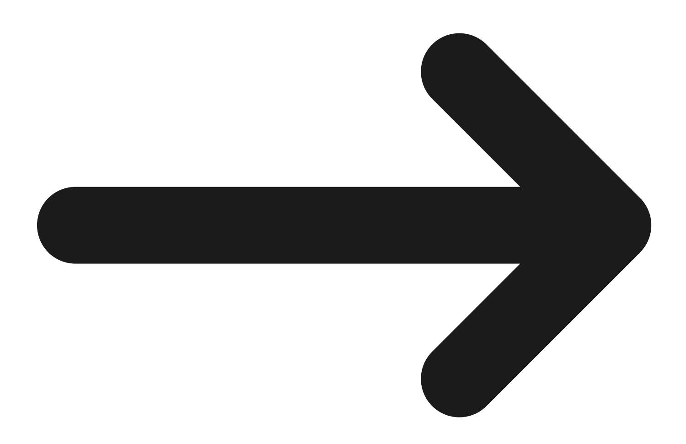
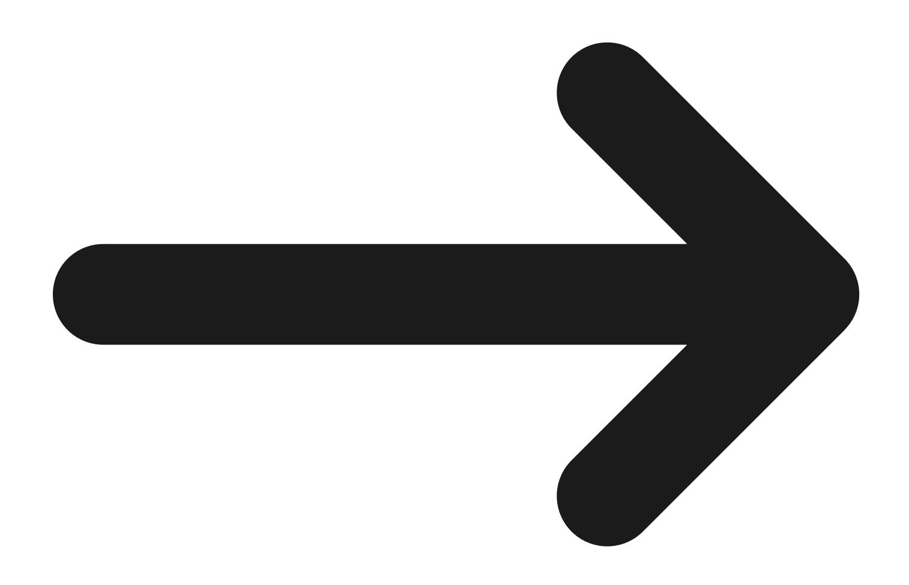

## Cross-Servicing

The Cross-Servicing program collects delinquent nontax debt owed to federal agencies. It is administered by the Bureau of the Fiscal Service's Disbursing and Debt Management area.

By law, federal agencies generally must refer delinquent debts to the Cross-Servicing program when the debt is between 60-days and 180-days delinquent. The agency referring the debt is responsible for:

- determining the amount of the debt (including any interest, penalties, and costs) and
- telling the Cross-Servicing program what tools may be used to collect the debt.

In most cases, the referring agency permits the Cross-Servicing program to set up payment arrangements with the debtor based on the debtor's ability to pay.

## The Cross-Servicing program uses a variety of tools to collect debts:

- sending demand letters,
- calling debtors,
- negotiating payment agreements,
- referring debts to the Department of Justice for litigation,
- reporting debts to credit bureaus,
- administratively garnishing wages,
- referring debts to private collection agencies,
- offsetting federal and state payments through the Treasury Offset Program,
- assisting with the resolution of disputes about the amount or existence of the debt.

More information about some of these tools is available on our website:

- [Administrative wage garnishment \(AWG\)](https://fiscal.treasury.gov/debt-management/administrative-wage-garnishment-awg/awg-background)
- [Private Collection Agencies \(PCAs\)](https://fiscal.treasury.gov/debt-management/cross-servicing/private-collection-agencies)
- [Treasury Offset Program \(TOP\)](https://fiscal.treasury.gov/debt-management/treasury-offset-program-top/)

Certain classes of debt are exempt from the Cross Servicing referral requirement. View a [list of](https://fiscal.treasury.gov/system/files/files/debt-management/cross-servicing-transfer-exemption-chart.pdf) [those exemptions.](https://fiscal.treasury.gov/system/files/files/debt-management/cross-servicing-transfer-exemption-chart.pdf)

## Resources

[Agency Profile Form](https://fiscal.treasury.gov/debt-management/cross-servicing/resources/resource-downloads#agencyprofile)

[Debtor Dispute Form](https://fiscal.treasury.gov/debt-management/cross-servicing/resources/resource-downloads#debtordispute)

[Claims Collection Litigation Report](https://fiscal.treasury.gov/debt-management/cross-servicing/resources/resource-downloads#cclr)

[Consumer & Commercial Debtor Financial Statements](https://fiscal.treasury.gov/debt-management/cross-servicing/resources/resource-downloads#ccdfs)

[Private Collection Agencies](https://fiscal.treasury.gov/debt-management/cross-servicing/private-collection-agencies)

[Legal Authorities](https://fiscal.treasury.gov/debt-management/cross-servicing/resources/legal-authorities)

[Make a Payment](https://fiscal.treasury.gov/debt-management/cross-servicing/resources/make-a-payment) 

[Debt Collection Resources for Cross-Servicing Debtors](https://fiscal.treasury.gov/debt-management/resources/guides-forms-downloads) 

## Need Help?

[Administrative](https://fiscal.treasury.gov/debt-management/cross-servicing/faq/faq-administrative-wage-garnishment) Wage [Garnishment](https://fiscal.treasury.gov/debt-management/cross-servicing/faq/faq-administrative-wage-garnishment) FAQs for individuals

[Administrative](https://fiscal.treasury.gov/debt-management/cross-servicing/faq/faq-administrative-wage-garnishment-employers) Wage Garnishment FAQs for [employers](https://fiscal.treasury.gov/debt-management/cross-servicing/faq/faq-administrative-wage-garnishment-employers)

[Cross-Servicing](https://fiscal.treasury.gov/debt-management/cross-servicing/faq/faq-cross-servicing) FAQs for Federal [Agencies](https://fiscal.treasury.gov/debt-management/cross-servicing/faq/faq-cross-servicing)

Cross [Servicing](https://fiscal.treasury.gov/debt-management/faqs/for-the-general-public) FAQs for [Debtors](https://fiscal.treasury.gov/debt-management/faqs/for-the-general-public)

[Contact](https://fiscal.treasury.gov/debt-management/cross-servicing/contact) Us

Last Updated: March 26, 2026