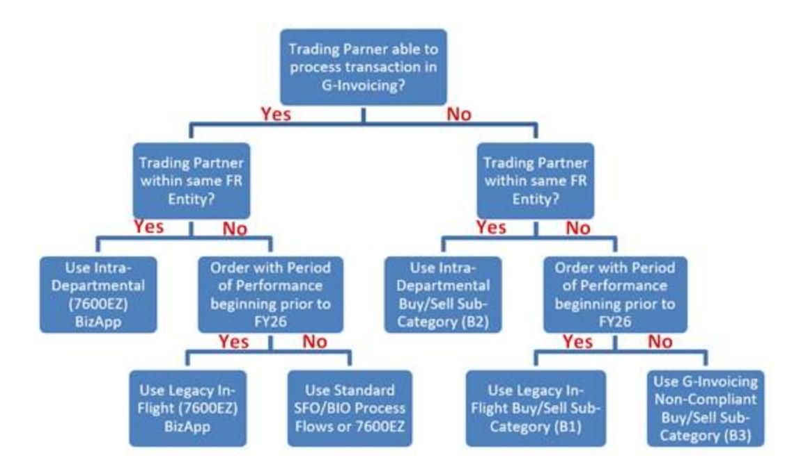

# Bulletin No. 2025-05

**Expiration Date:** December 31, 2025

**To:** Heads of Government Departments, Agencies, and Others Concerned

**Subject:** G-Invoicing Implementation Update

#### **1. Background**

Bureau of the Fiscal Service (Fiscal Service) established a mandate in the **Treasury [Financial](https://tfx.treasury.gov/tfm/volume1/part2/chapter-4700-federal-entity-reporting-requirements-financial-report-united-states) Manual [\(TFM\)](https://tfx.treasury.gov/tfm/volume1/part2/chapter-4700-federal-entity-reporting-requirements-financial-report-united-states)** for the use of G-Invoicing to facilitate Intra-governmental (IGT) Buy/Sell transactions by October 1, 2022.

**G-Invoicing and Intra-governmental Payment and Collection (IPAC) Implementation Update –** To support the G-Invoicing mandate, Fiscal Service has adopted a phased approach to implement system controls in the Intra-Governmental Payments and Collection (IPAC) system. IPAC facilitates the fund settlement stage and requires federal entities to categorize the type of Intra-Governmental Transactions (IGT) initiated through IPAC. As of October 1, 2025, the Buy/Sell Transfer IGT Sub-Category (Bulk File Code A1) will be removed as an option in the IPAC User Interface (UI) and for Bulk File transactions.

Fiscal Service continues to collaborate with federal entities regarding challenges associated with meeting the requirements for the removal of the Buy/Sell Transfer IGT Sub-Category code. The key challenges identified by the government-wide financial management community included In-Flight Orders, Intra-Departmental activity, and the delayed implementation of some New Order Activity. As a result, G-Invoicing implementation relief options have been established to ensure business activities can continue beyond the October 1, 2025, effective IPAC cut-off date for Buy/Sell Activity.

The relief options documented in this bulletin have been made available for agencies within the G-Invoicing and IPAC applications. Federal entities are strongly encouraged to ensure their Enterprise Resource Planning (ERP) providers are ready to consume the new relief options before implementation to help prevent potential integration challenges.

**Statutory Authorities –** The Bureau of Fiscal Service (Fiscal Service) has mandated the adoption and use of Government Invoicing (G-Invoicing) under the Chief Financial Officer Act of 1990 and the Federal Financial Management Improvement Act of 1996. G-Invoicing will replace the formal reimbursable agreement process for IGT Buy/Sell activity. G-Invoicing provides a common repository to improve the integrity and accuracy of IGT Buy/Sell activity. G-Invoicing will not only improve the quality of IGT Buy/Sell data but will also ameliorate reporting challenges and the government's ability to provide timely, accurate, and reliable financial information. Inadequate controls over the

accounting and reporting of these balances in the United States Standard General Ledger accounts significantly impedes the preparation of federal entities' financial statements and Treasury's preparation of the Financial Report of the United States Government. See Appendix A – Statutory Authorities.

#### **2. Authority**

The Department of the Treasury requires federal entities to use G-Invoicing under the following mandatory authorities:

- 31 U.S.C. § 331(e)(1) (Consolidated Government-wide Financial Report),
- 31 U.S.C. § 3512(b) (Executive Agency Accounting and Other Financial Management Reports and Plans),
- 31 U.S.C. § 3513 (Financial Reporting and Accounting System), and
- Office of Management and Budget, Office of Federal Financial Management and Controller Alert, 24-03 (July 15, 2024) (reminding Federal agencies that adoption of G‐Invoicing is required for all agencies no later than October 1, 2025).

#### **3. Federal Entity Relief Options**

As of October 1, 2025, the Buy/Sell Transfer IGT Sub-Category (Bulk File Code A1) will be removed as an option in the IPAC User Interface (UI) and for Bulk File transactions. Federal entities should begin phasing out the usage of the Buy/Sell Transfer IGT Sub-Category in IPAC and begin implementing the new relief options referenced below prior to October 1, 2025. A summary of the federal entity relief options is provided below along with a decision matrix to help agencies select the appropriate relief option.

# **Legacy In-Flight Buy/Sell Activity Relief Options**

- 1. IPAC Transaction Sub-Category: Legacy In-Flight Buy/Sell
  - Bulk File Code: B1
  - Federal entities should select this option in IPAC when the following conditions exist:
    - One or both trading partners are unable to facilitate the activity using G-Invoicing;
    - Buy/Sell Order with an external trading partner outside of their Financial Reporting Entity (FR Entity) as defined under TFM Chapter 4700, Appendix 1a; and
    - Order with a Period of Performance beginning before October 1, 2025.
- 2. G-Invoicing BizApp: Legacy In-Flight (7600EZ)
  - Federal entities should select this option in G-Invoicing when the following conditions exist:

- Both trading partners are using G-Invoicing and agree to facilitate activity through 7600EZ;
- Buy/Sell Agreement with an external trading partner outside of their FR Entity as defined under TFM Chapter 4700, Appendix 1a; and
- Order with a Period of Performance beginning before October 1, 2025.

#### **Intra-Departmental Buy/Sell Relief Options**

- 1. IPAC Transaction Sub-Category: Intra-Departmental Buy/Sell
  - Bulk File Code: B2
  - Federal entities should select this option in IPAC when the following conditions exist:
    - Trading partner is not using G-Invoicing, or they are unable to facilitate transactions in G-Invoicing; and
    - Buy/Sell activity occurring between two TAS within the same FR Entity as defined under TFM Chapter 4700, Appendix 1a.
- 2. G-Invoicing BizApp: Intra-Departmental (7600EZ)
  - Federal entities should select this option in G-Invoicing when the following conditions exist:
    - Trading partner is using G-Invoicing and capable of processing 7600EZ; and
    - Buy/Sell activity occurring between two TAS within the same FR Entity as defined under TFM Chapter 4700, Appendix 1a.

#### **G-Invoicing Non-Compliant Buy/Sell Relief Option**

- 1. IPAC Transaction Sub-Category: G-Invoicing Non-Compliant Buy/Sell
  - Bulk File Code: B3
  - Federal entities should select this option in IPAC when the following conditions exist:
    - One or both trading partners are unable to facilitate the activity using G-Invoicing or are unable to leverage the other relief options;
    - Buy/Sell Agreement with an external trading partner outside of their FR Entity as defined under TFM Chapter 4700, Appendix 1a; and
    - Order with a Period of Performance beginning on or after October 1, 2025.

#### **Federal Entity Relief Options Decision Matrix**

#### **4. Streamlined Approach to Fund Settlement (7600EZ) Update**

The standard 7600EZ process includes a per transaction threshold of \$10,000. Transactions greater than this amount will not be included in this streamlined process flow and would follow the established Order processes in G-Invoicing. Some federal entity business lines have been granted an exclusion to this \$10,000 per transaction threshold. Treasury encourages federal entities to leverage 7600EZ for the following business lines:

- GSA Fleet Leasing,
- GSA Global Supplies, and
- DLA Materiel Transactions.

**Note:** Government Publishing Office (GPO) has been removed from this list. Upon further evaluation and following discussions with their customers, GPO has determined that they will not be utilizing the 7600EZ functionality for their print and publishing business line.

#### **5. Agency Activities Essential to Fulfill Statutory Purpose**

As federal entities review their activities to determine which are deemed essential (i.e., those that are essential to fulfill a statutory purpose), Fiscal Service reaffirms its previously provided Treasury Financial Manual guidance that G-Invoicing is mandatory for agencies to implement in order for Treasury to fulfill its statutory duties.

#### **Treasury Financial Manual, Volume 1, Part 2, Chapter 4700, Section 4715**

Section 405 of the Government Management Reform Act of 1994 [31 U.S.C. 331(e)(1)] requires that the Secretary of the Treasury annually prepare and submit to the President and the Congress an

audited financial statement for the preceding Fiscal Year. This statement must cover all accounts and associated activities of the executive branch of the Federal Government. Section 114(a) of the Budget and Accounting Procedures Act of 1950 [31 U.S.C. 3513(a)] requires each executive branch agency to furnish financial and operational information as the Secretary of the Treasury may stipulate.

# **Treasury Financial Manual, Volume 1, Part 2, Chapter 4700, Appendix 8 – Intra-governmental Transactions Buy/Sell**

As G-Invoicing is implemented, its use will be required by all federal entities for all IGT Buy/Sell activity involving Reciprocal Categories 22, 23 and 24. Fiscal Service requires federal entities to use G-Invoicing under the authority of 31 U.S.C. 3512(b) and 3513.

#### **6. References**

For additional details, please refer to Fiscal Service's **[G-Invoicing](https://www.fiscal.treasury.gov/g-invoice/)** website and the G-Invoicing Program Guide.

#### **7. Effective Date**

This bulletin is effective immediately.

#### **8. Inquiries**

Direct questions concerning this bulletin to (email is preferred over a mailed request):

General Ledger & Intragovernmental Transaction Division

Bureau of the Fiscal Service Department of the Treasury PO Box 1328 Parkersburg, WV 26106-1328 Telephone: 304-480-6485

Email: **[IGT@fiscal.treasury.gov](mailto:IGT@fiscal.treasury.gov)**

Date: April 30, 2025

#### Appendix A

#### **Department of the Treasury's Statutory Responsibilities**

## *31 U.S.C. 331(e)(1)*

*Not later than March 31 of 1998 and each year thereafter, the Secretary of the Treasury, in coordination with the Director of the Office of Management and Budget, shall annually prepare and submit to the President and the Congress an audited financial statement for the preceding fiscal year, covering all accounts and associated activities of the executive branch of the United States Government. The financial statement shall reflect the overall financial position, including assets and liabilities, and results of operations of the executive branch of the United States*

*Government, and shall be prepared in accordance with the form and content requirements set forth by the Director of the Office of Management and Budget.*

#### *31 U.S.C. 3512(b)*

*The head of each executive agency shall establish and maintain systems of accounting and internal controls that provide-*

- 1. *Complete disclosure of financial results of the activities of the agency;*
- 2. *Adequate financial information the agency needs for management purposes;*
- 3. *Effective control over, and accountability for, assets for which the agency is responsible, including internal audit;*
- 4. *Reliable accounting results that will be the basis for-*
  - A. *Preparing and supporting the budget requests of the agency;*
  - B. *Controlling the carrying out of the agency budget; and*
  - C. *Providing financial information the President requires under section 1104(e) of this title; and*
- 5. *Suitable integration of the accounting of the agency with the central accounting and reporting responsibilities of the Secretary of Treasury under section 3513 of this title.*

## *31 U.S.C 3513*

*(a)The Secretary of the Treasury shall prepare reports that will inform the President, Congress, and the public on the financial operations of the United States Government. The reports shall include financial information the President requires. The head of each executive agency shall give the Secretary reports and information on the financial conditions and operations of the agency the Secretary requires to prepare the reports.*

- *(b) The Secretary may -*
  - 1. *Establish facilities necessary to prepare the reports; and*
  - 2. *Reorganize the accounting functions and procedures and financial reports of the Department of the Treasury to develop an effective and coordinated system of accounting and financial reporting in the Department that will integrate the accounting results for the Department and be the operating center for consolidating accounting results of other executive agencies with accounting results of the Department.*

### *Statutes Regarding the Executive Branch Agency Responsibilities*

Agencies have numerous unique financial management statutory provisions that may govern accounting, reporting and auditing of Buy/Sell transactions. This Bulletin should not be relied upon as a comprehensive list of authorities.

#### *Chief Financial Officers Act of 1990* (*Public Law 101-576)*

*Section 102 (b) Purposes – The purposes of this Act are the following:*

- 1. *Bring more effective general and financial management practices to the Federal Government through statutory provisions which would establish in the Office of Management and Budget a Deputy Director for Management, establish an Office of Federal Financial Management headed by a Controller, and designate a Chief Financial Officer in each executive department and in each major executive agency in the Federal Government.*
- 2. *Provide for improvement, in each agency of the Federal Government, of systems of accounting, financial management, and internal controls to assure the issuance of reliable financial information and to deter fraud, waste, and abuse of the Government.*
- 3. *Provide for the production of complete, reliable, timely, and consistent financial information for use by the executive branch of the Government and the Congress in the financing, management, and evaluation of Federal programs.*

# *Federal Financial Management Improvement Act of 1996 (FFMIA) Pub. L. 104-208 (31 U.S.C. 3512 note)*

Section 802 (b) Purpose – The purposes of this Act are to:

- 1. Provide for consistency of accounting by an agency from one fiscal year to the next, and uniform accounting standards throughout the Federal Government;
- 2. Require Federal financial management systems to support full disclosure of Federal financial data, including the full costs of Federal programs and activities, to the citizens, the Congress, the President, and agency management so that programs and activities can be considered based on their full costs and merits;
- 3. Increase the accountability and credibility of federal financial management;
- 4. Improve performance, productivity and efficiency of Federal Government financial management;
- 5. Establish financial management systems to support controlling the cost of Federal Government;
- 6. Build upon and complement the Chief Financial Officers Act of 1990; and
- 7. Increase the capability of agencies to monitor execution of the budget by more readily permitting reports that compare spending of resources to results of activities.

Section 803 (a) In General – Each agency shall implement and maintain financial management systems that comply substantially with Federal financial management systems requirements, applicable Federal accounting standards, and the United Statements Government Standard General Ledger at the transaction level