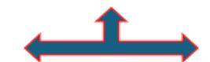
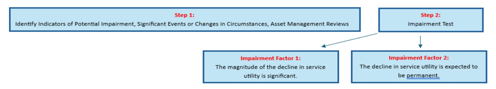

# **PROPERTY, PLANT, & EQUIPMENT (PP&E) REMOVED FROM SERVICE DISPOSAL AND IMPAIRMENT**

**EFFECTIVE FISCAL YEAR 2026**

#### **PREPARED BY:**

**GENERAL LEDGER AND ADVISORY BRANCH BUREAU OF THE FISCAL SERVICE U.S. DEPARTMENT OF THE TREASURY**

| Version Number | Date       | Description of Change                                                                                                                                                                                                                                             | Effective USSGL TFM                                     |
|----------------|------------|-------------------------------------------------------------------------------------------------------------------------------------------------------------------------------------------------------------------------------------------------------------------|---------------------------------------------------------|
| 1.0            | 06/06/2011 | Original                                                                                                                                                                                                                                                          |                                                         |
| 2.0            | 05/03/2012 | Updated per release of FASAB Technical Release (TR) 14, Implementation Guidance on the Accounting for the Disposal of General Property, Plant, and Equipment                                                                                                | S2-12-03                                                |
| 3.0            | 09/01/2025 | Updated per clarifying guidance from: • Statement of Federal Financial Accounting Standards (SFFAS) 44, Accounting for Impairment of General Property, Plant, and Equipment Remaining in Use.                                                         | Treasury Financial Manual (TFM) Bulletin No. 2026-02 |
|                |            | In addition, updated per new guidance from: • Interpretation 9, Cleanup Cost Liabilities Involving Multiple Component Reporting Entities; • SFFAS 59, Land; and • TR 21, Omnibus Technical Release Amendments 2022: Conforming Amendments |                                                         |

# **Background**

Throughout the performance of business activities, a federal entity's PP&E may be shut down, closed off, and/or removed from service. "Removal from service" is defined as an event that terminates the use of a PP&E asset, occurring because of events such as changes in the manner or duration of use, changes in technology, obsolescence, damage by natural disaster, or simply identification as excess to the entity's mission and needs. The removal from service should generally be considered "Other Than Permanent", unless there is supporting documentation for management's decision to permanently remove the asset from service, and the asset's use is in fact terminated. Permanent removal from service is evident from management's documented decision to dispose of an asset by selling, scrapping, recycling, donating or demolishing the asset. An entity's policies and procedures should require documentation of management's decisions to permanently remove an asset from service. (Technical Release 14, Par. 8)

The distinction between *Permanent* and *Temporary / Other Than Permanent* removal from service is critical because accounting requirements differ for each type. In order for removal to be considered permanent, two business events are necessary:

- 1. The asset's use is terminated.
- 2. Management maintains documented evidence of its decision to permanently remove, retire and/or dispose of the asset.

If only one of two business events occurs, the removal from service would be considered Temporary / Other Than Permanent. (TR 14, Par. 10)

#### **Accounting for Permanent Removal from Service and Subsequent Disposal of PP&E**

- When an asset's use is terminated and permanently removed, retired, or disposed, its acquisition cost and corresponding accumulated depreciation are removed from the PP&E balance and the asset is reclassified to USSGL 199500, "*General Property, Plant, and Equipment Permanently Removed but Not Yet Disposed*" at its net realizable value. USSGL 199500 crosswalks to the "Other Assets" line of the Balance Sheet, since the asset has been permanently removed from service and no longer provides service utility in the same way as functioning PP&E. An offsetting entry is made to USSGL 719000 "*Other Gains*" or USSGL 729000 "*Other Losses*."
- No additional depreciation should be taken once such assets are removed from PP&E in anticipation of disposal, retirement, or removal from service.
- When the asset disposition/sale is completed, the entity should write off the asset's balance. Any difference between the expected net realizable value of the PP&E previously recorded in USSGL 199500, and the actual proceeds of the sale amount should be recognized as a *Gain/Loss on*  Disposition of Assets (USSGLs 711000 or 721000.)
- When PP&E assets are removed from service, deferred maintenance and repair (DM&R) estimates as defined and required by SFFAS 40 and SFFAS 42, respectively, should be re-estimated to the extent such estimated costs are related to the G-PP&E assets removed from service. (TR 21, Par. 24)

Page **3** of **26 January 2026**

#### Accounting for Temporary / Other Than Permanent Removal From Service of PP&E

- When removal from service is temporary, there is no change in the PP&E value and depreciation continues as normal to the extent it is not impaired. (TR 14, Paragraph 14) Examples of temporary removal from service might also include activities such as continuing low-level maintenance to sustain the asset. (TR 14, Par. 9)
- While depreciation should continue on the PP&E, entities should consider whether the removal from service is related to asset impairment and impairment indicators exist. (See SFFAS 44, TR 21)
- To the extent any portion of a G-PP&E asset is not disposed of, or otherwise continues to remain in service, entities should also consider if additional DM&R information, such as changes in DM&R exclusions, is necessary for disclosure. (TR 21, Par. 14)

#### Impairment of PP&E Remaining in Use

Entities generally hold PP&E because of the services it provides or is expected to provide in the future. Standard maintenance and repair requirements falling within the PP&E's expected useful life are considered normal and ordinary. In addition, PP&E experiencing decreases in utilization are not necessarily considered impaired. For example, the current usable capacity of PP&E may be less than its original capacity due to normal declines in useful life, impairing events, or changes in circumstances.

Conversely, impairments are **significant** and **permanent** declines in the service utility of PP&E caused by events or changes in circumstances that would not have been (a) expected to occur during the useful life of the PP&E at the time of acquisition, or (b) if expected, sufficiently predictable to be factored into the PP&E useful life calculation.

Federal entities are not required to conduct annual or periodic surveys solely for the purpose of ensuring there are no impaired assets. However, indications of potential impairment may be revealed by the following routine assessments: operational and functional capacity; the ability to meet mission requirements; impacts of significant events or changes in circumstances; and deferred maintenance and repair needs. When indicators of potential impairment are identified, testing should be performed.

#### **Potential Impairment Indicators**

Some existing processes that may identify indicators for potential impairment include: routine assessments regarding the continued operational and functional PP&E capacity; examining the agency mission requirements; impacts of significant events or changes in circumstances; and deferred maintenance and repairs. Discoveries from these processes may indicate the need for further impairment testing.

Entities should perform due diligence and thoroughly consider service utility circumstances to determine whether a test of potential impairment is necessary. Common indicators (non-conclusive evidence) of potential impairment include:

- o Evidence of physical damage;
- o New legislation or regulations which limit or restrict PP&E usage;
- o Changes in environmental or economic factors, such as technological changes or evidence of obsolescence;
- o Construction stoppage or contract termination; and
- o PP&E idled or unserviceable for excessively long periods.

Page 4 of 26 January 2026

#### **Accounting for Impairment Losses**

Impairment losses on PP&E remaining in use should be estimated using a method that reasonably reflects the diminished service utility of the PP&E. The portion of the net book value associated with the diminished service utility should be reasonably estimated.

• When management concludes that impairment is (1) a significant decline in service utility, and (2) expected to be permanent, the Impairment loss should be recognized and reported in the Statement of Net Cost in USSGL 729200 Other Losses From Impairment of Assets.

# **Diminished Service Utility Without Recognizing An Impairment Loss**

If future service utility has been adversely affected but the impairment test reveals that a loss need not be recognized, changes may still be made to the asset's estimated useful life and/or salvage value.

• A change to the estimates used in depreciation calculations, such as estimated useful life and salvage value, should be considered and documented. (SFFAS 44, Par. 22)

#### **Cleanup Costs**

Recognition of cleanup expenses and projected cleanup liabilities begins on the date that the PP&E is placed into service. It continues in each period that PP&E is in operation and is completed when the PP&E ceases to operate. (TR 14, Pars. 6 & 15)

- When assets are permanently removed from service, any unamortized portion of the total cleanup cost estimate associated with the disposal, closure, and/or shutdown of the PP&E should be recognized in full.
- If removal is Other Than Permanent, the liability and associated cleanup cost expense shall continue to accumulate. (TR 14, Par, 14)

In some cases, PP&E requiring cleanup may be sold/transferred to another federal component reporting entity after being removed from service. At that time, the cleanup liability would be transferred with the related asset to the component reporting entity responsible for the liability. The entity transferring the general PP&E should ensure supporting documentation for the estimated cleanup costs is provided to the receiving entity. (See Interpretation 9, *Cleanup Cost Liabilities Involving Multiple Component Reporting Entities*, Par. A14)

Page **5** of **26 January 2026**

#### **Disclaimer**

The intent of this scenario is to illustrate the main concepts of PP&E removed from service and the measurement of impairment losses from significant and permanent declines in PP&E service utility. While it shows examples within the PP&E accounting series of permanent removal and other than permanent removal from service and/or impairment, it is not intended to be all inclusive of the different types of gains/losses or other expenses that may be recorded.

Budgetary and financial reports reflect the pertinent lines to be reported based on the main concepts illustrated. For full presentations of the reports and line descriptions, refer to the appropriate authoritative guidance (e.g., OMB Circular No. A-136: *Financial Reporting Requirements*, OMB Circular No. A-11: *Preparing, Submitting, and Executing the Budget*, and Treasury Financial Manual references.)

#### **Key Assumptions within This Scenario**

- The scenario applies only to capitalized PP&E and does not include Heritage Assets, Stewardship Assets, or Land/Permanent Land Rights.
- The Treasury Account Symbol (TAS) is a no-year fund and is a discretionary program.
- Both Equipment A and Equipment B were purchased with a five-year useful life and a \$0 salvage value.
- The straight-line depreciation method is used.
- The total estimated cleanup cost associated with purchased equipment is estimated to be \$5,000 for Equipment A and \$7,500 for Equipment B.
- The entity uses the "replacement approach" to measure the impairment loss and directly writes down the asset's historical cost as a result of the impairment from physical damage.

Page **6** of **26 January 2026**

#### Removal of PP&E from Service - An event (shut-down, etc.) terminates the use of PP&E.

If BOTH business events have occurred, the asset is permanently removed from service.

#### **Business Event:**

1) Asset's use is terminated

#### **Business Event:**

2) Evidence of management's decision to permanently remove, retire and/or dispose the asset.

The asset is reclassified to USSGL 199500 at its net realizable value with offsetting gain (USSGL 719000 – Other Gains) or loss (USSGL 729000- Other Losses) (See TR 14, Pars. 5 & 10.)

Once asset is disposed, any difference between the net realizable value and the realized disposition amount should be recognized as a Gain (USSGL 711000 – Gain on Disposition of Assets- Other) or a Loss (721000- Loss on Disposition of Assets- Other) (See TR 14, Par. 12.)

If only 1 (or none) of the business events have occurred, the asset is considered other than permanently removed from service.

For other than permanently removed PP&E, entities may need to identify potential impairment indicators and test for impairment, if the event or change in circumstance are not considered normal and ordinary. At the time the PP&E was acquired, the event/change in circumstance would not have been (a) expected to occur during the useful life or, (b) if expected, sufficiently predictable to be considered in estimating its useful life.

A loss from impairment should be recognized in USSGL 729200 when management concludes that the impairment is (1) a significant decline in service utility and (2) expected to be permanent.

Whether an impairment loss is recognized or not, if future service utility has been adversely affected, changes to the estimates used in future depreciation expense calculations (estimated useful life, salvage value, etc.) should be considered. (See SFFAS 44, Par. 22)

Page 7 of 26 January 2026

#### **Listing of USSGL Accounts Used in This Scenario:**

| Account Number | Account Title                                                                   |
|----------------|---------------------------------------------------------------------------------|
| Budgetary      |                                                                                 |
| 411900         | Other Appropriations Realized                                                   |
| 420100         | Total Actual Resources - Collected                                           |
| 426600         | Other Actual Business-Type Collections from Non-Federal Sources                 |
| 445000         | Unapportioned - Unexpired Authority                                          |
| 451000         | Apportionments                                                                  |
| 461000         | Allotments - Realized Resources                                              |
| 480100         | Undelivered Orders - Obligations, Unpaid                                     |
| 490100         | Delivered Orders - Obligations, Unpaid                                       |
| 490200         | Delivered Orders - Obligations, Paid                                         |
| Proprietary    |                                                                                 |
| 101000         | Fund Balance With Treasury                                                      |
| 175000         | Equipment                                                                       |
| 175900         | Accumulated Depreciation on Equipment                                           |
| 199500         | General Property, Plant, and Equipment Permanently Removed but Not Yet Disposed |
| 211000         | Accounts Payable                                                                |
| 299500         | Estimated Cleanup Cost Liability                                                |
| 310000         | Unexpended Appropriations - Cumulative                                       |
| 310100         | Unexpended Appropriations - Appropriations Received                          |
| 310700         | Unexpended Appropriations - Used - Accrued                                |
| 310710         | Unexpended Appropriations - Used - Disbursed                              |
| 331000         | Cumulative Results of Operations                                                |
| 570000         | Expended Appropriations - Used - Accrued                                  |
| 570010         | Expended Appropriations - Disbursed                                          |
| 671000         | Depreciation, Amortization, and Depletion                                       |
| 680000         | Future Funded Expenses                                                          |
| 721000         | Losses on Disposition of Assets - Other                                      |
| 729000         | Other Losses                                                                    |
| 729200         | Other Losses From Impairment of Assets                                          |
| 880100         | Offset for Purchases of Assets                                                  |
| 880200         | Purchases of Property, Plant, and Equipment                                     |

Page **8** of **26 January 2026**

# **Accounting for PP&E Permanently Removed From Service and Disposed, or Recognized as Impaired Year 1 Entries**

| 1. The federal entity records the enactment of appropriations of \$50,000.                                    |        |        |      |
|------------------------------------------------------------------------------------------------------------------------------|--------|--------|------|
|                                                                                                                              | Debit  | Credit | TC   |
| Budgetary Entry 411900 Other Appropriations Realized 445000 Unapportioned - Unexpired Authority                        | 50,000 | 50,000 | A104 |
| Proprietary Entry 101000 (G) Fund Balance With Treasury 310100 (G) Unexpended Appropriations – Appropriations Received | 50,000 | 50,000 | A104 |

| 2. The federal entity records budget authority apportioned by the Office of Management and Budget and available for allotment. |        |        |      |
|--------------------------------------------------------------------------------------------------------------------------------------|--------|--------|------|
|                                                                                                                                      | Debit  | Credit | TC   |
| Budgetary Entry 445000 Unapportioned - Unexpired Authority 451000 Apportionments                                               | 50,000 | 50,000 | A116 |
| Proprietary Entry None                                                                                                            |        |        |      |

| 3. The federal entity records the allotment of authority.                       |        |        |      |
|------------------------------------------------------------------------------------|--------|--------|------|
|                                                                                    | Debit  | Credit | TC   |
| Budgetary Entry 451000 Apportionments 461000 Allotments - Realized Resources | 50,000 | 50,000 | A120 |
| Proprietary Entry None                                                          |        |        |      |

Page **9** of **26 January 2026**

| 4. The federal entity records current-year undelivered orders without an advance for the purchase of equipment. |        |        |      |
|--------------------------------------------------------------------------------------------------------------------------|--------|--------|------|
|                                                                                                                          | Debit  | Credit | TC   |
| Budgetary Entry 461000 Allotments - Realized Resources 480100 Undelivered Orders - Obligations, Unpaid             | 50,000 | 50,000 | B306 |
| Proprietary Entry None                                                                                                |        |        |      |

5a. The federal entity records the delivery and acceptance of Equipment A for \$20,000 and Equipment B for \$30,000. Both purchases exceed the entity's capitalization threshold and are capitalized as PP&E assets in Year 1.

|                                                                                                                     | Debit  | Credit | TC   |
|---------------------------------------------------------------------------------------------------------------------|--------|--------|------|
| Budgetary Entry 480100 Undelivered Orders - Obligations, Unpaid 490100 Delivered Orders - Obligations, Unpaid | 50,000 | 50,000 | B402 |
| Proprietary Entry 175000 Equipment 211000 (N) Accounts Payable                                                | 50,000 | 50,000 | B402 |
| 310700 Unexpended Appropriations - Used - Accrued 570000 Expended Appropriations - Used - Accrued                | 50,000 | 50,000 | B134 |

| 5b. As part of the purchase of Equipment in Year 1, the federal entity records activity for current-year purchases of equipment. |        |        |      |
|----------------------------------------------------------------------------------------------------------------------------------------|--------|--------|------|
|                                                                                                                                        | Debit  | Credit | TC   |
| Budgetary Entry None                                                                                                                |        |        |      |
| Proprietary Entry 880200 (N) Purchases of Property, Plant, and Equipment 880100 (N) Offset for Purchases of Assets            | 50,000 | 50,000 | G120 |

Page **10** of **26 January 2026**

6. At the end of Year 1, the entity records depreciation expense for the equipment. Equipment A's depreciation is calculated at \$20,000/ 5 years useful life with no salvage value = \$4,000 annual expense. Equipment B's depreciation is calculated at \$30,000/ 5 years useful life with no salvage value = \$6,000 annual expense. The annual depreciation for both pieces of equipment is \$10,000.

|                                                  | Debit  | Credit | TC   |
|--------------------------------------------------|--------|--------|------|
| Budgetary Entry                                  |        |        |      |
| None                                             |        |        |      |
|                                                  |        |        |      |
| Proprietary Entry                                |        |        |      |
| 671000 Depreciation, Amortization, and Depletion | 10,000 |        | E120 |
| 175900 Accumulated Depreciation on Equipment     |        | 10,000 |      |

7. At the end of Year 1, the entity records the total estimated cleanup costs associated with Equipment A and Equipment B. The entity determined the useful life of both pieces of equipment to be 5 years, and it systematically recognizes cleanup cost expense and the accumulation of cleanup cost liability over the 5-year useful life. Equipment A's cleanup cost is estimated at \$1,000 per year, while Equipment B's cleanup is estimated at \$1,500 per year. The annual estimated cleanup cost for both pieces of equipment is \$2,500.

|                                                | Debit | Credit | TC   |
|------------------------------------------------|-------|--------|------|
| Budgetary Entry                                |       |        |      |
| None                                           |       |        |      |
| Proprietary Entry                              |       |        |      |
| 680000 (N) Future Funded Expenses           | 2,500 |        | B420 |
| 299500 (N) Estimated Cleanup Cost Liability |       | 2,500  |      |
|                                                |       |        |      |

Page **11** of **26 January 2026**

|                                                                                                                                                                                                           | Debit            | Credit           | TC   |
|-----------------------------------------------------------------------------------------------------------------------------------------------------------------------------------------------------------|------------------|------------------|------|
| Budgetary Entry 490100 Delivered Orders - Obligations, Unpaid 490200 Delivered Orders - Obligations, Paid                                                                                           | 50,000           | 50,000           | B110 |
| Proprietary Entry 211000 (N) Accounts Payable 101000 (G) Fund Balance With Treasury                                                                                                                 | 50,000           | 50,000           | B110 |
| 310710 Unexpended Appropriations - Used - Disbursed 570000 Expended Appropriations - Used - Accrued 310700 Unexpended Appropriations - Used - Accrued 570010 Expended Appropriations - Disbursed | 50,000 50,000 | 50,000 50,000 | B235 |

Page **12** of **26 January 2026**

| YEAR 1 PRE-CLOSING TRIAL BALANCE |                                                        |         |         |  |
|----------------------------------|--------------------------------------------------------|---------|---------|--|
| Account                          | Description                                            | Debit   | Credit  |  |
| Budgetary                        |                                                        |         |         |  |
| 411900                           | Other Appropriations Realized                          | 50,000  | -       |  |
| 490200                           | Delivered Orders - Obligations, Paid                | -       | 50,000  |  |
| Total                            |                                                        | 50,000  | 50,000  |  |
|                                  |                                                        |         |         |  |
| Proprietary                      |                                                        |         |         |  |
| 101000 (G)                       | Fund Balance With Treasury                             | -       | -       |  |
| 175000                           | Equipment                                              | 50,000  | -       |  |
| 175900                           | Accumulated Depreciation on Equipment                  | -       | 10,000  |  |
| 299500 (N)                       | Estimated Cleanup Cost Liability                       | -       | 2,500   |  |
| 310100 (G)                       | Unexpended Appropriations - Appropriations Received | -       | 50,000  |  |
| 310710 (G)                       | Unexpended Appropriations - Used - Disbursed     | 50,000  | -       |  |
| 570010 (G)                       | Expended Appropriations - Disbursed                 | -       | 50,000  |  |
| 671000                           | Depreciation, Amortization, and Depletion              | 10,000  | -       |  |
| 680000 (N)                    | Future Funded Expenses                                 | 2,500   | -       |  |
| 880100 (N)                    | Offset for Purchases of Assets                         | -       | 50,000  |  |
| 880200 (N)                    | Purchases of Property, Plant, and Equipment            | 50,000  | -       |  |
| Total                            |                                                        | 162,500 | 162,500 |  |

Page **13** of **26 January 2026**

#### **Year 1 Closing Entries:**

| 9. The federal entity records the closing of expenses to cumulative results of operations.                                                      |        |                 |      |
|-------------------------------------------------------------------------------------------------------------------------------------------------------|--------|-----------------|------|
|                                                                                                                                                       | Debit  | Credit          | TC   |
| Budgetary Entry None                                                                                                                               |        |                 |      |
| Proprietary Entry 331000 Cumulative Results of Operations 671000 Depreciation, Amortization, and Depletion 680000 (N) Future Funded Expenses | 12,500 | 10,000 2,500 | F336 |
| 570010 Expended Appropriations - Disbursed 331000 Cumulative Results of Operations                                                                 | 50,000 | 50,000          | F336 |
| 310000 Unexpended Appropriations - Cumulative 310710 Unexpended Appropriations - Used - Disbursed                                                  | 50,000 | 50,000          | F342 |
| 310100 (G) Unexpended Appropriations - Appropriations Received 310000 Unexpended Appropriations - Cumulative                                       | 50,000 | 50,000          | F342 |

| 10. The federal entity records the closing of memorandum accounts for asset purchases.                                   |        |        |      |
|-----------------------------------------------------------------------------------------------------------------------------|--------|--------|------|
|                                                                                                                             | Debit  | Credit | TC   |
| Budgetary Entry None                                                                                                     |        |        |      |
| Proprietary Entry 880100 (N) Offset for Purchases of Assets 880200 (N) Purchases of Property, Plant, and Equipment | 50,000 | 50,000 | F370 |

Page **14** of **26 January 2026**

| 11. The federal entity records the closing of paid delivered orders to total actual resources.              |        |        |      |
|-------------------------------------------------------------------------------------------------------------|--------|--------|------|
|                                                                                                             | Debit  | Credit | TC   |
| Budgetary Entry 490200 Delivered Orders - Obligations, Paid 420100 Total Actual Resources - Collected | 50,000 | 50,000 | F314 |
| Proprietary Entry None                                                                                   |        |        |      |

| 12. The federal entity records the consolidation of actual net-funded resources.                     |        |        |      |
|------------------------------------------------------------------------------------------------------|--------|--------|------|
|                                                                                                      | Debit  | Credit | TC   |
| Budgetary Entry 420100 Total Actual Resources - Collected 411900 Other Appropriations Realized | 50,000 | 50,000 | F302 |
| Proprietary Entry None                                                                            |        |        |      |

Page **15** of **26 January 2026**

| YEAR 1 POST-CLOSING TRIAL BALANCE |                                       |        |        |  |
|-----------------------------------|---------------------------------------|--------|--------|--|
| Account                           | Description                           | Debit  | Credit |  |
| Budgetary                         |                                       |        |        |  |
|                                   |                                       |        |        |  |
| Total                             |                                       | -      | -      |  |
|                                   |                                       |        |        |  |
| Proprietary                       |                                       |        |        |  |
| 175000                            | Equipment                             | 50,000 | -      |  |
| 175900                            | Accumulated Depreciation on Equipment | -      | 10,000 |  |
| 299500 (N)                        | Estimated Cleanup Cost Liability      | -      | 2,500  |  |
| 331000                            | Cumulative Results of Operations      | -      | 37,500 |  |
| Total                             |                                       | 50,000 | 50,000 |  |

Page **16** of **26 January 2026**

# **Year 2 Entries**

# **Equipment A & Equipment B continue to perform at normal service utility during Year 2**

1. At the end of Year 2, the entity records depreciation expense for the equipment. Equipment A's depreciation is calculated at \$20,000/ 5 years useful life with no salvage value = \$4,000 annual expense. Equipment B's depreciation is calculated at \$30,000/ 5 years useful life with no salvage value = \$6,000 annual expense. The annual depreciation for both pieces of equipment is \$10,000.

|                                                                                                  | Debit  | Credit | TC   |
|--------------------------------------------------------------------------------------------------|--------|--------|------|
| Budgetary Entry                                                                                  |        |        |      |
| None                                                                                             |        |        |      |
| Proprietary Entry                                                                                |        |        |      |
| 671000 Depreciation, Amortization, and Depletion 175900 Accumulated Depreciation on Equipment | 10,000 | 10,000 | E120 |

2. At the end of Year 2, the entity records the total estimated cleanup costs associated with the purchased Equipment A and Equipment B. The entity determined the useful life of both pieces of equipment to be 5 years and systematically recognizes cleanup cost expense and the accumulation of cleanup cost liability over the 5-year useful life. Equipment A's cleanup cost is estimated at \$1,000 per year, while Equipment B's cleanup is estimated at \$1,500 per year. The annual estimated cleanup cost for both pieces of equipment is \$2,500.

|                                                | Debit | Credit | TC   |
|------------------------------------------------|-------|--------|------|
| Budgetary Entry                                |       |        |      |
| None                                           |       |        |      |
| Proprietary Entry                              |       |        |      |
| 680000 (N) Future Funded Expenses              | 2,500 |        | B420 |
| 299500 (N) Estimated Cleanup Cost Liability |       | 2,500  |      |
|                                                |       |        |      |

Page **17** of **26 January 2026**

| YEAR 2 PRE-CLOSING TRIAL BALANCE |                                           |        |        |
|----------------------------------|-------------------------------------------|--------|--------|
| Account                          | Description                               | Debit  | Credit |
| Budgetary                        |                                           |        |        |
|                                  |                                           |        |        |
| Total                            |                                           | -      | -      |
|                                  |                                           |        |        |
| Proprietary                      |                                           |        |        |
| 175000                           | Equipment                                 | 50,000 | -      |
| 175900                           | Accumulated Depreciation on Equipment     | -      | 20,000 |
| 299500 (N)                       | Estimated Cleanup Cost Liability          | -      | 5,000  |
| 331000                           | Cumulative Results of Operations          | -      | 37,500 |
| 671000                           | Depreciation, Amortization, and Depletion | 10,000 | -      |
| 680000 (N)                       | Future Funded Expenses                    | 2,500  | -      |
| Total                            |                                           | 62,500 | 62,500 |

Page **18** of **26 January 2026**

#### **Year 2 Closing Entries:**

| 3. The federal entity records the closing of expenses to cumulative results of operations.                                                      |        |                 |      |
|-------------------------------------------------------------------------------------------------------------------------------------------------------|--------|-----------------|------|
|                                                                                                                                                       | Debit  | Credit          | TC   |
| Budgetary Entry None                                                                                                                               |        |                 |      |
| Proprietary Entry 331000 Cumulative Results of Operations 671000 Depreciation, Amortization, and Depletion 680000 (N) Future Funded Expenses | 12,500 | 10,000 2,500 | F336 |

| YEAR 2 POST-CLOSING TRIAL BALANCE |                                       |        |        |
|-----------------------------------|---------------------------------------|--------|--------|
| Account                           | Description                           | Debit  | Credit |
| Budgetary                         |                                       |        |        |
|                                   |                                       |        |        |
| Total                             |                                       | -      | -      |
|                                   |                                       |        |        |
| Proprietary                       |                                       |        |        |
| 175000                            | Equipment                             | 50,000 | -      |
| 175900                            | Accumulated Depreciation on Equipment | -      | 20,000 |
| 299500 (N)                        | Estimated Cleanup Cost Liability      | -      | 5,000  |
| 331000                            | Cumulative Results of Operations      | -      | 25,000 |
| Total                             |                                       | 50,000 | 50,000 |

Page **19** of **26 January 2026**

# **Year 3 Entries**

#### **Equipment A - Permanent Removal From Service and Subsequent Disposal (Sale)**

1. During Year 3, Equipment A (originally purchased in Year 1) broke down and the asset use is terminated. Entity management decides to permanently remove Equipment A from service and maintains documentation to support its decision. Equipment A's acquisition cost and accumulated depreciation are removed from the PP&E account and is reclassified to Other Assets (USSGL 199500) at its net realizable value with an offsetting loss. (TR 14, Paragraph 12)

Equipment A's net realizable value was determined to be \$5,000. The acquisition cost of Equipment A in Year 1 was \$20,000 and its accumulated depreciation balance at the time of permanent removal was \$8,000. An offsetting loss of \$7,000 is recorded in USSGL 729000, as the equipment has not yet been disposed.

No spare parts or sub-components are salvaged from Equipment A for other uses.[1](#page-19-0) (TR 14, Paragraph 13)

|                                                                                                                                                                                                            | Debit                   | Credit | TC   |
|------------------------------------------------------------------------------------------------------------------------------------------------------------------------------------------------------------|-------------------------|--------|------|
| Budgetary Entry None                                                                                                                                                                                    |                         |        |      |
| Proprietary Entry 199500 General Property, Plant, and Equipment Permanently Removed but Not Yet Disposed 175900 Accumulated Depreciation on Equipment 729000 (N) Other Losses 175000 Equipment | 5,000 8,000 7,000 | 20,000 | C613 |

2. Equipment A's remaining estimated cleanup cost is recognized in full. (\$5,000 total estimated cleanup costs at the time of purchase - \$2,000 accrued Cleanup Cost Liability in Years 1 & 2 = \$3,000 remaining estimated cleanup cost to be recognized in full at permanent removal from service.)

In addition, the entity determines that funding for cleanup will be provided in the next fiscal year and the cleanup will commence at that time. For assets permanently removed from service, the cleanup cost liability associated with the disposal, closure, and/or shutdown of the PP&E should be recognized in full. (TR 14, Par. 15)

|                                                | Debit | Credit | TC   |
|------------------------------------------------|-------|--------|------|
| Budgetary Entry                                |       |        |      |
| None                                           |       |        |      |
|                                                |       |        |      |
| Proprietary Entry                              |       |        |      |
| 680000 (N) Future Funded Expenses              | 3,000 |        | B420 |
| 299500 (N) Estimated Cleanup Cost Liability |       | 3,000  |      |

1 If during the permanent removal process, the asset is disassembled and spare parts or sub-components are salvaged to be used for other purposes, the spare parts or subcomponents should be recorded as new and separate assets in accordance with SFFAS 6 and SFFAS 3, *Accounting for Inventory and Related Property*.

Page **20** of **26 January 2026**

3. During Year 3, the entity exercises its statutory authority to sell PP&E to non-federal entities and completes the sale of Equipment A for \$4,000 to a nonfederal entity. Upon completion of the sale, the entity writes off Equipment A, with differences between the net realizable value and the actual sale amount recognized as a gain/loss. (TR 14, Paragraph 12)

In this sale, the actual disposition amount of Equipment A is less than the estimated net realizable value previously recorded in Transaction #2, so a Loss on Disposition is reported.

|                                                                                                                                                                                                            | Debit          | Credit | TC   |
|------------------------------------------------------------------------------------------------------------------------------------------------------------------------------------------------------------|----------------|--------|------|
| Budgetary Entry 426600 Other Actual Business-Type Collections from Non-Federal Sources2 445000 Unapportioned - Unexpired Authority                                                                   | 4,000          | 4,000  |      |
| Proprietary Entry 101000 (G) Fund Balance with Treasury 721000 (N) Losses on Disposition of Assets - Other 199500 General Property, Plant, and Equipment Permanently Removed but Not Yet Disposed | 4,000 1,000 | 5,000  | C615 |

Page **21** of **26 January 2026**

2 This particular example assumes the sale of equipment was unanticipated and no anticipated collections were previously recorded. If anticipated, USSGL 406000 would be credited within Transaction #3, and other appropriate entries (i.e., TC A123 for anticipated authority) would be recorded.

#### **Equipment B - Other Than Permanently Removed PP&E With A Decline in Service Utility Expected to be Permanent (Impairment)**

4. During Year 3, Equipment B experiences a significant and permanent decline in service utility and entity management identifies evidence of physical damage as an indicator of potential impairment. During impairment testing, management confirms the decline in service level is significant and is expected to be permanent; Thus, an impairment loss should be recognized. (SFFAS 44, Par. 16) Entity management decides to keep Equipment B in service rather than permanently remove it, and the entity recognizes the impairment loss.

Impairment losses on PP&E remaining in service should be estimated using a method that reasonably reflects the PP&E's diminished service utility (SFFAS 44, Pars. 18-19) In this instance, the entity uses the "Replacement approach" to measure impairment and identifies the portion of the equipment's historical cost to be written off based off the lost service utility. It estimates an impairment loss of \$8,000 with a corresponding reduction in the equipment's book value.

|                                                                        | Debit | Credit | TC   |
|------------------------------------------------------------------------|-------|--------|------|
| Budgetary Entry                                                        |       |        |      |
| None                                                                   |       |        |      |
|                                                                        |       |        |      |
| Proprietary Entry                                                      |       |        |      |
| 729200 (N) Other Losses From Impairment of Assets 175000 Equipment3 | 8,000 | 8,000  | C613 |
|                                                                        |       |        |      |

Entity management should exercise judgement to determine the most appropriate approach to reasonably estimate the portion of the net book value associated with the diminished service utility/impairment. One measurement approach may not be appropriate for measuring all impairments; A specific method would not be considered appropriate if the remaining service utility of the G-PP&E reflects an unreasonable net book value. For descriptions of measurement methods and further details, see SFFAS 44, Par. 18.

Page **22** of **26 January 2026**

3 In this example, the entity uses the "Replacement approach" to measure the impairment loss and directly writes down Equipment B's historical cost as a result of the impairment from physical damage. Other measurement approaches, such as the "Depreciated current cost approach", might more accurately reflect impairment indicators other than physical damage (such as changes in environmental factors, technological changes, obsolescence, etc.) and provide a better estimate of loss in the PP&E's service utility. Depending on the designated measurement approach, entities have flexibility to credit SGL 175900 "*Accumulated Depreciation on Equipment"*, rather than decrease the historical cost in SGL 175000 "*Equipment*." (See also Transaction Code C613 in the USSGL TFM Supplement.)

5. Equipment B remains in service during Year 3. Due to the impairment loss recognized in Transaction #4, the entity reassesses the depreciation calculations for Equipment B. Depreciation should continue on PP&E kept in service, to the extent not impaired. (TR 14, Par. 10)[4](#page-22-0)

After the impairment loss is recognized, Equipment B's new net book value is \$10,000 (\$30,000 Acquisition Cost - \$12,000 Accumulated Depreciation - \$8,000 Impairment Loss = \$10,000.) The estimated useful life remains at 5 years, with 3 years remaining. Accordingly, the entity recalculates its annual straight-line depreciation expense for Equipment B at \$10,000/ 3 years useful life with no salvage value = \$3,333.

|                                                                                                  | Debit | Credit | TC   |
|--------------------------------------------------------------------------------------------------|-------|--------|------|
| Budgetary Entry                                                                                  |       |        |      |
| None                                                                                             |       |        |      |
|                                                                                                  |       |        |      |
| Proprietary Entry                                                                                |       |        |      |
| 671000 Depreciation, Amortization, and Depletion 175900 Accumulated Depreciation on Equipment | 3,333 | 3,333  | E120 |
|                                                                                                  |       |        |      |

6. Equipment B remains in service during Year 3. Despite the impairment loss recognized in Transaction #4, the entity continues its recognition of projected cleanup cost expenses. Any cleanup costs associated with closure and/or shutdown should continue to accumulate as a liability. (TR 14, Par. 10)[5](#page-22-1)

The entity had determined the useful life to be 5 years with no changes to the estimated cleanup cost or useful life after impairment. Therefore, the entity continues to systematically recognize cleanup cost expense and the accumulation of cleanup cost liability at \$1,500 per year.

| Debit | Credit | TC   |
|-------|--------|------|
|       |        |      |
|       |        |      |
|       |        |      |
| 1,500 |        | B420 |
|       | 1,500  |      |
|       |        |      |

Page **23** of **26 January 2026**

4 To the extent any portion of a PP&E asset is not disposed of, retired, or otherwise continues to remain in service, entities should refer to SFFAS 40 & SFFAS 42 to determine if additional Deferred Maintenance and Repair (DM&R) information, such as changes in DM&R exclusions, is necessary to be disclosed. (TR 21, Par. 24)

| YEAR 3 PRE-CLOSING TRIAL BALANCE |                                                                 |        |        |
|----------------------------------|-----------------------------------------------------------------|--------|--------|
| Account                          | Description                                                     | Debit  | Credit |
| Budgetary                        |                                                                 |        |        |
| 426600                           | Other Actual Business-Type Collections from Non-Federal Sources | 4,000  | -      |
| 445000                           | Unapportioned - Unexpired Authority                          | -      | 4,000  |
| Total                            |                                                                 | 4,000  | 4,000  |
|                                  |                                                                 |        |        |
| Proprietary                      |                                                                 |        |        |
| 101000 (G)                       | Fund Balance With Treasury                                      | 4,000  | -      |
| 175000                           | Equipment                                                       | 22,000 | -      |
| 175900                           | Accumulated Depreciation on Equipment                           | -      | 15,333 |
| 299500 (N)                       | Estimated Cleanup Cost Liability                                | -      | 9,500  |
| 331000                           | Cumulative Results of Operations                                | -      | 25,000 |
| 671000                           | Depreciation, Amortization, and Depletion                       | 3,333  | -      |
| 680000 (N)                       | Future Funded Expenses                                          | 4,500  | -      |
| 721000                           | Losses on Disposition of Assets - Other                      | 1,000  | -      |
| 729000                           | Other Losses                                                    | 7,000  | -      |
| 729200                           | Other Losses From Impairment of Assets                          | 8,000  | -      |
| Total                            |                                                                 | 49,833 | 49,833 |

Page **24** of **26 January 2026**

#### **Year 3 Closing Entries:**

|                                                    | and losses to cumulative results of operations. |        |      |
|----------------------------------------------------|-------------------------------------------------|--------|------|
|                                                    | Debit                                           | Credit | TC   |
| Budgetary Entry                                    |                                                 |        |      |
| None                                               |                                                 |        |      |
|                                                    |                                                 |        |      |
| Proprietary Entry                                  |                                                 |        |      |
| 331000 Cumulative Results of Operations            | 7,833                                           |        | F336 |
| 671000 Depreciation, Amortization, and Depletion   |                                                 | 3,333  |      |
| 680000 (N) Future Funded Expenses                  |                                                 | 4,500  |      |
|                                                    |                                                 |        |      |
| 331000 Cumulative Results of Operations            | 16,000                                          |        | F340 |
| 721000 (N) Losses on Disposition of Assets - Other |                                                 | 1,000  |      |
| 729000 (N) Other Losses                            |                                                 | 7,000  |      |
| 729200 (N) Other Losses From Impairment of Assets  |                                                 | 8,000  |      |

| 8. The federal entity records the consolidation of actual net-funded resources.                                                     |       |        |      |  |
|----------------------------------------------------------------------------------------------------------------------------------------|-------|--------|------|--|
|                                                                                                                                        | Debit | Credit | TC   |  |
| Budgetary Entry 420100 Total Actual Resources - Collected 426600 Other Actual Business-Type Collections from Non-Federal Sources | 4,000 | 4,000  | F302 |  |
| Proprietary Entry None                                                                                                              |       |        |      |  |

Page **25** of **26 January 2026**

| YEAR 3 POST-CLOSING TRIAL BALANCE |                                        |        |        |  |
|-----------------------------------|----------------------------------------|--------|--------|--|
| Account                           | Description                            | Debit  | Credit |  |
| Budgetary                         |                                        |        |        |  |
| 420100                            | Total Actual Resources - Collected  | 4,000  | -      |  |
| 445000                            | Unapportioned - Unexpired Authority | -      | 4,000  |  |
| Total                             |                                        | 4,000  | 4,000  |  |
|                                   |                                        |        |        |  |
| Proprietary                       |                                        |        |        |  |
| 101000 (G)                        | Fund Balance With Treasury          | 4,000  | -      |  |
| 175000                            | Equipment                              | 22,000 | -      |  |
| 175900                            | Accumulated Depreciation on Equipment  | -      | 15,333 |  |
| 299500 (N)                        | Estimated Cleanup Cost Liability       | -      | 9,500  |  |
| 331000                            | Cumulative Results of Operations       | -      | 1,167  |  |
| Total                             |                                        | 26,000 | 26,000 |  |

Page **26** of **26 January 2026**