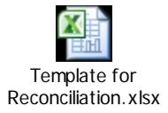

# **Guide for Accounting and Reporting of Exchange Stabilization Fund (ESF) Fair Market Value for Foreign Currency and Investments**

Effective Fiscal 2017

**Jointly Prepared By:**

Page **1** of **87 Financial Reporting and Policy Office Deputy Chief Financial Officer**

# **U.S. Department of the Treasury**

# **And**

**United States Standard General Ledger Advisory Division Governmentwide Accounting Bureau of the Fiscal Service**

| Version Number | Date | Description of      | Effective USSGL | Effective Date |
|----------------|------|---------------------|-----------------|----------------|
|                |      | Change              | TFM             |                |
| 1.0            |      | Initial Version     |                 | FY 2012        |
| 2.0            |      | Revised for 463500  |                 | FY 2014        |
| 3.0            |      | Revised BETC and |                 | FY 2017        |
|                |      | add new USSGL       |                 |                |
|                |      | 426800, Modified    |                 |                |
|                |      | titles and          |                 |                |
|                |      | descriptions for    |                 |                |
|                |      | 719100 and 729100   |                 |                |

## *Introduction*

ESF now holds certain foreign currency securities at fair value. In October of 2008, ESF deemed that its Other Foreign Currency Denominated Assets and Long Term Investments should be classified from Held-To-Maturity to Available-For-Sale Securities. As a result of the change in classification of securities, ESF had to conform to the FASB standard FAS 157 (effective November 2007), which provided that Available-For-Sale securities must be carried at fair value. ESF is providing the following scenario in order to comply with the adopted GAAP/FASB principles and standards.

The Special Drawing Rights Act of 1968 (P.L. 90-349) provides that SDRs allocated by the International Monetary Fund (IMF) or otherwise acquired by the United States (U.S.) are resources of the Treasury's Exchange Stabilization Fund (ESF). SDRs are reserve assets allocated to participating members of the IMF to meet a global need to supplement existing reserve assets. SDRs derive their quality as reserve assets from the undertakings of the members to accept them in exchange for "freely useable" currencies (The U.S. dollar, European Euro, Japanese Yen, and U.K. sterling). U.S. Government holdings in SDRs were obtained from IMF allocations issued between 1970 -1981 and through the net of SDR acquisitions and sales. SDR Holdings are shown as an asset item in the ESF financial records and SDR Allocations are shown as a liability item.

## *Proposed New USSGL Accounts*

**Account Title:** Interest Collected From Foreign Securities and Special Drawing Rights (SDR)

**Account Number:** 426800 **Normal Balance:** Debit

**Definition:** The amount of interest collected during the fiscal year from foreign securities. The amount of the net change consisting of interest, charges and assessments related to SDR's. Although the normal balance in this account is a debit, it is acceptable in certain instances for this account to have a credit balance when a loss is recognized. This USSGL account is to be used only by the Department of the Treasury.

**Justification:** The Exchange Stabilization Fund is now incurring negative interest in their foreign investments.

## *Modify USSGL Accounts*

**Account Title:** Gains for Exchange Stabilization Fund (ESF) Accrued Interest and Charges

**Account Number:** 719100 **Normal Balance:** Credit

**Definition:** When the Special Drawing Right (SDR) and foreign exchange rates change, accrued SDR interest/charges and accrued interest on foreign securities reflect a gain in the following circumstances: if the SDR-USD, Euro-USD, or Yen-USD exchange rate increases, a gain is recorded on SDR accrued interest and accrued interest on foreign securities as applicable; if the SDR-USD exchange rate decreases, a gain is recorded on accrued SDR charges. This USSGL account is to be used only by the Department of Treasury.

**Justification:** To expand on the definition.

**Account Title:** Losses for Exchange Stabilization Fund (ESF) Accrued Interest and Charges

**Account Number:** 729100 **Normal Balance:** Debit

**Definition:** When the Special Drawing Right (SDR) and foreign exchange rates change, accrued SDR interest/charges and accrued interest on foreign securities reflect a loss in the following circumstances: if the SDR-USD, Euro-USD, or Yen-USD exchange rate decreases, a loss is recorded on SDR accrued interest and accrued interest on foreign securities as applicable; if the SDR-USD exchange rate increases, a loss is recorded in SDR accrued charges. This USSGL account is to be used only by the Department of Treasury.

**Justification:** To expand on the definition.

## **Listing of USSGL accounts used in this scenario**:

| Account Number | Account Titles                                                                               |
|----------------|----------------------------------------------------------------------------------------------|
| Budgetary      |                                                                                              |
| 420100         | Total Actual Resources - Collected                                                        |
| 426600         | Other Actual Business-Type Collections From Non-Federal Sources                              |
| 426800         | Interest Collected From Foreign Securities and Special Drawing Rights                     |
| 427300         | Interest Collected From Treasury                                                             |
| 429500         | Adjustment to the Exchange Stabilization Fund                                                |
| 462000         | Unobligated Funds Exempt from Apportionment                                                  |
| 463500         | Funds Not Available - Adjustments to the Exchange Stabilization Fund                      |
| 490100         | Delivered Orders – Obligations, Unpaid                                                    |
| 497100         | Downward Adjustment of Prior-Year Unpaid Delivered Orders – Obligations, Recoveries |
| 498100         | Upward Adjustment of Prior-Year Delivered Orders – Obligations, Unpaid                 |
| Proprietary    |                                                                                              |
| 119400         | Exchange Stabilization Fund Assets – Holdings of Special Drawing Rights                   |
| 120000         | Foreign Currency                                                                             |
| 120500         | Foreign Currency Denominated Equivalent Assets                                         |
| 120900         | Uninvested Foreign Currency                                                                  |
| 131000         | Accounts Receivable                                                                          |
| 134200         | Interest Receivable - Investments                                                         |
| 134400         | Interest Receivable on Special Drawing Rights                                                |
| 138400         | Interest Receivable - Foreign Currency Denominated Assets                              |
| 161000         | Investments in U.S. Treasury Securities Issued by Bureau of the Fiscal Service               |
| 162000         | Investments in Securities Other than Bureau of the Fiscal Service Securities              |
| 162100         | Discount on Securities Other than Bureau of the Fiscal Service Securities                 |
| 162200         | Premium on Securities Other than Bureau of the Fiscal Service Securities               |

| Account Number | Account Titles                                                                      |
|----------------|-------------------------------------------------------------------------------------|
| 167000         | Foreign Investments                                                                 |
| 167100         | Discount on Foreign Investments                                                  |
| 167200         | Premium on Foreign Investments                                                      |
| 167900         | Foreign Exchange Rate Revalue Adjustment – Investments                        |
| 211000         | Accounts Payable                                                                    |
| 214000         | Accrued Interest Payable – Not Otherwise Classified                              |
| 219200         | Special Drawing Right (SDR) Certificates Issued to Federal Reserve Banks            |
| 219300         | Allocation of Special Drawing Rights (SDRs)                                      |
| 298500         | Liability for Non-Entity Assets Not Reported on the Statement of Custodial Activity |
| 310000         | Unexpended Appropriations – Cumulative                                        |
| 331000         | Cumulative Results of Operations                                                    |
| 531100         | Interest Revenue – Investments                                                   |
| 531200         | Interest Revenue – Loans Receivable/Uninvested Funds                             |
| 575000         | Expenditure Financing Sources – Transfers-In                                     |
| 576000         | Expenditure Financing Sources – Transfer- Out                              |
| 579000         | Other Financing Sources                                                             |
| 590000         | Other Revenue                                                                       |
| 599300         | Offset to Non-Entity Collections – Statement of Changes in Net Position          |
| 599400         | Offset to Non-Entity Accrued Collections – Statement of Changes in Net Position  |
| 610000         | Operating Expenses/Program Costs                                                    |
| 633000         | Other Interest Expense                                                              |
| 633800         | Remuneration Interest                                                               |
| 718100         | Unrealized Gains – Exchange Stabilization Fund                                   |
| 719000         | Other Gains                                                                         |
| 719100         | Gains for Exchange Stabilization Fund (ESF) Accrued Interest and Charges            |
| 728100         | Unrealized Losses – Exchange Stabilization Fund                                  |
| 729000         | Other Losses                                                                        |
| 729100         | Losses for Exchange Stabilization Fund (ESF) Accrued Interest and Charges           |

# Attribute Table:

| USSGL Acct. | USSGL Account Title                                                         | Anticip ated | Budg /Prop | Norm Bal | Begin /End | Debit/ Credit | Auth Type Code | Apport Cat | Apport Cat B |
|----------------|-----------------------------------------------------------------------------|-----------------|---------------|-------------|---------------|------------------|----------------------|---------------|-----------------|
| 426800         | Interest Collected From Foreign Securities and Special Drawing Rights | N               | B             | D           | E             | D/C              |                      |               |                 |

| USSGL  | Avail   | BEA | Budgetary |       | Cohort    | Cust/   |      | Exch/     | Fed/   | Trading   |     |        | Trading | PY    | Program   |
|--------|---------|-----|-----------|-------|-----------|---------|------|-----------|--------|-----------|-----|--------|---------|-------|-----------|
| Acct.  | Time    | Cat | Impact    |       | Yr        | Noncust |      | Nonexch   | NonFed | Ptnr      |     |        | Pntr    | Adj   | Indicator |
|        |         |     | Indicator |       |           |         |      |           |        |           |     |        | Main    |       |           |
| 426800 |         | M   |           |       |           |         |      |           |        |           |     |        |         | B/P/X |           |
| USSGL  | Program |     | Reimb     | Year  | Reduction |         | Fund | Reporting |        | Financing | TAS |        | Trans   |       |           |
| Acct.  | Rpt Cat |     | Flag      | of BA | Type      |         | Type | Type Code |        | Account   |     | Status | Code    |       |           |
|        |         |     |           |       |           |         |      |           |        | Code      |     |        |         |       |           |
| 426800 |         |     |           |       |           |         | EP   | U         |        | N         |     | U      | N       |       |           |

| USSGL Account | SF 133     | Schedule P | Bal Sheet | Stmt of Net Cost | Stmt of Changes in Net Pos | Stmt of Cust Activ | Stmt of Budg Res | Reclass Stmts |
|------------------|---------------|---------------|--------------|------------------------|----------------------------------|--------------------------|------------------------|------------------|
| 426800           | Lines 1020 | Lines 1020 |              |                        |                                  |                          | Lines 1890          |                  |
|                  | 1800 4123  | 1800 4123  | N/A          | N/A                    | N/A                              | N/A                      | 4176 4187           | N/A              |

# **Beginning Balance Trial Balance FY 2014**

|                                                             | Debit              | Credit             |
|-------------------------------------------------------------|--------------------|--------------------|
| Budgetary                                                   |                    |                    |
| 420100 Total Actual Resources – Collected                | 41,391,632,169.54  |                    |
| 429500 Adjustment to the Exchange Stabilization Fund        | 61,168,249,494.62  |                    |
| 463500 Funds Not Available - Adjustments to the Exchange |                    | 41,391,632,169.54  |
| Stabilization Fund                                          |                    |                    |
| 490100 Delivered Orders – Obligations, Unpaid            |                    | 61,168,249,494.62  |
| TOTAL                                                       | 102,559,881,664.16 | 102,559,881,664.16 |

Page **8** of **87** 

| Proprietary                                                         |                    |                    |
|---------------------------------------------------------------------|--------------------|--------------------|
| 119400 (N) Exchange Stabilization Fund Assets – Holdings for     | 57,945,186,222.87  |                    |
| Special Drawing Rights                                              |                    |                    |
| 120000 (N) Foreign Currency                                         | 13,692,267,445.20  |                    |
| 120900 (N) Uninvested Foreign Currency (TIER Subaccount)            | 54,422.48          |                    |
| 134200 (N) Interest Receivable - Investments                  | 128,296,752.59     |                    |
| 134400 (N) Interest Receivable on Special Drawing Rights (TIER      | 15,795,991.45      |                    |
| Subaccount)                                                         |                    |                    |
| 138400 (N) Interest Receivable - Foreign Currency Denominated | 8,999,924.36       |                    |
| Assets (TIER Subaccount)                                         |                    |                    |
| 161000 (F) Investments in U.S. Treasury Securities Issued by        | 18,614,997,252.97  |                    |
| Bureau of Fiscal Service                                            |                    |                    |
| 162000 (N) Investments in Securities Other than Bureau of Fiscal | 12,246,224,127.80  |                    |
| Service Securities                                               |                    |                    |
| 162100 (N) Contra Discount on Securities Other than Bureau of       |                    | 17,509,381.33      |
| Fiscal Service                                                      |                    |                    |
| 162200 (N) Premium on Securities Other than Bureau of Fiscal        | 78,661,574.17      |                    |
| Service                                                             |                    |                    |
| 211000 (N) Accounts Payable                                         |                    | 227,983.23         |
| 214000 (N) Accrued Interest Payable – Not Otherwise Classified   |                    | 14,916,301.70      |
| 219200 (N) Special Drawing Right (SDR) Certificates Issued to       |                    | 5,200,000,000.00   |
| Federal Reserve Banks (TIER Subaccount)                             |                    |                    |
| 219300 (N) Allocation of Special Drawing Rights (SDRs) (TIER  |                    | 55,953,105,209.69  |
| Subaccount)                                                         |                    |                    |
| 310000 Unexpended Appropriations - Cumulative                 |                    | 200,000,000.00     |
| 331000 Cumulative Results of Operations                             |                    | 41,344,724,837.94  |
| TOTAL                                                               | 102,730,483,713.80 | 102,730,483,713.80 |

# **Foreign Investments**

## 1. To record the moving of investments from 162000 to 167000. (TC D600)

|                                                        | Debit             | Credit            |
|--------------------------------------------------------|-------------------|-------------------|
| Budgetary Entry                                     |                   |                   |
| None                                                   |                   |                   |
| Proprietary Entry                                   |                   |                   |
| 167000 (N) Foreign Investments                      | 12,246,224,127.80 |                   |
| 162000 (N) Investments in Securities Other than the |                   |                   |
| Bureau of Fiscal Service Securities                 |                   | 12,246,224,127.80 |

## 2. To record the moving of discounts on investments from 162100 to 167100. (TC D600)

|                                                               | Debit         | Credit        |
|---------------------------------------------------------------|---------------|---------------|
| Budgetary Entry                                               |               |               |
| None                                                          |               |               |
| Proprietary Entry                                             |               |               |
| 162100 (N) Discount on Securities Other than Bureau of the | 17,509,381.33 |               |
| Fiscal Service Securities                                  |               |               |
| 167100 (N) Discount on Foreign Investments                 |               | 17,509,381.33 |

## 3. To record the moving of premiums on investments from 162200 to 167200. (TC D600)

|                                                | Debit         | Credit        |
|------------------------------------------------|---------------|---------------|
| Budgetary Entry                                |               |               |
| None                                           |               |               |
| Proprietary Entry                              |               |               |
| 167200 (N) Premium on Foreign Investments   | 78,661,574.17 |               |
| 162200 (N) Premium on Securities Other than |               |               |
| Bureau of Fiscal Service                       |               | 78,661,574.17 |

4. To record the moving of previous foreign exchange rate adjustments from 167000 to 167900. (TC D601)

|                                                             | Debit          | Credit         |
|-------------------------------------------------------------|----------------|----------------|
| Budgetary Entry                                             |                |                |
| None                                                        |                |                |
| Proprietary Entry                                           |                |                |
| 167900 (N) Foreign Exchange Rate Revalue Adjustment – |                |                |
| Investments                                                 | 212,884,417.22 |                |
| 167000 (N) Foreign Investments                           |                | 212,884,417.22 |

5. To record the moving of previous foreign exchange rate adjustment from 120000 to 167900 for FIXBIS (Fixed rate investment with the Bank of International Settlement) securities. (TC D603)

|                                                | Debit        | Credit       |
|------------------------------------------------|--------------|--------------|
| Budgetary Entry                                |              |              |
| None                                           |              |              |
| Proprietary Entry                              |              |              |
| 120000 (N) – Foreign Currency            | 1,065,432.36 |              |
| 167900 (N) Foreign Exchange Rate Revalue |              |              |
| Adjustment – Investments                 |              | 1,065,432.36 |

6. To record the moving of foreign currency equivalents excluding the FIXBIS securities from 120000 to 120500. (TC D600)

|                                                       | Debit             | Credit            |
|-------------------------------------------------------|-------------------|-------------------|
| Budgetary Entry                                       |                   |                   |
| None                                                  |                   |                   |
|                                                       |                   |                   |
| Proprietary Entry                                     |                   |                   |
| 120500 (N) Foreign Currency Denominated Equivalent |                   |                   |
| Assets                                                | 10,891,202,012.84 |                   |
| 120000 (N) – Foreign Currency                   |                   | 10,891,202,012.84 |

7. To record the moving of FIXBIS securities from 120000 to 167000. (TC D600)

|                                      | Debit            | Credit           |
|--------------------------------------|------------------|------------------|
| Budgetary Entry                      |                  |                  |
| None                                 |                  |                  |
| Proprietary Entry                    |                  |                  |
| 167000 (N) Foreign Investments | 2,802,130,864.72 |                  |
| 120000 (N) – Foreign Currency  |                  | 2,802,130,864.72 |

8. To record fair value adjustments of investments (unrealized gain). (TC D592) **(224 Subclass 24 USSGL 167900 RT7 973, GTAS INVNONFEDSEC, and Subclass 04 USSGL 718100)**

|                                                                                                                                                       | Debit        | Credit       |
|-------------------------------------------------------------------------------------------------------------------------------------------------------|--------------|--------------|
| Budgetary Entry 429500 Adjustment to the Exchange Stabilization Fund                                                                            | 5,000,000.00 |              |
| 463500 Funds Not Available - Adjustments to the Exchange Stabilization Fund                                                                  |              | 5,000,000.00 |
| Proprietary Entry 167900 (N) Foreign Exchange Rate Revalue Adjustment – Investments 718100 (N) Unrealized Gains – Exchange | 5,000,000.00 |              |
| Stabilization Fund                                                                                                                                    |              | 5,000,000.00 |

9. To record fair value of investments (unrealized loss). (TC D594) **(224 Subclass 24USSGL 167900 RT7 973, GTAS INVNONFEDSEC, and Subclass 04 USSGL 728100)**

|                                                                                                                                                                           | Debit        | Credit       |
|---------------------------------------------------------------------------------------------------------------------------------------------------------------------------|--------------|--------------|
| Budgetary Entry 463500 Funds Not Available – Adjustments to the Exchange Stabilization Fund 429500 Adjustment to the Exchange Stabilization Fund     | 3,000,000.00 | 3,000,000.00 |
| Proprietary Entry 728100 (N) Unrealized Losses – Exchange Stabilization Fund 167900 (N) Foreign Exchange Rate Revalue Adjustment – Investments | 3,000,000.00 | 3,000,000.00 |

10a. To record maturity (to be reinvested immediately) of non-federal securities (long-term bonds) sold at a PAR and receive coupon[1](#page-13-0) . (TC C127 - Mod) **(224 Subclass 41, USSGL 120900, FACTS II RT7 921, GTAS FHOT, and 224 subclass 24, USSGL 167000, FACTS II RT7 973, GTAS INVNONFEDSEC, and Subclass 08, USSGL 134200).** 

|                                                                                | Debit          | Credit         |
|--------------------------------------------------------------------------------|----------------|----------------|
| Budgetary Entry 426800 Interest Collected From Foreign Securities and |                |                |
| Special Drawings Rights                                                        | 7,578,750.00   |                |
| 463500 Funds Not Available - Adjustments to the                          |                |                |
| Exchange Stabilization Fund                                                    |                | 7,578,750.00   |
| Proprietary Entry                                                              |                |                |
| 120900 (N) Uninvested Foreign Currency                                   | 148,578,750.00 |                |
| 134200 (N) Interest Receivable – Investments                          |                | 7,578,750.00   |
| 167000 (N) Foreign Investments                                              |                | 141,000,000.00 |

1 A **coupon** payment on a [bond](http://en.wikipedia.org/wiki/Bond_(finance)) is a periodic interest payment that the bondholder receives during the time between when the bond is issued and when it matures.

10b. To record realized gain due to foreign exchange rate changes between purchase and maturity (to be reinvested immediately) of non-Federal securities (longterm bonds). (TC D575) **(224 Subclass 24, USSGL 167900, FACTS II RT7 973, GTAS INVNONFEDSEC, and 224 subclass 4, USSGL 719000)** 

|                                                                                                                                                                    | Debit        | Credit       |
|--------------------------------------------------------------------------------------------------------------------------------------------------------------------|--------------|--------------|
| Budgetary Entry 429500 Adjustment to the Exchange Stabilization Fund 463500 Funds Not Available – Adjustments to the Exchange Stabilization Fund | 1,000,000.00 | 1,000,000.00 |
| Proprietary Entry 167900 (N) Foreign Exchange Rate Revalue Adjustment – Investments 719000 (N) Other Gains                                          | 1,000,000.00 | 1,000,000.00 |

10c. To record realized loss due to foreign exchange rate changes between purchase and maturity (to be reinvested immediately) of non-Federal securities (longterm bonds). (TC D573) **(224 Subclass 24, USSGL 167900, FACTS II RT7 973, GTAS INVNONFEDSEC, and 224 subclass 4, USSGL 729000)** 

|                                                                   | Debit      | Credit     |
|-------------------------------------------------------------------|------------|------------|
| Budgetary Entry                                                   |            |            |
| 463500 Funds Not Available – Adjustments to the Exchange |            |            |
| Stabilization Fund                                                | 500,000.00 |            |
| 429500 Adjustment to the Exchange Stabilization Fund        |            | 500,000.00 |
| Proprietary Entry                                                 |            |            |
| 729000 (N) Other Gains                                         | 500,000.00 |            |
| 167900 (N) Foreign Exchange Rate Revalue Adjustment –       |            |            |
| Investments                                                       |            | 500,000.00 |

11a. To record purchase of non-federal securities (long-term bonds) at premium/discount. (TC B153) **(224 Subclass 24, USSGLs 167000, 167100, 167200, FACTS II RT7 973, GTAS INVNONFEDSEC, and Subclass 41, USSGL 120900, FACTS II RT7 921, GTAS FHOT, and Subclass 08, USSGL 134200, 531100)**

|                                                    | Debit          | Credit         |
|----------------------------------------------------|----------------|----------------|
| Budgetary Entry                                    |                |                |
| None                                               |                |                |
| Proprietary Entry                                  |                |                |
| 167000 (N) Foreign Investments               | 161,750,000.00 |                |
| 134200 (N) Interest Receivable – Investments | 1,687,583.90   |                |
| 167200 (N) Premium on Foreign Investments       | 6,502,125.00   |                |
| 120900 (N) Uninvested Foreign Currency          |                | 167,252,125.00 |
| 167100 (N) Discount on Foreign Investments   |                | 1,000,000.00   |
| 531100 (N) Interest Revenue - Investments    |                | 1,687,583.90   |

11b. To record sale of non-federal securities (long-term bonds) at premium. (TC C600- Mod) **(224 Subclass 24, USSGLs 167000, 167200, FACTS II RT7 973, GTAS INVNONFEDSEC, and Subclass 41, USSGL 120900, FACTS II RT7 921, GTAS FHOT, and Subclass 08, USSGL 134200)**

|                                                             | Debit         | Credit        |
|-------------------------------------------------------------|---------------|---------------|
| Budgetary Entry                                             |               |               |
| 426800 Interest Collected From Foreign Securities and | 100,000.00    |               |
| Special Drawing Rights                                      |               |               |
| 463500 Funds Not Available - Adjustments to the          |               |               |
| Exchange Stabilization Fund                                 |               | 100,000.00    |
|                                                             |               |               |
| Proprietary Entry                                           |               |               |
| 120900 (N) Uninvested Foreign Currency                   | 20,000,000.00 |               |
| 134200 (N) Interest Receivable – Investments          |               | 100,000.00    |
| 167000 (N) Foreign Investments                        |               | 19,850,000.00 |
| 167200 (N) Premium on Foreign Investments                |               | 50,000.00     |

11c. To record sale of non-federal securities (long-term bonds) at discount. (TC C601 - Mod) **(224 Subclass 24, USSGLs 167000, 167100, FACTS II RT7 973, GTAS INVNONFEDSEC, and Subclass 41, USSGL 120900, FACTS II RT7 921, GTAS FHOT, and Subclass 08, USSGL 134200)**

|                                                                                                                                                                                                                  | Debit                       | Credit                     |
|------------------------------------------------------------------------------------------------------------------------------------------------------------------------------------------------------------------|-----------------------------|----------------------------|
| Budgetary Entry 426800 Interest Collected From Foreign Securities and Special Drawing Rights 463500 Funds Not Available – Adjustments to the Exchange Stabilization Fund                 | 50,000.00                   | 50,000.00                  |
| Proprietary Entry 120900 (N) Uninvested Foreign Currency 167100 (N) Discount on Foreign Investments 134200 (N) Interest Receivable – Investments 167000 (N) Foreign Investments | 20,000,000.00 100,000.00 | 50,000.00 20,050,000.00 |

11d. To record realized gain due to foreign exchange rate changes between purchase and sale (to be reinvested immediately) of non-Federal securities (long-term bonds). (TC D575) **(224 Subclass 24, USSGL 167900, FACTS II RT7 973, GTAS INVNONFEDSEC and 224 subclass 4, USSGL 719000)** 

|                                                                                                                                                                       | Debit        | Credit       |
|-----------------------------------------------------------------------------------------------------------------------------------------------------------------------|--------------|--------------|
| Budgetary Entry 429500 Adjustment to the Exchange Stabilization Fund 463500 Funds Not Available – Adjustments to the Exchange Stabilization Fund | 2,000,000.00 | 2,000,000.00 |
| Proprietary Entry 167900 (N) Foreign Exchange Rate Revalue Adjustments - Investments 719000 (N) Other Gains                                      | 2,000,000.00 | 2,000,000.00 |

11e. To record realized loss due to foreign exchange rate changes between purchase and sale (to be reinvested immediately) of non-Federal securities (long-term bonds). (TC D573 **(224 Subclass 24, USSGL 167900, FACTS II RT7 973, GTAS INVNONFEDSEC, and 224 subclass 4, USSGL 729000)** 

|                                                                                                                                                                    | Debit      | Credit     |
|--------------------------------------------------------------------------------------------------------------------------------------------------------------------|------------|------------|
| Budgetary Entry 463500 Funds Not Available – Adjustments to the Exchange Stabilization Fund 429500 Adjustment to the Exchange Stabilization Fund | 400,000.00 | 400,000.00 |
| Proprietary Entry 729000 (N) Other Gains 167900 (N) Foreign Exchange Rate Revalue Adjustments - Investments                                   | 400,000.00 | 400,000.00 |

12a. To record accrual of interest receivable (monthly) on non-federal securities (long-term bonds) at PAR. Euro bonds receive revenue once a year. Japan Bonds receive revenue twice a year. (TC C418) **(224 Subclass 08, USSGLs 134200, 531100)**

|                                                                                                                            | Debit        | Credit       |
|----------------------------------------------------------------------------------------------------------------------------|--------------|--------------|
| Budgetary Entry None                                                                                                    |              |              |
| Proprietary Entry 134200 (N) Interest Receivable - Investments 531100 (N) Interest Revenue - Investments | 1,061,674.91 | 1,061,674.91 |

12b. To record accrual of interest receivable (monthly) on non-federal securities (long-term bonds) with a bond premium. Euro bonds receive revenue once a year. Japan Bonds receive revenue twice a year. (TC C419 - Mod) **(224 Subclass 08, USSGLs 134200, 531100; Subclass 24, USSGLs 167200, RT7 973, GTAS INVNONFEDSEC)**

|                                                                                                             | Debit        | Credit                  |
|-------------------------------------------------------------------------------------------------------------|--------------|-------------------------|
| Budgetary Entry 463500 Funds Not Available - Adjustments to the Exchange                           |              |                         |
| Stabilization Fund 426800 Interest Collected from Foreign Securities and Special Drawing Rights | 50,000.00    | 50,000.00               |
| Proprietary Entry 134200 (N) Interest Receivable - Investments                                     | 1,000,000.00 |                         |
| 167200 (N) Premium on Foreign Investments 531100 (N) Interest Revenue – Investments             |              | 50,000.00 950,000.00 |

12c. To record accrual of interest receivable (monthly) on non-federal securities (long-term bonds) with a bond discount. Euro bonds receive revenue once a year. Japan Bonds receive revenue twice a year. (TC C423 - Mod) **(224 Subclass 08, USSGLs 134200, 531100; Subclass 24, USSGLs 1671, RT7 973, GTAS INVNONFEDSEC)**

|                                                                                                                                                                                                  | Debit                      | Credit       |
|--------------------------------------------------------------------------------------------------------------------------------------------------------------------------------------------------|----------------------------|--------------|
| Budgetary Entry 426800 Interest Collected From Foreign Securities and Special Drawing Rights 463500 Funds Not Available - Adjustments to the Exchange Stabilization Fund | 100,000.00                 | 100,000.00   |
| Proprietary Entry 134200 (N) Interest Receivable - Investments 167100 (N) Discount on Foreign Investments 531100 (N) Interest Revenue – Investments                      | 2,000,000.00 100,000.00 | 2,100,000.00 |

12d. To record coupon payment on non-federal securities (long-term bonds). Euro bonds receive revenue once a year. Japan Bonds receive revenue twice a year. (TC C113 - Mod) **(224 Subclass 08, USSGLs 134200; Subclass 41, USSGL 120900, RT7 921, GTAS FHOT)**

|                                                                                                                                                                                                     | Debit         | Credit        |
|-----------------------------------------------------------------------------------------------------------------------------------------------------------------------------------------------------|---------------|---------------|
| Budgetary Entry 426800 Interest Collected From Foreign Securities and Special Drawing Rights 463500 Funds Not Available – Adjustments to the Exchange Stabilization Fund | 30,000,000.00 | 30,000,000.00 |
| Proprietary Entry 120900 (N) Uninvested Foreign Currency 134200 (N) Interest Receivable – Investments                                                                                | 30,000,000.00 | 30,000,000.00 |

13a. To record maturity and reversing interest accrual for cash equivalents. (TC C126 - Mod) **(224 Subclass 41, USSGLs 120500 and 120900, FACTS II RT7 921, GTAS FHOT, and Subclass 08, USSGL 138400)**

|                                                             | Debit     | Credit    |
|-------------------------------------------------------------|-----------|-----------|
|                                                             |           |           |
| Budgetary Entry                                             |           |           |
| 426800 Interest Collected From Foreign Securities and |           |           |
| Special Drawing Rights                                      | 4,940.35  |           |
| 463500 Funds Not Available – Adjustments to the          |           |           |
| Exchange Stabilization Fund                                 |           | 4,940.35  |
| Proprietary Entry                                           |           |           |
| 120900 (N) Uninvested Foreign Currency                   | 84,940.35 |           |
| 120500 (N) Foreign Currency Denominated Equivalent    |           |           |
| Assets                                                      |           | 80,000.00 |
| 138400 (N) Interest Receivable – Foreign Currency     |           |           |
| Denominated Assets                                          |           | 4,940.35  |

# 13b. To record purchase of cash equivalents. (TC B144) **(224 Subclass 41, USSGLs 120500 and 120900, FACTS II RT7 921, GTAS FHOT, and Subclass 08, USSGLs 138400 and 531100)**

|                                                            | Debit     | Credit    |
|------------------------------------------------------------|-----------|-----------|
| Budgetary Entry                                            |           |           |
| None                                                       |           |           |
| Proprietary Entry                                          |           |           |
| 120500 (N) Foreign Currency Denominated Equivalent      | 90,000.00 |           |
| Assets                                                     |           |           |
| 138400 (N) Interest Receivable – Foreign Currency |           |           |
| Denominated Assets                                         | 2,000.00  |           |
| 120900 (N) Uninvested Foreign Currency                  |           | 90,000.00 |
| 531100 (N) Interest Revenue – Investments            |           | 2,000.00  |

13c. To record daily accrual of interest receivable for cash equivalents. (TC C420) **(224 Subclass 08, USSGLs 138400 and 531100)**

|                                                         | Debit    | Credit   |
|---------------------------------------------------------|----------|----------|
| Budgetary Entry                                         |          |          |
| None                                                    |          |          |
| Proprietary Entry                                       |          |          |
| 138400 (N) Interest Receivable – Foreign Currency |          |          |
| Denominated Assets                                      | 5,000.00 |          |
| 531100 (N) Interest Revenue – Investments         |          | 5,000.00 |

13d. To record capitalization of interest on Euro and Yen 2-day notices (these are part of the cash equivalents portfolio). (TC C157- Mod) **(224 Subclass 41, USSGL 120500, RT7 921, GTAS FHOT; Subclass 08, USSGLs 138400)**

|                                                                                                                                                                                               | Debit     | Credit    |
|-----------------------------------------------------------------------------------------------------------------------------------------------------------------------------------------------|-----------|-----------|
| Budgetary Entry 426800 Interest Collected From Foreign Securities and Special Drawing Rights 463500 Funds Not Available – Adjustments to the Exchange Stabilization Fund | 50,000.00 | 50,000.00 |
| Proprietary Entry 120500 (N) Foreign Currency Denominated Equivalent Assets 138400 (N) Interest Receivable – Foreign Currency Denominated Assets                         | 50,000.00 | 50,000.00 |

13e. To record interest payments for Bank of France (BOF) Time Deposits , Duetsche Bundesbank (DBB) Time Deposit, Yen Overnight Deposits, and Reverse Repurchase Agreements (Repos) (these are part of the cash equivalents portfolio). (TC C115) **(224 Subclass 41, USSGL 120500, RT7 921, GTAS FHOT; Subclass 08, USSGLs 138400)**

|                                                             | Debit        | Credit     |
|-------------------------------------------------------------|--------------|------------|
| Budgetary Entry                                             |              |            |
| 426800 Interest Collected From Foreign Securities and |              |            |
| Special Drawing Rights                                      | 100,000.00   |            |
| 463500 Funds Not Available – Adjustments to the          |              |            |
| Exchange Stabilization Fund                                 |              | 100,000.00 |
| Proprietary Entry                                           |              |            |
| 120500 (N) Foreign Currency Denominated Equivalent       |              |            |
| Assets                                                      |              |            |
| 120500 (N) Foreign Currency Denominated               | 1,000,000.00 |            |
| Equivalent Assets                                           |              |            |
| 138400 (N) Interest Receivable – Foreign Currency     |              | 900,000.00 |
| Denominated Assets                                          |              |            |

| Debit | Credit     |
|-------|------------|
|       | 100,000.00 |
|       |            |
|       |            |
|       |            |
|       |            |
|       |            |
|       |            |
|       |            |
|       |            |

13f. To record foreign exchange rate realized gain on cash equivalents. (TC D575) **(224 Subclass 41, USSGL 120500, RT7 921, GTAS FHOT; Subclass 04, USSGLs 719000)**

|                                                         | Debit        | Credit       |
|---------------------------------------------------------|--------------|--------------|
| Budgetary Entry                                         |              |              |
| 429500 Adjustment to the Exchange Stabilization Fund | 2,000,000.00 |              |
| 463500 Funds Not Available – Adjustments to the      |              |              |
| Exchange Stabilization Fund                             |              | 2,000,000.00 |
|                                                         |              |              |
| Proprietary Entry                                       |              |              |
| 120500 (N) Foreign Currency Denominated Equivalent   |              |              |
| Assets                                                  | 2,000,000.00 |              |
| 719000 (N) Other Gains                               |              | 2,000,000.00 |

13g. To record foreign exchange rate realized loss on cash equivalents. (TC D576) **(224 Subclass 41, USSGL 120500, RT7 921, GTAS FHOT; Subclass 04, USSGLs 729000)**

|                                                                                                                                                                    | Debit        | Credit       |
|--------------------------------------------------------------------------------------------------------------------------------------------------------------------|--------------|--------------|
| Budgetary Entry 463500 Funds Not Available – Adjustments to the Exchange Stabilization Fund 429500 Adjustment to the Exchange Stabilization Fund | 5,000,000.00 | 5,000,000.00 |
| Proprietary Entry 729000 (N) Other Losses 120500 (N) Foreign Currency Denominated Equivalent Assets                                                 | 5,000,000.00 | 5,000,000.00 |

14a. To record purchase of FIXBIS (greater than 6 months but less than a year – classified as non-federal securities). (TC B153) **(224 Subclass 41, USSGL 120900, FACTS II RT7 921, GTAS FHOT; Subclass 24, USSGL 167000, RT7 973, GTAS INVNONFEDSEC; and Subclass 08, USSGLs 134200 and 531100)**

|                                                    | Debit          | Credit         |
|----------------------------------------------------|----------------|----------------|
| Budgetary Entry                                    |                |                |
| None                                               |                |                |
| Proprietary Entry                                  |                |                |
| 167000 (N) Foreign Investments               | 200,000,000.00 |                |
| 134200 (N) Interest Receivable - Investments | 100,000.00     |                |
| 120900 (N) Uninvested Foreign Currency          |                | 200,000,000.00 |
| 531100 (N) Interest Revenue – Investments    |                | 100,000.00     |

14b. To record daily accrual of interest receivable for FIXBIS. (TC C418) **(224 Subclass 08, USSGLs 134200 and 531100)**

|                                                                                                                               | Debit     | Credit    |
|-------------------------------------------------------------------------------------------------------------------------------|-----------|-----------|
| Budgetary Entry None                                                                                                       |           |           |
| Proprietary Entry 134200 (N) Interest Receivable - Investments 531100 (N) Interest Revenue - Investments | 25,000.00 | 25,000.00 |

14c. To record interest payments for FIXBIS. (TC C113- Mod) **(224 Subclass 24, USSGL 167000, RT7 973, GTAS INVNONFEDSEC; Subclass 08, USSGLs 134200)**

|                                                                                                          | Debit        | Credit                     |
|----------------------------------------------------------------------------------------------------------|--------------|----------------------------|
| Budgetary Entry 426800 Interest Collected From Foreign Securities and Special Drawing Rights | 150,000.00   |                            |
| 463500 Funds Not Available – Adjustments to the Exchange Stabilization Fund                        |              | 150,000.00                 |
| Proprietary Entry 167000 (N) Foreign Investments                                                | 1,500,000.00 |                            |
| 134200 (N) Interest Receivable - Investments 167000 (N) Foreign Investments               |              | 150,000.00 1,350,000.00 |

14d. To record maturity and reversing interest accrual for FIXBIS (greater than 6 months but less than a year – classified as non-federal securities). (TC C126- Mod) **(224 Subclass 24, USSGLs 167000, FACTS II RT7 973, GTAS INVNONFEDSEC; Subclass 41, USSGL 120900, FACTS II RT7 921, GTAS FHOT; and Subclass 08, USSGL 134200)**

|                                                             | Debit         | Credit        |
|-------------------------------------------------------------|---------------|---------------|
| Budgetary Entry                                             |               |               |
| 426800 Interest Collected From Foreign Securities and |               |               |
| Special Drawing Rights                                      | 5,000,000.00  |               |
| 463500 Funds Not Available – Adjustments to the          |               |               |
| Exchange Stabilization Fund                                 |               | 5,000,000.00  |
| Proprietary Entry                                           |               |               |
| 120900 (N) Uninvested Foreign Currency                   | 40,000,000.00 |               |
| 167000 (N) Foreign Investments                        |               | 35,000,000.00 |
| 134200 (N) Interest Receivable - Investments          |               | 5,000,000.00  |

15. To record a foreign currency rate intervention. [2](#page-25-0) (TC B146) **(224 Subclass 41, USSGL 120500, FACTS II RT7 921, GTAS FHOT, and Subclass 88, USSGL 161000, FACTS II RT7 971, GTAS INVUSTREASSEC)**

|                                                       | Debit          | Credit         |
|-------------------------------------------------------|----------------|----------------|
| Budgetary Entry                                       |                |                |
| None                                                  |                |                |
| Proprietary Entry                                     |                |                |
| 101000 (G 099) Fund Balance with Treasury          | 500,000,000.00 |                |
| 120500 (N) Foreign Currency Denominated Equivalent |                |                |
| Assets**                                              |                | 500,000,000.00 |

2 Currency intervention, also known as exchange rate intervention or foreign exchange market intervention, is the purchase or sale of currency on the exchange market by the [monetary authority,](http://en.wikipedia.org/wiki/Monetary_authority) i.e. the central bank, in order to influence the value of the home currency on th[e foreign exchange market.](http://en.wikipedia.org/wiki/Foreign_exchange_market)

|                                                                                                                                                     | Debit          | Credit         |
|-----------------------------------------------------------------------------------------------------------------------------------------------------|----------------|----------------|
| 161000 (F 020) Investments in U.S. Treasury Securities issued by Bureau of the Fiscal Service 101000 (G 099) Fund Balance with Treasury | 500,000,000.00 | 500,000,000.00 |
| ** Or Credit 167000 if long-term investments are used for interventions. (224 Subclass XX, RT7 973, GTAS INVNONFEDSEC)                     |                |                |

# **Special Drawing Rights (SDRs)**

16. To record monetization in SDR certificates. [3](#page-28-0) (TC D591) (Reverse for demonetization) **(224 subclass USSGL 219200 and Subclass 88, USSGL 161000, FACTS II RT7 971, GTAS INVUSTREASSEC)**

|                                                                                         | Debit          | Credit         |
|-----------------------------------------------------------------------------------------|----------------|----------------|
|                                                                                         |                |                |
| Budgetary Entry 429500 Adjustment to the Exchange Stabilization Fund        | 200,000,000.00 |                |
| 462000 Unobligated Funds Exempt from                                                 |                |                |
| Apportionment                                                                           |                | 200,000,000.00 |
| 462000 Unobligated Funds Exempt from Apportionment                                | 200,000,000.00 |                |
| 498100 Upward Adjustments of Prior-Year Delivered Orders – Obligations, Unpaid |                | 200,000,000.00 |
|                                                                                         |                |                |
| Proprietary Entry                                                                       | 200,000,000.00 |                |
| 101000 (G 099) Fund Balance with Treasury                                            |                |                |
| 219200 (N) Special Drawing Right (SDR) Certificates                                  |                | 200,000,000.00 |
| Issued to the Federal Reserve Bank                                                   |                |                |
| 161000 (F - 020) Investments in U.S. Treasury Securities                          | 200,000,000.00 |                |
| issued by Bureau of the Fiscal Service                                                  |                |                |
| 101000 (G 099) Fund Balance with Treasury                                            |                | 200,000,000.00 |

 3

.

The Special Drawing Rights Act of 1968 (P.L. 90-349) authorized the Secretary of the Treasury to issue Special Drawing Right Certificates (SDRCs), not to exceed the value of SDR holdings, to the Federal Reserve in return for interest-free dollar amounts equal to the face value of certificates issued (SDR monetization). The certificates may be issued for the purpose of financing the acquisition of SDRs from other countries or to provide resources for financing other operations of the ESF. Certificates issued have no set maturity and are to be redeemed by the ESF at such times and in such amounts as the Secretary of the Treasury may determine (SDR demonetization). Examples include when the dollar amount of the SDR certificates outstanding approaches the dollar equivalent of SDR holdings due to currency market fluctuations and/or SDR sales, or, pursuant to written understandings with the Federal Reserve, when ESF's dollar holdings are in excess of foreseeable requirements.

# 17. To record allocations on SDR. [4](#page-29-0) (TC D595) **(224 Subclass 01, USSGL 119400, FACTS II RT7 965, GTAS HOLDSDR, and Subclass 03, USSGL 219300)**

|                                                         | Debit          | Credit         |
|---------------------------------------------------------|----------------|----------------|
| Budgetary Entry                                         |                |                |
| 429500 Adjustment to the Exchange Stabilization Fund | 300,000,000.00 |                |
| 462000 Unobligated Funds Exempt from                 |                |                |
| Apportionment                                           |                | 300,000,000.00 |
| 462000 Unobligated Funds Exempt from Apportionment   | 300,000,000.00 |                |
| 498100 Upward Adjustments of Prior-Year Delivered    |                |                |
| Orders – Obligations, Unpaid                      |                | 300,000,000.00 |
|                                                         |                |                |
| Proprietary Entry                                       |                |                |
| 119400 (N) Exchange Stabilization Fund Assets –      | 300,000,000.00 |                |
| Holdings of Special Drawing Rights                      |                |                |
| 219300 (N) Allocations on SDR Holdings (SDRs)     |                | 300,000,000.00 |

18. To record the IMF requested SDR purchase to assist a country that has a need for convertible currency. (TC B141 **(224 Subclass 01, USSGL 119400, FACTS II RT7 965, GTAS HOLDSDR, and Subclass 98, USSGL 161000, FACTS II RT7 971, GTAS INVUSTREASSEC)**

|                                                        | Debit            | Credit           |
|--------------------------------------------------------|------------------|------------------|
| Budgetary Entry                                        |                  |                  |
| None                                                   |                  |                  |
| Proprietary Entry                                      |                  |                  |
| 119400 (N) SDR Holdings                             | 7,000,000,000.00 |                  |
| 101000 (G 099) Fund Balance with Treasury           |                  | 7,000,000,000.00 |
| 101000 (G 099) Exchange Stabilization Fund Assets – |                  |                  |
| Holdings of Special Drawing Rights                     | 7,000,000,000.00 |                  |

4 The United States will receive an allocation of SDRs. The effect on the ESF balance sheet will be an increase in the ESF's SDR holdings on the asset side of the balance sheet and a corresponding increase in the SDR allocations item on the liability side of the ESF balance sheet. To mobilize the increase in the ESF's SDR holdings for the purpose of providing financial resources in the form of dollars to other IMF member countries.

|                                                                                                     | Debit | Credit           |
|-----------------------------------------------------------------------------------------------------|-------|------------------|
| 161000 (F 020) Investments in U.S. Treasury Securities Issued by Bureau of the Fiscal Service |       | 7,000,000,000.00 |
|                                                                                                     |       |                  |

19. To record the receipt of remuneration.[5](#page-31-0) (TC C119 - Mod) **(224 Subclass 01USSGL 119400, FACTS II RT7 965, GTAS HOLDSDR; Subclass 08 USSGLs 579000, 211000, 576000) NOTE: Going forward IMF will have to provide a breakout for the remuneration as the part from the old quota the payment will go to the miscellaneous account (020 1463.1). For the portion under credit reform, payment will go to the financing account (011X4383).**

|                                                                                    | Debit        | Credit       | To record corresponding receivable for Old IMF Quota Payments to GFRA, 0201463001 | Debit | Credit |
|------------------------------------------------------------------------------------|--------------|--------------|--------------------------------------------------------------------------------------------|-------|--------|
| Budgetary Entry                                                                    |              |              | Budgetary Entry                                                                            |       |        |
| 426800 Interest Collected from Foreign Securities and Special Drawing Rights | 6,310,785.38 |              | None                                                                                       |       |        |
| 463500 Funds Not Available                                                         |              |              |                                                                                            |       |        |
| – Adjustments to the                                                            |              |              |                                                                                            |       |        |
| Exchange Stabilization Fund                                                        |              | 6,310,785.38 |                                                                                            |       |        |
| Proprietary Entry                                                                  |              |              |                                                                                            |       |        |
| 119400 (N) Exchange Stabilization                                               |              |              |                                                                                            |       |        |
| Fund Assets – Holdings of Special                                               |              |              |                                                                                            |       |        |
| Drawing Rights                                                                     | 6,310,785.38 |              |                                                                                            |       |        |
| 579000 (N) Other Financing Sources                                              |              | 6,310,785.38 |                                                                                            |       |        |
| Budgetary Entry                                                                    |              |              |                                                                                            |       |        |

5 The IMF pays remuneration (in effect, interest) on a member's reserve position in the IMF, except on a small portion that is provided to the IMF as an interest‑free resource. The amount of a member's reserves held by the IMF can change frequently during the year. It increases when the IMF calls on the member to contribute some of its currency to lend to other members, and decreases when borrowing members make repayments to the IMF that are then returned to the member. These payments are usually prescribed in advance in the IMF's financial transaction plan. Treasury's policy since 1992 has been to receive remuneration in SDRs. SDRs received become the resources of ESF, as required under 22 USCS 286o, and ESF pays the dollar equivalent to the Treasury General Account (TGA). The ESF's receipt of the SDRs and payment of the dollar equivalent to the TGA are not simultaneous. This is due to a time lag in IMF reporting of the SDR transfer and higher priority demands at International Monetary and Financial Policy (IM). Therefore, the ESF must also reimburse the TGA the interest it earned on those dollars (based on the TREASURY OVERNIGHT CERTIFICATES OF INDEBTEDNESS rate of return) during the period, which elapsed between the receipt of the SDRs and the dollar payment to the TGA. When the IMF remuneration plus accrued interest is paid to Treasury General Account (TGA), the ESF Accountant will receive a copy of the final memorandum from IM requesting redemption of U.S. government securities for the amount of the payment, an instruction memo, a transaction ticket from IM giving the specifics of the transaction, and a Fiscal Service transaction confirmation. The Accountant prepares a "Voucher And Schedule of Withdrawals and Credits" (SF-1081) to record the transfer of funds from the ESF to the TGA for the SDRs and accrued interest payable. The SF-1081 is compared to the memo prepared by IM, the IMF remuneration telex and the Fiscal Service confirmation for accuracy. A copy of the SF-1081 is sent to Fiscal Service.

|                                                                                                                                                                                                                                                                                                                                                                                                               | Debit                                        | Credit                                       | To record corresponding receivable for Old IMF Quota Payments to GFRA, 0201463001                                                                                                                                                                                                                                                                                      | Debit                        | Credit                       |
|---------------------------------------------------------------------------------------------------------------------------------------------------------------------------------------------------------------------------------------------------------------------------------------------------------------------------------------------------------------------------------------------------------------|----------------------------------------------|----------------------------------------------|---------------------------------------------------------------------------------------------------------------------------------------------------------------------------------------------------------------------------------------------------------------------------------------------------------------------------------------------------------------------------------|------------------------------|------------------------------|
| 463500 Funds Not Available – Adjustments to the Exchange Stabilization Fund 462000 Unobligated Funds Exempt from Apportionment 462000 Unobligated Funds Exempt from Apportionment 490100 Delivered Orders – Unpaid Obligations, Unpaid Proprietary Entry 576000 Expenditure Financing Sources - Transfer Out (F 020) 211000 (F 020) Accounts Payable | 6,310,785.38 6,310,785.38 6,310,785.38 | 6,310,785.38 6,310,785.38 6,310,785.38 | Proprietary Entry 131000 Accounts (F 020) Receivable 575000 (F 020) Expenditure Financing Sources - Transfer In 599400 (Z) Offset to Non-Entity Accrued Collections – Statement of Changes in Net Position 298500 (G 099) Liability for Non-Entity Assets Not Reported on the Statement of Custodial Activity | 6,310,785.38 6,310,785.38 | 6,310,785.38 6,310,785.38 |
|                                                                                                                                                                                                                                                                                                                                                                                                               |                                              |                                              |                                                                                                                                                                                                                                                                                                                                                                                 |                              |                              |

20. To record payment of remuneration. (TC B210 - Mod) (SGL 633800 used as there is no 4901 e-b or 4902 to reconcile budget expenditures to expenses – either new SGL or a valid exception need to look GTAS) **(224 Subclass 88 USSGL 161000, FACTS II RT7 971, GTAS INVUSTREASSEC; Subclass 08 USSGLs 211000, 633800)** 

|                                                                           | Debit        | Credit       | To record Collection of Remuneration in the GFRA, 0201435001 | Debit    | Credit   |
|---------------------------------------------------------------------------|--------------|--------------|--------------------------------------------------------------------|----------|----------|
| Budgetary Entry                                                           |              |              | Budgetary Entry                                                    |          |          |
| 490100 Delivered Orders – Obligations,                              |              |              | None                                                               |          |          |
| Unpaid                                                                    | 6,310,785.38 |              |                                                                    |          |          |
| 463500 Funds Not Available – Adjustments to the Exchange Stabilization |              |              |                                                                    |          |          |
| Fund                                                                      | 1,240.17     |              |                                                                    |          |          |
| 426800 Interest Collected From                                         |              |              |                                                                    |          |          |
| Foreign Securities and Special Drawing                                    |              |              |                                                                    |          |          |
| Rights                                                                    |              | 6,312,025.55 |                                                                    |          |          |
|                                                                           |              |              |                                                                    |          |          |
| Proprietary Entry                                                         |              |              | Proprietary Entry                                                  |          |          |
| 101000 (G 099) Fund Balance with Treasury                        |              |              | 101000 (G 099) Fund Balance with Treasury                 | 1,240.17 |          |
| 161000 (F 020) Investments in                                          | 6,312,025.55 |              | 531000 (F 020) Interest                                         |          |          |
| U.S. Treasury Securities issued                                           |              |              | Revenue – Other                                                 |          |          |
| by Bureau of the Fiscal Service                                           |              |              | (Exchange)                                                         |          | 1,240.17 |
|                                                                           |              |              | 599300 (Z) Offset to Non-Entity                                 |          |          |
| 211000 (F 020) Accounts Payable                                        |              | 6,312,025.55 | Collections – Statement of                                      |          |          |
| 633800 (F 020) Remuneration Interest                                   |              |              | Changes in Net Position                                            | 1,240.17 |          |
| 101000 (G99) Fund Balance                                              | 6,310,785.38 |              | 298500 (G 099)                                               |          |          |
| with Treasury                                                          | 1,240.17     |              | Liability for Non-Entity                                           |          |          |
|                                                                           |              |              | Assets Not Reported on                                             |          |          |
|                                                                           |              | 6,312,025.55 | the Statement of                                                   |          |          |
|                                                                           |              |              | Custodial Activity                                                 |          | 1,240.17 |
|                                                                           |              |              | To record Collection of Remuneration in the GFRA, 0201463001 | Debit    | Credit   |

| Non-Entity Accrued Collections – Statement of Changes in Net Position |  | 101000 (G 099) Fund Balance with Treasury 131000 (F 020) Accounts Receivable 599300 (Z) Offset to Non-Entity Collections – Statement of Changes in Net Position 599400 (Z) Offset to | 6,310,785.38 6,310,785.38 | 6,310,785.38 |
|-----------------------------------------------------------------------------------|--|-----------------------------------------------------------------------------------------------------------------------------------------------------------------------------------------------------------------------------|------------------------------|--------------|
|                                                                                   |  |                                                                                                                                                                                                                             |                              | 6,310,785.38 |

21. To record an IMF Quota increase as a result of a new agreement for SDRs. (TC D602) **(224 Subclass 01, USSGL 119400, FACTS II RT7 965, GTAS HOLDSDR, and Subclass 88, USSGL 161000, FACTS II RT7 971, GTAS INVUSTREASSEC; ESF will also report on the 224 the IMF portion to 11X4383)**

|                                                           | Debit            | Credit           |
|-----------------------------------------------------------|------------------|------------------|
|                                                           |                  |                  |
| Budgetary Entry                                           |                  |                  |
| None                                                      |                  |                  |
|                                                           |                  |                  |
| Proprietary Entry                                         |                  |                  |
| 101000 (G 099) Fund Balance with Treasury              | 1,974,718,708.51 |                  |
| 119400 (N) Exchange Stabilization Fund Assets –        |                  |                  |
| Holdings of Special Drawing Rights                        |                  | 1,974,718,708.51 |
| 161000 (F 020) Investments in U.S. Treasury Securities |                  |                  |
| Issued by the Bureau of the Fiscal Service                | 1,974,718,708.51 |                  |
| 101000 (G 099) Fund Balance with Treasury              |                  | 1,974,718,708.51 |

22. To record the revaluation to US dollar for SDR Holdings, which is a form of currency, (change in SDR monthly rates) realized gains. [6](#page-35-0) (TC D604) **(224 Subclass 01, USSGL 119400, FACTS II RT7 965, GTAS HOLDSDR, and Subclass 04, USSGL 719000)**

|                                                                                                                                                                 | Debit        | Credit       |
|-----------------------------------------------------------------------------------------------------------------------------------------------------------------|--------------|--------------|
| Budgetary Entry 429500 Adjustment to the Exchange Stabilization Fund 463500 Funds Not Available – Adjustments to the Exchange Stabilization Fund | 1,200,000.00 | 1,200,000.00 |
| Proprietary Entry 119400 (N) Exchange Stabilization Fund Assets – Holdings of Special Drawing Rights 719000 (N) Other Gains                | 1,200,000.00 | 1,200,000.00 |

23. To record the revaluation to U.S. dollars for SDR Holdings, which is a form of currency, (change in SDR monthly rates) realized losses. (TC D606) **(224 Subclass 01, USSGL 119400, FACTS II RT7 965, GTAS HOLDSDR, and Subclass 04, USSGL 729000)**

|                                                                                                                                                                    | Debit      | Credit     |
|--------------------------------------------------------------------------------------------------------------------------------------------------------------------|------------|------------|
| Budgetary Entry 463500 Funds Not Available – Adjustments to the Exchange Stabilization Fund 429500 Adjustment to the Exchange Stabilization Fund | 600,000.00 | 600,000.00 |
| Proprietary Entry 729000 (N) Other Losses 119400 (N) Exchange Stabilization Fund Assets – Holdings of Special Drawing Rights                        | 600,000.00 | 600,000.00 |

24. To record the revaluation to U.S. dollars for SDR allocations, which is a form of currency, (change in SDR monthly rates) realized losses. (TC D608) **(224 Subclass 03, USSGL 219300 and Subclass 04, USSGL 729000) NOTE: Entry 21 and 23 go hand in hand.**

6 SDR Holdings and Allocations are not available-for-sale securities. Therefore, under US GAAP, do not need to be classified with the distinction of realized/unrealized gains or losses.

|                                                              | Debit      | Credit     |
|--------------------------------------------------------------|------------|------------|
| Budgetary Entry                                              |            |            |
| 463500 Funds Not Available – Adjustments to the Exchange  |            |            |
| Stabilization Fund                                           | 300,000.00 |            |
| 462000 Unobligated Funds Exempt from Apportionment     |            | 300,000.00 |
| 462000 Unobligated Funds Exempt from Apportionment        | 300,000.00 |            |
| 498100 Upward Adjustments of Prior-Year Delivered         |            |            |
| Orders, Obligations - Unpaid                              |            | 300,000.00 |
|                                                              |            |            |
| Proprietary Entry                                            | 300,000.00 |            |
| 729000 (N) Other Losses                                   |            |            |
| 219300 (N) Allocation of Special Drawing Rights (SDRs) |            | 300,000.00 |

25. To record the revaluation to U.S. dollars for SDR allocations, which is a form of currency, (change in SDR monthly rates) realized gains. (TC D610 - Mod) **(224 Subclass 03, USSGL 219300 and Subclass 04, USSGL 719000) Note: Entry 22 and 24 go hand in hand.**

|                                                              | Debit      | Credit     |
|--------------------------------------------------------------|------------|------------|
| Budgetary Entry                                              |            |            |
| 497100 Downward Adjustments to Prior-Year Delivered       | 100,000.00 |            |
| Orders, Obligations - Unpaid                              |            | 100,000.00 |
| 462000 Unobligated Funds Exempt from Apportionment        | 100,000.00 |            |
| 462000 Unobligated Funds Exempt from Apportionment        |            |            |
| 463500 Funds Not Available – Adjustments to the           |            |            |
| Exchange Stabilization Fund                                  |            | 100,000.00 |
| Proprietary Entry                                            |            |            |
| 219300 (N) Allocation of Special Drawing Rights (SDRs) | 100,000.00 |            |
| 719000 (N) Other Gains                                    |            | 100,000.00 |

26. To record SDR interest (holdings) and charges (allocations) accrual with a unrealized gains and losses (month end with a true up on the quarter see transaction XX). (TC D612 - Mod) **(Subclass 08, USSGL 134400, 214000, 531100, 633000, 719100, net effect is zero)**

|                                                                | Debit         | Credit        |
|----------------------------------------------------------------|---------------|---------------|
| Budgetary Entry                                                |               |               |
| 463500 Funds Not Available – Adjustments to the Exchange    |               |               |
| Stabilization Fund                                             | 25,000,000.00 |               |
| 462000 Unobligated Funds Exempt from Apportionment          |               | 25,000,000.00 |
| 462000 Unobligated Funds Exempt from Apportionment          | 25,000,000.00 |               |
| 498100 Upward Adjustments of Prior-Year Delivered           |               |               |
| Orders – Obligations, Unpaid                                |               | 25,000,000.00 |
| Proprietary Entry                                              |               |               |
| 134400 (N) Interest Receivable on Special Drawing Rights    | 27,000,000.00 |               |
| 633000 (N) Other Interest Expenses                          | 24,000,000.00 |               |
| 729100 (N) Losses for Exchange Stabilization Fund (ESF)        |               |               |
| Accrued Interest and Charges 214000 (N) Accrued Interest |               |               |
| Payable - Not                                               | 100,000.00    |               |
| Otherwise Classified                                           |               |               |
| 531100 (N) Interest Revenue – Investments                |               | 25,000,000.00 |
| 719100 (N) Gains for Exchange Stabilization Fund (ESF)      |               | 25,500,000.00 |
| Accrued Interest and Charges                                   |               |               |
|                                                                |               | 600,000.00    |

27. To record SDR interest (Holdings) and charges (allocations) accrual unrealized losses and gains (month end with a true up on the quarter see transaction 28). (TC D614 - Mod) **(Subclass 08, USSGL 134400, 214000, 531100, 633000, 729100 net effect is zero)**

|                                                                | Debit         | Credit        |
|----------------------------------------------------------------|---------------|---------------|
| Budgetary Entry                                                |               |               |
| 463500 Funds Not Available – Adjustments to the Exchange    |               |               |
| Stabilization Fund                                             | 19,750,000.00 |               |
| 462000 Unobligated Funds Exempt from Apportionment          |               | 19,750,000.00 |
| 462000 Unobligated Funds Exempt from Apportionment          | 19,750,000.00 |               |
| 498100 Upward Adjustments of Prior-Year Delivered           |               |               |
| Orders – Obligations, Unpaid                                |               | 19,750,000.00 |
| Proprietary Entry                                              |               |               |
| 134400 (N) Interest Receivable on Special Drawing Rights    | 20,000,000.00 |               |
| 633000 (N) Other Interest Expenses                          | 21,000,000.00 |               |
| 729100 (N) Losses for Exchange Stabilization Fund (ESF)     |               |               |
| Accrued Interest and Charges 214000 (N) Accrued Interest | 850,000.00    |               |
| Payable - Not                                               |               |               |
| Otherwise Classified                                           |               | 19,750,000.00 |
| 531100 (N) Interest Revenue – Investments                |               | 22,000,000.00 |
| 719100 (N) Gains for Exchange Stabilization Fund (ESF)         |               |               |
| Accrued Interest and Charges                                   |               |               |
|                                                                |               | 100,000.00    |

28. To record SDR interest and charges accrual true up on the quarter (goes with transactions 26 and 27). (TC D616 - Mod) **(224 Subclass 01, USSGL 119400, RT7 965, GTAS HOLDSDR; and Subclass 08, USSGL 134400 and 214000)**

|                                                        | Debit         | Credit        |
|--------------------------------------------------------|---------------|---------------|
| Budgetary Entry                                        |               |               |
| 497100 Downward Adjustments of Prior-Year Delivered | 59,250,000.00 |               |
| Orders – Obligations, Unpaid                     |               |               |
| 462000 Unobligated Funds Exempt from Apportionment  |               | 59,250,000.00 |
| 4620 Unobligated Funds Exempt from Apportionment426800 |               |               |
| Interest Collected From Foreign Securities and Special | 59,250,000.00 |               |

|                                                                | Debit             | Credit        |
|----------------------------------------------------------------|-------------------|---------------|
| Drawing Rights                                                 |                   |               |
| 463500 Funds Not Available – Adjustments to the             | 750,000.00        |               |
| Exchange Stabilization Fund                                    |                   | 60,000,000.00 |
| Proprietary Entry                                              |                   |               |
| 119400 (N) Exchange Stabilization Fund Assets – Holdings | 750,00059,250,000 |               |
| of Special Drawing Rights                                      |                   |               |
| 214000 (N) Accrued Interest Payable - Not             |                   |               |
| Otherwise Classified                                           |                   |               |
| 134400 (N) Interest Receivable on Special Drawing Rights    |                   | 60,000,000.00 |

29. To record the IMF Annual SDR Assessment accrual. SDR Assessments are levied on participants in the SDR Department annually to reimburse the IMF for expenses incurred in operating the SDR Department. (TC B444) **(224 Subclass 08 USSGLs 610000 and 211000 net effect is zero)**

|                                                             | Debit      | Credit     |
|-------------------------------------------------------------|------------|------------|
| Budgetary Entry                                             |            |            |
| 463500 Funds Not Available – Adjustments to the Exchange |            |            |
| Stabilization Fund                                          | 190,000.00 |            |
| 462000 Unobligated Funds Exempt from Apportionment       |            | 190,000.00 |
| 462000 Unobligated Funds Exempt from Apportionment       | 190,000.00 |            |
| 490100 Delivered Orders – Obligations, Unpaid         |            | 190,000.00 |
| Proprietary Entry                                           |            |            |
| 610000 (N) Operating/Program Expense                     | 190,000.00 |            |
| 211000 (N) Accounts Payable                              |            | 190,000.00 |

# 30. To record the IMF Annual Assessment. (TC B446 - Mod) **(224 Subclass 01 USSGL 119400, RT7 965, GTAS HOLDSDR; and Subclass 08, USSGLs 610000, and 211000)**

|                                                            | Debit           | Credit     |
|------------------------------------------------------------|-----------------|------------|
|                                                            |                 |            |
| Budgetary Entry                                            |                 |            |
| 490100 Delivered Orders – Obligations                | 190,000.00      |            |
| 462000 Unobligated Funds Exempt from Apportionment      |                 | 190,000.00 |
| 462000 Unobligated Funds Exempt from Apportionment      | 190,000.00      |            |
| 463500 Funds Not Available – Adjustments to the         |                 |            |
| Exchange Stabilization Fund                                |                 | 190,000.00 |
| 463500 Funds Not Available – Adjustment to the Exchange | 750,000.00      |            |
| Stabilization Fund                                         |                 |            |
| 426800 Interest Collected From Foreign Securities and   |                 |            |
| Special Drawing Rights                                     |                 | 750,000.00 |
| Proprietary Entry                                          | 750,0000190,000 |            |
| 610000 (N) Operating/Program Expenses                   |                 |            |
| 211000 (N) Accounts Payables                            |                 |            |
| 119400 (N) Exchange Stabilization Fund Assets –         |                 |            |
| Holdings of Special Drawing Rights                         |                 | 750,000.00 |
| 610000 (N) Operating/Program Expenses                   |                 | 190,000    |

# **U.S. Government Securities**

31. To record redemption, investment and interest with the Bureau of the Fiscal Service recorded monthly. (TC C784) **(224 Subclass 88/98 for USSGL 161000, RT7 971, GTAS INVUSTREASSEC, and subclass 08 for USSGL 531100)**

|                                                           | Debit          | Credit         |
|-----------------------------------------------------------|----------------|----------------|
| Budgetary Entry                                           |                |                |
| 427300 Interest Collected from Treasury                   | 10,000,000.00  |                |
| 463500 Funds Not Available – Adjustments to the        |                |                |
| Exchange Stabilization Fund                               |                | 10,000,000.00  |
| Proprietary Entry                                         |                |                |
| 161000 (F 020) Investments in U.S. Treasury Securities |                |                |
| issued by Bureau of the Fiscal Service                    | 500,000,000.00 |                |
| 161000 (F 020) Investments in U.S. Treasury            |                |                |
| Securities issued by Bureau of the Fiscal Service         |                | 490,000,000.00 |
| 531100 (F 020) Interest Revenue - Investments       |                | 10,000,000.00  |

32. To record issuance of a bridge loan **posting is showing what was done in FY 2002 pending research for MTS and USSGL Division** (TC C431) (**224 Subclass 98 for USSGL 161000, RT7 971, GTAS INVUSTREASSEC)**

|                                                           | Debit        | Credit       |
|-----------------------------------------------------------|--------------|--------------|
| Budgetary Entry                                           |              |              |
| NONE                                                      |              |              |
| Proprietary Entry                                         |              |              |
| 101000 (G 099) Fund Balance with Treasury           | 1,000,000.00 |              |
| 161000 (F 020) Investments in U.S. Treasury Securities |              |              |
| issued by Bureau of the Fiscal Service                    |              | 1,000,000.00 |
| 135000 (N) Loans Receivable                            | 1,000,000.00 |              |
| 101000 (G 099) Fund Balance with Treasury              |              | 1,000,000.00 |

33. To record the payback of a bridge loan **posting is showing what was done in FY 2002 pending research for MTS and USSGL Division** (TC C148) (**224 Subclass 88 for USSGL 161000, RT7 971; 224 Subclass 8 for USSGL 531200)**

|                                                           | Debit        | Credit       |
|-----------------------------------------------------------|--------------|--------------|
| Budgetary Entry                                           |              |              |
| 426600 Other Actual Business-Type Collections From Non |              |              |
| Federal                                                   | 100,000.00   |              |
| 463500 Funds Not Available – Adjustments to the        |              |              |
| Exchange Stabilization Fund                               |              | 100,000.00   |
|                                                           |              |              |
| Proprietary Entry                                         |              |              |
| 101000 (G 099) Fund Balance with Treasury              | 1,000,000.00 |              |
| 135000 (N) Loans Receivable                            |              | 1,000,000.00 |
| 161000 (F 020) Investments in U.S. Treasury Securities |              |              |
| issued by Bureau of the Fiscal Service                 | 1,100,000.00 |              |
| 101000 (G 099) Fund Balance with Treasury           |              | 1,000,000.00 |
| 531200 (N) Interest Revenue – Loans              |              |              |
| Receivable/Uninvested Funds                               |              | 100,000.00   |

# **Pre-Closing Entries**

34. To record the sweeping of General Fund receipt accounts (**TAS 201435**) associated with the fund balance at yearend. (TC F124)

| TAS 201435                                                        | Debit    | Credit   |
|-------------------------------------------------------------------|----------|----------|
| Budgetary Entry                                                   |          |          |
| None                                                              |          |          |
|                                                                   |          |          |
| Proprietary Entry                                                 |          |          |
| 298500 (G 099) Liability for Non-Entity Assets Not Reported |          |          |
| on the Statement of Custodial Activity                            | 1,240.17 |          |
| 101000 (G 099) Fund Balance With Treasury                   |          | 1,240,17 |

35. To record the sweeping of General Fund receipt accounts (**TAS 201463.1**) associated with the fund balance at yearend. (TC F124)

| TAS 020 1463.1                                                                      | Debit        | Credit       |
|----------------------------------------------------------------------------------------|--------------|--------------|
| Budgetary Entry                                                                        |              |              |
| None                                                                                   |              |              |
|                                                                                        |              |              |
| Proprietary Entry 298500 (G 099) Liability for Non-Entity Assets Not Reported |              |              |
| on the Statement of Custodial Activity                                                 | 6,000,000.00 |              |
| 101000 (G 099) Fund Balance With Treasury                                        |              | 6,000,000.00 |

# 224/RT7/USSGL Matrix for ESF

| 224 Subclass | Subclass Title                     | RT7 | Business Line                                         | USSGL                                                                                                               | Old CSGL Accounts | New CSGL                                                             |
|-----------------|------------------------------------|-----|-------------------------------------------------------|---------------------------------------------------------------------------------------------------------------------|----------------------|----------------------------------------------------------------------|
| 1               | ESF - SDR Holdings              | 965 | Holdings of Special Drawing Rights (HOLDSDR)    | 119400                                                                                                              | 20A1420              | 81100001                                                             |
| 2               | ESF - SDR Certificates          |     |                                                       | 219200                                                                                                              | 20A1425              | 81110001                                                             |
| 3               | ESF - SDR Allocations           |     |                                                       | 219300                                                                                                              | 20A8240              | 82300001                                                             |
| 4               | ESF - Revaluations              |     |                                                       | 718100 728100 719000 729000                                                                                      | 20A1220              | 81390001                                                             |
| 8               | ESF - Miscellaneous             |     |                                                       | 134200 134400 138400 211000 214000 531100 531200 576000 579000 610000 633000 633800 719100 729100 | 20A3045              | 86010001 86010002 86010003 86010004 86010005 86010006 |
| 41              | ESF - Cash and Cash Equivalents | 921 | Funds Held Outside the Treasury (FHOT)             | 120500 120900                                                                                                       | 20A1219              | 81370001                                                             |
| 24              | Non-Federal Investments         | 973 | Investments in Foreign Securities) INVFOR       | 167000 167100 167200 167900                                                                                      | 20A1219              | 81380001 81380002 81380003                                     |
| 88              | Fiscal Service Investments      | 971 | Investments in US Treasury Securities (INVUSTREASSEC) | 161000                                                                                                              | 20A8442              | 82160001                                                             |
| 98              | Fiscal Investments                 | 971 | Investments in US Treasury Securities (INVUSTREASSEC  | 161000                                                                                                              | 20A8442              | 82160001                                                             |

## **Subclass 1**

| Transaction | Column 2       | Column 3           | MTS Table & Line | MTS Line Titles                        |
|-------------|----------------|--------------------|---------------------|----------------------------------------|
| 17          |                | 300,000,000.00     | 6 9505              | SDRs: Total Holdings                |
| 18          |                | 7,000,000,000.00   | 6 9505              | SDRs: Total Holdings SDRs: Total |
| 19          |                | 6,310,785.38       | 6 9505              | Holdings SDRs: Total                |
| 21          |                | (1,974,718,708.51) | 6 9505              | Holdings SDRs: Total                |
| 22          |                | 1,200,000.00       | 6 9505              | Holdings SDRs: Total                |
| 23          |                | (600,000.00)       | 6 9505              | Holdings SDRs: Total                |
| 28          |                | 750,000.00         | 6 9505              | Holdings SDRs: Total                |
| 30          |                | (750,000.00)       | 6 9505              | Holdings                               |
|             | -              | 5,332,192,076.87   |                     |                                        |
| Subclass 2  |                |                    |                     |                                        |
| Transaction | Column 2       | Column 3           |                     |                                        |
| 16          | 200,000,000.00 |                    | 6 9506              | SDR Certificates Issued to FRBs     |
|             | 200,000,000.00 | -                  |                     |                                        |
| Subclass 3  |                |                    |                     |                                        |
| Transaction | Column 2       | Column 3           |                     |                                        |
| 17          |                | (300,000,000.00)   | 6 9347              | Allocations of SDRs                 |

Page **48** of **87** 

| 24          |          | (300,000.00)     | 6 9347 | Allocations of SDRs            |
|-------------|----------|------------------|--------|-----------------------------------|
|             |          |                  |        | Allocations of                    |
| 25          |          | 100,000.00       | 6 9347 | SDRs                              |
|             | -        | (300,200,000.00) |        |                                   |
|             |          |                  |        |                                   |
|             |          |                  |        |                                   |
|             |          |                  |        |                                   |
| Subclass 4  |          |                  |        |                                   |
| Transaction | Column 2 | Column 3         |        |                                   |
| 8           |          | (5,000,000.00)   | 6 9518 | Other Cash and Monetary Assets |
| 9           |          | 3,000,000.00     | 6 9518 | Other Cash and Monetary Assets |
| 10b         |          | (1,000,000.00)   | 6 9518 | Other Cash and Monetary Assets |

10c 500,000.00 6 9518

11d (2,000,000.00) 6 9518

11e 400,000.00 6 9518

13f (2,000,000.00) 6 9518

13g 5,000,000.00 6 9518

22 (1,200,000.00) 6 9518

Other Cash and Monetary Assets

Other Cash and Monetary Assets

Other Cash and Monetary Assets

Other Cash and Monetary Assets

Other Cash and Monetary Assets

Other Cash and Monetary Assets

| 23          |               | 600,000.00     | 6 9518 | Other Cash and Monetary Assets       |
|-------------|---------------|----------------|--------|--------------------------------------------|
| 24          |               | 300,000.00     | 6 9518 | Other Cash and Monetary Assets          |
| 25          |               | (100,000.00)   | 6 9518 | Other Cash and Monetary Assets          |
|             | -             | (1,500,000.00) |        |                                            |
| Subclass 8  |               |                |        |                                            |
| Transaction | Column 2      | Column 3       |        |                                            |
|             |               |                |        | Proprietary Receipts from the           |
| 10a         | 7,578,750.00  |                | 5 4188 | Public Proprietary                      |
| 11a         | -             |                | 5 4188 | Receipts from the Public Proprietary |
|             |               |                |        | Receipts from the                          |
| 11b         | 100,000.00    |                | 5 4188 | Public                                     |
|             |               |                |        | Proprietary Receipts from the        |
| 11c         | 50,000.00     |                | 5 4188 | Public                                     |
|             |               |                |        | Proprietary                                |
| 12a         | -             |                | 5 4188 | Receipts from the Public                |
|             |               |                |        | Proprietary                                |
|             |               |                |        | Receipts from the                          |
| 12b         | (50,000.00)   |                | 5 4188 | Public                                     |
|             |               |                |        | Proprietary Receipts from the           |
| 12c         | 100,000.00    |                | 5 4188 | Public                                     |
|             |               |                |        | Proprietary                                |
| 12d         | 30,000,000.00 |                | 5 4188 | Receipts from the Public                |
|             |               |                |        |                                            |

|         |                |        | Proprietary                      |
|---------|----------------|--------|----------------------------------|
|         |                |        | Receipts from the                |
| 13 a | 4,940.35       | 5 4188 | Public Proprietary            |
|         |                |        | Receipts from the                |
| 13 b | -              | 5 4188 | Public                           |
|         |                |        | Proprietary                      |
|         |                |        | Receipts from the                |
| 13 c | -              | 5 4188 | Public                           |
|         |                |        | Proprietary Receipts from the |
| 13d     | 50,000.00      | 5 4188 | Public                           |
|         |                |        | Proprietary                      |
|         |                |        | Receipts from the                |
| 13e     | 100,000.00     | 5 4188 | Public                           |
|         |                |        | Proprietary                      |
|         |                |        | Receipts from the                |
| 14a     | -              | 5 4188 | Public Proprietary            |
|         |                |        | Receipts from the                |
| 14b     | -              | 5 4188 | Public                           |
|         |                |        | Proprietary                      |
|         |                |        | Receipts from the                |
| 14c     | 150,000.00     | 5 4188 | Public                           |
|         |                |        | Proprietary                      |
| 14d     | 5,000,000.00   | 5 4188 | Receipts from the Public      |
|         |                |        | Proprietary                      |
|         |                |        | Receipts from the                |
| 1 9  | 6,310,785.38   | 5 4188 | Public                           |
|         |                |        | Proprietary                      |
|         |                |        | Receipts from the                |
| 20      | (6,312,025.55) | 5 4188 | Public                           |
|         |                |        | Proprietary                      |
| 2 6  | -              | 5 4188 | Receipts from the Public      |
|         |                |        | Proprietary                      |
|         |                |        | Receipts from the                |
| 2 7  | -              | 5 4188 | Public                           |
|         |                |        |                                  |

Page **51** of **87** 

| 28          | 750,000.00    |                  | 5 4188 | Proprietary Receipts from the Public Proprietary |
|-------------|---------------|------------------|--------|-----------------------------------------------------------|
| 29          | -             |                  | 5 4188 | Receipts from the Public Proprietary                |
| 30          | (750,000.00)  |                  | 5 4188 | Receipts from the Public Proprietary                |
| 31          | 10,000,000.00 |                  | 5 4188 | Receipts from the Public Proprietary                |
| 33          | 100,000.00    |                  | 5 4188 | Receipts from the Public                               |
|             | 53,182,450.18 | -                |        |                                                           |
| Subclass 41 |               |                  |        |                                                           |
| Transaction | Column 2      | Column 3         |        |                                                           |
| 10a         |               | 148,578,750.00   | 6 9518 | Other Cash and Monetary Assets                         |
| 11a         |               | (167,252,125.00) | 6 9518 | Other Cash and Monetary Assets                         |
| 11b         |               | 20,000,000.00    | 6 9518 | Other Cash and Monetary Assets                         |
| 11c         |               | 20,000,000.00    | 6 9518 | Other Cash and Monetary Assets                         |
| 12d         |               | 30,000,000.00    | 6 9518 | Other Cash and Monetary Assets                         |
| 13a         |               | 4,940.35         | 6 9518 | Other Cash and Monetary Assets                         |
| 13b         |               | -                | 6 9518 | Other Cash and Monetary Assets                         |
|             |               |                  |        | of 87 Page 52                                          |

| 13d                        |          | 50,000.00        | 6 9518 | Other Cash and Monetary Assets |
|----------------------------|----------|------------------|--------|-----------------------------------|
| 13e                        |          | 100,000.00       | 6 9518 | Other Cash and Monetary Assets |
| 13f                        |          | 2,000,000.00     | 6 9518 | Other Cash and Monetary Assets |
| 13g                        |          | (5,000,000.00)   | 6 9518 | Other Cash and Monetary Assets |
| 14a                        |          | (200,000,000.00) | 6 9518 | Other Cash and Monetary Assets |
| 14d                        |          | 40,000,000.00    | 6 9518 | Other Cash and Monetary Assets |
| 15                         |          | (500,000,000.00) | 6 9518 | Other Cash and Monetary Assets |
|                            | -        | (611,518,434.65) |        |                                   |
|                            |          |                  |        |                                   |
|                            |          |                  |        |                                   |
| Subclass 24 Transaction | Column 2 | Column 3         |        |                                   |
| 8                          |          | 5,000,000.00     | 6 9518 | Other Cash and Monetary Assets |
| 9                          |          | (3,000,000.00)   | 6 9518 | Other Cash and Monetary Assets |
| 10a                        |          | (141,000,000.00) | 6 9518 | Other Cash and Monetary Assets |
| 10b                        |          | 1,000,000.00     | 6 9518 | Other Cash and Monetary Assets |
| 10c                        |          | (500,000.00)     | 6 9518 | Other Cash and Monetary Assets |
| 11a                        |          | 167,252,125.00   | 6 9518 | Other Cash and Monetary Assets |

| 11b         |          | (19,900,000.00) | 6 9518  | Other Cash and Monetary Assets         |
|-------------|----------|-----------------|---------|-------------------------------------------|
| 11c         |          | (19,950,000.00) | 6 9518  | Other Cash and Monetary Assets         |
| 11d         |          | 2,000,000.00    | 6 9518  | Other Cash and Monetary Assets         |
| 11e         |          | (400,000.00)    | 6 9518  | Other Cash and Monetary Assets         |
| 12b         |          | (50,000.00)     | 6 9518  | Other Cash and Monetary Assets         |
| 12c         |          | 100,000.00      | 6 9518  | Other Cash and Monetary Assets         |
| 14a         |          | 200,000,000.00  | 6 9518  | Other Cash and Monetary Assets         |
| 14c         |          | 150,000.00      | 6 9518  | Other Cash and Monetary Assets         |
| 14d         |          | (35,000,000.00) | 6 9518  | Other Cash and Monetary Assets         |
|             | -        | 155,702,125.00  |         |                                           |
| Subclass 88 |          |                 |         |                                           |
| Transaction | Column 2 | Column 3        |         | Federal Funds                             |
| 15          |          | 500,000,000.00  | 6D 9202 | Dept. of the Treasury Federal Funds |
| 16          |          | 200,000,000.00  | 6D 9202 | Dept. of the Treasury Federal Funds |
| 20          |          | (6,312,025.55)  | 6D 9202 | Dept. of the Treasury                  |

| 21          |                  | 1,974,718,708.51 | 6D 9202 | Federal Funds Dept. of the Treasury Federal Funds Dept. of the |
|-------------|------------------|------------------|---------|----------------------------------------------------------------------------|
| 31          |                  | 500,000,000.00   | 6D 9202 | Treasury Federal Funds Dept. of the                                  |
| 33          |                  | 1,100,000.00     | 6D 9202 | Treasury                                                                   |
|             | -                | 3,169,506,682.96 |         |                                                                            |
| Subclass 98 |                  |                  |         |                                                                            |
| Transaction | Column 2         | Column 3         |         | Federal Funds                                                              |
| 18          | 7,000,000,000.00 |                  | 6D 9202 | Dept. of the Treasury Federal Funds                               |
| 31          | 490,000,000.00   |                  | 6D 9020 | Dept. of the Treasury Federal Funds                                  |
| 32          | 1,000,000.00     |                  | 6D 9020 | Dept. of the Treasury                                                   |
|             | 7,491,000,000.00 | -                |         |                                                                            |
| 011X4383    |                  |                  |         |                                                                            |
| Transaction | Column 2         | Column 3         |         |                                                                            |
| 20          | 300,000.00       |                  | 6E 7439 | International Monetary Programs International Monetary         |
| 21          |                  | 1,974,718,708.51 | 6E 7439 | Programs                                                                   |
|             | 300,000.00       | 1,974,718,708.51 |         |                                                                            |

**011X4384**

| Transaction | Column 2     | Column 3 |         |                                       |
|-------------|--------------|----------|---------|---------------------------------------|
| 20          | 10,785.38    |          | 6E 7439 | International Monetary Programs |
|             | 10,785.38    |          |         |                                       |
| 0201463     |              |          |         |                                       |
| Transaction | Column 2     | Column 3 |         |                                       |
|             |              |          |         | Proprietary Receipts from the      |
| 20          | 6,000,000.00 |          | 5 4188  | Public                                |
|             | 6,000,000.00 | -        |         |                                       |
| 0201435     |              |          |         |                                       |
| Transaction | Column 2     | Column 3 |         | Proprietary                           |
| 20          | 1,240.17     |          | 5 4188  | Receipts from the Public           |
|             | 1,240.17     | -        |         |                                       |

#### SF-224 **STATEMENT OF TRANSACTIONS**

| DEPT. OR AGENCY                                                          | Contact:                   | AGENCY LOCATION CODE |
|--------------------------------------------------------------------------|----------------------------|----------------------|
| TREASURY                                                                 | Jason Papaj (202) XXX-XXXX | 20-01-4918           |
| BUREAU OR OFFICE                                                         | Jason.Papaj@do.treas.gov   | ACCOUNTING PERIOD    |
| DEPARTMENTAL OFFICES                                                     |                            | November 2013        |
| SECTION I - Classification of Disbur. and Collections by Appro., Fund | and Receipt Account        |                      |
|                                                                          |                            |                      |
| Appro. Fund or                                                           | Receipts and Revolving     | Net Disbursements    |
| Receipt Account                                                          | Fund Repayments            |                      |
| (1)                                                                      | (2)                        | (3)                  |
| (01)020X4444                                                             |                            | 5,332,192,076.87     |
| (02)020X4444                                                             | 200,000,000.00             |                      |
| (03)020X4444                                                             |                            | (300,200,000.00)     |
| (04)020X4444                                                             |                            | (1,500,000.00)       |
| (08)020X4444                                                             | 53,182,450.18              |                      |
| (41)020X4444                                                             |                            | (611,518,434.65)     |
| (24)020X4444                                                             |                            | 155,702,125.00       |
| (88)020X4444                                                             |                            | 3,169,506,682.96     |
| (98)020X4444                                                             | 7,491,000,000.00           |                      |
| 0201435                                                                  | 1,240.17                   |                      |
| 0201463001                                                               | 6,000,000.00               |                      |
| 011X4383                                                                 | 300,000.00                 | 1,974,718,708.51     |

Page **57** of **87** 

| 011X4384                                                                   |                                                                         |                                       |                     |
|----------------------------------------------------------------------------|-------------------------------------------------------------------------|---------------------------------------|---------------------|
| COLUMNAR TOTALS                                                            |                                                                         | 9,718,901,158.69                      |                     |
|                                                                            |                                                                         |                                       |                     |
| NET TOTAL SECTION I (Column 3 minus column2)                               |                                                                         | 1,968,406,682.96                      |                     |
|                                                                            |                                                                         |                                       |                     |
| Section II -                                                               | Control Totals of Disbursements and Collections Classified in Section I |                                       |                     |
|                                                                            |                                                                         |                                       |                     |
| 1. ADD: Payment Transaction (Net) Classified in Section I, Accomplished by |                                                                         |                                       |                     |
| Disbursing Office in:                                                      |                                                                         |                                       |                     |
|                                                                            |                                                                         |                                       | 2,468,406,682.96    |
|                                                                            |                                                                         |                                       |                     |
| This Month                                                                 |                                                                         | Prior Month                           |                     |
| 2. DEDUCT: Collections Received This Month (net) and                       |                                                                         | Classified in Section I               | 500,000,000.00      |
|                                                                            |                                                                         |                                       |                     |
| 3. NET TOTAL, SECTION II (MUST AGREE WITH NET TOTAL OF SECTION I)          |                                                                         |                                       | 1,968,406,682.96.00 |
|                                                                            |                                                                         |                                       |                     |
|                                                                            |                                                                         | SECTION III- Status of Collections |                     |
|                                                                            |                                                                         |                                       |                     |
|                                                                            |                                                                         |                                       |                     |
| 1. Balance of Undeposited Collections, Close of                         |                                                                         |                                       |                     |
| Preceding Month                                                            |                                                                         |                                       | 0.00                |
| 2. ADD: Collections Received This Month (Same                              | as Section II, Item 2)                                                  |                                       | 500,000,000.00      |
| 3. DEDUCT: Deposits Presented or Mailed to Bank In:                        |                                                                         |                                       |                     |
| This Month 500,000,000.00                                               |                                                                         | Prior Month                           |                     |

|                                                                    | 500,000,000.00      |
|--------------------------------------------------------------------|---------------------|
| 4. NET TOTAL, SECTION III – Balance of Undeposited Collections, |                     |
| Close of Month                                                     | 0.00                |
|                                                                    |                     |
| DATE                                                               | SIGNATURE AND TITLE |
|                                                                    |                     |

# Monthly Treasury Statement (MTS)

Table 5. Outlays of the U.S. Government, October 2013 and Other Periods (\$ millions)

|                | This Month |            |         | Current Fiscal Year to Date |            |         | Prior Fiscal Year to Date |            |         |
|----------------|------------|------------|---------|-----------------------------|------------|---------|---------------------------|------------|---------|
| Classification | Gross      | Applicable | Outlays | Gross                       | Applicable | Outlays | Gross                     | Applicable | Outlays |
|                | Outlays    | Receipts   |         | Outlays                     | Receipts   |         | Outlays                   | Receipts   |         |
| Department     |            |            |         |                             |            |         |                           |            |         |
| of the         |            |            |         |                             |            |         |                           |            |         |
| Treasury:      |            |            |         |                             |            |         |                           |            |         |
| Proprietary    |            | 59         | -59     |                             | 59         | -59     |                           |            |         |
| Receipts       |            |            |         |                             |            |         |                           |            |         |
| from the       |            |            |         |                             |            |         |                           |            |         |
| Public         |            |            |         |                             |            |         |                           |            |         |
|                |            |            |         |                             |            |         |                           |            |         |

Table 6. Means of Financing the Deficit or Disposition of Surplus by the U.S. Government, October 2013 and Other Periods (\$ millions)

| Assets and Liabilities Directly Related to Budget Off-Budget Activity       | (-) denot | Net Transactions (-) denotes net reduction of either liability or asset accounts |               |              | Account Balances Current Fiscal Year |               |  |
|-----------------------------------------------------------------------------------|-----------|----------------------------------------------------------------------------------|---------------|--------------|-----------------------------------------|---------------|--|
|                                                                                   | This      | Fiscal Year to Date                                                              |               | Beginning of |                                         | Close of      |  |
|                                                                                   | Month     | This Year                                                                     | Prior Year | This Year    | This Month                           | This Month |  |
| Liability Accounts:                                                               |           |                                                                                  |               |              |                                         |               |  |
| Deduct:                                                                           |           |                                                                                  |               |              |                                         |               |  |
| Federal Securities Held As Investments of Government Accounts (See Schedule D) | -4,321    | -4,321                                                                           |               | 18,615       | 18,615                                  | 14,294        |  |
| Allocations of Special Drawing Rights                                             | 300       | 300                                                                              |               | 55,953       | 55,953                                  | 56,253        |  |
| Total Liability Accounts                                                          | 300       | 300                                                                              |               | 55,953       | 55,953                                  | 56,253        |  |
| Asset Accounts (Deduct)                                                           |           |                                                                                  |               |              |                                         |               |  |
| Special Drawings Rights:                                                          |           |                                                                                  |               |              |                                         |               |  |

| Assets and Liabilities Directly Related to        | Net Transactions (-) denotes net reduction of either liability or asset accounts |                |  | Account Balances Current Fiscal Year |        |          |
|------------------------------------------------------|-------------------------------------------------------------------------------------------|----------------|--|-----------------------------------------|--------|----------|
| Budget Off-Budget Activity                           | This                                                                                      | Fiscal Year to |  | Beginning of                            |        | Close of |
|                                                      | Month                                                                                     | Date           |  |                                         |        | This     |
| Total Holdings                                       | 5,332 5,332                                                                            |                |  | 57,945                                  | 57,945 | 63,277   |
| SDR Certificates Issued to Federal Reserve Banks     | -200                                                                                      | -200           |  | -5,200                                  | -5,200 | -5,400   |
| Balance                                              | 5,132                                                                                     | 5,132          |  | 52,745                                  | 52,745 | 57,877   |
| Other Cash and Monetary Assets                       | -457                                                                                      | -457           |  | 26,000                                  | 26,000 | 25,543   |
| Net Activity, Direct Loan Financing (See Schedule E) | -1,974                                                                                    | -1,974         |  |                                         |        | -1,974   |
| Total Asset Accounts                                 |                                                                                           | 2,701          |  | 78,745                                  | 78,745 | 81,446   |

Table 6. Schedule D-Investments of Federal Government Accounts in Federal Securities, October 2013 and Other Periods (\$ millions)

|                            | Net Purc   | chases or Sa | ales (-)    | Securities Held as Investments Current Fiscal Year |            |            |  |
|----------------------------|------------|--------------|-------------|-------------------------------------------------------|------------|------------|--|
| Classification             |            | Fiscal Y     | ear to Date | Beginning of                                          |            | Close of   |  |
|                            | This Month | This Year | Prior Year  | This Year                                             | This Month | This Month |  |
| Federal Funds:             |            |              |             |                                                       |            |            |  |
| Department of the Treasury | -4,321     | -4,321       |             | 18,615                                                | 18,615     | 14,294     |  |
| Total Treasury Securities  | -4,321     | -4,321       |             | 18,615                                                | 18,615     | 14,294     |  |
| Total Federal Funds        | -4,321     | -4,321       |             | 18,615 18,615                                         |            | 14,294     |  |

Table 6. Schedule E-Net Activity, Guaranteed and Direct Loan Financing, October 2013 and Other Periods (\$ millions)

|                                     | Net Transactions (-) denotes net reduction of asset accounts |                        | Account Balances Current Fiscal Year |              |       |            |
|-------------------------------------|--------------------------------------------------------------|------------------------|-----------------------------------------|--------------|-------|------------|
| Classification                      | This                                                         | Fiscal Year to Date |                                         | Beginning of |       | Close of   |
|                                     | Month                                                        | This                   | Prior                                   | This Year    | This  | This Month |
|                                     |                                                              | Year                   | Year                                    |              | Month | Month      |
| International Assistance Program:   |                                                              |                        |                                         |              |       |            |
| International Monetary Programs     | -1,974                                                       | -1,974                 |                                         |              |       | -1,974     |
| Net Activity, Direct Loan Financing | -1,974                                                       | -1,974                 |                                         |              |       | -1,974     |

## **Pre-Closing Trial Balance FY 2014**

| ESF - 020X4444                                     | Debit              | Credit             |
|-------------------------------------------------------|--------------------|--------------------|
| Budgetary                                             |                    |                    |
| 420100 Total Actual Resources – Collected          | 41,391,632,169.54  |                    |
| 426600 Other Actual Business-Type Collections from    | 100,00,00          |                    |
| Non-Federal Sources                                   |                    |                    |
| 426800 Interest Collected From Foreign Securities and | 43,082,450.18      |                    |
| Special Drawing Rights                                |                    |                    |
| 427300 Interest Collected from Treasury            | 10,000,000.00      |                    |
| 429500 Adjustment to the Exchange Stabilization Fund  | 61,669,949,494.62  |                    |
| 463500 Funds Not Available – Adjustments to the    |                    | 41,460,814,619.72  |
| Exchange Stabilization Fund                           |                    |                    |
| 490100 Delivered Orders – Obligations, Unpaid      |                    | 61,168,249,494.62  |
| 497100 Downward Adjustments of Prior-Year Delivered   | 59,350,000.00      |                    |
| Orders –Obligations, - Unpaid                   |                    |                    |
| 498100 Upward Adjustment of Prior-Year Unpaid         |                    |                    |
| Delivered Orders- Obligations, Unpaid              |                    |                    |
| TOTAL                                                 | 103,174,114,114.34 | 103,174,114,114.34 |
|                                                       |                    |                    |
| Proprietary                                           |                    |                    |
| 119400 (N) Exchange Stabilization Fund Assets         | 63,277,378,299.74  |                    |
| Holdings of Special Drawing Rights                    |                    |                    |
| 120500 (N) Foreign Currency Denominated Equivalent    |                    |                    |
| Assets                                                | 10,388,362,012.84  |                    |
| 120900 (N) Uninvested Foreign Currency                |                    | 108,624,012.17     |
| 134200 (N) Interest Receivable - Investments       | 91,292,261.40      |                    |
| 134400 (N) Interest Receivable on Special Drawing     |                    |                    |
| Rights                                                | 2,795,991.45       |                    |
| 138400 (N) Interest Receivable - Foreign Currency  |                    |                    |
| Denominated Assets                                    | 8,851,984.01       |                    |
| 161000 (I) Investments in U.S. Treasury Securities    |                    |                    |
| Issued by Bureau of Fiscal Service                    | 14,293,503,935.93  |                    |
| 167000 (N) Foreign Investments                        | 14,987,470,575.30  |                    |
| 167100 (N) Discount on Foreign Investments            |                    | 18,309,381.33      |
| 167200 (N) Premium on Foreign Investments             | 85,063,699.17      |                    |

| ESF - 020X4444                                             | Debit              | Credit             |
|---------------------------------------------------------------|--------------------|--------------------|
| 167900 (N) Foreign Exchange Rate Revalue Adjustment           |                    |                    |
| – Investments                                              | 209,918,984.86     |                    |
|                                                               |                    |                    |
| 211000 (N) Accounts Payable                                   |                    | 227,983.23         |
| 214000 (N) Accrued Interest Payable – Not Otherwise        |                    |                    |
| Classified                                                    |                    | 416,301.70         |
| 219200 (N) Special Drawing Right (SDR) Certificates           |                    |                    |
| Issued to Federal Reserve Banks                               |                    | 5,400,000,000.00   |
| 219300 (N) Allocation of Special Drawing Rights               |                    |                    |
| (SDRs)                                                        |                    | 56,253,305,209.69  |
| 310000 Unexpended Appropriations - Cumulative           |                    | 200,000,000.00     |
| 331000 Cumulative Results of Operations                       |                    | 41,344,724,837.94  |
| 531100 (N) Interest Revenue – Investments                  |                    | 53,431,258.81      |
| 531100 (F/I) Interest Revenue – Investments                |                    | 10,000,000.00      |
| 576000 (N) Expenditure Financing Sources - Transfer Out | 6,310,785.38       |                    |
| 579000 (N) Other Financing Sources                            |                    | 6,310,785.38       |
| 610000 (N) Operating Expenses/Program Costs                   | 750,000.00         |                    |
| 633000 (N) Other Interest Expenses                            | 45,000,000.00      |                    |
| 633800 (F) Remuneration Interest                              | 1,240.17           |                    |
| 718100 (N) Unrealized Gains – Exchange Stabilization       |                    |                    |
| Fund                                                          |                    | 5,000,000.00       |
| 719000 (N) Other Gains                                        |                    | 6,300,000.00       |
| 719100 (N) Gains for Exchange Stabilization Fund (ESF)        |                    |                    |
| Accrued Interest and Charges                                  |                    | 500,000.00         |
| 728100 (N) Unrealized Losses – Exchange Stabilization   |                    |                    |
| Fund                                                          | 3,000,000.00       |                    |
| 729000 (N) Other Losses                                       | 6,800,000.00       |                    |
| 729100 (N) Losses for Exchange Stabilization Fund             |                    |                    |
| (ESF) Accrued Interest and Charges                            | 750,000.00         |                    |
| TOTAL                                                         | 103,407,149,770.25 | 103,407,149,770.25 |
| The balances in this accounts is abnormal due to              |                    |                    |
| circumstances of the scenario as we are simulating            |                    |                    |
| instances of transactions not the entire workflow of the      |                    |                    |
| fund.                                                         |                    |                    |

| Miscellaneous Receipt Account 0201435001                      | Debit    | Credit   |
|---------------------------------------------------------------|----------|----------|
| Proprietary                                                   |          |          |
| 531000 (N) Interest Revenue – Other                        |          | 1,240.17 |
| 599300 (N) Offset to Non-Entity Collections – Statement of | 1,240.17 |          |
| Changes in Net Position                                       |          |          |
| TOTAL                                                         | 1,240.17 | 1,240.17 |

| Miscellaneous Receipt Account 0201463001                      | Debit        | Credit       |
|---------------------------------------------------------------|--------------|--------------|
| Proprietary                                                   |              |              |
| 575000 Expenditure Financing Sources – Transfer In         |              | 6,310,785.38 |
| 599300 (N) Offset to Non-Entity Collections – Statement of | 6,310,785.38 |              |
| Changes in Net Position                                       |              |              |
| TOTAL                                                         | 6,310,785.38 | 6,310,785.38 |

Closing Entries

## 36. To record the consolidation of actual net-funded resources and reductions for withdrawn funds (TC F302).

|                                                             | Debit         | Credit        |
|-------------------------------------------------------------|---------------|---------------|
| Budgetary Entry                                             |               |               |
| 420100 Total Actual Resources - Collected             | 53,182,450.18 |               |
| 427300 Interest Collected from Treasury               |               | 10,000,000.00 |
| 426600 Other Actual Business-Type Collections from       |               |               |
| Non-Federal Sources                                         |               | 100,000.00    |
| 426800 Interest Collected From Foreign Securities and |               |               |
| Special Drawing Rights                                   |               | 43,082,450.18 |
|                                                             |               |               |
| Proprietary Entry                                           |               |               |
| None                                                        |               |               |

## 37. To record the closing of upward adjustments to delivered orders – obligations, unpaid (F324)

|                                                                                                                                                             | Debit          | Credit         |
|-------------------------------------------------------------------------------------------------------------------------------------------------------------|----------------|----------------|
| Budgetary Entry 498100 Upward Adjustments of Prior-Year Delivered Orders – Obligations, Unpaid 490100 Delivered Orders – Obligations, Unpaid | 545,050,000.00 | 545,050,000.00 |
| Proprietary Entry None                                                                                                                                   |                |                |

## 38. To record the closing of downward adjustments to delivered orders – obligations, unpaid (F325)

|                                                                                                                                                                          | Debit         | Credit        |
|--------------------------------------------------------------------------------------------------------------------------------------------------------------------------|---------------|---------------|
| Budgetary Entry 490100 Delivered Orders – Obligations, Unpaid 497100 Downward Adjustments of Prior-Year Unpaid Delivered Orders – Obligations, Recoveries | 59,350,000.00 | 59,350,000.00 |
| Proprietary Entry None                                                                                                                                                |               |               |

## 39. To record the closing of revenue, expenses and gains (TC F336).

|                                                                   | Debit         | Credit        |
|-------------------------------------------------------------------|---------------|---------------|
| Budgetary Entry                                                   |               |               |
| None                                                              |               |               |
| Proprietary Entry                                                 |               |               |
| 531100 (N) Interest Revenue – Investments                   | 53,431,258.81 |               |
| 531100 (F) Interest Revenue - Investments                   | 10,000,000.00 |               |
| 579000 (N) Other Financing Sources                             | 6,310,785.38  |               |
| 718100 (N) Unrealized Gains – Exchange Stabilization Fund   | 5,000,000.00  |               |
| 719000 (N) Other Gains                                         | 6,300,000.00  |               |
| 719100 (N) Gains for Exchange Stabilization Fund (ESF) Accrued |               |               |
| Interest and Charges                                              | 500,000.00    | 0             |
| 576000 (N) Expenditure Financing Sources – Transfer Out        |               | 6,310,785.38  |
| 610000 (N) Operating Expenses/Program Costs                       |               | 750,000.00    |
| 633000 (N) Other Interest Expense                              |               | 45,000,000.00 |
| 633800 (N) Remuneration Interest                            |               | 1,240.17      |
| 728100 (N) Unrealized Losses – Exchange Stabilization Fund  |               | 3,000,000.00  |
| 729000 (N) Other Losses                                        |               | 6,800,000.00  |
| 729100 (N) Losses for Exchange Stabilization Fund (ESF)        |               |               |
| Accrued Interest and Charges                                      |               | 750,000.00    |

|                                         | Debit | Credit        |
|-----------------------------------------|-------|---------------|
| 331000 Cumulative Results of Operations |       | 18,930,018.64 |
|                                         |       |               |
|                                         |       |               |
|                                         |       |               |

38. To record the closing of revenue, expenses and gains (TC F336)..

| 0201435001                                                                                                                                            | Debit    | Credit   |
|-------------------------------------------------------------------------------------------------------------------------------------------------------|----------|----------|
| Budgetary Entry None                                                                                                                               |          |          |
| Proprietary Entry 531000 Interest Revenue – Other 599300 Offset to Non-Entity Collections – Statement of Changes in Net Position | 1,240.17 | 1,240.17 |

39. To record the closing of revenue, expenses and gains (TC F336)..

| 0201463001                                                   | Debit        | Credit       |
|--------------------------------------------------------------|--------------|--------------|
| Budgetary Entry                                              |              |              |
| None                                                         |              |              |
|                                                              |              |              |
| Proprietary Entry                                            |              |              |
| 575000 Expenditure financing Sources – Transfer In        | 6,310,785.38 |              |
| 599300 Offset to Non-Entity Collections – Statement of |              |              |
| Changes in Net Position                                      |              | 6,310,785.38 |

## **Closing Trial Balance FY 2014**

| ESF - 020X4444                                                 | Debit              | Credit             |
|-------------------------------------------------------------------|--------------------|--------------------|
| Budgetary                                                         |                    |                    |
| 420100 Total Actual Resources – Collected                      | 41,444,814,619.72  |                    |
| 429500 Adjustment to the Exchange Stabilization Fund              | 61,669,949,494.62  |                    |
| 463500 Funds Not Available – Adjustments to the Exchange       |                    | 41,460,814,619.72  |
| Stabilization Fund                                                |                    |                    |
| 490100 Delivered Orders – Obligations, Unpaid                  |                    | 61,653,949,494.62  |
| TOTAL                                                             | 103,114,764,114.34 | 103,114,764,114.34 |
|                                                                   |                    |                    |
| Proprietary                                                       |                    |                    |
| 119400 (N) Exchange Stabilization Fund Assets- Holdings of  | 63,277,378,299.74  |                    |
| Special Drawing Rights                                            |                    |                    |
| 120500 (N) Foreign Currency Denominated Equivalent Assets         | 10,388,362,012.84  |                    |
| 120900 (N) Uninvested Foreign Currency                            |                    | 108,624,012.17     |
| 134200 (N) Interest Receivable - Investments                   | 91,292,261.40      |                    |
| 134400 (N) Interest Receivable on Special Drawing Rights          | 2,795,991.45       |                    |
| 138400 (N) Interest Receivable – Foreign Currency Denominated  | 8,851,984.01       |                    |
| Assets                                                            |                    |                    |
| 161000 (I) Investments in U.S. Treasury Securities Issued by      | 14,293,503,935.93  |                    |
| Bureau of the Fiscal Service                                      |                    |                    |
| 167000 (N) Foreign Investments                                 | 14,987,470,575.30  |                    |
| 167100 (N) Discount on Foreign Investments                     |                    | 18,309,381.33      |
| 167200 (N) Premium on Foreign Investments                      | 85,063,699.17      |                    |
| 167900 (N) Foreign Exchange Rate Revalue Adjustment –             | 209,918,984.86     |                    |
| Investments                                                       |                    |                    |
| 211000 (N) Accounts Payable                                       |                    | 227,983.23         |
| 214000 (N) Accrued Interest Payable – Not Otherwise Classified |                    | 416,301.70         |
| 219200 (N) Special Drawing Right (SDR) Certificates Issued to     |                    | 5,400,000,000.00   |
| Federal Reserve Banks                                             |                    |                    |
| 219300 (N) Allocation of Special Drawing Rights (SDRs)         |                    | 56,253,305,209.69  |
| 310000 Unexpended Appropriations - Cumulative               |                    | 200,000,000.00     |
| 331000 Cumulative Results of Operations                           |                    | 41,363,754,856.58  |
| TOTAL                                                             | 103,344,537,744.70 | 103,344,537,744.70 |
|                                                                   |                    |                    |

## Control Checks

## Accounts Payable

| 211000     | (227,983.23)        |
|------------|---------------------|
| 214000     | (416,301.70)        |
| 219200     | (5,400,000,000.00)  |
| 219300     | (56,253,305,209.69) |
| Subtotal   | (61,653,949,494.62) |
| 490100     | (61,713,199,494.62) |
| 497100     | 59,250,000.00       |
| Subtotal   | (61,653,949,494.62) |
| Difference | -0-                 |

## Funds Not Available for Commitment/Obligation

| 119400     | 63,277,378,299.74   |
|------------|---------------------|
| 120500     | 10,388,362,012.84   |
| 120900     | (108,624,012.17)    |
| 161000     | 14,293,503,935.93   |
| 167000     | 14,981,470,575.30   |
| 167100     | (18,309,381.33)     |
| 167200     | 85,063,699.17       |
| 167900     | 215,918,984.86      |
| 211000     | (227,983.23)        |
| 214000     | (416,301.70)        |
| 219200     | (5,400,000,000.00)  |
| 219300     | (56,253,305,209.69) |
| Subtotal   | 41,460,814,619.72   |
| 463500     | 41,460,814,619.72   |
| Difference | -0-                 |

## **Balance Sheet**

As of September 30, 2014

| Assets                                                                                           |                    |
|--------------------------------------------------------------------------------------------------|--------------------|
| Intragovernmental                                                                                |                    |
| Investments (161000)                                                                             | 14,293,403,935.93  |
| Total Intragovernmental                                                                          | 14,293,403,935.93  |
| Assets with the Public                                                                           |                    |
| Cash and Other Monetary Assets (119400, 120500, 120900,                                          | 73,568,764,275.87  |
| 134400, 138400)                                                                                  |                    |
| Investments (134200, 167000, 167100, 167200, 167900)                                             | 15,355,436,139.40  |
| Total Assets                                                                                     | 103,217,604,351.20 |
| Liabilities                                                                                      |                    |
| Accounts Payable (211000, 214000)                                                                | 644,284.93         |
| Other (219200, 219300)*                                                                          | 61,653,305,209.69  |
| Total Liabilities                                                                                | 61,653,949,494.62  |
| Net Position                                                                                     |                    |
| Unexpended Appropriations – Earmarked Funds (310000)                                          | 200,000,000.00     |
| Cumulative Results of Operations – Earmarked Funds (331000,                                   | 41,363,754,856.58  |
| 531000, 531100, 576000, 579000, 599300, 610000, 633000,                                    |                    |
| 633800, , 718100, 719000, 719100, 728100, 729000, 729100)                                        |                    |
| Total Net Position                                                                               | 41,563,654,856.58  |
| Total Liabilities and Net Position                                                               | 103,217,604,351.20 |
|                                                                                                  |                    |
| *For the Department of the Treasury's Balance Sheet, these are                                   |                    |
| separate lines (1) Certificate Issued to the Federal Reserve                                     |                    |
| (219200) and (2) Allocation of Special Drawing Rights (219300) as these amounts are material. |                    |

## **Statement of Net Cost**

For the year ended September 30, 2014

| Gross Program Cost:                                                                               |                 |
|---------------------------------------------------------------------------------------------------|-----------------|
| Program A:                                                                                        |                 |
| Gross Costs (610000, 633000, 633800, , 728100, 729000, 729100)                                 | 56,301,240.17   |
| Less: earned revenue (531000 – 201434.1, 531100, 531200, , 718100, 719000, 719100) | 75,232,498.98   |
| Net program cost                                                                                  | (18,931,258.81) |
| Net cost of operations                                                                            | (18,931,258.81) |

## **Statement of Changes in Net Position**

For the year ended September 30, 2014

| Cumulative Results of Operations:                       | Earmarked         |
|---------------------------------------------------------|-------------------|
| Beginning Balance (331000)                           | 41,344,724,837.94 |
| Beginning Balance, as Adjusted                          | 41,344,724,837.94 |
| Budgetary Financing Sources:                            |                   |
| Transfers-In/Out Without Reimbursement (575000, 576000) | )                 |
| Other (579000)                                          | 6,310,785.38      |
| Other Financing Sources (Non Exchange):                 |                   |
| Other (599300 201435.1 and 201463.1)                 | (6,312,025.55)    |
| Total Financial Sources                                 | (1,240.17)        |
| Net Cost of Operations                                  | 18,931,258.81     |
| Net Change                                              | 18,930,018.64     |
| Cumulative Results of Operations                        | 41,363,654,856.58 |
|                                                         |                   |
| Unexpended Appropriations:                              |                   |

| Beginning Balance (310000)      | 200,000,000.00    |
|---------------------------------|-------------------|
| Beginning Balance, as Adjusted  | 200,000,000.00    |
| Total Unexpended Appropriations | 200,000,000.00    |
|                                 |                   |
| Net Position                    | 41,563,654,856.58 |

| Budge | tary Resources                                                     |                                             |
|-------|--------------------------------------------------------------------|---------------------------------------------|
| 1000  | Unobligated balance brought forward, Oct 1 (420100B,               |                                             |
|       | 429500B, 490100B)                                                  | 41,391,632,169.54                           |
| 1021  | Recoveries of prior year unpaid obligations (497100E)              | 59,350,000.00                               |
| 1043  | Other changes in unobligated balance (+ or -) (429500E-B)          | 501,700,000.00                              |
| 1051  | Unobligated balance from prior year budget authority, net          | 41,952,682,169.54                           |
| 1890  | Spending authority from offsetting collections (discretionary      |                                             |
|       | and mandatory) (426600E, 426800E, 427300E)                         | 53,182,450.18                               |
| 1910  | Total budgetary resources                                          | 42,005,864,619.72                           |
|       | i i                                                                |                                             |
|       | Status of budgetary resources:                                     |                                             |
| 2190  | New obligations and upward adjustments (total) (490100E-B,         |                                             |
|       | 498100 E)                                                          | 545,050,000.00                              |
|       | !                                                                  | , ,                                         |
|       | Unobligated balance, end of year:                                  |                                             |
| 2404  | Unapportioned, unexpired accounts (463500E)                        | 41,460,814,619.72                           |
| 2412  | Unexpired unobligated balance, end of year                         | 41,460,814,619.72                           |
| 2490  | Unobligated balance, end of year (total)                           | 41,460,814,619.72                           |
| 2500  | Total budgetary resources                                          | 42,005,864,619.72                           |
|       |                                                                    |                                             |
|       | Change in obligated balance:                                       |                                             |
| _     | Unpaid obligations:                                                |                                             |
| 3000  | Unpaid obligations, brought forward, Oct 1 (490100B)               | 61,168,249,494.62                           |
| 3012  | New obligations and upward adjustments (490100E-B, 498100E)        |                                             |
| _     |                                                                    | 545,050,000.00                              |
| 3042  | Recoveries of prior year unpaid obligations (-) (497100E)          | (59,350,000.00                              |
| 3050  | <b>Unpaid obligations, end of year</b> (490100E, 497100E, 498100E) | 61,653,949,494.62                           |
| _     | Memorandum (non-add) entries                                       |                                             |
| 3100  | Obligated balance, start of year (+ or -)                          | 61,168,249,494.62                           |
| 3200  | Obligated balance, end of year (+ or -)                            | 61,653,949,494.62                           |
|       |                                                                    |                                             |
|       | Budget authority and outlays, net:                                 |                                             |
| 4175  | Budget authority, gross (discretionary and mandatory)              | 53,182,450.18                               |
| 4176  | Actual offsetting collections (discretionary and mandatory) (-)    |                                             |
|       | (426600E, 426800E, 427300E)                                        | (53,182,450.18                              |
| 4180  | Budget authority, net (total) (discretionary and mandatory)        | Page <b>76</b> of <b>87</b> 0.00 |
| 4187  | Actual offsetting collections (discretionary and mandatory) (-)    | (53,182,450.18                              |
| _     |                                                                    |                                             |
| 4190  | Outlays, net (total) (discretionary and mandatory)                 | (53,182,450.18                              |

**SF 133 Report on Budget Execution and Budgetary Resources and Schedule P: Program and Financing** 

| SF 133 |      |                                                                                                              |                   |
|--------|------|--------------------------------------------------------------------------------------------------------------|-------------------|
|        |      | Report on Budget Execution and Budgetary Resources                                                           |                   |
| S/P    |      | BUDGETARY RESOURCES                                                                                          |                   |
| S/P    |      | Unobligated balance:                                                                                         |                   |
| S/P    | 1000 | Unobligated balance brought forward, Oct 1 (420100B, 429500B, 490100B)                                    | 41,391,632,169.54 |
| S/P    | 1021 | Recoveries of prior year unpaid obligations (497100E)                                                        | 59,350,000.00     |
| S/P    | 1026 | Adjustment for change in allocation of trust fund limitation or foreign exchange valuation (429500E-B) | 501,700,000.00    |
| S/P    | 1050 | Unobligated balance (total)                                                                                  | 41,952,682,169.54 |
| S/P    |      | Budget authority:                                                                                            |                   |
| S/P    |      | Spending authority from offsetting collections:                                                              |                   |
| S/P    |      | Mandatory:                                                                                                   |                   |
| S/P    | 1800 | Collected (426600E, 426800E, 427300E)                                                                        | 53,182,450.18     |
| S/P    | 1850 | Spending authority from offsetting collections, mandatory (total)                                      | 53,182,450.18     |
| S/P    | 1900 | Budget authority (total)                                                                                     | 53,182,450.18     |
| S      | 1910 | Total budgetary resources                                                                                    | 42,005,864,619.72 |
| S      |      | STATUS OF BUDGETARY RESOURCES                                                                                |                   |
| S      |      | New obligations and upward adjustments:                                                                   |                   |

| SF 133 |      |                                                                                               |                   |
|--------|------|-----------------------------------------------------------------------------------------------|-------------------|
|        |      | Report on Budget Execution and Budgetary Resources                                            |                   |
| S      |      | Direct:                                                                                       |                   |
| S      | 2003 | Exempt from apportionment (490100E-B, 498100E)                                                | 545,050,000.00    |
| S      | 2004 | Direct obligations (total)                                                                    | 545,050,000.00    |
| S      | 2170 | New obligations, unexpired accounts (490100E-B, 498100E)                                      | 545,050,000.00    |
| S      | 2190 | New obligations and upward adjustments (total)                                                | 545,050,000.00    |
| S      |      | Unobligated balance:                                                                          |                   |
| S      | 2403 | Other (463500E)                                                                               | 41,460,814,619.72 |
| S      | 2412 | Unexpired unobligated balance: end of year                                                    | 41,460,814,619.72 |
| S      | 2490 | Unobligated balance, end of year (total)                                                      | 41,460,814,619.72 |
| S      | 2500 | Total budgetary resources                                                                     | 42,005,864,619.72 |
| S      |      | Memorandum (non-add) entries:                                                                 |                   |
| S      | 2502 | Exempt from apportionment - excluding anticipated amounts (463500E, 490100E-B, 498100E) | 42,005,864,619.72 |
| S      | 2503 | Direct unobligated balance, end of year - excluding anticipated amounts (463500E)       | 41,460,814,619.72 |
| S/P    |      | CHANGE IN OBLIGATED BALANCE                                                                   |                   |
| S/P    |      | Unpaid obligations:                                                                           |                   |
| S/P    | 3000 | Unpaid obligations, brought forward, Oct 1 (490100 B)                                         | 61,168,249,494.62 |
| S/P    | 3010 | New obligations, unexpired accounts (490100E-B, 498100E)                                      | 545,050,000.00    |
| S/P    | 3040 | Recoveries of prior year unpaid obligations, unexpired accounts (-) (497100E)              | (59,350,000.00)   |
|        |      |                                                                                               |                   |

| SF 133 |      |                                                                |                   |
|--------|------|----------------------------------------------------------------|-------------------|
|        |      | Report on Budget Execution and Budgetary Resources             |                   |
| S/P    | 3050 | Unpaid obligations, end of year (490100E, 497100E, 498100E)    | 61,653,949,494.62 |
| S/P    |      | Memorandum (non-add) entries:                                  |                   |
| S/P    | 3100 | Obligated balance, start of year (+ or -)                      | 61,168,249,494.62 |
| S/P    | 3200 | Obligated balance, end of year (+ or -)                        | 61,653,949,494.62 |
| S/P    |      | BUDGET AUTHORITY AND OUTLAYS, NET                              |                   |
| S/P    |      | Mandatory:                                                     |                   |
| S/P    |      | Gross budget authority and outlays:                            |                   |
| S/P    | 4090 | Budget authority, gross                                        | 53,182,450.18     |
| S/P    |      | Offsets against gross budget authority and outlays:            |                   |
| S/P    |      | Offsetting collections (collected) from:                       |                   |
| S/P    | 4121 | Interest on Federal securities (-) (427300E)                   | (10,000,000.00)   |
| S/P    | 4123 | Non-Federal sources (-) (426600E, 426800E)                     | (43,182,450.18)   |
| S/P    | 4130 | Offsets against gross budget authority and outlays (total) (-) | (53,182,450.18)   |
| S/P    | 4160 | Budget authority, net (mandatory)                              | -                 |
| S/P    |      | Budget authority and outlays, net (total)                      |                   |
| S/P    | 4180 | Budget authority, net (total)                                  | -                 |

| Schedule P |      |                                                                                                              |                   |
|------------|------|--------------------------------------------------------------------------------------------------------------|-------------------|
|            |      | Budget Program and Financing Schedule                                                                        |                   |
| S/P        |      | BUDGETARY RESOURCES                                                                                          |                   |
| P          |      | All accounts:                                                                                                |                   |
| P          | 0900 | Total new obligations, unexpired accounts (490100E-B, 498100E)                                            | 545,050,000.00    |
| S/P        |      | Unobligated balance:                                                                                         |                   |
| S/P        | 1000 | Unobligated balance brought forward, Oct 1 (420100B, 429500B, 490100B)                                    | 41,391,632,169.54 |
| S/P        | 1021 | Recoveries of prior year unpaid obligations (497100E)                                                        | 59,350,000.00     |
| S/P        | 1026 | Adjustment for change in allocation of trust fund limitation or foreign exchange valuation (429500E-B) | 501,700,000.00    |
| S/P        | 1050 | Unobligated balance (total)                                                                                  | 41,952,682,169.54 |
| S/P        |      | Budget authority:                                                                                            |                   |
| S/P        |      | Spending authority from offsetting collections:                                                              |                   |
| S/P        |      | Mandatory:                                                                                                   |                   |
| S/P        | 1800 | Collected (426600E, 426800E, 427300E)                                                                        | 53,182,450.18     |
| S/P        | 1850 | Spending authority from offsetting collections, mandatory (total)                                         | 53,182,450.18     |
| S/P        | 1900 | Budget authority (total)                                                                                     | 53,182,450.18     |
| P          | 1930 | Total budgetary resources available                                                                          | 42,005,864,619.72 |
| P          |      | Memorandum (non-add) entries:                                                                                |                   |
| P          |      | All accounts:                                                                                                |                   |
| P          | 1941 | Unexpired unobligated balance, end of year (463500E)                                                         |                   |

| Schedule P |      |                                                                                 |                   |
|------------|------|---------------------------------------------------------------------------------|-------------------|
|            |      | Budget Program and Financing Schedule                                           |                   |
|            |      |                                                                                 | 41,460,814,619.72 |
| S/P        |      | CHANGE IN OBLIGATED BALANCE                                                     |                   |
| S/P        |      | Unpaid obligations:                                                             |                   |
| S/P        | 3000 | Unpaid obligations, brought forward, Oct 1 (490100 B)                           | 61,168,249,494.62 |
| S/P        | 3010 | New obligations, unexpired accounts (490100E-B, 498100E)                        | 545,050,000.00    |
| S/P        | 3040 | Recoveries of prior year unpaid obligations, unexpired accounts (-) 497100E) | (59,350,000.00)   |
| S/P        | 3050 | Unpaid obligations, end of year (490100E, 497100E, 498100E)                     | 61,653,949,494.62 |
| S/P        |      | Memorandum (non-add) entries:                                                   |                   |
| S/P        | 3100 | Obligated balance, start of year (+ or -)                                       | 61,168,249,494.62 |
| S/P        | 3200 | Obligated balance, end of year (+ or -)                                         | 61,653,949,494.62 |
| S/P        |      | BUDGET AUTHORITY AND OUTLAYS, NET                                               |                   |
| S/P        |      | Mandatory:                                                                      |                   |
| S/P        |      | Gross budget authority and outlays:                                             |                   |
| S/P        | 4090 | Budget authority, gross                                                         | 53,182,450.18     |
| S/P        |      | Offsets against gross budget authority and outlays:                             |                   |
| S/P        |      | Offsetting collections (collected) from:                                        |                   |
| S/P        | 4121 | Interest on Federal securities (-) (427300E)                                    | (10,000,000.00)   |
| S/P        | 4123 | Non-Federal sources (-) (426600E, 426800E)                                      | (43,182,450.18)   |
| S/P        | 4130 | Offsets against gross budget authority and outlays (total) (-)                  |                   |

| Schedule P |      |                                                                     |                   |
|------------|------|---------------------------------------------------------------------|-------------------|
|            |      | Budget Program and Financing Schedule                               |                   |
|            |      |                                                                     | (53,182,450.18)   |
| S/P        | 4160 | Budget authority, net (mandatory)                                   | -                 |
| S/P        |      | Budget authority and outlays, net (total)                           |                   |
| S/P        | 4180 | Budget authority, net (total)                                       | -                 |
| P          | 5000 | Total investments, SOY: Federal securities: Par value (161000 B) | 18,614,997,252.97 |
| P          | 5001 | Total investments, EOY: Federal securities: Par value (161000 E) | 14,293,403,935.93 |

## **Reclassified Balance Sheet for the Closing Package (based on FY 2011 crosswalks)**

As of September 30, 2014

| Assets:                                                             |                    |
|---------------------------------------------------------------------|--------------------|
| Non-Federal                                                         |                    |
| 2.1 Cash and Other Monetary Assets (119400, 120500, 120900,         | 73,568,764,275.87  |
| 134400, 138400)                                                     |                    |
| 2.7 Debt and Equity Securities (134200, 167000, 167100,          | 15,355,436,139.40  |
| 167200, 167900)                                                     |                    |
| 2.11 Total Non-Federal Assets                                    | 88,942,200,415.27  |
|                                                                     |                    |
| Federal                                                             |                    |
| 3.2 Federal Investments (161000)                                 | 14,293,403,935.93  |
| 3.11Total Federal Assets                                            | 14,293,403,935.93  |
| 4 Total Assets                                                      | 103,217,604,351.20 |
| Liabilities:                                                        |                    |
| Non-Federal                                                         |                    |
| 6.1 Accounts Payable (211000, 214000)                               | 644,284.93         |
| 6.10 Other Liabilities (219200, 219300)                       | 61,653,305,209.69  |
| 6.11 Total Non-Federal Liabilities                                  | 61,653,949,494.62  |
| 8 Total Liabilities                                                 | 61,653,949,494.62  |
| 9 Net Position:                                                     |                    |
| 9.2 Net Position – Funds From Dedicated Collections (310000B, | 41,563,654,856.58  |
| 331000B, 531000E, 531100E, 576000E, 579000E, 610000E,            |                    |
| 633000E, 633800E, , 718100E, 719000E, 719100E, 729000E,    |                    |
| 729100E)                                                            |                    |
| 10 Total Net Position                                               | 41,563,654,856.58  |
| 11 Total Liabilities and Net Position                               | 103,271,604,351.20 |
|                                                                     |                    |

## **Reclassified Statement of Net Cost for the Closing Package**

For year ended September 30, 2014

| Gross Cost                                                  |                 |
|-------------------------------------------------------------|-----------------|
| 2 Non-Federal Gross Cost (610000, 633000, 633800, , 728100, | 56,301,240.17   |
| 729000, 729100)                                             |                 |
| 5 Total Non-Federal Gross Cost                              | 56,301,240.17   |
| 8 Department Total Gross Cost                               | 56,301,240.17   |
|                                                             |                 |
| 9 Earned Revenue                                            |                 |
| 10 Non-Federal Earned Revenue (531000, 531100, 719000)   | 65,232,498.98   |
| 11 Federal Earned Revenue                                   |                 |
| 11.3 Federal Securities Interest Revenue (531100)           | 10,000,000.00   |
| 12 Total Federal Earned Revenue                             | 10,000,000.00   |
| 13 Department Total Earned Revenue                          | 75,232,498.98   |
|                                                             |                 |
| 14 Net Cost of Operations                                   | (18,931,258.81) |

# **Reclassified Statement of Changes in Net Position for the Closing Package**

For year ended September 30, 2014

| 1 Beginning Net Position Balance (310000 B, 331000 B)   | 41,544,724,837.94 |
|---------------------------------------------------------------|-------------------|
| 4 Adjusted Beginning Net Position Balance                     | 41,544,724,837.94 |
| 7.8 Expenditure Transfers-in of financing sources (575000E)   | 6,310,758,38      |
| 7.9 Expenditure Transfers-Out of Financing Source (576000) | (6,310,758.38)    |
| 7.10 Collections for Others Transferred to the General Fund   | (6,312,025.55)    |
| (599300)                                                      |                   |
| 7.12 Other Budgetary Financing Sources (579000)               | 6,310,758.38      |
| 7.13 Total Budgetary Financing Sources                        | (1,240.17)        |
| 9 Net Cost of Operations                                      | 18,931,258.81     |
| 10 Ending Net Position Balance                                | 41,563,654,856.58 |

# List of Abbreviations

Appro Appropriation

Apport Cat Apportionment Category Code

Apport Cat B Apportionment Category B Program Code

Auth Type Code Authority Type Code Avail Time Availability Time Indicator

Bal Sheet Balance Sheet

BEA Cat Budget Enforcement Act Category Indicator

BETC Business Event Type Code BOF Time Deposits Bank of France Time Deposits

BUDG Budgetary

Cohort Yr Credit Cohort Year

CSGL Central Summary General Ledger Cust/Noncust Custodial/Noncustodial Indicator DBB Time Deposits Deutsche Bundesbank Time Deposits

Dept. of the Treasury Department of the Treasury

Disbur Disbursements EOY End of Year

ESF Exchange Stabilization Fund Exch/Nonexch Exchange/Nonexchange Indicator FAS Financial Accounting Standards FASB Financial Accounting Standards Board

Fed/Non Fed Federal Non-Federal Code

FIXBIS Fixed Rate Investment with the Bank of International Settlement

FRB Federal Reserve Bank

FY Fiscal Year

GAAP Generally Accepted Accounting Principles

GFRA General Fund Receipt Account

GTAS Governmentwide Treasury Account Symbol IM International Monetary and Financial Policy

IMF International Monetary Fund MTS Monthly Treasury Statement

Normal Bal Normal Balance

Program Rept Cat Program Report Category Code

PROP Proprietary

PY Adj Prior Year Adjustment Code Reclass Stmts Reclassification of Statement Reim Flag Reimbursable Flag Indicator Repos Reverse Repurchase Agreements

RT7 Record Type 7

SDR Special Drawing Rights SGL Standard General Ledger

SOY Start of Year

Stmt of Net Cost Statement of Net Cost

Stmt of Changes in Net Pos Statement of Changes in Net Position Stmt of Cust Activ Statement of Custodial Activity Stmt of Budg Res Statement of Budgetary Resources TAS Status Treasury Account Symbol Status Code

TC Transaction Code

TFM Treasury Financial Manual TGA Treasury General Account

TIER Treasury Information Executive Repository

Trading Ptnr Trading Partner Agency Identifier Trading Pntr Main Trading Partner Main Account Code

Trans Code Treasury Account Symbol Status Transitioning Code

UK United Kingdom US United States USD United States Dollar

USSGL United States Standard General Ledger Year of BA Year of Budget Authority Indicator

At yearend, a reconciliation between the Central Summary General Ledger (CSGL) and the MTS is completed. Imbedded is the actual FY 2016 reconciliation. Amounts will not correlate to the scenario.

