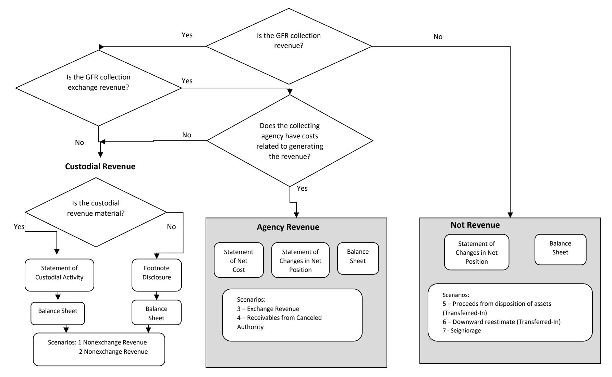

# **EFFECTIVE FISCAL YEAR 2021**

# **PREPARED BY:**

**GENERAL LEDGER AND ADVISORY BRANCH FISCAL ACCOUNTING OPERATIONS BUREAU OF THE FISCAL SERVICE U.S. DEPARTMENT OF THE TREASURY**

| Version Number | Date    | Description of Change            | Effective USSGL TFM      |
|-------------------|---------|----------------------------------|--------------------------|
| 1.0               | 08/2007 | Original                         | TFM Bulletin No. 2018-04 |
| 2.0               | 07/2020 | Added General Fund of the U.S.   | TFM Bulletin No. 2020-21 |
|                   |         | Government Transactions, Updated |                          |
|                   |         | Financial Statements             |                          |

### **Background**

### **Definition of a General Fund Receipt (GFR) Account**

The Government Accountability Office (GAO) defines a GFR Account as: "A receipt account credited with all collections that are not earmarked by law for another account for a specific purpose. These collections are presented in the President's budget as either governmental (budget) receipts or offsetting receipts. These include taxes, customs duties, and miscellaneous receipts." (Government Accountability Office, A Glossary of Terms Used in the Federal Budget Process, September 2005, GAO–05-734SP)

### **Purpose**

This guidance proposes accounting and reporting guidance for various collections classified in GFR accounts. The focus of this guidance is on the GFR account activity.

### **Federal Account Symbols (FAS), Treasury Account Symbols (TAS), and Collections**

The Federal Account Symbols and Titles (FAST) Book, published by Treasury, lists all FAS available for Federal agency use. A collection can be classified to any of the listed accounts. To classify a receipt, append your agency's two digit department code to the FAS. This combination of department code and FAS creates TAS. For example, collections for work performed in accordance with Economy Act can be deposited into any type of expenditure account. On the other hand, National Park Service fees are designated by law to be deposited to a special fund receipt account. Similarly, collections for the National Endowment for the Arts Gift Fund are designated by law to be deposited to a trust fund receipt account. Amounts collected in the course of business by the U.S. Postal Service are, by law, deposited to a revolving fund. Amounts not belonging to the Government are, by law, classified to deposit fund accounts. As you can see, a specific law determines how the collections in the preceding examples are classified in a TAS.

Absent specific legislation, collections should be classified to a **General Fund Receipt TAS**. Title 31, United States Code (USC), chapter 33, section 3302(b) establishes this concept by stating: "Except as provided in section 3718 (b) of this title, an official or agent of the Government receiving money for the Government from any source shall deposit the money in the Treasury as soon as practicable without deduction for any change or claim." Also, Title 31, USC, chapter 33, section 3302(e) states that "an official or agent of the Government having custody or possession of public money shall keep an accurate entry of each amount of public money received, transferred, and paid."

### **GFR Account Categories in the FAST Book**

The "Types of Collections and Relevant FASAB References" column was included in the table to assist users in providing background information. The users should note that the types of collections and limited paragraph references listed on the chart are suggestions and they should not be solely relied on. Each entity should perform its own research to determine the appropriate category for its collection.

| FAS        | Description of Types of GFR Accounts                                                                                                                            | Types of Collections and Relevant FASAB Reference                                                                              |  |  |
|------------|-----------------------------------------------------------------------------------------------------------------------------------------------------------------|-----------------------------------------------------------------------------------------------------------------------------------|--|--|
| 0100-Taxes | Receipts from levies (other than duties on imports) under the taxing and regulatory powers of the Constitution, such as income, excise, and social security. | Nonexchange, SFFAS No. 7, par. 2, 5, 21, 22, 30, 49, 129, 157, 242 - 244, 246, 248, 249, 253, 255, 263, 281, 306, 310 |  |  |

### **GFR Account Reporting Responsibility**

Within each GFR account category listed in the FAST Book there are unique FAS to identify specific activity. After selecting the proper TAS, the reporting entity should append its 3-digit agency identifier code to the beginning of the TAS for classifying the receipt to Treasury. A collecting entity typically reports all GFR TAS beginning with its 3-digit agency identifier code within its entity financial statements.

# **Identifying and Reporting Custodial Collections**

This guidance uses the word "custodial" as it relates to the Statement of Custodial Activity. The Statement of Custodial Activity was intended for those entities whose primary mission is collecting taxes or other revenues, particularly sovereign revenues that are intended to finance the entire Government's operations, or at least the programs of other entities, rather than their own activities[1](#page-3-0) . Organizations that collect custodial revenues that are incidental to their primary mission do not need to report the collections and disposition of these revenues in a separate statement. The disclosure of the sources and amounts of the collections and the amounts distributed to others could be disclosed in accompanying footnotes[2](#page-3-1) .

1 See SFFAC No. 2, paragraph 101.

2 SFFAC No. 2, paragraph 103.

### **Nonexchange Revenue**

Entities that collect nonexchange revenue for the General Fund and other entities should not recognize the revenue as theirs, but instead they need to account and report for that revenue in accordance with provisions of Statement of Federal Financial Accounting Concept No. 2 above and Statement of Federal Financial Accounting Standard No. 7 (paragraphs 48-63).

### **FLOWCHART - GFR COLLECTIONS TO COLLECTING AGENCY'S FINANCIAL STATEMENTS**

### **Chart - Impact on Collecting Entity's Financial Statements by Various Types of Collections**

| GFR Account Activity                 | Statement of Net Cost | Statement of Changes in Net Position (SCNP) | Statement of Custodial Activity (SCA)        | Footnote Disclosure                                              | Balance Sheet                      | FASAB Standard Reference (see Appendix) |
|--------------------------------------|-----------------------------|---------------------------------------------------|----------------------------------------------------------|---------------------------------------------------------------------|------------------------------------|--------------------------------------------------|
| Collection of nonexchange revenue | No                          | No                                                | Yes, if material and part of primary mission | Yes, if immaterial and incidental to primary mission | Yes, cumulative result is -0 | SFFAS No. 7 – Par. 48, 49                     |

### **Listing of USSGL Accounts Used in This Scenario**

| Account Number | Account Name                                                        |  |  |  |  |  |
|----------------|---------------------------------------------------------------------|--|--|--|--|--|
| Proprietary    |                                                                     |  |  |  |  |  |
| 101000         | Fund Balance With Treasury                                          |  |  |  |  |  |
| 132500         | Taxes Receivable                                                    |  |  |  |  |  |
| 132900         | Allowance for Loss on Taxes Receivable                        |  |  |  |  |  |
| 298000         | Custodial Liability                                                 |  |  |  |  |  |
| 331000         | Cumulative Results of Operations                                    |  |  |  |  |  |
| 580000         | Tax Revenue Collected – Not Otherwise Classified              |  |  |  |  |  |
| 580100         | Tax Revenue Collected - Individual                               |  |  |  |  |  |
| 582100         | Tax Revenue Accrual Adjustment - Individual                      |  |  |  |  |  |
| 583100         | Contra Revenue for Taxes - Individual                         |  |  |  |  |  |
| 599000         | Collections for Others – Statement of Custodial Activity         |  |  |  |  |  |
| 599100         | Accrued Collections for Others – Statement of Custodial Activity |  |  |  |  |  |

# **Scenario 1: Custodial Statement Collections: Collection of Nonexchange Revenue: Taxes – Individual and Not Otherwise Classified**

This scenario addresses collections of nonexchange tax revenue that are reported on the Statement of Custodial Activity. Refer to SFFAS No. 7, paragraphs 49, 176, 245, 281, and 353 and SFFAC No. 2, Entity and Display.

**NOTE: The IRS has data limitations and cannot separately post, by tax class, penalties and fines receivables and revenue from taxes receivables and tax collections. FASAB's SFFAS 7 paragraph 185 recognizes IRS systems limitations.**

| 1. To record a collection of Non-Federal revenue reported on the Statement of Custodial Activity or on the custodial footnote that is deposited into a General Fund receipt account. |       |        |      |                                                                                                                                                                                                    |       |        |     |  |
|--------------------------------------------------------------------------------------------------------------------------------------------------------------------------------------------|-------|--------|------|----------------------------------------------------------------------------------------------------------------------------------------------------------------------------------------------------|-------|--------|-----|--|
| GFR Account                                                                                                                                                                                | Debit | Credit | TC   | General Fund of the U.S. Government (099)                                                                                                                                                       | Debit | Credit | TC  |  |
| Budgetary Entry None Proprietary Entry 101000 (G)3 Fund Balance With Treasury4 (RC 40)5 580000 (N) Tax Revenue Collected – Not Otherwise Classified                      | 1,000 | 1,000  | C141 | Budgetary Entry None Proprietary Entry 198000 (F) Assets for Agency's Custodial and Non-Entity Liability (RC 46)6 201000 (F) Liability for Fund Balance With Treasury (RC 40) | 1,000 | 1,000  | N/A |  |

3 The Federal/Non-Federal attribute domain value of "G" will always have trading partner 099 agency identifier.

4 Although USSGL account 101000 is deposited into the General Fund of the U.S. Government, the collecting agency still has to carry the balances of USSGL accounts 101000 and 298500 on its quarterly Balance Sheet. Treasury's CARS system does not sweep USSGL account 101000 until the year end. The agency should make a note of this as a reconciling item.

5 RC – Reciprocal Category is shown for Intragovernmental Elimination Analysis (not included in GTAS upload)

6 The Trading Partner is Department of the Treasury (020).

#### Also Post:

| 2. To record a contra-revenue in the amount of revenue collected for others and to establish a custodial liability.                        |       |        |      |                                                                                                                                                                                                                                                    |       |        |    |  |
|-----------------------------------------------------------------------------------------------------------------------------------------------|-------|--------|------|----------------------------------------------------------------------------------------------------------------------------------------------------------------------------------------------------------------------------------------------------|-------|--------|----|--|
| GFR Account Debit                                                                                                                          |       | Credit | TC   | General Fund of the U.S. Government (099)                                                                                                                                                                                                       | Debit | Credit | TC |  |
| Budgetary Entry None                                                                                                                       |       |        |      | Budgetary Entry None                                                                                                                                                                                                                            |       |        |    |  |
| Proprietary Entry 599000 (G) Collections for Others – Statement of Custodial Activity (RC 44) 298000 (G) Custodial Liability (RC 46) | 1,000 | 1,000  | C142 | Proprietary Entry 198000 (F) Asset for Agency's Custodial and Non-Entity Liabilities – General Fund of the U.S. Government (RC 46) 571000 (F) Transfer in of Agency Unavailable Custodial and Non- Entity Collections (RC 44) | 1,000 | 1,000  |    |  |

#### **GFR Account Preclosing Trial Balance**

| Account     | Description                              | Debit | Credit |  |
|-------------|------------------------------------------|-------|--------|--|
| Budgetary   |                                          |       |        |  |
| None        |                                          |       |        |  |
|             |                                          |       |        |  |
| Proprietary |                                          |       |        |  |
| 101000 (G)  | Fund Balance With Treasury               | 1,000 |        |  |
| 298000 (G)  | Custodial Liability                      |       | 1,000  |  |
| 580000 (N)  | Tax Revenue Collected                    |       | 1,000  |  |
| 599000 (G)  | Collections for Others – Statement of | 1,000 |        |  |
|             | Custodial Activity                       |       |        |  |
| Total       |                                          | 2,000 | 2,000  |  |

|             | BALANCE SHEET AS OF DECEMBER 31, YEAR 1                                                 |                |
|-------------|-----------------------------------------------------------------------------------------|----------------|
| Line No. |                                                                                         | GFR Account |
|             | Assets (Note 2)                                                                         |                |
|             | Intragovernmental                                                                       |                |
| 1.          | Fund Balance with Treasury (Note 3) (101000E)                                           | 1,000          |
| 6.          | Total intragovernmental                                                                 | 1,000          |
| 15.         | Total assets                                                                            | 1,000          |
|             | Liabilities (Note 13)                                                                   |                |
|             | Intragovernmental                                                                       |                |
| 19.         | Other (Note 15, 16, and 17) (298000E)                                                   | 1,000          |
| 20.         | Total Intragovernmental                                                                 | 1,000          |
|             | Net Position                                                                            |                |
| 33.         | Cumulative results of operations – All Other Funds (Combined or Consolidated Totals) | -              |
| 35.         | Total Net Position – All Other Funds                                                 | -              |
| 36.         | Total Net Position                                                                      | -              |
| 37.         | Total liabilities and net position                                                      | 1,000          |

| STATEMENT OF CUSTODIAL ACTIVITY FOR THE QUARTER ENDED DECEMBER 31, YEAR 1 |                                                                      |         |  |
|---------------------------------------------------------------------------|----------------------------------------------------------------------|---------|--|
| Line                                                                      |                                                                      | GFR     |  |
| No.                                                                       |                                                                      | Account |  |
|                                                                           | Revenue Activity:                                                    |         |  |
|                                                                           | Sources of Cash Collections:                                         |         |  |
| 7.                                                                        | Miscellaneous (580000E)                                              | 1,000   |  |
| 8.                                                                        | Total Cash Collections                                               | 1,000   |  |
| 10.                                                                       | Total Custodial Revenue                                              | 1,000   |  |
|                                                                           | Disposition of Collections:                                          |         |  |
| 11.                                                                       | Transferred to Others (by Recipient) (599000E)                       | 1,000   |  |
| 12.                                                                       | (Increase)/Decrease in Amounts Yet to be Transferred (+/-) (298000E) | (1,000) |  |
| 14.                                                                       | Retained by Reporting Entity                                         | -       |  |
| 15.                                                                       | Total Disposition of Collections                                     | -       |  |
| 16.                                                                       | Net Custodial Activity                                               | 1,000   |  |

#### **Reclassified Financial Statements:**

|      | RECLASSIFIED BALANCE SHEET AS OF DECEMBER 31, YEAR 1                                                               |         |  |  |
|------|--------------------------------------------------------------------------------------------------------------------|---------|--|--|
| Line |                                                                                                                    | GFR     |  |  |
| No.  |                                                                                                                    | Account |  |  |
| 3    | Federal                                                                                                            |         |  |  |
| 3.1  | Fund Balance with Treasury (RC 40)/1 (101000E)                                                                     | 1,000   |  |  |
| 3.14 | Total federal assets                                                                                               | 1,000   |  |  |
| 4.   | Total assets                                                                                                       | 1,000   |  |  |
|      | Liabilities                                                                                                        |         |  |  |
| 7.   | Federal                                                                                                            |         |  |  |
| 7.10 | Liability to the General Fund of the U.S. Government for custodial and other non-entity assets (RC 46)/1 (298000E) | 1,000   |  |  |
| 7.15 | Total federal liabilities                                                                                          | 1,000   |  |  |
| 8    | Total liabilities                                                                                                  | 1,000   |  |  |
| 9    | Net Position                                                                                                       |         |  |  |
| 9.1  | Net Position – funds from dedicated collections (580000E, 599000E)                                              | -       |  |  |
| 10   | Total net position                                                                                                 | -       |  |  |
| 11.  | Total liabilities and net position                                                                                 | 1,000   |  |  |

|      | RECLASSIFIED STATEMENT OF OPERATIONS AND CHANGES IN NET POSITION AS OF DECEMBER 31, YEAR 1   |         |  |  |
|------|-------------------------------------------------------------------------------------------------|---------|--|--|
| Line |                                                                                                 | GFR     |  |  |
| No.  |                                                                                                 | Account |  |  |
| 5    | Non-federal non-exchange revenue:                                                               |         |  |  |
| 5.7  | Other taxes and receipts (580000N)                                                              | (1,000) |  |  |
| 5.9  | Total non-federal non-exchange revenue                                                          | (1,000) |  |  |
| 8    | Other financing sources:                                                                        |         |  |  |
| 8.4  | Non-entity collections transferred to the General Fund of the U.S. Government (RC 44) (599000E) | 1,000   |  |  |
| 8.11 | Total other financing sources                                                                   | 1,000   |  |  |
| 9    | Net cost of operations                                                                          | -       |  |  |
| 10   | Net position, end of period                                                                     | -       |  |  |

### **Year 1 – 4th Quarter**

| 1. To record a collection of Non-Federal revenue reported on the Statement of Custodial Activity or on the custodial footnote that is |       |        |      |                                    |       |        |     |
|------------------------------------------------------------------------------------------------------------------------------------------|-------|--------|------|------------------------------------|-------|--------|-----|
| deposited into a General Fund receipt account.                                                                                           |       |        |      |                                    |       |        |     |
| GFR Account                                                                                                                              | Debit | Credit | TC   | General Fund of the U.S.           | Debit | Credit | TC  |
|                                                                                                                                          |       |        |      | Government (099)                   |       |        |     |
| Budgetary Entry                                                                                                                          |       |        |      | Budgetary Entry                    |       |        |     |
| None                                                                                                                                     |       |        |      | None                               |       |        |     |
|                                                                                                                                          |       |        |      |                                    |       |        |     |
|                                                                                                                                          |       |        |      |                                    |       |        |     |
| Proprietary Entry                                                                                                                        |       |        |      | Proprietary Entry                  |       |        |     |
|                                                                                                                                          |       |        |      |                                    |       |        | N/A |
| 101000 (G) Fund Balance With Treasury                                                                                                    | 6,000 |        | C141 | 198000 (F) Assets for Agency's     | 6,000 |        |     |
| (RC 40)                                                                                                                                  |       |        |      | Custodial and Non-Entity Liability |       |        |     |
| 580100 (N) Tax Revenue Collected –                                                                                                       |       |        |      | 201000 (F) Liability for Fund      |       |        |     |
| Individual                                                                                                                               |       | 6,000  |      | Balance With Treasury (RC 40)      |       | 6,000  |     |
|                                                                                                                                          |       |        |      |                                    |       |        |     |

#### Also Post:

| 2. To record a contra-revenue in the amount of revenue collected for others and to establish a custodial liability.                        |       |                                                              |      |                                                                                                                                                                                                                                                    |        |       |     |
|-----------------------------------------------------------------------------------------------------------------------------------------------|-------|--------------------------------------------------------------|------|----------------------------------------------------------------------------------------------------------------------------------------------------------------------------------------------------------------------------------------------------|--------|-------|-----|
| GFR Account                                                                                                                                   | Debit | Credit TC General Fund of the U.S. Government (099) |      | Debit                                                                                                                                                                                                                                              | Credit | TC    |     |
| Budgetary Entry None                                                                                                                       |       |                                                              |      | Budgetary Entry None                                                                                                                                                                                                                            |        |       |     |
| Proprietary Entry 599000 (G) Collections for Others – Statement of Custodial Activity (RC 44) 298000 (G) Custodial Liability (RC 46) | 6,000 | 6,000                                                        | C142 | Proprietary Entry 198000 (F) Asset for Agency's Custodial and Non-Entity Liabilities – General Fund of the U.S. Government (RC 46) 571000 (F) Transfer in of Agency Unavailable Custodial and Non- Entity Collections (RC 44) | 6,000  | 6,000 | N/A |

| 3. To record accrual of nonexchange revenue at the end of the year. (See SFFAS No. 7, Para. 53-55)            |       |        |                                                             |                           |        |    |  |
|------------------------------------------------------------------------------------------------------------------|-------|--------|-------------------------------------------------------------|---------------------------|--------|----|--|
| GFR Account                                                                                                      | Debit | Credit | TC General Fund of the U.S. Debit Government (099) |                           | Credit | TC |  |
| Budgetary Entry None                                                                                          |       |        |                                                             | Budgetary Entry None   |        |    |  |
| Proprietary Entry 132500 (N) Taxes Receivable 582100 (N) Tax Revenue Accrual Adjustment – Individual | 3,000 | 3,000  | C402                                                        | Proprietary Entry None |        |    |  |

#### Also Post:

| 4. To record contra-revenue in the amount of revenue accrued and establish a custodial liability.                                                                                |       |        |      |                                                                                                                                                                                                                                                                                                                             |       |        |    |
|-------------------------------------------------------------------------------------------------------------------------------------------------------------------------------------|-------|--------|------|-----------------------------------------------------------------------------------------------------------------------------------------------------------------------------------------------------------------------------------------------------------------------------------------------------------------------------|-------|--------|----|
| GFR Account                                                                                                                                                                         | Debit | Credit | TC   | General Fund of the U.S. Government (099)                                                                                                                                                                                                                                                                                | Debit | Credit | TC |
| Budgetary Entry None Proprietary Entry 599100 (G) Accrued Collections for Others – Statement of Custodial Activity (RC 48) 298000 (G) Custodial Liability (RC 46) | 3,000 | 3,000  | C404 | Budgetary Entry None Proprietary Entry 198000 (F) Asset for Agency's Custodial and Non-Entity Liabilities – General Fund of the U.S. Government (RC 46) 571200 (F) Accrual of Agency Amount To be Collected – Custodial and Non-Entity – General Fund of the U.S. Government (RC 48) | 3,000 | 3,000  |    |

5. To record in a General Fund receipt account, the accrued estimated uncollectible nonexchange revenue reported on the Statement of Custodial Activity or on the custodial footnote.

| GFR Account                                 | Debit | Credit | TC   | General Fund of the U.S. | Debit | Credit | TC |
|---------------------------------------------|-------|--------|------|--------------------------|-------|--------|----|
|                                             |       |        |      | Government (099)         |       |        |    |
| Budgetary Entry                             |       |        |      | Budgetary Entry          |       |        |    |
| None                                        |       |        |      | None                     |       |        |    |
|                                             |       |        |      |                          |       |        |    |
|                                             |       |        |      |                          |       |        |    |
| Proprietary Entry                           |       |        |      | Proprietary Entry        |       |        |    |
| 583100 (N) Contra Revenue for Taxes - |       |        |      | None                     |       |        |    |
| Individual                                  | 1,200 |        | D424 |                          |       |        |    |
| 132900 (N) Allowance for Loss on            |       |        |      |                          |       |        |    |
| Taxes Receivable                            |       | 1,200  |      |                          |       |        |    |

#### Also Post:

6. To record the reduction of custodial liability by the amount of estimated uncollectible nonexchange revenue collected for others in a General Fund receipt account.

| GFR Account                                                                                  | Debit | Credit | TC   | General Fund of the U.S.                                                                                                                                                                                                               | Debit | Credit | TC |
|----------------------------------------------------------------------------------------------|-------|--------|------|----------------------------------------------------------------------------------------------------------------------------------------------------------------------------------------------------------------------------------------|-------|--------|----|
|                                                                                              |       |        |      | Government (099)                                                                                                                                                                                                                       |       |        |    |
| Budgetary Entry None Proprietary Entry 298000 (G) Custodial Liability (RC 46)       | 1,200 |        |      | Budgetary Entry None Proprietary Entry 571200 (F) Accrual of Agency                                                                                                                                                           | 1,200 |        |    |
| 599100 (G) Accrued Collections for Others – Statement of Custodial Activity (RC 48) |       | 1,200  | D422 | Amount To be Collected – Custodial and Non-Entity – General Fund of the U.S. Government (RC 48) 198000 (F) Asset for Agency's Custodial and Non-Entity Liabilities General Fund of the U.S. Government (RC 46) |       | 1,200  |    |

#### **Preclosing Trial Balance – Year 1**

| Account     | Description                                   | Debit  | Credit |
|-------------|-----------------------------------------------|--------|--------|
| Budgetary   |                                               | -      | -      |
| None        |                                               | -      | -      |
|             |                                               | -      | -      |
| Proprietary |                                               | -      | -      |
| 101000 (G)  | Fund Balance With Treasury                    | 7,000  | -      |
| 132500 (N)  | Taxes Receivable                              | 3,000  | -      |
| 132900 (N)  | Allowance for Loss on Taxes Receivable        | -      | 1,200  |
| 298000 (G)  | Custodial Liability                           | -      | 8,800  |
| 580000 (N)  | Tax Revenue Collected                         |        | 1,000  |
| 580100 (N)  | Tax Revenue Collected - Individual         | -      | 6,000  |
| 582100 (N)  | Tax Revenue Accrual Adjustment -              | -      | 3,000  |
|             | Individual                                    |        |        |
| 583100 (N)  | Contra Revenue for Taxes - Individual      | 1,200  | -      |
| 599000 (G)  | Collections for Others – Statement of      | 7,000  | -      |
|             | Custodial Activity                            |        |        |
| 599100 (G)  | Accrued Collections for Others – Statement | 1,800  |        |
|             | of Custodial Activity                         |        |        |
| Total       |                                               | 20,000 | 20,000 |

#### **Year 1 – Preclosing Adjusting Entry**

| 1. To record the closing of General Fund receipt accounts associated with fund balance at yearend. (Refer to TFM Bulletin No. 2019-15 paragraph 26 for a detailed description of the sweeping of the general fund receipt accounts.) |       |        |      |                                                                                                                                                                                                                                           |       |        |     |
|-----------------------------------------------------------------------------------------------------------------------------------------------------------------------------------------------------------------------------------------------|-------|--------|------|-------------------------------------------------------------------------------------------------------------------------------------------------------------------------------------------------------------------------------------------|-------|--------|-----|
| GFR Account                                                                                                                                                                                                                                   | Debit | Credit | TC   | General Fund of the U.S. Government (099)                                                                                                                                                                                              | Debit | Credit | TC  |
| Budgetary Entry None Proprietary Entry 298000 (G) Custodial Liability (RC 46) 101000 (G) Fund Balance With Treasury (RC 40)                                                                                                    | 7,000 | 7,000  | F124 | Budgetary Entry None Proprietary Entry 201000 (F) Liability for Fund Balance With Treasury (RC 40) 198000 (F) Asset for Agency's Custodial and Non-Entity Liabilities General Fund of the U.S. Government (RC 46) | 7,000 | 7,000  | N/A |

#### **Preclosing Adjusted Trial Balance – End of Year 1**

| Account     | Description                                   | Debit  | Credit |
|-------------|-----------------------------------------------|--------|--------|
| Budgetary   |                                               | -      | -      |
| None        |                                               | -      | -      |
|             |                                               | -      | -      |
| Proprietary |                                               | -      | -      |
| 132500 (N)  | Taxes Receivable                              | 3,000  | -      |
| 132900 (N)  | Allowance for Loss on Taxes Receivable        | -      | 1,200  |
| 298000 (G)  | Custodial Liability                           | -      | 1,800  |
| 580000 (N)  | Tax Revenue Collected                         | -      | 1,000  |
| 580100 (N)  | Tax Revenue Collected - Individual         | -      | 6,000  |
| 582100 (N)  | Tax Revenue Accrual Adjustment -              | -      | 3,000  |
|             | Individual                                    |        |        |
| 583100 (N)  | Contra Revenue for Taxes - Individual      | 1,200  | -      |
| 599000 (G)  | Collections for Others – Statement of      | 7,000  | -      |
|             | Custodial Activity                            |        |        |
| 599100 (G)  | Accrued Collections for Others – Statement | 1,800  | -      |
|             | of Custodial Activity                         |        |        |
| Total       |                                               | 13,000 | 13,000 |

#### **Financial Statements**

|             | BALANCE SHEET AS OF SEPTEMBER 30, YEAR 1                                                                   |                |  |
|-------------|------------------------------------------------------------------------------------------------------------|----------------|--|
| Line No. |                                                                                                            | GFR Account |  |
|             | Assets (Note 2)                                                                                            |                |  |
|             | Intragovernmental                                                                                          |                |  |
| 1.          | Fund Balance with Treasury (Note 3) (101000E)                                                              | -              |  |
| 6.          | Total intragovernmental                                                                                    | -              |  |
| 10.         | Taxes receivable, net (Note 7) (132500E, 132900E)                                                          | 1,800          |  |
| 15.         | Total assets                                                                                               | 1,800          |  |
|             | Liabilities (Note 13)                                                                                      |                |  |
|             | Intragovernmental                                                                                          |                |  |
| 19.         | Other (Note 15, 16, and 17) (298000E)                                                                      | 1,800          |  |
| 20.         | Total Intragovernmental                                                                                    | 1,800          |  |
|             | Net Position                                                                                               |                |  |
| 33.         | Cumulative results of operations – All Other Funds (Combined or Consolidated Totals) (58XXXXE, 59XXXXE) | -              |  |
| 35.         | Total Net Position – All Other Funds                                                                    | -              |  |
| 36.         | Total Net Position                                                                                         | -              |  |
| 37.         | Total liabilities and net position                                                                         | 1,800          |  |

|      | STATEMENT OF CUSTODIAL ACTIVITY FOR THE YEAR ENDED SEPTEMBER 30, YEAR 1 |         |  |
|------|-------------------------------------------------------------------------|---------|--|
| Line |                                                                         | GFR     |  |
| No.  |                                                                         | Account |  |
|      | Total Custodial Revenue:                                                |         |  |
|      | Sources of Cash Collections:                                            |         |  |
| 1.   | Individual Income and FICA/SECA Taxes (580100E)                         | 6,000   |  |
| 7.   | Miscellaneous (580000E)                                                 | 1,000   |  |
| 8.   | Total Cash Collections                                                  | 7,000   |  |
| 9.   | Accrual Adjustments (+/-) (582100E, 583100E)                            | 1,800   |  |
| 10.  | Total Custodial Revenue                                                 | 8,800   |  |
|      | Disposition of Collections:                                             |         |  |
| 11.  | Transferred to Others (by Recipient) (599000E)                          | 7,000   |  |
| 12.  | (Increase)/Decrease in Amounts Yet to be Transferred (+/-) (599100E)    | 1,800   |  |
| 14.  | Retained by Reporting Entity                                            | -       |  |
| 15.  | Total Disposition of Collections                                        | 8,800   |  |
| 16.  | Net Custodial Activity                                                  | -       |  |

OMB Circular No. A-136, Financial Reporting Requirements, Section II.3.8.35 – Note 35 Incidental Custodial Collections states: "Organizations collecting immaterial custodial revenues that are incidental to their primary mission may disclose the sources and amounts of the collections and the amounts distributed to others in accompanying notes rather than on the face of the statement." Also, see SFFAC No. 2, Entity and Display, paragraph 103.

**Note: The Statement of Net Cost, Statement of Changes in Net Position, Statement of Budgetary Resources, and the SF 133 & Schedule P are not applicable to this scenario.**

#### **Reclassified Financial Statements**

| RECLASSIFIED BALANCE SHEET AS OF SEPTEMBER 30, YEAR 1 |                                                                                                                                         |                |
|-------------------------------------------------------|-----------------------------------------------------------------------------------------------------------------------------------------|----------------|
| Line No.                                           |                                                                                                                                         | GFR Account |
| 1                                                     |                                                                                                                                         |                |
| 2.                                                    | Non-federal                                                                                                                             |                |
| 2.2                                                   | Accounts and taxes receivable, net (132500E, 132900E)                                                                                   | 1,800          |
| 2.9                                                   | Total non-federal assets                                                                                                                | 1,800          |
| 3                                                     | Federal                                                                                                                                 |                |
| 3.1                                                   | Fund Balance with Treasury (RC 40)/1 (101000E)                                                                                          | -              |
| 3.14                                                  | Total federal assets                                                                                                                    | -              |
| 4.                                                    | Total assets                                                                                                                            | 1,800          |
|                                                       | Liabilities                                                                                                                             |                |
| 7.                                                    | Federal                                                                                                                                 |                |
| 7.11                                                  | Liability to agency Other Than the General Fund of the U.S. Government for custodial and other non-entity assets (RC 10)/1 (298000E) | 1,800          |
| 7.15                                                  | Total federal liabilities                                                                                                               | 1,800          |
| 8                                                     | Total liabilities                                                                                                                       | 1,800          |
| 9                                                     | Net Position                                                                                                                            |                |
| 9.2                                                   | Net Position – funds other than those from dedicated collections                                                                     | -              |
| 10                                                    | Total net position                                                                                                                      | -              |
| 11.                                                   | Total liabilities and net position                                                                                                      | 1,800          |

|      | RECLASSIFIED STATEMENT OF OPERATIONS AND CHANGES IN NET POSITION AS OF SEPTEMBER 30, YEAR 1                    |         |
|------|-------------------------------------------------------------------------------------------------------------------|---------|
| Line |                                                                                                                   | GFR     |
| No.  |                                                                                                                   | Account |
| 5    | Non-federal non-exchange revenue:                                                                                 |         |
| 5.1  | Individual income tax and tax withholdings (for use by Treasury only) (580100E, 582100E, 583100E)                 | (7,800) |
| 5.7  | Other taxes and receipts (580000N)                                                                                | (1,000) |
| 5.9  | Total non-federal non-exchange revenue                                                                            | (8,800) |
| 8    | Other financing sources:                                                                                          |         |
| 8.4  | Non-entity collections transferred to the General Fund of the U.S. Government (RC 44) (599000E)                   | 7,000   |
| 8.5  | Accrual for non-entity amounts to be collected and transferred to the General Fund of the U.S. Government (RC 48) |         |
|      | (599100E)                                                                                                         | 1,800   |
| 8.11 | Total other financing sources                                                                                     | 8,800   |
| 9    | Net cost of operations                                                                                            | -       |
| 10   | Net position, end of period                                                                                       | -       |

**Note: The Reclassified Statement of Net Cost is not applicable to this scenario.**

#### **Closing Entries**

| 1. To record the closing of revenue, expense, and other financing source accounts to cumulative results of operations.                                                                                                                                                                                                                                                                                   |                                  |                |      |                                                                                                                                                                                                                                                                                                                                                                  |                |        |    |  |  |
|-------------------------------------------------------------------------------------------------------------------------------------------------------------------------------------------------------------------------------------------------------------------------------------------------------------------------------------------------------------------------------------------------------------|----------------------------------|----------------|------|------------------------------------------------------------------------------------------------------------------------------------------------------------------------------------------------------------------------------------------------------------------------------------------------------------------------------------------------------------------|----------------|--------|----|--|--|
| GFR Account                                                                                                                                                                                                                                                                                                                                                                                                 | Debit                            | Credit         | TC   | General Fund of the U.S.                                                                                                                                                                                                                                                                                                                                         | Debit          | Credit | TC |  |  |
| Budgetary Entry None Proprietary Entry 331000 Cumulative Results of Operations 599000 (G) Collections for Others – Statement of Custodial Activity (RC 44) 599100 (G) Accrued Collections for Others – Statement of Custodial Activity (RC 48) And: 580000 (N) Tax Revenue Collected 580100 (N) Tax Revenue Collected - Individual 582100 (N) Tax Revenue Accrual | 8,800 1,000 6,000 3,000 | 7,000 1,800 | F336 | Government (099) Budgetary Entry None Proprietary Entry 571000 (F) Transfer in of Agency Unavailable Custodial and Non-Entity Collections (RC 44) 571200 (F) Accrual of Agency Amount to be Collected – Custodial and Non-Entity – General Fund of the U.S. Government (RC 48) 331000 Cumulative Results of Operations | 7,000 1,800 | 8,800  |    |  |  |
| Adjustment - Individual 331000 Cumulative Results of Operations 583100 (N) Contra Revenue for Taxes – Individual                                                                                                                                                                                                                                                                             |                                  | 8,800 1,200 |      |                                                                                                                                                                                                                                                                                                                                                                  |                |        |    |  |  |

#### **Post-Closing Trial Balance**

| Account     | Description                            | Debit | Credit |
|-------------|----------------------------------------|-------|--------|
| Budgetary   |                                        | -     | -      |
| None        |                                        | -     | -      |
|             |                                        | -     | -      |
| Proprietary |                                        | -     | -      |
| 132500 (N)  | Taxes Receivable                       | 3,000 | -      |
| 132900 (N)  | Allowance for Loss on Taxes Receivable | -     | 1,200  |
| 298000 (G)  | Custodial Liability                    | -     | 1,800  |
| Total       |                                        | 3,000 | 3,000  |