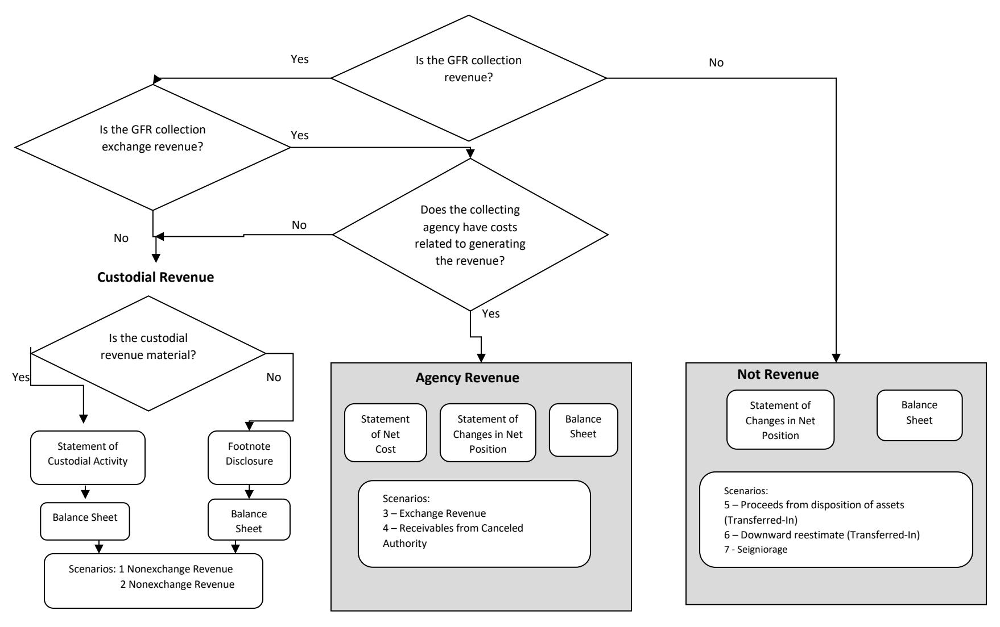

# **GENERAL FUND RECEIPT ACCOUNT (GFR) SCENARIO 3: NON-CUSTODIAL STATEMENT COLLECTIONS: COLLECTION OF EXCHANGE REVENUE WITH RELATED COSTS**

# **EFFECTIVE FISCAL YEAR 2021**

# **PREPARED BY:**

**GENERAL LEDGER AND ADVISORY BRANCH FISCAL ACCOUNTING OPERATIONS BUREAU OF THE FISCAL SERVICE U.S. DEPARTMENT OF THE TREASURY**

| Version Number | Date    | Description of Change                                                                      | Effective USSGL TFM      |
|-------------------|---------|--------------------------------------------------------------------------------------------|--------------------------|
| 1.0               | 08/2007 | Original                                                                                   | TFM Bulletin No. 2018-04 |
| 2.0               | 07/2020 | Added General Fund of the U.S. Government Transactions, Updated Financial Statements | TFM Bulletin No. 2020-21 |

#### **Background**

#### **Definition of a General Fund Receipt (GFR) Account**

The Government Accountability Office (GAO) defines a GFR Account as: "A receipt account credited with all collections that are not earmarked by law for another account for a specific purpose. These collections are presented in the President's budget as either governmental (budget) receipts or offsetting receipts. These include taxes, customs duties, and miscellaneous receipts." (Government Accountability Office, A Glossary of Terms Used in the Federal Budget Process, September 2005, GAO–05-734SP)

#### **Purpose**

This guidance proposes accounting and reporting guidance for Non-Custodial Statement Collections: Collection of Exchange Revenue with Related Costs in GFR accounts. The focus of this guidance is on the GFR account activity.

#### **Federal Account Symbols (FAS), Treasury Account Symbols (TAS), and Collections**

The Federal Account Symbols and Titles (FAST) Book, published by Treasury, lists all FAS available for Federal agency use. A collection can be classified to any of the listed accounts. To classify a receipt, append your agency's two digit department code to the FAS. This combination of department code and FAS creates TAS. For example, collections for work performed in accordance with Economy Act can be deposited into any type of expenditure account. On the other hand, National Park Service fees are designated by law to be deposited to a special fund receipt account. Similarly, collections for the National Endowment for the Arts Gift Fund are designated by law to be deposited to a trust fund receipt account. Amounts collected in the course of business by the U.S. Postal Service are, by law, deposited to a revolving fund. Amounts not belonging to the Government are, by law, classified to deposit fund accounts. As you can see, a specific law determines how the collections in the preceding examples are classified in a TAS.

Absent specific legislation, collections should be classified to a **General Fund Receipt TAS**. Title 31, United States Code (USC), chapter 33, section 3302(b) establishes this concept by stating: "Except as provided in section 3718 (b) of this title, an official or agent of the Government receiving money for the Government from any source shall deposit the money in the Treasury as soon as practicable without deduction for any change or claim." Also, Title 31, USC, chapter 33, section 3302(e) states that "an official or agent of the Government having custody or possession of public money shall keep an accurate entry of each amount of public money received, transferred, and paid."

#### **GFR Account Categories in the FAST Book**

The "Types of Collections and Relevant FASAB References" column was included in the table to assist users in providing background information. The users should note that the types of collections and limited paragraph references listed on the chart are suggestions and they should not be solely relied on. Each entity should perform its own research to determine the appropriate category for its collection.

| FAS                                                       | Description of Types of GFR Accounts                                                                                                                                                                                                                                                                                                                                                                                                                                                                                                                       | Types of Collections and Relevant FASAB Reference |
|-----------------------------------------------------------|------------------------------------------------------------------------------------------------------------------------------------------------------------------------------------------------------------------------------------------------------------------------------------------------------------------------------------------------------------------------------------------------------------------------------------------------------------------------------------------------------------------------------------------------------------|------------------------------------------------------|
| 0800 – Fees for regulatory and judicial services | Fees and other charges that result from the exercise of a governmental function of a regulatory or judicial nature. Includes fees and charges relating to application for and issuance of permits for aliens, petitions for naturalization, and papers for U.S. citizens to travel abroad; fees and other charges related to the application for and issuance and assignment of patents, trademarks and copyrights; and charges for registration of individuals, firms, or products; and fees for filing or reproducing of documents. | Exchange, SFFAS No. 7, par. 3, 282, 283        |

#### **GFR Account Reporting Responsibility**

Within each GFR account category listed in the FAST Book there are unique FAS to identify specific activity. After selecting the proper TAS, the reporting entity should append its 3-digit agency identifier code to the beginning of the TAS for classifying the receipt to Treasury. A collecting entity typically reports all GFR TAS beginning with its 3-digit agency identifier code within its entity financial statements.

#### **Exchange Revenue**

The collection of exchange revenue is generally reported on the Statement of Net Cost but under exceptional circumstances, an entity may recognize virtually no costs (either during the current period or during past periods) in connection with earning revenue that it collects. In such cases:

- 45.1. The collecting entity should not offset its gross costs by such exchange revenue in determining its net cost of operations. If such exchange revenue is retained by the entity, it should be recognized as a financing source in determining the entity's operating results. If, instead, such revenue is collected on behalf of other entities (including the U.S. Government as a whole), the entity that collects the revenue should account for that revenue as a custodial activity, i.e., an amount collected for others.
- 45.2. If the collecting entity transfers the exchange revenue to other entities, similar recognition by other entities is appropriate.
  - a. If the other entities to which the revenue is transferred also recognize virtually no costs in connection with the Government earning the revenue, the amounts transferred to them should not offset their gross cost in determining their net cost of operations but rather should be recognized as a financing source in determining their operating results.
  - b. If the other entities to which the revenue is transferred do recognize costs in connection with the Government earning the revenue, the amounts transferred to them should offset their gross cost in determining their net cost of operations.
- 45.3. Because the revenue is exchange revenue regardless of whether related costs are recognized, it should be recognized and measured under the exchange revenue standards.[1](#page-4-0)

Agencies may request guidance from FASAB if determining the propriety of preparing a Statement of Custodial Activity or if a note disclosure for a given collection is an issue that cannot otherwise be resolved.

1 See SFFAS No. 7, paragraph 45.

#### FLOWCHART - GFR COLLECTIONS TO COLLECTING AGENCY'S FINANCIAL STATEMENTS

Page **6** of **43**

#### **Chart - Impact on Collecting Entity's Financial Statements by Various Types of Collections**

| GFR Account Activity                                                                     | Statement of Net Cost | Statement of Changes in Net Position (SCNP) | Statement of Custodial Activity (SCA) | Footnote Disclosure | Balance Sheet                   | FASAB Standard Reference (see Appendix) |
|---------------------------------------------------------------------------------------------|--------------------------|---------------------------------------------------|------------------------------------------------|------------------------|---------------------------------|--------------------------------------------------|
| Collection of exchange revenue with related costs incurred by collecting entity | Yes                      | Yes, as a part of Net Cost (Line 24)           | No                                             | No                     | Yes, cumulative result is -0 | SFFAS No. 7 – Par. 43, 137                    |

# **Listing of USSGL Accounts Used in This Scenario**

| Account Number | Account Name                                                                        |
|----------------|-------------------------------------------------------------------------------------|
| Budgetary      |                                                                                     |
| 411900         | Other Appropriations Realized                                                       |
| 420100         | Total Actual Resources – Collected                                               |
| 445000         | Unapportioned Authority                                                             |
| 451000         | Apportionments                                                                      |
| 461000         | Allotments-Realized Resources                                                       |
| 465000         | Allotments – Expired Authority                                                   |
| 490200         | Delivered Orders – Obligations, Paid                                             |
|                |                                                                                     |
| Proprietary    |                                                                                     |
| 101000         | Fund Balance With Treasury                                                          |
| 298500         | Liability for Non-Entity Assets Not Reported on the Statement of Custodial Activity |
| 310000         | Unexpended Appropriations - Cumulative                                           |
| 310100         | Unexpended Appropriations – Appropriations Received                              |
| 310710         | Unexpended Appropriations – Used - Disbursed                               |
| 331000         | Cumulative Results of Operations                                                    |
| 520000         | Revenues From Services Provided                                                     |
| 570010         | Expended Appropriations - Disbursed                                              |
| 599300         | Offset to Non-Entity Collections - Statement of Changes in Net Position          |
| 610000         | Operating Expenses/Program Costs                                                    |

#### **Scenario 3: Non-Custodial Statement Collections: Collection of Exchange Revenue with Related Costs**

There are entities that collect exchange revenue with related costs where the collections are not retained by the collecting entity. In these cases, the entity should record the exchange revenue in its entity financial statements as usual. However, it should also reflect the disposition of the financing source on the Statement of Changes in Net Position. The example we have used for exchange revenue with related costs is the passport fees collected by the State Department. The State Department collects passport fees, which are not retained by the Department but are deposited directly to the General Fund Receipt Account. The passport fee is retained by the Federal Government and is generally not refundable whether the passport is issued or not.

**NOTE: Scenario 3 is for agencies who collect exchange revenue with related cost but who have no legal authority to retain/use the collection (hence would submit the collection to the GF), nonetheless they have to report the exchange revenue in their Statement of Net Cost (SNC) not the Statement of Custodial Activity (SCA) to offset the collection cost they incurred. The General Fund Expenditure TAS has been included to demonstrate this relationship.** 

#### **Year 1 Quarter 1**

| 1. To record the enactment of appropriations.                                                                                                                |       |        |                                           |                           |       |        |    |
|-----------------------------------------------------------------------------------------------------------------------------------------------------------------|-------|--------|-------------------------------------------|---------------------------|-------|--------|----|
| General Fund Expenditure TAS                                                                                                                                    | Debit | Credit | TC                                        | GFR Account               | Debit | Credit | TC |
| Budgetary Entry 411900 Other Appropriations Realized 445000 Unapportioned Authority                                                                       | 450   | 450    | A104                                      | Budgetary Entry None   |       |        |    |
| Proprietary Entry (G)2 Fund Balance With 101000 Treasury3 (RC 40)4 310100 (G) Unexpended Appropriations Appropriations Received (RC 41) | 450   | 450    |                                           | Proprietary Entry None |       |        |    |
|                                                                                                                                                                 |       |        | General Fund of the U.S. Government (099) |                           |       |        |    |
| Budgetary Entry None                                                                                                                                         |       |        |                                           | Budgetary Entry None   |       |        |    |
| Proprietary Entry 320100 (F) Appropriations Outstanding – Warrants Issued (RC 41) 201000 (F) Liability for Fund Balance With Treasury (RC 40)    | 450   | 450    |                                           | Proprietary Entry None |       |        |    |

2 The Federal/Non-Federal attribute domain value of "G" will always have trading partner 099 agency identifier.

3 Although USSGL account 101000 is deposited into the General Fund of the U.S. Government, the collecting agency still has to carry the balances of USSGL accounts 101000 and 298500 on its quarterly Balance Sheet. Treasury's CARS System does not sweep USSGL account 101000 until the year end. The agency should make a note of this as a reconciling item.

4 RC – Reciprocal Category is shown for Intragovernmental Elimination Analysis (not included in GTAS upload).

| Debit | Credit | TC   | GFR Account               | Debit                                     | Credit | TC |
|-------|--------|------|---------------------------|-------------------------------------------|--------|----|
| 450   | 450    | A116 | Budgetary Entry None   |                                           |        |    |
|       |        |      | Proprietary Entry None |                                           |        |    |
|       |        |      |                           |                                           |        |    |
|       |        |      | Budgetary Entry None   |                                           |        |    |
|       |        |      | Proprietary Entry None |                                           |        |    |
|       |        |      |                           | General Fund of the U.S. Government (099) |        |    |

| 3. To record the allotment of authority.                                              |       |        |      |                                           |       |        |    |  |
|------------------------------------------------------------------------------------------|-------|--------|------|-------------------------------------------|-------|--------|----|--|
| General Fund Expenditure TAS                                                             | Debit | Credit | TC   | GFR Account                               | Debit | Credit | TC |  |
| Budgetary Entry 451000 Apportionments 461000 Allotments – Realized Resources | 450   | 450    | A120 | Budgetary Entry None                   |       |        |    |  |
| Proprietary Entry None                                                                |       |        |      | Proprietary Entry None                 |       |        |    |  |
|                                                                                          |       |        |      | General Fund of the U.S. Government (099) |       |        |    |  |
| Budgetary Entry None                                                                  |       |        |      | Budgetary Entry None                   |       |        |    |  |
| Proprietary Entry None                                                                |       |        |      | Proprietary Entry None                 |       |        |    |  |

| 4. To record passport fees collected from the public. These collections are exchange revenue and not reported on the Statement of Custodial Activity. |       |        |    |                                                                                                                                                                   |       |        |      |
|-------------------------------------------------------------------------------------------------------------------------------------------------------------|-------|--------|----|-------------------------------------------------------------------------------------------------------------------------------------------------------------------|-------|--------|------|
| General Fund Expenditure TAS                                                                                                                                | Debit | Credit | TC | GFR Account                                                                                                                                                       | Debit | Credit | TC   |
| Budgetary Entry None                                                                                                                                     |       |        |    | Budgetary Entry                                                                                                                                                   |       |        |      |
| Proprietary Entry None                                                                                                                                   |       |        |    | Proprietary Entry 101000 (G) Fund Balance With Treasury (RC 40) 520000 (N) Revenue From Services Provided                                             | 120   | 120    | C145 |
|                                                                                                                                                             |       |        |    | General Fund of the U.S. Government (099)                                                                                                                         |       |        |      |
| Budgetary Entry None                                                                                                                                     |       |        |    | Budgetary Entry None                                                                                                                                           |       |        |      |
| Proprietary Entry None                                                                                                                                   |       |        |    | Proprietary Entry 198000 (F) Assets for Agency's Custodial and Non-Entity Liability 201000 (F) Liability for Fund Balance With Treasury (RC 40) | 120   | 120    |      |

#### Also Post:

| 5. To record an offset for amounts collected for others and to establish a liability for non-entity assets that are not reported on the Statement of Custodial Activity or on the custodial footnote. |       |        |    |                                                                                                                                                                                                                                                                                   |     |        |      |  |
|-------------------------------------------------------------------------------------------------------------------------------------------------------------------------------------------------------------|-------|--------|----|-----------------------------------------------------------------------------------------------------------------------------------------------------------------------------------------------------------------------------------------------------------------------------------|-----|--------|------|--|
| General Fund Expenditure TAS                                                                                                                                                                             | Debit | Credit | TC | GFR Account                                                                                                                                                                                                                                                                       |     | Credit | TC   |  |
| Budgetary Entry None                                                                                                                                                                                     |       |        |    | Budgetary Entry None                                                                                                                                                                                                                                                           |     |        |      |  |
| Proprietary Entry None                                                                                                                                                                                   |       |        |    | Proprietary Entry 599300 (G) Offset to Non-Entity Collections – Statement of Changes in Net Position (RC 44) 298500 (G) Liability For Non-Entity Assets Not Reported on the Statement of Custodial Activity (RC 46)                                          | 120 | 120    | C147 |  |
|                                                                                                                                                                                                             |       |        |    | General Fund of the U.S. Government (099)                                                                                                                                                                                                                                         |     |        |      |  |
| Budgetary Entry None Proprietary Entry None                                                                                                                                                        |       |        |    | Budgetary Entry None Proprietary Entry 198000 (F) Asset for Agency's Custodial and Non-Entity Liabilities – General (RC 46)5 Fund of the U.S. Government 571000 (F) Transfer in of Agency Unavailable Custodial and Non- Entity Collections (RC 44) | 120 | 120    |      |  |

5 The Trading Partner is Department of the Treasury (020).

| 6. To record payment and disbursement of funds not previously accrued and record appropriations used this fiscal year.                                   |       |        |      |                                           |       |        |    |  |
|-------------------------------------------------------------------------------------------------------------------------------------------------------------|-------|--------|------|-------------------------------------------|-------|--------|----|--|
| General Fund Expenditure TAS                                                                                                                                | Debit | Credit | TC   | GFR Account                               | Debit | Credit | TC |  |
| Budgetary Entry 461000 Allotments – Realized Resources 490200 Delivered Orders – Obligations, Paid                                           | 100   | 100    | B107 | Budgetary Entry None                   |       |        |    |  |
| Proprietary Entry 610000 (N) Operating Expenses/Program Costs 101000 (G) Fund Balance With Treasury (RC 40)                                     | 100   | 100    |      | Proprietary Entry None                 |       |        |    |  |
| 310710 (G) Unexpended Appropriations – Appropriations Used – Disbursed (RC 39) 570010 (G) Expended Appropriations –                          | 100   | 100    | B234 |                                           |       |        |    |  |
| Disbursed (RC 38)                                                                                                                                           |       |        |      | General Fund of the U.S. Government (099) |       |        |    |  |
| Budgetary Entry None                                                                                                                                     |       |        |      | Budgetary Entry None                   |       |        |    |  |
| Proprietary Entry 201000 (F) Liability for Fund Balance With Treasury (RC 40) 198000 (F) Assets for Agency's Custodial and Non-Entity Liability | 100   | 100    |      | Proprietary Entry None                 |       |        |    |  |
| 570006 (F) Appropriations – Expended – Disbursed (RC 38) 320710 (F) Appropriations Outstanding Used - Disbursed (RC 39)          | 100   | 100    |      |                                           |       |        |    |  |

**Year 1 – 1st Quarter Preclosing Trial Balance**

|             |                                                                      |       | General Fund Expenditure TAS | GFR Account |        |  |
|-------------|----------------------------------------------------------------------|-------|---------------------------------|-------------|--------|--|
| Account     | Description                                                          | Debit | Credit                          | Debit       | Credit |  |
| Budgetary   |                                                                      |       |                                 |             |        |  |
| 411900      | Other Appropriations Realized                                        | 450   | -                               | -           | -      |  |
| 461000      | Allotments – Realized Resources                                   | -     | 350                             | -           | -      |  |
| 490200      | Delivered Orders – Obligations, Paid                              | -     | 100                             | -           | -      |  |
| Total       |                                                                      | 450   | 450                             | -           | -      |  |
|             |                                                                      | -     | -                               |             |        |  |
| Proprietary |                                                                      |       |                                 |             |        |  |
| 101000 (G)  | Fund Balance With Treasury                                           | 350   | -                               | 120         | -      |  |
| 298500 (G)  | Liability for Non-Entity Assets Not Reported on the Statement        | -     | -                               | -           | 120    |  |
|             | of Custodial Activity                                                |       |                                 |             |        |  |
| 310100 (G)  | Unexpended Appropriations – Appropriations Received               | -     | 450                             | -           | -      |  |
| 310710 (G)  | Unexpended Appropriations – Appropriations Used – Disbursed | 100   | -                               | -           | -      |  |
| 570010 (G)  | Expended Appropriations - Disbursed                            | -     | 100                             | -           | -      |  |
| 520000 (N)  | Revenue From Services Provided                                    | -     | -                               | -           | 120    |  |
| 599300 (G)  | Offset to Non-Entity Collection – Statement of Changes in Net     | -     | -                               | 120         | -      |  |
|             | Position                                                             |       |                                 |             |        |  |
| 610000 (N)  | Operating Expenses/Program Costs                                     | 100   | -                               | -           | -      |  |
| Total       |                                                                      | 550   | 550                             | 240         | 240    |  |

#### **Financial Statements:**

|             | CONSOLIDATED BALANCE SHEET AS OF DECEMBER 31, YEAR 1                                                                            |     |
|-------------|---------------------------------------------------------------------------------------------------------------------------------|-----|
| Line No. |                                                                                                                                 |     |
|             | Assets (Note 2)                                                                                                                 |     |
|             | Intragovernmental                                                                                                               |     |
| 1.          | Fund Balance with Treasury (Note 3) (101000E)                                                                                   | 470 |
| 6.          | Total intragovernmental                                                                                                         | 470 |
| 15.         | Total assets                                                                                                                    | 470 |
|             | Liabilities (Note 13)                                                                                                           |     |
|             | Intragovernmental                                                                                                               |     |
| 19.         | Other (Note 15, 16, and 17) (298500E)                                                                                           | 120 |
| 20.         | Total Intragovernmental                                                                                                         | 120 |
| 28.         | Total Liabilities                                                                                                               | 120 |
|             | Net Position                                                                                                                    |     |
| 31.         | Unexpended appropriations – All Other Funds (Combined or Consolidated Totals) (310100E, 310710E)                             | 350 |
| 33.         | Cumulative results of operations – All Other Funds (Combined or Consolidated Totals) (520000E, 570010E, 599300E, 610000E) | -   |
| 35.         | Total Net Position – All Other Funds                                                                                         | 350 |
| 36.         | Total Net Position                                                                                                              | 350 |
| 37.         | Total liabilities and net position                                                                                              | 470 |

|      | CONSOLIDATED STATEMENT OF NET COST FOR THE QUARTER ENDED DECEMBER 31, YEAR 1 |       |  |  |  |
|------|------------------------------------------------------------------------------|-------|--|--|--|
| Line |                                                                              |       |  |  |  |
| No.  |                                                                              |       |  |  |  |
|      | Gross Program Costs (Note 22):                                               |       |  |  |  |
|      | Program A:                                                                   |       |  |  |  |
| 1.   | Gross Costs (610000E)                                                        | 100   |  |  |  |
| 2.   | Less: earned revenue (520000E)                                               | (120) |  |  |  |
| 3.   | Net program costs:                                                           | (20)  |  |  |  |
| 5.   | Net program costs including Assumption Changes:                              | (20)  |  |  |  |
| 8.   | Net cost of operations                                                       | (20)  |  |  |  |

|          | CONSOLIDATED STATEMENT OF CHANGES IN NET POSITION FOR THE QUARTER ENDED DECEMBER 31, YEAR 1 |       |  |  |
|----------|------------------------------------------------------------------------------------------------|-------|--|--|
| Line No. |                                                                                                |       |  |  |
|          | Unexpended Appropriations:                                                                     |       |  |  |
| 4.       | Appropriations Received (310100E)                                                              | 450   |  |  |
| 7.       | Appropriations used (310710E)                                                                  | (100) |  |  |
| 8.       | Total Budgetary Financing Sources                                                              | 350   |  |  |
| 9.       | Total Unexpended Appropriations                                                                | 350   |  |  |
|          | Budgetary Financing Sources:                                                                   |       |  |  |
| 14.      | Appropriations used (570010E)                                                                  | 100   |  |  |
|          | Other Financing Sources (Nonexchange):                                                         |       |  |  |
| 22.      | Other (+/-) (599300E)                                                                          | 120   |  |  |
| 23.      | Total Financing Sources                                                                        | 20    |  |  |
| 24.      | Net Cost of Operations (+/-)                                                                   | (20)  |  |  |
| 25.      | Net Change                                                                                     | -     |  |  |
| 26.      | Cumulative Results of Operations                                                               | -     |  |  |
| 27.      | Net Position                                                                                   | 350   |  |  |

|             | STATEMENT OF BUDGETARY RESOURCES AS OF DECEMBER 31, YEAR 1         |     |
|-------------|--------------------------------------------------------------------|-----|
| Line No. |                                                                    |     |
|             | Budgetary resources:                                               |     |
| 1290        | Appropriations (discretionary and mandatory) (411900E)             | 450 |
| 1910        | Total budgetary resources                                          | 450 |
|             | Status of budgetary resources:                                     |     |
| 2190        | New obligations and upward adjustments (total) (Note 29) (490200E) | 100 |
| 2204        | Apportioned, unexpired account (461000E)                           | 350 |
| 2412        | Unexpired unobligated balance, end of year                         | 350 |
| 2490        | Unobligated balance, end of year (total)                           | 350 |
| 2500        | Total budgetary resources                                          | 450 |
|             | Outlays, net:                                                      |     |
| 4190        | Outlays, net (total) (discretionary and mandatory) (490200E)       | 100 |

| SF 133 AND SCHEDULE P: REPORT ON BUDGET EXECUTION AND BUDGETARY RESOURCES AND BUDGET PROGRAM AND FINANCING SCHEDULE AS OF DECEMBER 31, YEAR 1 |                                                     |        |            |  |  |
|--------------------------------------------------------------------------------------------------------------------------------------------------|-----------------------------------------------------|--------|------------|--|--|
| Line No.                                                                                                                                         |                                                     | SF 133 | Schedule P |  |  |
|                                                                                                                                                  | BUDGETARY RESOURCES                                 |        |            |  |  |
|                                                                                                                                                  | All accounts:                                       |        |            |  |  |
| 0900                                                                                                                                             | Total new obligations, unexpired accounts (490200E) |        | 100        |  |  |
|                                                                                                                                                  | Budget authority:                                   |        |            |  |  |
|                                                                                                                                                  | Appropriations:                                     |        |            |  |  |
|                                                                                                                                                  | Discretionary:                                      |        |            |  |  |
|                                                                                                                                                  | Status of budgetary resources:                      |        |            |  |  |
| 1100                                                                                                                                             | Appropriation (411900E)                             | 450    | 450        |  |  |
| 1160                                                                                                                                             | Appropriation, discretionary (total)                | 450    | 450        |  |  |
| 1900                                                                                                                                             | Budget authority (total)                            | 450    | 450        |  |  |
| 1910                                                                                                                                             | Total budgetary resources                           |        | 450        |  |  |
| 1930                                                                                                                                             | Total budgetary resources available              |        | 450        |  |  |
|                                                                                                                                                  | Memorandum (non-add) entries:                       |        |            |  |  |
|                                                                                                                                                  | All accounts:                                       |        |            |  |  |
| 1940                                                                                                                                             | Unobligated balance expiring (-) (461000E)          |        | 350        |  |  |
|                                                                                                                                                  | STATUS OF BUDGETARY RESOURCES                       |        |            |  |  |
|                                                                                                                                                  | New obligations and upward adjustments:             |        |            |  |  |
|                                                                                                                                                  | Reimbursable:                                       |        |            |  |  |
| 2102                                                                                                                                             | Category B (by project) (490200E)                   | 100    |            |  |  |
| 2104                                                                                                                                             | Reimbursable obligations (total)                    | 100    |            |  |  |
| 2190                                                                                                                                             | New obligations and upward adjustments (total)      | 100    |            |  |  |
|                                                                                                                                                  | Unobligated balance:                                |        |            |  |  |
|                                                                                                                                                  | Apportioned, unexpired accounts:                    |        |            |  |  |
| 2201                                                                                                                                             | Available in the current period (461000E)           | 350    |            |  |  |
| 2412                                                                                                                                             | Unexpired unobligated balance: end of year          | 350    |            |  |  |
| 2490                                                                                                                                             | Unobligated balance, end of year (total)            | 350    |            |  |  |
| 2500                                                                                                                                             | Total budgetary resources                           | 450    |            |  |  |

|          | SF 133 AND SCHEDULE P: REPORT ON BUDGET EXECUTION AND BUDGETARY RESOURCES AND BUDGET PROGRAM AND FINANCING SCHEDULE AS OF DECEMBER 31, YEAR 1 |        |            |
|----------|--------------------------------------------------------------------------------------------------------------------------------------------------|--------|------------|
| Line No. |                                                                                                                                                  | SF 133 | Schedule P |
|          | Memorandum (non-add) entries:                                                                                                                    |        |            |
| 2501     | Subject to apportionment unobligated balance, end of year (461000E, 490200E)                                                                     | 450    |            |
|          | CHANGE IN OBLIGATED BALANCE                                                                                                                      |        |            |
|          | Unpaid obligations:                                                                                                                              |        |            |
| 3010     | New obligations, unexpired accounts (490200E)                                                                                                    | 100    | 100        |
|          | Memorandum (non-add) entries:                                                                                                                    |        |            |
| 3200     | Obligated balance, end of year (+ or -)                                                                                                          | 100    | 100        |
|          | BUDGET AUTHORITY AND OUTLAYS, NET                                                                                                                |        |            |
|          | Discretionary:                                                                                                                                   |        |            |
|          | Gross budget authority and outlays:                                                                                                              |        |            |
| 4000     | Budget authority, gross                                                                                                                          | 450    | 450        |
|          | Outlays, gross                                                                                                                                   |        |            |
| 4010     | Outlays from new discretionary authority (490200E)                                                                                               | 100    | 100        |
| 4020     | Outlays, gross (total)                                                                                                                           | 100    | 100        |
| 4070     | Budget authority, net (discretionary)                                                                                                            | 450    | 450        |
| 4080     | Outlays, net (discretionary)                                                                                                                     | 100    | 100        |
|          | Budget authority and outlays, net (total)                                                                                                        |        |            |
| 4180     | Budget authority, net (total)                                                                                                                    | 450    | 450        |
| 4190     | Outlays, net (total)                                                                                                                             | 100    | 100        |
|          | Unexpended balances (Direct/Reimbursable/Discretionary/Mandatory)                                                                                |        |            |
| 5321     | Direct unobligated balance, end of year (461000E)                                                                                                | 350    | 350        |

#### **Year 1 – 4th Quarter**

| General Fund Expenditure TAS | Debit | Credit | TC | GFR Account                                                                                                                                                    | Debit | Credit | TC   |
|---------------------------------|-------|--------|----|----------------------------------------------------------------------------------------------------------------------------------------------------------------|-------|--------|------|
| Budgetary Entry None         |       |        |    | Budgetary Entry None Proprietary Entry                                                                                                                   |       |        |      |
| Proprietary Entry None       |       |        |    | 101000 (G) Fund Balance With Treasury (RC 40) 520000 (N) Revenue From Services Provided                                                               | 250   | 250    | C145 |
|                                 |       |        |    | General Fund of the U.S. Government (099)                                                                                                                      |       |        |      |
| Budgetary Entry None         |       |        |    | Budgetary Entry None                                                                                                                                        |       |        |      |
| Proprietary Entry None       |       |        |    | Proprietary Entry 198000 (F) Assets for Agency's Custodial and Non-Entity Liability 201000 (F) Liability for Fund Balance With Treasury (RC 40) | 250   | 250    |      |

#### Also Post:

| General Fund Expenditure TAS Budgetary Entry | Debit | Credit | TC | GFR Account                                                                                                                                                                                                                                        |                                                               |        |      |  |  |  |  |  |
|----------------------------------------------------|-------|--------|----|----------------------------------------------------------------------------------------------------------------------------------------------------------------------------------------------------------------------------------------------------|---------------------------------------------------------------|--------|------|--|--|--|--|--|
|                                                    |       |        |    |                                                                                                                                                                                                                                                    | Statement of Custodial Activity or on the custodial footnote. |        |      |  |  |  |  |  |
|                                                    |       |        |    |                                                                                                                                                                                                                                                    | Debit                                                         | Credit | TC   |  |  |  |  |  |
| None                                               |       |        |    | Budgetary Entry None                                                                                                                                                                                                                            |                                                               |        |      |  |  |  |  |  |
| Proprietary Entry None                          |       |        |    | Proprietary Entry 599300 (G) Offset to Non-Entity Collections – Statement of Changes in Net Position (RC 44) 298500 (G) Liability For Non-Entity Assets Not Reported on the Statement                                            | 250                                                           |        | C147 |  |  |  |  |  |
|                                                    |       |        |    | of Custodial Activity (RC 46)                                                                                                                                                                                                                      |                                                               | 250    |      |  |  |  |  |  |
|                                                    |       |        |    | General Fund of the U.S. Government (099)                                                                                                                                                                                                          |                                                               |        |      |  |  |  |  |  |
| Budgetary Entry None                            |       |        |    | Budgetary Entry None                                                                                                                                                                                                                            |                                                               |        |      |  |  |  |  |  |
| Proprietary Entry None                          |       |        |    | Proprietary Entry 198000 (F) Asset for Agency's Custodial and Non-Entity Liabilities – General Fund of the U.S. Government (RC 46) 571000 (F) Transfer in of Agency Unavailable Custodial and Non- Entity Collections (RC 44) | 250                                                           | 250    |      |  |  |  |  |  |

| 3. To record payment and disbursement of funds not previously accrued.                                                                                   |       |        |      |                                           |       |        |    |
|-------------------------------------------------------------------------------------------------------------------------------------------------------------|-------|--------|------|-------------------------------------------|-------|--------|----|
| General Fund Expenditure TAS                                                                                                                                | Debit | Credit | TC   | GFR Account                               | Debit | Credit | TC |
| Budgetary Entry 461000 Allotments – Realized Resources 490200 Delivered Orders – Obligations, Paid                                           | 200   | 200    | B107 | Budgetary Entry None                   |       |        |    |
| Proprietary Entry 610000 (N) Operating Expenses/Program Costs 101000 (G) Fund Balance With Treasury (RC 40)                            | 200   | 200    |      | Proprietary Entry None                 |       |        |    |
| 310710 (G) Unexpended Appropriations – Appropriations Used – Disbursed (RC 39) 570010 (G) Expended Appropriations –                          | 200   |        | B234 |                                           |       |        |    |
| Disbursed (RC 38)                                                                                                                                           |       | 200    |      | General Fund of the U.S. Government (099) |       |        |    |
| Budgetary Entry                                                                                                                                             |       |        |      | Budgetary Entry                           |       |        |    |
| None                                                                                                                                                        |       |        |      | None                                      |       |        |    |
| Proprietary Entry 201000 (F) Liability for Fund Balance With Treasury (RC 40) 198000 (F) Assets for Agency's Custodial and Non-Entity Liability | 200   | 200    |      | Proprietary Entry None                 |       |        |    |
| 570006 (F) Appropriations – Expended – Disbursed (RC 38) 320710 (F) Appropriations Outstanding Used - Disbursed (RC 39)          | 200   | 200    |      |                                           |       |        |    |

**Year 1 4th Quarter Preclosing Trial Balance**

|             |                                                                  |       | General Fund Expenditure TAS | GFR Account |        |
|-------------|------------------------------------------------------------------|-------|---------------------------------|-------------|--------|
| Account     | Description                                                      | Debit | Credit                          | Debit       | Credit |
| Budgetary   |                                                                  |       |                                 |             |        |
| 411900      | Other Appropriations Realized                                    | 450   | -                               | -           | -      |
| 461000      | Allotments – Realized Resources                               | -     | 150                             | -           | -      |
| 490200      | Delivered Orders – Obligations, Paid                          | -     | 300                             | -           | -      |
| Total       |                                                                  | 450   | 450                             | -           | -      |
|             |                                                                  | -     | -                               |             |        |
| Proprietary |                                                                  |       |                                 |             |        |
| 101000 (G)  | Fund Balance With Treasury                                       | 150   | -                               | 370         | -      |
| 298500 (G)  | Liability for Non-Entity Assets Not Reported on the Statement    | -     | -                               | -           | 370    |
|             | of Custodial Activity                                            |       |                                 |             |        |
| 310100 (G)  | Unexpended Appropriations – Appropriations Received           | -     | 450                             | -           | -      |
| 310710 (G)  | Unexpended Appropriations – Appropriations Used –          | 300   | -                               | -           | -      |
|             | Disbursed                                                        |       |                                 |             |        |
| 570010 (G)  | Expended Appropriations - Disbursed                        | -     | 300                             | -           | -      |
| 520000 (N)  | Revenue From Services Provided                                | -     | -                               | -           | 370    |
| 599300 (G)  | Offset to Non-Entity Collection – Statement of Changes in Net | -     | -                               | 370         | -      |
|             | Position                                                         |       |                                 |             |        |
| 610000 (N)  | Operating Expenses/Program Costs                                 | 300   | -                               | -           | -      |
| Total       |                                                                  | 750   | 750                             | 740         | 740    |

#### **Preclosing Adjusting Entry**

| 1. To record the closing of General Fund receipt accounts associated with fund balance at yearend. |       |        |    |                                                                                                                                                                                                                |       |        |      |
|-------------------------------------------------------------------------------------------------------|-------|--------|----|----------------------------------------------------------------------------------------------------------------------------------------------------------------------------------------------------------------|-------|--------|------|
| General Fund Expenditure TAS                                                                          | Debit | Credit | TC | GFR Account                                                                                                                                                                                                    | Debit | Credit | TC   |
| Budgetary Entry None                                                                               |       |        |    | Budgetary Entry None                                                                                                                                                                                        |       |        |      |
| Proprietary Entry None                                                                             |       |        |    | Proprietary Entry 298500 (G) Liability for Non-Entity Assets Not Reported on the Statement of Custodial Activity (RC 46) 101000 (G) Fund Balance With Treasury (RC 40)                          | 370   | 370    | F124 |
|                                                                                                       |       |        |    | General Fund of the U.S. Government (099)                                                                                                                                                                      |       |        |      |
| Budgetary Entry None                                                                               |       |        |    | Budgetary Entry None                                                                                                                                                                                        |       |        |      |
| Proprietary Entry None                                                                             |       |        |    | Proprietary Entry 201000 (F) Liability for Fund Balance With Treasury (RC 40) 198000 (F) Asset for Agency's Custodial and Non-Entity Liabilities General Fund of the U.S. Government (RC 46) | 370   | 370    |      |

**Year 1 4th Quarter Preclosing Adjusted Trial Balance**

|             |                                                                              |       | General Fund Expenditure TAS | GFR Account |        |
|-------------|------------------------------------------------------------------------------|-------|---------------------------------|-------------|--------|
| Account     | Description                                                                  | Debit | Credit                          | Debit       | Credit |
| Budgetary   |                                                                              |       |                                 |             |        |
| 411900      | Other Appropriations Realized                                                | 450   | -                               | -           | -      |
| 461000      | Allotments – Realized Resources                                           | -     | 150                             | -           | -      |
| 490200      | Delivered Orders – Obligations, Paid                                      | -     | 300                             | -           | -      |
| Total       |                                                                              | 450   | 450                             | -           | -      |
|             |                                                                              | -     | -                               |             |        |
| Proprietary |                                                                              |       |                                 |             |        |
| 101000 (G)  | Fund Balance With Treasury                                                   | 150   | -                               | -           | -      |
| 310100 (G)  | Unexpended Appropriations – Appropriations Received                       | -     | 450                             | -           | -      |
| 310710 (G)  | Unexpended Appropriations – Appropriations Used – Disbursed         | 300   | -                               | -           | -      |
| 570010 (G)  | Expended Appropriations - Disbursed                                    | -     | 300                             | -           | -      |
| 520000 (N)  | Revenue From Services Provided                                               | -     | -                               | -           | 370    |
| 599300 (G)  | Offset to Non-Entity Collection – Statement of Changes in Net Position | -     | -                               | 370         | -      |
| 610000 (N)  | Operating Expenses/Program Costs                                             | 300   | -                               | -           | -      |
| Total       |                                                                              | 750   | 750                             | 370         | 370    |

#### **Financial Statements:**

|      | CONSOLIDATED BALANCE SHEET AS OF SEPTEMBER 30, YEAR 1                                                                           |     |
|------|---------------------------------------------------------------------------------------------------------------------------------|-----|
| Line |                                                                                                                                 |     |
| No.  |                                                                                                                                 |     |
|      | Assets (Note 2)                                                                                                                 |     |
|      | Intragovernmental                                                                                                               |     |
| 1.   | Fund Balance with Treasury (Note 3) (101000E)                                                                                   | 150 |
| 6.   | Total intragovernmental                                                                                                         | 150 |
| 15.  | Total assets                                                                                                                    | 150 |
|      | Liabilities (Note 13)                                                                                                           |     |
|      | Intragovernmental                                                                                                               |     |
| 19.  | Other (Note 15, 16, and 17) (298500E)                                                                                           | -   |
| 20.  | Total Intragovernmental                                                                                                         | -   |
| 28.  | Total Liabilities                                                                                                               | -   |
|      | Net Position                                                                                                                    |     |
| 31.  | Unexpended appropriations – All Other Funds (Combined or Consolidated Totals) (310100E, 310710E)                             | 150 |
| 33.  | Cumulative results of operations – All Other Funds (Combined or Consolidated Totals) (520000E, 570010E, 599300E, 610000E) | -   |
| 35.  | Total Net Position – All Other Funds                                                                                         | 150 |
| 36.  | Total Net Position                                                                                                              | 150 |
| 37.  | Total liabilities and net position                                                                                              | 150 |

|             | CONSOLIDATED STATEMENT OF NET COST FOR THE YEAR ENDED SEPTEMBER 30, YEAR 1 |       |  |
|-------------|----------------------------------------------------------------------------|-------|--|
| Line No. |                                                                            |       |  |
|             | Gross Program Costs (Note 22):                                             |       |  |
|             | Program A:                                                                 |       |  |
| 1.          | Gross Costs (610000E)                                                      | 300   |  |
| 2.          | Less: earned revenue (520000E)                                             | (370) |  |
| 3.          | Net program costs:                                                         | (70)  |  |
| 5.          | Net program costs including Assumption Changes:                            | (70)  |  |
| 8.          | Net cost of operations                                                     | (70)  |  |

|             | CONSOLIDATED STATEMENT OF CHANGES IN NET POSITION FOR THE YEAR ENDED SEPTEMBER 30, YEAR 1 |                       |              |  |
|-------------|----------------------------------------------------------------------------------------------|-----------------------|--------------|--|
| Line No. |                                                                                              | All Other Funds | Consolidated |  |
|             | Unexpended Appropriations:                                                                   |                       |              |  |
| 4.          | Appropriations Received (310100E)                                                            | 450                   | 450          |  |
| 7.          | Appropriations used (310710E)                                                                | (300)                 | (300)        |  |
| 8.          | Total Budgetary Financing Sources                                                            | 150                   | 150          |  |
| 9.          | Total Unexpended Appropriations                                                              | 150                   | 150          |  |
|             | Budgetary Financing Sources:                                                                 |                       |              |  |
| 14.         | Appropriations used (570010E)                                                                | 300                   | 300          |  |
|             | Other Financing Sources (Nonexchange):                                                       |                       |              |  |
| 22.         | Other (+/-) (599300E)                                                                        | (370)                 | (370)        |  |
| 23.         | Total Financing Sources                                                                      | (70)                  | (70)         |  |
| 24.         | Net Cost of Operations (+/-)                                                                 | (70)                  | (70)         |  |
| 25.         | Net Change                                                                                   | -                     | -            |  |
| 26.         | Cumulative Results of Operations                                                             | -                     | -            |  |
| 27.         | Net Position                                                                                 | 150                   | 150          |  |

|             | STATEMENT OF BUDGETARY RESOURCES FOR THE YEAR ENDED SEPTEMBER 30, YEAR 1          |     |  |
|-------------|-----------------------------------------------------------------------------------|-----|--|
| Line No. |                                                                                   |     |  |
|             | Budgetary resources:                                                              |     |  |
| 1290        | Appropriations (discretionary and mandatory) (411900E)                            | 450 |  |
| 1910        | Total budgetary resources                                                         | 450 |  |
|             | Memorandum (non-add) entries:                                                     |     |  |
| 1980        | Net adjustments to unobligated balance brought forward, Oct 1 (Note 26) (411900E) | -   |  |
|             | Status of budgetary resources:                                                    |     |  |
| 2190        | New obligations and upward adjustments (total) (Note 29) (490200E)                | 300 |  |
| 2204        | Apportioned, unexpired account (461000E)                                          | 150 |  |
| 2412        | Unexpired unobligated balance, end of year                                        | 150 |  |
| 2490        | Unobligated balance, end of year (total)                                          | 150 |  |
| 2500        | Total budgetary resources                                                         | 450 |  |
|             | Outlays, net:                                                                     |     |  |
| 4190        | Outlays, net (total) (discretionary and mandatory) (490200E)                      | 300 |  |

| SF 133 AND SCHEDULE P: REPORT ON BUDGET EXECUTION AND BUDGETARY RESOURCES AND BUDGET PROGRAM AND FINANCING SCHEDULE FOR THE YEAR ENDED SEPTEMBER 30, YEAR 1 |                                                     |        |            |
|----------------------------------------------------------------------------------------------------------------------------------------------------------------|-----------------------------------------------------|--------|------------|
| Line No.                                                                                                                                                       |                                                     | SF 133 | Schedule P |
|                                                                                                                                                                | BUDGETARY RESOURCES                                 |        |            |
|                                                                                                                                                                | All accounts:                                       |        |            |
| 0900                                                                                                                                                           | Total new obligations, unexpired accounts (490200E) |        | 300        |
|                                                                                                                                                                | Budget authority:                                   |        |            |
|                                                                                                                                                                | Appropriations:                                     |        |            |
|                                                                                                                                                                | Discretionary:                                      |        |            |
|                                                                                                                                                                | Status of budgetary resources:                      |        |            |
| 1100                                                                                                                                                           | Appropriation (411900E)                             | 450    | 450        |
| 1160                                                                                                                                                           | Appropriation, discretionary (total)                | 450    | 450        |
| 1900                                                                                                                                                           | Budget authority (total)                            | 450    | 450        |
| 1910                                                                                                                                                           | Total budgetary resources                           |        | 450        |
| 1930                                                                                                                                                           | Total budgetary resources available              |        | 450        |
|                                                                                                                                                                | Memorandum (non-add) entries:                       |        |            |
|                                                                                                                                                                | All accounts:                                       |        |            |
| 1940                                                                                                                                                           | Unobligated balance expiring (-) (461000E)          |        | 150        |
|                                                                                                                                                                | STATUS OF BUDGETARY RESOURCES                       |        |            |
|                                                                                                                                                                | New obligations and upward adjustments:             |        |            |
|                                                                                                                                                                | Reimbursable:                                       |        |            |
| 2102                                                                                                                                                           | Category B (by project) (490200E)                   | 300    |            |
| 2104                                                                                                                                                           | Reimbursable obligations (total)                    | 300    |            |
| 2190                                                                                                                                                           | New obligations and upward adjustments (total)      | 300    |            |
|                                                                                                                                                                | Unobligated balance:                                |        |            |
|                                                                                                                                                                | Apportioned, unexpired accounts:                    |        |            |
| 2201                                                                                                                                                           | Available in the current period (461000E)           | 150    |            |
| 2412                                                                                                                                                           | Unexpired unobligated balance: end of year          | 150    |            |
| 2490                                                                                                                                                           | Unobligated balance, end of year (total)            | 150    |            |
| 2500                                                                                                                                                           | Total budgetary resources                           | 450    |            |

| SF 133 AND SCHEDULE P: REPORT ON BUDGET EXECUTION AND BUDGETARY RESOURCES AND BUDGET PROGRAM AND FINANCING SCHEDULE AS OF SEPTEMBER 30, YEAR 1 |                                                                                |        |            |
|---------------------------------------------------------------------------------------------------------------------------------------------------|--------------------------------------------------------------------------------|--------|------------|
| Line No.                                                                                                                                          |                                                                                | SF 133 | Schedule P |
|                                                                                                                                                   | Memorandum (non-add) entries:                                                  |        |            |
| 2501                                                                                                                                              | Subject to apportionment – excluding anticipated amounts (461000E, 490200E) | 450    |            |
|                                                                                                                                                   | CHANGE IN OBLIGATED BALANCE                                                    |        |            |
|                                                                                                                                                   | Unpaid obligations:                                                            |        |            |
| 3010                                                                                                                                              | New obligations, unexpired accounts (490200E)                                  | 300    | 300        |
|                                                                                                                                                   | Memorandum (non-add) entries:                                                  |        |            |
| 3200                                                                                                                                              | Obligated balance, end of year (+ or -)                                        | 300    | 300        |
|                                                                                                                                                   | BUDGET AUTHORITY AND OUTLAYS, NET                                              |        |            |
|                                                                                                                                                   | Discretionary:                                                                 |        |            |
|                                                                                                                                                   | Gross budget authority and outlays:                                            |        |            |
| 4000                                                                                                                                              | Budget authority, gross                                                        | 450    | 450        |
|                                                                                                                                                   | Outlays, gross                                                                 |        |            |
| 4010                                                                                                                                              | Outlays from new discretionary authority (490200E)                             | 300    | 300        |
| 4020                                                                                                                                              | Outlays, gross (total)                                                         | 300    | 300        |
| 4070                                                                                                                                              | Budget authority, net (discretionary)                                          | 450    | 450        |
| 4080                                                                                                                                              | Outlays, net (discretionary)                                                   | 300    | 300        |
|                                                                                                                                                   | Budget authority and outlays, net (total)                                      |        |            |
| 4180                                                                                                                                              | Budget authority, net (total)                                                  | 450    | 450        |
| 4190                                                                                                                                              | Outlays, net (total)                                                           | 300    | 300        |
|                                                                                                                                                   | Unexpended balances (Direct/Reimbursable/Discretionary/Mandatory)              |        |            |
| 5321                                                                                                                                              | Direct unobligated balance, end of year (461000E)                              | 150    | 150        |

#### **Reclassified Financial Statements**

|             | RECLASSIFIED BALANCE SHEET AS OF SEPTEMBER 30, YEAR 1                                                              |                |  |
|-------------|--------------------------------------------------------------------------------------------------------------------|----------------|--|
| Line No. |                                                                                                                    | GFR Account |  |
| 1           |                                                                                                                    |                |  |
| 2.          | Non-federal                                                                                                        |                |  |
| 2.2         | Accounts and taxes receivable, net (136000E, 136700E)                                                              | -              |  |
| 2.9         | Total non-federal assets                                                                                           | -              |  |
| 3           | Federal                                                                                                            |                |  |
| 3.1         | Fund Balance with Treasury (RC 40)/1 (101000E)                                                                     | 150            |  |
| 3.14        | Total federal assets                                                                                               | 150            |  |
| 4.          | Total assets                                                                                                       | 150            |  |
|             | Liabilities                                                                                                        |                |  |
| 7.          | Federal                                                                                                            |                |  |
| 7.10        | Liability to the General Fund of the U.S. Government for custodial and other non-entity assets (RC 46)/1 (298500E) | -              |  |
| 7.15        | Total federal liabilities                                                                                          | -              |  |
| 8           | Total liabilities                                                                                                  | -              |  |
| 9           | Net Position                                                                                                       |                |  |
| 9.1         | Net Position – funds from dedicated collections (310100E, 310710E, 520000E, 570010E, 599300E, 610000E)          | 150            |  |
| 10          | Total net position                                                                                                 | -              |  |
| 11.         | Total liabilities and net position                                                                                 | 150            |  |

|      | RECLASSIFIED STATEMENT OF NET COST FOR THE YEAR ENDED SEPTEMBER 30, YEAR 1 |       |  |  |  |  |  |
|------|----------------------------------------------------------------------------|-------|--|--|--|--|--|
| Line |                                                                            |       |  |  |  |  |  |
| No.  |                                                                            |       |  |  |  |  |  |
|      | Gross cost                                                                 |       |  |  |  |  |  |
| 2.   | Non-federal gross cost (610000E)                                           | 300   |  |  |  |  |  |
| 6.   | Total non-federal gross cost                                               | 300   |  |  |  |  |  |
| 9.   | Department total gross cost                                                | 300   |  |  |  |  |  |
| 10.  | Earned Revenue                                                             |       |  |  |  |  |  |
| 11.  | Non-federal earned revenue (520000E)                                       | (370) |  |  |  |  |  |
| 14.  | Department total earned revenue                                            | (370) |  |  |  |  |  |
| 15.  | Net cost of operations                                                     | (70)  |  |  |  |  |  |

| RECLASSIFIED STATEMENT OF OPERATIONS AND CHANGES IN NET POSITION FOR THE YEAR ENDED SEPTEMBER 30, YEAR 1 |                                                                                                              |                       |              |  |  |  |  |
|-------------------------------------------------------------------------------------------------------------|--------------------------------------------------------------------------------------------------------------|-----------------------|--------------|--|--|--|--|
| Line No.                                                                                                 |                                                                                                              | All Other Funds | Consolidated |  |  |  |  |
| 7                                                                                                           | Budgetary financing sources:                                                                                 |                       |              |  |  |  |  |
| 7.1                                                                                                         | Appropriations received as adjusted (rescissions and other adjustments) (RC 41) – Footnote 1 (310100E) | 450                   | 450          |  |  |  |  |
| 7.2                                                                                                         | Appropriations used (RC 39) (310710E)                                                                        | (300)                 | (300)        |  |  |  |  |
| 7.3                                                                                                         | Appropriations expended (RC 38)/1 (570010E)                                                                  | (300)                 | (300)        |  |  |  |  |
| 7.20                                                                                                        | Total budgetary financing sources                                                                            | (150)                 | (150)        |  |  |  |  |
| 8                                                                                                           | Other financing sources:                                                                                     |                       |              |  |  |  |  |
| 8.4                                                                                                         | Non-entity collections transferred to the General Fund of the U.S. Government (RC 44) (599300E)              | 370                   | 370          |  |  |  |  |
| 8.11                                                                                                        | Total other financing sources                                                                                | 370                   | 370          |  |  |  |  |
| 9                                                                                                           | Net cost of operations (+/-)                                                                                 | (70)                  | (70)         |  |  |  |  |
| 10                                                                                                          | Net position, end of period                                                                                  | 150                   | 150          |  |  |  |  |

#### **Closing Entries**

| 1. To record consolidation of actual resources.                                                      |       |        |      |                                           |       |        |    |  |  |
|---------------------------------------------------------------------------------------------------------|-------|--------|------|-------------------------------------------|-------|--------|----|--|--|
| General Fund Expenditure TAS                                                                            | Debit | Credit | TC   | GFR Account                               | Debit | Credit | TC |  |  |
| Budgetary Entry 420100 Total Actual Resources – Collected 411900 Other Appropriations Realized | 450   | 450    | F302 | Budgetary Entry None                   |       |        |    |  |  |
| Proprietary Entry None                                                                               |       |        |      | Proprietary Entry None                 |       |        |    |  |  |
|                                                                                                         |       |        |      | General Fund of the U.S. Government (099) |       |        |    |  |  |
| Budgetary Entry None                                                                                 |       |        |      | Budgetary Entry None                   |       |        |    |  |  |
| Proprietary Entry None                                                                               |       |        |      | Proprietary Entry None                 |       |        |    |  |  |

| 2. To record the closing of paid delivered orders to total actual resources.                                      |       |        |      |                                           |       |        |    |  |  |
|----------------------------------------------------------------------------------------------------------------------|-------|--------|------|-------------------------------------------|-------|--------|----|--|--|
| General Fund Expenditure TAS                                                                                         | Debit | Credit | TC   | GFR Account                               | Debit | Credit | TC |  |  |
| Budgetary Entry 490200 Delivered Orders – Obligations, Paid 420100 Total Actual Resources - Collected | 300   | 300    | F314 | Budgetary Entry None                   |       |        |    |  |  |
| Proprietary Entry None                                                                                            |       |        |      | Proprietary Entry None                 |       |        |    |  |  |
|                                                                                                                      |       |        |      | General Fund of the U.S. Government (099) |       |        |    |  |  |
| Budgetary Entry None                                                                                              |       |        |      | Budgetary Entry None                   |       |        |    |  |  |
| Proprietary Entry None                                                                                            |       |        |      | Proprietary Entry None                 |       |        |    |  |  |

| 3. To record the closing of Unobligated balance to expiring authority.                                |       |        |      |                                           |       |        |    |  |  |
|----------------------------------------------------------------------------------------------------------|-------|--------|------|-------------------------------------------|-------|--------|----|--|--|
| General Fund Expenditure TAS                                                                             | Debit | Credit | TC   | GFR Account                               | Debit | Credit | TC |  |  |
| Budgetary Entry 461000 Allotments – Realized Resources 465000 Allotments – Expired Authority | 150   | 150    | F312 | Budgetary Entry None                   |       |        |    |  |  |
| Proprietary Entry None                                                                                |       |        |      | Proprietary Entry None                 |       |        |    |  |  |
|                                                                                                          |       |        |      | General Fund of the U.S. Government (099) |       |        |    |  |  |
| Budgetary Entry None                                                                                  |       |        |      | Budgetary Entry None                   |       |        |    |  |  |
| Proprietary Entry None                                                                                |       |        |      | Proprietary Entry None                 |       |        |    |  |  |

| 4.                                                                                                                                                   |       |            |      | To record the closing of revenue, expense and other financing source accounts to cumulative results of operations.                                                                               |       |        |    |
|------------------------------------------------------------------------------------------------------------------------------------------------------|-------|------------|------|--------------------------------------------------------------------------------------------------------------------------------------------------------------------------------------------------|-------|--------|----|
| General Fund Expenditure TAS                                                                                                                         | Debit | Credit     | TC   | GFR Account                                                                                                                                                                                      | Debit | Credit | TC |
| Budgetary Entry None Proprietary Entry 331000 Cumulative Results of Operations 610000 (N) Operating Expenses/Program Costs            | 300   | 300 300 | F336 | Budgetary Entry None Proprietary Entry 331000 Cumulative Results of Operations 599300 (G) Offset to Non-Entity Collection – Statement of Changes In Net Position (RC 44) | 370   | 370    |    |
| 570010 (G) Expended Appropriations – Disbursed (RC 38) 331000 Cumulative Results of Operations                                              | 300   | 300        |      | 520000 (N) Revenue From Services Provided 331000 Cumulative Results of Operations                                                                                                    | 370   | 370    |    |
|                                                                                                                                                      |       |            |      | General Fund of the U.S. Government (099)                                                                                                                                                        |       |        |    |
| Budgetary Entry None Proprietary Entry 331000 Cumulative Results of Operations 570006 (F) Appropriations Expended – Disbursed (RC 38) | 300   | 300        |      | Budgetary Entry None Proprietary 571000 (F) Transfer in of Agency Unavailable Custodial and Non-Entity Collections (RC 44) 331000 Cumulative Results of Operations    | 370   | 370    |    |

| General Fund Expenditure TAS                                                                                                                                                                              | Debit | Credit     | TC   | GFR Account                               | Debit | Credit | TC |
|-----------------------------------------------------------------------------------------------------------------------------------------------------------------------------------------------------------|-------|------------|------|-------------------------------------------|-------|--------|----|
| Budgetary Entry None                                                                                                                                                                                   |       |            |      | Budgetary Entry None                   |       |        |    |
| Proprietary Entry 310100 (G) Unexpended Appropriations – Appropriations Received (RC 41) 310000 Unexpended Appropriations 310710 (G) Unexpended Appropriations Used - Disbursed (RC 39) | 450   | 150 300 | F342 | Proprietary Entry None                 |       |        |    |
|                                                                                                                                                                                                           |       |            |      | General Fund of the U.S. Government (099) |       |        |    |
| Budgetary Entry None                                                                                                                                                                                   |       |            |      | Budgetary Entry None                   |       |        |    |
| Proprietary Entry 320000 Appropriations Outstanding - Cumulative 320710 (F) Appropriations Outstanding Used - Disbursed (RC 39)                                                            | 150   |            |      | Proprietary Entry None                 |       |        |    |
| 320100 (F) Appropriations Outstanding – Warrants Issued (RC 41)                                                                                                                                  | 300   | 450        |      |                                           |       |        |    |

#### **Post-Closing Trial Balance**

|             |                                           | General Fund Expenditure TAS |        | GFR Account |        |
|-------------|-------------------------------------------|---------------------------------|--------|-------------|--------|
| Account     | Description                               | Debit                           | Credit | Debit       | Credit |
| Budgetary   |                                           |                                 |        |             |        |
| 420100      | Total Actual Resources - Collected     | 150                             | -      | -           | -      |
| 465000      | Allotments – Expired Authority         | -                               | 150    | -           | -      |
| Total       |                                           | 150                             | 150    | -           | -      |
|             |                                           | -                               | -      |             |        |
| Proprietary |                                           |                                 |        |             |        |
| 101000      | Fund Balance With Treasury                | 150                             | -      | -           | -      |
| 310000      | Unexpended Appropriations – Cumulative | -                               | 150    | -           | -      |
| Total       |                                           | 150                             | 150    | -           | -      |