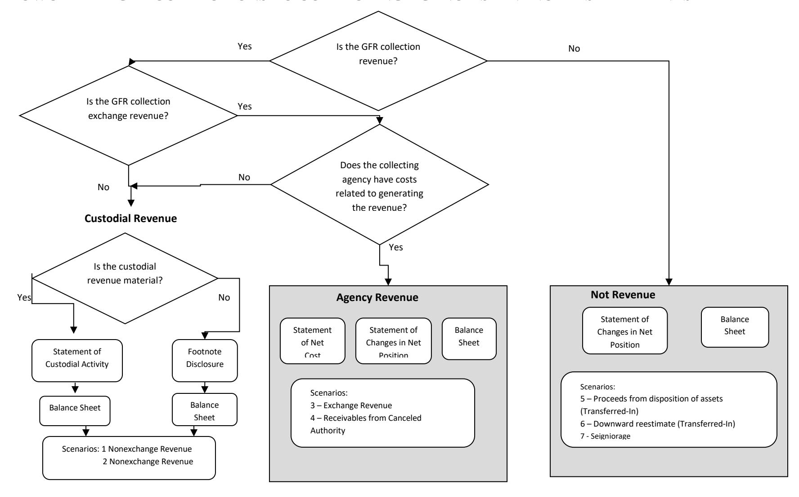

# **EFFECTIVE FISCAL YEAR 2021**

# **PREPARED BY:**

**GENERAL LEDGER AND ADVISORY BRANCH FISCAL ACCOUNTING OPERATIONS BUREAU OF THE FISCAL SERVICE U.S. DEPARTMENT OF THE TREASURY**

| Version | Date    | Description of Change                                                                      | Effective USSGL TFM      |  |  |
|---------|---------|--------------------------------------------------------------------------------------------|--------------------------|--|--|
| Number  |         |                                                                                            |                          |  |  |
| 1.0     | 08/2007 | Original                                                                                   | TFM Bulletin No. 2018-04 |  |  |
| 2.0     | 01/2021 | Added General Fund of the U.S. Government Transactions, Updated Financial Statements | TFM Bulletin No. 2021-07 |  |  |

#### **Background**

#### **Definition of a General Fund Receipt (GFR) Account**

The Government Accountability Office (GAO) defines a GFR Account as: "A receipt account credited with all collections that are not earmarked by law for another account for a specific purpose. These collections are presented in the President's budget as either governmental (budget) receipts or offsetting receipts. These include taxes, customs duties, and miscellaneous receipts." (Government Accountability Office, A Glossary of Terms Used in the Federal Budget Process, September 2005, GAO–05-734SP)

#### **Purpose**

This guidance proposes accounting and reporting guidance for various collections classified in GFR accounts. The following scenarios illustrate accounting transactions and reporting for specific types of collections. The focus of this guidance is on the GFR account activity. Related transactions illustrated in the scenarios such as credit reform activities are covered in more detail in the other case studies. Refer to those case studies for questions not specifically related to GFR activity.

#### **Federal Account Symbols (FAS), Treasury Account Symbols (TAS), and Collections**

The Federal Account Symbols and Titles (FAST) Book, published by Treasury, lists all FAS available for Federal agency use. A collection can be classified to any of the listed accounts. To classify a receipt, append your agency's two digit department code to the FAS. This combination of department code and FAS creates TAS. For example, collections for work performed in accordance with Economy Act can be deposited into any type of expenditure account. On the other hand, National Park Service fees are designated by law to be deposited to a special fund receipt account. Similarly, collections for the National Endowment for the Arts Gift Fund are designated by law to be deposited to a trust fund receipt account. Amounts collected in the course of business by the U.S. Postal Service are, by law, deposited to a revolving fund. Amounts not belonging to the Government are, by law, classified to deposit fund accounts. As you can see, a specific law determines how the collections in the preceding examples are classified in a TAS.

Absent specific legislation, collections should be classified to a **General Fund Receipt TAS**. Title 31, United States Code (USC), chapter 33, section 3302(b) establishes this concept by stating: "Except as provided in section 3718 (b) of this title, an official or agent of the Government receiving money for the Government from any source shall deposit the money in the Treasury as soon as practicable without deduction for any change or claim." Also, Title 31, USC, chapter 33, section 3302(e) states that "an official or

agent of the Government having custody or possession of public money shall keep an accurate entry of each amount of public money received, transferred, and paid."

#### **GFR Account Reporting Responsibility**

Within each GFR account category listed in the FAST Book there are unique FAS to identify specific activity. After selecting the proper TAS, the reporting entity should append its 3-digit agency identifier code to the beginning of the TAS for classifying the receipt to Treasury. A collecting entity typically reports all GFR TAS beginning with its 3-digit agency identifier code within its entity financial statements.

#### **FLOWCHART - GFR COLLECTIONS TO COLLECTING AGENCY'S FINANCIAL STATEMENTS**

### **Listing of USSGL Accounts Used in This Scenario**

| Account Number | Account Name                                                                        |
|----------------|-------------------------------------------------------------------------------------|
| Budgetary      |                                                                                     |
| 425100         | Reimbursements and Other Income Earned - Receivable                              |
| 465000         | Allotments – Expired Authority                                                   |
|                |                                                                                     |
| Proprietary    |                                                                                     |
| 101000         | Fund Balance With Treasury                                                          |
| 131000         | Accounts Receivable                                                                 |
| 298500         | Liability for Non-Entity Assets Not Reported on the Statement of Custodial Activity |
| 331000         | Cumulative Results of Operations                                                    |
| 590000         | Other Revenue                                                                       |
| 599000         | Collections for Others – Statement of Custodial Activity                         |
| 599300         | Offset to Non-Entity Collections - Statement of Changes in Net Position          |
| 599400         | Offset to Non-Entity Accrued Collections - Statement of Changes in Net Position  |

### **Scenario 4: Non-Custodial Statement Collections: Collection of Receivables From Canceled Authority**

#### **Canceled Appropriation**

Agencies must close appropriation accounts available for obligation during a definite period on September 30th of the fifth fiscal year after the account's obligational availability ends. Cancel any remaining balances (whether obligated or unobligated) in the account.

#### **Beginning Trial Balance – Expired Account which is Canceling**

|             |                                                        |       | Expired Account which is Canceling |  |  |
|-------------|--------------------------------------------------------|-------|------------------------------------------|--|--|
| Account     | Description                                            | Debit | Credit                                   |  |  |
| Budgetary   |                                                        |       |                                          |  |  |
| 425100      | Reimbursements and Other Income Earned - Receivable | 120   | -                                        |  |  |
| 465000      | Allotments – Expired Authority                      | -     | 120                                      |  |  |
| Total       |                                                        | 120   | 120                                      |  |  |
|             |                                                        | -     | -                                        |  |  |
| Proprietary |                                                        |       |                                          |  |  |
| 131000 (F)  | Accounts Receivable                                    | 120   | -                                        |  |  |
| 331000      | Cumulative Results of Operations                       | -     | 120                                      |  |  |
| Total       |                                                        | 120   | 120                                      |  |  |

#### **Year 6 (September 30 of 5th expired year)**

| 1. To record the cancellation of a receivable and reestablish cancelled receivable in the General Fund Receipt Account.         |       |        |       |                                                                                                       |       |        |      |
|------------------------------------------------------------------------------------------------------------------------------------|-------|--------|-------|-------------------------------------------------------------------------------------------------------|-------|--------|------|
| Canceling Account                                                                                                               | Debit | Credit | TC    | GFR Account                                                                                           | Debit | Credit | TC   |
| Budgetary Entry 465000 Allotments – Expired Authority 425100 Reimbursements And Other Income Earned - Receivable | 120   | 120    | F1442 | Budgetary Entry None                                                                               |       |        |      |
| Proprietary Entry 590000 (F) Other Revenue (RC 24)1 131000 (F) Accounts Receivable (RC 22)                             | 120   | 120    |       | Proprietary Entry 131000 (F) Accounts Receivable (RC 22) 590000 (F) Other Revenue (RC 24) | 120   | 120    | C420 |
|                                                                                                                                    |       |        |       | General Fund of the U.S. Government (099)                                                             |       |        |      |
| Budgetary Entry None                                                                                                            |       |        |       | Budgetary Entry None                                                                               |       |        |      |
| Proprietary Entry None                                                                                                          |       |        |       | Proprietary Entry None                                                                             |       |        |      |

1 RC – Reciprocal Category is shown for Intragovernmental Elimination Analysis (not included in GTAS upload)

2 Note the entries for recording a canceled receivable is considered an adjusting entry.

#### Also Post:

| 2. To record offset for the amount accrued in a General Fund receipt account and to establish a liability for non-entity assets that are not reported on the Statement of Custodial Activity or on the custodial footnote. |       |        |    |                                                                                                                                                                                                                                                                              |       |        |      |
|----------------------------------------------------------------------------------------------------------------------------------------------------------------------------------------------------------------------------------|-------|--------|----|------------------------------------------------------------------------------------------------------------------------------------------------------------------------------------------------------------------------------------------------------------------------------|-------|--------|------|
| Canceling Account                                                                                                                                                                                                             | Debit | Credit | TC | GFR Account                                                                                                                                                                                                                                                                  | Debit | Credit | TC   |
| Budgetary Entry None                                                                                                                                                                                                          |       |        |    | Budgetary Entry None                                                                                                                                                                                                                                                      |       |        |      |
| Proprietary Entry None                                                                                                                                                                                                        |       |        |    | Proprietary Entry 599400 (G)3 Offset to Non-Entity Accrued Collections – Statement of Changes in Net Position (RC 48) 298500 (G) Liability For Non- Entity Assets Not Reported on The Statement of Custodial Activity (RC 46)                     | 120   | 120    | C405 |
|                                                                                                                                                                                                                                  |       |        |    | General Fund of the U.S. Government (099)                                                                                                                                                                                                                                    |       |        |      |
| Budgetary Entry None                                                                                                                                                                                                          |       |        |    | Budgetary Entry None                                                                                                                                                                                                                                                      |       |        |      |
| Proprietary Entry None                                                                                                                                                                                                        |       |        |    | Proprietary Entry 198000 (F) Asset For Agency's Custodial and Non-Entity Liabilities – General Fund of the U.S. Government (RC 46)4 571200 (F) Accrual of Agency Amount to be Collected Custodial and Non-Entity – General Fund of the U.S. | 120   |        |      |
|                                                                                                                                                                                                                                  |       |        |    | Government (RC 48)                                                                                                                                                                                                                                                           |       | 120    |      |

3 The Federal/Non-Federal attribute domain value of "G" will always have trading partner 099 agency identifier.

4 The Trading Partner is Department of the Treasury (020).

**Year 6 – Preclosing Adjusted Trial Balance**

|             |                                                           | Canceling | Account | GFR Account |        |
|-------------|-----------------------------------------------------------|-----------|---------|-------------|--------|
| Account     | Description                                               | Debit     | Credit  | Debit       | Credit |
| Budgetary   |                                                           |           |         |             |        |
| None        | None                                                      | -         | -       | -           | -      |
|             |                                                           | -         | -       | -           | -      |
| Total       |                                                           | -         | -       | -           | -      |
|             |                                                           | -         | -       |             |        |
| Proprietary |                                                           |           |         |             |        |
| 131000 (F)  | Accounts Receivable                                       | -         | -       | 120         | -      |
| 298500 (G)  | Liability for Non-Entity Assets Not Reported on the       | -         | -       | -           | 120    |
|             | Statement of Custodial Activity                           |           |         |             |        |
| 331000      | Cumulative Results of Operations                          | -         | 120     | -           | -      |
| 590000 (F)  | Other Revenue                                             | 120       |         |             | 120    |
| 599400 (G)  | Offset to Non-Entity Accrued Collection – Statement of | -         | -       | 120         | -      |
|             | Changes in Net Position                                   |           |         |             |        |
| Total       |                                                           | 120       | 120     | 240         | 240    |

#### **Financial Statements:**

|             | CONSOLIDATED BALANCE SHEET AS OF SEPTEMBER 30, YEAR 6                                                                     |     |  |  |  |
|-------------|---------------------------------------------------------------------------------------------------------------------------|-----|--|--|--|
| Line No. |                                                                                                                           |     |  |  |  |
|             | Assets (Note 2)                                                                                                           |     |  |  |  |
|             | Intra-governmental                                                                                                        |     |  |  |  |
| 3.          | Accounts receivable, net (Note 6) (131000E)                                                                            | 120 |  |  |  |
| 6.          | Total Intra-governmental                                                                                                  | 120 |  |  |  |
| 16.         | Total assets                                                                                                              | 120 |  |  |  |
|             | Liabilities: (Note 13)                                                                                                 |     |  |  |  |
|             | Intra-governmental                                                                                                        |     |  |  |  |
| 22          | Other Liabilities (Notes 15 and 17)                                                                                       |     |  |  |  |
| 22.4        | Liability to the General Fund of the U.S. Government for custodial and other non-entity assets (Note 17) (298500E)     | 120 |  |  |  |
| 23.         | Total Intra-governmental                                                                                                  | 120 |  |  |  |
| 34.         | Total liabilities                                                                                                         | 120 |  |  |  |
| 35.         | Commitments and Contingencies (Note 19)                                                                                   |     |  |  |  |
|             | Net position:                                                                                                             |     |  |  |  |
| 37.2        | Cumulative results of operations – Funds other than those from Dedicated Collections (331000B, 590000E, 599400E) | -   |  |  |  |
| 38.         | Total net position                                                                                                        | -   |  |  |  |
| 39.         | Total liabilities and net position                                                                                        | 120 |  |  |  |

| CONSOLIDATED STATEMENT OF CHANGES IN NET POSITION FOR THE YEAR ENDED SEPTEMBER 30, YEAR 6 |                                        |                       |              |  |
|----------------------------------------------------------------------------------------------|----------------------------------------|-----------------------|--------------|--|
| Line No.                                                                                  |                                        | All Other Funds | Consolidated |  |
|                                                                                              | Cumulative Results from Operations:    |                       |              |  |
| 10.                                                                                          | Beginning Balances (331000B)           | 120                   | 120          |  |
| 12.                                                                                          | Beginning balances, as adjusted        | 120                   | 120          |  |
|                                                                                              | Budgetary Financing Sources:           |                       |              |  |
| 15.                                                                                          | Nonexchange revenue (590000E)          | -                     | -            |  |
|                                                                                              | Other Financing Sources (Nonexchange): |                       |              |  |
| 22.                                                                                          | Other (+/-) (599400E)                  | (120)                 | (120)        |  |
| 23.                                                                                          | Total Financing Sources                | (120)                 | (120)        |  |
| 24.                                                                                          | Net Cost of Operations (+/-)           | -                     | -            |  |
| 25.                                                                                          | Net Change                             | (120)                 | (120)        |  |
| 26.                                                                                          | Cumulative Results of Operations       | -                     | -            |  |
| 27.                                                                                          | Net Position                           | -                     | -            |  |

| SF 133 AND SCHEDULE P: REPORT ON BUDGET EXECUTION AND BUDGETARY RESOURCES AND BUDGET PROGRAM AND FINANCING SCHEDULE FOR THE YEAR ENDED SEPTEMBER 30, YEAR 6 |                                                                            |        |            |  |
|----------------------------------------------------------------------------------------------------------------------------------------------------------------|----------------------------------------------------------------------------|--------|------------|--|
| Line No.                                                                                                                                                       |                                                                            | SF 133 | Schedule P |  |
|                                                                                                                                                                | BUDGETARY RESOURCES                                                        |        |            |  |
|                                                                                                                                                                | Unobligated balance:                                                       |        |            |  |
| 1000                                                                                                                                                           | Unobligated balance brought forward, Oct 1 (425100B)                       | 120    | 120        |  |
| 1070                                                                                                                                                           | Unobligated balance (total)                                                | 120    | 120        |  |
| 1080                                                                                                                                                           | Expired unobligated balance brought forward, Oct 1                         | 120    | -          |  |
| 1099                                                                                                                                                           | Expired unobligated balance (total)                                        | 120    | -          |  |
|                                                                                                                                                                | Budget authority:                                                          |        |            |  |
|                                                                                                                                                                | Status of budgetary resources:                                             |        |            |  |
|                                                                                                                                                                | Spending authority from offsetting collections:                            |        |            |  |
|                                                                                                                                                                | Discretionary:                                                             |        |            |  |
| 1701                                                                                                                                                           | Change in uncollected payments, Federal sources (+ or-) (425100B, 425100E) | (120)  | (120)      |  |
| 1750                                                                                                                                                           | Spending authority from offsetting collections, discretionary (total)      | (120)  | (120)      |  |
| 1900                                                                                                                                                           | Budget authority (total)                                                   | (120)  | (120)      |  |
| 1910                                                                                                                                                           | Total budgetary resources                                                  | -      | -          |  |
| 1930                                                                                                                                                           | Total budgetary resources available                                        | -      | -          |  |
|                                                                                                                                                                | STATUS OF BUDGETARY RESOURCES                                              |        |            |  |
|                                                                                                                                                                | New obligations and upward adjustments:                                    |        |            |  |
|                                                                                                                                                                | Reimbursable:                                                              |        |            |  |
| 2190                                                                                                                                                           | New obligations and upward adjustments (total)                             | -      | -          |  |
|                                                                                                                                                                | Unobligated balance:                                                       |        |            |  |
|                                                                                                                                                                | Apportioned, unexpired accounts:                                           |        |            |  |
| 2413                                                                                                                                                           | Expired unobligated balance: end of year (465000E)                         | -      | -          |  |
| 2490                                                                                                                                                           | Unobligated balance, end of year (total)                                   | -      | -          |  |
| 2500                                                                                                                                                           | Total budgetary resources                                                  | -      | -          |  |

| SF 133 AND SCHEDULE P: REPORT ON BUDGET EXECUTION AND BUDGETARY RESOURCES AND BUDGET PROGRAM AND FINANCING SCHEDULE AS OF SEPTEMBER 30, YEAR 6 |                                                                                          |        |            |
|---------------------------------------------------------------------------------------------------------------------------------------------------|------------------------------------------------------------------------------------------|--------|------------|
| Line No.                                                                                                                                          |                                                                                          | SF 133 | Schedule P |
|                                                                                                                                                   | Memorandum (non-add) entries:                                                            |        |            |
| 2501                                                                                                                                              | Subject to apportionment unobligated balance, end of year (465000E)                   | -      | -          |
|                                                                                                                                                   | CHANGE IN OBLIGATED BALANCE                                                              |        |            |
|                                                                                                                                                   | Unpaid obligations:                                                                      |        |            |
| 3060                                                                                                                                              | Uncollected pymts, Fed sources, brought forward, Oct 1 (-) (425100B)                     | (120)  | (120)      |
| 3061                                                                                                                                              | Adjustments to uncollected pymts, Fed sources, brought forward, Oct 1 (+ or -) (425100E) | 120    | 120        |
|                                                                                                                                                   | Memorandum (non-add) entries:                                                            |        |            |
| 3100                                                                                                                                              | Obligated balance, start of year (+ or -)                                                | -      | -          |
| 3200                                                                                                                                              | Obligated balance, end of year (+ or -)                                                  | -      | -          |
|                                                                                                                                                   | BUDGET AUTHORITY AND OUTLAYS, NET                                                        |        |            |
|                                                                                                                                                   | Discretionary:                                                                           |        |            |
|                                                                                                                                                   | Gross budget authority and outlays:                                                      |        |            |
| 4000                                                                                                                                              | Budget authority, gross                                                                  | (120)  | (120)      |
|                                                                                                                                                   | Outlays, gross                                                                           |        |            |
| 4020                                                                                                                                              | Outlays, gross (total)                                                                   | -      | -          |
| 4051                                                                                                                                              | Change in uncollected pymts, Fed sources, expired accounts (+ or -) (425100B, 425100E)   | 120    | 120        |
| 4060                                                                                                                                              | Additional offsets against budget authority only (total)                                 | 120    | -          |
| 4070                                                                                                                                              | Budget authority, net (discretionary)                                                    | -      | (120)      |
| 4080                                                                                                                                              | Outlays, net (discretionary)                                                             | -      | -          |
|                                                                                                                                                   | Budget authority and outlays, net (total)                                                |        |            |
| 4141                                                                                                                                              | Change in uncollected pymts, Fed sources, expired account (+ or -) (425100B, 425100E)    | 120    | -          |
| 4150                                                                                                                                              | Additional offsets against budget authority only (total)                                 | 120    | -          |
| 4180                                                                                                                                              | Budget authority, net (total)                                                            | -      | -          |
| 4190                                                                                                                                              | Outlays, net (total)                                                                     | -      | -          |

#### **Reclassified Financial Statements:**

**Note: Effective FY 2021, the Reclassified Balance Sheet is the same as the Balance Sheet. Therefore, the Reclassified Balance Sheet is not presented in this scenario.**

|             | RECLASSIFIED STATEMENT OF OPERATIONS AND CHANGES IN NET POSITION FOR THE YEAR ENDED SEPTEMBER 30, YEAR 6                                    |                       |              |  |
|-------------|------------------------------------------------------------------------------------------------------------------------------------------------|-----------------------|--------------|--|
| Line No. |                                                                                                                                                | All Other Funds | Consolidated |  |
| 1           | Net position, beginning of period (331000B)                                                                                                    | 120                   | 120          |  |
| 4           | Net position, beginning of period - adjusted                                                                                                | 120                   | 120          |  |
| 6           | Federal non-exchange revenue:                                                                                                                  |                       |              |  |
| 6.7         | Accrual of Collections Yet to be Transferred to a TAS Other Than the General Fund of the U.S. Government – Nonexchange (RC 16) (599400E) | 120                   | 120          |  |
| 6.9         | Total federal non-exchange revenue                                                                                                             | (120)                 | (120)        |  |
| 9           | Net cost of operations (+/-)                                                                                                                   | -                     | -            |  |
| 10          | Net position, end of period                                                                                                                    | -                     | -            |  |

#### **Closing Entries:**

| 1. To record the closing of revenue, expense, and other financing source accounts to cumulative results of operations. |       |        |      |                                                                                                                                                                                                       |       |        |  |
|---------------------------------------------------------------------------------------------------------------------------|-------|--------|------|-------------------------------------------------------------------------------------------------------------------------------------------------------------------------------------------------------|-------|--------|--|
| Canceling Account                                                                                                      | Debit | Credit | TC   | GFR Account                                                                                                                                                                                           | Debit | Credit |  |
| Budgetary Entry None                                                                                                   |       |        |      | Budgetary Entry None                                                                                                                                                                               |       |        |  |
| Proprietary Entry 331000 Cumulative Results of Operations 590000 (F) Other Revenue                                  | 120   | 120    | F336 | Proprietary Entry 331000 Cumulative Results of Operations 599400 (G) Offset to Non-Entity Accrued Collection – Statement of Changes in Net Position (RC 48)                         | 120   | 120    |  |
|                                                                                                                           |       |        |      | 590000 (F) Other Revenue 331000 Cumulative Results of                                                                                                                                              | 120   |        |  |
| Operations 120 General Fund of the U.S. Government (099)                                                            |       |        |      |                                                                                                                                                                                                       |       |        |  |
|                                                                                                                           |       |        |      | Budgetary Entry None                                                                                                                                                                               |       |        |  |
|                                                                                                                           |       |        |      | Proprietary Entry 571200 (F) Accrual of Agency Amount – To Be Collected – Custodial and Non-Entity – General Fund of the U.S. Government (RC 48) 331000 Cumulative Results of | 120   |        |  |
|                                                                                                                           |       |        |      | Operations                                                                                                                                                                                            |       | 120    |  |

#### **Year 6 (September 30 of 5th expired year) – Post-Closing Trial Balance**

|             |                                                     |       | Canceling Account |       | GFR Account |
|-------------|-----------------------------------------------------|-------|----------------------|-------|-------------|
| Account     | Description                                         | Debit | Credit               | Debit | Credit      |
| Budgetary   |                                                     |       |                      |       |             |
| None        | None                                                | -     | -                    | -     | -           |
|             |                                                     | -     | -                    | -     | -           |
| Total       |                                                     | -     | -                    | -     | -           |
|             |                                                     | -     | -                    |       |             |
| Proprietary |                                                     |       |                      |       |             |
| 131000 (F)  | Accounts Receivable                                 | -     | -                    | 120   | -           |
| 298500 (G)  | Liability for Non-Entity Assets Not Reported on the | -     | -                    | -     | 120         |
|             | Statement of Custodial Activity                     |       |                      |       |             |
| Total       |                                                     | -     | -                    | 120   | 120         |

#### **Year 7 – 1st Quarter**

| 1. To record the collection of receivables of custodial revenue from a non-Federal source that is deposited to a miscellaneous receipt account. |                                           |        |    |                                                                                                                                                             |       |        |      |  |  |
|-------------------------------------------------------------------------------------------------------------------------------------------------------|-------------------------------------------|--------|----|-------------------------------------------------------------------------------------------------------------------------------------------------------------|-------|--------|------|--|--|
| Canceled Account                                                                                                                                      | Debit                                     | Credit | TC | GFR Account                                                                                                                                                 | Debit | Credit | TC   |  |  |
| Budgetary Entry None                                                                                                                               |                                           |        |    | Budgetary Entry None                                                                                                                                     |       |        |      |  |  |
| Proprietary Entry None                                                                                                                             |                                           |        |    | Proprietary Entry 101000 (G) Fund Balance With Treasury5 (RC 40) 131000 (N) Accounts Receivable                                                    | 50    | 50     | C143 |  |  |
|                                                                                                                                                       | General Fund of the U.S. Government (099) |        |    |                                                                                                                                                             |       |        |      |  |  |
| Budgetary Entry None                                                                                                                               |                                           |        |    | Budgetary Entry None                                                                                                                                     |       |        |      |  |  |
| Proprietary Entry None                                                                                                                             |                                           |        |    | Proprietary Entry 198000 (F) Assets for Agency's Custodial and Non-Entity Liability 201000 (F) Liability for Fund Balance With Treasury (RC 40) | 50    | 50     |      |  |  |

5 Although USSGL account 101000 is deposited into the General Fund of the U.S. Government, the collecting agency still has to carry the balances of USSGL accounts 101000 and 298500 on its quarterly Balance Sheet. Treasury's CARS system does not sweep USSGL account 101000 until the year end. The agency should make a note of this as a reconciling item.

#### Also Post:

| 2. To reclassify the offset from the revenue or other financing sources accrued to revenue or other financing sources collected for others that is not reported on the Statement of Custodial Activity or on the custodial footnote. |       |        |    |                                                                                                                                                                                                                                                                        |       |        |      |  |
|--------------------------------------------------------------------------------------------------------------------------------------------------------------------------------------------------------------------------------------------|-------|--------|----|------------------------------------------------------------------------------------------------------------------------------------------------------------------------------------------------------------------------------------------------------------------------|-------|--------|------|--|
| Canceled Account                                                                                                                                                                                                                        | Debit | Credit | TC | GFR Account                                                                                                                                                                                                                                                            | Debit | Credit | TC   |  |
| Budgetary Entry None                                                                                                                                                                                                                    |       |        |    | Budgetary Entry None                                                                                                                                                                                                                                                |       |        |      |  |
| Proprietary Entry None                                                                                                                                                                                                                  |       |        |    | Proprietary Entry 599300 (G) Offset to Non-Entity Collections – Statement of Changes in Net Position (RC 44) 599400 (G) Offset to Non-Entity Accrued Collections – Statement of Changes in Net Position (RC 48)                                | 50    | 50     | D585 |  |
|                                                                                                                                                                                                                                            |       |        |    | General Fund of the U.S. Government (099)                                                                                                                                                                                                                              |       |        |      |  |
| Budgetary Entry None                                                                                                                                                                                                                    |       |        |    | Budgetary Entry None                                                                                                                                                                                                                                                |       |        |      |  |
| Proprietary Entry None                                                                                                                                                                                                                  |       |        |    | Proprietary Entry 571200 (F) Accrual of Agency Amount – To Be Collected – Custodial and Non-Entity – General Fund of the U.S. Government (RC 48) 571000 (F) Transfer In Of Agency Unavailable Custodial and Non- Entity Collections (RC 44) | 50    | 50     |      |  |

**Year 7 - Preclosing Trial Balance**

|             |                                                                       | GFR Account |        |  |  |
|-------------|-----------------------------------------------------------------------|-------------|--------|--|--|
| Account     | Description                                                           | Debit       | Credit |  |  |
| Budgetary   |                                                                       |             |        |  |  |
| None        |                                                                       |             |        |  |  |
|             |                                                                       |             |        |  |  |
| Proprietary |                                                                       |             |        |  |  |
| 101000 (G)  | Fund Balance With Treasury                                            | 50          | -      |  |  |
| 131000 (N)  | Accounts Receivable                                                   | 70          | -      |  |  |
| 298500 (G)  | Liability for Non-Entity Assets Not Reported on the Statement of      | -           | 120    |  |  |
|             | Custodial Activity                                                    |             |        |  |  |
| 599300 (G)  | Offset to Non-Entity Collections – Statement of Changes in Net     | 50          | -      |  |  |
|             | Position                                                              |             |        |  |  |
| 599400 (G)  | Offset to Non-Entity Accrued Collections – Statement of Changes in | -           | 50     |  |  |
|             | Net Position                                                          |             |        |  |  |
| Total       |                                                                       | 170         | 170    |  |  |

#### **Financial Statements:**

|             | CONSOLIDATED BALANCE SHEET AS OF 1st QUARTER, DECEMBER 31, YEAR 7                                               |     |
|-------------|--------------------------------------------------------------------------------------------------------------------|-----|
| Line No. |                                                                                                                    |     |
|             | Assets (Note 2)                                                                                                    |     |
|             | Intra-governmental                                                                                                 |     |
| 1.          | Fund Balance With Treasury (Note 3) (101000E)                                                                      | 50  |
| 3.          | Accounts receivable, net (Note 6) (131000E)                                                                     | 70  |
| 6.          | Total Intra-governmental                                                                                           | 120 |
| 16.         | Total assets                                                                                                       | 120 |
|             | Liabilities: (Note 13)                                                                                          |     |
|             | Intra-governmental                                                                                                 |     |
| 22          | Other Liabilities (Notes 15 and 17)                                                                                |     |
| 22.4        | Liability to the General Fund of the U.S. Government for custodial and other non-entity assets (Note 17) (298500E) | 120 |
| 23.         | Total Intra-governmental                                                                                           | 120 |
| 34.         | Total liabilities                                                                                                  | 120 |
| 35          | Commitments and Contingencies (Note 19)                                                                            |     |
|             | Net Position:                                                                                                      |     |
| 37.         | Total net position – Funds other than those from Dedicated Collections (Combined or Consolidated)               |     |
| 37.2        | Cumulative results of operations – Funds other than those from Dedicated Collections (599300E, 599400E)      | -   |
| 38.         | Total net position                                                                                                 | -   |
| 39.         | Total liabilities and net position                                                                                 | 120 |

#### **Year 7 – 4th Quarter**

| 1. To record the collection of receivables of custodial revenue from a non-Federal source that is deposited to a miscellaneous receipt account. |       |        |    |                                                                                                                                                             |       |        |      |  |
|-------------------------------------------------------------------------------------------------------------------------------------------------------|-------|--------|----|-------------------------------------------------------------------------------------------------------------------------------------------------------------|-------|--------|------|--|
| Canceled Account                                                                                                                                   | Debit | Credit | TC | GFR Account                                                                                                                                                 | Debit | Credit | TC   |  |
| Budgetary Entry None                                                                                                                               |       |        |    | Budgetary Entry None                                                                                                                                     |       |        |      |  |
| Proprietary Entry None                                                                                                                             |       |        |    | Proprietary Entry 101000 (G) Fund Balance With Treasury (RC 40) 131000 (N) Accounts Receivable                                                     | 70    | 70     | C143 |  |
|                                                                                                                                                       |       |        |    | General Fund of the U.S. Government (099)                                                                                                                   |       |        |      |  |
| Budgetary Entry None                                                                                                                               |       |        |    | Budgetary Entry None                                                                                                                                     |       |        |      |  |
| Proprietary Entry None                                                                                                                             |       |        |    | Proprietary Entry 198000 (F) Assets for Agency's Custodial and Non-Entity Liability 201000 (F) Liability for Fund Balance With Treasury (RC 40) | 70    | 70     |      |  |

#### Also Post:

| 2. To reclassify the offset from the revenue or other financing sources accrued to revenue or other financing sources collected for others that is not reported on the Statement of Custodial Activity or on the custodial footnote. |       |        |    |                                                                                                                                                                                                                                                                                      |       |        |      |
|--------------------------------------------------------------------------------------------------------------------------------------------------------------------------------------------------------------------------------------------|-------|--------|----|--------------------------------------------------------------------------------------------------------------------------------------------------------------------------------------------------------------------------------------------------------------------------------------|-------|--------|------|
| Canceled Account                                                                                                                                                                                                                        | Debit | Credit | TC | GFR Account                                                                                                                                                                                                                                                                          | Debit | Credit | TC   |
| Budgetary Entry None                                                                                                                                                                                                                    |       |        |    | Budgetary Entry None                                                                                                                                                                                                                                                              |       |        |      |
| Proprietary Entry None                                                                                                                                                                                                                  |       |        |    | Proprietary Entry 599300 (G) Offset to Non-Entity Collections – Statement of Changes in Net Position (RC 44) 599400 (G) Offset to Non-Entity Accrued Collections – Statement of Changes in Net Position (RC 48) General Fund of the U.S. Government (099) | 70    | 70     | D585 |
| Budgetary Entry None                                                                                                                                                                                                                    |       |        |    | Budgetary Entry None                                                                                                                                                                                                                                                              |       |        |      |
| Proprietary Entry None                                                                                                                                                                                                                  |       |        |    | Proprietary Entry 571200 (F) Accrual of Agency Amount – To Be Collected – Custodial and Non-Entity – General Fund of the U.S. Government (RC 48) 571000 (F) Transfer in of Agency Unavailable Custodial and Non- Entity Collections (RC 44)               | 70    | 70     |      |

**Year 7 – Preclosing Trial Balance**

|             |                                                                       | GFR Account |        |  |
|-------------|-----------------------------------------------------------------------|-------------|--------|--|
| Account     | Description                                                           | Debit       | Credit |  |
| Budgetary   |                                                                       |             |        |  |
| None        |                                                                       |             |        |  |
|             |                                                                       |             |        |  |
| Proprietary |                                                                       |             |        |  |
| 101000 (G)  | Fund Balance With Treasury                                            | 120         | -      |  |
| 298500 (G)  | Liability for Non-Entity Assets Not Reported on the Statement of      | -           | 120    |  |
|             | Custodial Activity                                                    |             |        |  |
| 599300 (G)  | Offset to Non-Entity Collections – Statement of Changes in Net     | 120         | -      |  |
|             | Position                                                              |             |        |  |
| 599400 (G)  | Offset to Non-Entity Accrued Collections – Statement of Changes in | -           | 120    |  |
|             | Net Position                                                          |             |        |  |
| Total       |                                                                       | 240         | 240    |  |

#### **Year 7 – Preclosing Adjusting Entry**

| 1. To record the closing of FBWT collected in a General Fund receipt account at the year end. |       |        |    |                                                                                                                                                                                          |       |        |      |
|--------------------------------------------------------------------------------------------------|-------|--------|----|------------------------------------------------------------------------------------------------------------------------------------------------------------------------------------------|-------|--------|------|
| Canceled Account                                                                              | Debit | Credit | TC | GFR Account                                                                                                                                                                              | Debit | Credit | TC   |
| Budgetary Entry None                                                                          |       |        |    | Budgetary Entry None                                                                                                                                                                  |       |        |      |
| Proprietary Entry None                                                                        |       |        |    | Proprietary Entry 298500 (G) Liability for Non-Entity Assets Not Reported on the Statement of Custodial Activity (RC 46) 101000 (G) Fund Balance With Treasury (RC 40) | 120   | 120    | F124 |
|                                                                                                  |       |        |    | General Fund of the U.S. Government (099)                                                                                                                                                |       |        |      |
| Budgetary Entry None                                                                          |       |        |    | Budgetary Entry None                                                                                                                                                                  |       |        |      |
| Proprietary Entry None                                                                        |       |        |    | Proprietary Entry 201000 (F) Liability for Fund Balance With Treasury (RC 40) 198000 (F) Asset for Agency's Custodial and Non-Entity Liabilities General Fund of the U.S. | 120   |        |      |
|                                                                                                  |       |        |    | Government (RC 46)                                                                                                                                                                       |       | 120    |      |

**Year 7 – Preclosing Adjusted Trial Balance**

|             |                                                                                       | GFR Account |        |  |
|-------------|---------------------------------------------------------------------------------------|-------------|--------|--|
| Account     | Description                                                                           | Debit       | Credit |  |
| Budgetary   |                                                                                       |             |        |  |
| None        |                                                                                       |             |        |  |
| Proprietary |                                                                                       |             |        |  |
| 599300 (G)  | Offset to Non-Entity Collections – Statement of Changes in Net Position         | 120         | -      |  |
| 599400 (G)  | Offset to Non-Entity Accrued Collections – Statement of Changes in Net Position | -           | 120    |  |
| Total       |                                                                                       | 120         | 120    |  |

#### **Closing Entries:**

| 1. To record the closing of revenue, expense, and other financing source accounts to cumulative results of operations. |                                      |  |  |                                                                                                                                                                                           |     |     |
|---------------------------------------------------------------------------------------------------------------------------|--------------------------------------|--|--|-------------------------------------------------------------------------------------------------------------------------------------------------------------------------------------------|-----|-----|
| Canceled Account                                                                                                          | Debit Credit TC GFR Account |  |  |                                                                                                                                                                                           |     |     |
| Budgetary Entry None                                                                                                   |                                      |  |  | Budgetary Entry None                                                                                                                                                                   |     |     |
| Proprietary Entry None                                                                                                 |                                      |  |  | Proprietary Entry 331000 Cumulative Results of Operations 599300 (G) Offset to Non-Entity Collections – Statement of Changes in Net Position (RC 44)                       | 120 | 120 |
|                                                                                                                           |                                      |  |  | 599400 (G) Offset to Non-Entity Accrued Collections – Statement of Changes in Net Position (RC 48) 331000 Cumulative Results of Operations                                 | 120 | 120 |
|                                                                                                                           |                                      |  |  | General Fund of the U.S. Government (099)                                                                                                                                                 |     |     |
| Budgetary Entry None                                                                                                   |                                      |  |  | Budgetary Entry None                                                                                                                                                                   |     |     |
| Proprietary Entry None                                                                                                 |                                      |  |  | Proprietary Entry 571000 (F) Transfer in of Agency Unavailable Custodial and Non-Entity Collections (RC 44) 331000 Cumulative Results of Operations                        | 120 | 120 |
|                                                                                                                           |                                      |  |  | 331000 Cumulative Results of Operations 571200 (F) Accrual of Agency Amount – To Be Collected – Custodial and Non- Entity – General Fund of the U.S. Government (RC 48) | 120 | 120 |

#### **Post-Closing Trial Balance:**

|             |             | GFR Account |        |  |
|-------------|-------------|-------------|--------|--|
| Account     | Description | Debit       | Credit |  |
| Budgetary   |             |             |        |  |
| None        |             |             |        |  |
|             |             |             |        |  |
| Proprietary |             |             |        |  |
| None        |             |             |        |  |