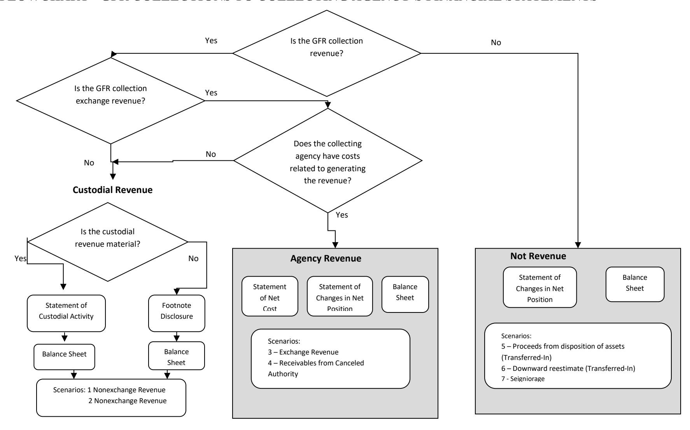

# **EFFECTIVE FISCAL YEAR 2021**

# **PREPARED BY:**

**GENERAL LEDGER AND ADVISORY BRANCH FISCAL ACCOUNTING OPERATIONS BUREAU OF THE FISCAL SERVICE U.S. DEPARTMENT OF THE TREASURY**

| Version | Date    | Description of Change                                                                      | Effective USSGL TFM      |  |  |
|---------|---------|--------------------------------------------------------------------------------------------|--------------------------|--|--|
| Number  |         |                                                                                            |                          |  |  |
| 1.0     | 08/2007 | Original                                                                                   | TFM Bulletin No. 2018-04 |  |  |
| 2.0     | 01/2021 | Added General Fund of the U.S. Government Transactions, Updated Financial Statements | TFM Bulletin No. 2021-07 |  |  |

#### **Background**

#### **Definition of a General Fund Receipt (GFR) Account**

The Government Accountability Office (GAO) defines a GFR Account as: "A receipt account credited with all collections that are not earmarked by law for another account for a specific purpose. These collections are presented in the President's budget as either governmental (budget) receipts or offsetting receipts. These include taxes, customs duties, and miscellaneous receipts." (Government Accountability Office, A Glossary of Terms Used in the Federal Budget Process, September 2005, GAO–05-734SP)

#### **Purpose**

This guidance proposes accounting and reporting guidance for various collections classified in GFR accounts. The following scenarios illustrate accounting transactions and reporting for specific types of collections. The focus of this guidance is on the GFR account activity. Related transactions illustrated in the scenarios such as credit reform activities are covered in more detail in the other case studies. Refer to those case studies for questions not specifically related to GFR activity.

# **Federal Account Symbols (FAS), Treasury Account Symbols (TAS), and Collections**

The Federal Account Symbols and Titles (FAST) Book, published by Treasury, lists all FAS available for Federal agency use. A collection can be classified to any of the listed accounts. To classify a receipt, append your agency's two digit department code to the FAS. This combination of department code and FAS creates TAS. For example, collections for work performed in accordance with Economy Act can be deposited into any type of expenditure account. On the other hand, National Park Service fees are designated by law to be deposited to a special fund receipt account. Similarly, collections for the National Endowment for the Arts Gift Fund are designated by law to be deposited to a trust fund receipt account. Amounts collected in the course of business by the U.S. Postal Service are, by law, deposited to a revolving fund. Amounts not belonging to the Government are, by law, classified to deposit fund accounts. As you can see, a specific law determines how the collections in the preceding examples are classified in a TAS.

Absent specific legislation, collections should be classified to a **General Fund Receipt TAS**. Title 31, United States Code (USC), chapter 33, section 3302(b) establishes this concept by stating: "Except as provided in section 3718 (b) of this title, an official or agent of the Government receiving money for the Government from any source shall deposit the money in the Treasury as soon as practicable without deduction for any change or claim." Also, Title 31, USC, chapter 33, section 3302(e) states that "an official or agent of the Government having custody or possession of public money shall keep an accurate entry of each amount of public money received, transferred, and paid."

#### **GFR Account Categories in the FAST Book**

The "Types of Collections and Relevant FASAB References" column was included in the table to assist users in providing background information. The users should note that the types of collections and limited paragraph references listed on the chart are suggestions and they should not be solely relied on. Each entity should perform its own research to determine the appropriate category for its collection.

| FAS                                   | Description of Types of GFR Accounts                                                                                                                                                                                           | Types of Collections and Relevant FASAB Reference |
|---------------------------------------|--------------------------------------------------------------------------------------------------------------------------------------------------------------------------------------------------------------------------------|------------------------------------------------------|
| 2600 – Sale of Government property | Proceeds from the sale of tangible property, real or personal, representing the liquidation of, or realization upon, assets other than the sale of products. Includes S and E funded activity and grant-funded activity. | Exchange-gain/loss, SFFAS No. 7, par. 295, 354    |

#### **GFR Account Reporting Responsibility**

Within each GFR account category listed in the FAST Book there are unique FAS to identify specific activity. After selecting the proper TAS, the reporting entity should append its 3-digit agency identifier code to the beginning of the TAS for classifying the receipt to Treasury. A collecting entity typically reports all GFR TAS beginning with its 3-digit agency identifier code within its entity financial statements.

# **FLOWCHART - GFR COLLECTIONS TO COLLECTING AGENCY'S FINANCIAL STATEMENTS**

# **Listing of USSGL Accounts Used in This Scenario**

| Proprietary |                                                                                     |  |
|-------------|-------------------------------------------------------------------------------------|--|
| 101000      | Fund Balance With Treasury                                                          |  |
| 175000      | Equipment                                                                           |  |
| 175900      | Accumulated Depreciation on Equipment                                               |  |
| 298500      | Liability for Non-Entity Assets Not Reported on the Statement of Custodial Activity |  |
| 331000      | Cumulative Results of Operations                                                    |  |
| 577500      | Non-Budgetary Financing Sources Transferred In                                      |  |
| 577600      | Non-Budgetary Financing Sources Transferred Out                                     |  |
| 599300      | Offset to Non-Entity Collections - Statement of Changes in Net Position          |  |
| 711000      | Gains on Disposition of Assets – Other                                           |  |
| 721000      | Losses on Disposition of Assets – Other                                          |  |

**Scenario 5 Non-Custodial Statement Collections: Collection of Proceeds From Disposition of Personal Property** (Assume the replacement property is not acquired within a 2 year period; therefore, the money is deposited into Treasury's GFR Account.)

# **Disposition of Personal Property**

Agencies can use the proceeds from the disposal of personal property to acquire replacement property within a prescribed time limit (the year the property is disposed plus one subsequent year.) If an acquisition of the replacement property does not occur within the prescribed time, the proceeds must be transferred to a GFR account.

**If agencies have authority from legislation to keep proceeds for more than the prescribed period, then this scenario may not be applicable.** The purpose of this section is to show how sales proceeds are collected into a GFR account.

**NOTE:** In reality, proceeds are deposited directly into an agency's budget clearing account F3845, "Proceeds of Sales, Personal Property," when personal property is disposed. However, for reporting purposes, the money will appear as if it's coming into the program fund first and is then transferred to the budget clearing account. The accounting entries are illustrated this way so that the asset (property) is properly removed from the program fund.

Currently clearing accounts only record assets and liabilities. But, in this case, when the fund balance is "transferred out" from a collecting entity to a clearing account the matching "transferred in" account will not be recorded in the General Fund receipt account until the clearing account disburses the fund balance in a subsequent year. For example, a collecting entity will record "transferred out" in one year but the matching "transferred in" will not be recorded in the General Fund receipt account until the following year. Therefore, the Issues Resolution Committee (IRC) decided that it would be cleaner to record a matching transferred in/out pair when the proceeds are transferred from the collecting entity to the clearing account and also when the fund balance is transferred from the clearing account to the GFR account in the subsequent period. This process will cause F3845 to have a net position, because the proceeds transferred in to the clearing account is generally not used or returned to the GFR account within the same accounting period. **Having a net position in a budget clearing account, F3845, is an exception, and should not be normal practice for most clearing accounts.**

#### **Beginning Trial Balance**

|             |                                       | Collecting Entity |        |  |  |
|-------------|---------------------------------------|-------------------|--------|--|--|
| Account     | Description                           | Debit             | Credit |  |  |
| Budgetary   |                                       |                   |        |  |  |
| None        |                                       |                   |        |  |  |
|             |                                       |                   |        |  |  |
| Proprietary |                                       |                   |        |  |  |
| 175000      | Equipment                             | 1,200             |        |  |  |
| 175900      | Accumulated Depreciation on Equipment |                   | 480    |  |  |
| 331000      | Cumulative Results of Operations      |                   | 720    |  |  |
|             | Total                                 | 1,200             | 1,200  |  |  |

#### **Year 2 – 1st Quarter**

1. To record the sale of agency equipment for \$300. (Assume this is **not** distributed receipts.) **NOTE:** Money is deposited to a clearing account, but in order to remove the PPE when it is sold, the Fund Balance With Treasury has to come into the collecting entity first (See Transaction #2 for the transfer of funds).

| Collecting Entity                                                             |     |     |      | Clearing Account                          |    |    |    |
|-------------------------------------------------------------------------------|-----|-----|------|-------------------------------------------|----|----|----|
| Description                                                                   | DR  | CR  | TC   | Description                               | DR | CR | TC |
| Budgetary Entry                                                               |     |     |      | Budgetary Entry                           |    |    |    |
| None                                                                          |     |     |      | None                                      |    |    |    |
| Proprietary Entry                                                             |     |     |      | Proprietary Entry                         |    |    |    |
| 101000 (G)1 Fund Balance With                                                 |     |     | C610 | None                                      |    |    |    |
| Treasury2 (RC 40)3                                                            | 300 |     |      |                                           |    |    |    |
| 175900 (N) Accumulated Depreciation                                           |     |     |      |                                           |    |    |    |
| on Equipment                                                                  | 300 |     |      |                                           |    |    |    |
| 175000 (N) Equipment                                                          |     | 500 |      |                                           |    |    |    |
| 711000 (N) Gain on Disposition of                                             |     |     |      |                                           |    |    |    |
| Assets – Other                                                             |     | 100 |      |                                           |    |    |    |
|                                                                               |     |     |      |                                           |    |    |    |
|                                                                               |     |     |      | General Fund of the U.S. Government (099) |    |    |    |
| Budgetary Entry                                                               |     |     |      | Budgetary Entry                           |    |    |    |
| None                                                                          |     |     |      | None                                      |    |    |    |
|                                                                               |     |     |      |                                           |    |    |    |
| Proprietary Entry                                                             |     |     |      | Proprietary Entry                         |    |    |    |
| 198000 (F) Asset for Agency's                                                 |     |     |      | None                                      |    |    |    |
| Custodial and Non-Entity Liabilities – General Fund of the U.S. Government | 300 |     |      |                                           |    |    |    |
| 201000 (F) Liability for Fund                                                 |     |     |      |                                           |    |    |    |
| Balance With Treasury (RC 40)                                                 |     | 300 |      |                                           |    |    |    |

1 The Federal/Non-Federal attribute domain value of "G" will always have trading partner 099 agency identifier.

2 Although USSGL account 101000 is deposited into the General Fund of the U.S. Government, the collecting agency still has to carry the balances of USSGL accounts 101000 and 298500 on its quarterly Balance Sheet. Treasury's CARS system does not sweep USSGL account 101000 until the year end. The agency should make a note of this as a reconciling item.

3 RC – Reciprocal Category is shown for Intragovernmental Elimination Analysis (not included in GTAS upload)

| 2. To record the transfer of the funds from the sale of equipment. |     |     |      |                                           |     |     |      |
|--------------------------------------------------------------------------|-----|-----|------|-------------------------------------------|-----|-----|------|
| Collecting Entity                                                        |     |     |      | Clearing Account                          |     |     |      |
| Description                                                              | DR  | CR  | TC   | Description                               | DR  | CR  | TC   |
| Budgetary Entry                                                          |     |     |      | Budgetary Entry                           |     |     |      |
| None                                                                     |     |     |      | None                                      |     |     |      |
| Proprietary Entry                                                        |     |     |      | Proprietary Entry                         |     |     |      |
| 577600 (F) Non-Budgetary Financing                                       |     |     |      | 101000 (G) Fund Balance With              |     |     |      |
| Sources Transferred Out (RC 18)                                          | 300 |     | E509 | Treasury                                  | 300 |     | C155 |
| 101000 (G) Fund Balance With                                             |     |     |      | 577500 (F) Non-Budgetary                  |     |     |      |
| Treasury (RC 40)                                                         |     | 300 |      | Financing Sources Transferred In          |     | 300 |      |
|                                                                          |     |     |      | (RC 18)                                   |     |     |      |
|                                                                          |     |     |      | General Fund of the U.S. Government (099) |     |     |      |
| Budgetary Entry                                                          |     |     |      | Budgetary Entry                           |     |     |      |
| None                                                                     |     |     |      | None                                      |     |     |      |
| Proprietary Entry                                                        |     |     |      | Proprietary Entry                         |     |     |      |
| 201000 (F) Liability for Fund Balance                                    |     |     |      | 198000 (F) Asset for Agency's             |     |     |      |
| With Treasury (RC 40)                                                    | 300 |     |      | Custodial and Non-Entity Liabilities      | 300 |     |      |
| 198000 (F) Asset for Agency's                                            |     |     |      | – General Fund of the U.S.             |     |     |      |
| Custodial and Non-Entity Liabilities                                     |     |     |      | Government                                |     |     |      |
| General Fund of the U.S.                                                 |     |     |      | 201000 (F) Liability For Fund             |     | 300 |      |
| Government                                                               |     | 300 |      | Balance With Treasury (RC 40)             |     |     |      |

| 3.                                                                                                                                                                                                  |             |     |      | To record receipts returned to the Treasury GFR account. (It was determined that the replacement property will not be acquired and the receipt will be returned to the Treasury. This transaction would also apply to the agency that does not replace the property within the prescribed time limit. |     |     |      |
|-----------------------------------------------------------------------------------------------------------------------------------------------------------------------------------------------------|-------------|-----|------|----------------------------------------------------------------------------------------------------------------------------------------------------------------------------------------------------------------------------------------------------------------------------------------------------------|-----|-----|------|
| Clearing Account                                                                                                                                                                                    | GFR Account |     |      |                                                                                                                                                                                                                                                                                                          |     |     |      |
| Description                                                                                                                                                                                         | DR          | CR  | TC   | Description                                                                                                                                                                                                                                                                                              | DR  | CR  | TC   |
| Budgetary Entry None                                                                                                                                                                             |             |     |      | Budgetary Entry None                                                                                                                                                                                                                                                                                  |     |     |      |
| Proprietary Entry 577600 (F) Non-Budgetary Financing Sources Transferred Out (RC 18) 101000 (G) Fund Balance With Treasury (RC 40)                                                      | 300         | 300 | E509 | Proprietary Entry 101000 (G) Fund Balance With Treasury 577500 (F) Non-Budgetary Financing Sources Transferred In (RC 18)                                                                                                                                                                    | 300 | 300 | C155 |
|                                                                                                                                                                                                     |             |     |      | 599300 (G) Offset to Non-Entity Collections – Statement of Changes in Net Position (RC 44) 298500 (G) Liability for Non- Entity Assets Not Reported on the Statement of Custodial Activity (RC 46)                                                                         | 300 | 300 | C147 |
|                                                                                                                                                                                                     |             |     |      | General Fund of the U.S. Government (099)                                                                                                                                                                                                                                                                |     |     |      |
| Budgetary Entry                                                                                                                                                                                     |             |     |      | Budgetary Entry                                                                                                                                                                                                                                                                                          |     |     |      |
| None                                                                                                                                                                                                |             |     |      | None                                                                                                                                                                                                                                                                                                     |     |     |      |
| Proprietary Entry 201000 (F) Liability For Fund Balance With Treasury (RC 40) 198000 (F) Asset for Agency's Custodial and Non-Entity Liabilities General Fund of the U.S. Government | 300         | 300 |      | Proprietary Entry 198000 (F) Asset for Agency's Custodial and Non-Entity Liabilities General Fund of the U.S. Government 201000 (F) Liability For Fund Balance With Treasury (RC 40)                                                                                                      | 300 | 300 |      |
|                                                                                                                                                                                                     |             |     |      | 198000 (F) Asset for Agency's Custodial and Non-Entity Liabilities – General Fund of the U.S. Government (RC 46) 571000 (F) Transfer in of Agency Unavailable and Custodial Non- Entity Collections (RC 44)                                                                         | 300 | 300 |      |

#### **Preclosing Trial Balance**

| Account     | Description                                                                               | Collecting Entity |       | Clearing Account |     | GFR Account |     |
|-------------|-------------------------------------------------------------------------------------------|-------------------|-------|------------------|-----|-------------|-----|
|             |                                                                                           | DR                | CR    | DR               | CR  | DR          | CR  |
| Budgetary   |                                                                                           |                   |       |                  |     |             |     |
| None        |                                                                                           |                   |       |                  |     |             |     |
| Proprietary |                                                                                           |                   |       |                  |     |             |     |
| 101000 (G)  | Fund Balance With Treasury                                                                |                   |       |                  |     | 300         |     |
| 175000 (N)  | Equipment                                                                                 | 700               |       |                  |     |             |     |
| 175900 (N)  | Accumulated Depreciation on Equipment                                                  |                   | 180   |                  |     |             |     |
| 298500 (G)  | Liability for Non-Entity Assets Not Reported on the Statement of Custodial Activity |                   |       |                  |     |             | 300 |
| 331000      | Cumulative Results of Operations                                                          |                   | 720   |                  |     |             |     |
| 577500 (F)  | Non-Budgetary Financing Sources Transferred In                                         |                   |       |                  | 300 |             | 300 |
| 577600 (F)  | Non-Budgetary Financing Sources Transferred Out                                        | 300               |       | 300              |     |             |     |
| 599300 (G)  | Offset to Non-Entity Collections – Statement of Changes in Net Position             |                   |       |                  |     | 300         |     |
| 711000 (N)  | Gains on Disposition of Assets - Other                                                 |                   | 100   |                  |     |             |     |
| Total       |                                                                                           | 1,000             | 1,000 | 300              | 300 | 600         | 600 |

#### **Financial Statements:**

|             | CONSOLIDATED BALANCE SHEET AS OF 1ST QUARTER, DECEMBER 31, YEAR 2                                                                                 |     |
|-------------|------------------------------------------------------------------------------------------------------------------------------------------------------|-----|
| Line No. |                                                                                                                                                      |     |
|             | Assets (Note 2)                                                                                                                                      |     |
|             | Intragovernmental                                                                                                                                    |     |
| 1.          | Fund Balance With Treasury (101000E)                                                                                                                 | 300 |
| 6.          | Total intragovernmental                                                                                                                              | 300 |
| 11.         | General property, plant, and equipment, net (Note 10) (175000E, 175900E)                                                                             | 520 |
| 15.         | Total with the public                                                                                                                                | 520 |
| 16.         | Total assets                                                                                                                                         | 820 |
|             | Liabilities (Note 13)                                                                                                                                |     |
|             | Intragovernmental                                                                                                                                    |     |
| 22.4        | Liability to the General Fund of the U.S. Government for custodial and other non-entity assets (Note 17) (298500E)                                | 300 |
| 23          | Total Intra-governmental                                                                                                                             | 300 |
| 34.         | Total Liabilities                                                                                                                                    | 300 |
| 35          | Commitments and Contingencies (Note 19)                                                                                                              |     |
|             | Net position:                                                                                                                                        |     |
| 37.2        | Cumulative results of operations – Funds other than those from Dedicated Collections (331000B, 577500E, 577600E, 599300E, 711000E, 721000E) | 520 |
| 38.         | Total net position                                                                                                                                   | 520 |
| 39.         | Total liabilities and net position                                                                                                                   | 820 |

|      | CONSOLIDATED STATEMENT OF NET COST FOR THE 1ST QUARTER ENDED DECEMBER 31, YEAR 2 |       |  |  |  |  |  |
|------|----------------------------------------------------------------------------------|-------|--|--|--|--|--|
| Line |                                                                                  |       |  |  |  |  |  |
| No.  |                                                                                  |       |  |  |  |  |  |
|      | Gross Program Costs (Note 22):                                                   |       |  |  |  |  |  |
|      | Program A:                                                                       |       |  |  |  |  |  |
| 1.   | Gross Costs                                                                      | -     |  |  |  |  |  |
| 2.   | Less: earned revenue (711000E)                                                   | 100   |  |  |  |  |  |
| 3.   | Net program costs:                                                               | (100) |  |  |  |  |  |
| 5.   | Net program costs including Assumption Changes:                                  | (100) |  |  |  |  |  |
| 8.   | Net cost of operations                                                           | (100) |  |  |  |  |  |

#### **Year 2 – 4th Quarter**

1. To record the sale of agency equipment. (Assume this is **not** distributed receipts.) **NOTE:** Money is deposited to a clearing account, but in order to remove the PPE when it is sold, the Fund Balance With Treasury has to come to the collecting entity first (See Transaction #2 for the transfer of funds).

| Collecting Entity                      | Clearing Account |     |      |                                           |    |    |    |
|----------------------------------------|------------------|-----|------|-------------------------------------------|----|----|----|
| Description                            | DR               | CR  | TC   | Description                               | DR | CR | TC |
| Budgetary Entry                        |                  |     |      | Budgetary Entry                           |    |    |    |
| None                                   |                  |     |      | None                                      |    |    |    |
|                                        |                  |     |      |                                           |    |    |    |
| Proprietary Entry                      |                  |     |      | Proprietary Entry                         |    |    |    |
| 101000 (G) Fund Balance With           |                  |     | C610 | None                                      |    |    |    |
| Treasury (RC 40)                       | 400              |     |      |                                           |    |    |    |
| 175900 (N) Accumulated Depreciation    |                  |     |      |                                           |    |    |    |
| on Equipment                           | 180              |     |      |                                           |    |    |    |
| 721000 (N) Loss on Disposition of      |                  |     |      |                                           |    |    |    |
| Assets - Other                      | 120              |     |      |                                           |    |    |    |
| 175000 (N) Equipment                   |                  | 700 |      |                                           |    |    |    |
|                                        |                  |     |      |                                           |    |    |    |
|                                        |                  |     |      | General Fund of the U.S. Government (099) |    |    |    |
| Budgetary Entry                        |                  |     |      | Budgetary Entry                           |    |    |    |
| None                                   |                  |     |      | None                                      |    |    |    |
|                                        |                  |     |      |                                           |    |    |    |
| Proprietary Entry                      |                  |     |      | Proprietary Entry                         |    |    |    |
| 198000 (F) Asset for Agency's          |                  |     |      | None                                      |    |    |    |
| Custodial and Non-Entity Liabilities – |                  |     |      |                                           |    |    |    |
| General Fund of the U.S. Government    | 400              |     |      |                                           |    |    |    |
| 201000 (F) Liability for Fund          |                  |     |      |                                           |    |    |    |
| Balance With Treasury (RC 40)          |                  | 400 |      |                                           |    |    |    |

| 2. To record the sale of agency equipment. |                  |     |      |                                           |     |     |      |
|-----------------------------------------------|------------------|-----|------|-------------------------------------------|-----|-----|------|
| Collecting Entity                             | Clearing Account |     |      |                                           |     |     |      |
| Description                                   | DR               | CR  | TC   | Description                               | DR  | CR  | TC   |
| Budgetary Entry                               |                  |     |      | Budgetary Entry                           |     |     |      |
| None                                          |                  |     |      | None                                      |     |     |      |
| Proprietary Entry                             |                  |     |      | Proprietary Entry                         |     |     |      |
| 577600 (F) Non-Budgetary Financing            |                  |     |      | 101000 (G) Fund Balance With              |     |     |      |
| Sources Transferred Out (RC 18)               | 400              |     | E509 | Treasury                                  | 400 |     | C155 |
| 101000 (G) Fund Balance With                  |                  |     |      | 577500 (F) Non-Budgetary                  |     |     |      |
| Treasury                                      |                  | 400 |      | Financing Sources Transferred In          |     | 400 |      |
|                                               |                  |     |      | (RC 18)                                   |     |     |      |
|                                               |                  |     |      | General Fund of the U.S. Government (099) |     |     |      |
| Budgetary Entry                               |                  |     |      | Budgetary Entry                           |     |     |      |
| None                                          |                  |     |      | None                                      |     |     |      |
| Proprietary Entry                             |                  |     |      | Proprietary Entry                         |     |     |      |
| 201000 (F) Liability for Fund Balance         |                  |     |      | 198000 (F) Asset for Agency's             |     |     |      |
| With Treasury (RC 40)                         |                  |     |      | Custodial and Non-Entity Liabilities      |     |     |      |
| 198000 (F) Asset for Agency's                 | 400              |     |      | – General Fund of the U.S.             | 400 |     |      |
| Custodial and Non-Entity Liabilities          |                  |     |      | Government                                |     |     |      |
| General Fund of the U.S.                      |                  |     |      | 201000 (F) Liability For Fund             |     |     |      |
| Government                                    |                  | 400 |      | Balance With Treasury (RC 40)             |     | 400 |      |

Effective Fiscal 2021 3. To record receipts returned to the Treasury GFR account. (It was determined that the replacement property will not be acquired and the receipt will be returned to the Treasury. This transaction would also apply to the agency that does not replace the property within the prescribed time limit.) **Clearing Account GFR Account Description DR CR TC Description DR CR TC Budgetary Entry** None **Proprietary Entry** 577600 (F) Non-Budgetary Financing Sources Transferred Out (RC 18) 101000 (G) Fund Balance With Treasury (RC 40) 400 400 E509 **Budgetary Entry** None **Proprietary Entry** 101000 (G) Fund Balance With Treasury 577500 (F) Non-Budgetary Financing Sources Transferred In (RC 18) 599300 (G) Offset to Non-Entity Collections – Statement of Changes in Net Position (RC 44) 298500 (G) Liability for Non- Entity Assets Not Reported on the Statement of Custodial Activity (RC 46) 400 400 400 400 C155 C147 **General Fund of the U.S. Government (099) Budgetary Entry** None **Proprietary Entry** 201000 (F) Liability for Fund Balance With Treasury (RC 40) 198000 (F) Asset for Agency's Custodial and Non-Entity Liabilities General Fund of the U.S. Government 400 400 **Budgetary Entry** None **Proprietary Entry** 198000 (F) Asset for Agency's Custodial and Non-Entity Liabilities General Fund of the U.S. Government 201000 (F) Liability for Fund Balance With Treasury (RC 40) 198000 (F) Asset for Agency's Custodial and Non-Entity Liabilities – General Fund of the U.S. Government (RC 46) 571000 (F) Transfer in of Agency Unavailable and Custodial Non- 400 400 400

Entity Collections (RC 44)

400

#### **Year 2 Preclosing Trial Balance**

| Account     | Description                                                                               |     | Collecting Entity | Clearing Account |     | GFR Account |       |
|-------------|-------------------------------------------------------------------------------------------|-----|-------------------|------------------|-----|-------------|-------|
|             |                                                                                           | DR  | CR                | DR               | CR  | DR          | CR    |
| Budgetary   |                                                                                           |     |                   |                  |     |             |       |
| None        |                                                                                           |     |                   |                  |     |             |       |
| Proprietary |                                                                                           |     |                   |                  |     |             |       |
| 101000 (G)  | Fund Balance With Treasury                                                                |     |                   |                  |     | 700         |       |
| 298500 (G)  | Liability for Non-Entity Assets Not Reported on the Statement of Custodial Activity |     |                   |                  |     |             | 700   |
| 331000      | Cumulative Results of Operations                                                          |     | 720               |                  |     |             |       |
| 577500 (F)  | Non-Budgetary Financing Sources Transferred In                                         |     |                   |                  | 700 |             | 700   |
| 577600 (F)  | Non-Budgetary Financing Sources Transferred Out                                        | 700 |                   | 700              |     |             |       |
| 599300 (G)  | Offset to Non-Entity Collections – Statement of Changes in Net Position             |     |                   |                  |     | 700         |       |
| 711000 (N)  | Gains on Disposition of Assets - Other                                                 |     | 100               |                  |     |             |       |
| 721000 (N)  | Losses on Disposition of Assets - Other                                                | 120 |                   |                  |     |             |       |
| Total       |                                                                                           | 820 | 820               | 700              | 700 | 1,400       | 1,400 |

#### **Year 2 – Preclosing Adjusting Entry**

| 1. To record the closing of Fund Balance With Treasury collected in a General Fund receipt account at the year end. |                                      |  |  |                                                                                                                                                                                         |        |     |      |
|---------------------------------------------------------------------------------------------------------------------------|--------------------------------------|--|--|-----------------------------------------------------------------------------------------------------------------------------------------------------------------------------------------|--------|-----|------|
| Collecting Entity                                                                                                         | Debit Credit TC GFR Account |  |  | Debit                                                                                                                                                                                   | Credit | TC  |      |
| Budgetary Entry None                                                                                                   |                                      |  |  | Budgetary Entry None                                                                                                                                                                 |        |     |      |
| Proprietary Entry None                                                                                                 |                                      |  |  | Proprietary Entry 298500 (G) Liability for Non-Entity Assets Not Reported on the Statement of Custodial Activity (RC 46) 101000 (G) Fund Balance With Treasury (RC 40)   | 700    | 700 | F124 |
|                                                                                                                           |                                      |  |  | General Fund of the U.S. Government (099)                                                                                                                                               |        |     |      |
|                                                                                                                           |                                      |  |  | Budgetary Entry None Proprietary Entry 201000 (F) Liability for Fund Balance With Treasury (RC 40) 198000 (F) Asset for Agency's Custodial and Non-Entity Liabilities | 700    |     |      |
|                                                                                                                           |                                      |  |  | General Fund of the U.S. Government (RC 46)                                                                                                                                          |        | 700 |      |

**Year 2 Preclosing Adjusted Trial Balance**

| Account     | Description                                                                   |     | Collecting Entity | Clearing Account |     | GFR Account |     |
|-------------|-------------------------------------------------------------------------------|-----|-------------------|------------------|-----|-------------|-----|
|             |                                                                               | DR  | CR                | DR               | CR  | DR          | CR  |
| Budgetary   |                                                                               |     |                   |                  |     |             |     |
| None        |                                                                               |     |                   |                  |     |             |     |
| Proprietary |                                                                               |     |                   |                  |     |             |     |
| 331000      | Cumulative Results of Operations                                              |     | 720               |                  |     |             |     |
| 577500 (F)  | Non-Budgetary Financing Sources Transferred In                             |     |                   |                  | 700 |             | 700 |
| 577600 (F)  | Non-Budgetary Financing Sources Transferred Out                            | 700 |                   | 700              |     |             |     |
| 599300 (G)  | Offset to Non-Entity Collections – Statement of Changes in Net Position |     |                   |                  |     | 700         |     |
| 711000 (N)  | Gains on Disposition of Assets - Other                                     |     | 100               |                  |     |             |     |
| 721000 (N)  | Losses on Disposition of Assets - Other                                    | 120 |                   |                  |     |             |     |
| Total       |                                                                               | 820 | 820               | 700              | 700 | 700         | 700 |

#### **Financial Statements**

| CONSOLIDATED BALANCE SHEET AS OF SEPTEMBER 30, YEAR 2 |                                                                                                                                                      |   |  |  |
|-------------------------------------------------------|------------------------------------------------------------------------------------------------------------------------------------------------------|---|--|--|
| Line No.                                           |                                                                                                                                                      |   |  |  |
|                                                       | Assets (Note 2)                                                                                                                                      |   |  |  |
|                                                       | Intra-governmental                                                                                                                                   |   |  |  |
| 1.                                                    | Fund Balance With Treasury (Note 3) (101000E)                                                                                                  | - |  |  |
| 6.                                                    | Total Intra-governmental                                                                                                                             | - |  |  |
| 11.                                                   | General property, plant, and equipment, net (Note 10) (175000E, 175900E)                                                                             | - |  |  |
| 15.                                                   | Total with the public                                                                                                                                | - |  |  |
| 16.                                                   | Total assets                                                                                                                                         | - |  |  |
|                                                       | Liabilities (Note 13)                                                                                                                                |   |  |  |
|                                                       | Intra-governmental                                                                                                                                   |   |  |  |
| 22.4                                                  | Liability to the General Fund of the U.S. Government for custodial and other non-entity assets (Note 17) (298500E)                                | - |  |  |
| 23.                                                   | Total Intra-governmental                                                                                                                             | - |  |  |
| 34.                                                   | Total liabilities                                                                                                                                    | - |  |  |
| 35.                                                   | Commitments and Contingencies (Note 19)                                                                                                              |   |  |  |
|                                                       | Net position:                                                                                                                                        |   |  |  |
| 37.2                                                  | Cumulative results of operations – Funds other than those from Dedicated Collections (331000B, 577500E, 577600E, 599300E, 711000E, 721000E) | - |  |  |
| 38.                                                   | Total net position                                                                                                                                   | - |  |  |
| 39.                                                   | Total liabilities and net position                                                                                                                   | - |  |  |

|      | CONSOLIDATED STATEMENT OF NET COST FOR THE YEAR ENDED SEPTEMBER 30, YEAR 2 |     |  |  |  |
|------|----------------------------------------------------------------------------|-----|--|--|--|
| Line |                                                                            |     |  |  |  |
| No.  |                                                                            |     |  |  |  |
|      | Gross Program Costs (Note 22):                                             |     |  |  |  |
|      | Program A:                                                                 |     |  |  |  |
| 1.   | Gross Costs (721000E)                                                      | 120 |  |  |  |
| 2.   | Less: earned revenue (711000E)                                             | 100 |  |  |  |
| 3.   | Net program costs:                                                         | 20  |  |  |  |
| 5.   | Net program costs including Assumption Changes:                            | 20  |  |  |  |
| 8.   | Net cost of operations                                                     | 20  |  |  |  |

|             | CONSOLIDATED STATEMENT OF CHANGES IN NET POSITION FOR THE YEAR ENDED SEPTEMBER 30, YEAR 2 |                       |              |  |  |  |
|-------------|----------------------------------------------------------------------------------------------|-----------------------|--------------|--|--|--|
| Line No. |                                                                                              | All Other Funds | Consolidated |  |  |  |
|             | Cumulative Results from Operations:                                                          |                       |              |  |  |  |
| 10.         | Beginning Balances (310000B)                                                                 | 720                   | 720          |  |  |  |
| 12.         | Beginning balances, as adjusted                                                              | 720                   | 720          |  |  |  |
|             | Budgetary Financing Sources:                                                                 |                       |              |  |  |  |
| 15.         | Nonexchange revenue                                                                          | -                     | -            |  |  |  |
|             | Other Financing Sources (Nonexchange):                                                       |                       |              |  |  |  |
| 20.         | Transfers-in/out without reimbursement (+/-) (577500E, 577600E)                              | -                     | -            |  |  |  |
| 22.         | Other (+/-) (599300E)                                                                        | (700)                 | (700)        |  |  |  |
| 23.         | Total Financing Sources                                                                      | (700)                 | (700)        |  |  |  |
| 24.         | Net Cost of Operations (+/-)                                                                 | 20                    | 20           |  |  |  |
| 25.         | Net Change                                                                                   | (720)                 | (720)        |  |  |  |
| 26.         | Cumulative Results of Operations                                                             | -                     | -            |  |  |  |
| 27.         | Net Position                                                                                 | -                     | -            |  |  |  |

| CONSOLIDATED STATEMENT OF CUSTODIAL ACTIVITY FOR THE YEAR ENDED SEPTEMBER 30, YEAR 2 |                                  |   |
|--------------------------------------------------------------------------------------|----------------------------------|---|
| Line                                                                                 |                                  |   |
| No.                                                                                  |                                  |   |
|                                                                                      | Revenue Activity:                |   |
|                                                                                      | Sources of Cash Collections:     |   |
| 7.                                                                                   | Miscellaneous                    | - |
| 8.                                                                                   | Total Cash Collections           | - |
| 10.                                                                                  | Total Custodial Revenue          | - |
| 14.                                                                                  | Retained by Reporting Entity     | - |
| 15.                                                                                  | Total Disposition of Collections | - |
| 16.                                                                                  | Net Custodial Activity           | - |

|      | STATEMENT OF BUDGETARY RESOURCES FOR THE YEAR ENDED SEPTEMBER 30, YEAR 2                |   |  |  |
|------|-----------------------------------------------------------------------------------------|---|--|--|
|      | For Program Fund                                                                        |   |  |  |
| Line |                                                                                         |   |  |  |
| No.  |                                                                                         |   |  |  |
|      | Budgetary resources:                                                                    |   |  |  |
| 1071 | Unobligated balance from prior year budget authority, net (discretionary and mandatory) | - |  |  |
| 1890 | Spending authority from offsetting collections (discretionary and mandatory)            | - |  |  |
| 1910 | Total budgetary resources                                                               | - |  |  |
|      |                                                                                         |   |  |  |
|      | Memorandum (non-add) entries:                                                           |   |  |  |
| 1980 | Net adjustments to unobligated balance brought forward, Oct 1 (Note 26)                 | - |  |  |
|      |                                                                                         |   |  |  |
|      | Status of budgetary resources:                                                          |   |  |  |
| 2413 | Expired unobligated balance, end of year                                                | - |  |  |
| 2490 | Unobligated balance, end of year (total)                                                | - |  |  |
| 2500 | Total budgetary resources                                                               | - |  |  |
|      |                                                                                         |   |  |  |
|      | Outlays, net:                                                                           |   |  |  |
| 4190 | Outlays, net (total) (discretionary and mandatory)                                      | - |  |  |

Effective Fiscal 2021

| SF 133 AND SCHEDULE P: REPORT ON BUDGET EXECUTION AND BUDGETARY RESOURCES AND BUDGET PROGRAM AND FINANCING SCHEDULE FOR THE YEAR ENDED SEPTEMBER 30, YEAR 2 |                                                                       |        |            |
|----------------------------------------------------------------------------------------------------------------------------------------------------------------|-----------------------------------------------------------------------|--------|------------|
| Line No.                                                                                                                                                       |                                                                       | SF 133 | Schedule P |
|                                                                                                                                                                |                                                                       |        |            |
|                                                                                                                                                                | BUDGETARY RESOURCES                                                   |        |            |
|                                                                                                                                                                | Unobligated balance:                                                  |        |            |
| 1000                                                                                                                                                           | Unobligated balance brought forward, Oct 1                            | -      | -          |
| 1070                                                                                                                                                           | Unobligated balance (total)                                           | -      | -          |
| 1080                                                                                                                                                           | Expired unobligated balance brought forward, Oct 1                    | -      | -          |
| 1099                                                                                                                                                           | Expired unobligated balance (total)                                   | -      | -          |
|                                                                                                                                                                | Budget authority:                                                     |        |            |
|                                                                                                                                                                | Status of budgetary resources:                                        |        |            |
|                                                                                                                                                                | Spending authority from offsetting collections:                       |        |            |
|                                                                                                                                                                | Discretionary:                                                        |        |            |
| 1701                                                                                                                                                           | Change in uncollected payments, Federal sources (+ or-)               | -      | -          |
| 1750                                                                                                                                                           | Spending authority from offsetting collections, discretionary (total) | -      | -          |
| 1900                                                                                                                                                           | Budget authority (total)                                              | -      | -          |
| 1910                                                                                                                                                           | Total budgetary resources                                             | -      | -          |
| 1930                                                                                                                                                           | Total budgetary resources available                                | -      | -          |
|                                                                                                                                                                |                                                                       |        |            |
|                                                                                                                                                                | STATUS OF BUDGETARY RESOURCES                                         |        |            |
|                                                                                                                                                                | New obligations and upward adjustments:                               |        |            |
|                                                                                                                                                                | Reimbursable:                                                         |        |            |
| 2190                                                                                                                                                           | New obligations and upward adjustments (total)                        | -      | -          |
|                                                                                                                                                                | Unobligated balance:                                                  |        |            |
|                                                                                                                                                                | Apportioned, unexpired accounts:                                      |        |            |
| 2413                                                                                                                                                           | Expired unobligated balance: end of year                              | -      | -          |
| 2490                                                                                                                                                           | Unobligated balance, end of year (total)                              | -      | -          |
| 2500                                                                                                                                                           | Total budgetary resources                                             | -      | -          |

Effective Fiscal 2021

| SF 133 AND SCHEDULE P: REPORT ON BUDGET EXECUTION AND BUDGETARY RESOURCES AND BUDGET |                                                                                |        |            |
|--------------------------------------------------------------------------------------|--------------------------------------------------------------------------------|--------|------------|
| PROGRAM AND FINANCING SCHEDULE AS OF SEPTEMBER 30, YEAR 2                            |                                                                                |        |            |
|                                                                                      |                                                                                |        |            |
| Line No.                                                                             |                                                                                | SF 133 | Schedule P |
|                                                                                      |                                                                                |        |            |
|                                                                                      | Memorandum (non-add) entries:                                                  |        |            |
| 2501                                                                                 | Subject to apportionment unobligated balance, end of year                      | -      | -          |
|                                                                                      | CHANGE IN OBLIGATED BALANCE                                                    |        |            |
|                                                                                      | Unpaid obligations:                                                            |        |            |
| 3060                                                                                 | Uncollected pymts, Fed sources, brought forward, Oct 1 (-)                     | -      | -          |
| 3061                                                                                 | Adjustments to uncollected pymts, Fed sources, brought forward, Oct 1 (+ or -) | -      | -          |
|                                                                                      | Memorandum (non-add) entries:                                                  |        |            |
| 3100                                                                                 | Obligated balance, start of year (+ or -)                                      | -      | -          |
| 3200                                                                                 | Obligated balance, end of year (+ or -)                                        | -      | -          |
|                                                                                      |                                                                                |        |            |
|                                                                                      | BUDGET AUTHORITY AND OUTLAYS, NET                                              |        |            |
|                                                                                      | Discretionary:                                                                 |        |            |
|                                                                                      | Gross budget authority and outlays:                                            |        |            |
| 4000                                                                                 | Budget authority, gross                                                        | -      | -          |
|                                                                                      | Outlays, gross                                                                 |        |            |
| 4020                                                                                 | Outlays, gross (total)                                                         | -      | -          |
| 4051                                                                                 | Change in uncollected pymts, Fed sources, expired accounts (+ or -)            | -      | -          |
| 4060                                                                                 | Additional offsets against budget authority only (total)                       | -      | -          |
| 4070                                                                                 | Budget authority, net (discretionary)                                          | -      | -          |
| 4080                                                                                 | Outlays, net (discretionary)                                                   | -      | -          |
|                                                                                      |                                                                                |        |            |
|                                                                                      | Budget authority and outlays, net (total)                                      |        |            |
| 4141                                                                                 | Change in uncollected pymts, Fed sources, expired account (+ or -)             | -      | -          |
| 4150                                                                                 | Additional offsets against budget authority only (total)                       | -      | -          |
| 4180                                                                                 | Budget authority, net (total)                                                  | -      | -          |
| 4190                                                                                 | Outlays, net (total)                                                           | -      | -          |

#### **Reclassified Statements:**

**Note: Effective FY 2021, the Reclassified Balance Sheet is the same as the Balance Sheet. Therefore, the Reclassified Balance Sheet is not presented in this scenario.**

| RECLASSIFIED STATEMENT OF NET COST FOR THE YEAR ENDED SEPTEMBER 30, YEAR 2 |                                      |     |  |
|----------------------------------------------------------------------------|--------------------------------------|-----|--|
| Line                                                                       |                                      |     |  |
|                                                                            | Gross cost                           |     |  |
| 2.                                                                         | Non-federal gross cost (721000N)     | 120 |  |
| 6.                                                                         | Total non-federal gross cost         | 120 |  |
| 9.                                                                         | Department total gross cost          | 120 |  |
| 10.                                                                        | Earned Revenue                       |     |  |
| 11                                                                         | Non-federal earned revenue (711000E) | 100 |  |
| 14.                                                                        | Department total earned revenue      | 100 |  |
| 15.                                                                        | Net cost of operations               | 20  |  |

| RECLASSIFIED STATEMENT OF OPERATIONS AND CHANGES IN NET POSITION FOR THE YEAR ENDED SEPTEMBER 30, YEAR 2 |                                                                                               |       |              |
|-------------------------------------------------------------------------------------------------------------|-----------------------------------------------------------------------------------------------|-------|--------------|
| Line                                                                                                        |                                                                                               | All   | Consolidated |
| No.                                                                                                         |                                                                                               | Other |              |
|                                                                                                             |                                                                                               | Funds |              |
| 1                                                                                                           | Net position, beginning of period (331000B)                                                   | 720   | 720          |
| 4                                                                                                           | Net position, beginning of period - adjusted                                               | 720   | 720          |
|                                                                                                             | Federal non-exchange revenue:                                                                 |       |              |
| 6.7                                                                                                         | Accrual of Collections Yet to be Transferred to a TAS Other Than the General Fund of the U.S. | (700) | (700)        |
| 6.9                                                                                                         | Total federal non-exchange revenue                                                            | (700) | (700)        |
| 9                                                                                                           | Net cost of operations (+/-)                                                                  | (20)  | (20)         |
| 10                                                                                                          | Net position, end of period                                                                   | -     | -            |

#### **Closing Entries**

| 1. To record the closing of revenue, expense, and other financing source accounts to cumulative results of operations.    |       |        |      |                                                                                                                                                                 |     |        |      |
|------------------------------------------------------------------------------------------------------------------------------|-------|--------|------|-----------------------------------------------------------------------------------------------------------------------------------------------------------------|-----|--------|------|
| Collecting Entity                                                                                                            | Debit | Credit | TC   | GFR Account Debit                                                                                                                                            |     | Credit | TC   |
| Budgetary Entry None                                                                                                      |       |        |      | Budgetary Entry None                                                                                                                                         |     |        |      |
| Proprietary Entry 331000 Cumulative Results of Operation 577600 (F) Non-Budgetary Financing Transferred Out (RC 18) | 700   | 700    | F336 | Proprietary Entry 331000 Cumulative Results of Operations 599300 (G) Offset to Non-Entity Collections Statement of Changes in Net Position (RC 44)  | 700 | 700    | F336 |
|                                                                                                                              |       |        |      | 577500 (F) Non-Budgetary Financing Sources Transferred In (RC 18) 331000 Cumulative Results of Operations                                              | 700 | 700    |      |
|                                                                                                                              |       |        |      | General Fund of the U.S. Government (099)                                                                                                                       |     |        |      |
| Budgetary Entry None                                                                                                      |       |        |      | Budgetary Entry None                                                                                                                                         |     |        |      |
| Proprietary Entry None                                                                                                    |       |        |      | Proprietary Entry 571000 (F) Transfer in of Agency Unavailable Custodial and Non-Entity Collections (RC 44) 331000 Cumulative Results of Operations |     | 700    | 700  |

| 2. To record the closing of revenue, expense, and other financing source accounts to cumulative results of operations.                                                                                                                |            |            |      |                           |       |        |
|------------------------------------------------------------------------------------------------------------------------------------------------------------------------------------------------------------------------------------------|------------|------------|------|---------------------------|-------|--------|
| Collecting Entity                                                                                                                                                                                                                        | Debit      | Credit     | TC   | GFR Account               | Debit | Credit |
| Budgetary Entry None                                                                                                                                                                                                                  |            |            |      | Budgetary Entry None   |       |        |
| Proprietary Entry 577500 (F) Non-Budgetary Financing Sources Transferred In 331000 Cumulative Results of Operations 331000 Cumulative Results of Operations 577600 (F) Non-Budgetary Financing Sources Transferred Out | 700 700 | 700 700 | F336 | Proprietary Entry None |       |        |
| General Fund of the U.S. Government (099)                                                                                                                                                                                                |            |            |      |                           |       |        |
| Budgetary Entry None                                                                                                                                                                                                                  |            |            |      | Budgetary Entry None   |       |        |
| Proprietary Entry None                                                                                                                                                                                                                |            |            |      | Proprietary Entry None |       |        |

| 3. To record the closing of gains into cumulative results of operations.                                               |       |        |      |                           |       |        |
|---------------------------------------------------------------------------------------------------------------------------|-------|--------|------|---------------------------|-------|--------|
| Collecting Entity                                                                                                         | Debit | Credit | TC   | GFR Account               | Debit | Credit |
| Budgetary Entry None                                                                                                   |       |        |      | Budgetary Entry None   |       |        |
| Proprietary Entry 711000 (N) Gain on Disposition of Assets - Other 331000 Cumulative Results of Operations | 100   | 100    | F338 | Proprietary Entry None |       |        |
| General Fund of the U.S. Government (099)                                                                                 |       |        |      |                           |       |        |
| Budgetary Entry None                                                                                                   |       |        |      | Budgetary Entry None   |       |        |
| Proprietary Entry None                                                                                                 |       |        |      | Proprietary Entry None |       |        |

| 4. To record the closing of gains into cumulative results of operations.                                                                               |       |        |      |                                                      |  |
|-----------------------------------------------------------------------------------------------------------------------------------------------------------|-------|--------|------|------------------------------------------------------|--|
| Collecting Entity                                                                                                                                         | Debit | Credit | TC   | GFR Account                                          |  |
| Budgetary Entry None Proprietary Entry 331000 Cumulative Results of Operations 721000 (N) Losses on Disposition of Assets – Other | 120   | 120    | F340 | Budgetary Entry None Proprietary Entry None |  |
| General Fund of the U.S. Government (099)                                                                                                                 |       |        |      |                                                      |  |
| Budgetary Entry None Proprietary Entry None                                                                                                      |       |        |      | Budgetary Entry None Proprietary Entry None |  |

#### **Post-Closing Trial Balance**

| Account     | Description | Debit | Credit |
|-------------|-------------|-------|--------|
| Budgetary   |             | -     | -      |
| None        |             | -     | -      |
|             |             | -     | -      |
| Proprietary |             | -     | -      |
| None        |             | -     | -      |
| Total       |             | -     | -      |

**Note: All accounts should be zero in Post-Closing Trial Balance.**