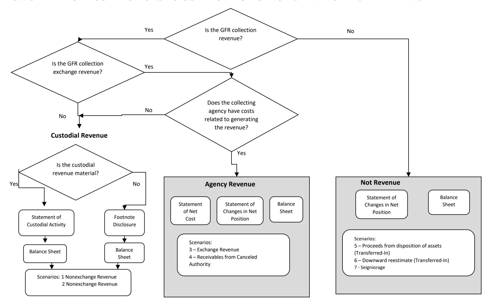

# **GENERAL FUND RECEIPT ACCOUNT (GFR) GUIDE: SCENARIO 6: NON-CUSTODIAL STATEMENT COLLECTIONS: COLLECTION OF DOWNWARD RE-ESTIMATE OF SUBSIDY EXPENSE**

# **EFFECTIVE FISCAL YEAR 2021**

# **PREPARED BY:**

**GENERAL LEDGER AND ADVISORY BRANCH FISCAL ACCOUNTING OPERATIONS BUREAU OF THE FISCAL SERVICE U.S. DEPARTMENT OF THE TREASURY**

| Version Number | Date    | Description of Change                                                                      | Effective USSGL TFM      |
|-------------------|---------|--------------------------------------------------------------------------------------------|--------------------------|
| 1.0               | 08/2007 | Original                                                                                   | TFM Bulletin No. 2018-04 |
| 2.0               | 01/2021 | Added General Fund of the U.S. Government Transactions, Updated Financial Statements | TFM Bulletin No. 2021-07 |

### **Background**

### **Definition of a General Fund Receipt (GFR) Account**

The Government Accountability Office (GAO) defines a GFR Account as: "A receipt account credited with all collections that are not earmarked by law for another account for a specific purpose. These collections are presented in the President's budget as either governmental (budget) receipts or offsetting receipts. These include taxes, customs duties, and miscellaneous receipts." (Government Accountability Office, A Glossary of Terms Used in the Federal Budget Process, September 2005, GAO–05-734SP)

### **Purpose**

This guidance proposes accounting and reporting guidance for various collections classified in GFR accounts. The following scenarios illustrate accounting transactions and reporting for specific types of collections. The focus of this guidance is on the GFR account activity. Related transactions illustrated in the scenarios such as credit reform activities are covered in more detail in the other case studies. Refer to those case studies for questions not specifically related to GFR activity.

### **Federal Account Symbols (FAS), Treasury Account Symbols (TAS), and Collections**

The Federal Account Symbols and Titles (FAST) Book, published by Treasury, lists all FAS available for Federal agency use. A collection can be classified to any of the listed accounts. To classify a receipt, append your agency's two digit department code to the FAS. This combination of department code and FAS creates TAS. For example, collections for work performed in accordance with Economy Act can be deposited into any type of expenditure account. On the other hand, National Park Service fees are designated by law to be deposited to a special fund receipt account. Similarly, collections for the National Endowment for the Arts Gift Fund are designated by law to be deposited to a trust fund receipt account. Amounts collected in the course of business by the U.S. Postal Service are, by law, deposited to a revolving fund. Amounts not belonging to the Government are, by law, classified to deposit fund accounts. As you can see, a specific law determines how the collections in the preceding examples are classified in a TAS.

Absent specific legislation, collections should be classified to a **General Fund Receipt TAS**. Title 31, United States Code (USC), chapter 33, section 3302(b) establishes this concept by stating: "Except as provided in section 3718 (b) of this title, an official or agent of the Government receiving money for the Government from any source shall deposit the money in the Treasury as soon as practicable without deduction for any change or claim." Also, Title 31, USC, chapter 33, section 3302(e) states that "an official or agent of the Government having custody or possession of public money shall keep an accurate entry of each amount of public money received, transferred, and paid."

### **GFR Account Categories in the FAST Book**

The "Types of Collections and Relevant FASAB References" column was included in the table to assist users in providing background information. The users should note that the types of collections and limited paragraph references listed on the chart are suggestions and they should not be solely relied on. Each entity should perform its own research to determine the appropriate category for its collection.

| FAS                                                                          | Description of Types of GFR Accounts                                                                                                                                       | Types of Collections and Relevant FASAB Reference |
|------------------------------------------------------------------------------|-------------------------------------------------------------------------------------------------------------------------------------------------------------------------------|------------------------------------------------------|
| 2670 -2799 – Negative subsidies and downward re-estimates of subsidies | Receipt of amounts paid for associated financing accounts when there is a negative subsidy or a downward re-estimate pursuant to the Federal Credit Reform Act of 1990. | Reduction of expense, SFFAS No. 7, par. 362, 363  |

# **GFR Account Reporting Responsibility**

Within each GFR account category listed in the FAST Book there are unique FAS to identify specific activity. After selecting the proper TAS, the reporting entity should append its 3-digit agency identifier code to the beginning of the TAS for classifying the receipt to Treasury. A collecting entity typically reports all GFR TAS beginning with its 3-digit agency identifier code within its entity financial statements.

### **FLOWCHART - GFR COLLECTIONS TO COLLECTING AGENCY'S FINANCIAL STATEMENTS**

# **Listing of USSGL Accounts Used in This Scenario**

| Account Number | Account Name                                                                        |  |  |  |  |  |
|----------------|-------------------------------------------------------------------------------------|--|--|--|--|--|
| Budgetary      |                                                                                     |  |  |  |  |  |
| 407000         | Anticipated Collections From Federal Sources                                        |  |  |  |  |  |
| 411500         | Loan Subsidy Appropriation                                                          |  |  |  |  |  |
| 420100         | Total Actual Resources – Collected                                               |  |  |  |  |  |
| 422100         | Unfilled Customer Orders Without Advance                                            |  |  |  |  |  |
| 427100         | Actual Program Fund Subsidy Collected                                               |  |  |  |  |  |
| 445000         | Unapportioned Authority                                                             |  |  |  |  |  |
| 451000         | Apportionments                                                                      |  |  |  |  |  |
| 459000         | Apportionments – Anticipated Resources – Programs Subject to Apportionment    |  |  |  |  |  |
| 461000         | Allotments-Realized Resources                                                       |  |  |  |  |  |
| 480100         | Undelivered Orders – Obligations, Unpaid                                         |  |  |  |  |  |
| 490100         | Delivered Orders – Obligations, Unpaid                                           |  |  |  |  |  |
| 490200         | Delivered Orders – Obligations, Paid                                             |  |  |  |  |  |
| Proprietary    |                                                                                     |  |  |  |  |  |
| 101000         | Fund Balance With Treasury                                                          |  |  |  |  |  |
| 131000         | Accounts Receivable                                                                 |  |  |  |  |  |
| 134100         | Interest Receivable - Loans                                                   |  |  |  |  |  |
| 135000         | Loans Receivable                                                                    |  |  |  |  |  |
| 139900         | Allowance for Subsidy                                                               |  |  |  |  |  |
| 218000         | Loan Guarantee Liability                                                            |  |  |  |  |  |
| 219000         | Other Liabilities With Related Budgetary Obligations                                |  |  |  |  |  |
| 298500         | Liability for Non-Entity Assets Not Reported on the Statement of Custodial Activity |  |  |  |  |  |
| 299000         | Other Liabilities Without Related Budgetary Obligations                             |  |  |  |  |  |
| 310000         | Unexpended Appropriations - Cumulative                                           |  |  |  |  |  |
| 310100         | Unexpended Appropriations – Appropriations Received                              |  |  |  |  |  |
| 310710         | Unexpended Appropriations – Used - Disbursed                               |  |  |  |  |  |
| 331000         | Cumulative Results of Operations                                                    |  |  |  |  |  |

| 570010 | Expended Appropriations - Disbursed                                             |
|--------|------------------------------------------------------------------------------------|
| 577500 | Non-Budgetary Financing Sources Transferred In                                     |
| 577600 | Non-Budgetary Financing Sources Transferred Out                                    |
| 579100 | Adjustment to Financing Sources – Credit Reform                              |
| 599300 | Offset to Non-Entity Collections - Statement of Changes in Net Position         |
| 599400 | Offset to Non-Entity Accrued Collections - Statement of Changes in Net Position |
| 610000 | Operating Expenses/Program Costs                                                   |
| 619900 | Adjustment to Subsidy Expense                                                      |
| 680000 | Future Funded Expenses                                                             |

### **Scenario 6 Non-Custodial Statement Collections: Collection of Downward Re-estimate of Subsidy Expense**

The goal of this section is to record in a loan program the movement of excess subsidy from the financing fund to a General Fund Receipt Account. The Credit Reform transactions illustrated in this scenario are limited. For detailed Credit Reform transactions, refer to the Credit Reform Case Studies at **[https://www.fiscal.treasury.gov/ussgl/resources-creditreform.html.](https://www.fiscal.treasury.gov/ussgl/resources-creditreform.html)**

#### Downward Re-estimate of Subsidy

If more subsidy money was collected than is necessary to fund future net cash outflows, the financing fund must relinquish the excess subsidy amount. The financing fund must transfer the excess subsidy amount, with interest, to a designated GFR account.

### **Year 1 – Quarter 1**

| 1. To record enactment of appropriation.                                                                                                                     |                                           |     |      |                                                                                                             |     |     |      |  |
|-----------------------------------------------------------------------------------------------------------------------------------------------------------------|-------------------------------------------|-----|------|-------------------------------------------------------------------------------------------------------------|-----|-----|------|--|
| Program Fund                                                                                                                                                    |                                           |     |      | Financing Fund                                                                                              |     |     |      |  |
| Description                                                                                                                                                     | DR                                        | CR  | TC   | Description                                                                                                 | DR  | CR  | TC   |  |
| Budgetary Entry 411500 Loan Subsidy Appropriation 445000 Unapportioned Authority                                                                          | 900                                       | 900 | A104 | Budgetary Entry 407000 Anticipated Collections From Federal Sources 445000 Unapportioned Authority | 600 | 600 | A140 |  |
| Proprietary Entry 101000 (G)1 Fund Balance With Treasury2 (RC 40)3 310100 (G) Unexpended Appropriations – Appropriations Received (RC 41)     | 900                                       | 900 |      | Proprietary Entry None                                                                                   |     |     |      |  |
|                                                                                                                                                                 | General Fund of the U.S. Government (099) |     |      |                                                                                                             |     |     |      |  |
| Budgetary Entry None                                                                                                                                         |                                           |     |      | Budgetary Entry None                                                                                     |     |     |      |  |
| Proprietary Entry 320100 (F) Appropriations Outstanding – Warrants Issued (RC 41) 201000 (F) Liability For Fund Balance With Treasury (RC 40) | 900                                       | 900 |      | Proprietary Entry None                                                                                   |     |     |      |  |

1 The Federal/Non-Federal attribute domain value of "G" will always have trading partner 099 agency identifier.

2 Although USSGL account 101000 is deposited into the General Fund of the U.S. Government, the collecting agency still has to carry the balances of USSGL accounts 101000 and 298500 on its quarterly Balance Sheet. Treasury's CARS system does not sweep USSGL account 101000 until the year end. The agency should make a note of this as a reconciling item.

3 RC – Reciprocal Category is shown for Intragovernmental Elimination Analysis (not included in GTAS upload)

| 2. To record apportionment.                                             |                                              |     |      |                                                                                                                                                 |     |     |      |  |  |
|----------------------------------------------------------------------------|----------------------------------------------|-----|------|-------------------------------------------------------------------------------------------------------------------------------------------------|-----|-----|------|--|--|
| Program Fund                                                               |                                              |     |      | Financing Fund                                                                                                                                  |     |     |      |  |  |
| Description                                                                | DR                                           | CR  | TC   | Description                                                                                                                                     | DR  | CR  | TC   |  |  |
| Budgetary Entry 445000 Unapportioned Authority 451000 Apportionments | 900                                          | 900 | A116 | Budgetary Entry 445000 Unapportioned Authority 459000 Apportionments – Anticipated Resources – Programs Subject to Apportionment | 600 | 600 | A140 |  |  |
| Proprietary Entry None                                                  |                                              |     |      | Proprietary Entry None                                                                                                                       |     |     |      |  |  |
|                                                                            | General Fund of the U.S. Government (099) |     |      |                                                                                                                                                 |     |     |      |  |  |
| Budgetary Entry None                                                    |                                              |     |      | Budgetary Entry None                                                                                                                         |     |     |      |  |  |
| Proprietary Entry None                                                  |                                              |     |      | Proprietary Entry None                                                                                                                       |     |     |      |  |  |

| 3. To record the allotment of authority. |     |                                           |      |                                     |  |  |  |  |  |
|---------------------------------------------|-----|-------------------------------------------|------|-------------------------------------|--|--|--|--|--|
| Program Fund                                |     | Financing Fund DR CR TC (099) |      |                                     |  |  |  |  |  |
| Description                                 | DR  | CR                                        | TC   | Description                         |  |  |  |  |  |
| Budgetary Entry                             |     |                                           |      | Budgetary Entry                     |  |  |  |  |  |
| 451000 Apportionments                       | 900 |                                           |      | None                                |  |  |  |  |  |
| 461000 Allotments – Realized             |     |                                           | A120 |                                     |  |  |  |  |  |
| Resources                                   |     | 900                                       |      |                                     |  |  |  |  |  |
|                                             |     |                                           |      |                                     |  |  |  |  |  |
| Proprietary Entry                           |     |                                           |      | Proprietary Entry                   |  |  |  |  |  |
| None                                        |     |                                           |      | None                                |  |  |  |  |  |
|                                             |     |                                           |      |                                     |  |  |  |  |  |
|                                             |     |                                           |      |                                     |  |  |  |  |  |
|                                             |     |                                           |      |                                     |  |  |  |  |  |
|                                             |     |                                           |      |                                     |  |  |  |  |  |
|                                             |     |                                           |      | General Fund of the U.S. Government |  |  |  |  |  |
| Budgetary Entry                             |     |                                           |      | Budgetary Entry                     |  |  |  |  |  |
| None                                        |     |                                           |      | None                                |  |  |  |  |  |
|                                             |     |                                           |      |                                     |  |  |  |  |  |
| Proprietary Entry                           |     |                                           |      | Proprietary Entry                   |  |  |  |  |  |
| None                                        |     |                                           |      | None                                |  |  |  |  |  |

| The agency agrees to make guarantees, subject to 3rd 4.                                                               |     |     |      |                                                                                                                                                                                                                                                                     |  |  |  |
|--------------------------------------------------------------------------------------------------------------------------|-----|-----|------|---------------------------------------------------------------------------------------------------------------------------------------------------------------------------------------------------------------------------------------------------------------------|--|--|--|
| Program Fund                                                                                                             |     |     |      | party lenders and their borrowers meeting conditions placed on them. Financing Fund Description DR CR TC 200 C101 200 Programs 200 Realized A122 200 None General Fund of the U.S. Government (099) Budgetary Entry |  |  |  |
| Description                                                                                                              | DR  | CR  | TC   |                                                                                                                                                                                                                                                                     |  |  |  |
| Budgetary Entry 461000 Allotments – Realized Resources 480100 Undelivered Orders - Obligations, Unpaid | 200 | 200 | B306 | Budgetary Entry 422100 Unfilled Customer Orders Without Advance 407000 Anticipated Collections From Federal Sources                                                                                                                                     |  |  |  |
|                                                                                                                          |     |     |      | Then to record allotment from #2: 459000 Apportionments – Anticipated Resources – Subject to Apportionment 461000 Allotments – Resources                                                                                                             |  |  |  |
| Proprietary Entry                                                                                                        |     |     |      | Proprietary Entry                                                                                                                                                                                                                                                   |  |  |  |
| None                                                                                                                     |     |     |      |                                                                                                                                                                                                                                                                     |  |  |  |
|                                                                                                                          |     |     |      |                                                                                                                                                                                                                                                                     |  |  |  |
| Budgetary Entry None                                                                                                  |     |     |      | None                                                                                                                                                                                                                                                                |  |  |  |
| Proprietary Entry None                                                                                                |     |     |      | Proprietary Entry None                                                                                                                                                                                                                                           |  |  |  |

| 5. To record payment of subsidy to financing fund.                                                                                                                                                                                                                                                                                                       |            |            |      |                                                                                                                                                                                                          |     |     |      |
|-------------------------------------------------------------------------------------------------------------------------------------------------------------------------------------------------------------------------------------------------------------------------------------------------------------------------------------------------------------|------------|------------|------|----------------------------------------------------------------------------------------------------------------------------------------------------------------------------------------------------------|-----|-----|------|
| Program Fund                                                                                                                                                                                                                                                                                                                                                |            |            |      | Financing Fund                                                                                                                                                                                           |     |     |      |
| Description                                                                                                                                                                                                                                                                                                                                                 | DR         | CR         | TC   | Description                                                                                                                                                                                              | DR  | CR  | TC   |
| Budgetary Entry 480100 Undelivered Orders – Obligations, Unpaid 490200 Delivered Orders – Obligations, Paid                                                                                                                                                                                                                               | 200        | 200        | A146 | Budgetary Entry 427100 Actual Program Fund Subsidy Collected 422100 Unfilled Customer Orders Without Advance                                                                                 | 200 | 200 | C103 |
| Proprietary Entry 610000 (N) Operating Expenses/ Program Costs 101000 (G) Fund Balance With Treasury (RC 40)                                                                                                                                                                                                                     | 200        | 200        |      | Proprietary Entry 101000 (G) Fund Balance With Treasury (RC 40) 218000 (N) Loan Guarantee Liability                                                                                 | 200 | 200 |      |
| 310710 (G) Unexpended Appropriations – Used – Disbursed (RC 39) 570010 (G) Expended Appropriations - Disbursed (RC 38)                                                                                                                                                                                                                 | 200        | 200        | B234 |                                                                                                                                                                                                          |     |     |      |
|                                                                                                                                                                                                                                                                                                                                                             |            |            |      | General Account of the U.S. Government (099)                                                                                                                                                             |     |     |      |
| Budgetary Entry None                                                                                                                                                                                                                                                                                                                                     |            |            |      | Budgetary Entry None                                                                                                                                                                                  |     |     |      |
| Proprietary Entry 201000 (F) Liability for Fund Balance With Treasury (RC 40) 198000 Assets for Agency's Custodial and Non-Entity Liabilities – General Fund of the U.S. Government 570006 (F) Appropriations – Expended Disbursed (RC 38) 320710 (F) Appropriations Outstanding – Used – Disbursed (RC 39) | 200 200 | 200 200 |      | Proprietary Entry 198000 Assets for Agency's Custodial and Non-Entity Liabilities – General Fund of the U.S. Government 201000 (F) Liability for Fund Balance With Treasury (RC 40) | 200 | 200 |      |

| 6. To record agency paid third party lender claims of \$150. |                |                                            |    |                                                                                                                                                         |     |     |  |
|-----------------------------------------------------------------------|----------------|--------------------------------------------|----|---------------------------------------------------------------------------------------------------------------------------------------------------------|-----|-----|--|
| Program Fund                                                       | Financing Fund | DR CR TC 150 150 150 150 |    |                                                                                                                                                         |     |     |  |
| Description                                                           | DR             | CR                                         | TC | Description                                                                                                                                             |     |     |  |
| Budgetary Entry None                                               |                |                                            |    | Budgetary Entry 461000 Allotments – Realized Resources 490200 Delivered Orders – Obligationss, Paid                                      |     |     |  |
| Proprietary Entry None                                             |                |                                            |    | Proprietary Entry 218000 (N) Loan Guarantee Liability 101000 (G) Fund Balance With Treasury (RC 40)                                         |     |     |  |
|                                                                       |                |                                            |    | General Fund of the U.S. Government (099)                                                                                                               |     |     |  |
| Budgetary Entry None                                               |                |                                            |    | Budgetary Entry None                                                                                                                                 |     |     |  |
| Proprietary Entry None                                             |                |                                            |    | Proprietary Entry 201000 (F) Liability For Fund Balance With Treasury (RC 40) 198000 (F) Assets for Agency's Custodial Non-Entity Liability | 150 | 150 |  |

| 7. To establish receivable for defaulted loan. Assume the following: Loan receivable - \$100 Interest receivable - \$70 PV of the loan - \$150. |                                                                                   |    |    |                                                                                                                                                                                                        |  |  |  |  |  |
|----------------------------------------------------------------------------------------------------------------------------------------------------------------|-----------------------------------------------------------------------------------|----|----|--------------------------------------------------------------------------------------------------------------------------------------------------------------------------------------------------------|--|--|--|--|--|
| Program Fund                                                                                                                                                   | Financing Fund Description DR CR TC 70 C428 100 20 150 |    |    |                                                                                                                                                                                                        |  |  |  |  |  |
| Description                                                                                                                                                    | DR                                                                                | CR | TC |                                                                                                                                                                                                        |  |  |  |  |  |
| Budgetary Entry None Proprietary Entry None                                                                                                           |                                                                                   |    |    | Budgetary Entry None Proprietary Entry 134100 (N) Interest Receivable - Loans 135000 (N) Loans Receivable 139900 (N) Allowance for Subsidy 218000 (N) Loan Guarantee Liability |  |  |  |  |  |
|                                                                                                                                                                |                                                                                   |    |    | General Fund of the U.S. Government (099)                                                                                                                                                              |  |  |  |  |  |
| Budgetary Entry None                                                                                                                                        |                                                                                   |    |    | Budgetary Entry None                                                                                                                                                                                |  |  |  |  |  |
| Proprietary Entry None                                                                                                                                      |                                                                                   |    |    | Proprietary Entry None                                                                                                                                                                              |  |  |  |  |  |

| 8a. To record downward re-estimate of subsidy expense. Note: Transactions 8a and 8b should be done simultaneously. See Credit Reform Case Studies for detailed illustrations and explanations. |                |                                    |      |                                                                                                                                                                      |  |  |  |
|---------------------------------------------------------------------------------------------------------------------------------------------------------------------------------------------------|----------------|------------------------------------|------|----------------------------------------------------------------------------------------------------------------------------------------------------------------------|--|--|--|
| Program Fund                                                                                                                                                                                      | Financing Fund | DR CR TC 10 D147 10 |      |                                                                                                                                                                      |  |  |  |
| Description                                                                                                                                                                                       | DR             | CR                                 | TC   | Description                                                                                                                                                          |  |  |  |
| Budgetary Entry None Proprietary Entry 579100 (F) Adjustment to Financing Sources – Credit Reform (RC 5) 680000 (N) Future Funded Expenses                                   | 10             | 10                                 | D146 | Budgetary Entry None Proprietary Entry 218000 (N) Loan Guarantee Liability 579100 (F) Adjustment to Financing Sources – Credit Reform (RC 5) |  |  |  |
|                                                                                                                                                                                                   |                |                                    |      | General Fund of the U.S. Government (099)                                                                                                                            |  |  |  |
| Budgetary Entry None                                                                                                                                                                           |                |                                    |      | Budgetary Entry None                                                                                                                                              |  |  |  |
| Proprietary Entry None                                                                                                                                                                         |                |                                    |      | Proprietary Entry None                                                                                                                                            |  |  |  |

8b. To record accrual of downward subsidy. The transfer of the cash is not done until the subsequent year. The transfer account in this case does not require budgetary entries. **Note: Apportionment and allotment does not happen until year 2; therefore, USSGL account 490100 is not recorded in year 1.**

| Financing Fund                                                                                                                                                                                            |    |    |      | GFR Account                                                                                                                                                                                                                                                                                                                                                                                             |          |          |              |  |
|-----------------------------------------------------------------------------------------------------------------------------------------------------------------------------------------------------------|----|----|------|---------------------------------------------------------------------------------------------------------------------------------------------------------------------------------------------------------------------------------------------------------------------------------------------------------------------------------------------------------------------------------------------------------|----------|----------|--------------|--|
| Description                                                                                                                                                                                               | DR | CR | TC   | Description                                                                                                                                                                                                                                                                                                                                                                                             | DR       | CR       | TC           |  |
| Budgetary Entry None Proprietary Entry 577600 (F) Non-Budgetary Financing Sources Transferred Out (RC 18) 299000 (F) Other Liabilities Without Related Budgetary Obligations (RC 22) | 10 | 10 | D148 | Budgetary Entry None Proprietary Entry 131000 (F) Accounts Receivable (RC 22) 577500 (F) Non-Budgetary Financing Sources Transferred In (RC 18) 599400 (G) Offset to Non-Entity Accrued Collections – Statement of Changes in Net Position (RC 48) 298500 (G) Liability for Non- Entity Assets Not Reported on the Statement of Custodial Activity (RC 46) | 10 10 | 10 10 | C420 C405 |  |
|                                                                                                                                                                                                           |    |    |      | General Fund of the U.S. Government (099)                                                                                                                                                                                                                                                                                                                                                               |          |          |              |  |
| Budgetary Entry None Proprietary Entry None                                                                                                                                                      |    |    |      | Budgetary Entry None Proprietary Entry 198000 (F) Asset for Agency's Custodial and Non-Entity Liabilities – General Fund of the U.S. Government (RC 46) 571200 (F) Accrual of Agency Amount – To Be Collected – Custodial And Non-Entity – General Fund of the U.S. Government (RC 48)                                                                           | 10       | 10       |              |  |

#### **Year 1 Pre-Closing Trial Balance**

| Account       | Description                                                                            |       | Program Fund |     | Financing Fund |    | GFR Account |  |
|---------------|----------------------------------------------------------------------------------------|-------|--------------|-----|----------------|----|-------------|--|
|               |                                                                                        | DR    | CR           | DR  | CR             | DR | CR          |  |
| Budgetary     |                                                                                        |       |              |     |                |    |             |  |
| 407000        | Anticipated Collections From Non-Federal Sources                                       |       |              | 400 |                |    |             |  |
| 411500        | Loan Subsidy Appropriation                                                             | 900   |              |     |                |    |             |  |
| 427100        | Actual Program Fund Subsidy Collected                                                  |       |              | 200 |                |    |             |  |
| 459000        | Apportionments – Anticipated Resources – Programs Subject to Apportionment    |       |              |     | 400            |    |             |  |
| 461000        | Allotments – Realized Resources                                                     |       | 700          |     | 50             |    |             |  |
| 490200        | Delivered Orders – Obligations, Paid                                                |       | 200          |     | 150            |    |             |  |
| Total         |                                                                                        | 900   | 900          | 600 | 600            |    |             |  |
| Proprietary   |                                                                                        |       |              |     |                |    |             |  |
| 101000 (G) | Fund Balance With Treasury                                                             | 700   |              | 50  |                |    |             |  |
| 131000 (F)    | Accounts Receivable                                                                    |       |              |     |                | 10 |             |  |
| 134100 (N)    | Interest Receivable - Loans                                                         |       |              | 70  |                |    |             |  |
| 135000 (N)    | Loans Receivable                                                                       |       |              | 100 |                |    |             |  |
| 139900 (N)    | Allowance for Subsidy                                                                  |       |              |     | 20             |    |             |  |
| 218000 (N)    | Loan Guarantee Liability                                                               |       |              |     | 190            |    |             |  |
| 298500 (G)    | Liability for Non-Entity Assets Not Reported on the Statement of Custodial Activity |       |              |     |                |    | 10          |  |
| 299000 (F)    | Other Liabilities Without Related Budgetary Obligations                                |       |              |     | 10             |    |             |  |
| 310100        | Unexpended Appropriations – Appropriations Received                                 |       | 900          |     |                |    |             |  |
| 310710 (G)    | Unexpended Appropriations – Used - Disbursed                                  | 200   |              |     |                |    |             |  |
| 570010 (G)    | Expended Appropriations - Disbursed                                              |       | 200          |     |                |    |             |  |
| 577500 (G)    | Non-Budgetary Financing Sources Transferred In                                         |       |              |     |                |    | 10          |  |
| 577600 (F)    | Non-Budgetary Financing Sources Transferred Out                                        |       |              | 10  |                |    |             |  |
| 579100 (F)    | Adjustments to Financing Sources – Credit Reform                                    | 10    |              |     | 10             |    |             |  |
| 599400 (F)    | Offset to Non-Entity Accrued Collections – Statement of Changes in Net Position  |       |              |     |                | 10 |             |  |
| 610000 (N)    | Operating Expenses/Program Costs                                                       | 200   |              |     |                |    |             |  |
| 680000 (N)    | Future Funded Expenses                                                                 |       | 10           |     |                |    |             |  |
| Total         |                                                                                        | 1,110 | 1,110        | 230 | 230            | 20 | 20          |  |

#### **Financial Statements**

|             | CONSOLIDATED BALANCE SHEET AS OF 1st QUARTER DECEMBER 31, YEAR 1                                                                                           |     |
|-------------|---------------------------------------------------------------------------------------------------------------------------------------------------------------|-----|
| Line No. |                                                                                                                                                               |     |
|             | Assets (Note 2)                                                                                                                                               |     |
|             | Intra-governmental                                                                                                                                            |     |
| 1.          | Fund Balance With Treasury (Note 3) (101000E)                                                                                                           | 750 |
| 3.          | Accounts receivable, net (Note 6) (131000E)                                                                                                                | -   |
| 6.          | Total Intra-governmental                                                                                                                                      | 750 |
|             | With the public                                                                                                                                               |     |
| 9.          | Direct loan and loan guarantees receivable, net (Note 8) (134100E, 135000E, 139900E)                                                                       | 150 |
| 15.         | Total with the public                                                                                                                                         | 150 |
| 16.         | Total assets                                                                                                                                                  | 900 |
|             | Liabilities (Note 13)                                                                                                                                         |     |
|             | Intra-governmental                                                                                                                                            |     |
| 22          | Other Liabilities (Notes 15 and 17)                                                                                                                           |     |
| 22.4        | Liability to the General Fund of the U.S. Government for custodial and other non-entity assets (Note 17) (298500E)                                            | 10  |
| 23.         | Total intra-governmental                                                                                                                                      | 10  |
|             | With the public                                                                                                                                               |     |
| 29.         | Loan guarantee liability (Note 8) (218000E)                                                                                                                   | 190 |
| 33.         | Total with the public                                                                                                                                         |     |
| 34.         | Total Liabilities                                                                                                                                             | 200 |
| 35.         | Commitments and Contingencies (Note 19)                                                                                                                       |     |
|             | Net position:                                                                                                                                                 |     |
| 37.1        | Unexpended appropriations – Funds other than those from Dedicated (310100E, 310710E)                                                                    | 700 |
| 37.2        | Cumulative results of operations – Funds other than those from Dedicated Collections (570010E, 577500E, 577600E, 579100E, 599400E, 610000E, 680000E) | -   |
| 38.         | Total net position                                                                                                                                            | 700 |
| 39.         | Total liabilities and net position                                                                                                                            | 900 |

|      | CONSOLIDATED STATEMENT OF NET COST FOR THE 1st QUARTER ENDED DECEMBER 31, YEAR 1 |     |  |  |  |  |
|------|-------------------------------------------------------------------------------------|-----|--|--|--|--|
| Line |                                                                                     |     |  |  |  |  |
| No.  | Gross Program Costs (Note 22):                                                      |     |  |  |  |  |
|      | Program A:                                                                          |     |  |  |  |  |
| 1.   | Gross Costs (610000E, 680000E)                                                      | 190 |  |  |  |  |
| 2.   | Less: earned revenue                                                                | -   |  |  |  |  |
| 3.   | Net program costs:                                                                  | 190 |  |  |  |  |
| 5.   | Net program costs including Assumption Changes:                                     | 190 |  |  |  |  |
| 8.   | Net cost of operations                                                              | 190 |  |  |  |  |

|             | STATEMENT OF BUDGETARY RESOURCES FOR THE 1st QUARTER ENDED DECEMBER 31, YEAR 1      |       |  |  |  |
|-------------|----------------------------------------------------------------------------------------|-------|--|--|--|
| Line No. |                                                                                        |       |  |  |  |
|             | Budgetary resources:                                                                   |       |  |  |  |
| 1290        | Appropriations (discretionary and mandatory) (411500E)                                 | 900   |  |  |  |
| 1890        | Spending authority from offsetting collections (discretionary and mandatory) (427100E) | 200   |  |  |  |
| 1910        | Total budgetary resources                                                              | 1,100 |  |  |  |
|             |                                                                                        |       |  |  |  |
|             | Status of budgetary resources:                                                         |       |  |  |  |
| 2190        | New obligations and upward adjustments (total) (Note 29) (490200E)                     | 350   |  |  |  |
| 2204        | Apportioned, unexpired account (461000E)                                               | 750   |  |  |  |
| 2412        | Unexpired unobligated balance, end of year                                             | 750   |  |  |  |
| 2490        | Unobligated balance, end of year (total)                                               | 750   |  |  |  |
| 2500        | Total budgetary resources                                                              | 1,100 |  |  |  |
|             |                                                                                        |       |  |  |  |
|             | Outlays, net:                                                                          |       |  |  |  |
| 4190        | Outlays, net (total) (discretionary and mandatory) (427100E, 490200E)                  | 150   |  |  |  |

### **Year 1 4th Quarter Yearend Reporting**

| The agency agrees to make guarantees, subject to 3rd 1. party lenders and their borrowers meeting conditions placed on them. |     |     |      |                                                                                                                                                                                                        |     |     |      |  |
|------------------------------------------------------------------------------------------------------------------------------------|-----|-----|------|--------------------------------------------------------------------------------------------------------------------------------------------------------------------------------------------------------|-----|-----|------|--|
| Program Fund                                                                                                                       |     |     |      | Financing Fund                                                                                                                                                                                         |     |     |      |  |
| Description                                                                                                                        | DR  | CR  | TC   | Description                                                                                                                                                                                            | DR  | CR  | TC   |  |
| Budgetary Entry 461000 Allotments – Realized Resources 480100 Undelivered Orders - Obligations, Unpaid              | 300 | 300 | B306 | Budgetary Entry 422100 Unfilled Customer Orders Without Advance 407000 Anticipated Collections From Federal Sources                                                                        | 300 | 300 | C101 |  |
| Proprietary Entry                                                                                                                  |     |     |      | To record allotment from #2 459000 Apportionments – Anticipated Resources – Programs Subject to Apportionment 461000 Allotments – Realized Resources Proprietary Entry None | 300 | 300 | A122 |  |
| None                                                                                                                               |     |     |      |                                                                                                                                                                                                        |     |     |      |  |
|                                                                                                                                    |     |     |      | General Fund of the U.S. Government (099)                                                                                                                                                              |     |     |      |  |
| Budgetary Entry None                                                                                                            |     |     |      | Budgetary Entry None                                                                                                                                                                                |     |     |      |  |
| Proprietary Entry None                                                                                                          |     |     |      | Proprietary Entry None                                                                                                                                                                              |     |     |      |  |

| 2. To record payment of subsidy to financing fund.                                                                                                                                                                                                                                                                                                    |            |            |      |                                                                                                                                                                                                      |                                                    |     |  |  |  |
|----------------------------------------------------------------------------------------------------------------------------------------------------------------------------------------------------------------------------------------------------------------------------------------------------------------------------------------------------------|------------|------------|------|------------------------------------------------------------------------------------------------------------------------------------------------------------------------------------------------------|----------------------------------------------------|-----|--|--|--|
| Program Fund                                                                                                                                                                                                                                                                                                                                             |            |            |      | Financing Fund                                                                                                                                                                                       | DR CR TC C103 300 300 300 300 |     |  |  |  |
| Description                                                                                                                                                                                                                                                                                                                                              | DR         | CR         | TC   | Description                                                                                                                                                                                          |                                                    |     |  |  |  |
| Budgetary Entry 480100 Undelivered Orders - Obligations, Unpaid 490200 Delivered Orders – Obligations, Paid                                                                                                                                                                                                                            | 300        | 300        | A146 | Budgetary Entry 427100 Actual Program Fund Subsidy Collected 422100 Unfilled Customer Orders Without Advance                                                                             |                                                    |     |  |  |  |
| Proprietary Entry 610000 (N) Operating Expenses/Program Costs 101000 (G) Fund Balance With Treasury (RC 40)                                                                                                                                                                                                                                  | 300        | 300        |      | Proprietary Entry 101000 Fund Balance With Treasury 218000 (N) Loan Guarantee Liability                                                                                                        |                                                    |     |  |  |  |
| 310710 (G) Unexpended Appropriation – Used - Disbursed (RC 39) 570010 (G) Expended Appropriations - Disbursed (RC 38)                                                                                                                                                                                                            | 300        | 300        | B234 |                                                                                                                                                                                                      |                                                    |     |  |  |  |
|                                                                                                                                                                                                                                                                                                                                                          |            |            |      | General Fund of the U.S. Government (099)                                                                                                                                                            |                                                    |     |  |  |  |
| Budgetary Entry None                                                                                                                                                                                                                                                                                                                                  |            |            |      | Budgetary Entry None                                                                                                                                                                              |                                                    |     |  |  |  |
| Proprietary Entry 201000 (F) Liability for Fund Balance With Treasury (RC 40) 198000 Asset for Agency's Custodial and Non-Entity Liabilities General Fund of the U.S. Government 570006 (F) Appropriations Expended - Disbursed (RC 38) 320710 (F) Appropriations Outstanding – Used - Disbursed (RC 39) | 300 300 | 300 300 |      | Proprietary Entry 198000 Asset for Agency's Custodial and Non-Entity Liabilities – General Fund of the U.S. Government 201000 (F) Liability for Fund Balance With Treasury (RC 40) | 300                                                | 300 |  |  |  |

| 3. The agency paid third party lender claims of \$220. |      |    |    |                                                                                                                                                           |     |     |      |  |  |
|-----------------------------------------------------------|------|----|----|-----------------------------------------------------------------------------------------------------------------------------------------------------------|-----|-----|------|--|--|
| Program                                                   | Fund |    |    | Financing Fund                                                                                                                                            |     |     |      |  |  |
| Description                                               | DR   | CR | TC | Description                                                                                                                                               | DR  | CR  | TC   |  |  |
| Budgetary Entry None                                   |      |    |    | Budgetary Entry 461000 Allotments – Realized Resources 490200 Delivered Orders – Obligatioons, Paid                                        | 220 | 220 | B104 |  |  |
| Proprietary Entry None                                 |      |    |    | Proprietary Entry 218000 (N) Loan Guarantee Liability 101000 (G) Fund Balance With Treasury (RC 40)                                           | 220 | 220 |      |  |  |
|                                                           |      |    |    | General Fund of the U.S. Government (099)                                                                                                                 |     |     |      |  |  |
|                                                           |      |    |    | Budgetary Entry None                                                                                                                                   |     |     |      |  |  |
|                                                           |      |    |    | Proprietary Entry 201000 (F) Liability for Fund Balance With Treasury (RC 40) 198000 Asset for Agency's Custodial and Non-Entity Liability | 220 | 220 |      |  |  |

| 4. To establish receivable for defaulted loan. Assume the following: Loan receivable - of the loan - \$250. |    |    |                                                                                                                                         |                                                                                                                                                                 |  |  |  |  |
|----------------------------------------------------------------------------------------------------------------------|----|----|-----------------------------------------------------------------------------------------------------------------------------------------|-----------------------------------------------------------------------------------------------------------------------------------------------------------------|--|--|--|--|
| Program Fund                                                                                                         |    |    | \$200 Interest receivable - \$150 PV Financing Fund Description Dr CR TC Loans 150 C428 200 100 250 |                                                                                                                                                                 |  |  |  |  |
| Description                                                                                                          | DR | CR | TC                                                                                                                                      |                                                                                                                                                                 |  |  |  |  |
| Budgetary Entry None                                                                                              |    |    |                                                                                                                                         | Budgetary Entry None                                                                                                                                         |  |  |  |  |
| Proprietary Entry None                                                                                            |    |    |                                                                                                                                         | Proprietary Entry 134100 (N) Interest Receivable – 135000 (N) Loans Receivable 139900 (N) Allowance for Subsidy 218000 (N) Loan Guarantee Liability |  |  |  |  |
|                                                                                                                      |    |    |                                                                                                                                         | General Fund of the U.S. Government (099)                                                                                                                       |  |  |  |  |
| Budgetary Entry None                                                                                              |    |    |                                                                                                                                         | Budgetary Entry None                                                                                                                                         |  |  |  |  |
| Proprietary Entry None                                                                                            |    |    |                                                                                                                                         | Proprietary Entry None                                                                                                                                       |  |  |  |  |

| 5a. To record downward re-estimate of subsidy expense. See Credit Reform Case Studies for detailed illustrations and explanations.                            |    |    |                   |                                                                                                                                                                       |    |    |      |
|------------------------------------------------------------------------------------------------------------------------------------------------------------------|----|----|-------------------|-----------------------------------------------------------------------------------------------------------------------------------------------------------------------|----|----|------|
| Program Fund                                                                                                                                                     |    |    |                   | Financing Fund                                                                                                                                                        |    |    |      |
| Description                                                                                                                                                      | DR | CR | TC Description |                                                                                                                                                                       | DR | CR | TC   |
| Budgetary Entry None Proprietary Entry 579100 (F) Adjustment to Financing Sources – Credit Reform (RC 05) 680000 (N) Future Funded Expenses | 80 | 80 | D146              | Budgetary Entry None Proprietary Entry 218000 (N) Loan Guarantee Liability 579100 (F) Adjustment to Financing Sources – Credit Reform (RC 05) | 80 | 80 | D147 |
|                                                                                                                                                                  |    |    |                   | General Fund of the U.S. Government (099)                                                                                                                             |    |    |      |
| Budgetary Entry None                                                                                                                                          |    |    |                   | Budgetary Entry None                                                                                                                                               |    |    |      |
| Proprietary Entry None                                                                                                                                        |    |    |                   | Proprietary Entry None                                                                                                                                             |    |    |      |

5b. To record accrual of downward subsidy. The transfer of the cash is not done until the subsequent year. **Note: Apportionment and allotment does not happen until year 2; therefore, USSGL account 490100 is not recorded in year 1. In this loan program, downward re-estimate is transferred to the GFR account but there are certain loan programs where downward re-estimate is not transferred to the GFR account.**

| Financing Fund                                                                                                                                                                                |    |    |      | GFR Account                                                                                                                                                                                                                                                                                             |          |    |              |
|-----------------------------------------------------------------------------------------------------------------------------------------------------------------------------------------------|----|----|------|---------------------------------------------------------------------------------------------------------------------------------------------------------------------------------------------------------------------------------------------------------------------------------------------------------|----------|----|--------------|
| Description                                                                                                                                                                                   | DR | CR | TC   | Description                                                                                                                                                                                                                                                                                             | DR       | CR | TC           |
| Budgetary None Proprietary 577600 (F) Non-Budgetary Financing Sources Transferred Out (RC 18) 299000 (F) Other Liabilities Without Related Budgetary Obligations (RC 22) | 80 | 80 | D148 | Budgetary None Proprietary 131000 (F) Accounts Receivable (RC 22) 577500 (F) Non-Budgetary Financing Sources Transferred In (RC 18) 599400 (G) Offset to Non-Entity Accrued Collections – Statement of                                                              | 80 80 | 80 | C420 C405 |
|                                                                                                                                                                                               |    |    |      | Changes in Net Position (RC 48) 298500 (G) Liability for Non- Entity Assets Not Reported on the Statement of Custodial Activity (RC 46)                                                                                                                                                     |          | 80 |              |
|                                                                                                                                                                                               |    |    |      | General Fund of the U.S. Government (099)                                                                                                                                                                                                                                                               |          |    |              |
| Budgetary None Proprietary None                                                                                                                                                      |    |    |      | Budgetary None Proprietary 198000 (F) Asset for Agency's Custodial and Non-Entity Liabilities – General Fund of the U.S. Government (RC 46) 571200 (F) Accrual of Agency Amount To Be Collected Custodial and Non-Entity – General Fund of the U.S. Government (RC 48) | 80       | 80 |              |

**Year 1 – Pre-closing Trial Balance**

| Account       | Description                                                                            |       | Program Fund |     | Financing Fund | GFR Account |     |
|---------------|----------------------------------------------------------------------------------------|-------|--------------|-----|----------------|-------------|-----|
|               |                                                                                        | DR    | CR           | DR  | CR             | DR          | CR  |
| Budgetary     |                                                                                        |       |              |     |                |             |     |
| 407000        | Anticipated Collections From Non-Federal Sources                                       |       |              | 100 |                |             |     |
| 411500        | Loan Subsidy Appropriation                                                             | 900   |              |     |                |             |     |
| 427100        | Actual Program Fund Subsidy Collected                                                  |       |              | 500 |                |             |     |
| 459000        | Apportionments – Anticipated Resources – Programs Subject to Apportionment    |       |              |     | 100            |             |     |
| 461000        | Allotments – Realized Resources                                                     |       | 400          |     | 130            |             |     |
| 490200        | Delivered Orders – Obligations, Paid                                                |       | 500          |     | 370            |             |     |
| Total         |                                                                                        | 900   | 900          | 600 | 600            |             |     |
| Proprietary   |                                                                                        |       |              |     |                |             |     |
| 101000        | Fund Balance With Treasury                                                             | 400   |              | 130 |                |             |     |
| 131000 (F)    | Accounts Receivable                                                                    |       |              |     |                | 90          |     |
| 134100 (N)    | Interest Receivable - Loans                                                         |       |              | 220 |                |             |     |
| 135000 (N)    | Loans Receivable                                                                       |       |              | 300 |                |             |     |
| 139900 (N)    | Allowance for Subsidy                                                                  |       |              |     | 120            |             |     |
| 218000 (N)    | Loan Guarantee Liability                                                               |       |              |     | 440            |             |     |
| 298500 (G)    | Liability for Non-Entity Assets Not Reported on the Statement of Custodial Activity |       |              |     |                |             | 90  |
| 299000 (F)    | Other Liabilities Without Related Budgetary Obligations                                |       |              |     | 90             |             |     |
| 310100        | Unexpended Appropriations – Appropriations Received                                 |       | 900          |     |                |             |     |
| 310710 (G)    | Unexpended Appropriations – Used - Disbursed                                  | 500   |              |     |                |             |     |
| 570010 (G) | Expended Appropriations - Disbursed                                              |       | 500          |     |                |             |     |
| 577500 (F)    | Non-Budgetary Financing Sources Transferred In                                         |       |              |     |                |             | 90  |
| 577600 (F)    | Non-Budgetary Financing Sources Transferred Out                                        |       |              | 90  |                |             |     |
| 579100 (F)    | Adjustments to Financing Sources – Credit Reform                                    | 90    |              |     | 90             |             |     |
| 599400 (F)    | Offset to Non-Entity Accrued Collections – Statement of                             |       |              |     |                | 90          |     |
|               | Changes in Net Position                                                                |       |              |     |                |             |     |
| 610000 (N)    | Operating Expenses/Program Costs                                                       | 500   |              |     |                |             |     |
| 680000 (N)    | Future Funded Expenses                                                                 |       | 90           |     |                |             |     |
| Total         |                                                                                        | 1,490 | 1,490        | 740 | 740            | 180         | 180 |

#### **Year 1 – Pre-Closing Adjusting Entry**

| 1. To record adjustment for anticipated resources not realized.                                                                                                   |     |     |      |
|----------------------------------------------------------------------------------------------------------------------------------------------------------------------|-----|-----|------|
| Financing Fund                                                                                                                                                       | DR  | CR  | TC   |
| Budgetary Entry 459000 Apportionments – Anticipated Resources – Programs Subject to Apportionment 407000 Anticipated Collections From Federal Sources | 100 | 100 | F112 |
| Proprietary Entry None                                                                                                                                            |     |     |      |

**Year 1 – Pre-Closing Adjusted Trial Balance**

| Account       | Description                                                                            | Program Fund |       | Financing Fund |     | GFR Account |     |
|---------------|----------------------------------------------------------------------------------------|--------------|-------|----------------|-----|-------------|-----|
|               |                                                                                        | DR           | CR    | DR             | CR  | DR          | CR  |
| Budgetary     |                                                                                        |              |       |                |     |             |     |
| 407000        | Anticipated Collections From Non-Federal Sources                                    |              |       |                |     |             |     |
| 411500        | Loan Subsidy Appropriation                                                             | 900          |       |                |     |             |     |
| 427100        | Actual Program Fund Subsidy Collected                                                  |              |       | 500            |     |             |     |
| 459000        | Apportionments – Anticipated Resources – Programs Subject to Apportionment    |              |       |                |     |             |     |
| 461000        | Allotments – Realized Resources                                                     |              | 400   |                | 130 |             |     |
| 490200        | Delivered Orders – Obligations, Paid                                                |              | 500   |                | 370 |             |     |
| Total         |                                                                                        | 900          | 900   | 500            | 500 |             |     |
| Proprietary   |                                                                                        |              |       |                |     |             |     |
| 101000 (G) | Fund Balance With Treasury                                                             | 400          |       | 130            |     |             |     |
| 131000 (F)    | Accounts Receivable                                                                    |              |       |                |     | 90          |     |
| 134100 (N)    | Interest Receivable - Loans                                                         |              |       | 220            |     |             |     |
| 135000 (N)    | Loans Receivable                                                                       |              |       | 300            |     |             |     |
| 139900 (N)    | Allowance for Subsidy                                                                  |              |       |                | 120 |             |     |
| 218000 (N)    | Loan Guarantee Liability                                                               |              |       |                | 440 |             |     |
| 298500 (G)    | Liability for Non-Entity Assets Not Reported on the Statement of Custodial Activity |              |       |                |     |             | 90  |
| 299000 (F)    | Other Liabilities Without Related Budgetary Obligations                                |              |       |                | 90  |             |     |
| 310100 (G)    | Unexpended Appropriations – Appropriations Received                                 |              | 900   |                |     |             |     |
| 310710 (G)    | Unexpended Appropriations – Used - Disbursed                                  | 500          |       |                |     |             |     |
| 570010 (G)    | Expended Appropriations - Disbursed                                              |              | 500   |                |     |             |     |
| 577500 (F)    | Non-Budgetary Financing Sources Transferred In                                         |              |       |                |     |             | 90  |
| 577600 (F)    | Non-Budgetary Financing Sources Transferred Out                                        |              |       | 90             |     |             |     |
| 579100 (F)    | Adjustments to Financing Sources – Credit Reform                                    | 90           |       |                | 90  |             |     |
| 599400 (G)    | Offset to Non-Entity Accrued Collections – Statement of Changes in Net Position  |              |       |                |     | 90          |     |
| 610000 (N)    | Operating Expenses/Program Costs                                                       | 500          |       |                |     |             |     |
| 680000 (N)    | Future Funded Expenses                                                                 |              | 90    |                |     |             |     |
| Total         |                                                                                        | 1,490        | 1,490 | 740            | 740 | 180         | 180 |

#### **Financial Statements**

|             | CONSOLIDATED BALANCE SHEET AS OF SEPTEMBER 30, YEAR 1                                                                                                         |     |  |
|-------------|---------------------------------------------------------------------------------------------------------------------------------------------------------------|-----|--|
| Line No. |                                                                                                                                                               |     |  |
|             | Assets (Note 2)                                                                                                                                               |     |  |
|             | Intra-governmental                                                                                                                                            |     |  |
| 1.          | Fund Balance With Treasury (Note 3) (101000E)                                                                                                           | 530 |  |
| 3.          | Accounts receivable, net (Note 6)                                                                                                                          |     |  |
| 6.          | Total Intra-governmental                                                                                                                                      | 530 |  |
|             | With the public                                                                                                                                               |     |  |
| 9.          | Direct loan and loan guarantees receivable, net (Note 8) (134100E, 135000E, 139900E)                                                                       | 400 |  |
| 15.         | Total with the public                                                                                                                                         | 400 |  |
| 16.         | Total assets                                                                                                                                                  | 930 |  |
|             | Liabilities: (Note 13)                                                                                                                                     |     |  |
|             | Intra-governmental                                                                                                                                            |     |  |
| 19.         | Other (Notes 15, 16, and 17) (298500E)                                                                                                                        | 90  |  |
| 23.         | Total intragovernmental                                                                                                                                       | 90  |  |
|             | With the public                                                                                                                                               |     |  |
| 29.         | Loan guarantee liability (Note 8) (218000E)                                                                                                                   | 440 |  |
| 33.         | Total with the public                                                                                                                                         | 440 |  |
| 34.         | Total Liabilities                                                                                                                                             | 530 |  |
| 35.         | Commitments and Contingencies (Note 19)                                                                                                                       |     |  |
|             | Net position:                                                                                                                                                 |     |  |
| 37.         | Total net position – Funds other than those from Dedicated Collections (Combined or Consolidated)                                                          |     |  |
| 37.1        | Unexpended appropriations – Funds other than those from Dedicated (310100E, 310710E)                                                                    | 400 |  |
| 37.2        | Cumulative results of operations – Funds other than those from Dedicated Collections (570010E, 577500E, 577600E, 579100E, 599400E, 610000E, 680000E) | -   |  |
| 38.         | Total net position                                                                                                                                            | 400 |  |
| 39.         | Total liabilities and net position                                                                                                                            | 930 |  |

|      | CONSOLIDATED STATEMENT OF NET COST FOR THE YEAR ENDED DECEMBER 31, YEAR 1 |     |  |  |
|------|---------------------------------------------------------------------------|-----|--|--|
| Line |                                                                           |     |  |  |
| No.  | Gross Program Costs (Note 22):                                            |     |  |  |
|      | Program A:                                                                |     |  |  |
| 1.   | Gross Costs (610000E, 680000E)                                            | 410 |  |  |
| 2.   | Less: earned revenue                                                      | -   |  |  |
| 3.   | Net program costs:                                                        | 410 |  |  |
| 5.   | Net program costs including Assumption Changes:                           | 410 |  |  |
| 8.   | Net cost of operations                                                    | 410 |  |  |

| CONSOLIDATED STATEMENT OF CHANGES IN NET POSITION FOR THE YEAR ENDED SEPTEMBER 30, YEAR 1 |                                                                 |                       |              |  |
|-------------------------------------------------------------------------------------------|-----------------------------------------------------------------|-----------------------|--------------|--|
| Line No.                                                                               |                                                                 | All Other Funds | Consolidated |  |
|                                                                                           | Unexpended Appropriations:                                      |                       |              |  |
| 4.                                                                                        | Appropriations received (310100E)                               | 900                   | 900          |  |
| 7.                                                                                        | Appropriations used (310710E)                                   | (500)                 | (500)        |  |
| 8.                                                                                        | Total Budgetary Financing Sources                               | 400                   | 400          |  |
| 9.                                                                                        | Total Unexpended Appropriations                                 | 400                   | 400          |  |
|                                                                                           | Budgetary Financing Sources:                                    |                       |              |  |
| 14.                                                                                       | Appropriations used (570010E)                                   | 500                   | 500          |  |
| 15.                                                                                       | Nonexchange revenue                                             | -                     | -            |  |
|                                                                                           | Other Financing Sources (Nonexchange):                          |                       |              |  |
| 20.                                                                                       | Transfers-in/out without reimbursement (+/-) (577500E, 577600E) | -                     | -            |  |
| 22.                                                                                       | Other (+/-) (599400E)                                           | (90)                  | (90)         |  |
| 23.                                                                                       | Total Financing Sources                                         | 410                   | 410          |  |
| 24.                                                                                       | Net Cost of Operations (+/-)                                    | 410                   | 410          |  |
| 25.                                                                                       | Net Change                                                      | -                     | -            |  |
| 26.                                                                                       | Cumulative Results of Operations                                | -                     | -            |  |
| 27.                                                                                       | Net Position                                                    | 400                   | 400          |  |

|             | STATEMENT OF BUDGETARY RESOURCES FOR THE YEAR ENDED SEPTEMBER 30, YEAR 1               |       |  |
|-------------|----------------------------------------------------------------------------------------|-------|--|
| Line No. |                                                                                        |       |  |
|             | Budgetary resources:                                                                   |       |  |
| 1290        | Appropriations (discretionary and mandatory) (411500E)                                 | 900   |  |
| 1890        | Spending authority from offsetting collections (discretionary and mandatory) (427100E) | 500   |  |
| 1910        | Total budgetary resources                                                              | 1,400 |  |
|             |                                                                                        |       |  |
|             | Status of budgetary resources:                                                         |       |  |
| 2190        | New obligations and upward adjustments (total) (Note 29) (490200E)                     | 870   |  |
|             | Unobligated balance, end of year:                                                      |       |  |
| 2204        | Apportioned, unexpired account (461000E)                                               | 530   |  |
| 2412        | Unexpired unobligated balance, end of year                                             | 530   |  |
| 2490        | Unobligated balance, end of year (total)                                               | 530   |  |
| 2500        | Total budgetary resources                                                              | 1,400 |  |
|             |                                                                                        |       |  |
|             | Outlays, net:                                                                          |       |  |
| 4190        | Outlays, net (total) (discretionary and mandatory) (427100E, 490200E)                  | 370   |  |

| SF 133 AND SCHEDULE P: REPORT ON BUDGET EXECUTION AND BUDGETARY RESOURCES AND BUDGET PROGRAM AND FINANCING SCHEDULE FOR THE YEAR ENDED SEPTEMBER 30, YEAR 2 |                                                                       |        |            |  |  |  |
|----------------------------------------------------------------------------------------------------------------------------------------------------------------|-----------------------------------------------------------------------|--------|------------|--|--|--|
| Line No.                                                                                                                                                       |                                                                       | SF 133 | Schedule P |  |  |  |
|                                                                                                                                                                | BUDGETARY RESOURCES                                                   |        |            |  |  |  |
| 0900                                                                                                                                                           | Total new obligations, unexpired accounts (490200E)                   | -      | 870        |  |  |  |
|                                                                                                                                                                | Budget authority:                                                     |        |            |  |  |  |
|                                                                                                                                                                | Appropriations:                                                       |        |            |  |  |  |
|                                                                                                                                                                | Discretionary:                                                        |        |            |  |  |  |
| 1100                                                                                                                                                           | Appropriation (411500E)                                               | 900    | 900        |  |  |  |
| 1160                                                                                                                                                           | Appropriation, discretionary (total)                                  | 900    | 900        |  |  |  |
|                                                                                                                                                                | Discretionary:                                                        |        |            |  |  |  |
| 1700                                                                                                                                                           | Collected (427100E)                                                   | 500    | 500        |  |  |  |
| 1750                                                                                                                                                           | Spending authority from offsetting collections, discretionary (total) | 500    | 500        |  |  |  |
| 1900                                                                                                                                                           | Budget authority (total)                                              | 1,400  | 1,400      |  |  |  |
| 1910                                                                                                                                                           | Total budgetary resources                                             | 1,400  | -          |  |  |  |
| 1930                                                                                                                                                           | Total budgetary resources available                                   | -      | 1,400      |  |  |  |
|                                                                                                                                                                | STATUS OF BUDGETARY RESOURCES                                         |        |            |  |  |  |
|                                                                                                                                                                | New obligations and upward adjustments:                               |        |            |  |  |  |
|                                                                                                                                                                | Direct:                                                               |        |            |  |  |  |
| 2002                                                                                                                                                           | Category B (by project) (490200E)                                     | 870    | -          |  |  |  |
| 2004                                                                                                                                                           | Direct obligations (total)                                            | 870    | -          |  |  |  |
| 2170                                                                                                                                                           | New obligations, unexpired accounts (490200E)                         | 870    | -          |  |  |  |
| 2190                                                                                                                                                           | New obligations and upward adjustments (total)                        | 870    | -          |  |  |  |
|                                                                                                                                                                | Unobligated balance:                                                  |        |            |  |  |  |
|                                                                                                                                                                | Apportioned, unexpired accounts:                                      |        |            |  |  |  |
| 2201                                                                                                                                                           | Available in the current period (461000E)                             | 530    | -          |  |  |  |
| 2412                                                                                                                                                           | Unexpired unobligated balance: end of year                            | 530    | -          |  |  |  |
| 2490                                                                                                                                                           | Unobligated balance, end of year (total)                              | 530    | -          |  |  |  |
| 2500                                                                                                                                                           | Total budgetary resources                                             | 1,400  | -          |  |  |  |

|          | SF 133 AND SCHEDULE P: REPORT ON BUDGET EXECUTION AND BUDGETARY RESOURCES AND BUDGET PROGRAM AND FINANCING SCHEDULE AS OF SEPTEMBER 30, YEAR 2 |        |            |
|----------|---------------------------------------------------------------------------------------------------------------------------------------------------|--------|------------|
| Line No. |                                                                                                                                                   | SF 133 | Schedule P |
|          | Memorandum (non-add) entries:                                                                                                                     |        |            |
| 2501     | Subject to apportionment unobligated balance, end of year (461000E, 490200E)                                                                   | 1,400  | -          |
|          | CHANGE IN OBLIGATED BALANCE                                                                                                                       |        |            |
|          | Unpaid obligations:                                                                                                                               |        |            |
| 3010     | New obligations, unexpired accounts (490200E)                                                                                                     | 870    | 870        |
| 3020     | Outlays (gross) (-) (490200E)                                                                                                                     | 870    | 870        |
|          | Memorandum (non-add) entries:                                                                                                                     |        |            |
| 3100     | Obligated balance, start of year (+ or -)                                                                                                         | -      | -          |
| 3200     | Obligated balance, end of year (+ or -)                                                                                                           | -      | -          |
|          | BUDGET AUTHORITY AND OUTLAYS, NET                                                                                                                 |        |            |
|          | Discretionary:                                                                                                                                    |        |            |
|          | Gross budget authority and outlays:                                                                                                               |        |            |
| 4000     | Budget authority, gross                                                                                                                           | 1,400  | 1,400      |
|          | Outlays, gross                                                                                                                                    |        |            |
| 4010     | Outlays from new discretionary authority (490200E)                                                                                                | 870    | 870        |
| 4020     | Outlays, gross (total)                                                                                                                            | 870    | 870        |
| 4030     | Federal sources (-) (427100E)                                                                                                                     | 500    | 500        |
| 4040     | Offsets against gross budget authority and outlays (total) (-)                                                                                    | 500    | 500        |
| 4070     | Budget authority, net (discretionary)                                                                                                             | 900    | 900        |
| 4080     | Outlays, net (discretionary)                                                                                                                      | 370    | 370        |
|          | Budget authority and outlays, net (total)                                                                                                         |        |            |
| 4180     | Budget authority, net (total)                                                                                                                     | 900    | 900        |
| 4190     | Outlays, net (total)                                                                                                                              | 370    | 370        |
|          | Unexpended balances (Direct/Reimbursable/Discretionary/Mandatory)                                                                                 |        |            |
| 5321     | Direct unobligated balance, end of year (461000E)                                                                                                 | 530    | 530        |

#### **Reclassified Statements**

**Note: Effective FY 2021, the Reclassified Balance Sheet is the same as the Balance Sheet. Therefore, the Reclassified Balance Sheet is not presented in this scenario.**

|             | RECLASSIFIED STATEMENT OF NET COST FOR THE YEAR ENDED SEPTEMBER 30, YEAR 1 |     |  |  |  |  |
|-------------|----------------------------------------------------------------------------|-----|--|--|--|--|
| Line No. |                                                                            |     |  |  |  |  |
|             | Gross cost                                                                 |     |  |  |  |  |
| 2.          | Non-federal gross cost (610000E, 680000E)                                  | 410 |  |  |  |  |
| 6.          | Total non-federal gross cost                                               | 410 |  |  |  |  |
| 9.          | Department total gross cost                                                | 410 |  |  |  |  |
| 10.         | Earned Revenue                                                             |     |  |  |  |  |
| 11          | Non-federal earned revenue                                                 | -   |  |  |  |  |
| 14.         | Department total earned revenue                                            | -   |  |  |  |  |
| 15.         | Net cost of operations                                                     | 410 |  |  |  |  |

|             | RECLASSIFIED STATEMENT OF OPERATIONS AND CHANGES IN NET POSITION FOR THE YEAR ENDED SEPTEMBER 30, YEAR 1                                    |                       |              |  |  |  |  |
|-------------|------------------------------------------------------------------------------------------------------------------------------------------------|-----------------------|--------------|--|--|--|--|
| Line No. |                                                                                                                                                | All Other Funds | Consolidated |  |  |  |  |
|             | Federal non-exchange revenue:                                                                                                                  |                       |              |  |  |  |  |
| 6.7         | Accrual of Collections Yet to be Transferred to a TAS Other Than the General Fund of the U.S. Government – Nonexchange (RC 16) (599400E) | (90)                  | (90)         |  |  |  |  |
| 6.9         | Total federal non-exchange revenue                                                                                                             | (90)                  | (90)         |  |  |  |  |
| 7           | Budgetary financing sources:                                                                                                                   |                       |              |  |  |  |  |
| 7.1         | Appropriations received as adjusted (rescissions and other adjustments) (RC 41) – Footnote 1 (310100E)                                   | 900                   | 900          |  |  |  |  |
| 7.2         | Appropriations used (RC 39) (310710E)                                                                                                          | (500)                 | (500)        |  |  |  |  |
| 7.3         | Appropriations expended (RC 38)/1 (570010E)                                                                                                    | 500                   | 500          |  |  |  |  |
| 7.20        | Total budgetary financing sources                                                                                                              | 900                   | 900          |  |  |  |  |
| 9           | Net cost of operations (+/-)                                                                                                                   | (410)                 | (410)        |  |  |  |  |
| 10          | Net position, end of period                                                                                                                    | 400                   | 400          |  |  |  |  |

#### **Closing Entries**

| 1. To record consolidation of actual resources.                                                   |     |     |      |                                                                                                                    |     |     |      |  |  |
|------------------------------------------------------------------------------------------------------|-----|-----|------|--------------------------------------------------------------------------------------------------------------------|-----|-----|------|--|--|
| Program Fund                                                                                         | DR  | CR  | TC   | Financing Fund                                                                                                     | DR  | CR  | TC   |  |  |
| Budgetary Entry 420100 Total Actual Resources – Collected 411500 Loan Subsidy Appropriation | 900 | 900 | F302 | Budgetary Entry 420100 Total Actual Resources – Collected 427100 Actual Program Fund Subsidy Collected | 500 | 500 | F302 |  |  |
| Proprietary Entry None                                                                            |     |     |      | Proprietary Entry None                                                                                          |     |     |      |  |  |
|                                                                                                      |     |     |      | General Fund of the U.S. Government (099)                                                                          |     |     |      |  |  |
| Budgetary Entry None                                                                              |     |     |      | Budgetary Entry None                                                                                            |     |     |      |  |  |
| Proprietary Entry None                                                                            |     |     |      | Proprietary Entry None                                                                                          |     |     |      |  |  |

| 2. To record paid delivered orders to total actual resources.                                                  |     |     |      |                                                                                                                   |     |     |  |  |  |
|-------------------------------------------------------------------------------------------------------------------|-----|-----|------|-------------------------------------------------------------------------------------------------------------------|-----|-----|--|--|--|
| Program Fund                                                                                                      | DR  | CR  | TC   | Financing Fund                                                                                                    | DR  | CR  |  |  |  |
| Budgetary Entry 490200 Delivered Orders – Obligations, Paid 420100 Total Actual Resources – Collected | 500 | 500 | F314 | Budgetary Entry 490200 Delivered Orders – Obligations, Paid 420100 Total Actual Resources - Collected | 370 | 370 |  |  |  |
| Proprietary Entry None                                                                                         |     |     |      | Proprietary Entry None                                                                                         |     |     |  |  |  |
|                                                                                                                   |     |     |      | General Fund of the U.S. Government (099)                                                                         |     |     |  |  |  |
| Budgetary Entry                                                                                                   |     |     |      | Budgetary Entry                                                                                                   |     |     |  |  |  |
| None                                                                                                              |     |     |      | None                                                                                                              |     |     |  |  |  |
| Proprietary Entry None                                                                                         |     |     |      | Proprietary Entry None                                                                                         |     |     |  |  |  |

| 3. To record the closing of unobligated balances in programs subject to apportionment to unapportioned authority for unexpired multi-year and no-year funds. |     |     |      |                                                                                                |     |     |  |  |  |
|--------------------------------------------------------------------------------------------------------------------------------------------------------------------|-----|-----|------|------------------------------------------------------------------------------------------------|-----|-----|--|--|--|
| Program Fund                                                                                                                                                       | DR  | CR  | TC   | Financing Fund                                                                                 | DR  | CR  |  |  |  |
| Budgetary Entry 461000 Allotments – Realized Resources 445000 Unapportioned Authority                                                                     | 400 | 400 | F308 | Budgetary Entry 461000 Allotments – Realized Resources 445000 Unapportioned Authority | 130 | 130 |  |  |  |
| Proprietary Entry None                                                                                                                                          |     |     |      | Proprietary Entry None                                                                      |     |     |  |  |  |
|                                                                                                                                                                    |     |     |      | General Fund of the U.S. Government (099)                                                      |     |     |  |  |  |
| Budgetary Entry None                                                                                                                                            |     |     |      | Budgetary Entry None                                                                        |     |     |  |  |  |
| Proprietary Entry None                                                                                                                                          |     |     |      | Proprietary Entry None                                                                      |     |     |  |  |  |
|                                                                                                                                                                    |     |     |      |                                                                                                |     |     |  |  |  |

| 4. To record the closing of revenue, expense, and other financing source accounts to cumulative results of operations.                                                                                                                                                                                |            |                  |      |                                                                                                                                                    |    |    |      |  |  |  |
|----------------------------------------------------------------------------------------------------------------------------------------------------------------------------------------------------------------------------------------------------------------------------------------------------------|------------|------------------|------|----------------------------------------------------------------------------------------------------------------------------------------------------|----|----|------|--|--|--|
| Program Fund                                                                                                                                                                                                                                                                                             | DR         | CR               | TC   | Financing Fund                                                                                                                                     | DR | CR | TC   |  |  |  |
| Budgetary Entry None                                                                                                                                                                                                                                                                                  |            |                  |      | Budgetary Entry None                                                                                                                            |    |    |      |  |  |  |
| Proprietary Entry 331000 Cumulative Results of Operations 579100 (F) Adjustments to Financing Sources – Credit Reform (RC 05) 610000 (N) Operating Expenses/Program Costs 570010 (G) Expended Appropriation – Disbursed (RC 38) 331000 Cumulative Results of Operations | 590 500 | 90 500 500 | F336 | Proprietary Entry 579100 (F) Adjustments to Financing Sources – Credit Reform (RC 05) 331000 Cumulative Results of Operations | 90 | 90 | F336 |  |  |  |
|                                                                                                                                                                                                                                                                                                          |            |                  |      | General Fund of the U.S. Government (099)                                                                                                          |    |    |      |  |  |  |
| Budgetary Entry None                                                                                                                                                                                                                                                                                  |            |                  |      | Budgetary Entry None                                                                                                                            |    |    |      |  |  |  |
| Proprietary Entry 331000 Cumulative Results of Operations 570006 (F) Appropriations – Expended – Disbursed (RC 38)                                                                                                                                                                  | 500        | 500              |      | Proprietary Entry None                                                                                                                          |    |    |      |  |  |  |

| Financing Fund                                                                                                                                 | DR | CR | TC   | GFR Account                                                                                                                                | DR | CR | TC   |
|------------------------------------------------------------------------------------------------------------------------------------------------|----|----|------|--------------------------------------------------------------------------------------------------------------------------------------------|----|----|------|
| Budgetary Entry None                                                                                                                        |    |    |      | Budgetary Entry None                                                                                                                    |    |    |      |
| Proprietary Entry 331000 Cumulative Results of Operations 577600 (F) Non-Budgetary Financing Sources Transferred Out (RC 18) | 90 | 90 | F336 | Proprietary Entry 577500 (F) Non-Budgetary Financing Sources Transferred In (RC 18) 331000 Cumulative Results of Operations | 90 | 90 | F336 |
|                                                                                                                                                |    |    |      | General Fund of the U.S. Government (099)                                                                                                  |    |    |      |
| Budgetary Entry None                                                                                                                        |    |    |      | Budgetary Entry None                                                                                                                    |    |    |      |
| Proprietary Entry None                                                                                                                      |    |    |      | Proprietary Entry None                                                                                                                  |    |    |      |

| DR | CR | TC   | GFR Account                                                                                                                                                                                                    | DR                                                         | CR | TC   |
|----|----|------|----------------------------------------------------------------------------------------------------------------------------------------------------------------------------------------------------------------|------------------------------------------------------------|----|------|
|    |    |      |                                                                                                                                                                                                                |                                                            |    |      |
|    |    |      | Budgetary Entry None                                                                                                                                                                                        |                                                            |    |      |
| 90 | 90 | F336 | Proprietary Entry 331000 Cumulative Results of Operations 599400 (G) Offset to Non- Entity Accrued Collections – Statement of Changes in Net Position (RC 48)                             | 90                                                         | 90 | F336 |
|    |    |      |                                                                                                                                                                                                                |                                                            |    |      |
|    |    |      | Budgetary Entry None                                                                                                                                                                                        |                                                            |    |      |
|    |    |      | Proprietary Entry 571200 (F) Accrual of Agency Amount – To Be Collected – Custodial and Non-Entity Liabilities – General Fund of the U.S. Government (RC 48) 331000 Cumulative Results | 90                                                         |    |      |
|    |    |      |                                                                                                                                                                                                                | General Fund of the U.S. Government (099) of Operations |    | 90   |

| DR         | CR         | TC   | Financing Fund                                       | DR                                                                                                                                   | CR |
|------------|------------|------|------------------------------------------------------|--------------------------------------------------------------------------------------------------------------------------------------|----|
|            |            |      | Budgetary Entry None                              |                                                                                                                                      |    |
| 900        | 400 500 | F342 | Proprietary Entry None                            |                                                                                                                                      |    |
|            |            |      |                                                      |                                                                                                                                      |    |
| 400 500 | 900        |      | Budgetary Entry None Proprietary Entry None |                                                                                                                                      |    |
|            |            |      |                                                      | To record the closing of appropriations received and used to unexpended appropriations. General Fund of the U.S. Government (099) |    |

#### **Year 1 Post-Closing Trial Balance**

| Account     | Description                                                      | Program Fund |     | Financing Fund |     | GFR Account |    |
|-------------|------------------------------------------------------------------|--------------|-----|----------------|-----|-------------|----|
|             |                                                                  | DR           | CR  | DR             | CR  | DR          | CR |
| Budgetary   |                                                                  |              |     |                |     |             |    |
| 420100      | Total Actual Resources - Collected                            | 400          |     | 130            |     |             |    |
| 445000      | Unapportioned Authority                                          |              | 400 |                | 130 |             |    |
| Total       |                                                                  | 400          | 400 | 130            | 130 |             |    |
| Proprietary |                                                                  |              |     |                |     |             |    |
| 101000      | Fund Balance With Treasury                                       | 400          |     | 130            |     |             |    |
| 131000 (F)  | Accounts Receivable                                              |              |     |                |     | 90          |    |
| 134100 (N)  | Interest Receivable - Loans                                   |              |     | 220            |     |             |    |
| 135000 (N)  | Loans Receivable                                                 |              |     | 300            |     |             |    |
| 139900 (N)  | Allowance for Subsidy                                            |              |     |                | 120 |             |    |
| 218000 (N)  | Loan Guarantee Liability                                         |              |     |                | 440 |             |    |
| 298500 (F)  | Liability for Non-Entity Assets Not Reported on the Statement of |              |     |                |     |             | 90 |
|             | Custodial Activity                                               |              |     |                |     |             |    |
| 299000 (F)  | Other Liabilities Without Related Budgetary Obligations          |              |     |                | 90  |             |    |
| 310000      | Unexpended Appropriations – Cumulative                        |              | 400 |                |     |             |    |
| Total       |                                                                  | 400          | 400 | 650            | 650 | 90          | 90 |

#### **Year 2 Yearend**

1. To apportion and allot downward re-estimate of subsidy expense that needs to be returned to a GFR account. **Note: The downward re-estimate of subsidy expense (USSGL account 680000) was transferred to a program fund in year 2 to ensure that no net cost item is reported in the financing fund. Therefore, when funding is available in a financing fund, a reclassification of unfunded to funded should be done at this time in the program and financing fund.**

| Program Fund                                                                                         |    |    |                                                                       | Financing Fund                                                                                                                                                   |    |    |      |  |  |
|------------------------------------------------------------------------------------------------------|----|----|-----------------------------------------------------------------------|------------------------------------------------------------------------------------------------------------------------------------------------------------------|----|----|------|--|--|
| Description                                                                                          | DR | CR | TC                                                                    | Description                                                                                                                                                      | DR | CR | TC   |  |  |
| Budgetary Entry None                                                                              |    |    |                                                                       | Budgetary Entry 445000 Unapportioned Authority 451000 Apportionments                                                                                       | 90 | 90 | A116 |  |  |
|                                                                                                      |    |    | 451000 Apportionments 461000 Allotments – Realized Resources |                                                                                                                                                                  | 90 | 90 | A120 |  |  |
|                                                                                                      |    |    |                                                                       | 461000 Allotments – Realized Resources 490100 Delivered Orders – Obligations, Unpaid                                                                 | 90 | 90 | D112 |  |  |
| Proprietary Entry 680000 (N) Future Funded Expenses 619900 (N)Adjustment to Subsidy Expense | 90 | 90 | D113                                                                  | Proprietary Entry 299000 (F) Other Liabilities Without Related Budgetary Obligations 219000 (F) Other Liabilities With Related Budgetary Obligations | 90 | 90 |      |  |  |
| General Fund of the U.S. Government (099)                                                            |    |    |                                                                       |                                                                                                                                                                  |    |    |      |  |  |
| Budgetary Entry None                                                                              |    |    |                                                                       | Budgetary Entry None                                                                                                                                          |    |    |      |  |  |
| Proprietary Entry None                                                                            |    |    |                                                                       | Proprietary Entry None                                                                                                                                        |    |    |      |  |  |

| 2. To transfer money to a GFR account.                                                                                                                                                         |    |    |      |                                                                                                                                                                                                                                                                                                                                                                                                                                                        |          |          |      |  |  |
|---------------------------------------------------------------------------------------------------------------------------------------------------------------------------------------------------|----|----|------|--------------------------------------------------------------------------------------------------------------------------------------------------------------------------------------------------------------------------------------------------------------------------------------------------------------------------------------------------------------------------------------------------------------------------------------------------------|----------|----------|------|--|--|
| Financing Fund                                                                                                                                                                                    |    |    |      | GFR Account                                                                                                                                                                                                                                                                                                                                                                                                                                            |          |          |      |  |  |
| Description                                                                                                                                                                                       | DR | CR | TC   | Description                                                                                                                                                                                                                                                                                                                                                                                                                                            | DR       | CR       | TC   |  |  |
| Budgetary 490100 Delivered Orders – Obligations, Unpaid 490200 Delivered Orders – Obligation, Paid                                                                                    | 90 | 90 | B110 | Budgetary None                                                                                                                                                                                                                                                                                                                                                                                                                                      |          |          |      |  |  |
| Proprietary 219000 (F) Other Liabilities With Related Budgetary Obligations (RC 22) 101000 (G) Fund Balance With Treasury (RC 40)                                               | 90 | 90 |      | Proprietary 101000 (G) Fund Balance With Treasury (RC 40) 131000 (F) Accounts Receivable (RC 22)                                                                                                                                                                                                                                                                                                                                     | 90       | 90       | C143 |  |  |
|                                                                                                                                                                                                   |    |    |      | 599300 (G) Offset to Non-Entity Collections – Statement of Changes in Net Position (RC 44) 599400 (G) Offset to Non- Entity Accrued Collections - Statement of Changes in Net Position (RC 48)                                                                                                                                                                                                                                       | 90       | 90       | D585 |  |  |
|                                                                                                                                                                                                   |    |    |      | General Fund of the U.S. Government (099)                                                                                                                                                                                                                                                                                                                                                                                                              |          |          |      |  |  |
| Budgetary                                                                                                                                                                                         |    |    |      | Budgetary                                                                                                                                                                                                                                                                                                                                                                                                                                              |          |          |      |  |  |
| None                                                                                                                                                                                              |    |    |      | None                                                                                                                                                                                                                                                                                                                                                                                                                                                   |          |          |      |  |  |
| Proprietary 201000 (F) Liability for Fund Balance With Treasury (RC 40) 198000 Asset for Agency's Custodial and Non-Entity Liabilities – General Fund of the U.S. Government | 90 | 90 |      | Proprietary 198000 Asset for Agency's Custodial and Non Entity Liabilities – General Fund of the U.S. Government 201000 (F) Liability for Fund Balance With Treasury (RC 40) 571200 (F) Accrual of Agency Amount – To Be Collected – Custodial and Non-Entity – General Fund of the U.S. Government (RC 48) 571000 (F) Transfer in of Agency Unavailable Custodial and Non- Entity Collections (RC 44) | 90 90 | 90 90 |      |  |  |

**Year 2 Preclosing Trial Balance**

| Account     | Description                                                                               |     | Program Fund | Financing Fund |     | GFR Account |     |
|-------------|-------------------------------------------------------------------------------------------|-----|--------------|----------------|-----|-------------|-----|
|             |                                                                                           | DR  | CR           | DR             | CR  | DR          | CR  |
| Budgetary   |                                                                                           |     |              |                |     |             |     |
| 420100      | Total Actual Resources - Collected                                                     | 400 |              | 130            |     |             |     |
| 445000      | Unapportioned Authority                                                                   |     | 400          |                | 40  |             |     |
| 490200      | Delivered Orders – Obligations, Paid                                                   |     |              |                | 90  |             |     |
| Total       |                                                                                           | 400 | 400          | 130            | 130 |             |     |
| Proprietary |                                                                                           |     |              |                |     |             |     |
| 101000      | Fund Balance With Treasury                                                                | 400 |              | 40             |     | 90          |     |
| 131000 (F)  | Accounts Receivable                                                                       |     |              |                |     |             |     |
| 134100 (N)  | Interest Receivable - Loans                                                            |     |              | 220            |     |             |     |
| 135000 (N)  | Loans Receivable                                                                          |     |              | 300            |     |             |     |
| 139900 (N)  | Allowance for Subsidy                                                                     |     |              |                | 120 |             |     |
| 218000 (N)  | Loan Guarantee Liability                                                                  |     |              |                | 440 |             |     |
| 298500 (G)  | Liability for Non-Entity Assets Not Reported on the Statement of Custodial Activity |     |              |                |     |             | 90  |
| 299000 (F)  | Other Liabilities Without Related Budgetary Obligations                                |     |              |                |     |             |     |
| 310000      | Unexpended Appropriations – Cumulative                                                 |     | 400          |                |     |             |     |
| 599300 (G)  | Offset to Non-Entity Collections – Statement of Changes in Net Position                |     |              |                |     | 90          |     |
| 599400 (G)  | Offset to Non-Entity Accrued Collections – Statement of Changes in Net Position        |     |              |                |     |             | 90  |
| 619900 (N)  | Adjustment to Subsidy Expense                                                             |     | 90           |                |     |             |     |
| 680000      | Future Funded Expenses                                                                    | 90  |              |                |     |             |     |
| Total       |                                                                                           | 490 | 490          | 560            | 560 | 180         | 180 |

#### **Year 2 Preclosing Adjusting Entry**

| 1. To record the closing of Fund Balance With Treasury collected in a general fund receipt account at the end of the year. |                               |  |    |                                                                                                                                                                                         |    |    |      |  |
|----------------------------------------------------------------------------------------------------------------------------------|-------------------------------|--|----|-----------------------------------------------------------------------------------------------------------------------------------------------------------------------------------------|----|----|------|--|
| Program Account                                                                                                               | DR CR TC GFR Account |  | DR | CR                                                                                                                                                                                      | TC |    |      |  |
| Budgetary Entry None                                                                                                          |                               |  |    | Budgetary Entry None                                                                                                                                                                 |    |    |      |  |
| Proprietary Entry None                                                                                                        |                               |  |    | Proprietary Entry 298500 (G) Liability for Non-Entity Assets Not Reported on the Statement of Custodial Activity (RC 46) 101000 (G) Fund Balance With Treasury (RC 40)   | 90 | 90 | F124 |  |
|                                                                                                                                  |                               |  |    | General Fund of the U.S. Government (099)                                                                                                                                               |    |    |      |  |
|                                                                                                                                  |                               |  |    | Budgetary Entry None Proprietary Entry 201000 (F) Liability for Fund Balance With Treasury (RC 40) 198000 (F) Asset for Agency's Custodial and Non-Entity Liabilities | 90 |    |      |  |
|                                                                                                                                  |                               |  |    | General Fund of the U.S. Government (RC 46)                                                                                                                                          |    | 90 |      |  |

**Year 2 Preclosing Adjusted Trial Balance**

| Account     | Description                                                                        |     | Program Fund |     | Financing Fund | GFR Account |    |  |
|-------------|------------------------------------------------------------------------------------|-----|--------------|-----|----------------|-------------|----|--|
|             |                                                                                    | DR  | CR           | DR  | CR             | DR          | CR |  |
| Budgetary   |                                                                                    |     |              |     |                |             |    |  |
| 420100      | Total Actual Resources - Collected                                              | 400 |              | 130 |                |             |    |  |
| 445000      | Unapportioned Authority                                                            |     | 400          |     | 40             |             |    |  |
| 490200      | Delivered Orders – Obligations, Paid                                            |     |              |     | 90             |             |    |  |
| Total       |                                                                                    | 400 | 400          | 130 | 130            |             |    |  |
| Proprietary |                                                                                    |     |              |     |                |             |    |  |
| 101000      | Fund Balance With Treasury                                                         | 400 |              | 40  |                |             |    |  |
| 134100 (N)  | Interest Receivable - Loans                                                     |     |              | 220 |                |             |    |  |
| 135000 (N)  | Loans Receivable                                                                   |     |              | 300 |                |             |    |  |
| 139900 (N)  | Allowance for Subsidy                                                              |     |              |     | 120            |             |    |  |
| 218000 (N)  | Loan Guarantee Liability                                                           |     |              |     | 440            |             |    |  |
| 310000      | Unexpended Appropriations – Cumulative                                          |     | 400          |     |                |             |    |  |
| 599300 (G)  | Offset to Non-Entity Collections – Statement of Changes in Net Position         |     |              |     |                | 90          |    |  |
| 599400 (G)  | Offset to Non-Entity Accrued Collections – Statement of Changes in Net Position |     |              |     |                |             | 90 |  |
| 619900 (N)  | Adjustment to Subsidy Expense                                                      |     | 90           |     |                |             |    |  |
| 680000      | Future Funded Expenses                                                             | 90  |              |     |                |             |    |  |
| Total       |                                                                                    | 490 | 490          | 560 | 560            | 90          | 90 |  |

|             | CONSOLIDATED BALANCE SHEET AS OF SEPTEMBER 30, YEAR 2                                                                              |     |
|-------------|------------------------------------------------------------------------------------------------------------------------------------|-----|
| Line No. |                                                                                                                                    |     |
|             | Assets (Note 2)                                                                                                                    |     |
|             | Intra-governmental                                                                                                                 |     |
| 1.          | Fund Balance With Treasury (Note 3) (101000E)                                                                                | 440 |
| 3.          | Accounts receivable, net (Note 6) (131000E)                                                                                     | -   |
| 6.          | Total Intra-governmental                                                                                                           | 440 |
|             | With the public                                                                                                                    |     |
| 9.          | Direct loan and loan guarantees receivable, net (Note 8) (134100E, 135000E, 139900E)                                            | 400 |
| 15.         | Total with the public                                                                                                              | 400 |
| 16.         | Total assets                                                                                                                       | 840 |
|             | Liabilities (Note 13) Intra-governmental                                                                                        |     |
| 19.         | Other (Notes 15, 16, and 17) (298500E)                                                                                             | -   |
| 20.         | Total intragovernmental                                                                                                            | -   |
|             | With the public                                                                                                                    |     |
| 29.         | Loan guarantee liability (Note 8) (218000E)                                                                                        | 440 |
| 33.         | Total with the public                                                                                                              | 440 |
| 34.         | Total liabilities                                                                                                                  | 440 |
| 35.         | Commitments and Contingencies (Note 19)                                                                                            |     |
|             | Net position:                                                                                                                      |     |
| 37.         | Total net position – Funds other than those from Dedicated Collections (Combined or Consolidated)                               |     |
| 37.1        | Unexpended appropriations – Funds other than those from Dedicated Collections (310000E)                                      | 400 |
| 37.2        | Cumulative results of operations – Funds other than those from Dedicated Collections (599300E, 599400E, 619900E, 680000E) | -   |
| 38.         | Total net position                                                                                                                 | 400 |
| 39.         | Total liabilities and net position                                                                                                 | 840 |

|             | CONSOLIDATED STATEMENT OF NET COST FOR THE YEAR ENDED SEPTEMBER 30, YEAR 2 |   |  |
|-------------|----------------------------------------------------------------------------|---|--|
| Line No. |                                                                            |   |  |
|             | Gross Program Costs (Note 22):                                             |   |  |
|             | Program A:                                                                 |   |  |
| 1.          | Gross Costs (619900E, 680000E)                                             | - |  |
| 2.          | Less: earned revenue                                                       | - |  |
| 3.          | Net program costs:                                                         | - |  |
| 5.          | Net program costs including Assumption Changes:                            | - |  |
| 8.          | Net cost of operations                                                     | - |  |

|             | CONSOLIDATED STATEMENT OF CHANGES IN NET POSITION FOR THE YEAR ENDED SEPTEMBER 30, YEAR 2 |                       |              |  |
|-------------|-------------------------------------------------------------------------------------------|-----------------------|--------------|--|
| Line No. |                                                                                           | All Other Funds | Consolidated |  |
|             | Unexpended Appropriations:                                                                |                       |              |  |
| 1.          | Beginning Balance (310000B)                                                               | 400                   | 400          |  |
| 3.          | Beginning balance, as adjusted                                                            | 400                   | 400          |  |
| 8.          | Total Budgetary Financing Sources                                                         | -                     | -            |  |
| 9.          | Total Unexpended Appropriations                                                           | 400                   | 400          |  |
|             | Other Financing Sources (Nonexchange):                                                    |                       |              |  |
| 22.         | Other (+/-) (599300E, 599400E)                                                            | -                     | -            |  |
| 23.         | Total Financing Sources                                                                   | -                     | -            |  |
| 24.         | Net Cost of Operations (+/-)                                                              | -                     | -            |  |
| 25.         | Net Change                                                                                | -                     | -            |  |
| 26.         | Cumulative Results of Operations                                                          | -                     | -            |  |
| 27.         | Net Position                                                                              | 400                   | 400          |  |

|      | STATEMENT OF BUDGETARY RESOURCES FOR THE YEAR ENDED SEPTEMBER 30, YEAR 2                          |     |  |
|------|---------------------------------------------------------------------------------------------------|-----|--|
| Line |                                                                                                   |     |  |
| No.  |                                                                                                   |     |  |
|      | Budgetary resources:                                                                              |     |  |
| 1071 | Unobligated balance from prior year budget authority, net (discretionary and mandatory) (420100B) | 530 |  |
| 1910 | Total budgetary resources                                                                         | 530 |  |
|      |                                                                                                   |     |  |
|      | Status of budgetary resources:                                                                    |     |  |
| 2190 | New obligations and upward adjustments (total) (Note 29) (490200E)                                | 90  |  |
|      | Unobligated balance, end of year:                                                                 |     |  |
| 2404 | Unapportioned, unexpired account (445000E)                                                        | 440 |  |
| 2412 | Unexpired unobligated balance, end of year                                                        | 440 |  |
| 2490 | Unobligated balance, end of year (total)                                                          | 440 |  |
| 2500 | Total budgetary resources                                                                         | 530 |  |
|      |                                                                                                   |     |  |
|      | Outlays, net:                                                                                     |     |  |
| 4190 | Outlays, net (total) (discretionary and mandatory) (490200E)                                      | 90  |  |

| SF 133 AND SCHEDULE P: REPORT ON BUDGET EXECUTION AND BUDGETARY RESOURCES AND BUDGET PROGRAM AND FINANCING SCHEDULE FOR THE YEAR ENDED SEPTEMBER 30, YEAR 2 |                                                      |        |            |
|----------------------------------------------------------------------------------------------------------------------------------------------------------------|------------------------------------------------------|--------|------------|
| Line No.                                                                                                                                                       |                                                      | SF 133 | Schedule P |
|                                                                                                                                                                | BUDGETARY RESOURCES                                  |        |            |
| 0900                                                                                                                                                           | Total new obligations, unexpired accounts (490200E)  | -      | 90         |
|                                                                                                                                                                | Unobligated balance:                                 |        |            |
| 1000                                                                                                                                                           | Unobligated balance brought forward, Oct 1 (420100B) | 530    | 530        |
| 1070                                                                                                                                                           | Unobligated balance (total)                          | 530    | 530        |
| 1900                                                                                                                                                           | Budget authority (total)                             | -      | -          |
| 1910                                                                                                                                                           | Total budgetary resources                            | 530    | -          |
| 1930                                                                                                                                                           | Total budgetary resources available                  | -      | 530        |
|                                                                                                                                                                | Memorandum (non-add) entries:                        |        |            |
|                                                                                                                                                                | All accounts:                                        |        |            |
| 1941                                                                                                                                                           | Unexpired unobligated balance, end of year (445000E) | -      | 440        |
|                                                                                                                                                                | STATUS OF BUDGETARY RESOURCES                        |        |            |
|                                                                                                                                                                | New obligations and upward adjustments:              |        |            |
|                                                                                                                                                                | Direct:                                              |        |            |
| 2002                                                                                                                                                           | Category B (by project) (490200E)                    | 90     | -          |
| 2004                                                                                                                                                           | Direct obligations (total)                           | 90     | -          |
| 2170                                                                                                                                                           | New obligations, unexpired accounts (490200E)        | 90     | -          |
| 2190                                                                                                                                                           | New obligations and upward adjustments (total)       | 90     | -          |
|                                                                                                                                                                | Unobligated balance:                                 |        |            |
|                                                                                                                                                                | Apportioned, unexpired accounts:                     |        |            |
| 2403                                                                                                                                                           | Other (445000E)                                      | 440    | -          |
| 2412                                                                                                                                                           | Unexpired unobligated balance: end of year           | 440    | -          |
| 2490                                                                                                                                                           | Unobligated balance, end of year (total)             | 440    | -          |
| 2500                                                                                                                                                           | Total budgetary resources                            | 530    | -          |

| SF 133 AND SCHEDULE P: REPORT ON BUDGET EXECUTION AND BUDGETARY RESOURCES AND BUDGET PROGRAM AND FINANCING SCHEDULE AS OF SEPTEMBER 30, YEAR 2 |                                                                                 |        |            |
|---------------------------------------------------------------------------------------------------------------------------------------------------|---------------------------------------------------------------------------------|--------|------------|
| Line No.                                                                                                                                          |                                                                                 | SF 133 | Schedule P |
|                                                                                                                                                   | Memorandum (non-add) entries:                                                   |        |            |
| 2501                                                                                                                                              | Subject to apportionment unobligated balance, end of year (445000E, 490200E) | 530    | -          |
|                                                                                                                                                   | CHANGE IN OBLIGATED BALANCE                                                     |        |            |
|                                                                                                                                                   | Unpaid obligations:                                                             |        |            |
| 3010                                                                                                                                              | New obligations, unexpired accounts (490200E)                                   | 90     | 90         |
| 3020                                                                                                                                              | Outlays (gross) (-) (490200E)                                                   | 90     | 90         |
|                                                                                                                                                   | Memorandum (non-add) entries:                                                   |        |            |
| 3100                                                                                                                                              | Obligated balance, start of year (+ or -)                                       | -      | -          |
| 3200                                                                                                                                              | Obligated balance, end of year (+ or -)                                         | -      | -          |
|                                                                                                                                                   | BUDGET AUTHORITY AND OUTLAYS, NET                                               |        |            |
|                                                                                                                                                   | Discretionary:                                                                  |        |            |
|                                                                                                                                                   | Gross budget authority and outlays:                                             |        |            |
| 4000                                                                                                                                              | Budget authority, gross                                                         | -      | -          |
|                                                                                                                                                   | Outlays, gross                                                                  |        |            |
| 4010                                                                                                                                              | Outlays from new discretionary authority (490200E)                              | 90     | 90         |
| 4020                                                                                                                                              | Outlays, gross (total)                                                          | 90     | 90         |
| 4030                                                                                                                                              | Federal sources (-)                                                             | -      | -          |
| 4040                                                                                                                                              | Offsets against gross budget authority and outlays (total) (-)                  | -      | -          |
| 4070                                                                                                                                              | Budget authority, net (discretionary)                                           | -      | -          |
| 4080                                                                                                                                              | Outlays, net (discretionary)                                                    | 90     | 90         |
|                                                                                                                                                   | Budget authority and outlays, net (total)                                       |        |            |
| 4180                                                                                                                                              | Budget authority, net (total)                                                   | -      | -          |
| 4190                                                                                                                                              | Outlays, net (total)                                                            | 90     | 90         |
|                                                                                                                                                   | Unexpended balances (Direct/Reimbursable/Discretionary/Mandatory)               |        |            |
| 5321                                                                                                                                              | Direct unobligated balance, end of year (4450000E)                              | 440    | 440        |

#### **Reclassified Statements:**

**Note: Effective FY 2021, the Reclassified Balance Sheet is the same as the Balance Sheet. Therefore, the Reclassified Balance Sheet is not presented in this scenario.**

| RECLASSIFIED STATEMENT OF NET COST FOR THE YEAR ENDED SEPTEMBER 30, YEAR 2 |                                           |   |
|----------------------------------------------------------------------------|-------------------------------------------|---|
| Line No.                                                                |                                           |   |
|                                                                            | Gross cost                                |   |
| 2.                                                                         | Non-federal gross cost (619900E, 680000E) | - |
| 6.                                                                         | Total non-federal gross cost              | - |
| 9.                                                                         | Department total gross cost               | - |
| 10.                                                                        | Earned Revenue                            |   |
| 11                                                                         | Non-federal earned revenue                | - |
| 14.                                                                        | Department total earned revenue           | - |
| 15.                                                                        | Net cost of operations                    | - |

| RECLASSIFIED STATEMENT OF OPERATIONS AND CHANGES IN NET POSITION FOR THE YEAR ENDED SEPTEMBER 30, YEAR 2 |                                                                                                                                                         |                       |              |  |  |  |
|-------------------------------------------------------------------------------------------------------------|---------------------------------------------------------------------------------------------------------------------------------------------------------|-----------------------|--------------|--|--|--|
| Line No.                                                                                                 |                                                                                                                                                         | All Other Funds | Consolidated |  |  |  |
| 1                                                                                                           | Net position, beginning of period                                                                                                                       | 400                   | 400          |  |  |  |
| 4                                                                                                           | Net position, beginning of period - adjusted                                                                                                         | 400                   | 400          |  |  |  |
| 6                                                                                                           | Federal non-exchange revenue                                                                                                                            |                       |              |  |  |  |
| 6.7                                                                                                         | Accrual of Collections Yet to be Transferred to a TAS Other Than the General Fund of the U.S. Government – Nonexchange (RC 16) (599300E, 599400E) | -                     | -            |  |  |  |
| 6.9                                                                                                         | Total federal non-exchange revenue                                                                                                                      | -                     | -            |  |  |  |
| 7                                                                                                           | Budgetary financing sources:                                                                                                                            |                       |              |  |  |  |
| 7.1                                                                                                         | Appropriations received as adjusted (rescissions and other adjustments) (RC 41) – Footnote 1                                                         | -                     | -            |  |  |  |
| 7.2                                                                                                         | Appropriations used (RC 39)                                                                                                                             | -                     | -            |  |  |  |
| 7.3                                                                                                         | Appropriations expended (RC 38)/1                                                                                                                       | -                     | -            |  |  |  |
| 7.20                                                                                                        | Total budgetary financing sources                                                                                                                       | -                     | -            |  |  |  |
| 9                                                                                                           | Net cost of operations (+/-)                                                                                                                            | -                     | -            |  |  |  |
| 10                                                                                                          | Net position, end of period                                                                                                                             | 400                   | 400          |  |  |  |

#### **Closing Entries**

| Financing Fund                                                                                                       |    | CR | TC   | GFR Account                               | DR | CR |
|----------------------------------------------------------------------------------------------------------------------|----|----|------|-------------------------------------------|----|----|
| Budgetary Entry 490200 Delivered Orders – Obligations, Paid 420100 Total Actual Resources – Collected | 90 | 90 | F314 | Budgetary Entry None                   |    |    |
| Proprietary Entry None                                                                                            |    |    |      | Proprietary Entry None                 |    |    |
|                                                                                                                      |    |    |      | General Fund of the U.S. Government (099) |    |    |
| Budgetary Entry None                                                                                              |    |    |      | Budgetary Entry None                   |    |    |
| Proprietary Entry None                                                                                            |    |    |      | Proprietary Entry None                 |    |    |

| 2. To record the closing of revenue, expense, and other financing source accounts to cumulative results of operations.                                                                |                                           |          |      |                                                                                                                                                                                 |    |    |
|------------------------------------------------------------------------------------------------------------------------------------------------------------------------------------------|-------------------------------------------|----------|------|---------------------------------------------------------------------------------------------------------------------------------------------------------------------------------|----|----|
| Program Fund                                                                                                                                                                             | DR                                        | CR       | TC   | GFR Account                                                                                                                                                                     | DR | CR |
| Budgetary Entry None                                                                                                                                                                  |                                           |          |      | Budgetary Entry None                                                                                                                                                         |    |    |
| Proprietary Entry 331000 Cumulative Results of Operations 680000 (N) Future Funded Expenses 619900 (N) Adjustment to Subsidy Expense 331000 Cumulative Results of Operations | 90 90                                  | 90 90 | F336 | Proprietary Entry 331000 Cumulative Results of Operations 599300 (G) Offset to Non-Entity Collections – Statement of Changes In Net Position (RC 44)          | 90 | 90 |
|                                                                                                                                                                                          |                                           |          |      | 599400 (G) Offset to Non-Entity Accrued Collections – Statement of Changes in Net Position (RC 48) 331000 Cumulative Results of Operations                       | 90 | 90 |
|                                                                                                                                                                                          | General Fund of the U.S. Government (099) |          |      |                                                                                                                                                                                 |    |    |
|                                                                                                                                                                                          |                                           |          |      | Budgetary Entry None                                                                                                                                                         |    |    |
|                                                                                                                                                                                          |                                           |          |      | Proprietary Entry 571000 (F) Transfer in of Agency Unavailable Custodial and Non Entity Collections (RC 44) 331000 Cumulative Results of Operations           | 90 | 90 |
|                                                                                                                                                                                          |                                           |          |      | 331000 Cumulative Results of Operations 571200 (F) Accrual of Agency Amount-To Be Collected–Custodial and Non-Entity–General Fund of the U.S. Government (RC 48) | 90 | 90 |

**Year 2 Post-Closing Trial Balance**

| Account       | Description                               | Program Fund |     | Financing Fund |     | GFR Account |    |
|---------------|-------------------------------------------|--------------|-----|----------------|-----|-------------|----|
|               |                                           | DR           | CR  | DR             | CR  | DR          | CR |
| Budgetary     |                                           |              |     |                |     |             |    |
| 420100        | Total Actual Resources - Collected     | 400          |     | 40             |     |             |    |
| 445000        | Unapportioned Authority                   |              | 400 |                | 40  |             |    |
| Total         |                                           | 400          | 400 | 40             | 40  |             |    |
| Proprietary   |                                           |              |     |                |     |             |    |
| 101000 (G) | Fund Balance With Treasury                | 400          |     | 40             |     |             |    |
| 134100 (N)    | Interest Receivable - Loans            |              |     | 220            |     |             |    |
| 135000 (N)    | Loans Receivable                          |              |     | 300            |     |             |    |
| 139900 (N)    | Allowance for Subsidy                     |              |     |                | 120 |             |    |
| 218000 (N)    | Loan Guarantee Liability                  |              |     |                | 440 |             |    |
| 310000        | Unexpended Appropriations – Cumulative |              | 400 |                |     |             |    |
| Total         |                                           | 400          | 400 | 560            | 560 | 0           | 0  |