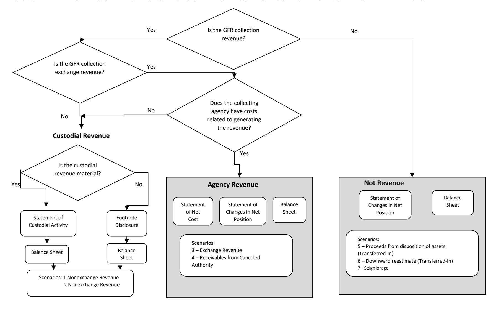

# **GENERAL FUND RECEIPT ACCOUNT (GFR) GUIDE: SCENARIO 7: NON-CUSTODIAL STATEMENT COLLECTIONS: SEIGNORAGE**

# **EFFECTIVE FISCAL YEAR 2021**

# **PREPARED BY:**

**GENERAL LEDGER AND ADVISORY BRANCH FISCAL ACCOUNTING OPERATIONS BUREAU OF THE FISCAL SERVICE U.S. DEPARTMENT OF THE TREASURY**

| Version Number | Date    | Description of Change                                                                      | Effective USSGL TFM      |
|-------------------|---------|--------------------------------------------------------------------------------------------|--------------------------|
| 1.0               | 08/2007 | Original                                                                                   | TFM Bulletin No. 2018-04 |
| 2.0               | 01/2021 | Added General Fund of the U.S. Government Transactions, Updated Financial Statements | TFM Bulletin No. 2021-07 |

#### **Background**

#### **Definition of a General Fund Receipt (GFR) Account**

The Government Accountability Office (GAO) defines a GFR Account as: "A receipt account credited with all collections that are not earmarked by law for another account for a specific purpose. These collections are presented in the President's budget as either governmental (budget) receipts or offsetting receipts. These include taxes, customs duties, and miscellaneous receipts." (Government Accountability Office, A Glossary of Terms Used in the Federal Budget Process, September 2005, GAO–05-734SP)

#### **Purpose**

This guidance proposes accounting and reporting guidance for various collections classified in GFR accounts. The following scenarios illustrate accounting transactions and reporting for specific types of collections. The focus of this guidance is on the GFR account activity. Related transactions illustrated in the scenarios such as credit reform activities are covered in more detail in the other case studies. Refer to those case studies for questions not specifically related to GFR activity.

#### **Federal Account Symbols (FAS), Treasury Account Symbols (TAS), and Collections**

The Federal Account Symbols and Titles (FAST) Book, published by Treasury, lists all FAS available for Federal agency use. A collection can be classified to any of the listed accounts. To classify a receipt, append your agency's two digit department code to the FAS. This combination of department code and FAS creates TAS. For example, collections for work performed in accordance with Economy Act can be deposited into any type of expenditure account. On the other hand, National Park Service fees are designated by law to be deposited to a special fund receipt account. Similarly, collections for the National Endowment for the Arts Gift Fund are designated by law to be deposited to a trust fund receipt account. Amounts collected in the course of business by the U.S. Postal Service are, by law, deposited to a revolving fund. Amounts not belonging to the Government are, by law, classified to deposit fund accounts. As you can see, a specific law determines how the collections in the preceding examples are classified in a TAS.

Absent specific legislation, collections should be classified to a **General Fund Receipt TAS**. Title 31, United States Code (USC), chapter 33, section 3302(b) establishes this concept by stating: "Except as provided in section 3718 (b) of this title, an official or agent of the Government receiving money for the Government from any source shall deposit the money in the Treasury as soon as practicable without deduction for any change or claim." Also, Title 31, USC, chapter 33, section 3302(e) states that "an official or agent of the Government having custody or possession of public money shall keep an accurate entry of each amount of public money received, transferred, and paid."

# **GFR Account Categories in the FAST Book**

The "Types of Collections and Relevant FASAB References" column was included in the table to assist users in providing background information. The users should note that the types of collections and limited paragraph references listed on the chart are suggestions and they should not be solely relied on. Each entity should perform its own research to determine the appropriate category for its collection.

| FAS         | Description of Types of GFR Accounts                                        | Types of Collections and Relevant FASAB Reference |
|-------------|-----------------------------------------------------------------------------|------------------------------------------------------|
| 0610 –      | Difference between the face value of coins and manufacturing cost including | Other Financing Source, SFFAS No. 7,                 |
| Seigniorage | silver or other metals contained in coins.                                  | par. 70, 305                                         |

# **GFR Account Reporting Responsibility**

Within each GFR account category listed in the FAST Book there are unique FAS to identify specific activity. After selecting the proper TAS, the reporting entity should append its 3-digit agency identifier code to the beginning of the TAS for classifying the receipt to Treasury. A collecting entity typically reports all GFR TAS beginning with its 3-digit agency identifier code within its entity financial statements.

#### **FLOWCHART - GFR COLLECTIONS TO COLLECTING AGENCY'S FINANCIAL STATEMENTS**

# **Listing of USSGL Accounts Used in This Scenario**

| Account Number | Account Name                                                                        |
|----------------|-------------------------------------------------------------------------------------|
| Budgetary      |                                                                                     |
| 406000         | Anticipated Collections From Non-Federal Sources                                 |
| 420100         | Total Actual Resources – Collected                                               |
| 426600         | Other Actual Business - Type Collections from Non-Federal Sources                |
| 445000         | Unapportioned Authority                                                             |
| 451000         | Apportionments                                                                      |
| 459000         | Apportionments – Anticipated Resources – Programs Subject to Apportionment    |
| 461000         | Allotments-Realized Resources                                                       |
| 480100         | Undelivered Orders – Obligations, Unpaid                                         |
| 490100         | Delivered Orders – Obligations, Unpaid                                           |
| 490200         | Delivered Orders – Obligations, Paid                                             |
|                |                                                                                     |
| Proprietary    |                                                                                     |
| 101000         | Fund Balance With Treasury                                                          |
| 152500         | Inventory – Raw Materials                                                        |
| 152600         | Inventory – Work-in-Process                                                      |
| 152700         | Inventory – Finished Goods                                                       |
| 211000         | Accounts Payable                                                                    |
| 298500         | Liability for Non-Entity Assets Not Reported on the Statement of Custodial Activity |
| 331000         | Cumulative Results of Operations                                                    |
| 510000         | Revenues From Goods Sold                                                            |
| 579500         | Seigniorage                                                                         |
| 599300         | Offset to Non-Entity Collections - Statement of Changes in Net Position          |
| 610000         | Operating Expenses/Program Costs                                                    |
| 650000         | Cost of Goods Sold                                                                  |
| 661000         | Cost Capitalization Offset                                                          |
| 880100         | Offset for Purchases of Assets                                                      |
| 880300         | Purchases of Inventory and Related Properties                                       |

#### **Scenario 7 Non-Custodial Statement Collections: Seigniorage**

SFFAS No. 7, paragraph 305. "Seigniorage.—Seigniorage is the face value of newly minted coins less the cost of production (which includes the cost of metal, manufacturing, and transportation). It results from the sovereign power of the Government to directly create money and, although not an inflow of resources from the public, does increase the Government's net position in the same manner as an inflow of resources. Because it is not demanded, earned, or donated, it is an other financing source rather than revenue. It should be recognized as an other financing source when coins are delivered to the Federal Reserve Banks in return for deposits."

#### **Beginning Trial Balance**

|             |                                       | Program Fund |        |  |
|-------------|---------------------------------------|--------------|--------|--|
| Account     | Description                           | Debit        | Credit |  |
| Budgetary   |                                       |              |        |  |
| 420100      | Total Actual Resources - Collected | 800          | -      |  |
| 445000      | Unapportioned Authority               | -            | 800    |  |
| Total       |                                       | 800          | 800    |  |
| Proprietary |                                       |              |        |  |
| 101000      | Fund Balance With Treasury            | 800          | -      |  |
| 331000      | Cumulative Results of Operations      | -            | 800    |  |
| Total       |                                       | 800          | 800    |  |

#### **Year 2 1st Quarter**

None

1. To record apportionment and allotment. \$800 of resources from the previous year (carry forward) is being apportioned and allocated. \$1,700 is being apportioned for anticipated collections. **Program Fund Debit Credit TC GFR Account Debit Credit Budgetary Entry** 406000 Anticipated Collection From Non-Federal Sources 445000 Unapportioned Authority 445000 Unapportioned Authority 451000 Apportionments 445000 Unapportioned Authority 459000 Apportionments - Anticipated Resources - Programs Subject to Apportionment 451000 Apportionment 461000 Allotments – Realized Resources **Proprietary Entry** None 1,700 800 1,700 800 1,700 800 1,700 800 A140 A116 A118 A120 **Budgetary Entry** None **Proprietary Entry** None **General Fund of the U.S. Government (099) Budgetary Entry** None **Proprietary Entry Budgetary Entry** None **Proprietary Entry**

None

| 2. To record overhead and manufacturing costs for coins. |                                           |        |      |                   |       |        |  |  |
|----------------------------------------------------------------------|-------------------------------------------|--------|------|-------------------|-------|--------|--|--|
| Program Fund                                                         | Debit                                     | Credit | TC   | GFR Account       | Debit | Credit |  |  |
| Budgetary Entry                                                      |                                           |        |      | Budgetary Entry   |       |        |  |  |
| 461000 Allotments – Realized                                      |                                           |        |      | None              |       |        |  |  |
| Resources                                                            | 500                                       |        | B107 |                   |       |        |  |  |
| 490200 Delivered Orders –                                            |                                           |        |      |                   |       |        |  |  |
| Obligations, Paid                                                    |                                           | 500    |      |                   |       |        |  |  |
|                                                                      |                                           |        |      | Proprietary Entry |       |        |  |  |
| Proprietary Entry                                                    |                                           |        |      | None              |       |        |  |  |
| 610000 (N) Operating Expenses                                        |                                           |        |      |                   |       |        |  |  |
| /Program Costs                                                       | 500                                       |        |      |                   |       |        |  |  |
| 101000 (G)1 Fund Balance With                                     |                                           |        |      |                   |       |        |  |  |
| Treasury2 (RC 40)3                                                |                                           | 500    |      |                   |       |        |  |  |
|                                                                      | General Fund of the U.S. Government (099) |        |      |                   |       |        |  |  |
| Budgetary Entry                                                      |                                           |        |      | Budgetary Entry   |       |        |  |  |
| None                                                                 |                                           |        |      | None              |       |        |  |  |
|                                                                      |                                           |        |      |                   |       |        |  |  |
| Proprietary Entry                                                    |                                           |        |      | Proprietary Entry |       |        |  |  |
| 201000 (F) Liability for Fund                                        |                                           |        |      | None              |       |        |  |  |
| Balance With Treasury (RC 40)                                        | 500                                       |        |      |                   |       |        |  |  |
| 198000 Asset For Agency's                                            |                                           |        |      |                   |       |        |  |  |
| Custodial and Non-Entity Liability                                   |                                           | 500    |      |                   |       |        |  |  |

1 The Federal/Non-Federal attribute domain value of "G" will always have trading partner 099 agency identifier.

2 Although USSGL account 101000 is deposited into the General Fund of the U.S. Government, the collecting agency still has to carry the balances of USSGL accounts 101000 and 298500 on its quarterly Balance Sheet. Treasury's CARS System does not sweep USSGL account 101000 until the year end. The agency should make a note of this as a reconciling item.

3 RC – Reciprocal Category is shown for Intragovernmental Elimination Analysis (not included in GTAS uploaded)

| 3. To record a purchase order to procure goods or services.                                                                                  |       |        |      |                                                      |       |        |
|----------------------------------------------------------------------------------------------------------------------------------------------------|-------|--------|------|------------------------------------------------------|-------|--------|
| Program Fund                                                                                                                                       | Debit | Credit | TC   | GFR Account                                          | Debit | Credit |
| Budgetary Entry 461000 Allotments – Realized Resources 480100 Undelivered Orders – Obligations, Unpaid Proprietary Entry None | 200   | 200    | B306 | Budgetary Entry None Proprietary Entry None |       |        |
|                                                                                                                                                    |       |        |      | General Fund of the U.S. Government (099)            |       |        |
| Budgetary Entry None                                                                                                                            |       |        |      | Budgetary Entry None                              |       |        |
| Proprietary Entry None                                                                                                                          |       |        |      | Proprietary Entry None                            |       |        |

| 4. To record the receipt of goods and services and to accrue a liability. |       |        |      |                                           |       |        |
|------------------------------------------------------------------------------|-------|--------|------|-------------------------------------------|-------|--------|
| Program Fund                                                                 | Debit | Credit | TC   | GFR Account                               | Debit | Credit |
| Budgetary Entry                                                              |       |        |      | Budgetary Entry                           |       |        |
| 480100 Undelivered Orders –                                                  |       |        |      | None                                      |       |        |
| Obligations, Unpaid                                                          | 200   |        |      |                                           |       |        |
| 490100 Delivered Orders,                                                     |       |        | B402 |                                           |       |        |
| Obligations, Unpaid                                                          |       | 200    |      |                                           |       |        |
|                                                                              |       |        |      | Proprietary Entry                         |       |        |
| Proprietary Entry                                                            |       |        |      | None                                      |       |        |
| 152500 (N) Inventory – Raw                                                |       |        |      |                                           |       |        |
| Materials                                                                    | 200   |        |      |                                           |       |        |
| 211000 (N) Accounts Payable                                                  |       | 200    |      |                                           |       |        |
|                                                                              |       |        |      | General Fund of the U.S. Government (099) |       |        |
| Budgetary Entry                                                              |       |        |      | Budgetary Entry                           |       |        |
| None                                                                         |       |        |      | None                                      |       |        |
|                                                                              |       |        |      |                                           |       |        |
| Proprietary Entry                                                            |       |        |      | Proprietary Entry                         |       |        |
| None                                                                         |       |        |      | None                                      |       |        |

#### Also Post:

| 5. To record activity for current-year purchases of inventory and related property. |       |                                           |      |                           |       |        |
|----------------------------------------------------------------------------------------|-------|-------------------------------------------|------|---------------------------|-------|--------|
| Program Fund                                                                           | Debit | Credit                                    | TC   | GFR Account               | Debit | Credit |
| Budgetary Entry None                                                                |       |                                           |      | Budgetary Entry None   |       |        |
| Proprietary Entry 880300 (N) Purchases of Inventory and                             |       |                                           |      | Proprietary Entry None |       |        |
| Related Property 880100 (N) Offset for Purchases of Assets                       | 200   | 200                                       | G122 |                           |       |        |
|                                                                                        |       | General Fund of the U.S. Government (099) |      |                           |       |        |
| Budgetary Entry None                                                                |       |                                           |      | Budgetary Entry None   |       |        |
| Proprietary Entry None                                                              |       |                                           |      | Proprietary Entry None |       |        |

| 6. To record the disbursement of funds for purchase order previously accrued.                                                                             |       |        |      |                                           |       |        |
|--------------------------------------------------------------------------------------------------------------------------------------------------------------|-------|--------|------|-------------------------------------------|-------|--------|
| Program Fund                                                                                                                                                 | Debit | Credit | TC   | GFR Account                               | Debit | Credit |
| Budgetary Entry 490100 Delivered Orders, Obligations, Unpaid 490200 Delivered Orders, Obligations, Paid                                          | 200   | 200    | B110 | Budgetary Entry None                   |       |        |
| Proprietary Entry 211000 (N) Accounts Payable 101000 (G) Fund Balance With Treasury (RC 40)                                                         | 200   | 200    |      | Proprietary Entry None                 |       |        |
|                                                                                                                                                              |       |        |      | General Fund of the U.S. Government (099) |       |        |
| Budgetary Entry None                                                                                                                                      |       |        |      | Budgetary Entry None                   |       |        |
| Proprietary Entry 201000 (F) Liability for Fund Balance With Treasury (RC 40) 198000 Asset For Agency's Custodial and Non-Entity Liability | 200   | 200    |      | Proprietary Entry None                 |       |        |

| 7. To capitalize manufacturing                                                   | overhead into inventory. |                                           |      |                           |       |        |
|----------------------------------------------------------------------------------------|--------------------------|-------------------------------------------|------|---------------------------|-------|--------|
| Program Fund                                                                           | Debit                    | Credit                                    | TC   | GFR Account               | Debit | Credit |
| Budgetary Entry None                                                                |                          |                                           |      | Budgetary Entry None   |       |        |
| Proprietary Entry 152600 Inventory – Work-In-Process 660000 Applied Overhead4 | 500                      | 500                                       | D514 | Proprietary Entry None |       |        |
|                                                                                        |                          | General Fund of the U.S. Government (099) |      |                           |       |        |
| Budgetary Entry None                                                                |                          |                                           |      | Budgetary Entry None   |       |        |
| Proprietary Entry None                                                              |                          |                                           |      | Proprietary Entry None |       |        |

4 In this example, the entity is recording an internal manufacturing process. If an entity is doing business with another entity, USSGL account 661000 should be used in place of USSGL account 660000.

| 8. To record the movement of raw material                                                      | into production. |                                           |      |                           |       |        |
|---------------------------------------------------------------------------------------------------|------------------|-------------------------------------------|------|---------------------------|-------|--------|
| Program Fund                                                                                      | Debit            | Credit                                    | TC   | GFR Account               | Debit | Credit |
| Budgetary Entry None                                                                           |                  |                                           |      | Budgetary Entry None   |       |        |
| Proprietary Entry 152600 Inventory – Work-In-Process 152500 Inventory – Raw Materials | 200              | 200                                       | D516 | Proprietary Entry None |       |        |
|                                                                                                   |                  | General Fund of the U.S. Government (099) |      |                           |       |        |
| Budgetary Entry None                                                                           |                  |                                           |      | Budgetary Entry None   |       |        |
| Proprietary Entry None                                                                         |                  |                                           |      | Proprietary Entry None |       |        |

| Program Fund                                                                                       | Debit | Credit                                    | TC   | GFR Account               | Debit | Credit |
|----------------------------------------------------------------------------------------------------|-------|-------------------------------------------|------|---------------------------|-------|--------|
| Budgetary Entry None                                                                            |       |                                           |      | Budgetary Entry None   |       |        |
| Proprietary Entry 152700 Inventory – Finished Goods 152600 Inventory – Work-In-Process | 700   | 700                                       | D520 | Proprietary Entry None |       |        |
|                                                                                                    |       | General Fund of the U.S. Government (099) |      |                           |       |        |
| Budgetary Entry None                                                                            |       |                                           |      | Budgetary Entry None   |       |        |
| Proprietary Entry None                                                                          |       |                                           |      | Proprietary Entry None |       |        |
|                                                                                                    |       |                                           |      |                           |       |        |
|                                                                                                    |       |                                           |      |                           |       |        |

10. To record payment of \$900 from Federal Reserve Bank (FRB). FRB makes a payment for coins manufactured. If the payment (face value) is greater than the manufacturing cost, then by law, the surplus also known as seigniorage is deposited into the GFR account.[5](#page-16-0) **Program Fund Debit Credit TC GFR Account Debit Credit TC Budgetary Entry** 426600 Other Actual Business-Type Collections From Non-Federal Sources 406000 Anticipated Collections From Non- Federal Sources 459000 Apportionments – Anticipated Resources – Programs Subject to Apportionment 451000 Apportionments 451000 Apportionments 461000 Allotments – Realized Resources **Proprietary Entry** 650000 (N) Cost of Goods Sold 152700 Inventory – Finished Goods 101000 (G) Fund Balance With Treasury (RC 40) 510000 (N) Revenue From Goods Sold 700 700 700 700 700 700 700 700 700 700 C109 A122 A120 E408 C109 **Budgetary Entry** None **Proprietary Entry** 101000 (G) Fund Balance With Treasury (RC 40) 579500 (N) Seigniorage 599300 (G) Offset to Non-Entity Collections - Statement of Changes in Net Position (RC 44) 298500 (G) Liability for Non-Entity Assets Not Reported on The Statement Of Custodial Activity (RC 46) 200 200 200 200 C145 C147 **General Fund of the U.S. Government (099) Budgetary** None **Proprietary** 198000 Asset for Agency's Custodial and Non-Entity Liabilities – General Fund of the U.S. Government 201000 (F) Liability for Fund Balance With Treasury (RC 40) 700 700 **Budgetary** None **Proprietary** 198000 Asset for Agency's Custodial and Non-Entity Liabilities – General Fund of the U.S. Government 201000 (F) Liability for Fund Balance With Treasury (RC 40) 198000 (F) Asset for Agency's Custodial and Non-Entity Liabilities – General Fund of the U.S. Government (RC 46) 571000 (F) Transfer in of Agency Unavailable Custodial and Non- Entity Collections (RC 44) 200 200 200 200

5 As required by 31 U.S.C. § 5136, the U.S. Mint periodically transfers seigniorage in the Public Enterprise Fund (PEF) determined to be in excess of amounts required to support ongoing operations and programs to the General Fund. This scenario assumes that all seigniorage is transferred to the General Fund.

#### **1st Quarter Preclosing Trial Balance**

|             |                                                                                        |       | Program Fund | GFR Account |        |  |
|-------------|----------------------------------------------------------------------------------------|-------|--------------|-------------|--------|--|
| Account     | Description                                                                            | Debit | Credit       | Debit       | Credit |  |
| Budgetary   |                                                                                        |       |              |             |        |  |
| 406000      | Anticipated Collections From Non-Federal Sources                                       | 1,000 | -            | -           | -      |  |
| 420100      | Total Actual Resources - Collected                                                  | 800   | -            | -           | -      |  |
| 426600      | Other Actual Business-Type Collections From Non Federal Sources                     | 700   | -            | -           | -      |  |
| 459000      | Apportionment – Anticipated Resources – Programs Subject to Apportionment     | -     | 1,000        | -           | -      |  |
| 461000      | Allotments – Realized Resources                                                     | -     | 800          | -           | -      |  |
| 490200      | Delivered Orders – Obligations, Paid                                                | -     | 700          | -           | -      |  |
| Total       |                                                                                        | 2,500 | 2,500        | -           | -      |  |
| Proprietary |                                                                                        |       |              |             |        |  |
| 101000 (G)  | Fund Balance With Treasury                                                             | 800   | -            | 200         | -      |  |
| 298500 (G)  | Liability for Non-Entity Assets Not Reported on the Statement of Custodial Activity | -     | -            | -           | 200    |  |
| 331000      | Cumulative Results of Operations                                                       | -     | 800          | -           | -      |  |
| 510000 (N)  | Revenue From Goods Sold                                                                | -     | 700          | -           | -      |  |
| 579500 (N)  | Seigniorage                                                                            | -     | -            | -           | 200    |  |
| 599300 (G)  | Offset to Non-Entity Collection – Statement of Changes in Net Position           | -     | -            | 200         | -      |  |
| 610000 (N)  | Operating Expenses/Program Costs                                                       | 500   | -            | -           | -      |  |
| 650000 (N)  | Cost of Goods Sold                                                                     | 700   | -            | -           | -      |  |
| 660000 (N)  | Applied Overhead                                                                       | -     | 500          | -           | -      |  |
| Total       |                                                                                        | 2,000 | 2,000        | 400         | 400    |  |
| Memorandum  |                                                                                        |       |              |             |        |  |
| 880100      | Offset for Purchases of Assets                                                         | -     | 200          | -           | -      |  |
| 880300      | Purchases of Inventory and Related Properties                                          | 200   | -            | -           | -      |  |
| Total       |                                                                                        | 200   | 200          | -           | -      |  |

#### **Financial Statements Quarter 1 Year 2**

|             | CONSOLIDATED BALANCE SHEET AS OF DECEMBER 31, YEAR 2                                                                                        |       |
|-------------|---------------------------------------------------------------------------------------------------------------------------------------------|-------|
| Line No. |                                                                                                                                             |       |
|             | Assets (Note 2)                                                                                                                             |       |
|             | Intra-governmental                                                                                                                          |       |
| 1.          | Fund Balance With Treasury (Note 3) (101000E)                                                                                         | 1,000 |
| 3.          | Accounts receivable, net (Note 6) (131000E)                                                                                           | -     |
| 6.          | Total Intra-governmental                                                                                                                    | 1,000 |
| 15.         | Total with the public                                                                                                                       | 1,000 |
| 16.         | Total assets                                                                                                                                | 1,000 |
|             |                                                                                                                                             |       |
|             | Liabilities (Note 13)                                                                                                                       |       |
|             | Intra-governmental                                                                                                                          |       |
| 22.4        | Liability to the General Fund of the U.S. Government for custodial and other non-entity assets (Note 17) (298500E)                    | 200   |
| 23.         | Total intra-governmental                                                                                                                    | 200   |
| 34.         | Total liabilities                                                                                                                           | 200   |
|             | Net position:                                                                                                                               |       |
| 36          | Total net position – Funds from Dedicated Collections (Note 20) (Combined or Consolidated)                                               |       |
| 36.2        | Cumulative results of operations – Funds from Dedicated Collections (331000B, 510000E, 610000E, 650000E, 660000E)                     | 800   |
| 37          | Total net position – Funds other than those from Dedicated Collections (Combined or Consolidated)                                        |       |
| 37.2        | Cumulative results of operations – Funds other than those from Dedicated Collections (331000B, 510000E, 610000E, 650000E, 660000E) |       |
| 38.         | Total net position                                                                                                                          | 800   |
| 39.         | Total liabilities and net position                                                                                                          | 1,000 |

|      | CONSOLIDATED STATEMENT OF NET COST FOR THE YEAR ENDED DECEMBER 31, YEAR 2 |       |
|------|---------------------------------------------------------------------------|-------|
| Line |                                                                           |       |
| No.  |                                                                           |       |
|      | Gross Program Costs (Note 22):                                            |       |
|      | Program A:                                                                |       |
| 1.   | Gross Costs (610000E, 650000E, 660000E)                                   | 700   |
| 2.   | Less: earned revenue (510000E)                                            | (700) |
| 3.   | Net program costs:                                                        | -     |
| 5.   | Net program costs including Assumption Changes:                           | -     |
| 8.   | Net cost of operations                                                    | -     |

|             | STATEMENT OF BUDGETARY RESOURCES FOR THE YEAR ENDED DECEMBER 31, YEAR 2                                    |       |
|-------------|------------------------------------------------------------------------------------------------------------|-------|
| Line No. |                                                                                                            |       |
|             | Budgetary resources:                                                                                       |       |
| 1051        | Unobligated balance from prior year budget authority, net (discretionary and mandatory) (420100B, 426600E) | 1,500 |
| 1890        | Spending authority from offsetting collections (discretionary and mandatory) (406000E)                     | 1,000 |
| 1910        | Total budgetary resources                                                                                  | 2,500 |
|             | Status of budgetary resources:                                                                             |       |
| 2190        | New obligations and upward adjustments (total) (Note 29) (490200E)                                         | 700   |
|             | Unobligated balance, end of year:                                                                          |       |
| 2204        | Apportioned, unexpired account (459000E, 461000E)                                                          | 1,800 |
| 2412        | Unexpired unobligated balance, end of year                                                                 | 1,800 |
| 2490        | Unobligated balance, end of year (total)                                                                   | 1,800 |
| 2500        | Total budgetary resources                                                                                  | 2,500 |
|             | Outlays, net:                                                                                              |       |
| 4190        | Outlays, net (total) (discretionary and mandatory) (426600E, 490200E)                                      | -     |

#### **Year 2 4th Quarter Entries**

| 1. To record overhead and manufacturing costs for coins.                                                                                         |       |        |      |                                           |       |        |    |  |
|--------------------------------------------------------------------------------------------------------------------------------------------------------------|-------|--------|------|-------------------------------------------|-------|--------|----|--|
| Program Fund                                                                                                                                                 | Debit | Credit | TC   | GFR Account                               | Debit | Credit | TC |  |
| Budgetary Entry 461000 Allotments – Realized Resources 490200 Delivered Orders, Obligations, Paid                                             | 700   | 700    | B107 | Budgetary Entry None                   |       |        |    |  |
| Proprietary Entry 610000 (N) Operating Expenses/Program Costs 101000 (G) Fund Balance With Treasury (RC 40)                                      | 700   | 700    |      | Proprietary Entry None                 |       |        |    |  |
|                                                                                                                                                              |       |        |      | General Fund of the U.S. Government (099) |       |        |    |  |
| Budgetary Entry None                                                                                                                                      |       |        |      | Budgetary Entry None                   |       |        |    |  |
| Proprietary Entry 201000 (F) Liability for Fund Balance With Treasury (RC 40) 198000 Asset for Agency's Custodial and Non-Entity Liability | 700   | 700    |      | Proprietary Entry None                 |       |        |    |  |

| Debit | Credit | TC   | GFR Account Budgetary Entry None | Debit                                     | Credit | TC |  |  |  |  |
|-------|--------|------|----------------------------------------|-------------------------------------------|--------|----|--|--|--|--|
|       |        |      |                                        |                                           |        |    |  |  |  |  |
|       |        |      |                                        |                                           |        |    |  |  |  |  |
| 700   | 700    | D514 | Proprietary Entry None              |                                           |        |    |  |  |  |  |
|       |        |      |                                        |                                           |        |    |  |  |  |  |
|       |        |      | Budgetary Entry None                |                                           |        |    |  |  |  |  |
|       |        |      | Proprietary Entry None              |                                           |        |    |  |  |  |  |
|       |        |      |                                        | General Fund of the U.S. Government (099) |        |    |  |  |  |  |

6 In this example, the entity is recording an internal manufacturing process. If an entity is doing business with another entity, USSGL account 661000 should be used in place of USSGL account 660000.

| 3. To record a purchase order and procure goods or services.                                |       |        |      |                                           |       |        |    |  |  |
|------------------------------------------------------------------------------------------------|-------|--------|------|-------------------------------------------|-------|--------|----|--|--|
| Program Fund                                                                                   | Debit | Credit | TC   | GFR Account                               | Debit | Credit | TC |  |  |
| Budgetary Entry 461000 Allotments – Realized Resources 480100 Undelivered Orders – | 100   |        | B306 | Budgetary Entry None                   |       |        |    |  |  |
| Obligations, Unpaid Proprietary Entry None                                               |       | 100    |      | Proprietary Entry None                 |       |        |    |  |  |
|                                                                                                |       |        |      | General Fund of the U.S. Government (099) |       |        |    |  |  |
| Budgetary Entry None                                                                        |       |        |      | Budgetary Entry None                   |       |        |    |  |  |
| Proprietary Entry None                                                                      |       |        |      | Proprietary Entry None                 |       |        |    |  |  |

| 4. To record the receipt of goods and services and to accrue a liability. |       |        |      |                                           |       |        |    |  |  |
|---------------------------------------------------------------------------------|-------|--------|------|-------------------------------------------|-------|--------|----|--|--|
| Program Fund                                                                    | Debit | Credit | TC   | GFR Account                               | Debit | Credit | TC |  |  |
| Budgetary Entry                                                                 |       |        |      | Budgetary Entry                           |       |        |    |  |  |
| 480100 Undelivered                                                              |       |        |      | None                                      |       |        |    |  |  |
| Orders – Obligations, Unpaid                                                 | 100   |        |      |                                           |       |        |    |  |  |
| 490100 Delivered Orders,                                                        |       |        | B402 |                                           |       |        |    |  |  |
| Obligations, Unpaid                                                             |       | 100    |      |                                           |       |        |    |  |  |
|                                                                                 |       |        |      | Proprietary Entry                         |       |        |    |  |  |
| Proprietary Entry                                                               |       |        |      | None                                      |       |        |    |  |  |
| 152500 (N) Inventory – Raw                                                   |       |        |      |                                           |       |        |    |  |  |
| Materials                                                                       | 100   |        |      |                                           |       |        |    |  |  |
| 211000 (N) Accounts Payable                                                     |       | 100    |      |                                           |       |        |    |  |  |
|                                                                                 |       |        |      | General Fund of the U.S. Government (099) |       |        |    |  |  |
| Budgetary Entry                                                                 |       |        |      | Budgetary Entry                           |       |        |    |  |  |
| None                                                                            |       |        |      | None                                      |       |        |    |  |  |
|                                                                                 |       |        |      |                                           |       |        |    |  |  |
|                                                                                 |       |        |      |                                           |       |        |    |  |  |
|                                                                                 |       |        |      |                                           |       |        |    |  |  |
| Proprietary Entry                                                               |       |        |      | Proprietary Entry                         |       |        |    |  |  |
| None                                                                            |       |        |      | None                                      |       |        |    |  |  |
|                                                                                 |       |        |      |                                           |       |        |    |  |  |
|                                                                                 |       |        |      |                                           |       |        |    |  |  |

#### Also Post:

| Program Fund                                | Debit | Credit                                    | TC   | GFR Account               | Debit | Credit | TC |
|---------------------------------------------|-------|-------------------------------------------|------|---------------------------|-------|--------|----|
| Budgetary Entry                             |       |                                           |      | Budgetary Entry           |       |        |    |
| None                                        |       |                                           |      | None                      |       |        |    |
| Proprietary Entry                           |       |                                           |      | Proprietary Entry         |       |        |    |
| 880300 (N) Purchases of Inventory and |       |                                           |      | None                      |       |        |    |
| Related Property                            | 100   |                                           | G122 |                           |       |        |    |
| 880100 (N) Offset for Purchases of       |       | 100                                       |      |                           |       |        |    |
| Assets                                      |       |                                           |      |                           |       |        |    |
|                                             |       | General Fund of the U.S. Government (099) |      |                           |       |        |    |
| Budgetary Entry                             |       |                                           |      | Budgetary Entry           |       |        |    |
| None                                        |       |                                           |      | None                      |       |        |    |
|                                             |       |                                           |      |                           |       |        |    |
| Proprietary Entry None                   |       |                                           |      | Proprietary Entry None |       |        |    |
|                                             |       |                                           |      |                           |       |        |    |
|                                             |       |                                           |      |                           |       |        |    |

| 6.                                                                                                                                                        | To record the disbursement of funds for purchase order previously accrued. |        |      |                                           |       |        |    |  |  |  |
|-----------------------------------------------------------------------------------------------------------------------------------------------------------|----------------------------------------------------------------------------|--------|------|-------------------------------------------|-------|--------|----|--|--|--|
| Program Fund                                                                                                                                              | Debit                                                                      | Credit | TC   | GFR Account                               | Debit | Credit | TC |  |  |  |
| Budgetary Entry 490100 Delivered Orders, Obligations, Unpaid 490200 Delivered Orders, Obligations, Paid                                       | 100                                                                        | 100    | B110 | Budgetary Entry None                   |       |        |    |  |  |  |
| Proprietary Entry 211000 (N) Accounts Payable 101000 (G) Fund Balance With Treasury (RC 40)                                                      | 100                                                                        | 100    |      | Proprietary Entry None                 |       |        |    |  |  |  |
|                                                                                                                                                           |                                                                            |        |      | General Fund of the U.S. Government (099) |       |        |    |  |  |  |
| Budgetary Entry None                                                                                                                                   |                                                                            |        |      | Budgetary Entry None                   |       |        |    |  |  |  |
| Proprietary Entry 201000 (F) Liability for Fund Balance With Treasury (RC 40) 198000 Asset for Agency's Custodial And Non-Entity Liability | 100                                                                        | 100    |      | Proprietary Entry None                 |       |        |    |  |  |  |

| Program Fund                      | Debit | Credit                                    | TC   | GFR Account       | Debit | Credit | TC |
|-----------------------------------|-------|-------------------------------------------|------|-------------------|-------|--------|----|
| Budgetary Entry                   |       |                                           |      | Budgetary Entry   |       |        |    |
| None                              |       |                                           |      | None              |       |        |    |
|                                   |       |                                           |      |                   |       |        |    |
| Proprietary Entry                 |       |                                           |      | Proprietary Entry |       |        |    |
| 152600 (N) Inventory – Work-In |       |                                           |      | None              |       |        |    |
| Process                           | 100   |                                           | D516 |                   |       |        |    |
| 152500 (N) Inventory – Raw     |       |                                           |      |                   |       |        |    |
| Materials                         |       | 100                                       |      |                   |       |        |    |
|                                   |       | General Fund of the U.S. Government (099) |      |                   |       |        |    |
| Budgetary Entry                   |       |                                           |      | Budgetary Entry   |       |        |    |
| None                              |       |                                           |      | None              |       |        |    |
|                                   |       |                                           |      |                   |       |        |    |
|                                   |       |                                           |      |                   |       |        |    |
| Proprietary Entry                 |       |                                           |      | Proprietary Entry |       |        |    |
| None                              |       |                                           |      | None              |       |        |    |
|                                   |       |                                           |      |                   |       |        |    |
|                                   |       |                                           |      |                   |       |        |    |

| 8. To record the circulation of coins.               |       |                                           |      |                   |       |        |    |
|---------------------------------------------------------|-------|-------------------------------------------|------|-------------------|-------|--------|----|
| Program Fund                                            | Debit | Credit                                    | TC   | GFR Account       | Debit | Credit | TC |
| Budgetary Entry                                         |       |                                           |      | Budgetary Entry   |       |        |    |
| None                                                    |       |                                           |      | None              |       |        |    |
|                                                         |       |                                           |      | Proprietary Entry |       |        |    |
| Proprietary Entry 152700 (N) Inventory – Finished |       |                                           |      | None              |       |        |    |
| Goods                                                   | 800   |                                           |      |                   |       |        |    |
| 152600 (N) Inventory – Work-In-                      |       |                                           | D520 |                   |       |        |    |
| Process                                                 |       | 800                                       |      |                   |       |        |    |
|                                                         |       |                                           |      |                   |       |        |    |
|                                                         |       | General Fund of the U.S. Government (099) |      |                   |       |        |    |
| Budgetary Entry                                         |       |                                           |      | Budgetary Entry   |       |        |    |
| None                                                    |       |                                           |      | None              |       |        |    |
| Proprietary Entry                                       |       |                                           |      | Proprietary Entry |       |        |    |
| None                                                    |       |                                           |      | None              |       |        |    |
|                                                         |       |                                           |      |                   |       |        |    |
|                                                         |       |                                           |      |                   |       |        |    |
|                                                         |       |                                           |      |                   |       |        |    |
|                                                         |       |                                           |      |                   |       |        |    |

| 9. To record payment of \$1,000 from Federal Reserve Bank (FRB). FRB makes a payment for coins manufactured. If the payment is greater than the manufacturing cost then by law, the surplus also known as seigniorage is deposited into the GFR account.7 |       |            |      |                                                                                                                                                                                                                              |       |        |      |  |  |
|-----------------------------------------------------------------------------------------------------------------------------------------------------------------------------------------------------------------------------------------------------------------|-------|------------|------|------------------------------------------------------------------------------------------------------------------------------------------------------------------------------------------------------------------------------|-------|--------|------|--|--|
| Program Fund                                                                                                                                                                                                                                                    | Debit | Credit     | TC   | GFR Account                                                                                                                                                                                                                  | Debit | Credit | TC   |  |  |
| Budgetary 426600 Other Actual Business-Type Collections From Non Federal Sources                                                                                                                                                                          | 800   |            | C109 | Budgetary None                                                                                                                                                                                                            |       |        |      |  |  |
| 406000 Anticipated Collections From Non-Federal Sources 459000 Apportionments – Anticipated Resources – Programs Subject to Apportionment 451000 Apportionments                                                                                  | 800   | 800 800 | A122 | Proprietary 101000 (G) Fund Balance With Treasury (RC 40) 579500 (N) Seigniorage                                                                                                                              | 200   | 200    | C145 |  |  |
| 451000 Apportionments 461000 Allotments – Realized Resources                                                                                                                                                                                              | 800   | 800        | A120 | 599300 (G) Offset to Non-Entity Collections - Statement of Changes in Net Position (RC 44)                                                                                                                             | 200   |        |      |  |  |
| Proprietary 650000 (N) Cost of Goods Sold 152700 Inventory – Finished Goods                                                                                                                                                                            | 800   | 800        | E408 | 298500 (G) Liability for Non-Entity Non-Entity Assets Not Reported on The Statement Of Custodial Activity (RC 46)                                                                                                   |       | 200    | C147 |  |  |
| 101000 (G) Fund Balance With Treasury (RC 40) 510000 (N) Revenue From Goods Sold                                                                                                                                                                       | 800   | 800        | C109 |                                                                                                                                                                                                                              |       |        |      |  |  |
|                                                                                                                                                                                                                                                                 |       |            |      | General Fund of the U.S. Government (099)                                                                                                                                                                                    |       |        |      |  |  |
| Budgetary Proprietary                                                                                                                                                                                                                                        |       |            |      | Budgetary None                                                                                                                                                                                                            |       |        |      |  |  |
| 198000 (F) Asset for Agency's Custodial and Non-Entity Liabilities – General Fund of the U.S. Government 201000 (F) Liability For Fund Balance With Treasury (RC 40)                                                                                | 800   | 800        |      | Proprietary 198000 Asset for Agency's Custodial and Non-Entity Liabilities – General Fund of the U.S. Government 201000 (F) Liability For Fund Balance With Treasury (RC 40)                               | 200   | 200    |      |  |  |
|                                                                                                                                                                                                                                                                 |       |            |      | 198000 (F) Asset for Agency's Custodial and Non-Entity Liabilities – General Fund of the U.S. Government (RC 46) 571000 (F) Transfer in of Agency Unavailable Custodial and Non-Entity Collections (RC 44) | 200   | 200    |      |  |  |

7 As required by 31 U.S.C. § 5136, the U.S. Mint periodically transfers seigniorage in the Public Enterprise Fund (PEF) determined to be in excess of amounts required to support ongoing operations and programs to the General Fund. This scenario assumes that all seigniorage is transferred to the General Fund.

**Year 2 Preclosing Trial Balance**

|             |                                                                                        |       | Program Fund | GFR Account |        |
|-------------|----------------------------------------------------------------------------------------|-------|--------------|-------------|--------|
| Account     | Description                                                                            | Debit | Credit       | Debit       | Credit |
| Budgetary   |                                                                                        |       |              |             |        |
| 406000      | Anticipated Collections From Non-Federal Sources                                       | 200   | -            | -           | -      |
| 420100      | Total Actual Resources - Collected                                                  | 800   | -            | -           | -      |
| 426600      | Other Actual Business-Type Collections From Non Federal Sources                     | 1,500 | -            | -           | -      |
| 459000      | Apportionment – Anticipated Resources – Programs Subject to Apportionment     | -     | 200          | -           | -      |
| 461000      | Allotments – Realized Resources                                                     | -     | 800          | -           | -      |
| 490200      | Delivered Orders – Obligations, Paid                                                | -     | 1,500        | -           | -      |
| Total       |                                                                                        | 2,500 | 2,500        | -           | -      |
| Proprietary |                                                                                        |       |              |             |        |
| 101000 (F)  | Fund Balance With Treasury                                                             | 800   | -            | 400         | -      |
| 298500 (G)  | Liability for Non-Entity Assets Not Reported on the Statement of Custodial Activity | -     | -            | -           | 400    |
| 331000      | Cumulative Results of Operations                                                       | -     | 800          | -           | -      |
| 510000 (N)  | Revenue From Goods Sold                                                                | -     | 1,500        | -           | -      |
| 579500 (N)  | Seigniorage                                                                            | -     | -            | -           | 400    |
| 599300 (G)  | Offset to Non-Entity Collection – Statement of Changes in Net Position           | -     | -            | 400         | -      |
| 610000 (N)  | Operating Expenses/Program Costs                                                       | 1,200 | -            | -           | -      |
| 650000 (N)  | Cost of Goods Sold                                                                     | 1,500 | -            | -           | -      |
| 660000 (N)  | Applied Overhead                                                                       | -     | 1,200        | -           | -      |
| Total       |                                                                                        | 3,500 | 3,500        | 800         | 800    |
| Memorandum  |                                                                                        |       |              |             |        |
| 880100      | Offset for Purchases of Assets                                                         | -     | 300          | -           | -      |
| 880300      | Purchases of Inventory and Related Properties                                          | 300   | -            | -           | -      |
| Total       |                                                                                        | 300   | 300          | -           | -      |

#### **Year 2 – Preclosing Adjusting Entries**

| 1. To record adjustments for anticipated resources not realized.                                                                                     |       |                                           |      |                           |       |        |  |  |
|---------------------------------------------------------------------------------------------------------------------------------------------------------|-------|-------------------------------------------|------|---------------------------|-------|--------|--|--|
| Program Fund                                                                                                                                            | Debit | Credit                                    | TC   | GFR Account               | Debit | Credit |  |  |
| Budgetary Entry 459000 Apportionments – Anticipated Resources – Programs Subject to Apportionments 406000 Anticipated Collection From | 200   |                                           | F112 | Budgetary Entry None   |       |        |  |  |
| Non-Federal Sources                                                                                                                                     |       | 200                                       |      |                           |       |        |  |  |
| Proprietary Entry None                                                                                                                               |       |                                           |      | Proprietary Entry None |       |        |  |  |
|                                                                                                                                                         |       | General Fund of the U.S. Government (099) |      |                           |       |        |  |  |
| Budgetary Entry None                                                                                                                                 |       |                                           |      | Budgetary Entry None   |       |        |  |  |
| Proprietary Entry None                                                                                                                               |       |                                           |      | Proprietary Entry None |       |        |  |  |

| 2. To record the closing of the Fund Balance With Treasury collected in a General Fund receipt account at yearend. |       |        |                                                                                                                                                                                                                                                   |       |        |      |  |  |
|-----------------------------------------------------------------------------------------------------------------------|-------|--------|---------------------------------------------------------------------------------------------------------------------------------------------------------------------------------------------------------------------------------------------------|-------|--------|------|--|--|
| Program Fund                                                                                                          | Debit | Credit | GFR Account                                                                                                                                                                                                                                       | Debit | Credit | TC   |  |  |
| Budgetary Entry None                                                                                               |       |        | Budgetary Entry None                                                                                                                                                                                                                           |       |        |      |  |  |
| Proprietary Entry None                                                                                             |       |        | Proprietary Entry 298500 (G) Liability for Non Entity Assets Not Reported on the Statement of Custodial Activity (RC 46) 101000 (G) Fund Balance With Treasury (RC 40)                                                          | 400   | 400    | F124 |  |  |
|                                                                                                                       |       |        | General Fund of the U.S. Government (099)                                                                                                                                                                                                         |       |        |      |  |  |
| Budgetary Entry None Proprietary Entry None                                                                  |       |        | Budgetary Entry None Proprietary Entry 201000 (G) Liability for Fund Balance With Treasury (RC 40) 198000 (F) Asset for Agency's Custodial And Non-Entity Liabilities – General Fund of the U.S. Government (RC 46) | 400   | 400    |      |  |  |

**Year 2 Preclosing Adjusted Trial Balance**

|             |                                                                              |       | Program Fund | GFR Account |        |
|-------------|------------------------------------------------------------------------------|-------|--------------|-------------|--------|
| Account     | Description                                                                  | Debit | Credit       | Debit       | Credit |
| Budgetary   |                                                                              |       |              |             |        |
| 420100      | Total Actual Resources - Collected                                        | 800   | -            | -           | -      |
| 426600      | Other Actual Business-Type Collections From Non Federal Sources           | 1,500 | -            | -           | -      |
| 461000      | Allotments – Realized Resources                                           | -     | 800          | -           | -      |
| 490200      | Delivered Orders – Obligations, Paid                                      | -     | 1,500        | -           | -      |
| Total       |                                                                              | 2,300 | 2,300        | -           | -      |
|             |                                                                              | -     | -            | -           | -      |
| Proprietary |                                                                              |       |              |             |        |
| 101000 (G)  | Fund Balance With Treasury                                                   | 800   | -            | -           | -      |
| 331000      | Cumulative Results of Operations                                             | -     | 800          | -           | -      |
| 510000 (N)  | Revenue From Goods Sold                                                      | -     | 1,500        | -           | -      |
| 579500 (N)  | Seigniorage                                                                  | -     | -            | -           | 400    |
| 599300 (G)  | Offset to Non-Entity Collection – Statement of Changes in Net Position | -     | -            | 400         | -      |
| 610000 (N)  | Operating Expenses/Program Costs                                             | 1,200 | -            | -           | -      |
| 650000 (N)  | Cost of Goods Sold                                                           | 1,500 | -            | -           | -      |
| 660000 (N)  | Applied Overhead                                                             | -     | 1,200        | -           | -      |
| Total       |                                                                              | 3,500 | 3,500        | 400         | 400    |
| Memorandum  |                                                                              |       |              |             |        |
| 880100      | Offset for Purchases of Assets                                               | -     | 300          | -           | -      |
| 880300      | Purchases of Inventory and Related Properties                                | 300   | -            | -           | -      |
| Total       |                                                                              | 300   | 300          | -           | -      |

## **Financial Statements**

|             | CONSOLIDATED BALANCE SHEET AS OF SEPTEMBER 30, YEAR 2                                                                   |     |
|-------------|-------------------------------------------------------------------------------------------------------------------------|-----|
| Line No. |                                                                                                                         |     |
|             | Assets (Note 2)                                                                                                         |     |
|             | Intra-governmental                                                                                                      |     |
| 1.          | Fund Balance With Treasury (Note 3) (101000E)                                                                     | 800 |
| 6.          | Total Intra-governmental                                                                                                | 800 |
| 15.         | Total assets                                                                                                            | 800 |
|             | Liabilities (Note 13)                                                                                                   |     |
|             | Intra-governmental                                                                                                      |     |
| 23.         | Total intra-governmental                                                                                                | -   |
| 34.         | Total liabilities                                                                                                       | -   |
|             | Net position:                                                                                                           |     |
| 36          | Total net position – Funds from Dedicated Collections (Note 20) (Combined or Consolidated)                           |     |
| 36.2        | Cumulative results of operations – Funds from Dedicated Collections (331000B, 510000E, 610000E, 650000E, 660000E) | 800 |
| 37          | Total net position – Funds other than those from Dedicated Collections (Combined or Consolidated)                    |     |
| 37.2        | Cumulative results of operations – Funds other than those from Dedicated Collections (579500E, 599300E)           |     |
| 38.         | Total net position                                                                                                      | 800 |
| 39.         | Total liabilities and net position                                                                                      | 800 |

|             | CONSOLIDATED STATEMENT OF NET COST FOR THE YEAR ENDED SEPTEMBER 30, YEAR 2 |         |  |
|-------------|----------------------------------------------------------------------------|---------|--|
| Line No. |                                                                            |         |  |
|             | Gross Program Costs (Note 22):                                             |         |  |
|             | Program A:                                                                 |         |  |
| 1.          | Gross Costs (610000E, 650000E, 660000E)                                    | 1,500   |  |
| 2.          | Less: earned revenue (510000E)                                             | (1,500) |  |
| 3.          | Net program costs:                                                         | -       |  |
| 5.          | Net program costs including Assumption Changes:                            | -       |  |
| 8.          | Net cost of operations                                                     | -       |  |

| CONSOLIDATED STATEMENT OF CHANGES IN NET POSITION FOR THE YEAR ENDED SEPTEMBER 30, YEAR 2 |                                        |                                           |              |
|-------------------------------------------------------------------------------------------|----------------------------------------|-------------------------------------------|--------------|
| Line No.                                                                               |                                        | Funds From Dedicated Collections | Consolidated |
|                                                                                           | Cumulative Results from Operations:    |                                           |              |
| 10.                                                                                       | Beginning Balances (331000B)           | 800                                       | 800          |
| 12.                                                                                       | Beginning balances, as adjusted        | 800                                       | 800          |
|                                                                                           | Other Financing Sources (Nonexchange): |                                           |              |
| 22.                                                                                       | Other (+/-) (579500E, 599300E)         | -                                         | -            |
| 23.                                                                                       | Total Financing Sources                | -                                         | -            |
| 24.                                                                                       | Net Cost of Operations (+/-)           | -                                         | -            |
| 25.                                                                                       | Net Change                             | -                                         | -            |
| 26.                                                                                       | Cumulative Results of Operations       | 800                                       | 800          |
| 27.                                                                                       | Net Position                           | 800                                       | 800          |

| STATEMENT OF BUDGETARY RESOURCES FOR THE YEAR ENDED SEPTEMBER 30, YEAR 2 |                                                                                                            |       |
|--------------------------------------------------------------------------|------------------------------------------------------------------------------------------------------------|-------|
| Line                                                                     |                                                                                                            |       |
| No.                                                                      |                                                                                                            |       |
|                                                                          | Budgetary resources:                                                                                       |       |
| 1071                                                                     | Unobligated balance from prior year budget authority, net (discretionary and mandatory) (420100B, 426600E) | 2,300 |
| 1910                                                                     | Total budgetary resources                                                                                  | 2,300 |
|                                                                          | Status of budgetary resources:                                                                             |       |
| 2190                                                                     | New obligations and upward adjustments (total) (Note 29) (490200E)                                         | 1,500 |
|                                                                          | Unobligated balance, end of year:                                                                          |       |
| 2204                                                                     | Apportioned, unexpired account (461000E)                                                                   | 800   |
| 2412                                                                     | Unexpired unobligated balance, end of year                                                                 | 800   |
| 2490                                                                     | Unobligated balance, end of year (total)                                                                   | 800   |
| 2500                                                                     | Total budgetary resources                                                                                  | 2,300 |
|                                                                          | Outlays, net:                                                                                              |       |
| 4190                                                                     | Outlays, net (total) (discretionary and mandatory) (426600E, 490200E)                                      | -     |

| SF 133 AND SCHEDULE P: REPORT ON BUDGET EXECUTION AND BUDGETARY RESOURCES AND BUDGET PROGRAM AND FINANCING SCHEDULE FOR THE YEAR ENDED SEPTEMBER 30, YEAR 2 |                                                                       |        |            |
|----------------------------------------------------------------------------------------------------------------------------------------------------------------|-----------------------------------------------------------------------|--------|------------|
| Line No.                                                                                                                                                       |                                                                       | SF 133 | Schedule P |
|                                                                                                                                                                | BUDGETARY RESOURCES                                                   |        |            |
|                                                                                                                                                                | Unobligated balance:                                                  |        |            |
| 1000                                                                                                                                                           | Unobligated balance brought forward, Oct 1 (420100B)                  | 800    | 800        |
| 1050                                                                                                                                                           | Unobligated balance (total)                                           | 800    | 800        |
|                                                                                                                                                                |                                                                       |        |            |
|                                                                                                                                                                | Spending authority from offsetting collections:                       |        |            |
|                                                                                                                                                                | Discretionary:                                                        |        |            |
| 1700                                                                                                                                                           | Collected (426600E)                                                   | 1,500  | 1,500      |
| 1750                                                                                                                                                           | Spending authority from offsetting collections, discretionary (total) | 1,500  | 1,500      |
| 1900                                                                                                                                                           | Budget authority (total)                                              | 1,500  | 1,500      |
| 1910                                                                                                                                                           | Total budgetary resources                                             | 2,300  | -          |
| 1930                                                                                                                                                           | Total budgetary resources available                                   | -      | 2,300      |
|                                                                                                                                                                |                                                                       |        |            |
|                                                                                                                                                                | Memoradum (non-add) entries:                                          |        |            |
|                                                                                                                                                                | All accounts:                                                         |        |            |
| 1941                                                                                                                                                           | Unexpired unobligated balance, end of year (4610000E)                 | -      | 800        |
|                                                                                                                                                                |                                                                       |        |            |
|                                                                                                                                                                | STATUS OF BUDGETARY RESOURCES                                         |        |            |
|                                                                                                                                                                | New obligations and upward adjustments:                               |        |            |
|                                                                                                                                                                | Direct:                                                               |        |            |
| 2002                                                                                                                                                           | Category B (by project) (490200E)                                     | 1,500  | -          |
| 2004                                                                                                                                                           | Direct obligations (total)                                            | 1,500  | -          |
| 2170                                                                                                                                                           | New obligations, unexpired accounts (490200E)                         | 1,500  | -          |
| 2190                                                                                                                                                           | New obligations and upward adjustments (total)                        | 1,500  | -          |
|                                                                                                                                                                | Unobligated balance:                                                  |        |            |
|                                                                                                                                                                | Apportioned, unexpired accounts:                                      |        |            |
| 2201                                                                                                                                                           | Available in the current period (461000E)                             | 800    | -          |
| 2412                                                                                                                                                           | Unexpired unobligated balance: end of year                            | 800    | -          |
| 2490                                                                                                                                                           | Unobligated balance, end of year (total)                              | 800    | -          |
| 2500                                                                                                                                                           | Total budgetary resources                                             | 2,300  | -          |

| SF 133 AND SCHEDULE P: REPORT ON BUDGET EXECUTION AND BUDGETARY RESOURCES AND BUDGET PROGRAM AND FINANCING SCHEDULE AS OF SEPTEMBER 30, YEAR 2 |                                                                                |        |            |
|---------------------------------------------------------------------------------------------------------------------------------------------------|--------------------------------------------------------------------------------|--------|------------|
| Line No.                                                                                                                                          |                                                                                | SF 133 | Schedule P |
|                                                                                                                                                   | Memorandum (non-add) entries:                                                  |        |            |
| 2501                                                                                                                                              | Subject to apportionment – excluding anticipated amounts (461000E, 490200E) | 2,300  | -          |
|                                                                                                                                                   | CHANGE IN OBLIGATED BALANCE                                                    |        |            |
|                                                                                                                                                   | Unpaid obligations:                                                            |        |            |
| 3010                                                                                                                                              | New obligations, unexpired accounts (490200E)                                  | 1,500  | 1,500      |
| 3020                                                                                                                                              | Outlays (gross) (-) (490200E)                                                  | 1,500  | 1,500      |
|                                                                                                                                                   | Memorandum (non-add) entries:                                                  |        |            |
| 3100                                                                                                                                              | Obligated balance, start of year (+ or -)                                      | -      | -          |
| 3200                                                                                                                                              | Obligated balance, end of year (+ or -)                                        | -      | -          |
|                                                                                                                                                   | BUDGET AUTHORITY AND OUTLAYS, NET                                              |        |            |
|                                                                                                                                                   | Discretionary:                                                                 |        |            |
|                                                                                                                                                   | Gross budget authority and outlays:                                            |        |            |
| 4000                                                                                                                                              | Budget authority, gross                                                        | 1,500  | 1,500      |
|                                                                                                                                                   | Outlays, gross                                                                 |        |            |
| 4010                                                                                                                                              | Outlays from new discretionary authority (490200E)                             | 1,500  | 1,500      |
| 4020                                                                                                                                              | Outlays, gross (total)                                                         | 1,500  | 1,500      |
| 4033                                                                                                                                              | Non-Federal sources (-) (426600E)                                              | 1,500  | 1,500      |
| 4040                                                                                                                                              | Offsets against gross budget authority and outlays (total) (-)                 | 1,500  | 1,500      |
| 4070                                                                                                                                              | Budget authority, net (discretionary)                                          | -      | -          |
| 4080                                                                                                                                              | Outlays, net (discretionary)                                                   | -      | -          |
|                                                                                                                                                   | Budget authority and outlays, net (total)                                      |        |            |
| 4180                                                                                                                                              | Budget authority, net (total)                                                  | -      | -          |
| 4190                                                                                                                                              | Outlays, net (total)                                                           | -      | -          |

#### **Reclassified Statements:**

**Note: Effective FY 2021, the Reclassified Balance Sheet is the same as the Balance Sheet. Therefore, the Reclassified Balance Sheet is not presented in this scenario.**

| RECLASSIFIED STATEMENT OF NET COST FOR THE YEAR ENDED SEPTEMBER 30, YEAR 2 |                                                    |       |
|----------------------------------------------------------------------------|----------------------------------------------------|-------|
| Line No.                                                                |                                                    |       |
|                                                                            | Gross cost                                         |       |
| 2.                                                                         | Non-federal gross cost (610000E, 650000E, 660000E) | 1,500 |
| 6.                                                                         | Total non-federal gross cost                       | 1,500 |
| 9.                                                                         | Department total gross cost                        | 1,500 |
| 10.                                                                        | Earned Revenue                                     |       |
| 11                                                                         | Non-federal earned revenue (510000E)               | 1,500 |
| 14.                                                                        | Department total earned revenue                    | 1,500 |
| 15.                                                                        | Net cost of operations                             | -     |

|             | RECLASSIFIED STATEMENT OF OPERATIONS AND CHANGES IN NET POSITION FOR THE YEAR ENDED SEPTEMBER 30, YEAR 2 |                                           |                    |              |  |  |  |  |
|-------------|-------------------------------------------------------------------------------------------------------------|-------------------------------------------|--------------------|--------------|--|--|--|--|
| Line No. |                                                                                                             | Funds From Dedicated Collections | All Other Funds | Consolidated |  |  |  |  |
| 1           | Net position, beginning of period (331000B)                                                                 | 800                                       |                    | 800          |  |  |  |  |
| 4           | Net position, beginning of period - adjusted                                                             | 800                                       |                    | 800          |  |  |  |  |
| 5           | Non-federal non-exchange revenue:                                                                           |                                           |                    |              |  |  |  |  |
| 5.7         | Other taxes and receipts (579500E)                                                                          | -                                         | 400                | 400          |  |  |  |  |
| 5.9         | Total non-federal non-exchange revenue                                                                      | -                                         | 400                | 400          |  |  |  |  |
| 7           | Budgetary financing sources:                                                                                |                                           |                    |              |  |  |  |  |
| 7.20        | Total budgetary financing sources                                                                           | -                                         |                    | -            |  |  |  |  |
| 8           | Other financing sources:                                                                                    |                                           |                    |              |  |  |  |  |
| 8.4         | Non-entity collections transferred to the General Fund of the U.S. Government (RC 44) (599300E)          | -                                         | (400)              | (400)        |  |  |  |  |
| 8.11        | Total other financing sources                                                                               | -                                         | (400)              | (400)        |  |  |  |  |
| 9           | Net cost of operations (+/-)                                                                                | -                                         |                    | -            |  |  |  |  |
| 10          | Net position, end of period                                                                                 | 800                                       | -                  | 800          |  |  |  |  |

#### **Closing Entries**

| 1. To record consolidation of actual resources.                                                                                           |       |        |      |                                           |       |        |  |  |  |
|----------------------------------------------------------------------------------------------------------------------------------------------|-------|--------|------|-------------------------------------------|-------|--------|--|--|--|
| Program Fund                                                                                                                                 | Debit | Credit | TC   | GFR Account                               | Debit | Credit |  |  |  |
| Budgetary Entry 420100 Total Actual Resources – Collected 426600 Other Actual Business-Type Collections From Non-Federal Sources | 1,500 | 1,500  | F302 | Budgetary None                         |       |        |  |  |  |
| Proprietary Entry None                                                                                                                    |       |        |      | Proprietary None                       |       |        |  |  |  |
|                                                                                                                                              |       |        |      | General Fund of the U.S. Government (099) |       |        |  |  |  |
| Budgetary None                                                                                                                            |       |        |      | Budgetary None                         |       |        |  |  |  |
|                                                                                                                                              |       |        |      |                                           |       |        |  |  |  |
| Proprietary None                                                                                                                          |       |        |      | Proprietary None                       |       |        |  |  |  |

| 2. To record paid delivered orders to total actual resources.                                                  |       |        |      |                                           |       |        |  |  |  |
|-------------------------------------------------------------------------------------------------------------------|-------|--------|------|-------------------------------------------|-------|--------|--|--|--|
| Program Fund                                                                                                      | Debit | Credit | TC   | GFR Account                               | Debit | Credit |  |  |  |
| Budgetary Entry 490200 Delivered Orders – Obligations, Paid 420100 Total Actual Resources – Collected | 1,500 | 1,500  | F314 | Budgetary Entry None                   |       |        |  |  |  |
| Proprietary Entry None                                                                                         |       |        |      | Proprietary Entry None                 |       |        |  |  |  |
|                                                                                                                   |       |        |      | General Fund of the U.S. Government (099) |       |        |  |  |  |
| Budgetary Entry None                                                                                           |       |        |      | Budgetary Entry None                   |       |        |  |  |  |
| Proprietary Entry None                                                                                         |       |        |      | Proprietary Entry None                 |       |        |  |  |  |

| 3. To record the closing of unobligated balances in programs subject to apportionment to unapportioned authority for unexpired multi-year and no-year funds. |       |        |      |                                           |       |        |  |  |  |
|--------------------------------------------------------------------------------------------------------------------------------------------------------------------|-------|--------|------|-------------------------------------------|-------|--------|--|--|--|
| Program Fund                                                                                                                                                       | Debit | Credit | TC   | GFR Account                               | Debit | Credit |  |  |  |
| Budgetary Entry 461000 Allotments – Realized Resources 445000 Unapportioned Authority                                                                     | 800   | 800    | F308 | Budgetary Entry None                   |       |        |  |  |  |
| Proprietary Entry None                                                                                                                                          |       |        |      | Proprietary Entry None                 |       |        |  |  |  |
|                                                                                                                                                                    |       |        |      | General Fund of the U.S. Government (099) |       |        |  |  |  |
| Budgetary Entry None                                                                                                                                            |       |        |      | Budgetary Entry None                   |       |        |  |  |  |
| Proprietary Entry None                                                                                                                                          |       |        |      | Proprietary Entry None                 |       |        |  |  |  |

| 4. To record the closing of revenue, expenses, and other financing sources to cumulative results of operations.                                                                                                                                   |                         |                         |      |                                                                                                                                                                                                                                            |            |            |  |  |  |  |
|------------------------------------------------------------------------------------------------------------------------------------------------------------------------------------------------------------------------------------------------------|-------------------------|-------------------------|------|--------------------------------------------------------------------------------------------------------------------------------------------------------------------------------------------------------------------------------------------|------------|------------|--|--|--|--|
| Program Fund                                                                                                                                                                                                                                         | Debit                   | Credit                  | TC   | GFR Account                                                                                                                                                                                                                                | Debit      | Credit     |  |  |  |  |
| Budgetary Entry None                                                                                                                                                                                                                              |                         |                         |      | Budgetary None                                                                                                                                                                                                                          |            |            |  |  |  |  |
| Proprietary Entry 510000 (N) Revenue from Goods Sold 660000 Applied Overhead 331000 Cumulative Results of Operations 331000 Cumulative Results of Operations 610000 (N) Operating Expenses/Program Costs 650000 Cost of Goods Sold | 1,500 1,200 2,700 | 2,700 1,200 1,500 | F336 | Proprietary 579500 (N) Seigniorage 331000 Cumulative Results of Operations 33100 Cumulative Results of Operations 599300 (G) Offset to Non-Entity Collections – Statement of Changes in Net Position (RC 44) | 400 400 | 400 400 |  |  |  |  |
|                                                                                                                                                                                                                                                      |                         |                         |      | General Fund of the U.S. Government (099)                                                                                                                                                                                                  |            |            |  |  |  |  |
| Budgetary Entry None                                                                                                                                                                                                                              |                         |                         |      | Budgetary None                                                                                                                                                                                                                          |            |            |  |  |  |  |
| Proprietary Entry None                                                                                                                                                                                                                            |                         |                         |      | Proprietary 571000 (F) Transfer in of Agency Unavailable Custodial and Non-Entity Collections (RC 44) 331000 Cumulative Results of Operations                                                                               | 400        | 400        |  |  |  |  |

| 5. To record the closing of memorandum accounts for purchases.                                                  |       |        |      |                                           |       |        |  |  |
|--------------------------------------------------------------------------------------------------------------------|-------|--------|------|-------------------------------------------|-------|--------|--|--|
| Program Fund                                                                                                       | Debit | Credit | TC   | GFR Account                               | Debit | Credit |  |  |
| Budgetary Entry None                                                                                            |       |        |      | Budgetary Entry None                   |       |        |  |  |
| Proprietary Entry 880100 Offset for Purchases of Assets 880300 Purchases of Inventory and Related Properties | 300   | 300    | F370 | Proprietary Entry None                 |       |        |  |  |
|                                                                                                                    |       |        |      | General Fund of the U.S. Government (099) |       |        |  |  |
| Budgetary Entry None                                                                                            |       |        |      | Budgetary Entry None                   |       |        |  |  |
| Proprietary Entry None                                                                                          |       |        |      | Proprietary Entry None                 |       |        |  |  |

#### **Post-Closing Trial Balance**

| Account     | Description                           | Program Fund |        | GFR Account |        |
|-------------|---------------------------------------|--------------|--------|-------------|--------|
|             |                                       | Debit        | Credit | Debit       | Credit |
| Budgetary   |                                       |              |        |             |        |
| 420100      | Total Actual Resources - Collected | 800          | -      | -           | -      |
| 445000      | Unapportioned Authority               | -            | 800    | -           | -      |
| Total       |                                       | 800          | 800    | -           | -      |
|             |                                       | -            | -      | -           | -      |
| Proprietary |                                       |              |        |             |        |
| 101000 (G)  | Fund Balance With Treasury            | 800          | -      | -           | -      |
| 331000      | Cumulative Results of Operations      | -            | 800    | -           | -      |
| Total       |                                       | 800          | 800    | -           | -      |