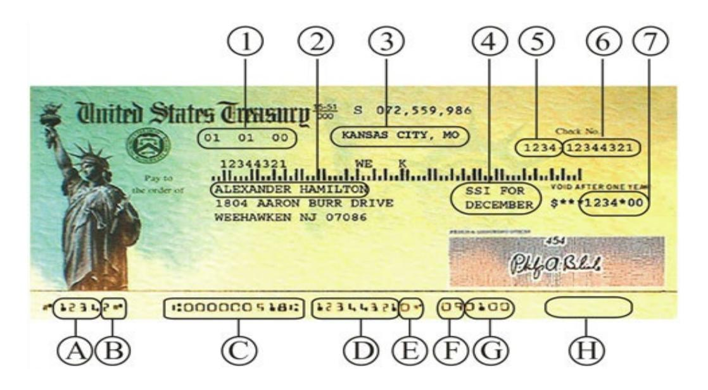
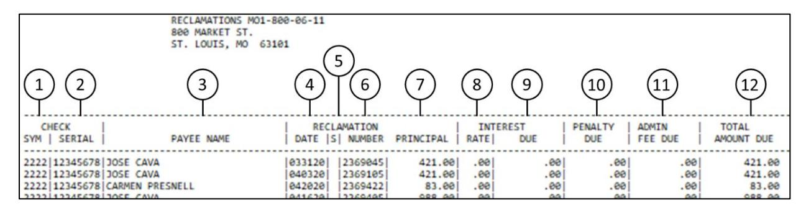

# **Bureau of the Fiscal Service**

**Check Reclamation Procedure**

### **Table of Contents**

| Section 1: Introduction                                                        | 4  |
|--------------------------------------------------------------------------------|----|
| General Information                                                            | 4  |
| Introduction                                                                   | 4  |
| Payments affected                                                              | 4  |
| Conditions                                                                     | 4  |
| Time limitation on reclamation action                                          | 4  |
| The presenting bank is liable for the following:                               | 4  |
| The presenting bank should be aware that:                                      | 5  |
| Check Information                                                              | 5  |
| Section 2: Notice of Direct Debit (U.S. Treasury Check Reclamation)            | 6  |
| Introduction                                                                   | 6  |
| Notice of Direct Debit (U.S. Treasury Check Reclamation)                       | 7  |
| Purpose                                                                        | 8  |
| How to Respond to the Notice of Direct Debit (U.S. Treasury Check Reclamation) | 8  |
| Response Time:                                                                 | 8  |
| Procedure                                                                      | 8  |
| Summary of Debt Statement                                                      | 9  |
| Sample                                                                         | 9  |
| Purpose                                                                        | 9  |
| Multi-part form                                                                | 10 |
| Column explanation                                                             | 10 |
| Reclamation Status Codes                                                       | 12 |
| Introduction                                                                   | 12 |
| Codes                                                                          | 12 |
| Section 3: Information Requests                                                | 13 |
| Overview                                                                       | 13 |
| How to Request a Copy of a Reclamation                                         | 13 |
| Introduction                                                                   | 13 |
| Requesting Information                                                         | 13 |
| Procedure                                                                      | 13 |
| Section 4: Protests                                                            | 15 |
| Overview                                                                       | 15 |
| General Information                                                            | 15 |
| Unacceptable Protests                                                          | 15 |
| How to Protest a Check Reclamation                                             | 16 |

| Procedure                                                             | 16 |
|-----------------------------------------------------------------------|----|
| How To Notify Fiscal Service That Reclamation Notice Is Not Your Item | 17 |
| Fiscal Service Response                                               | 17 |
| Section 5: Overpayments                                               | 18 |
| Procedure                                                             | 18 |
| Returning Funds                                                       | 18 |
| Section 6: Offsets,                                                   | 19 |
| Introduction                                                          | 19 |
| Example                                                               | 19 |
| Reclamation amount                                                    | 19 |
| Federal Entity Payment/reimbursement                                  | 19 |
| Offset action                                                         | 19 |
| Making a Payment                                                      | 20 |
| Offsets in error                                                      | 20 |
| Section 7: Legal Basis                                                | 21 |
| 31 U.S.C. 3712                                                        | 21 |
| 31 U.S.C. 3711-3720E                                                  | 21 |
| 31 CFR 240                                                            | 21 |
| Limited Payability                                                    | 21 |
| Section 8: Contacts                                                   | 23 |
| Contact List                                                          | 23 |
| Section 9: Glossary                                                   | 24 |

**Gold Book** *1. Introduction*

### **Section 1: Introduction**

### **General Information**

#### **Introduction**

Check reclamation is a recovery procedure used by the Bureau of the Fiscal Service (Fiscal Service) to obtain refunds (reclamations) from a presenting bank for paid U.S. Treasury checks.

#### **Payments affected**

All U.S. Treasury checks, regardless of the payment type, are subject to check reclamation procedures.

#### **Conditions**

Reclamation actions may be initiated against the presenting bank when the…

- Check was presented for payment over a forged or unauthorized endorsement,
- When a benefit check was negotiated after the payee's death, or
- When the check was materially altered

#### **Time limitation on reclamation action**

The table below shows how long Fiscal Service has to reclaim funds from the presenting bank.

| If the payee is: | Then the Bureau of the Fiscal Service has:                                                                                           |
|------------------|--------------------------------------------------------------------------------------------------------------------------------------|
| Deceased         | One year from the date the check was presented for payment.                                                                          |
| Not deceased     | One year and 180 calendar days from the date the check was presented for payment, providing the payee filed a timely claim. |

#### **The presenting bank is liable for the following:**

• The principal amount of the check; and if applicable, accrued interest, penalties, and administrative fees.

*1. Introduction* **Gold Book**

#### **The presenting bank should be aware that:**

• Their liability is not contingent upon its ability to collect from prior endorsers,

- It's their responsibility to pay reclamations timely in order to avoid the direct debit process that will occur on the 31st calendar day if the reclamation has not been paid or protested, and
- Fiscal Service will only accept reclamation protests from presenting banks and not their customers or other correspondents.

#### **Check Information**

### **Check Description:**

*Where information is located*

- 1. Issue Date
- 2. Payee Name
- 3. Disbursing Office Location (Optional)
- 4. Issue Type
- 5. Check Symbol
- 6. Check Serial Number
- 7. Issue Amount

#### **MICR Line:**

*Magnetic Ink Character Recognition Line*

- A. Check Symbol
- B. Check Digit
- C. Routing Number Unique to U. S. Treasury checks
- D. Check Serial Number
- E. Check Digit
- F. Federal Entity Code
- G. Issue Date (MM/YY)
- H. Paid Amount, if the financial institution encodes the amount

View security features of the [Treasury Check.](https://fiscal.treasury.gov/files/reference-guidance/gold-book/check-security-features.pdf)

**Note:** *Special messages may be included on the face of treasury checks, for specific payment types. These messages are for informational purposes only.* 

# **Section 2: Notice of Direct Debit (U.S. Treasury Check Reclamation)**

### **Introduction**

All check reclamations are sent to the presenting bank via a Notice of Direct Debit (U.S. Treasury Check Reclamation). This notice will advise the presenting bank of the amount demanded and the reason for the demand; it will also contain instructions for processing the Notice of Direct Debit (U.S. Treasury Check Reclamation).

The presenting bank will receive:

- An initial Notice of Direct Debit (U.S. Treasury Check Reclamation), and as necessary
- A Summary of Debt Statement.

The Notice of Direct Debit (U.S. Treasury Check Reclamation), the Summary of Debt Statement and other related check reclamation reports are generated by the Bureau of the Fiscal Service (Fiscal Service) and transmitted through FRB FedMail to the presenting bank.

This section consists of the following topics:

- The Notice of Direct Debit (U.S. Treasury Check Reclamation),
- How to Respond to the Notice of Direct Debit (U.S. Treasury Check Reclamation),
- Summary of Debt Statement, and
- Reclamation Status Codes.

### **Notice of Direct Debit (U.S. Treasury Check Reclamation**)

Below is a sample of the Notice of Direct Debit (U.S. Treasury Check Reclamation):

#### Notice of Direct Debit (U.S. Treasury Check Reclamation)

Symbol/Serial Number:

4444-11111011

Reclamation Amount Due:

\$500.00

Debtor:

FIRST NATIONAL BANK 123 MAIN ST

STAR, TX 78604

#### Bank Source Information

|           | Routing Number | Deposit Date | Deposit Sequence | Cashletter Amount |
|-----------|-------------------|--------------|------------------|-------------------|
| Depositor | 123404999         | 02/04/2020   | 740110000001234  | \$4,080,120.92    |
| BOFD      | 123404999         | 02/04/2020   | 740110000001234  |                   |

02/14/2020 Reclamation Date: Direct Debit Date: 03/13/2020 Reclamation Ticket Number: 2369309 02/03/2020 Check Date: SANDY KITCH Payee Name: Payee Died: 01/12/2020 Reason for Request: FRB DIN: F123456791012801

22222222 ALC:

Please authorize a debit to your Federal Reserve master account by signing and dating the section below and fax this page to Bureau of the Fiscal Service at (215) 516-8201. If a payment or a protest has not been received within 30 calendar days from the reclamation date, your Federal Reserve master account will be debited for the full amount of the reclamation on the direct debit date shown above.

Authorization Section - FOR FINANCIAL INSTITUTION USE ONLY

Sign and date on the line below to authorize a debit to your Federal Reserve master account for this individual reclamation or complete the Authorization Form if you are paying for multiple reclamations.

Signature & Title

Phone Number

Date

(Financial Institution Only)

\*\*\*\*\*DO NOT FORWARD THE AUTHORIZATION SECTION TO YOUR CUSTOMER\*\*\*\*

#### **Purpose**

The Notice of Direct Debit (U.S. Treasury Check Reclamation) is the initial notice sent to the presenting bank advising it of the amount requested and reason for the reclamation action. A copy of the payee's claim, if applicable, will be included with the Notice of Direct Debit (U.S. Treasury Check Reclamation).

**Note:** *If Fiscal Service furnishes a sequence number and deposit date, then a check image will not be provided.*

## **How to Respond to the Notice of Direct Debit (U.S. Treasury Check Reclamation)**

#### **Response Time:**

Presenting banks have 30 calendar days from the date of the Notice of Direct Debit (U.S. Treasury Check Reclamation) to make full payment or submit a protest to Fiscal Service to avoid the direct debit on their Federal Reserve master account. Fiscal Service will automatically process the Direct Debit on the 31st day if no protest has been entered.

#### **Procedure**

The table below shows how the presenting bank should respond to a Notice of Direct Debit (U.S. Treasury Check Reclamation).

| Step | Action                                                                                                                                                                                                                                                                                                                                                                        |
|------|-------------------------------------------------------------------------------------------------------------------------------------------------------------------------------------------------------------------------------------------------------------------------------------------------------------------------------------------------------------------------------|
| 1    | • Verify all information on the Notice of Direct Debit (U.S. Treasury Check Reclamation). • If there is any erroneous information, then the presenting bank may protest the reclamation action. Protests.                                                                                                                                                   |
| 2    | • Unless filing a protest, authorize the Fiscal Service to debit the presenting bank's Federal Reserve master account for the total amount due. (This is the preferred method for paying the check reclamation.) • Include interest, penalty and administrative fees that appear on the Summary of Debt Statement for that reclamation item, as applicable. |
| 3    | • Authorizations can be sent to the Fiscal Service by Fax to: 215-516-8201 , or E-mail at: NPRCReclamation@fiscal.treasury.gov                                                                                                                                                                                                                  |
| 4    | • A copy of the Notice of Direct Debit should be retained in the presenting bank's files.                                                                                                                                                                                                                                                                            |

### **Summary of Debt Statement**

#### **Sample**

| 1 2 3                                                                                                                                                                                                                                                                                                                                                                                                                                                                                                                                                                                                                                                                                                                                                                                                                                                                                                                                                                                                                                                                                                                                                                                                                                                                                                                                                                                                                                                                                                                                                                                                                                                                                                                                                                                                                                                                                                                                                                                                                                                                                                                                                                                                                                                              | 4 5                                                                                                                                                                                                                                                                                                                                                                                                                                                                                                                                                                                                                                                                                                                                                                                                                                                                                                                                                                                                                                                                                                                                                                                                                                                                                                                                                                                                                                                                                                                                                                                                                                                                                                                                                                                                                                                                                                                                                                                                                                                                                                                          | 6 7                                                                                                                                                                                                                                               | 8 9                                                                                                                                                                                                                                                                                                                                                                                                                                                                                                                                                                                                                                                                                                                                                                                                                                                                                                                                                                                                                                                                                                                                                                                                                                                                                                                                                                                                                                                                                                                                                                                                                                                                                                                                                                                                                                                                                                                                                                                                                                                                                                                         | 10                                                                                                                                                                                                                                                                                                                                                                                                                                                                                                                          | 11)                                                                                                                                                                                                                                                                                                                                                                                                                                                                                                                                                                                                                                                                                                                                                                                                                                                                                                                                                                                                                                                                                                                                                                                                                                                                                                                                                                                                                                                                                                                                                                                                                                                                                                                                                                                                                                                                                                                                                                                                                                                                                                                           | (12)                                                                                                                                  |
|--------------------------------------------------------------------------------------------------------------------------------------------------------------------------------------------------------------------------------------------------------------------------------------------------------------------------------------------------------------------------------------------------------------------------------------------------------------------------------------------------------------------------------------------------------------------------------------------------------------------------------------------------------------------------------------------------------------------------------------------------------------------------------------------------------------------------------------------------------------------------------------------------------------------------------------------------------------------------------------------------------------------------------------------------------------------------------------------------------------------------------------------------------------------------------------------------------------------------------------------------------------------------------------------------------------------------------------------------------------------------------------------------------------------------------------------------------------------------------------------------------------------------------------------------------------------------------------------------------------------------------------------------------------------------------------------------------------------------------------------------------------------------------------------------------------------------------------------------------------------------------------------------------------------------------------------------------------------------------------------------------------------------------------------------------------------------------------------------------------------------------------------------------------------------------------------------------------------------------------------------------------------|------------------------------------------------------------------------------------------------------------------------------------------------------------------------------------------------------------------------------------------------------------------------------------------------------------------------------------------------------------------------------------------------------------------------------------------------------------------------------------------------------------------------------------------------------------------------------------------------------------------------------------------------------------------------------------------------------------------------------------------------------------------------------------------------------------------------------------------------------------------------------------------------------------------------------------------------------------------------------------------------------------------------------------------------------------------------------------------------------------------------------------------------------------------------------------------------------------------------------------------------------------------------------------------------------------------------------------------------------------------------------------------------------------------------------------------------------------------------------------------------------------------------------------------------------------------------------------------------------------------------------------------------------------------------------------------------------------------------------------------------------------------------------------------------------------------------------------------------------------------------------------------------------------------------------------------------------------------------------------------------------------------------------------------------------------------------------------------------------------------------------|---------------------------------------------------------------------------------------------------------------------------------------------------------------------------------------------------------------------------------------------------|-----------------------------------------------------------------------------------------------------------------------------------------------------------------------------------------------------------------------------------------------------------------------------------------------------------------------------------------------------------------------------------------------------------------------------------------------------------------------------------------------------------------------------------------------------------------------------------------------------------------------------------------------------------------------------------------------------------------------------------------------------------------------------------------------------------------------------------------------------------------------------------------------------------------------------------------------------------------------------------------------------------------------------------------------------------------------------------------------------------------------------------------------------------------------------------------------------------------------------------------------------------------------------------------------------------------------------------------------------------------------------------------------------------------------------------------------------------------------------------------------------------------------------------------------------------------------------------------------------------------------------------------------------------------------------------------------------------------------------------------------------------------------------------------------------------------------------------------------------------------------------------------------------------------------------------------------------------------------------------------------------------------------------------------------------------------------------------------------------------------------------|-----------------------------------------------------------------------------------------------------------------------------------------------------------------------------------------------------------------------------------------------------------------------------------------------------------------------------------------------------------------------------------------------------------------------------------------------------------------------------------------------------------------------------|-------------------------------------------------------------------------------------------------------------------------------------------------------------------------------------------------------------------------------------------------------------------------------------------------------------------------------------------------------------------------------------------------------------------------------------------------------------------------------------------------------------------------------------------------------------------------------------------------------------------------------------------------------------------------------------------------------------------------------------------------------------------------------------------------------------------------------------------------------------------------------------------------------------------------------------------------------------------------------------------------------------------------------------------------------------------------------------------------------------------------------------------------------------------------------------------------------------------------------------------------------------------------------------------------------------------------------------------------------------------------------------------------------------------------------------------------------------------------------------------------------------------------------------------------------------------------------------------------------------------------------------------------------------------------------------------------------------------------------------------------------------------------------------------------------------------------------------------------------------------------------------------------------------------------------------------------------------------------------------------------------------------------------------------------------------------------------------------------------------------------------|---------------------------------------------------------------------------------------------------------------------------------------|
| CHECK   SYM   SERIAL   PAYEE                                                                                                                                                                                                                                                                                                                                                                                                                                                                                                                                                                                                                                                                                                                                                                                                                                                                                                                                                                                                                                                                                                                                                                                                                                                                                                                                                                                                                                                                                                                                                                                                                                                                                                                                                                                                                                                                                                                                                                                                                                                                                                                                                                                                                                    | NAME   RECLAMA                                                                                                                                                                                                                                                                                                                                                                                                                                                                                                                                                                                                                                                                                                                                                                                                                                                                                                                                                                                                                                                                                                                                                                                                                                                                                                                                                                                                                                                                                                                                                                                                                                                                                                                                                                                                                                                                                                                                                                                                                                                                                                               |                                                                                                                                                                                                                                                   | INTEREST RATE  DUE                                                                                                                                                                                                                                                                                                                                                                                                                                                                                                                                                                                                                                                                                                                                                                                                                                                                                                                                                                                                                                                                                                                                                                                                                                                                                                                                                                                                                                                                                                                                                                                                                                                                                                                                                                                                                                                                                                                                                                                                                                                                                                       | PENALTY DUE                                                                                                                                                                                                                                                                                                                                                                                                                                                                                                              | ADMIN   FEE DUE                                                                                                                                                                                                                                                                                                                                                                                                                                                                                                                                                                                                                                                                                                                                                                                                                                                                                                                                                                                                                                                                                                                                                                                                                                                                                                                                                                                                                                                                                                                                                                                                                                                                                                                                                                                                                                                                                                                                                                                                                                                                                                            | TOTAL AMOUNT DUE                                                                                                                   |
| 2222   12345678   JOSE BATTA 2222   12345678   JOSE BASTIAN 2222   12345678   LUTSA KAPLAND 2222   12345678   LUTSA KAPLAND 2222   12345678   JOE BANNTA 2222   12345678   JOEL ABLE 2222   12345678   JOHN SHAN 2222   12345678   JOHN SHAN 2222   12345678   JOHN SHAN 2222   12345678   MARIAH BARN 2222   12345678   MULTAM BRINNER 2222   12345678   MULTAM BRINNER 2222   12345678   MULTAM BRINNER 2222   12345678   MULTAM BRINNER 2222   12345678   MULTAM BRINNER 2222   12345678   MULTAM BRINNER 2222   12345678   MULTAM BRINNER 2222   12345678   MULTAM BRINNER 2222   12345678   MULTAM BRINNER 2222   12345678   MULTAM BRINNER 2222   12345678   MULTAM BRINNER 2222   12345678   MULTAM BRINNER 2222   12345678   MULTAM BRINNER 2222   12345678   MULTAM BRINNER 2222   12345678   MULTAM BRINNER 2222   12345678   MULTAM BRINNER 2222   12345678   MULTAM BRINNER 2222   12345678   MULTAM BRINNER 2222   12345678   MULTAM BRINNER 2222   12345678   MULTAM BRINNER 2222   12345678   MULTAM BRINNER 2222   12345678   MULTAM BRINNER 2222   12345678   MULTAM BRINNER 2222   12345678   MULTAM BRINNER 2222   12345678   MULTAM BRINNER 2222   12345678   MULTAM BRINNER 2222   12345678   MULTAM BRINNER 2222   12345678   MULTAM BRINNER 2222   12345678   MULTAM BRINNER 2222   12345678   MULTAM BRINNER 2222   12345678   MULTAM BRINNER 2222   12345678   MULTAM BRINNER 2222   12345678   MULTAM BRINNER 2223   12345678   MULTAM BRINNER 2224   12345678   MULTAM BRINNER 2225   12345678   MULTAM BRINNER 2226   MULTAM BRINNER 2227   12345678   MULTAM BRINNER 2228   MULTAM BRINNER 2229   MULTAM BRINNER 2220   MULTAM BRINNER 2221   MULTAM BRINNER 2221   MULTAM BRINNER 2222   MULTAM BRINNER 2222   MULTAM BRINNER 2224   MULTAM BRINNER 2225   MULTAM BRINNER 2226   MULTAM BRINNER 2227   MULTAM BRINNER 2228   MULTAM BRINNER 2229   MULTAM BRINNER 2220   MULTAM BRINNER 2221   MULTAM BRINNER 2221   MULTAM BRINNER 2222   MULTAM BRINNER 2223   MULTAM BRINNER 2224   MULTAM BRINNER 2225   MULTAM BRINNER | 040320   23   041620   23   041520   23   041520   23   041620   23   041620   23   041320   23   041320   23   041320   23   041320   23   041320   23   041320   23   041320   240920   23   041620   23   041620   23   041620   23   041620   23   041620   23   041620   23   041620   23   041620   23   041620   23   041620   23   041620   23   041620   23   041620   23   041620   23   041620   23   041620   23   041620   23   041620   23   041620   23   041620   23   041620   23   041620   23   041620   23   041620   23   041620   23   041620   23   041620   23   041620   23   041620   23   041620   23   041620   23   041620   23   041620   23   041620   23   041620   23   041620   23   041620   23   041620   23   041620   23   041620   23   041620   23   041620   23   041620   23   041620   23   041620   23   041620   23   041620   23   041620   23   041620   23   041620   23   041620   23   041620   23   041620   23   041620   23   041620   23   041620   23   041620   23   041620   23   041620   23   041620   23   041620   23   041620   23   041620   23   041620   23   041620   23   041620   23   041620   23   041620   23   041620   23   041620   23   041620   23   041620   23   041620   23   041620   23   041620   23   041620   23   041620   23   041620   23   041620   23   041620   23   041620   23   041620   23   041620   23   041620   23   041620   23   041620   23   041620   041620   041620   041620   041620   041620   041620   041620   041620   041620   041620   041620   041620   041620   041620   041620   041620   041620   041620   041620   041620   041620   041620   041620   041620   041620   041620   041620   041620   041620   041620   041620   041620   041620   041620   041620   041620   041620   041620   041620   041620   041620   041620   041620   041620   041620   041620   041620   041620   041620   041620   041620   041620   041620   041620   041620   041620   041620   041620   041620   041620   041620   041620   041620   041620   041620   041620   041620   041620   041620   041620   041620   0 | 369045 420.00 369105 420.00 369422 85.00 369425 988.00 369292 382.00 369282 382.00 369282 1425.17 369391 1132.00 369155 1100.68 369155 1266.69 369227 13495.00 369189 329.90 369389 1727.04 369389 1727.04 | .00   .00   .00   .00   .00   .00   .00   .00   .00   .00   .00   .00   .00   .00   .00   .00   .00   .00   .00   .00   .00   .00   .00   .00   .00   .00   .00   .00   .00   .00   .00   .00   .00   .00   .00   .00   .00   .00   .00   .00   .00   .00   .00   .00   .00   .00   .00   .00   .00   .00   .00   .00   .00   .00   .00   .00   .00   .00   .00   .00   .00   .00   .00   .00   .00   .00   .00   .00   .00   .00   .00   .00   .00   .00   .00   .00   .00   .00   .00   .00   .00   .00   .00   .00   .00   .00   .00   .00   .00   .00   .00   .00   .00   .00   .00   .00   .00   .00   .00   .00   .00   .00   .00   .00   .00   .00   .00   .00   .00   .00   .00   .00   .00   .00   .00   .00   .00   .00   .00   .00   .00   .00   .00   .00   .00   .00   .00   .00   .00   .00   .00   .00   .00   .00   .00   .00   .00   .00   .00   .00   .00   .00   .00   .00   .00   .00   .00   .00   .00   .00   .00   .00   .00   .00   .00   .00   .00   .00   .00   .00   .00   .00   .00   .00   .00   .00   .00   .00   .00   .00   .00   .00   .00   .00   .00   .00   .00   .00   .00   .00   .00   .00   .00   .00   .00   .00   .00   .00   .00   .00   .00   .00   .00   .00   .00   .00   .00   .00   .00   .00   .00   .00   .00   .00   .00   .00   .00   .00   .00   .00   .00   .00   .00   .00   .00   .00   .00   .00   .00   .00   .00   .00   .00   .00   .00   .00   .00   .00   .00   .00   .00   .00   .00   .00   .00   .00   .00   .00   .00   .00   .00   .00   .00   .00   .00   .00   .00   .00   .00   .00   .00   .00   .00   .00   .00   .00   .00   .00   .00   .00   .00   .00   .00   .00   .00   .00   .00   .00   .00   .00   .00   .00   .00   .00   .00   .00   .00   .00   .00   .00   .00   .00   .00   .00   .00   .00   .00   .00   .00   .00   .00   .00   .00   .00   .00   .00   .00   .00   .00   .00   .00   .00   .00   .00   .00   .00   .00   .00   .00   .00   .00   .00   .00   .00   .00   .00   .00   .00   .00   .00   .00   .00   .00   .00   .00   .00   .00   .00   .00   .00   .00   .00   .00   .00   .00   .00   .00   .00   .00   .00   .00 | .00   .00   .00   .00   .00   .00   .00   .00   .00   .00   .00   .00   .00   .00   .00   .00   .00   .00   .00   .00   .00   .00   .00   .00   .00   .00   .00   .00   .00   .00   .00   .00   .00   .00   .00   .00   .00   .00   .00   .00   .00   .00   .00   .00   .00   .00   .00   .00   .00   .00   .00   .00   .00   .00   .00   .00   .00   .00   .00   .00   .00   .00   .00   .00   .00   .00   .00   .00   .00   .00   .00   .00   .00   .00   .00   .00   .00   .00   .00   .00   .00   .00   .00   .00   .00 | 90.00   00.00   00.00   00.00   00.00   00.00   00.00   00.00   00.00   00.00   00.00   00.00   00.00   00.00   00.00   00.00   00.00   00.00   00.00   00.00   00.00   00.00   00.00   00.00   00.00   00.00   00.00   00.00   00.00   00.00   00.00   00.00   00.00   00.00   00.00   00.00   00.00   00.00   00.00   00.00   00.00   00.00   00.00   00.00   00.00   00.00   00.00   00.00   00.00   00.00   00.00   00.00   00.00   00.00   00.00   00.00   00.00   00.00   00.00   00.00   00.00   00.00   00.00   00.00   00.00   00.00   00.00   00.00   00.00   00.00   00.00   00.00   00.00   00.00   00.00   00.00   00.00   00.00   00.00   00.00   00.00   00.00   00.00   00.00   00.00   00.00   00.00   00.00   00.00   00.00   00.00   00.00   00.00   00.00   00.00   00.00   00.00   00.00   00.00   00.00   00.00   00.00   00.00   00.00   00.00   00.00   00.00   00.00   00.00   00.00   00.00   00.00   00.00   00.00   00.00   00.00   00.00   00.00   00.00   00.00   00.00   00.00   00.00   00.00   00.00   00.00   00.00   00.00   00.00   00.00   00.00   00.00   00.00   00.00   00.00   00.00   00.00   00.00   00.00   00.00   00.00   00.00   00.00   00.00   00.00   00.00   00.00   00.00   00.00   00.00   00.00   00.00   00.00   00.00   00.00   00.00   00.00   00.00   00.00   00.00   00.00   00.00   00.00   00.00   00.00   00.00   00.00   00.00   00.00   00.00   00.00   00.00   00.00   00.00   00.00   00.00   00.00   00.00   00.00   00.00   00.00   00.00   00.00   00.00   00.00   00.00   00.00   00.00   00.00   00.00   00.00   00.00   00.00   00.00   00.00   00.00   00.00   00.00   00.00   00.00   00.00   00.00   00.00   00.00   00.00   00.00   00.00   00.00   00.00   00.00   00.00   00.00   00.00   00.00   00.00   00.00   00.00   00.00   00.00   00.00   00.00   00.00   00.00   00.00   00.00   00.00   00.00   00.00   00.00   00.00   00.00   00.00   00.00   00.00   00.00   00.00   00.00   00.00   00.00   00.00   00.00   00.00   00.00   00.00   00.00   00.00   00.00   00.00   00.00   00.00   00.00   00.00   00.00   00.00   00.00   00.00 | 420.00 420.00 85.00 988.00 382.00 1425.17 1132.00 1100.68 2566.69 13495.00 329.90 1727.04 2305.90 |
|                                                                                                                                                                                                                                                                                                                                                                                                                                                                                                                                                                                                                                                                                                                                                                                                                                                                                                                                                                                                                                                                                                                                                                                                                                                                                                                                                                                                                                                                                                                                                                                                                                                                                                                                                                                                                                                                                                                                                                                                                                                                                                                                                                                                                                                                    | TOTALS :                                                                                                                                                                                                                                                                                                                                                                                                                                                                                                                                                                                                                                                                                                                                                                                                                                                                                                                                                                                                                                                                                                                                                                                                                                                                                                                                                                                                                                                                                                                                                                                                                                                                                                                                                                                                                                                                                                                                                                                                                                                                                                                     | 26,759.38                                                                                                                                                                                                                                         |                                                                                                                                                                                                                                                                                                                                                                                                                                                                                                                                                                                                                                                                                                                                                                                                                                                                                                                                                                                                                                                                                                                                                                                                                                                                                                                                                                                                                                                                                                                                                                                                                                                                                                                                                                                                                                                                                                                                                                                                                                                                                                                             | .00  .00                                                                                                                                                                                                                                                                                                                                                                                                                                                                                                                    | 69.                                                                                                                                                                                                                                                                                                                                                                                                                                                                                                                                                                                                                                                                                                                                                                                                                                                                                                                                                                                                                                                                                                                                                                                                                                                                                                                                                                                                                                                                                                                                                                                                                                                                                                                                                                                                                                                                                                                                                                                                                                                                                                                           | 26,759.38                                                                                                                             |

#### **Purpose**

The Summary of Debt Statement is a follow-up notice sent to the presenting bank on a monthly basis. It includes the following for each outstanding reclamation listed on a Notice of Direct Debit (U.S. Treasury Check Reclamation) previously sent to that bank:

- Identifying check information,
- Reclamation information,
- Additional charges associated with the reclamation (interest, penalties, and administrative fees), when applicable, and
- Status of reclamation.

#### **Multi-part form**

The Summary of Debt Statement consists of the following parts:

- Listing of outstanding reclamation(s) and associated information,
- An explanation of authorities and Fiscal Service processes regarding reclamations, protests, and collections, and
- Explanation of columns on the Summary of Debt Statement.

#### **Column explanation**

The table below describes the type of information included in each column on the Summary of Debt Statement.

| Ref. No. | Column                     | Explanation                                                                                                       |
|-------------|----------------------------|-------------------------------------------------------------------------------------------------------------------|
| 1-2         | Check Sym/Serial        | Check Symbol number and Check Serial number appearing on the check for which there is a reclamation action. |
| 3           | Payee Name                 | Name of the person to whom the check was issued for which there is a reclamation action.                       |
| 4           | Reclamation Date        | Date shown on the Notice of Direct Debit (U.S. Treasury Check Reclamation).                                    |
| 5           | Reclamation Status Code | Headed with the designation of "S" on the Summary of Debt Statement                                            |
|             |                            | Current status of the reclamation by code. (Refer to Reclamation Status Codes.)                                |
| 6           | Reclamation Number      | Request number which appears on the Notice of Direct Debit (U.S. Treasury Check Reclamation).                  |

| Ref. No. | Column                   | Explanation                                                                                                                                                                                                                                                                 |  |
|-------------|--------------------------|-----------------------------------------------------------------------------------------------------------------------------------------------------------------------------------------------------------------------------------------------------------------------------|--|
| 7           | Reclamation Principal | Reclamation amount due which appears on the Notice of Direct Debit (U.S. Treasury Check Reclamation).                                                                                                                                                                    |  |
| 8           | Interest Rate         | Interest rate being charged on the item, if applicable, because it has remained unpaid for over 60 calendar days. Note: If applicable, the rate of interest assessed is the rate of the current value of funds of the U.S. Treasury. Although the interest rate |  |
|             |                          | varies, the initial rate charged on reclamation is the rate that remains until it is paid.                                                                                                                                                                               |  |
| 9           | Interest Due             | Amount of interest due per item as of the current Summary of Debt Statement.                                                                                                                                                                                             |  |
| 10          | Penalty Due              | Penalty charges due per item as of the current Summary of Debt Statement.                                                                                                                                                                                                |  |
|             |                          | Note: Penalty amounts are calculated pursuant to 31 USC § 3717, if applicable.                                                                                                                                                                                     |  |
| 11          | Admin Fee Due         | Administrative fee due per item as of the current Summary of Debt Statement, if applicable. The amount is based on the cost to the U.S. Federal Government for the collection of delinquent items.                                                                 |  |
| 12          | Total Amount Due   | Total of the: Reclamation principal, • Accrued interest due, • Penalty due, and • Administrative fee due as of the current • Summary of Debt Statement                                                                                        |  |

### **Reclamation Status Codes**

#### **Introduction**

Items appearing on the Notice of Direct Debit (U.S. Treasury Check Reclamation) that have been protested may be annotated by the letter B in the Reclamation Status column on the Summary of Debt Statement.

#### **Codes**

The list below shows the reclamation status codes and what each code means when it is used on the Summary of Debt Statement.

#### CODE **A** IDENTIFIES items at least 90 calendar days old

• Items will become eligible for an Administrative Offset, also known as an Offset, at 120 calendar days if payment is not received by Fiscal Service prior to the 25th calendar day of the month in which the Summary of Debt statement is received.

#### CODE **B** IDENTIFIES items for which a protest is being considered.

• This code will remain on the statement until the protest is resolved. Pending written notification from Fiscal Service responding to your financial institution's request, collection efforts, including offset, will be held in suspension.

CODE **C** IDENTIFIES a Reclamation and/or accrued interest, penalty charges, and administrative fees that have remained unpaid for at least 120 days after the reclamation date.

• Fiscal Service has referred or will refer the debt to the Treasury Offset Program (TOP) and/or to another Federal entity for offset of Federal payments payable to your financial institution to collect the debt owed. If the debt is not collected through an administrative offset, Fiscal Service will initiate Treasury Check Offset (TCO), whereby Fiscal Service directs the Federal Reserve Bank to offset credits for Treasury checks presented for payment by your financial institution. The offset credits will be applied to the debt owed by your financial institution.

### **Section 3: Information Requests**

### **Overview**

This section consists of the following topics:

- How to Request a copy of a Reclamation, and
- Requesting Other Types of Information.

### **How to Request a Copy of a Reclamation**

#### **Introduction**

Fiscal Service will provide the financial institutions with the following:

- A copy of the original Notice of Direct Debit (Duplicate), and
- A copy of the claim; if applicable.

### **Requesting Information**

#### **Procedure**

The table below shows how to request:

- A claim copy,
- A copy of a Notice of Direct Debit, or
- Other types of information from the Fiscal Service.

| STEP | ACTION                                                                                                                                                                                                                                                                                      |
|------|---------------------------------------------------------------------------------------------------------------------------------------------------------------------------------------------------------------------------------------------------------------------------------------------|
| 1    | • Send an e-mail to the Fiscal Service address: NPRCReclamation@fiscal.treasury.gov stating specifically what information is needed. • The e-mail must reference the check symbol and check serial number so the check can be identified in the Fiscal Service system. |
|      | Note: If Fiscal Service furnishes a sequence number and deposit date, then a check image will not be provided.                                                                                                                                                                        |

| STEP | ACTION                                                                                                                                                                                                                      |
|------|-----------------------------------------------------------------------------------------------------------------------------------------------------------------------------------------------------------------------------|
| 2    | • Retain a copy of the Notice of Direct Debit (U.S. Treasury Check Reclamation).                                                                                                                                      |
|      | Note: The instructions and the form for updating a financial institution's e-mail address for check reclamations are located at: https://www.frbservices.org/assets/forms/fedline/fedmailservicechangeform-rv.pdf. |

### **Section 4: Protests**

### **Overview**

This section consists of the following topics:

- General Information, and
- How to Protest a Check Reclamation.

### **General Information**

A protest is a request that the Bureau of the Fiscal Service (Fiscal Service) review its decision regarding the presenting bank's liability for a check reclamation.

It raises a valid legal or factual question and includes:

- A written statement, and
- Supporting documentation which proves that the presenting bank is not liable for the reclamation.

Presenting banks have 30 days from the date of the Notice of Direct Debit (U.S. Treasury Check Reclamation) to pay the full amount of the reclamation before their Federal Reserve master account is automatically debited. However, if the presenting bank protests within 30 days from the date of the Notice of Direct Debit (U.S. Treasury Check Reclamation), the direct debit will not occur. If a presenting bank enters a protest after the direct debit has occurred, and the protest is substantiated, Fiscal Service will refund the presenting bank the amount of the reclamation.

**Note:** *Unpaid Reclamations which are under protest are identified by a code B in the Reclamation Status column on the Summary of Debt Statement.*

#### **Unacceptable Protests**

Listed below are examples of unacceptable protests.

- Protests that are received after 60 calendar days from the reclamation date,
- Protests that include no or insufficient documentation to substantiate the protest,
- Protests that attempt to transfer liability from the presenting bank to the presenting bank's prior endorser, and
- Protests from any other entity than the presenting bank to which the reclamation was directed.

**Gold Book** *4. Protests*

### **How to Protest a Check Reclamation**

#### **Procedure**

The table below describes the process to protest a check reclamation.

|                                                                                                                                                                                                  | ACTION                                                                                                                                                                                                                                                                                                                                                                                                           |  |  |  |  |
|--------------------------------------------------------------------------------------------------------------------------------------------------------------------------------------------------|------------------------------------------------------------------------------------------------------------------------------------------------------------------------------------------------------------------------------------------------------------------------------------------------------------------------------------------------------------------------------------------------------------------|--|--|--|--|
| Write a letter to the Fiscal Service requesting a review of its decision regarding the financial institution's liability for the check reclamation.                                        |                                                                                                                                                                                                                                                                                                                                                                                                                  |  |  |  |  |
| The protest must be on your financial institutions letterhead, and include the check symbol and the check serial number so that the record can be identified in the Fiscal Service system. |                                                                                                                                                                                                                                                                                                                                                                                                                  |  |  |  |  |
|                                                                                                                                                                                                  |                                                                                                                                                                                                                                                                                                                                                                                                                  |  |  |  |  |
| Documentation may include, but is not limited to:                                                                                                                                                |                                                                                                                                                                                                                                                                                                                                                                                                                  |  |  |  |  |
| •                                                                                                                                                                                                |                                                                                                                                                                                                                                                                                                                                                                                                                  |  |  |  |  |
| • Deposit slips, •                                                                                                                                                                         | Signature cards reflecting opening and closing dates for relevant accounts,                                                                                                                                                                                                                                                                                                                                      |  |  |  |  |
| Account statements, •                                                                                                                                                                         |                                                                                                                                                                                                                                                                                                                                                                                                                  |  |  |  |  |
| •                                                                                                                                                                                                |                                                                                                                                                                                                                                                                                                                                                                                                                  |  |  |  |  |
|                                                                                                                                                                                                  |                                                                                                                                                                                                                                                                                                                                                                                                                  |  |  |  |  |
| Power of Attorney, •                                                                                                                                                                          |                                                                                                                                                                                                                                                                                                                                                                                                                  |  |  |  |  |
| •                                                                                                                                                                                                |                                                                                                                                                                                                                                                                                                                                                                                                                  |  |  |  |  |
| •                                                                                                                                                                                                | Evidence that the deceased payee's estate reimbursed the federal entity                                                                                                                                                                                                                                                                                                                                          |  |  |  |  |
| If documentation is not provided, the letter of protest will be returned without consideration.                                                                                               |                                                                                                                                                                                                                                                                                                                                                                                                                  |  |  |  |  |
| Retain a copy of the Notice of Direct Debit (U.S. Treasury Check Reclamation) while the reclamation protest is being considered.                                                              |                                                                                                                                                                                                                                                                                                                                                                                                                  |  |  |  |  |
| Mail protest to:                                                                                                                                                                                 |                                                                                                                                                                                                                                                                                                                                                                                                                  |  |  |  |  |
|                                                                                                                                                                                                  | Or Fax it to:                                                                                                                                                                                                                                                                                                                                                                                                    |  |  |  |  |
|                                                                                                                                                                                                  | 215-516-8201                                                                                                                                                                                                                                                                                                                                                                                                     |  |  |  |  |
|                                                                                                                                                                                                  |                                                                                                                                                                                                                                                                                                                                                                                                                  |  |  |  |  |
|                                                                                                                                                                                                  | Or email it to:                                                                                                                                                                                                                                                                                                                                                                                                  |  |  |  |  |
| Philadelphia, PA 19115-6318                                                                                                                                                                      | NPRCReclamation@fiscal.treasury.gov                                                                                                                                                                                                                                                                                                                                                                              |  |  |  |  |
|                                                                                                                                                                                                  | Attach documentation to support the protest. Signed statements from payees or other individuals, Evidence regarding the death of the payee, Proof that the payee benefited from the check proceeds, • Release of claim signed by the payee, and for the full amount of the check. Department of the Treasury Bureau of the Fiscal Service Check Resolution Division P.O. Box 51318 |  |  |  |  |

### **How To Notify Fiscal Service That Reclamation Notice Is Not Your Item**

Send an e-mail to: NPRCReclamation@fiscal.treasury.gov informing Fiscal Service that your bank did not present the check for payment.

#### **Fiscal Service Response**

Fiscal Service will send a letter to the appropriate financial institution providing status or the outcome of the protest within 60 calendar days of receiving the protest.

Fiscal Service responses may include:

If the protest was **substantiated** and the reclamation was **paid**, then the accumulated credit will be returned to the financial institution. If the protest was **substantiated** and the reclamation was **not paid**, then the reclamation will be abandoned, and a disregard notice will be sent to the financial institution.

If the protest was **not substantiated** and the reclamation was **paid**, then a denial letter will be sent to the financial institution and the case will be closed.

If the protest was **not substantiated** and the reclamation was **not paid**, a denial letter will be sent to the financial institution. The financial institution will remain liable for the reclamation principal and any interest, penalty, and administrative fees assessed. The amount owed will be debited from the financial institutions Master Account five calendar days after the bank protest is denied.

### **Section 5: Overpayments**

### **Procedure**

The table below shows what to do if the financial institution overpaid the Notice of Direct Debit (U.S. Treasury Check Reclamation).

| STEP | ACTION |                                                                                                                                                                                                                                                 |
|------|--------|-------------------------------------------------------------------------------------------------------------------------------------------------------------------------------------------------------------------------------------------------|
| 1    | •      | Write a letter to the Fiscal Service stating that the Notice of Direct Debit (U.S. Treasury Check Reclamation) was overpaid.                                                                                                                 |
|      | •      | The letter must include the reclamation ticket number, the check symbol and the check serial number so the check can be identified in the Fiscal Service system.                                                                          |
|      | •      | This information can be obtained from the financial institution's file copy of the Notice of Direct Debit (U.S. Treasury Check Reclamation).                                                                                                 |
| 2    | •      | Attach a copy of the documentation as proof of duplicate payment.                                                                                                                                                                               |
| 3    | •      | Mail, Email or fax letter to: Department of the Treasury Bureau of the Fiscal Service Check Resolution Division P.O. Box 51318 Philadelphia, PA 19115-6318 Fax: 215-516-8201 Email: NPRCReclamation@fiscal.treasury.gov |

#### **Returning Funds**

After researching and verifying the request, Fiscal Service will promptly refund the amount of the overpayment. Treasury may refund the amount either by applying the amount to another reclamation debt in accordance with applicable law, or by returning the amount to the financial institution.

### **Section 6: Offsets,**

### **Introduction**

If a reclamation debt remains unpaid for 120 calendar days after the reclamation date, and a protest has not been filed, Treasury will refer the reclamation debt, if eligible, to Treasury's centralized [Treasury Offset Program](https://www.fiscal.treasury.gov/top/) (TOP) or another Federal entity for offset in accordance with 31 U.S.C. 3716.

Offset is a collection method in which the U.S. federal government withholds funds payable by the U.S. federal government to the financial institution, and applies the withheld funds to a debt owed. Fiscal Service may initiate an offset to collect a reclamation debt by referring the debt to the [Treasury Offset Program \(TOP\).](https://www.fiscal.treasury.gov/top)

### **Example**

#### **Reclamation amount**

The presenting bank owes \$400.00 for a reclamation item that is over 120 calendar days old.

### **Federal Entity Payment/reimbursement**

The presenting bank is currently receiving a \$2,000.00 Tax Refund from the Internal Revenue Service (IRS.)

#### **Offset action**

Fiscal Service requests that the Treasury Offset Program (TOP) offset the reclamation amount from the presenting bank's tax refund.

Treasury Offset Program (TOP) will divert \$400.00 of the tax refund reimbursement to Fiscal Service and send \$1,600.00 to the presenting bank, along with a notice explaining the offset action.

**Gold Book** *6. Offsets*

| Description                                                                         | Calculation |
|-------------------------------------------------------------------------------------|-------------|
| IRS Tax Refund to the presenting bank.                                              | \$2000.00   |
| Reclamation amount referred by Fiscal Service to TOP for offset action.          | \$400.00    |
| Amount presenting bank will receive after offset action.                         | \$1600.00   |
| OFFSET: Amount TOP will divert to Fiscal Service to settle the reclamation item. | \$400.00    |

#### **Making a Payment**

If a presenting bank chooses to pay a reclamation which was referred for offset, then they should call Fiscal Service as soon as possible to avoid the possibility of a duplicate payment.

**Please have the check symbol and check serial number available so that the check can be identified in the Fiscal Service system.**

Refer to [Contacts](https://www.fiscal.treasury.gov/reference-guidance/gold-book/section-8.html) for the telephone number.

#### **Offsets in error**

Below shows what happens if an offset is executed in error.

- **IF** a reclamation is collected by an offset **AND** it is later determined that the presenting bank ...
  - -paid the reclamation or,
  - -filed a timely protest and is not liable for the amount of the reclamation
    - o **THEN** Fiscal Service will promptly refund the amount of the offset to the presenting bank , if appropriate.

*7. Legal Basis* **Gold Book**

### **Section 7: Legal Basis**

**Introduction:** This section cites the laws and regulations governing the check reclamation process.

#### **31 U.S.C. 3712**

- Establishes Fiscal Service's right to demand a refund from a presenting bank when, after the check is paid, forgery is established or the payee's entitlement stopped with his/her death.
- Establishes Treasury Check Offset.

#### **31 U.S.C. 3711-3720E**

- Establishes the government's right to collect debts using various collection tools, including offset.
- Establishes the rates at which a federal entity assesses interest, penalties, and administrative fees on delinquent debts.

#### **31 CFR 240**

- Establishes the process by which Fiscal Service will directly debit a presenting bank's federal reserve master account for the full amount of the reclamation if not paid or protested by the 30th calendar day from the reclamation date.
- Establishes the process by which Fiscal Service will add interest, penalties and administrative fees to delinquent reclamation debts, if applicable.
- Establishes the process by which Fiscal Service will refer reclamation debts for collection by offset.
- Establishes that Fiscal Service will take such action as may be necessary to collect delinquent reclamation debts.

### **Limited Payability**

The Competitive Equality Banking Act of 1987 (Public Law 100-86), referred to as Limited Payability, significantly reduced the time period for…

- Negotiating U.S. Treasury checks to one year from the check issue date.
- Filing non-receipt claims to one year from the check issue date.
- Initiating a reclamation action against the presenting bank to one and a half years from the date the check is paid.

**Gold Book** *7. Legal Basis*

**Exception: In cases of deceased payees, reclamation action must begin within one year from the date the check is paid.**

### **Section 8: Contacts**

### **Contact List**

For assistance regarding a specific check reclamation write to:

Department of the Treasury Bureau of the Fiscal Service Check Resolution Division P.O. Box 51318 Philadelphia, PA 19115-6318

• Phone: [1-855-868-0151](tel:+18558680151) option #1, option #1

• Fax: 215-516-8201

Authorizations for a check reclamation payment should only be made directly to the Department of Treasury, Bureau of the Fiscal Service.

• E-mail: [NPRCReclamation@fiscal.treasury.gov](mailto:NPRCReclamation@fiscal.treasury.gov)

• Fax: 215-516-8201

For information about the Treasury Offset Program, visit [www.fiscal.treasury.gov/top/](https://www.fiscal.treasury.gov/top/) .

**Gold Book** *9. Glossary*

### **Section 9: Glossary**

#### **Abandonment**

An abandonment is a process used by the Bureau of the Fiscal Service (Fiscal Service) to terminate the check reclamation because the financial institution's liability for the reclamation was deemed inappropriate.

#### **Administrative Offset**

As defined in Title 31 CFR part 240, an administrative offset, also referred to in this document as offset, is the withholding of funds payable by the United States (including funds payable by the United States on behalf of a State government) to, or held by the United States for, a person to satisfy a claim or debt.

#### **Check Reclamation**

A check reclamation is a demand to a financial institution for a refund of the amount of an improperly negotiated or unauthorized U.S. Department of the Treasury (Treasury) check payment.

#### **Direct Debit**

A direct debit is a process that debits the financial institution's Federal Reserve master account for the full amount of the reclamation on the 31st calendar day provided the financial institution has not submitted a protest and has not paid the reclamation by an authorization before the 30th calendar day from the reclamation date.

#### **Federal Entity**

A federal entity is any department, agency, independent establishment, board, office, commission, or other establishment in the executive, legislative, or judicial branch of the federal government; any wholly owned or controlled government corporation; and the municipal government of the District of Columbia. "Agency", "Federal Agency", "department", "federal entity", and "reporting entity" are used interchangeably unless otherwise noted.

#### **Federal Reserve Bank**

The Board of Governors of the Federal Reserve System of 12 Districts, each served by a Federal Reserve Bank, serves as the nation's central bank. Federal Reserve Banks serve as the federal government's fiscal agents. The national system of Federal Reserve Banks processes electronic payments (e.g., Fedwire transfers and ACH) and checks, handles federal government

*9. Glossary* **Gold Book**

deposits and various support functions, and supervises and regulates federally chartered financial institutions.

#### **FedMail**

The Fedmail is an application that receives large files for distribution via email, Connect:Direct (C:D), or fax to financial institutions depending on how the financial institution prefers to receive the information.

#### **Financial Institution**

A financial institution (FI) includes but is not limited to any commercial bank, savings bank, credit union, savings and loan association, state bank, or national bank created under federal or state law authorized to accept Treasury General Account (TGA) deposits, as well as deposits from other federal collection programs.

#### **Master Account**

A Master Account is the record of financial rights and obligations of an account holder and the Federal Reserve Bank with respect to each other, where opening, intraday, and closing balances are determined.

#### **Notice of Direct Debit (U.S. Treasury Check Reclamation)**

A Notice of Direct Debit (U.S. Treasury Check Reclamation) is an initial notice sent to the presenting bank advising it of the amount due and the reason for the reclamation.

#### **Presenting Bank**

As defined in Title 31 CFR part 240, a presenting bank which, either directly or through a corresponding banking relationship, is the financial institution that presents checks to a Federal Reserve Bank and receives provisional credit from the Federal Reserve for the check payment;

Or

A depositary which is authorized to charge checks directly to Treasury's General Account and present them to the Department of the Treasury for payment through a designated Federal Reserve Bank.

#### **Protest**

A protest is a written statement to the Bureau of the Fiscal Service requesting a review of its decision that the financial institution is liable for a check reclamation. It raises a valid legal or factual question and includes any supporting documentation which proves the financial institution is not liable.

**Gold Book** *9. Glossary*

#### **Reclamation**

As defined in Title 31 CFR part 240, a reclamation is a demand for the amount of a check for which Treasury has requested an immediate refund.

#### **Reclamation Date**

As defined in Title 31 CFR part 240, the reclamation date is the date on which a reclamation is issued by Treasury. Normally, demands are sent to presenting banks or other endorsers within two business days of the reclamation date.

#### **Summary of Debt Statement**

A Summary of Debt Statement is a follow-up statement sent to the presenting bank consisting of a detailed listing of outstanding reclamation debts and associated information, the applicable Fiscal Service collection regulations, and an explanation of the columns on the Summary of Debt Statement.