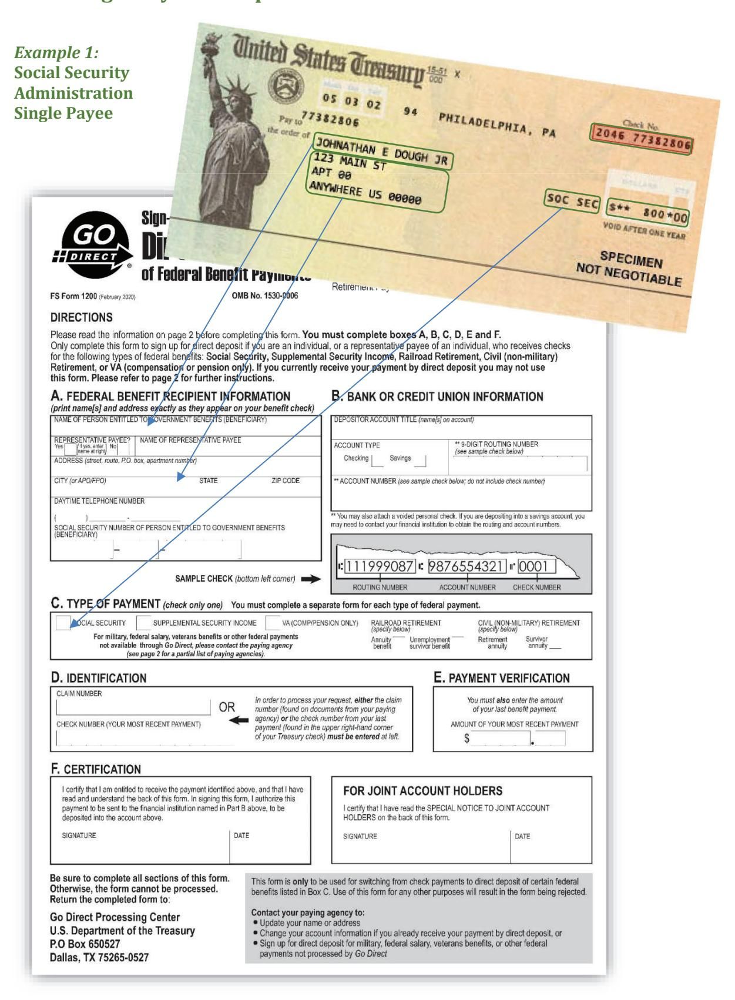
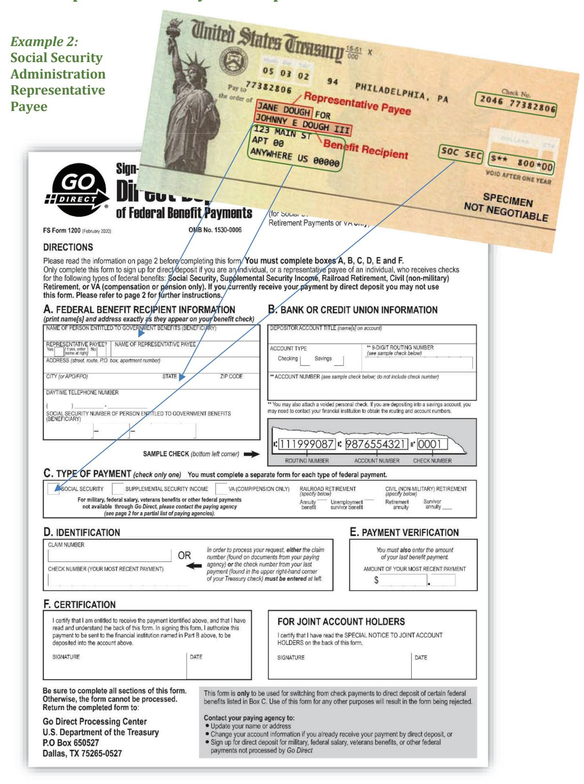

# **Enrollment for Federal Payments** 1

# **Overview**

Financial institutions can play a key role in assisting recipients of federal payments to enroll in Direct Deposit with their paying agency. This chapter is a guide to the various enrollment methods available for both consumer and corporate recipients.

There are several enrollment options:

- 1. Enroll customers in lobby, batch and submit ENR enrollments through ACH from the financial institution.
- 2. Financial institution can enroll on the Go Direct® website to enter enrollments for customers.
- 3. Financial institution can call the U.S. Treasury Electronic Payment Solution Center (EPSC) at 1-800-333-1795 for immediate enrollment of customers.
- 4. Enrollment using Bureau of the Fiscal Service (Fiscal Service) Direct Deposit Sign-Up Form FS Form 1200 for Social Security benefits or disability payments, Supplemental Security Income payments, Railroad Retirement Board annuities, and Office of Personnel Management (OPM) Civil Service annuities and Direct Deposit Sign Up Form FS Form 1199A for other federal payments, or the ACH Vendor/Miscellaneous Payment Enrollment Form SF 3881 for corporate vendor payments.

Errors in the Direct Deposit enrollment process are the primary cause of misdirected payments. Financial institutions will be held liable for providing incorrect enrollment information and should, therefore, carefully review all Direct Deposit enrollment procedures.

# **In this chapter…**

| A: Automated Enrollment (ENR) 1-4                                 |  |
|-------------------------------------------------------------------|--|
| Go Direct Online Enrollment Option for Financial Institutions 1-4 |  |
| Social Security Administration (SSA) Payment Cycling 1-4          |  |
| B: Simplified Enrollment 1-5                                      |  |
| Telephone Enrollment 1-5                                          |  |
| Paper Form Enrollment 1-5                                         |  |
| Enrollment Methods for Specific Payments 1-5                      |  |

| Allotments, Federal Salary, and Federal Employment Related Payments                          | 1-/  |
|----------------------------------------------------------------------------------------------|------|
| When Should Direct Deposit Begin Once It Has Been Initiated?                                 |      |
| IRS Tax Refunds                                                                              |      |
| Railroad Retirement Board                                                                    | 1-9  |
| Social Security Administration                                                               | 1-9  |
| Office of Personnel Management                                                               | 1-9  |
| TreasuryDirect (Bureau of the Fiscal Service)                                                | 1-10 |
| Simplified Enrollment for Series H/HH Savings Bond Interest Payments (Bureau of the Service) |      |
| Department of Veterans Affairs Direct Deposit                                                | 1-10 |
| C: Paper Enrollment Methods                                                                  | 1-11 |
| Fiscal Service Direct Deposit Sign-Up Form (FS Form 1200)                                    | 1-11 |
| Direct Deposit Sign-Up Form (FS Form 1200)                                                   | 1-11 |
| How to Complete the FS Form 1200                                                             |      |
| Federal Benefit Recipient Information                                                        | 1-12 |
| Bank or Credit Union Information                                                             | 1-12 |
| Type of Payment                                                                              | 1-12 |
| SSA – Single Payee Example                                                                   | 1-14 |
| SSA- Representative Payee Example                                                            | 1-15 |
| D: Direct Deposit Sign-Up Form (FS Form 1199A)                                               | 1-16 |
| How to Complete the FS Form 1199A                                                            | 1-16 |
| Section 1- To be completed by the payee                                                      | 1-16 |
| Name of the Person(s) Entitled to Payment (Box B)                                            | 1-16 |
| Claim or Payroll ID Number (Box C)                                                           | 1-16 |
| Claim/Payroll ID Table                                                                       | 1-17 |
| Depositor Account Number (Box E)                                                             | 1-17 |
| Type of Payment (Box F)                                                                      | 1-18 |
| Payee/Joint Payee Certification (Box F)                                                      | 1-18 |
| Joint Account Holders' Certification (Optional)                                              | 1-18 |
| When Using Witnesses                                                                         | 1-18 |
| Power-of-Attorney                                                                            | 1-18 |
| Section 2 - To Be Completed by the Payee or the Financial Institution                        | 1-18 |
| Section 3 - To Be Completed by the Financial Institution                                     | 1-19 |
| What Actions Should Take Place Before Filing the FS Form 1199A?                              |      |
| Important Information for New Direct Deposit Recipients                                      | 1-19 |
| How Are Forms Distributed?                                                                   | 1-20 |
| What to do if Direct Deposit does not begin                                                  | 1-20 |
| FS Form 1199A Example                                                                        |      |
| E: Federal Financial EDI (FEDI) Payments/Vendor Payments                                     |      |
| Overview                                                                                     |      |
| Delivery of Remittance (Addenda) Information                                                 | 1-22 |

Termination by the Financial Institution \_\_\_\_\_\_\_1-37
Recipient Notice to the Federal Agency \_\_\_\_\_\_\_1-37

# **A: Automated Enrollment (ENR)**

ENR is a convenient method for financial institutions to use the ACH network to transmit Direct Deposit enrollment information to federal agencies for benefit payments. An ENR entry is a nonmonetary entry sent through the ACH by any Receiving Depository Financial Institution (RDFI) to a federal government benefit agency participating in the ENR program.

ENR is the enrollment method preferred by participating federal benefit agencies. The ENR reduces errors in the enrollment process and may expedite delivery of Direct Deposit payments as compared to paper enrollment methods.

An ENR should be used when the recipient is requesting to initiate direct deposit for their federal benefits. This may include, but is not limited to a first-time sign-up for Direct Deposit, a change to an existing Direct Deposit enrollment (e.g. new bank account number) with the current financial institution, or a change from one financial institution to another new financial institution.

Enrollments received and accepted by the paying agency at least 10 business days prior to the benefit recipient's next scheduled payment date will generally allow the recipient's next month's payment by Direct Deposit.

To change financial institution data for an existing Direct Deposit enrollment within a financial institution where an authorization exists, a Standard Entry Code (COR) entry, commonly known as a Notification of Change (NOC), may be used. (Refer to Chapter 6 for more information on NOCs.)

### **Go Direct Online Enrollment Option for Financial Institutions**

In addition to the Automated ENR option, financial Institutions can also choose to take advantage of enrollment via the Go Direct website. The Go Direct campaign was a national marketing and public education campaign sponsored by the U.S. Department of the Treasury, Bureau of the Fiscal Service and the Federal Reserve System that increased the use of Direct Deposit for federal benefit check recipients. Although the Go Direct campaign has officially concluded, financial institutions can continue to utilize the enrollment website. Please review the Go Direct Reference Guide for Financial Institutions and Corporations for more details.

Enrollments submitted through the Go Direct enrollment site will be validated and submitted to the respective paying agencies by the Electronic Payment Solutions Center (EPSC). The U.S. Treasury EPSC is operated in a secure Federal Reserve site. Financial Institution customers whose enrollments cannot be verified or processed will be contacted by the U.S. Treasury Electronic Payment Solutions Center via letter delivered by USPS.

All reject or return item processing for these items is handled by the Operations and Research Division of the EPSC. Financial institutions electing to submit enrollments electronically through Go Direct are relieved of the obligation of processing ENR return items.

# **Social Security Administration (SSA) Payment Cycling**

The payment date for newly enrolled Social Security beneficiaries is either the second, third, or fourth Wednesday of the month. These additional payment days alleviate the workload peaks for SSA, Fiscal Service, and financial and business communities.

However, in instances where the beneficiary receives both Social Security benefit or disability payments and Supplemental Security Income (SSI) payments, the payments are issued on the standard 1st and 3rd schedule.

# **B: Simplified Enrollment**

There are a variety of ways for federal payment recipients to enroll for Direct Deposit without visiting a financial institution.

### **Telephone Enrollment**

Federal benefit recipients can be enrolled by calling the U.S. Treasury Electronic Payment Solution Center at 1-800-333-1795, by visiting the Go Direct website, or by completing Fiscal Service Direct Deposit Sign-Up Form FS Form 1200. The U.S. Treasury Electronic Payment Solution Center hours of operation are 8:00 a.m. - 8:00 p.m. Eastern Time (ET), Monday through Friday, excluding federal holidays.

Financial institution representatives can also assist their recipients who wish to enroll by phone. However, when doing so, the benefit recipient - or their representative - must be present when the phone call is made. U.S. Treasury Electronic Payment Solutions Center personnel will ask to speak to the recipient or their representative and obtain approval for the 3rd party banking representative to provide their enrollment information. Financial institutions that elect to capture enrollment information on paper or through other means and process after hours or in a backoffice environment may not use U.S. Treasury Electronic Payment Solutions Center telephone enrollment on behalf of their customer.

### **Paper Form Enrollment**

Recipients who elect to complete Fiscal Service paper Form FS 1200 should complete it on their own or with the assistance of a financial Institution representative for the Routing Transit Numbers (RTN) and account number and mail to:

U.S. Treasury Electronic Payment Solution Center P.O. Box 650527 Dallas, Texas 75265-0527

The table below shows the Simplified Enrollment procedures for specific payment types.

# **Enrollment Methods for Specific Payments**

| Payment Type                                                                 | Recipient                                                                                                                               |
|------------------------------------------------------------------------------|-----------------------------------------------------------------------------------------------------------------------------------------|
| Allotments                                                                   | Completes an approved form at their federal agency personnel                                                                            |
| Federal Salary                                                               | office (e.g., FS Form 2231, FastStart Direct Deposit). Some federal employees are able to make changes to Direct Deposit information |
| Federal Employment                                                           | via telephone using Employee Express.                                                                                                   |
| Related Payments (i.e., Travel Reimbursement, Uniform Allowance, etc.) | Recipients should contact their servicing personnel office for more information.                                                     |

| Payment Type                                                                                                                 | Recipient                                                                                                                                                                                                                                                                                                                                                                                                                                                                                                                                                                                   |
|------------------------------------------------------------------------------------------------------------------------------|---------------------------------------------------------------------------------------------------------------------------------------------------------------------------------------------------------------------------------------------------------------------------------------------------------------------------------------------------------------------------------------------------------------------------------------------------------------------------------------------------------------------------------------------------------------------------------------------|
| IRS Tax Refunds                                                                                                              | Completes the financial institution information section of the IRS Form 1040 during tax preparation.                                                                                                                                                                                                                                                                                                                                                                                                                                                                                     |
|                                                                                                                              | For paper filing completes a U.S. Individual Income Tax Declaration (IRS Form 8453). For electronic filing via IRS e-file completes an 8453-OL.                                                                                                                                                                                                                                                                                                                                                                                                                                       |
|                                                                                                                              | Recipients should contact the IRS at 1-800-829-1040 or visit www.irs.gov for more details.                                                                                                                                                                                                                                                                                                                                                                                                                                                                                            |
| Office of Personnel Management (OPM) Form Note: OPM does not allow ENR enrollments for representative payees. | Financial institutions can enroll their customers or recipients can enroll individually by calling the U.S. Treasury Electronic Payment Solution Center at 1-800- 333-1795 (English) / 1-800-333-1792 (Spanish), by visiting www.GoDirect.gov, or by completing FS Form 1200. The U.S. Treasury Electronic Payment Solution Center hours of operation are 8:00 am - 8:00 pm ET, Monday through Friday, excluding federal holidays.                                                                                                                                        |
|                                                                                                                              | Additionally, Financial Institutions and/or recipients can call OPM at 1-888-767-6738 or 202-606-0500 in the Washington, DC area or visit www.opm.gov/retire for details.                                                                                                                                                                                                                                                                                                                                                                                                          |
| Railroad Retirement Board (RRB)                                                                                           | Financial institutions can enroll their customers and/or recipients can enroll individually by calling 1-800- 333-1795 (English)/ 1- 800-333-1792 (Spanish), or by visiting www.GoDirect.gov, completing FS Form 1200. The U.S. Treasury Electronic Payment Solution Center hours of operation are 8:00 a.m 8:00 p.m. ET, Monday through Friday, excluding federal holidays. Additionally, financial institutions and/or recipients can contact RRB's toll-free telephone number at 1-877-772-5772.                                                                    |
| Social Security (SSA) and Supplemental Security Income (SSI)                                                           | Financial institutions can enroll their customers and/or recipients can enroll individually by calling the U.S. Treasury Electronic Payment Solution Center at 1-800- 333-1795 (English)/ 1-800- 333-1792 (Spanish), by visiting www.GoDirect.gov, or by completing FS Form 1200. The U.S. Treasury Electronic Payment Solution Center hours of operation are 8:00 a.m 8:00 p.m. ET, Monday through Friday, excluding federal holidays. Additionally, financial institutions and/or recipients can enroll by contacting the SSA at 1-800-SSA-1213 (1-800-772-1213). |

| Payment Type                                                                                                     | Recipient                                                                                                                                                                                                                                                                                                                                                                                                                                                                                                                                                      |
|------------------------------------------------------------------------------------------------------------------|----------------------------------------------------------------------------------------------------------------------------------------------------------------------------------------------------------------------------------------------------------------------------------------------------------------------------------------------------------------------------------------------------------------------------------------------------------------------------------------------------------------------------------------------------------------|
| Bureau of the Fiscal Service TreasuryDirect                                                                   | Recipient is automatically enrolled in the TreasuryDirect account for purchasing Treasury bills, notes, and bonds. Investors use Form PD F 5182, New Account Request, to establish a TreasuryDirect account and to provide Direct Deposit information. Investors use Form PD F 5178, Transaction Request, to change Direct Deposit information. Recipients should contact a designated TreasuryDirect Servicing Office or visit www.treasurydirect.gov for forms and other information.                                             |
| Vendor/Misc.                                                                                                     | The ACH Vendor/Miscellaneous Payment Enrollment Form (SF 3881) is an optional three-part form that federal agencies may use to enroll their vendors in the Financial Electronic Data Interchange (FEDI) program. Recipients should contact the federal agency they are providing goods or services to for more information.                                                                                                                                                                                                                     |
| Veterans Compensation and Pension Note: VA does not allow ENR enrollments for representative payees. | Financial institutions can enroll their customers and/or recipients can enroll individually by calling 1-800- 333-1795 (English)/ 1- 800-333-1792 (Spanish), or by visiting www.GoDirect.gov, or by completing FS Form 1200. The U.S. Treasury Electronic Payment Solution Center hours of operation are 8:00 a.m 8:00 p.m. ET, Monday through Friday, excluding federal holidays. Recipients can also contact the VA National Direct Deposit EFT line at 1-800-827-1000 or visit www.benefits.va.gov/benefits for further details. |
| Veterans Education Note: VA does not allow ENR enrollments for representative payees.                   | Enrolls at the same time recipient applies for benefits at the VA or at any time after recipient begins receiving benefits. Recipients already receiving benefits should contact the VA Education Direct Deposit EFT line at 1-888-442-4551.                                                                                                                                                                                                                                                                                                          |
| Veterans Life Insurance Note: VA does not allow ENR enrollments for representative payees.              | Enrolls at the same time recipient applies for benefits at the VA or at any time after recipient begins receiving benefits. Recipients should contact the VA Insurance office at 1-800-669- 8477 or visit www.insurance.va.gov for further details.                                                                                                                                                                                                                                                                                                |

### **Allotments, Federal Salary, and Federal Employment Related Payments**

Current federal employees can complete an approved form at their agency personnel office, or servicing pay office. This form may be a FS Form 1199A (Direct Deposit Sign Up), a FS Form 2231 (FastStart Direct Deposit Sign Up), or a similar form used by the employee's agency. The Direct Deposit payments may be for federal salaries, allotments, or for employment related payments for travel reimbursement or uniform allowance.

### **When Should Direct Deposit Begin Once It Has Been Initiated?**

Use the table below to determine when Direct Deposit should begin once the enrollment form is forwarded to the federal agency.

| IF the payment type is                                                     | THEN Direct Deposit should begin within |
|----------------------------------------------------------------------------|-----------------------------------------|
| Federal salary Military civilian pay Military active duty Allotments | 2-3 pay periods                         |
| Military retirement/annuity                                                | 60-90 days                              |

# **Details of Each Payment Type**

### **IRS Tax Refunds**

The Internal Revenue Service (IRS) offers the Direct Deposit of IRS Form 1040 tax refunds for both paper and electronically filed returns.

For IRS Form 1040 paper returns, taxpayers receiving refunds and electing Direct Deposit simply complete the financial institution information section of the form and mail the form to the IRS.

For electronically filed returns using an authorized IRS *e-file* provider, the taxpayer will complete a U.S. Individual Income Tax Declaration for Electronic Filing (IRS Form 8453) for refunds by Direct Deposit. This form authorizes the tax preparer to transmit the return and allows the choice of having the refund deposited into a checking or savings account.

Taxpayers preparing returns on a personal computer using commercial tax preparation software or the IRS Free Online Filing and transmitting the information via the internet to the IRS complete Form 8453-OL, U.S. Individual Income Tax Declaration for On-Line Filing. This form allows the taxpayer to choose Direct Deposit for the refund. The financial institution will not receive copies of these forms.

The financial institution should be aware of the following:

- 1. Enrollment in Direct Deposit for an income tax refund is not a permanent election by the taxpayer. Taxpayers must elect Direct Deposit each filing year.
- 2. Payments must be returned when they cannot be properly posted by the financial institution. NOCs cannot be used to correct any information. In the instance where a Direct Deposit IRS tax refund is unpostable and returned, taxpayers will receive a check in place of a Direct Deposit payment.
- 3. The financial institution's responsibility is to post the Direct Deposit payment to the account indicated on the ACH record. If the funds are posted to a valid account that turns out to be incorrect, the financial institution is not liable to the government for the return of the funds. If the taxpayer or the taxpayer's agent gave the incorrect account information, neither Fiscal Service nor the IRS will assist the taxpayer with recovering the funds. The taxpayer is free to pursue civil action. If, however, the IRS made the error, it will make the taxpayer whole.

For further information, contact the IRS at **1-800-829-1040**; contact the local IRS District Office, or visit www.irs.gov.

For IRS tax refund status, the recipient should go to www.irs.gov and select "Get Your Refund Status."

### **Railroad Retirement Board**

Financial institutions can enroll their customers and/or recipients can enroll individually by:

- 1. Calling the U.S. Treasury Electronic Payment Solution Center at **1-800-333-1795** (English)/**1- 800-333-1792** (Spanish), or by visiting the Go Direct website, or by completing FS Form 1200. The call center hours of operation are 8:00 a.m. - 8:00 p.m. ET, Monday through Friday, excluding federal holidays, or
- 2. Calling the Railroad Retirement Board at **1-877-772-5772**, or
- 3. Sending a written request to enroll in Direct Deposit to the local Railroad Retirement Board field office. The letter should include the recipient's name and the following:
  - A: Account Number,
  - B: Account type (checking or savings), and
  - C: RTN of the financial institution.

### **Social Security Administration**

Financial institutions can enroll their customers and/or recipients can enroll individually by calling the U.S. Treasury Electronic Payment Solution Center at **1-800- 333-1795** (English)/ **1-800-333- 1792** (Spanish), or by visiting the Go Direct website, or by completing FS Form 1200. The U.S. Treasury Electronic Payment Solution Center hours of operation are 8:00 a.m. - 8:00 p.m. ET, Monday through Friday, excluding federal holidays.

The financial institution may make the call on behalf of the recipient and may provide the enrollment information; however, SSA will request to speak to the recipient to verify their identity.

Recipients who already are receiving Social Security and SSI benefits by check may also enroll in Direct Deposit by calling **1-800-SSA-1213** (**1-800-772-1213**).

SSA's toll-free telephone service is available from 7:00 a.m. to 7:00 p.m. ET, Monday through Friday. Due to the high volume of calls, the best times to telephone are in the early morning and during the latter parts of the week and month.

# **Office of Personnel Management**

Financial institutions can enroll their customers or recipients can enroll individually by calling the U.S. Treasury Electronic Payment Solution Center **at 1-800- 333-1795** (English)/ **1-800-333-1792**  (Spanish), by visiting the Go Direct website, or by completing FS Form 1200. The U.S. Treasury Electronic Payment Solution Center hours of operation are 8:00 a.m. - 8:00 p.m. ET, Monday through Friday, excluding federal holidays.

Additionally, new retirees, annuitants, and survivor annuitants may enroll in Direct Deposit by calling the toll-free customer service number at **1-888-767-6378**. Those in the Washington, DC area are encouraged to call **202-606-0500**. Recipients may also visit www.opm.gov/retire for instructions on how to change their payment address on-line.

**Note:** *The Office of Personnel Management does not allow ENR enrollments for representative payees.* 

### **TreasuryDirect (Bureau of the Fiscal Service)**

TreasuryDirect is a book-entry securities system in which investors' accounts of book-entry Treasury marketable securities are maintained. TreasuryDirect is designed for investors who purchase Treasury securities and intend to hold them until maturity. Investors can establish a TreasuryDirect account and hold all their bills, notes, and bonds in one TreasuryDirect account showing the same ownership for all their securities, or they can establish multiple accounts reflecting different ownership. Investors will receive a TreasuryDirect Statement of Account when they open a new account, when changes are made to the account, upon request, or if they have not received one during the calendar year.

TreasuryDirect principal and interest payments are made electronically by Direct Deposit to a checking or savings account at a financial institution designated by the investor. When establishing a TreasuryDirect account, investors will complete Form PDF 5182, New Account Request, and will include Direct Deposit information. Investors are not required to fill out an FS Form 1199A. Investors can also establish an account when they complete Form PDF 5381, Treasury Bill, Note & Bond Tender to purchase a security. Investors use Form PDF 5178, Transaction Request, to change Direct Deposit information for the TreasuryDirect account. Financial institutions may be asked by customers to furnish the account number, routing transit number, account type, and/or the financial institution's name. The investor should contact a designated TreasuryDirect Servicing Office or visit the TreasuryDirect website for forms and other information.

### **Simplified Enrollment for Series H/HH Savings Bond Interest Payments (Bureau of the Fiscal Service)**

Series H/HH savings bonds are current income securities that pay interest semiannually. Interest on bonds issued since October 1989 to the present must be paid by Direct Deposit. Unless a recipient claims that it will cause a hardship, interest on bonds issued prior to October 1989 must also be paid by Direct Deposit.

To enroll in Direct Deposit or to change their enrollment, recipients may:

1. Download PDF 5396 from the TreasuryDirect website, complete and mail the form as instructed, or

Send a letter to the Treasury Retail Securities Services, P.O. Box 9150, Minneapolis, MN 55480-9150. The letter should include the following:

- A. Recipient's name,
- B. Social Security number,
- C. Account number,
- D. Account type (checking or savings), and
- E. RTN number of the financial institution.

# **Department of Veterans Affairs Direct Deposit**

Veterans Compensation and Pension, and Vocational Rehabilitation and Employment recipients already receiving benefits may enroll in Direct Deposit by calling **1-800-827-1000**. Compensation

and Pension Beneficiaries may also enroll in Direct Deposit through VA's eBenefits self-service portal (www.ebenefits.va.gov/ebenefits).

VA Education recipients already receiving benefits may enroll in Direct Deposit by calling **1-888- 442-4551**.

New VA benefits recipients should provide Direct Deposit information at the time of application.

Recipients of VA benefits may also enroll by submitting VA Form 24-0296 (Direct Deposit Enrollment) and mailing it to the Station of Jurisdiction over the claim. To locate the Station of Jurisdiction over the claim, visit http://www.benefits.va.gov/benefits/offices.asp.

Veterans Life Insurance recipients may enroll in Direct Deposit by calling **1-800-669-8477**. A Direct Deposit enrollment form and further details are also available by visiting www.insurance.va.gov or by writing to:

> VAROIC – DD P.O. Box 7208 Philadelphia, PA 19101-7208

New recipients should provide Direct Deposit information at the time of application.

**Note:** *The Department of Veterans Affairs does not allow ENR enrollments for representative payees.* 

# **C: Paper Enrollment Methods**

### **Fiscal Service Direct Deposit Sign-Up Form (FS Form 1200)**

The table below identifies those agencies and payment types where the FS Form 1200 is the proper form to use, in situations when a paper enrollment is needed:

| Agency I Payment Type                       | Recipient                                                                          |
|---------------------------------------------|------------------------------------------------------------------------------------|
| Social Security Administration and          |                                                                                    |
| x Social Security                        |                                                                                    |
| x Supplemental Security Income           | Recipients should complete Fiscal Service FS Form 1200. Send completed form to: |
| Office of Personnel Management and          |                                                                                    |
| x Annuity                                |                                                                                    |
| x Retirement Annuity or Survivor Annuity | U.S. Treasury Electronic Payment Solution Center P.O. Box 650527                |
| Railroad Retirement Board and               | Dallas, TX 75265-0527                                                              |
| x Railroad Retirement Annuity Benefit    |                                                                                    |
| x Railroad Retirement                    |                                                                                    |
| Unemployment/Sickness                       |                                                                                    |

# **Direct Deposit Sign-Up Form (FS Form 1200)**

The Direct Deposit Sign-Up Form (FS Form 1200) is available in Chapter 9, *Forms.* 

### **How to Complete the FS Form 1200**

Payee must complete boxes A, B, C, D, E, and F.

Clearly print all information. Provide name(s) and address exactly as they appear on the federal benefit recipient's benefit check.

### **Federal Benefit Recipient Information**

Name of person entitled to government benefits (beneficiary).

If there is more than one person named on the check, such as a parent and a minor child, this will be the name of the minor child.

*Representative Payee? Check appropriate box Yes or No.* 

If yes, enter Name of Representative Payee.

*A representative payee is a person or institution that is legally entitled to receive payments on behalf of a beneficiary who has been deemed incapable of handing their own financial affairs. When a representative payee is present, both names will appear on the benefit check. Minor children receiving federal benefits should always have a representative payee. An example of a representative check payee is Mary Smith for Jane R. Doe.* 

Provide name(s) and address exactly as they appear on the most recent benefit check.

Social Security Number (SSN) of persons entitled to government benefits (beneficiary). *If the benefits are for a minor child, this will be the child's SSN. This is never the representative payee's SSN.* 

Daytime Telephone Number of the person to contact if there are questions regarding the enrollment information provided on the form.

### **Bank or Credit Union Information**

Depositor's account title must include the name of the person authorized to receive the payment, (e.g. representative payee if applicable), and an account type (either Checking or Savings).

The 9-digit routing number is a 9-digit number used to denote which financial institution will receive the deposit.

Account Numbers may be up to 17 characters long. It may contain both numeric 0-9 and alphabetic characters A to Z.

### **Type of Payment** (check only one box)

The appropriate box should be checked. Refer to the examples that follow to determine how to identify the appropriate payment type

**Note:** *You must use a separate form for each payment type or individual that is being enrolled.* 

For payment types not listed on the FS Form 1200 please refer to the next section, Direct Deposit Sign-up Form (FS Form 1199A) for instruction on submitting enrollments for other payment types.

Either a claim number or check number is required.

*Claim number is an identifying number assigned by the paying agency to the benefit recipient. In many cases, this is the SSN the benefits are drawn upon followed by a series of letters or letters and numbers. For some agencies this may be a unique number that does not use the SSN. Claim numbers can typically be found on award letters issued by the paying agency, correspondence sent by the agency, or year-end tax statements.* 

Check number is the 12-digit check number of the recipient's most recent benefit payment.

*The check number is located in the upper right-hand corner of the check. It is formatted as 4-digits a space and then 8-digits. (example: 2053 87654321)* 

Dollar amount of most recent benefit payment is required.

#### *When Using Witnesses*

When witnesses are used, they should sign to the right of the mark "X" and print the word "Witness" above their signature.

#### *Power-of-Attorney*

A person appointed as a power-of-attorney cannot sign the FS Form 1200 for the payee. The FS Form 1200 can only be signed by the designated recipient or a representative payee. Questions regarding this item should be directed to the appropriate federal agency.

| Agency I Payment Type                                             | Recipient                                                                                                                                                                                                                      |
|-------------------------------------------------------------------|--------------------------------------------------------------------------------------------------------------------------------------------------------------------------------------------------------------------------------|
| Federal Housing Administration Debentures (Fiscal Service)     | The Federal Housing Administration (FHA) issues these debentures in settlement of defaulted mortgages. For more information, recipients should contact Housing and Urban Development at (202) 708- 3423, or write to: |
|                                                                   | HUD 451 7th Street, SW Washington, DC 20410 Attn: multi-family or single-family claims                                                                                                                                |
| Series H/HH Savings Bond Interest Payments (Fiscal Service) | Completes PD F 5396. Recipients should visit the TreasuryDirect website to download the form or contact:                                                                                                                    |
|                                                                   | Bureau of the Fiscal Service                                                                                                                                                                                                   |
|                                                                   | Treasury Retail Securities Services P.O. Box 9150                                                                                                                                                                           |
|                                                                   | Minneapolis, MN 55480-9150                                                                                                                                                                                                     |
|                                                                   |                                                                                                                                                                                                                                |
|                                                                   |                                                                                                                                                                                                                                |
|                                                                   |                                                                                                                                                                                                                                |
|                                                                   |                                                                                                                                                                                                                                |

**Note:** *Only send completed FS Form 1199A forms to the federal agency responsible for issuing the payment. The* U.S. Treasury Electronic Payment Solution Center *is unable to process the FS Form 1199A form and will be forced to reject them.* 

### **SSA – Single Payee Example**

### **SSA– Representative Payee Example**

# **D: Direct Deposit Sign-Up Form (FS Form 1199A)**

A Direct Deposit Sign-Up Form (FS Form 1199A) is available in Chapter 9, *Forms*.

### **How to Complete the FS Form 1199A**

### **Section 1- To be completed by the payee**

The financial institution should verify that all information on this portion of the form is correct.

The financial institution needs to be aware of the following special items:

#### *Name of the Person(s) Entitled to Payment (Box B)*

This will be the name of the payee. Refer to the appropriate federal agency examples to determine what information to enter for recurring benefit payments.

#### *Claim or Payroll ID Number (Box C)*

Claim numbers may be found on documents provided by the recipient's paying agency(s) such as: award letters, yearly tax statements, or general correspondence.

#### *Claim Number Prefix*

A claim number prefix is one or more letters preceding the claim number. These characters indicate the type of claim for which benefits are being paid. For an explanation of the meaning of a prefix, contact the federal agency authorizing the payment.

#### *Claim Number*

A claim number identifies the recipient's records at the federal agency that authorizes the payment.

#### *Claim Number Suffix*

A claim number suffix is one or more characters (letters or numbers) following a claim number. These characters indicate the payment type or the payee's relationship to the individual who the benefits are being drawn. For a full explanation of a suffix, contact the federal agency authorizing the payment.

#### **Example:**

**VA Compensation, Pension and Education. .123-45-6789 00** 

### *Claim/Payroll ID Table*

The table below highlights what to enter on the FS Form 1199A for the Claim or Payroll ID Number (BOX C) for the various payment types.

| Payment Type                                                           | Prefix         | Claim Number                                                              | Suffix                                    |
|------------------------------------------------------------------------|----------------|---------------------------------------------------------------------------|-------------------------------------------|
| Allotments (Savings and Discretionary)                              | Leave Blank    | SSN or Payroll ID Number                                                  | Leave Blank                               |
| Black Lung (Department of Labor)                                    | Leave Blank    | SSN                                                                       | 2 characters following the SSN         |
| Central Intelligence Agency /Annuity                                | Leave Blank    | SSN                                                                       | Leave Blank                               |
| Federal Employee Workers' Compensation                              | Leave Blank    | Case number assigned by the federal agency                             | Leave Blank                               |
| (Department of Labor)                                                  |                |                                                                           |                                           |
| Federal Salary/Military Civilian Pay                                | Leave Blank    | SSN or Payroll ID Number                                                  | Leave Blank                               |
| Longshore and Harbor Workers' Compensation (Department of Labor) | Leave Blank    | File number assigned by the federal agency                             | Leave Blank                               |
| Military Active Duty and Allotments                                 | Leave Blank    | SSN                                                                       | Leave Blank                               |
| Military Retirement and Annuity                                     | Leave Blank    | SSN                                                                       | Leave Blank                               |
| Miner's Benefit (Department of Labor)                               | Leave Blank    | SSN                                                                       | Leave Blank                               |
| Savings Bond Agency's Fee (Fiscal Service)                          | Leave Blank    | Issuing or paying agency code assigned to the financial institution | 1- or 2-digit number following the SSN |
| Series H/HH Savings Bond Interest Payments (Fiscal Service)      | Leave Blank    | SSN                                                                       | Leave Blank                               |
| Veterans Compensation, Pension or Education                         | Leave Blank    | 8-digit or 9-digit SSN                                                    | Always a 2-digit number                |
| Veterans Life Insurance                                                | 1 to 2 letters | 4- to 8-digit number                                                      | None or a 2-digit number               |

#### *Depositor Account Number (Box E)*

- x If account numbers are not used, then insert name or other identification in the box.
- x Use only letters A-Z and digits 0-9
- x Up to 17 characters

### *Type of Payment (Box F)*

The appropriate box should be checked

If payment type is not included in the list, then check "Other" and enter the payment type in the blank.

For military payments, enter the name of the military branch in the blank next to the payment type checked.

#### *Payee/Joint Payee Certification (Box F)*

| IF                                                               | THEN                                                               |
|------------------------------------------------------------------|--------------------------------------------------------------------|
| there is only one payee, who could be a representative payee* | only the payee signature is required                               |
| joint payees complete the form                                   | both must sign the form                                            |
| the payee's signature is made be a mark "X"                      | it must be witnessed by two persons who sign and date the form. |

*\* See Glossary, Chapter 8* 

#### *Joint Account Holders' Certification (Optional)*

Federal agencies do not require signatures in this block; however, some financial institutions do.

If the signature is made by a mark "X", it must be witnessed by two persons who sign and date the form.

#### *When Using Witnesses*

When witnesses are used, they should sign to the right of the mark "X" and print the word "Witness" above their signature.

#### *Power-of-Attorney*

A person appointed as a power-of-attorney by the court cannot sign the FS Form 1199A for the payee. The FS Form 1199A can only be signed by the designated recipient or a representative payee. Questions regarding this item should be directed to the appropriate federal agency.

### **Section 2 - To Be Completed by the Payee or the Financial Institution**

The financial institution should verify that the name and address of the federal agency that authorized the payment is used.

For a listing of addresses, refer to Chapter 7, *Contacts*.

**Note:** *Do not send enrollment forms to Fiscal Service. Fiscal Service does not process enrollment forms except for its own employees.* 

### **Section 3 - To Be Completed by the Financial Institution**

#### ENTER the...

- financial institution's name and address
- financial institution's routing number
- depositor's account title
- (this title must include the name of the person authorized to receive the payment) • financial institution representative's name, signature, telephone number, and current date.

### **What Actions Should Take Place Before Filing the FS Form 1199A?**

This checklist can be used to verify that all information entered on the enrollment form is complete and accurate.

| ެ | Name of person(s) entitled to payment*                                                                     |
|---|------------------------------------------------------------------------------------------------------------|
| ެ | Claim or payroll ID table*                                                                                 |
| ެ | Type of depositor account                                                                                  |
| ެ | Account number                                                                                             |
| ެ | Type of payment                                                                                            |
| ެ | Proper signatures                                                                                          |
| ެ | Federal agency name and address*                                                                           |
| ެ | Name and address of financial institution                                                                  |
| ެ | RTN and check digit                                                                                        |
| ެ | Depositor account title* Make sure it includes the name of the person authorized to receive the payment |

**Note:** *Make sure the federal agency that authorizes the payment is entered, not the Fiscal Service.* 

**Note:** *Items marked with an asterisk (\*) are where most errors occur.* 

### **Important Information for New Direct Deposit Recipients**

- 1. The financial institution should inform the recipient that they will continue to receive checks or deposits at their current payment address of record until the Direct Deposit enrollment is processed.
- 2. The financial institution should inform the recipient on how to verify receipt of a Direct Deposit payment.
- 3. The financial institution should inform the recipient to notify the federal agency of any address changes after Direct Deposit begins, since important information about the payment will be sent to the individual's home address.
- 4. The financial institution should inform the recipient that it is important to notify both the federal agency and the financial institution if the recipient or beneficiary dies or becomes legally incapacitated. (Legal Incapacity is defined as a legal declaration that an individual is unable to manage his/her affairs properly)

5. The financial institution should inform the recipient that if they change financial institutions, the old account should not be closed until Direct Deposit begins into the new account. Make sure the recipient understands that changing financial institutions requires filling out a new Direct Deposit enrollment.

### **How Are Forms Distributed?**

#### **Government Agency Copy**

*Delivered by the employee to the federal agency that authorizes the payment.* 

#### **Financial Institution Copy**

*Held by the financial institution* 

There is no official retention period for the FS Form 1199A. It is recommended that financial institutions retain this form at least until receipt of the first payment.

#### **Payee(s) Copy**

*Held by the recipient.* 

### **What to do if Direct Deposit does not begin**

Follow these steps if Direct Deposit does not begin within the specified time period.

- **1** Ask recipient if the enrollment authorization has been revoked.
  - If yes, no further action is required.
  - If no, and Direct Deposit is still desired, go to Step 2.
- **2** Make a copy of the completed enrollment form from the financial institution's file copy. **Note:** *Verify that all the information on the form is correct.*
- **3** Send a copy of the form and a letter stating that the recipient still wants to receive Direct Deposit to the federal agency that authorizes the payment.
- **4** Remind recipient(s) that checks will continue to be sent to their home address of record until Direct Deposit begins.

### **FS Form 1199A Example**

*Example 1:*  **Social Security Administration Single Payee**

# **E: Federal Financial EDI (FEDI) Payments/Vendor Payments**

### **Overview**

Federal payments made using Financial Electronic Data Interchange (FEDI), the electronic transfer of funds and payment-related information. The federal government uses FEDI for payments it makes to businesses, which provide goods and services to federal agencies, and other payment recipients.

Provisions of the Debt Collection Improvement Act of 1996 require that the majority of federal payments be made by Electronic Funds Transfer (EFT). These payments include corporate payments to companies providing goods or services to the federal government. This requirement impacts every federal government vendor regardless of the size of the company or the goods or services provided.

The federal government currently uses the two Nacha corporate payment formats for vendor payments. These formats are:

- **CCD+** for single invoice payments. Contains one optional 80-character addenda record for transmitting the invoice information.
- **CTX** for single or multiple payments. Allows for 9,999 optional addends records, each carrying 80-characters, for the consolidation of multiple invoices in one payment.

### **Delivery of Remittance (Addenda) Information**

The Nacha Operating Rules & Guidelines address the delivery of remittance information contained in the addenda record. At the recipient's request, financial institutions must provide the remittance information by the opening of business on the second banking day following the settlement date of the entry. This impacts all financial institutions processing ACH payments. The remittance information may be provided via a paper report, fax, e-mail, electronic transmission, or any other means negotiated between the recipient and the financial institution.

To perform this key role, it is imperative that the financial institution work closely with its corporate customers who may have business relationships with the federal government. The following issues should be discussed with your corporate customers:

- x How to deliver the remittance information to the customer,
- x When to deliver the remittance information to the customer,
- x What specific information to provide to the customer, and
- x What fees, if any, are associated with this service.

### **Enrollment**

The ACH Vendor/Miscellaneous Payment Enrollment Form (SF 3881) is an optional three-part form that federal agencies may use to enroll their vendors in the FEDI program. Federal agencies will stock the form and provide the form to vendors to initiate the enrollment process. Federal agencies will discuss with the vendor the ACH payment format (CCD+ or CTX) to be used to transmit the payment. They will also work with the vendor to determine the remittance information (e.g., the invoice number, discount terms) to be included in the addenda record.

The ACH Vendor/Miscellaneous Payment Enrollment Form (SF 3881) is available in Chapter 9, *Forms*.

### **Enrollment Checklist**

Use this checklist to assist the financial institution in enrolling a vendor in the FEDI program.

| ެ | Verify that the ACH format selected in the Agency Information section on the SF 3881 can be accepted and processed by the financial institution Agree on HOW and WHEN remittance information (e.g., invoice number) provided by the federal agency in the addenda record will be passed to the vendor once it is received by the financial institution. |
|---|------------------------------------------------------------------------------------------------------------------------------------------------------------------------------------------------------------------------------------------------------------------------------------------------------------------------------------------------------------------|
|   | Note: The agreement is reached by analyzing recipient requirements and comparing those requirements against the level of support the institution can provide.                                                                                                                                                                                                 |
| ެ | Provide an example of how the addenda information will appear; or, Explain what type(s) of information to look for when the addenda information is received.                                                                                                                                                                                                  |
|   | Note: The vendor must be able to understand the information to properly identify the payment.                                                                                                                                                                                                                                                                 |
| ެ | Complete the financial institution Information section of the SF 3881.                                                                                                                                                                                                                                                                                           |

### **How to Complete the SF 3881**

#### *Agency Information*

The Agency Information section of the form is completed by the federal agency.

#### *Payee/Company Information*

The Payee/Company Information of the form is completed by the vendor or the financial institution.

#### *Financial Institution Information*

The Financial Institution Information section of the form can be completed by the financial institution as follows:

- the name and address of the financial institution,
- the name and telephone number of the ACH contact,
- the RTN used to receive ACH payments,
- the depositor account title,
- the depositor account number, lockbox number (if applicable),
- an "X" in the appropriate type of account box, and
- the signature, title, and telephone number of the financial institution representative.

### *Form Distribution*

**The vendor will return the original SF 3881 to the federal agency.** The financial institution and the vendor each keep one copy of the form.

### **Pointers for Completing the SF 3881 Form**

### Additional Pointers:

- x The federal agency initiates the SF 3881 form to enroll its vendors to receive payment by electronic funds transfer (EFT),
- x A vendor must complete a separate enrollment form (SF 3881) for each agency with which it does business,
- x In the Agency Information Section, the term "AGENCY IDENTIFIER" means the acronym by which the agency is known. For example, the "AGENCY IDENTIFIER" for the Bureau of the Fiscal Service is Fiscal Service,
- x In the Payee/Company Information Section, it should be noted that the "TAXPAYER ID NO." may be used by the government to collect and report on any delinquent amounts arising out of the offeror's relationship with the government (31 U.S.C. 7701(c)(3)),
- x The financial institution and the vendor should each keep a copy of the completed form, and
- x The vendor should return the completed SF 3881 to the agency that initiated the form.

# **F: Enrollment Guidance**

*This section of the Green Book is a helpful tool for financial institutions who are trying to understand the differences between the Nacha Operating Rules and the rules specifically for federal government payments. Use this guidance in conjunction with the ACH Standard Entry Class Code ENR to enroll recipients of federal benefit payments for Direct Deposit. It can be used to for the following payments: Social Security; SSI; Veterans compensation and pension, education MGIB, education/selected reserve, life insurance and vocational rehabilitation and employment benefits; Civil Service retirement and survivor annuity; Railroad Retirement annuity and unemployment/sickness.* 

The ACH Standard Entry Class Code ENR is an enrollment process that allows financial institutions to use the ACH to enroll beneficiaries for the receipt of future Direct Deposit payments. Enrollments received and accepted by the paying agency at least 10 business days prior to the customer's next scheduled payment date will generally allow the recipient's next month's payment by Direct Deposit.

The ENR Standard Entry Class is a non-monetary transaction. It must contain at least one addendum record and may contain as many as 9,999 addenda records. There are two conditions that must exist for multiple addenda to be included with one ENR.

- 1. All Direct Deposit enrollments must be for the same federal agency benefit program. For example, enrollments for Veterans benefits cannot be combined with Social Security benefits.
- 2. Third-party processors that transmit ENR entries on behalf of financial institutions must make a discrete batch transmission for each financial institution. Addenda records pertaining to one financial institution should not be included under the same ENR entry as addenda records pertaining to another financial institution's Direct Deposit enrollments.

An ENR should be used when the recipient is requesting to initiate Direct Deposit for their federal benefits. This may include but is not limited to a first-time sign-up for Direct Deposit, a change to an existing Direct Deposit enrollment, or a change to a new financial institution. It is not to be used in place of the Notification of Change (NOC) process to change the routing or account numbers for existing records. Financial institutions should remind customers of the importance of reporting address changes to the benefit program agency.

**Approved OMB No. 0960-0564** 

# **Required Enrollment Information**

The following information is required for the enrollment of a recipient in Direct Deposit using the Standard Entry Class Code ENR. This information will be transmitted in the entry detail and the addenda record of an ENR transaction. This page may be duplicated and used for data collection. DO NOT mail this sheet to the agency. All information collected must refer to the individual who receives the federal benefit payment.

| Information obtained from the customer (payment recipient) for inclusion in the entry detail record.                                                                                                                                                                                                                                                                                                            |                                                                                                                                                                                                                                                                                         |     |                                |     |                                                 |
|-----------------------------------------------------------------------------------------------------------------------------------------------------------------------------------------------------------------------------------------------------------------------------------------------------------------------------------------------------------------------------------------------------------------|-----------------------------------------------------------------------------------------------------------------------------------------------------------------------------------------------------------------------------------------------------------------------------------------|-----|--------------------------------|-----|-------------------------------------------------|
| Type of payment:                                                                                                                                                                                                                                                                                                                                                                                                |                                                                                                                                                                                                                                                                                         |     |                                |     |                                                 |
|                                                                                                                                                                                                                                                                                                                                                                                                                 | (Social Security; SSI; Veterans compensation and pension, education MGIB, education/selected reserve, life insurance and vocational rehabilitation and employment benefits; Civil Service retirement and survivor annuity; Railroad Retirement annuity and unemployment/sickness) |     |                                |     |                                                 |
| Information obtained from the customer regarding the payment recipient for inclusion in the Addenda record.                                                                                                                                                                                                                                                                                                     |                                                                                                                                                                                                                                                                                         |     |                                |     |                                                 |
| Benefit Recipient's Social Security Number (SSN)                                                                                                                                                                                                                                                                                                                                                                |                                                                                                                                                                                                                                                                                         |     | SSN                            |     |                                                 |
|                                                                                                                                                                                                                                                                                                                                                                                                                 |                                                                                                                                                                                                                                                                                         |     |                                |     | (Do not include hyphens in the addenda record.) |
| The recipient's own SSN may or may not be the SSN on which the benefits are drawn. However, the individual recipient's SSN will always be included on the addenda record. In cases such as minor children the SSN will always be the Child's SSN and not that of the adult account holder named on the financial institution's records.                                                                   |                                                                                                                                                                                                                                                                                         |     |                                |     |                                                 |
| Benefit Recipient's Name                                                                                                                                                                                                                                                                                                                                                                                        |                                                                                                                                                                                                                                                                                         |     |                                |     |                                                 |
|                                                                                                                                                                                                                                                                                                                                                                                                                 |                                                                                                                                                                                                                                                                                         |     |                                |     |                                                 |
| Last name (up to 15 positions)                                                                                                                                                                                                                                                                                                                                                                                  |                                                                                                                                                                                                                                                                                         |     | First Name (up to 7 positions) |     |                                                 |
| Last name: This is the recipient's last name excluding any suffixes such as Jr., Sr. II, III, etc. If the last name is hyphenated, the fully hyphenated name up to 17 characters is submitted.                                                                                                                                                                                                               |                                                                                                                                                                                                                                                                                         |     |                                |     |                                                 |
| If the last name is comprised of two or more 'parts', generally, the first part is sent as the last name (i.e. Mary Jane S Public Doe). The last name would be submitted as "PUBLIC" and the Doe would be excluded.                                                                                                                                                                                          |                                                                                                                                                                                                                                                                                         |     |                                |     |                                                 |
| First name: This is the recipient's first name excluding any prefixes such as Dr., Mrs., Miss, etc.                                                                                                                                                                                                                                                                                                             |                                                                                                                                                                                                                                                                                         |     |                                |     |                                                 |
| Middle initials are not submitted in this field. Middle initials are dropped. However, fully spelled out middle names are included as part of the first name (i.e. Mary J Doe would be submitted as Mary, whereas, Mary Jane Doe would be submitted as Mary Jane.                                                                                                                                            |                                                                                                                                                                                                                                                                                         |     |                                |     |                                                 |
| The 'parsed' name will always be submitted exactly as the parsed section appears on the recipient's benefit check. Therefore, incorrectly spelled or spaced items will be submitted as they appear on the check and not as they should be legally spelled. Example: Janie Ann Doe is trying to enroll; however, her check is printed Jane E A Doe. The enrollment would be submitted as "Jane" and "Doe". |                                                                                                                                                                                                                                                                                         |     |                                |     |                                                 |
| Representative Payee indication (See section on Representative Payee, page 1-33.)                                                                                                                                                                                                                                                                                                                            |                                                                                                                                                                                                                                                                                         | NO  | (0)(Zero)                      | Yes | (1)                                             |
| Information obtained at the financial institution.                                                                                                                                                                                                                                                                                                                                                              |                                                                                                                                                                                                                                                                                         |     |                                |     |                                                 |
| Depository Financial Institution routing number                                                                                                                                                                                                                                                                                                                                                                 |                                                                                                                                                                                                                                                                                         | RTN |                                |     | Check Digit                                     |
| Depositor Account Number                                                                                                                                                                                                                                                                                                                                                                                        |                                                                                                                                                                                                                                                                                         |     |  (Up to 17 positions)       |     |                                                 |
| Transaction Type:                                                                                                                                                                                                                                                                                                                                                                                               | Checking (Type Code 22)                                                                                                                                                                                                                                                                 |     | Savings (Type Code 32)         |     |                                                 |
| For questions about submitting                                                                                                                                                                                                                                                                                                                                                                                  | Federal Agency                                                                                                                                                                                                                                                                          |     |                                |     | Telephone No.                                   |
| ENRs for a specific benefit payment, please call the corresponding federal program agency:                                                                                                                                                                                                                                                                                                                | Social Security Administration (for Social Security benefit or disability and SSI payments)                                                                                                                                                                                          |     |                                |     | (215) 597-1134                                  |
|                                                                                                                                                                                                                                                                                                                                                                                                                 | Office of Personnel Management (Civil Service annuity)                                                                                                                                                                                                                                  |     | (202) 606-0540                 |     |                                                 |

Railroad Retirement Board (RRB annuity) (312) 751-4704 Department of Veterans Affairs (VA benefits) (918) 687-2532

# ENR (Automated Enrollment) Entry Detail Record

| Field                             | 1                   | 2                   | 3                               | 4           | 5                     | 6           | 7                        | 8                            | 9                               | 10         | 11                    | 12        | 13        |
|-----------------------------------|---------------------|---------------------|---------------------------------|-------------|-----------------------|-------------|--------------------------|------------------------------|---------------------------------|------------|-----------------------|-----------|-----------|
| Data Element Name           | Record Type Code | Transaction Code | Receiving DFI Identification | Check Digit | DFI Account Number | Amount      | Identification Number | No. of Addenda Records | Receiving Company Name/ID | Reserved   | Discretionary Data |           |           |
| Field Incursion Requirement | М                   | М                   | М                               | М           | R                     | М           | 0                        | М                            | R                               | N/A        | 0                     | М         | М         |
| Contents                          | '6'                 | (numeric)*          | (TTTTAAAA)                      | (numeric)   | (blanks)**            | (all zeros) | (blanks)                 | (numeric)                    | (alphanumeric)                  | (blanks)** | (blanks)**            | (numeric) | (numeric) |
| Length                            | 1                   | 2                   | 8                               | 1           | 17                    | 10          | 15                       | 4                            | 16                              | 2          | 2                     | 1         | 15        |
| Position                          | 01-01               | 02-03               | 04-11                           | 12-12       | 13-29                 | 30-39       | 40-54                    | 55-58                        | 59-74                           | 76-78      | 77-78                 | 79-79     | 80-94     |

| *For U.S. Government use either 23 or 33 in Field 2 **Depe blank for Alphanumeric fields 5, 7,7051 |                                                                                   |                                                                |                                                                                                               |  |  |  |  |  |
|----------------------------------------------------------------------------------------------------|-----------------------------------------------------------------------------------|----------------------------------------------------------------|---------------------------------------------------------------------------------------------------------------|--|--|--|--|--|
| Program Payment                                                                                    | Field 3 Receiving DFI Routing and Transit Number (RTN)                            | Field 4 Check Digit (9 th digit of DFI RTN)         | Field 9 Receiving Company Name/ID                                                                          |  |  |  |  |  |
| The following program payments are eligible for the enrollment service                             | Use the following DFI Identification number for the corresponding program payment | Use the following number for the corresponding program payment | Use the following codes for the corresponding program for which the recipient is enrolling for Direct Deposit |  |  |  |  |  |
| Social Security                                                                                    | 65506004                                                                          | 2                                                              | SOCIALbSECURITYb                                                                                              |  |  |  |  |  |
| Supplemental Social Security                                                                       | 65506004                                                                          | 2                                                              | SUPPbSECURITYbbb                                                                                              |  |  |  |  |  |
| Veterans Compensation and Pension                                                                  | 11173699                                                                          | 1                                                              | VAbCOMP/PENSION                                                                                               |  |  |  |  |  |
| Veterans Education MGIB                                                                            | 11173699                                                                          | 1                                                              | VAbEDUCATNbMGIB                                                                                               |  |  |  |  |  |
| Veterans Education/Selected Reserve                                                                | 11173699                                                                          | 1                                                              | VAbECUDbMGIB/SR                                                                                               |  |  |  |  |  |
| Veterans Life Insurance                                                                            | 11173699                                                                          | 1                                                              | VAbLIFEbINSUR                                                                                                 |  |  |  |  |  |
| Veterans Vocational Rehabilitation and Employment Benefits                                      | 11173699                                                                          | 1                                                              | VAbVOCbREHABbEMP                                                                                              |  |  |  |  |  |
| Civil Service Retirement/Annuity                                                                   | 11173699                                                                          | 1                                                              | CIVILbSERVbCSAbb                                                                                              |  |  |  |  |  |
| Civil Service Survivor/Annuity                                                                     | 11173699                                                                          | 1                                                              | CIVILbSERVbCSFbb                                                                                              |  |  |  |  |  |
| Railroad Retirement Annuity                                                                        | 11173699(*)                                                                       | 1 (*)                                                          | RAILROADbRETbBDb                                                                                              |  |  |  |  |  |
| Railroad Unemployment/Sickness                                                                     | 11173699(*)                                                                       | 1 (*)                                                          | RAILROADbUISIbbb                                                                                              |  |  |  |  |  |
| Dependents Education Assistance Program                                                         | 11173699                                                                          | 1                                                              | VAbDEPbEDUbASST                                                                                               |  |  |  |  |  |
| Reserve Education Assistance Program                                                            | 11173699                                                                          | 1                                                              | VAbEDUCTNbREAP                                                                                                |  |  |  |  |  |
| Post 911 GI Bill                                                                                   | 11173699                                                                          | 1                                                              | VAbEDUbPOSTb9/11                                                                                              |  |  |  |  |  |

**NOTE:** In the codes, the letter "b" indicates a blank space

### **ENR Addenda Record**

| Field                          | 1                   | 2                    | 3                                                 | 4                          | 5                               |
|--------------------------------|---------------------|----------------------|---------------------------------------------------|----------------------------|---------------------------------|
| Data Element Name           | Record Type Code | Addenda Type Code | Payment Related Information                       | Addenda Sequence Number | Entry Detail Sequence Number |
| Field Inclusion Requirement | М                   | М                    | R                                                 | М                          | M                               |
| Contents                       | '7'                 | '05'                 | '22*12200004*3*123987654321*77777777*DOE*JOHN*0\' | (numeric)                  | (numeric)                       |
| Length                         | 1                   | 2                    | 80                                                | 4                          | 7                               |
| Position                       | 01-01               | 02-03                | 04-83                                             | 84-87                      | 88-94                           |
|                                |                     |                      | i e e e e e e e e e e e e e e e e e e e           | *                          |                                 |

|                                                     | Field 3 - Payment Related Information                                                                                                                                                                                                                                                                                                                                                                                       |          |                |                                                                             |                                          |     |                                       |                                   |            |  |
|-----------------------------------------------------|-----------------------------------------------------------------------------------------------------------------------------------------------------------------------------------------------------------------------------------------------------------------------------------------------------------------------------------------------------------------------------------------------------------------------------|----------|----------------|-----------------------------------------------------------------------------|------------------------------------------|-----|---------------------------------------|-----------------------------------|------------|--|
| of ENR records is                                   | The following uses sample information to illustrate the required information to be included in the Addenda record to effect the ENR for Direct Deposit. The standard for submission of ENR records is for all alphabetic characters anywhere in the file to be submitted in UPPER CASE. Failure to do so may result in the submission to be returned by the paying agency. Refer to the next page for Return Reasons Codes. |          |                |                                                                             |                                          |     |                                       |                                   |            |  |
| 22 = Checking Account 32 = Savings Account | *                                                                                                                                                                                                                                                                                                                                                                                                                           | 12200004 | 3              | 123987654321                                                                | 77777777                                 | DOE | JOHN                                  | 0= No Rep. Payee 1= Rep. Payee | \          |  |
| Contents                                            | Delimiter                                                                                                                                                                                                                                                                                                                                                                                                                   | '05'     | Check Digit | Receiver's Acct. No. at the FinancialInstitution (up to 17 positions) | Receiver's Own Social Security No. |     | Receiver's First Name (up to 7) | Representative Payee Indicator | Terminator |  |

### **Representative Payee**

A representative payee is a person or institution that is legally entitled to receive payments on behalf of a beneficiary who has been deemed incapable of handling his/her financial affairs. When a representative payee is present, both names will appear on the benefit check. Minor children receiving federal benefits should always have a representative payee. Some examples of representative check payee styles are:

Mary Smith for Jane R. Doe

Harry D. Doe, Guardian for John Q. Public

Admin Sunnyvale Nursing Home for Mary T. Resident

Questions regarding the styling of representative payee names by a particular agency should be directed to that specific agency.

In processing an enrollment, it is important for the processing financial institution and enrolling benefit agency to know that the enrollment originated from the proper authority. In cases where there is a representative payee, a "1" will be entered as the last data element in Field 3 of the addenda. In instances where there is no representative payee, a "0" (zero) will be entered into this position.

The federal government requires that the title of accounts receiving direct deposit payments bear the name of the payment recipient. Accounts established for representative payee payments reflect fiduciary interest of the representative payee on behalf of the beneficiary. (Example of an account title: John Doe for Mary Smith.) This same regulation applies to institutional representative payees. **The Department of Veterans Affairs and the Office of Personnel Management do not allow ENR enrollments for representative payees.** 

**Note:** *SSA's Guide for Representative Payees is a helpful guide which covers account titling requirements for their representative payees.* 

### **Return Reason Codes**

A federal agency may return an ENR entry to the financial institution as unprocessable, one of the following codes will be indicated on the return:

#### **R40 Non-Participant in ENR Program**

The federal program agency is not a participant in the ENR automated enrollment program.

### **R41 Invalid Transaction Code**

An incorrect or inappropriate transaction code is used in Field 3 of the Addenda record.

#### **R42 Routing Number/Check Digit Error**

The RTN and/or the Check Digit included in Field 3 of the Addenda record is incorrect.

#### **R43 Invalid DFI Account Number**

The receiver's account number at the DFI is either missing, exceeds 17 positions, or contains invalid characters.

### **R44 Invalid Individual ID Number**

The receiver's SSN provided in Field 3 of the Addenda record does not match a corresponding SSN in the benefit agency's records.

#### **R45 Invalid Individual Name**

The name of the receiver provided in Field 3 of the Addenda record either does not match a

corresponding name in the benefit agency's records or fails to include at least one alphanumeric character.

#### **R46 Invalid Representative Payee Indicator**

The representative payee indicator code included in Field 3 of the Addenda record has been omitted or it is not consistent with the benefit agency's records.

### **R47 Duplicate Enrollment**

The federal agency has received duplicate ENR entries from the same DFI.

For more complete information concerning return reason codes and their interpretation, refer to the current **Nacha Operating Rules & Guidelines.** 

**Note:** *At least one paying agency requires that any alphabetic data in an ENR record must be submitted in all UPPER CASE. Therefore, the de facto standard for submission of ENR records is for all alphabetic characters located anywhere in the file to be submitted in UPPER CASE. Failure to do so may result in the submission to be returned as an R44/R45 item even though all the information is correct.* 

### **ENR Tips and Information Checklist**

#### *General Questions/Information:*

- 1. Are you currently receiving Direct Deposit?
  - x If yes, then an ENR should be used when the recipient is requesting to initiate direct deposit for their federal benefits. This may include but is not limited to a first-time sign-up for Direct Deposit, a change to an existing Direct Deposit enrollment, or a change to a new financial institution.
  - x If no, do you have, or have you opened a checking or savings account?
- 2. Is the federal benefit check in the customer's name only? If no, determine whether there is a representative payee relationship or not.
- 3. The benefit recipient or representative payee must be present in order to sign up for direct deposit. If by phone, the recipient or representative payee must be available to give permission.

### *Benefit Recipient Information*

- 4. Benefit recipient the person who receives the federal benefit payment.
- 5. Representative payee the benefit comes in their name on behalf of someone else.
- 6. "In C/O" the benefit comes to the benefit recipient "in care of" someone else. This does not mean the person the check is "in care of" is the representative payee. The benefit recipient must be present to enroll.
- 7. If the customer has Power of Attorney for the benefit recipient, he/she must go to the local office of the paying agency to sign up for direct deposit. If the benefit recipient is not present, the customer will need to take all legal documents with them to a regional office of the paying agency. The paying agency does not accept enrollments based solely on a Power of Attorney.

8. If the customer is the guardian of the benefit recipient and his/her name is on the benefit check as guardian for the benefit recipient, then the financial institution would treat them as a representative payee. If his/her name is not on the benefit check, he/she must go to the local paying agency office with all legal documents.

#### *Information Needed for Direct Deposit Enrollment*

The following information is needed to enroll Social Security benefits or disability payments, Supplemental Security Income payments, Railroad Retirement Board annuities, Veteran's Compensation and Pension, and OPM Civil Service annuities for direct deposit through the U.S. Treasury Electronic Payment Solution Center:

- 1. The SSN of the benefit recipient,
- 2. The routing and account number of the checking or savings account, and
- 3. The benefit recipient's claim number or check number of the most recent federal benefit check received and the payment amount.

The federal benefit check numbers are located in the top right-hand corner of the federal benefit check. The check numbers are 12 digits long (beginning with four digits, then a space, and eight more digits). All 12 numbers must be entered with no spaces and no dashes.

The claim number must be entered with no spaces or dashes. All numbers and letters must be entered side by side.

#### *Helpful Numbers and Websites*

1. For Social Security benefit or disability, SSI, VA, RRB annuity, and OPM civil service annuity enrollments please enroll through either:

Go Direct web enrollment: www.GoDirect.gov

Or call the U.S. Treasury Electronic Payment Solution Center at **1-800-333-1795**  (English)/**1-800-333-1792** (Spanish), 8:00 a.m. – 8:00 p.m. ET, Monday – Friday, excluding federal holidays.

2. Department of Defense (DOD) or Black Lung payments cannot be set up through ENR. Contact Information:

x Veterans Affairs benefits **1-800-827-1000**  x DOD www.dfas.mil

x Black Lung www.dol.gov/owcp/dcmwc

### **Federal Agency Addresses and Phone Numbers**

Federal agency addresses and phone numbers are listed below, including the locations where completed FS Form 1199A should be delivered. If a telephone number is not listed and further assistance is needed, please contact the Fiscal Service.

**Note:** *As with any listing of this type, contact information will frequently change. Should you find outof-date information, please let us know by email at: payments@fiscal.treasury.gov.* 

#### **Air Force Active Duty/Reserves**

Recipient should deliver the completed FS Form 1199A to their payroll office.

Questions: (303) 676-7213

#### **Air National Guard**

Recipient should deliver the completed FS Form 1199A to their payroll office.

#### **Retirement/Annuity**

DFAS-CL

U.S. Military Retirement and Annuitant Pay

1240 E. Ninth Street

Cleveland, Ohio 44199-2055

Retirement / Annuity: 1 (800) 321-1080

Allotments: (216) 522-5553

#### **Army Active Duty/Reserves/National Guard**

Recipient must mail or deliver the completed FS Form 1199A to their payroll office.

Questions: (317) 510-2800

#### **Retirement/Annuity**

DFAS-CL

U.S. Military Retirement and Annuitant Pay

1240 E. Ninth Street

Cleveland, Ohio 44199-205

Retirement / Annuity: 1 (800) 321-1080

#### **Fiscal Service Federal Housing Administration Debenture Payments**

Special Investments Branch

Warehouse and Operations Center, Dock 1

257 Bosley Industrial Park Drive

Parkersburg, WV 26101 Questions: (304) 480-5299

#### **Savings Bond Agent's Fee Payments**

Bureau of the Fiscal Service

Treasury Retail Securities Services

P.O. Box 9150

Minneapolis, MN 55480-9150

(844) 284-2676

#### **Series H/HH Savings Bond Interest Payments**

Current Income Bond Branch

Bureau of the Fiscal Service

Warehouse and Operations Center, Dock 1

257 Bosley Industrial Park Drive

Parkersburg, WV 26101

Questions: (304) 480-6112

| Fiscal Service (continued)     | State and Local Government Payments State and Local Government Payments Bureau of the Fiscal Service Warehouse and Operations Center, Dock 1 257 Bosley Industrial Park Drive Parkersburg, WV 26101 Questions: (304) 480-5299 |                                                                                                                                                          |                                  |  |  |  |  |  |
|-----------------------------------|-------------------------------------------------------------------------------------------------------------------------------------------------------------------------------------------------------------------------------------------------|----------------------------------------------------------------------------------------------------------------------------------------------------------|----------------------------------|--|--|--|--|--|
| Central Intelligence Agency | Send completed forms to Central Intelligence Agency Washington, DC 20505 Attn: Compensation Division Office of Finance                                                                                                                 |                                                                                                                                                          |                                  |  |  |  |  |  |
| Coast Guard                       | Active Duty/Reserves                                                                                                                                                                                                                            |                                                                                                                                                          |                                  |  |  |  |  |  |
|                                   | Retirement Coast Guard (RPD) 444 SE Quincy Street Topeka, KS 66683                                                                                                                                                                     | Mail or have the recipient deliver the completed FS Form 1199A form to their payroll office. Commanding Officers USGC-PPC Pay and Personnel Office |                                  |  |  |  |  |  |
| Department of Labor            | Black Lung                                                                                                                                                                                                                                      |                                                                                                                                                          |                                  |  |  |  |  |  |
|                                   | Send all completed FS Form 1199As to Questions? Contact your district office below.                                                                                                                                                    | U.S. Department of Labor ESA/OWCP/DCMWC select district office address below                                                                       |                                  |  |  |  |  |  |
|                                   | Johnstown, PA                                                                                                                                                                                                                                   | 319 Washington Street, 2nd Floor Johnstown, PA 15901                                                                                                  | (800) 347-3754 (814) 533-4323 |  |  |  |  |  |
|                                   | Greensburg, PA                                                                                                                                                                                                                                  | 1225 S. Main Street, Suite 405 Greensburg, PA 15601                                                                                                   | (800) 347-3753 (724) 836-7230 |  |  |  |  |  |
|                                   | Wilkes-Barre, PA                                                                                                                                                                                                                                | 100 N. Wilkes-Barre Blvd. Room 300 A Wilkes-Barre, PA 187002                                                                                       | (800) 347-3755 (570) 826-6457 |  |  |  |  |  |
|                                   | Charleston, WV                                                                                                                                                                                                                                  | Charleston Federal Center, Suite 110 500 Quarrier Street Charleston, WV 25301                                                                      | (800) 347-3749 (304) 347-7100 |  |  |  |  |  |
|                                   | Parkersburg, WV                                                                                                                                                                                                                                 | 425 Juliana Street, Suite 3116 Parkersburg, WV 26101                                                                                                  | (800) 347-3751 (304) 420-6385 |  |  |  |  |  |
|                                   | Pikeville, KY                                                                                                                                                                                                                                   | 164 Main Street, Suite 508 Pikeville, KY 41501                                                                                                        | (800) 366-4599 (606) 432-0116 |  |  |  |  |  |
|                                   | Mount Sterling, KY                                                                                                                                                                                                                              | 402 Campbell Way Mount Sterling, KY 40353                                                                                                             | (800) 366-4628 (859) 498-9700 |  |  |  |  |  |
|                                   | Columbus, OH                                                                                                                                                                                                                                    | 1160 Dublin Road, Suite 300 Columbus, OH 43215                                                                                                        | (800) 347-3771 (614) 469-5227 |  |  |  |  |  |
|                                   | Denver, CO                                                                                                                                                                                                                                      | 1999 Broadway, Suite 690 P.O. Box 46550 Denver, CO 80201-6550                                                                                      | (800) 366-4612 (720) 264-3100 |  |  |  |  |  |

| Department of Labor (continued) | Unknown District                                                                |                                                                                                          | U.S. Department of Labor Black Lung Program P.O. Box 37227 Washington, DC 20013 |                                                                                                                                             | (800) 638-7072                                                                            |  |
|---------------------------------------|---------------------------------------------------------------------------------|----------------------------------------------------------------------------------------------------------|------------------------------------------------------------------------------------------|---------------------------------------------------------------------------------------------------------------------------------------------|-------------------------------------------------------------------------------------------|--|
| Department                            | Division of Energy Employees Occupational Illness Compensation                  |                                                                                                          |                                                                                          |                                                                                                                                             |                                                                                           |  |
| of Labor                              | Send all completed FS Form 1199As to Questions? Contact (866) 888-3322 |                                                                                                          |                                                                                          | U.S. Department of Labor Division of Energy Employees Occupational Illness Compensation P.O. Box 8306 London, KY 40742-8306     |                                                                                           |  |
| Department of Labor                | Federal Employee Workers' Compensation                                          |                                                                                                          |                                                                                          |                                                                                                                                             |                                                                                           |  |
|                                       | Send all completed FS Form 1199As to Questions?                           |                                                                                                          |                                                                                          | U.S. Department of Labor Division of Federal Employees' Compensation P.O. Box 8311 London, KY 40742-8311                           |                                                                                           |  |
|                                       | Contact (202) 693-0040                                                          |                                                                                                          |                                                                                          |                                                                                                                                             |                                                                                           |  |
| Department of Labor                | Longshore and Harbor Workers' Compensation                                      |                                                                                                          |                                                                                          |                                                                                                                                             |                                                                                           |  |
|                                       | Send all completed FS Form 1199As to Questions? Contact (202) 693-0925 |                                                                                                          |                                                                                          | U.S. Department of Labor ESA/OWCP/DLHWC Frances Perkins Building Room C4315 200 Constitution Avenue, NW Washington, DC 20210 |                                                                                           |  |
|                                       |                                                                                 |                                                                                                          |                                                                                          |                                                                                                                                             |                                                                                           |  |
| Department of Veterans             |                                                                                 |                                                                                                          |                                                                                          |                                                                                                                                             | Mail the completed FS Form 1199A form to the office that maintains the veteran's records: |  |
| Affairs                               | ALABAMA                                                                         | Alabama VA Regional Office 345 Perry Hill Road Montgomery, AL 36104 Questions: 1 (800) 827-1000 |                                                                                          | COLORADO                                                                                                                                    | Denver VA Regional Office 155 Van Gordon Street Lakewood, CO 80228                  |  |
|                                       | ALASKA                                                                          | 2925 DeBarr Road                                                                                         | Anchorage VA Regional Office Anchorage, AK 99508-2989                                 | CONNECTICUT                                                                                                                                 | Hartford VA Regional Office 450 Main Street Hartford, CT 06103                      |  |
|                                       | ARIZONA                                                                         | 3225 N. Central Avenue Phoenix, AZ 85012                                                              | Arizona VA Regional Office                                                               | DELAWARE                                                                                                                                    | Wilmington VA Regional Office 1601 Kirkwood Highway Wilmington, DE 19805            |  |
|                                       | ARKANSAS                                                                        | Office 345 Perry Hill Road Montgomery, AL 36104                                                    | North Little Rock VA Regional                                                            | DISTRICT OF COLUMBIA                                                                                                                     | Washington DC VA Regional Office 1120 Vermont Avenue, NW Washington, DC 20421    |  |
|                                       | CALIFORNIA                                                                      | Building Angeles, CA 90024                                                                            | Los Angeles VA Regional Office Federal 1100 Wilshire Boulevard Los                    | FLORIDA                                                                                                                                     | St. Petersburg VA Regional Office 9500 Bay Pines Boulevard Bay Pines, FL 33708      |  |
|                                       |                                                                                 | San Diego VA Regional Office Diego, CA 92018                                                          | 8810 Rio San Diego Drive San                                                             | GEORGIA                                                                                                                                     | Atlanta VA Regional Office 1700 Clairmont Road Decatur, GA 30033                    |  |
|                                       |                                                                                 | Oakland VA Regional Office CA 94612                                                                   | Oakland Federal Building 1301 Clay Street, Room 1300N Oakland,                        | HAWAII                                                                                                                                      | Honolulu VA Regional Office 459 Patterson Road, E-Wing Honolulu, HI 96819-1522      |  |

| Department of Veterans Affairs | IDAHO         | Boise VA Regional Office 805 W. Franklin Street Boise, ID 83702                                              | MONTANA           | Fort Harrison Medical & Regional Center William Street off Highway Fort Harrison, MT 59636                      |
|--------------------------------------|---------------|--------------------------------------------------------------------------------------------------------------------|-------------------|--------------------------------------------------------------------------------------------------------------------------|
| (continued)                          | ILLINOIS      | Chicago VA Regional Office 536 S. Clark Street Chicago, IL 60605-1523                                        | NEBRASKA          | Lincoln VA Regional Office 5631 S. 48th Street Lincoln, NE 68516                                                   |
|                                      | INDIANA       | Indianapolis VA Regional Off. 75 NB. Pennsylvania Street Indianapolis, IN 46204 Questions: (317) 226-7860 | NEVADA            | Reno VA Regional Office 1201 Terminal Way Reno, NV 89520                                                           |
|                                      | IOWA          | Des Moines VA Regional Office 210 Walnut Street Des Moines, IA 50309                                         | NEW HAMPSHIRE  | Manchester VA Regional Office Norris Cotton Federal Building 275 Chestnut Street Manchester, NH 03101           |
|                                      | KANSAS        | Wichita VA Regional Office 5500 E. Kellogg Wichita, KS 67211                                                 | NEW JERSEY        | New Jersey VA Regional Office 20 Washington Place Newark, NJ 07102                                                 |
|                                      | KENTUCKY      | Louisville VA Regional Office 545 S. Third Street Louisville, KY 40202                                       | NEW MEXICO        | Albuquerque VA Regional Office Davis Chavez Federal Building 500 Gold Avenue, SW Albuquerque, NM 87102          |
|                                      | LOUISIANA     | New Orleans VA Regional Office 701 Loyola Avenue New Orleans, LA 70113                                       | NEW YORK          | Buffalo VA Regional Office Federal Building 111 W. Hurron Street Buffalo, NY 14202                              |
|                                      | MAINE         | Togus Center One VA Center Togus, ME 04330                                                                   |                   | New York VA Regional Office 245 W. Houston Street New York, NY 10014                                               |
|                                      | MARYLAND      | Baltimore VA Regional Office 31 Hopkins Plaza Baltimore, MD 21201                                            | NORTH CAROLINA | Winston-Salem VA Regional Office Federal Building 251 N. Main Street Winston-Salem, NC 27155                 |
|                                      | MASSACHUSETTS | Boston VA Regional Office J.F. Kennedy Federal Building Government Center Boston, MA 02114                | NORTH DAKOTA      | Fargo VA Medical/Regional Office Center 2101 Elm Street Fargo, ND 58102 Questions: (701) 232-3421            |
|                                      | MICHIGAN      | Detroit VA Regional Office Patrick V. McNamara Federal Building 477 Michigan Avenue Detroit, MI 48226  | OHIO              | Cleveland VA Regional Office Anthony J. Celebrezze Federal Building 1240 E. Ninth Street Cleveland, OH 44119 |
|                                      | MINNESOTA     | St. Paul VA Regional Office One Federal Drive, Fort Snelling St. Paul, MN 55111-4050                         | OKLAHOMA          | Muskogee VA Regional Office Federal Building 125 S. Main Street Muskogee, OK 74401                              |
|                                      | MISSISSIPPI   | Jackson VA Regional Office 1600 E. Woodrow Wilson Ave. Jackson, MS 39216                                     | OREGON            | Portland VA Regional Office Federal Building 1220 SW 3rd Avenue Portland, OR 97204 Questions: (503) 326-2511 |
|                                      | MISSOURI      | St. Louis VA Regional Office Federal Building 400 S. 18th Street St. Louis, MO 63103                      | PENNSYLVANIA      | Philadelphia VA Center 5000 Wissahickon Avenue Philadelphia, PA 19101                                              |

| Department of Veterans | PENNSYLVANIA                                                                                                                                              | Pittsburgh VA Regional Office 1000 Liberty Avenue Pittsburgh, PA 15222                                        | WEST VIRGINIA                                                                                                                                                    | Huntington VA Regional Office 640 Fourth Avenue Huntington, WV 25701                                                    |  |
|---------------------------|-----------------------------------------------------------------------------------------------------------------------------------------------------------|---------------------------------------------------------------------------------------------------------------------|------------------------------------------------------------------------------------------------------------------------------------------------------------------|-------------------------------------------------------------------------------------------------------------------------------|--|
| Affairs (continued)    | RHODE ISLAND                                                                                                                                              | Providence VA Regional Office 380 Westminster Mall Westminster, RI 02903                                      | WISCONSIN                                                                                                                                                        | Milwaukee VA Regional Office 5000 W. National Avenue Milwaukee, WI 53295                                                |  |
|                           | SOUTH Columbia VA Regional Office CAROLINA 1801 Assembly Street Columbia, SC 29201                                                            |                                                                                                                     | WYOMING                                                                                                                                                          | Cheyenne VA Medical/Regional Center 2360 E. Pershing Boulevard Cheyenne, WY 82001                                    |  |
| SOUTH DAKOTA           |                                                                                                                                                           | Sioux Falls VA Center P.O. Box 5046 2501 W. 22nd Street Sioux Falls, SD 57117                              | GUAM                                                                                                                                                             | Guam Vet Center 222 Chanlan Santo Papast Reflection Center, Suite 102 Agana, GU 96910 Questions: (705) 475-7161   |  |
|                           | TENNESSEE                                                                                                                                                 | Nashville VA Regional Office 110 9th Avenue, South Nashville, TN 37203                                        | PHILIPPINES                                                                                                                                                      | Manila Regional Office 1131 Roxas Boulevard, Ermita 0930 Manila, PL 96440 Questions: (011) (632) 528- 2500        |  |
| TEXAS                     |                                                                                                                                                           | Houston VA Regional Office 6900 Almeda Road Houston, TX 77030                                                 | PUERTO RICO                                                                                                                                                      | San Juan VA Center 150 Carlos Chardon Avenue Hato Rey, PR 00918                                                         |  |
|                           |                                                                                                                                                           | Waco VA Regional Office One Veterans Plaza 701 Clay Avenue Waco, TX 76799                                  | VIRGINIA                                                                                                                                                         | see District of Columbia                                                                                                      |  |
|                           | UTAH                                                                                                                                                      | Salt Lake City VA Regional Office 550 Foothill Drive Salt Lake City, UT 84158                                 | VIRGIN ISLANDS                                                                                                                                                   | St. Croix Vet Center Box 12, R.R. 02, Village Mail, #113Affairs Saint Croix, VI 00850 Questions: 1 (809) 778-5553 |  |
|                           | VERMONT                                                                                                                                                   | White River Junction VA Medical & Regional Office Center 215 N. Main Street White River Junction, VT 05009 |                                                                                                                                                                  | Saint Thomas Vet Center Buccaneer Mall Saint Thomas, VI 00801 Questions: 1 (809) 774-6674                            |  |
|                           | WASHINGTON                                                                                                                                                | Seattle VA Regional Office Federal Building 915 Second Avenue Seattle, WA 98174                            |                                                                                                                                                                  |                                                                                                                               |  |
| Federal Salary         | The employee should mail or deliver the completed FS Form 1199A form to their payroll office.                                                          |                                                                                                                     |                                                                                                                                                                  |                                                                                                                               |  |
| Marine Corps              | Active Duty/Reserves Director DFAS – Kansas City Center (AF-FA) Kansas City, MO 64197-0001 Questions: (303) 676-7213                          |                                                                                                                     | Retirement/Annuity DFAS – CL U.S. Military Retirement and Annuitant Pay 1240 E. Ninth Street Cleveland, OH 44199-2055 Questions: 1 (800) 321-1080 |                                                                                                                               |  |
| Navy                      | Active Duty/Reserves Mail or have the recipient deliver the completed FS Form 1199A form to their payroll office. Questions: 1 (800) 255-0974 |                                                                                                                     | Retirement/Annuity DFAS – CL U.S. Military Retirement and Annuitant Pay 1240 E. Ninth Street Cleveland, OH 44199-2055 Questions: 1 (800) 321-1080 |                                                                                                                               |  |

| Office of                            | Send completed forms to                                                                                                             | Office of Personnel Management                        |  |  |  |  |
|--------------------------------------|-------------------------------------------------------------------------------------------------------------------------------------|-------------------------------------------------------|--|--|--|--|
| Personnel                            |                                                                                                                                     | Change-of-address Section-ROC                         |  |  |  |  |
| Management                           |                                                                                                                                     | Retirement and Insurance Group                        |  |  |  |  |
| (Civil Service                       |                                                                                                                                     | P.O. Box 440                                          |  |  |  |  |
| Annuity)                             | Questions: (202) 606-0500                                                                                                           | Boyers, PA 16017-0440                                 |  |  |  |  |
| Railroad                             | Send completed forms to …                                                                                                           | If you cannot obtain the address of the local office, |  |  |  |  |
| Retirement                           | the local Railroad Retirement Board                                                                                                 | mail to:                                              |  |  |  |  |
| Board                                | as listed in the telephone directory;                                                                                               | U.S. Railroad Retirement Board P.O. Box 10792      |  |  |  |  |
|                                      | or,                                                                                                                                 |                                                       |  |  |  |  |
|                                      |                                                                                                                                     | 844 N. Rush Street                                    |  |  |  |  |
|                                      | Questions:                                                                                                                          | Chicago, IL 60611                                     |  |  |  |  |
|                                      | (312) 751-4500 or (312) 751-4707                                                                                                    | Attn: Direct Deposit Coordinator ORSP                 |  |  |  |  |
| Social Security Administration | Send completed forms to                                                                                                             |                                                       |  |  |  |  |
|                                      | x the local Social Security District Office, or x the address Social Security has specified to your financial institution. |                                                       |  |  |  |  |
|                                      |                                                                                                                                     |                                                       |  |  |  |  |

# **G: Termination of Enrollment**

The ACH Enrollment authorization may be revoked by the recipient or, under certain circumstances, by the financial institution. If a recipient revokes his/her ACH enrollment, they must provide a new ACH enrollment in order ACH payments.

### **Termination by the Recipient**

The recipient may revoke the enrollment authorization at any time by notifying the federal agency, or by authorizing a new enrollment with another financial institution.

Social Security or Supplemental Security Income recipients should call **1-800-SSA-1213** or write their local Social Security District Office to revoke the enrollment authorization.

Railroad Retirement Board annuitants may either write or call the local Railroad Retirement Board Field Office to revoke the enrollment authorization.

Series H/HH savings bond owners who are required to receive interest payments by Direct Deposit may revoke the enrollment authorization. However, this will result in suspension of payments. Payments will resume when the recipient authorizes a new enrollment.

OPM Annuitants may either write the Office of Personnel Management, call **1-888-767-6738** to revoke the enrollment authorization, or visit www.opm.gov/retire to terminate and make changes on-line.

The enrollment authorization will be terminated due to the recipient's or beneficiary's death or legal incapacity.

# **Courtesy Notice**

The recipient or beneficiary is not required to inform the financial institution if he/she revokes or transfers their enrollment authorization. As a courtesy, the recipient should be encouraged to inform the financial institution of any changes.

### **Termination by the Financial Institution**

Financial institutions may close an account to which benefit payments are currently being sent thereby revoking the enrollment authorization by providing a 30-day written notice to the recipient prior to closing the account. In cases involving fraud, accounts may be closed immediately. The financial institution cannot revoke the enrollment authorization by notifying the federal agency and not the recipient.

The 30-day written notice should remind the recipient to make other arrangements for the handling of their payments. The financial institution must credit to the recipient's account any payments received during the 30-day notice period. The financial institution must also immediately return to the federal government all payments received after the 30-day notice period. A financial institution that closes an account without properly terminating the enrollment must make the funds available to the recipient until proper notice is provided.

### **Recipient Notice to the Federal Agency**

The recipient or beneficiary must immediately advise the federal agency if the enrollment authorization is revoked by the financial institution.