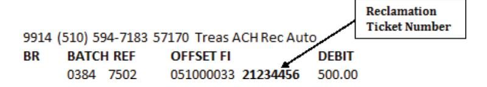

*Section 1* defines reclamation and provides some background information on the subject.

*Section 2* covers an RDFI's liability in the reclamation process. Topics include full and limited liability, calculating the limited liability amount, and exceptions to the liability rule.

*Section 3* gives RDFI's guidance on processing reclamations using the Automated Reclamation Processing System (ARPS) utilizing Pay.gov and provides an updated contact list for individuals needing additional information assistance with reclamations.

## **In this chapter…**

| Section 1: Background 5-3                                                                                       |          |
|-----------------------------------------------------------------------------------------------------------------------|----------|
| Payments Subject to Reclamation 5-3                                                                                   |          |
| Section 2: Liability of a Receiving Depository Financial Institution (RDFI) 5-4                  |          |
| A: Full Liability 5-4                                                                                                 |          |
| B: Limiting Liability 5-4                                                                                             |          |
| C: Calculating the Limited Liability Amount 5-5                                                                       |          |
| Table 2-A: Calculating the Limited Liability Amount 5-5                                                      |          |
| Section 3: Reclamation Procedures 5-6                                                                        |          |
| A: Notification of Death 5-6                                                                                          |          |
| Title 31 CFR part 210 5-7                                                                                 |          |
| What to do upon Notification of Death with Payments Already Posted and Subsequent | Payments |
| 5-8                                                                                                                   |          |
| NoHolding of Payments 5-8                                                                                       |          |
| Repayment by Survivors 5-8                                                                                      |          |
| Handling Survivor Requests not to Return Post-death Benefit Payments 5-9                      |          |
| B:Notice of Reclamation 5-9                                                                                           |          |
| Table 3-A: Notice of Reclamation (FS Form 133) 5-9                                                     |          |
| Sample of Notice of Reclamation (FS Form 133) 5-9                                                |          |
| Table 3-B: How to Respond to the Notice of Reclamation 5-10                                   |          |
| ACH Debit Authorizations 5-11                                                                                   |          |
| Incomplete or Inadequate RDFI Replies5-11                                                                 |          |
|                                                                                                                       |          |

|    | Time Limits for Federal Reclamations                                                   | 5-12         |
|----|----------------------------------------------------------------------------------------|--------------|
|    | Follow-up to the Notice of Reclamation (Fiscal Service-2942)                           |              |
|    | Federal Agency Collection from Withdrawers                                             | 5-13         |
|    | Debit of the RDFI's Account                                                            |              |
|    | Table 3-C: Debit of the RDFI's Account                                                 | 5-13         |
|    | How to Identify Debits using the Reclamation Ticket Number                             | 5-14         |
|    | Table 3-D: Transaction Codes for ACH Reclamations                                      | 5-14         |
|    | C: Errors in Death                                                                     |              |
|    | If the Person did not Die                                                              | 5-15         |
|    | Types of Evidence                                                                      | 5-15         |
|    | Table 3-E: Accepting the Proof                                                         | 5-15         |
|    | Table 3-F: Rejecting the Proof                                                         |              |
|    | Restarting Payments                                                                    |              |
|    | If the Date of Death is Wrong.                                                         | 5-16         |
|    | Learning of an Error After Completing a Reclamation                                    |              |
|    | Table 3-G: Worksheet for Adjusting the Outstanding Total if the Date of Death is Wrong |              |
| D  | : Subsequent Notice of Reclamation                                                     | 5-17         |
|    | What to do                                                                             |              |
|    | Previous debit                                                                         |              |
| E. | Contacts                                                                               | <b>5</b> _17 |

## **Section 1: Background**

Reclamation is a procedure used by the federal government (government) to recover benefit payments made through the ACH to the account of a recipient who died or became legally incapacitated or a beneficiary who died before the date of the payment(s).

The government's right to reclaim funds is established in the United States Code, including at 31 U.S.C. § 3720 and implemented in Title 31 of the Code of Federal Regulations part 210, subpart B, and section 210.10(a). The government's reclamation process is found in 31 CFR 210.9 through 210.14. The reclamation provisions of 31 CFR part 210 completely preempt the reclamation provisions of the Nacha Operating Rules & Guidelines with respect to federal benefit payments.

#### Effective January 1, 2023

- All reclamation responses <u>must</u> be submitted by completing a FS-133 form through the
  Automated Reclamation Processing System (ARPS) located in Treasury's Pay.gov web portal
  (<u>except for responses by DFAS which cannot be processed through pay.gov and any
  Treasury-approved exceptions</u>). Note: We will no longer accept remittances related to
  reclamation responses.
- Exceptions: All exceptions must be approved on a case-by-case basis by Bureau of the Fiscal Service and requests may be sent to: <a href="mailto:pfc-reclamations@fiscal.treasury.gov">pfc-reclamations@fiscal.treasury.gov</a>

By accepting a recurring benefit payment from the government, an RDFI agrees to the provisions of 31 CFR part 210, including the reclamation and debiting of the RDFI's FRB master account for any reclamation for which it is liable. The RDFI also agrees to the liability provisions of the federal reclamation regulations found in 31 CFR part 210, subpart B, and affirms this agreement each time the RDFI accepts and credits an ACH payment on behalf of a depositor.

**Note:** In this chapter, "death" always means the death or legal incapacity of a recipient or the death of a beneficiary. And "government" always means the federal government.

## **Payments Subject to Reclamation**

Only government benefit payments are subject to reclamation.

| Payments Subject to Reclamations               | Payments not Subject to Reclamations                                                                                                |  |  |  |  |
|------------------------------------------------|-------------------------------------------------------------------------------------------------------------------------------------|--|--|--|--|
| Social Security benefit or disability (SSA)    | Federal salary, allotments, and travel payments                                                                                     |  |  |  |  |
| Supplemental Security Income (SSI)             | U.S. savings bond payments                                                                                                          |  |  |  |  |
| Black Lung disability (Dept. of Labor)         | Vendor/miscellaneous payments                                                                                                       |  |  |  |  |
| Military and Coast Guard retirement, including | IRS tax refunds                                                                                                                     |  |  |  |  |
| allotments from military retired pay (DoD)     | Discretionary allotments                                                                                                            |  |  |  |  |
| Civil Service annuity (OPM)                    | Public debt payments (TreasuryDirect)                                                                                               |  |  |  |  |
| Veterans Administration benefits (VA)          | Other types of federal ACH payments                                                                                                 |  |  |  |  |
| Railroad Retirement Board (RRB) annuity        |                                                                                                                                     |  |  |  |  |
| US Coast Guard                                 | Note:. For post-death payments not affected by reclamation, adjustments must be made between the authorizing federal agency and the |  |  |  |  |
| Worker's compensation (FECA)                   |                                                                                                                                     |  |  |  |  |
| DC Pensions                                    | recipient's survivors or estate.                                                                                                    |  |  |  |  |
| Compensation Act (Dept. of Labor)              | <del>_</del>                                                                                                                        |  |  |  |  |
| Any other federal retirement or annuity        | <del>_</del>                                                                                                                        |  |  |  |  |

# **Section 2: Liability of a Receiving Depository Financial Institution (RDFI)**

## **A: Full Liability**

An RDFI is liable for ALL benefit payments received after the death or legal incapacity of a recipient or death of a beneficiary, unless the RDFI meets the qualifications for limiting its liability (see B. Limiting Liability below).

If the RDFI fails to meet the qualifications for limiting its liability, the RDFI will be held liable for all post-death benefit payments received after the death or legal incapacity of a recipient or death of a beneficiary. The RDFI will be debited for the full amount of the reclamation. This debit action will be final, with the exception of a valid protest.

**Note:** *If no post-death benefit payment has been received at the time the RDFI learns of the death, the RDFI may also contact the paying agency (see Contacts, Chapter 7).*

## **B: Limiting Liability**

An RDFI may qualify to limitits liability if it:

- certifies it did not have actual or constructive knowledge\* of the recipient's death or incapacity at the time of the deposit of any post-death benefit payments,
- returns all post-death benefit payments it receives after it learns of the recipient's death (but not post-death benefit payments it received before it learned of the death), and
- adequately responds to the Fiscal Service Form FS Form 133, "Notice of Reclamation," within 60 calendar days from the date of the notice by using the Automated Reclamation Processing System (ARPS) through the Pay.gov web portal.

Exception: Only reclamation responses by DFAS and any Treasury-approved exceptions (evaluated on a case-by-case basis) are not required to respond using ARPS. Note that these responses must meet all other requirements for limiting liability, including receipt by Fiscal Service within 60 days.

**\*Note:** *In this chapter "constructive knowledge" of the death meansthat the RDFI would have learned of the death if it had followed commercially reasonable business practices. "Actual or constructive knowledge" is defined in Treasury's regulations at 31 CFR § 210.2(b).*

#### *Exception to Liability Rule*

An RDFI will not be held liable for post-death benefit payments sent to a recipient acting as a representative payee or fiduciary on behalf of a beneficiary in the event that the beneficiary dies. In this situation, the paying agency will not initiate a reclamation but will instead pursue recovery of any post-death benefit payments from the representative payee.

#### *Requirement to Return Post-Death Benefit Payments*

It is important to understand that once a payment has been credited to payee's account, it becomes the property of the account holder. In the case of post-death payments, the payments become property of the joint account holder or decedent's estate. The government cannot legally authorize or direct an RDFI to take funds already credited to an account and return them to the government.

This is the reason that RDFIs are directed only to return post-death payments that they receive after they become aware of the payee's death, using an R14 or R15 return reason code. Such returns are legally permissible because the payments have not been credited to the recipient's account and therefore have not become property of the joint account holder or decedent's estate.

It is up to each RDFI to consider its policy as an institution as to what steps it may wish to take, if any, upon learning of the death of a recipient in order to preserve funds in the account pending receipt of a Notice of Reclamation. Some RDFIs, upon becoming aware of an account holder's death, perform an account analysis before receiving an NOR and voluntarily return post-death payments that were credited to the account before the RDFI learned of the death. RDFIs are cautioned that Fiscal Service does not authorize or direct RDFIs to debit or otherwise affect the account of a recipient, including to return post-death payments already credited to an account. However, Fiscal Service will accept pre-NOR returns of post-death payments provided that they are made electronically using an R14 or R15 code.

## **C: Calculating the Limited Liability Amount**

If an RDFI qualifies for **limited liability**,the RDFI will only be debited for the **ACH 45-day amount**.

The **ACH 45-day amount** is the dollar amount of the post-death benefit payments received within 45 calendar days following the death.

**Note:** *The limited liability amount may not exceed the outstanding total on the Notice of Reclamation. The outstanding total is the total amount of all the post-death benefit payments.*

#### *Table 2-A: Calculating the Limited Liability Amount*

**Example 1: Four payments of \$200 each were received after death.** *The first benefit payment was received within 45 days after the date of death (i.e., ACH 45-day amount = \$200). The RDFI had no actual or constructive knowledge at the time the post-death benefit payments were received or withdrawn.1 No additional benefit payments were received after the RDFI had knowledge*

| Scenarios 1-5                                                                                                        | Scen.1 | Scen.2 | Scen.3 | Scen.4 | Scen.5 |
|----------------------------------------------------------------------------------------------------------------------|--------|--------|--------|--------|--------|
| Total Amount of post-death payments on the Notice of Reclamation                                                     | \$800  | \$800  | \$800  | \$800  | \$800  |
| Amount of the Account Balance paid by RDFI in response to the Notice of Reclamation2                              | \$300  | \$300  | \$750  | \$0    | \$800  |
| Amount due from withdrawers                                                                                          | \$500  | \$500  | \$50   | \$800  | \$0    |
| Amount collected by government from withdrawers                                                                      | \$250  | \$500  | \$0    | \$0    | \$0    |
| Outstanding total                                                                                                    | \$250  | \$0    | \$50   | \$800  | \$0    |
| Amount to be debited from the RDFI's federal reserve account = (lesser of Outstanding Total or ACH 45-day amount) | \$200  | \$0    | \$50   | \$200  | \$0    |

1 RDFI had no actual or constructive knowledge of the death at the time of deposit or withdrawal of any post-death benefit payments.

2 RDFI accurately responds to the Notice of Reclamation so that the appropriate amount is received by the government disbursing office within 60 calendar days of the date on the Notice.

**Example 2: Four payments of \$200 each were received after death.** *Three of the benefit payments were received before the RDFI had actual or constructive knowledge of the death. The 4th benefit payment was received by the RDFI after it had received a DNE and the RDFI promptly returned the payment using an R15 return reason code.1 The 1st and 2nd benefit payments were received within 45 days following the date of death (4th benefit payment will not be listed on the Notice of Reclamation since it was promptly returned by the RDFI).*

| Scenarios 1-5                                                                                                        | Scen.1 | Scen.2 | Scen.3 | Scen.4 | Scen.5 |
|----------------------------------------------------------------------------------------------------------------------|--------|--------|--------|--------|--------|
| Total Amount of post-death payments on the Notice of Reclamation                                                     | \$600  | \$600  | \$600  | \$600  | \$600  |
| Amount of the Account Balance paid by RDFI in response to the Notice of Reclamation2                              | \$300  | \$300  | \$550  | \$0    | \$600  |
| Amount due from withdrawers                                                                                          | \$300  | \$300  | \$50   | \$600  | \$0    |
| Amount collected by government from withdrawers                                                                      | \$50   | \$300  | \$0    | \$0    | \$0    |
| Outstanding total                                                                                                    | \$250  | \$0    | \$50   | \$600  | \$0    |
| Amount to be debited from the RDFI's federal reserve account = (lesser of Outstanding Total or ACH 45-day amount) | \$250  | \$0    | \$50   | \$400  |        |

1 RDFI is obligated to return any post-death benefit payments that the RDFI receives after becoming aware of the recipient's death. RDFI is not obligated or authorized to return post-death benefit payments that the RDFI received before becoming aware of the recipient's death.

# **Section 3: Reclamation Procedures**

## **A: Notification of Death**

An RDFI must immediately return any post-death benefit payments received after the RDFI becomes aware of the death or legal incapacity of a recipient (but not post-death benefit payments that the RDFI received before becoming aware of the recipient's death). If the RDFI learns of the death or legal incapacity of a recipient from a source other than the federal agency, the RDFI must notify the sending agency of the recipient's death. An ACH return using return reason code R15 or R14 constitutes proper notification to the federal agency. When returning payments, the RDFI should ensure that the date of death in the addenda record be in YYMMDD format. The RDFI should also provide notification to the account owners, as a courtesy.

2 RDFI accurately responds to the Notice of Reclamation so that the appropriate amount is received by the government disbursing office within 60 calendar days of the date on the Notice.

Notification of death of a recipient by any source constitutes notification for all federal benefit payments received by that recipient. The following are some examples of ways that the RDFI may learn of the death of their account holders:

- Receipt of a Death Notification Entry (DNE)- A DNE is a notification of a benefit recipients death sent from an originating government agency (e.g., SSA, RRB, or OPM) to the RDFI,
- Receipt of a federal government Notice of Reclamation,(FS Form 133),
- Any contact or request to withdraw funds from an Estate, Executor, Administrator, Public Administrator, Personal Representative, Conservator or other representative of such Estate. Note: Any release to an executor or other party clearly acting on behalf of the deceased person or their estate will be deemed by the government to have demonstrated the RDFI's knowledge of the death,
- A pertinent reference to or from a Probate Court, a funeral home, or Letters Testamentary.
- Credible oral or written report of death,
- Credible death information obtained by the RDFI's inquiry into a dormant account, or through other RDFI internal screening processes,
- Credible personal awareness of the death by the RDFI's staff, or
- Credible death notice received in the mail from any source.

**Note:** *If at the time the RDFI first receives information of death, all or part of the post-death benefit payments have already been withdrawn from the account, the government does not authorize or direct the RDFI to try to recover the funds from the withdrawer. If the RDFI does so, it acts under its own authority in terms of its contract with its depositor or under state law.*

#### *Title 31 CFR part 210*

*This regulation defines when a federal agency as well as an RDFI has actual or constructive knowledge of the death:*

A federal agency or RDFI has actual knowledge of the death or legal incapacity of a recipient, or the death of a beneficiary, when it receives information, by whatever means, of the death or legal incapacity and has had a reasonable opportunity to act on such information or that the federal agency or RDFI would have learned of the death or legal incapacity if it had followed commercially reasonable business practices. *See* 31 CFR § 210.2(b).

The phrase "commercially reasonable business practices" is a flexible concept since, for example, what is a commercially reasonable practice for a large bank may not be commercially reasonable for a small rural bank, and vice versa.

In March 2020, Fiscal Service revised this definition to include parameters for when an agency is presumed to have constructive knowledge of a death or legal incapacity. Specifically, a federal agency is presumed to have constructive knowledge of a death or legal incapacity at the time it stops certifying recurring payments to a recipient if the agency (1) does not re-initiate payments to the recipient and (2) subsequently initiates a reclamation for one or more payments made to the recipient. See 31 CFR § Part 210.2(b) This presumption is rebuttable in cases where an agency can demonstrate that it stopped certifying recurring payments to a recipient for a reason other than death.

### *What to do upon Notification of Death with Payments Already Posted and Subsequent Payments*

When an RDFI receives actual or constructive knowledge of the death of a recipient, it must return all subsequent post-death benefit payments, meaning all post-death payments received after the FI learns of the death, to the government disbursing office using return reason code R15 or R14. The RDFI must also notify the sending agency of the recipient's death. An ACH return using return reason code R15 or R14 constitutes proper notification to the federal agency of the recipient's death. An RDFI can, if they so choose, return by ACH any post-death benefit payments that were already posted to the recipient's account before the RDFI received actual or constructive knowledge of death, by ACH, without waiting for a Notice of Reclamation, but the RDFI is not required or directed to do so.

#### *R15 Beneficiary Deceased*

The beneficiary is the person entitled to the benefits. In this case, there is no representative payee or guardian involved.

#### *R14 Representative Payee (or Guardian) Deceased or Incapacitated*

The representative payee (or guardian) is the person who receives benefit payments on behalf of the (under aged or incapacitated) beneficiary. E.g., payment is payable to "John Doe, for [another person]".

Any information of the death of a representative payee that is received by the RDFI or any of its employees, from whatever source, establishes the full legal liability for ALL SUBSEQUENT postdeath federal benefit payments from all agencies, as well as any post-death benefits in the account, which the RDFI then allows to be withdrawn.

**Note:** *Recipients may be receiving multiple benefit payments from the same or different federal agencies. An RDFI should ensure that they are returning all federal benefit payments subject to Reclamation. If a Financial Institution needs to correct errors in their use of reason codes when returning funds, they should contact the agency receiving the return. Please see Chapter 7, Contacts, for major paying agency contact information.*

#### *No Holding of Payments*

Under no circumstances should an RDFI hold benefit payments indefinitely in a suspense account, or by any other means, nor should benefit payments otherwise be held if any of the conditions apply on when to return a benefit payment. Holding benefit payments may constitute a breach of the RDFI's warranty for the handling of federal government ACH payments under 31 CFR part 210 and could result in an RDFI's inability to limit its liability.

#### *Repayment by Survivors*

If the survivors or other withdrawers state that the withdrawn post-death benefit payments have already been repaid to the federal agency, the RDFI should obtain a front and back copy of the check(s) and/or a receipt from the federal agency.

If all post-death benefit payments have been repaid by the survivor(s), the RDFI should not receive a Notice of Reclamation. However, if a Notice of Reclamation is received, the RDFI must complete the electronic FS-133 in ARPS within 60 calendar days. The RDFI is not liable for any post-death benefit payments that have already been repaid to the originating agency.

Next of Kin or Estate can submit payments by sending a check or money order payable to the authorizing agency (i.e. SSA, VA, OPM, etc.,) directly to them and referencing the ticket number.

#### Handling Survivor Requests not to Return Post-death Benefit Payments

The RDFI may be asked by the survivor(s) not to return post-death benefit payments because the survivor believes he or she is entitled to all or part of the payment(s). In such cases, the RDFI should still return the benefit payment and advise the survivor(s) to contact the appropriate federal benefit agency (see Chapter 7, Contacts) to determine whether a final survivor payment is due.

#### B: Notice of Reclamation

The Notice of Reclamation (FS Form 133) initiates the recovery of post-death benefit payments that have not been returned to the government, for which the RDFI may be liable.

The Notice of Reclamation is mailed or emailed to the RDFI by the government disbursing office upon instructions from the authorizing federal agency. The RDFI's address and routing number are derived from the FOMF maintained by Treasury. Each RDFI is responsible for updating the FRB ACD (see Chapter 2, FOMF). RDFIs should also provide updated email addresses as needed, to ensure the timely receipt of Notices of Reclamation sent electronically.

**Note:** If the full amount listed on the reclamation is returned to the Disbursing Office, the RDFI does NOT need to complete and return the FS Form 133.

#### Table 3-A: Notice of Reclamation (FS Form 133)

The Notice of Reclamation advises the RDFI of the following:

- the date of death or legal incapacity,
- the amount of post-death benefit payment(s) for which the RDFI may be liable, and
- the identity of each benefit payment in question, including:
- 1. name of the recipient,
- 2. individual ID or claim #,
- 3. reclamation ticket #,
- 4. date of the payment(s),
- 5. Federal agency that authorized the payment(s) and the type of payment(s),
- 6. payment trace number(s),
- 7. type of account (checking/savings) to which the payment(s) was made,
- 8. depositor account number, and
- 9. amount of the payment(s).

The FS Form 133 consists of six parts (RDFI will receive Parts 1 through 5):

- Part 1- Program Agency Copy,
- Part 2- Program Agency File Copy,
- Part 3- RDFI Copy,

- Part 4- Disbursing Office Copy,
- Part 5- Notice to Account Owners Copy, and
- Part 6- Disbursing Office Pending Copy (RDFI does not receive Part 6).

**Note:** The reclamation ticket number is located in the top right box of the form to the right of the date (see sample FS Form 133). It is important that the RDFI retains a copy of the reclamation form submitted via ARPS for a minimum of three years or until the associated case is closed. The RDFI should file the notice using the reclamation ticket number. In the event that a debit is processed, the RDFI will need to locate the Notice of Reclamation using the ticket number provided on the FRB Statement of Account (see How to Identify Debits using the Reclamation Ticket Number).

#### Sample of Notice of Reclamation (FS Form 133)

A sample of the Notice of Reclamation form (FS Form 133) is available in Chapter 9, *Forms*. The sample is the same for the Program Agency Copy, Program Agency File Copy, RDFI Copy and Disbursing Office Copy.

### *Table 3-B: How to Respond to theNotice of Reclamation*

### **Steps to takeUnder Limited Liability**

1. If funds are available, but not sufficient to satisfy the full reclamation, a partial payment should be remitted to the government disbursing office that issued the reclamation. When returning less than the full amount, the RDFI must authorize a debit by using the Automated Reclamation Processing System (ARPS) located in Treasury's Pay.gov web portal.

- 2. Promptly mail the notice to the account owners \* last known address(es) and notify the account owner(s) of any action that the RDFI has taken or plans to take against the account.
- 3. When the RDFI is returning less than the outstanding total listed on the Notice of Reclamation, the RDFI must complete and sign Certification No. 1\*\*\* and if the RDFI had no knowledge of the death at the time the benefit payment(s) was received or withdrawn, also sign Certification No. 2\*\*\*\* on the back of the Disbursing Office copy of the Notice of Reclamation. The RDFI must provide name, address and phone number of the persons who withdrew from the account or if it is a sole owner account the RDFI MUST complete all applicable fields in ARPS when limiting their liability or returning less than the total amount.
- 4. If the outstanding total\*\* was previously repaid to the federal government. The RDFI's obligation to the federal government (e.g., by the beneficiary's survivor) has been satisfied and the RDFI must return the Notice of Reclamation, attaching proof of the repayment, so that it is received by the government disbursing office within 60 calendar days of the date on the Notice. (See Types of Evidence).
- 5. The signature in Certification No. 1\*\*\* and 2\*\*\*\* must be completed. The original signature must include the signer's first name and last name. The signer's title and phone number must be provided. If the Notice of Reclamation is incorrect due to error in fact or date of death, (see Learning of an Error).
- *\* Some withdrawers may wish to restore all or part of the withdrawn post-death benefit payments to the account upon receipt of a Notice of Reclamation to Account Owners. Repayment to the account by the withdrawer upon receipt of the Notice of Reclamation is not required or requested by the government.*
- *\*\* The Outstanding Total is the sum of all federal benefit payments received after death or legal incapacity, minus any amount returned to or recovered by the government.*
- *\*\*\* Certification No. 1 on the back of the Disbursing Office copy of the Notice of Reclamation certifies that: the Notice to Account Owners was sent; account owners were notified of any action the RDFI has taken or plans to take against the account; and the RDFI took proper corrective action regarding any error in date of or fact of death.*

*\*\*\*\* Certification No. 2 on the back of the Disbursing Office copy of the Notice of Reclamation, certifies that the RDFI had no actual or constructive knowledge of the death at the time of deposit or withdrawal of any of the post-death benefit payments; and, that the RDFI has returned the amount of the account balance to the government.*

#### **ACH Debit**

ACH Debit Authorization provided via Pay.gov permits Treasury to debit a financial institution's Federal Reserve account. A payment made by ACH debit will appear on the financial institution's Federal Reserve statement with an IAS transaction code of "57180 – Treasury ACH Reclamation FI Auth". There will also be a reclamation tracking number listed, which will aid a financial institution when researching debit transactions. ACH debits are received the same day and are posted within one (1) to two (2) business days of receipt.

#### Automated Reclamation Processing System (ARPS):

The Bureau of Fiscal Service has developed an electronic version of the current FS-133 process. This process allows financial institutions to submit a response to the Notice of Reclamation (NOR) electronically through the Department of the Treasury's Pay.gov web portal. **Note: If the reclamation has been satisfied by returning the payments through the ACH network, a response does not need to be submitted in pay.gov.** 

#### How to electronically respond to an ACH Reclamation:

Electronic responses should be made through <u>Pay.gov</u>, a web-based application operated by the Department of the Treasury that allows users to submit responses to a Notice of Reclamation. It also allows the Financial Institution to make payments to government agencies by electronic means by authorizing a debit.

- 1. When the FMS 133, Notice of Reclamation, is received, the financial institution will continue to follow its current procedures as stated in the Green Book (Chapter 5, Section 3, Reclamation Procedures)
- 2. Once the FI is prepared to respond to the Notice of Reclamation, this response will be submitted through the Pay.Gov web portal. This electronic version of the form requires the same information as the paper version.
- 3. Responding through Pay.gov allows the financial institution to limit liability as well submit full or partial payment(s) via a debit authorization.

#### *Time Limits for Federal Reclamations*

1. **INITIATION OF RECLAMATION (120-Day Protest):** The authorizing federal agency must initiate the reclamation within 120 calendar days after the date that the agency first has actual or constructive knowledge of the death or legal incapacity of a benefit recipient or the death of a beneficiary.

An RDFI has the right to protest a Notice of Reclamation if it believes the agency did not meet the deadline for initiating the reclamation.

A 120-day protest is filed by checking the appropriate box on the electronic form 133 in Automated Reclamation Processing System (ARPS).

Upon receipt of the protest, the Fiscal Service will work with the authorizing federal agency to determine whether or not the agency met the 120-day deadline. If the RDFI's protest is valid, then the RDFI will be notified via email within 45 days and the reclamation action will be withdrawn. If the protest is denied, and the RDFI qualifies for limited liability, the Disbursing Office will notify the RDFI via email within 45 days and the RDFI will only be debited for the ACH 45-day amount.

- 2. **SCOPE OF RECLAMATION:** An RDFI is not liable for any post-death benefit payments made more than six years prior to the date of the notice of reclamation, except under the following circumstance: "If the account balance at the time the RDFI receives the notice of reclamation exceeds the total amount of all post-death or post-incapacity payments made by the agency during such six-year period, this limitation shall not apply and the RDFI shall be liable for the total amount of all payments made, up to the amount in the account at the time the RDFI receives the Notice of Reclamation and has had a reasonable opportunity (not to exceed one business day) to act on the notice." [31 CFR part 210.10(d)]
- 3. **COINCIDING WITH DATE OF DEATH:** An RDFI is not liable for any benefit payment dated where the effective date is the same as the date of death.
- 4. **RDFI REACTION TIME:** The RDFI, upon receipt of the government's Notice of Reclamation, has UP TO ONE BUSINESS DAY to react to that reclamation by determining the account balance, and by preventing any further withdrawals of post-death government benefit payments from the account, if possible, under the terms of the contract with the account holder.

*RDFI RESPONSE DEADLINE: The RDFI has up to 60 calendar days from the issue date of the reclamation to provide a full and accurate response to the proper government disbursing office. Failure to respond timely may result in a debit to the RDFI's FRB account or the account of its correspondent for the total amount of the reclamation. This debit action will be final.*

#### *Follow-up to the Notice of Reclamation (Fiscal Service-2942)*

A Follow-Up Notice is sent if the government disbursing office does not receive a response within 30 days of the FS Form 133, Notice of Reclamation; or if the RDFI's response to the Notice of Reclamation was incomplete or inaccurate.

A Follow-Up Notice is a reminder to the RDFI that a response to the Notice of Reclamation (FS Form 133) must be received by the government disbursing office within 30 days of the date of the Follow-Up Notice, or the RDFI will forfeit the right to limit its liability. The Follow-Up to the Notice of Reclamation Form (FS Form 2942) is available in Chapter 9, *Forms*.

#### *A copy of the original Notice of Reclamation is attached to the Follow-Up Notice*

Responses to a Follow-Up Notice must be completed in ARPS (except for approved exceptions)in the same manner as an original Notice of Reclamation.

Any questions regarding this matter should be directed to the government disbursing office shown in the upper right corner of the Notice of Reclamation.

*.*

#### *Federal Agency Collection from Withdrawers*

If all or part of the post-death benefit payments have been withdrawn from the account before the RDFI learns of the death, and the RDFI properly responds to the Notice of Reclamation and is qualified to limit its liability, then the Reclamation process will be temporarily suspended, and the authorizing federal agency will attempt to collect the outstanding total from the withdrawer(s).

If the authorizing federal agency is unsuccessful in collecting the outstanding total from the withdrawer(s), the RDFI or its correspondent's FRB account will be debited (for the ACH 45-day amount) not to exceed the outstanding total. Agencies have up to three years from the date of the FS-133, Notice of Reclamation, to submit final debits requests (i.e. ACH reclaims) of a FI's Federal Reserve account.

#### *Debit ofthe RDFI's Account*

If the RDFI fails to respond completely and accurately to a Notice of Reclamation by the due date, the government disbursing office will debit the RDFI's FRB account or that of its correspondent account for the full amount of its outstanding liability. This action is final.

If the RDFI responds completely and accurately to a Notice of Reclamation by the due date, and the federal agency is unable to collect the balance on the FS Form 133, the RDFI will be debited for the limited liability ACH 45-day amount.

The table below shows when the authorizing federal agency can exercise its authority to have an RDFI's FRB account debited.

#### *Table 3-C: Debit ofthe RDFI's Account*

| If the RDFI:                                                                                                                                                                             | Then the RDFI(or its correspondent's) FRB Account                               |
|------------------------------------------------------------------------------------------------------------------------------------------------------------------------------------------|---------------------------------------------------------------------------------|
| Fails to respond accurately and completely to the Notice of Reclamation.                                                                                                              |                                                                                 |
| Fails to respond within the 60-day time limit of the Notice of Reclamation.                                                                                                           | will be debited for the outstanding total.                                      |
| Responds accurately, completely, and timely, (i.e., limited its liability) but the authorizing federal agency can no longer collect the outstanding total from the withdrawers. | will be debited for the ACH45-day amount notto exceed the outstanding total. |

#### How to Identify Debits using the Reclamation Ticket Number

When there is a liability for an ACH reclamation payment by an RDFI, the RDFI will receive a charge to their FRB account. The reclamation ticket number will appear on the FI's Statement of Account. This ticket number is the same number as identified on the original FS Form 133, Notice of Reclamation.

The FS Form 133, Notice of Reclamation form provides the reclamation ticket number in the top right box of the form to the right of the date. This ticket number should be used to identify debits for reclamations. Coordination between the ACH reclamation area and the RDFI accounting department is critical to the reconcilement of the RDFI's Statement of Account.

Provided below is an example of how the debit for ACH reclamations will appear on an FRB Statement of Account:

#### **Explanation of the Debit:**

- 1) The number 9914 indicates an entry processed by FRB Philadelphia to an out of district bank,
- 2) The phone number of the payment center that initiated the debit will be provided e.g., (510) 594-7183. The phone number is also provided in the upper right-hand corner of the reclamation notice,
- 3) The number 57170 is the transaction code representing an automated debit on ACH reclamations from the National Payment Center of Excellence (NPCE).is transaction code number will be unique for each RFC (See Table 3-D),
- 4) The number 03884 represents a batch number,
- 5) The number 7502 represents a reference number,
- 6) The number 051000033 is the FRB Philadelphia routing number,
- 7) The number 21234456 is the Reclamation Ticket number. This will be unique for each reclamation and is the same number as assigned on the original Notice of Reclamation form (FS Form 133), and
- 8) The dollar amount of the debit is indicated in the far-right hand column- e.g., 500.00.

#### <u>Table 3-D:</u> Transaction Codes for ACH Reclamations

The table below shows the unique transaction codes numbers for each Fiscal Service Portfolios.

| Transaction Code\ <i>Description</i> | Definition                                                                                                        | Daylight Overdraft Posting Times |
|-----------------------------------------|-------------------------------------------------------------------------------------------------------------------|-------------------------------------|
| 57170 Treas ACH REC Auto             | Debits for reclamation payments authorized by the Treasury to post to a financial institution. These payments are | After close of Fedwire           |

|                             | initiated to FRB Philadelphia by theKansas City Federal Disbursement Services Includes adjustments to such entries.                                                                                                                                             |                           |
|-----------------------------|-----------------------------------------------------------------------------------------------------------------------------------------------------------------------------------------------------------------------------------------------------------------------|---------------------------|
| 57190 Treas ACH REC Auto | Debits for reclamation payments authorized by the Treasury to post to a financial Institution. These reclamation debits are initiated to FRB Philadelphia by the Modernization, Innovation, and Payment Resolution. Includes adjustments to such entries. | After close of Fedwire |

## **C: Errors in Death**

#### *Ifthe Person did not Die*

If the RDFI obtains satisfactory proof that the benefit recipient or beneficiary is alive, the RDFI is still required to respond to the Notice of Reclamation in the Automated Reclamation Processing System. Failure to respond to the Notice of Reclamation will result in a debit to the RDFI or its correspondent's FRB account for the outstanding total. In this case, a debit can only be restored after a verification process by the authorizing federal agency.

#### *Types of Evidence*

The following are acceptable types of proof for verifying that the person did not die:

- Driver's license, picture ID or other evidence similar to that required for cashing a check, if the recipient or beneficiary appears at the RDFI. The date of issue for the ID must be later than the date of death that appears on the Notice of Reclamation.
- A signed, dated, and notarized statement attesting to the fact that the recipient or beneficiary is alive if, he/she is unable to appear at the RDFI, and
- A written statement from the authorizing federal agency verifying that the recipient or beneficiary is alive.

The RDFI is not obligated to accept the proof or to contact the authorizing federal agency if any disagreements or questions arise with the person presenting the proof. Prudence is required, as the action taken by the RDFI may impact its liability. Disagreements will be adjudicated by the authorizing federal agency after it has been contacted by the person presenting the proof.

**Note:** If a *Financial Institution needs to correct errors in their use of reason codes when returning funds, they should contact the agency receiving the return. Please see Chapter 7, Contacts, for major paying agency contact information.*

#### *Table 3-E: Accepting the Proof*

The table below shows what actions the RDFI must take if it accepts the proof that the person did not die.

# **Step Action** 1. Within ARPS, select payee alive. 2. Digitally sign Certification #1 and Certification #2. 3. A signed, dated notarized statement attesting the fact that the payee is alive DNE removal request

4. Written letter from agency (which we will confirm) stating payee is alive.

5. Advise the recipient to contact the authorizing federal agency to restart payments.

#### *Table 3-F: Rejecting the Proof*

The table below shows the actions the RDFI must take if it rejects the proof that the person did not die.

#### **Step Action**

- 1. Continue to process the Notice of Reclamation, which includes sending the Notice of Reclamation to account owner(s).
- 2. Refer the person presenting the proof to the federal agency.
- 3. Notify the account owner(s) to provide a written statement from the federal agency verifying that the recipient or beneficiary is alive, or the reclamation process will continue.

#### *Restarting Payments*

Once a reclamation has been processed, all further benefit payments will be stopped. Presenting acceptable proof that the death report was in error (and stopping the reclamation process) does not restart the monthly benefit payments. The recipient or beneficiary must contact the authorizing federal agency to re-enroll in Direct Deposit.

#### *Ifthe Date of Death is Wrong*

The RDFI is authorized to adjust the outstanding total, provided it obtains acceptable proof that the date of death (DOD) shown on the Notice of Reclamation is wrong. When correcting a date of death error, the RDFI should always check the appropriate box in ARPS, provide the correct DOD and submit a death certificate via email t[o PFC-reclamations@fiscal.treasury.gov.](mailto:PFC-reclamations@fiscal.treasury.gov) Documentation should be submitted within 15 business days of the Notice of Reclamation response.

#### *Learning of an Error After Completing a Reclamation*

If the RDFI learns of an error in the date of death after returning a completed Notice of Reclamation and it has already satisfied its liability, it MUST contact the authorizing federal agency (based on the payment type listed on the Notice of Reclamation) to make the appropriate adjustment.

If the RDFI is due a refund, the RDFI must provide supporting documentation to the authorizing federal agency.

**Note:** *Only the authorizing federal agency can make adjustments after the debit action has been processed.*

*Table 3-G: Worksheet for Adjusting the Outstanding Total if the Date of Death is Wrong*

The worksheet below may be used by the RDFI to calculate the adjusted total if there is an error in the date of death.

|                                                                                                                        | PMT 1 | PMT 2 | PMT 3 | PMT 4 |
|------------------------------------------------------------------------------------------------------------------------|-------|-------|-------|-------|
| Listthe month/day/year of each payment shown on the Reclamation form.                                               |       |       |       |       |
| For each payment(shown on the Reclamation) did the person die before the date of the payment? (Enter "yes" or "no") |       |       |       |       |
| For each "yes", enter the dollar amount of the payment. (Do not enter the dollar amount if "no.")                   |       |       |       |       |
| Total all "yes" payments \$                                                                                            |       |       |       |       |
| (This is the adjusted outstanding total to use on the Notice of Reclamation).                                          |       |       |       |       |

## **D: SubsequentNotice of Reclamation**

The government may issue a subsequent Notice of Reclamation if the original Notice of Reclamation did not list all post-death benefit payments.

A subsequent Reclamation may be issued if any of the following apply; the date of death was earlier than shown on the original Notice of Reclamation, the account number changed, and/or the routing number changed.

#### *Whatto do iftheRDFI receives a subsequent reclamation.*

An RDFI receiving a subsequent Notice of Reclamation should respond as the RDFI would respond to an original Notice of Reclamation."

#### *Previous debit*

If the RDFI has already limited its liability and has been debited for the ACH 45-day amount on the original reclamation case, it will not be debited again on a subsequent Reclamation for the same case. However, in order to maintain its limited liability status, the RDFI must respond to all Notice of Reclamations received to prevent a debit to the RDFI or its correspondent's FRB account.

## **E: Contacts**

For Pay.gov technical issues please contact: **800-624-1373 (Toll free, Option #2), 216-579-2112 (Option #2), [pay.gov.clev@clev.frb.org](mailto:pay.gov.clev@clev.frb.org)**, Hours 8:00am to 7:00pm Monday – Friday.

For questions related to a Notice of Reclamation or general Notice of Reclamation inquiries, please contact: **(855) 868-0151**

Any supporting documentation related to the Notice of Reclamation response (payee alive, incorrect date of death, etc.) must be emailed to [PFC-Reclamations@fiscal.treasury.gov](mailto:PFC-Reclamations@fiscal.treasury.gov) within 15 business days.