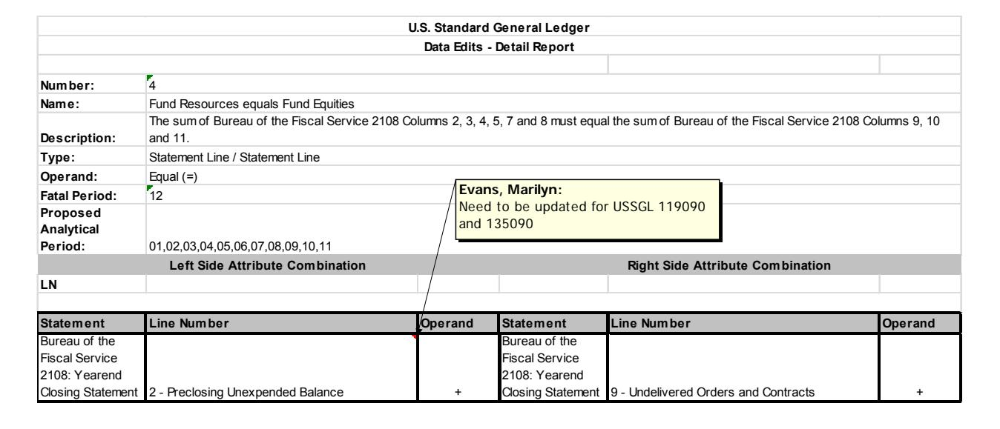

# **Guide for Accounting and Reporting of International Monetary Fund (IMF) – New Arrangements to Borrow (NAB)**

Effective Date Fiscal 2016

Prepared BY: Marilyn Evans

Department of Treasury

| Version Number | Date    | Description of Change             | Effective USSGL TFM |
|-------------------|---------|-----------------------------------|------------------------|
| 1.0               | FY 2017 | Original version of the document. | Bulletin No. 2017-06   |

### *Introduction*

The General Arrangements to Borrow (GAB) were established in 1962 by 10 industrial countries, including the United States, as a means of supplementing the IMF' quota resources to forestall or cope with the impairment of the international monetary system. GAB participants decided in early 1983 to increase their financial commitments to the GAB from approximately SDR 6.3 billion to SDR 17 billion, with the U.S. share rising from SDR 1.9 billion to approximately SDR 4.25 billion.

In January 1997, the Executive Board of the IMF approved the creation of the New Arrangements to Borrow (NAB), which is a standing arrangement among certain IMF members to supplement the IMF's quota resources as needed to forestall or cope with an impairment of the international monetary system or to deal with an exceptional situation that poses a threat to the stability of the system. The NAB became effective on November 17, 1998, and was activated for the first time in December 1998 to finance an IMF arrangement for Brazil. The IMF repaid the NAB participants in March 1999. From 1999 through March 2011 the NAB was not activated.

In 2015, forty countries and institutions participated in the NAB for a total of SDR 370 billion of which the U.S. share in 2015 was approximately SDR 69 billion. After the activation period from October 2014 expired on March 31, 2015, the IMF activated the NAB for two additional six-month periods in 2015, commencing on April 1 and October 1. As of the end 2015, the IMF had accessed SDR 6.7 billion of the U.S. arrangement under the NAB.

The sum of U.S. resources made available to the IMF under the NAB and GAB cannot exceed the total U.S. NAB participation.

With respect to this account, resources provided to the United States under the GAB and NAB constitute an exchange of monetary assets and do not result in any net budgetary outlays because such transactions result in an equivalent increase in U.S. international reserve assets in the form

of equal, offsetting, interest-bearing claim on the IMF. U.S. claims on the IMF under the GAB and NAB are readily available to meet a U.S. balance-of-payments financing need.

In 2010, G-20 Leaders and the IMF membership decided on a set of quota and governance reforms designed to enhance IMF effectiveness. The United States successfully achieved its negotiating priorities during this process: (1) a U.S. quota increase with a corresponding equivalent rollback in U.S. participating in the IMF's NAB for no change in overall U.S. financial participation in the IMF; and (2) preservation of U.S. veto power in the IMF.

Title IX of The Department of State, Foreign Operations, and Related Programs Appropriation Act, 2016 (P.L. 114-113) rescinds SDR 40,871,800,000 from U.S. participation in the NAB. The Act also directs that the budget authority and outlays of the NAB rescission be recorded on the present value basis with a fair value premium added to the discount rate. In addition, under the Act, the 2009 NAB increase is also now executed on a present value basis.

## *Proposed New SGL Accounts*

**Account Title:** Loans Receivable - International Monetary Fund

**Account Number:** 135090 **Normal Balance:** Debit

**Definition:** The amount loaned to the International Monetary Fund under the New Arrangements to Borrow (NAB). This USSGL can only be used by the Department of the Treasury. This account does not close at yearend.

**Justification:** Needed to crosswalk to edit 994.

**Account Title:** Allowance for Loss on Loans Receivable - International Monetary Fund

**Account Number:** 135990 **Normal Balance:** Credit

**Definition:** The estimated amounts of FX rate changes for loans to the International Monetary Fund under the New Arrangements to Borrow (NAB). Although the normal balance for this account is credit, it is acceptable for this account to have a debit balance. This USSGL can only be used by the Department of the Treasury. This account does not close at yearend.

**Justification:** Allowance account associated with 135090.

**Account Title:** Other Appropriations Realized - International Monetary Fund – New

Arrangements to Borrow (NAB) **Account Number:** 411993 **Normal Balance:** Debit

**Definition:** The amount of budget authority appropriated for International Monetary Fund as specified in the appropriation language for the increase in the New Arrangements to Borrow. This USSGL can only be used by the Department of the Treasury.

**Justification:** Implementing P.L. 114-113 as this fund has been designated a means of financing and will show no Budgetary Resources or Status of Budgetary Resources. This USSGL will not crosswalk to the SF 133, Schedule P or Statement of Budgetary Resources. However, it will keep the relationship between Proprietary and Budgetary for appropriations received. This USSGL will crosswalk to the new memo lines associated with International Monetary Funds.

**Account Title:** Other Appropriations Realized - International Monetary Fund – Exchange Rate

Change (NAB)

**Account Number:** 411994 **Normal Balance:** Debit

**Definition:** The amount of budget authority appropriated for International Monetary Fund due to an increase in the exchange rate in the New Arrangements to Borrow. This USSGL can only be used by the Department of the Treasury.

**Justification:** Implementing P.L. 114-113 as this fund has been designated a means of financing and will show no Budgetary Resources or Status of Budgetary Resources. This USSGL will not crosswalk to the SF 133, Schedule P or Statement of Budgetary Resources. However, it will keep the relationship between Proprietary and Budgetary for appropriations received. This USSGL will crosswalk to the new memo lines associated with International Monetary Funds.

**Account Title:** Unobligated Funds Exempt From Apportionment - International Monetary Fund

- New Arrangements to Borrow (NAB)

**Account Number:** 462091 **Normal Balance:** Credit

**Definition:** The amount of unobligated budgetary resources in programs exempt from apportionment that is available for commitment and obligation for the International Monetary Fund, New Arrangements to Borrow. This account does not close at yearend. This account does not close at yearend. This USSGL can only be used by the Department of the Treasury.

**Justification:** Implementing P.L. 114-113 as this fund has been designated a means of financing and will show no Budgetary Resources or Status of Budgetary Resources. This USSGL will not crosswalk to the SF 133, Schedule P or Statement of Budgetary Resources.

#### Listing of USSGL accounts Used in this scenario

| Account No  | Account Titles                                                                                                           |
|-------------|--------------------------------------------------------------------------------------------------------------------------|
| Proprietary |                                                                                                                          |
| 101000      | Fund Balance with Treasury                                                                                               |
| 135090      | Loans Receivable – International Monetary Fund                                                                     |
| 135990      | Allowance for Loss on Loans Receivable – International Monetary Fund                                            |
| 310000      | Unexpended Appropriations – Cumulative                                                                                |
| 310100      | Unexpended Appropriations – Appropriations Received                                                                   |
| 310200      | Unexpended Appropriations – Transfers-In                                                                              |
| 310300      | Unexpended Appropriations – Transfers-Out                                                                             |
| 310600      | Unexpended Appropriations – Adjustments                                                                               |
| 331000      | Cumulative Results of Operations                                                                                         |
| 576500      | Nonexpenditure Financing Sources – Transfer-Out – Other                                                            |
| 719090      | Other Gains on International Monetary Fund Assets                                                                        |
| 729090      | Other Losses on International Monetary Fund Assets                                                                       |
| Budgetary   |                                                                                                                          |
| 411993      | Other Appropriations Realized – International Monetary Fund – New Arrangements to Borrow (NAB)               |
| 411994      | Other Appropriations Realized – International Monetary Fund – Exchange Rate Changes (NAB)                       |
| 417590      | Allocation Transfers of Current-Year Authority for Non-invested Accounts – International Monetary Fund             |
| 417690      | Allocation Transfers of Prior-Year Balances – International Monetary Fund                                          |
| 420190      | Total Actual Resources – Collected – International Monetary Fund                                                   |
| 429590      | Adjustments to the International Monetary Fund                                                                           |
| 435190      | Partial Cancellation of Authority – International Monetary Fund                                                       |
| 462091      | Unobligated Funds Exempt From Apportionment – International Monetary Fund – New Arrangements to Borrow (NAB) |

#### Attribute Table:

| USSGL Acct. | USSGL Account Title                                                                                                   | Antici pated | Budg /Prop | Norm Bal | Begin /End | Debit/ Credit | Auth Type Code | Apport Cat | Apport Cat B |
|----------------|-----------------------------------------------------------------------------------------------------------------------|-----------------|---------------|-------------|---------------|------------------|----------------------|---------------|-----------------|
| 135090         | Loans Receivable – International Monetary Fund                                                                     | N               | P             | D           | B/E           | D/C              |                      |               |                 |
| 135990         | Allowance for Loss on Loans Receivable – International Monetary Fund                                            | N               | P             | C           | B/E           | D/C              |                      |               |                 |
| 411993         | Other Appropriations Realized – International Monetary Fund – New Arrangements to Borrow                        | N               | B             | D           | E             | D/C              |                      |               |                 |
| 411994         | Other Appropriations Realized – International Monetary Fund – Exchange Rate Changes (NAB)                       | N               | B             | D           | E             | D/C              |                      |               |                 |
| 462091         | Unobligated Funds Exempt From Apportionment – International Monetary Fund – New Arrangements to Borrow (NAB) | N               | B             | C           | B/E           | D/C              |                      |               |                 |

| USSGL Acct. | Avail Time | BEA Cat | Budgetary Impact Indicator | Cohort Yr | Cust/ Noncust | Exch/ Nonexch | Fed/ NonFed | Trading Ptnr | Trading Pntr Main | PY Adj | Program Indicator |
|----------------|---------------|------------|----------------------------------|--------------|------------------|------------------|----------------|-----------------|-------------------------|-----------|----------------------|
| 135090         |               |            |                                  |              |                  |                  |                |                 |                         |           |                      |
| 135990         |               |            |                                  |              |                  |                  |                |                 |                         |           |                      |
| 411993         |               |            |                                  |              |                  |                  |                |                 |                         |           |                      |
| 411994         |               |            |                                  |              |                  |                  |                |                 |                         |           |                      |
| 462091         |               |            |                                  |              |                  |                  |                |                 |                         | B/P/X     |                      |

| USSGL  | Program | Reimb | Year  | Reduction | Fund | Reporting | Financing | TAS    | Trans |
|--------|---------|-------|-------|-----------|------|-----------|-----------|--------|-------|
| Acct.  | Rpt Cat | Flag  | of BA | Type      | Type | Type Code | Account   | Status | Code  |
|        |         |       |       |           |      |           | Code      |        |       |
| 135990 |         |       |       |           | EG   | U         | N         | U      | N     |
| 135990 |         |       |       |           | EG   | U         | N         | U      | N     |
| 411993 |         |       |       |           | EG   | U         | N         | U      | N     |
| 411994 |         |       |       |           | EG   | U         | N         | U      | N     |
| 462091 |         |       |       |           | EG   | U         | N         | U      | N     |

| USSGL Account | SF 133 | P&F  | Bal Sheet | Stmt of Net Cost | Stmt of Changes in Net Pos | Stmt of Cust Activ | Stmt of Budg Res | Reclass Stmts |
|------------------|-----------|------|--------------|---------------------|----------------------------------|--------------------------|---------------------------|---------------|
| 135090           | N/A       | N/A  | Line 11      | N/A                 | N/A                              | N/A                      | N/A                       | BS line 2.3   |
| 135990           | N/A       | N/A  | Line 11      | N/A                 | N/A                              | N/A                      | N/A                       | BS line 2.3   |
| 411993           | N/A       | 5114 | N/A          | N/A                 | N/A                              | N/A                      | N/A                       | N/A           |
| 411994           | N/A       | 5115 | N/A          | N/A                 | N/A                              | N/A                      | N/A                       | N/A           |
| 462091           | N/A       | 5116 | N/A          | N/A                 | N/A                              | N/A                      | N/A                       | N/A           |

## Beginning Balance Trial Balance FY 2016 for 011X0074

|                                                  | Debit         | Credit        |
|--------------------------------------------------|---------------|---------------|
| Proprietary                                      |               |               |
| 310000 Unexpended Appropriations – Cumulative |               | 59,878,315.68 |
| 331000 Cumulative Results of Operations          | 59,878,315.68 |               |
| TOTAL                                            | 59,878,315.68 | 59,878,315.68 |
|                                                  |               |               |
| Budgetary                                        |               |               |
| TOTAL                                            | 0.00          | 0.00          |

## Beginning Balance Trial Balance FY 2016 for 020011X0074

|                                                            | Debit             | Credit            |
|------------------------------------------------------------|-------------------|-------------------|
| Proprietary                                                |                   |                   |
| 101000 Fund Balance with Treasury                          | 30,746,324,124.69 |                   |
| 135000 Loans Receivable                                    | 9,377,306,543.05  |                   |
| 135900 Allowance for Loss on Loans Receivable              |                   | 758,237,355.36    |
| 310000 Unexpended Appropriations - Cumulative        |                   | 34,520,021,797.01 |
| 331000 Cumulative Results of Operations                    |                   | 4,845,371,515.37  |
| TOTAL                                                      | 40,123,630,667.74 | 40,123,630,667.74 |
|                                                            |                   |                   |
| Budgetary                                                  |                   |                   |
| 420190 Total Actual Resources – Collected –          | 40,749,905,607.73 |                   |
| International Monetary Fund                                |                   |                   |
| 429590 Adjustments to the International Monetary           |                   | 1,384,512,295.35  |
| Fund                                                       |                   |                   |
| 462091 Unobligated Funds Exempt from                       |                   | 39,365,393,312.38 |
| Apportionment – International Monetary Fund – New |                   |                   |
| Arrangements to Borrow                                     |                   |                   |
| TOTAL                                                      | 40,749,905,607.73 | 40,749,905,607.73 |

#### 1. (Child) To move balances in 135000 to 135090. (TC XXXX)

| 2011X0074                                           | Debit            | Credit           |
|-----------------------------------------------------|------------------|------------------|
| Budgetary                                           |                  |                  |
| N/A                                                 |                  |                  |
|                                                     |                  |                  |
| Proprietary                                         |                  |                  |
| 135090 Loans Receivable – International Monetary |                  |                  |
| Fund                                                | 9,377,306,543.09 |                  |
| 135000 Loans Receivable                             |                  | 9,377,306,543.09 |
| Fed/Non-Fed – N (Non-Federal)                       |                  |                  |

### 2. (Child) To move balances in 135900 to 135990. (TC XXXX)

| 2011X0074                                                                                                                                                                          | Debit          | Credit         |
|------------------------------------------------------------------------------------------------------------------------------------------------------------------------------------|----------------|----------------|
| Budgetary N/A                                                                                                                                                                   |                |                |
| Proprietary 135900 Allowance for loss in Loans Receivable Fed/Non-Fed – N (Non-Federal) 135990 Allowance for loss in Loans Receivable – International Monetary Fund | 758,327,355.36 | 758,327,355.36 |

## 3. (Child) To record the issuance of a new loan to IMF. (TC XXXX) (224 subclass 04 – BETC CRIMFDEC)

| 2011X0074                                                                                                                                                                                                                               | Debit          | Credit         |
|-----------------------------------------------------------------------------------------------------------------------------------------------------------------------------------------------------------------------------------------|----------------|----------------|
| Budgetary N/A                                                                                                                                                                                                                        |                |                |
| Proprietary 135090 Loans Receivable – International Monetary Fund 101000 Fund Balance with Treasury Fed/Non-Fed – G (General Fund) Trading Partner – 099 (General Fund) Trading Partner Main – 0000 (General Fund) | 100,000,000.00 | 100,000,000.00 |

4. (Child) To record the repayment on the loan. The exchange rate is different from when the loan was issued as the amount of cash received was lower than when the loan was issued. (TC XXXX) (224 subclass 04 BETC CRIMFINC and 224 subclass 18 BETC CRIMFDEC

| 2011X0074                                       | Debit          | Credit         |
|-------------------------------------------------|----------------|----------------|
| Budgetary                                       |                |                |
| N/A                                             |                |                |
| Proprietary                                     |                |                |
| 101000 Fund Balance with Treasury               | 490,000,000.00 |                |
| Fed/Non-Fed – G (General Fund)                  |                |                |
| Trading Partner – 099 (General Fund)            |                |                |
| Trading Partner Main – 0000 (General Fund)      |                |                |
| 135990 Allowance for Loss on Loans Receivable – |                |                |
| International Monetary Fund                  | 10,000,000.00  |                |
| 135090 Loans Receivable – International      |                |                |
| Monetary Fund                                   |                | 500,000,000.00 |

5. (Child) To record the repayment on the loan. The exchange rate is different from when the loan was issued as the amount of cash received was higher than when the loan was issued. (TC XXXX) (224 subclass 04 BETC CRIMFINC and 224 subclass 18 BETC CRIMFINC)

| 2011X0074                                   | Debit          | Credit         |
|---------------------------------------------|----------------|----------------|
|                                             |                |                |
| Budgetary                                   |                |                |
| N/A                                         |                |                |
|                                             |                |                |
| Proprietary                                 |                |                |
| 101000 Fund Balance with Treasury           | 365,000,000.00 |                |
| Fed/Non-Fed – G (General Fund)              |                |                |
| Trading Partner – 099 (General Fund)        |                |                |
| Trading Partner Main – 0000 (General Fund)  |                |                |
| 135090 Loans Receivable – International  |                |                |
| Monetary Fund                               |                | 350,000,000.00 |
| 135990 Allowance for Loss on Loans          |                |                |
| Receivable – International Monetary Fund |                | 15,000,000.00  |

Trial Balance before FX rate change calculation.

|                                                            | Debit             | Credit            |
|------------------------------------------------------------|-------------------|-------------------|
| Proprietary                                                |                   |                   |
| 101000 Fund Balance with Treasury                          | 31,501,324,124.69 |                   |
| 135090 Loans Receivable – International Monetary        | 8,627,306,543.05  |                   |
| Fund                                                       |                   |                   |
| 135990 Allowance for Loss on Loans Receivable –            |                   | 763,237,355.36    |
| International Monetary Fund                                |                   |                   |
| 310000 Unexpended Appropriations - Cumulative        |                   | 34,520,021,797.01 |
| 331000 Cumulative Results of Operations                    |                   | 4,845,371,515.37  |
| TOTAL                                                      | 40,128,630,667.74 | 40,128,630,667.74 |
|                                                            |                   |                   |
| Budgetary                                                  |                   |                   |
| 420190 Total Actual Resources – Collected –          | 40,749,905,607.73 |                   |
| International Monetary Fund                                |                   |                   |
| 429590 Adjustments to the International Monetary           |                   | 1,384,512,295.35  |
| Fund                                                       |                   |                   |
| 462091 Unobligated Funds Exempt from                       |                   | 39,365,393,312.38 |
| Apportionment – International Monetary Fund – New |                   |                   |
| Arrangements to Borrow                                     |                   |                   |
| TOTAL                                                      | 40,749,905,607.73 | 40,749,905,607.73 |

|          | SDR                        | SDR Rate   |   | SDR/SDR Rate                    |                                                                                                   |                |                                    |
|----------|----------------------------|------------|---|---------------------------------|---------------------------------------------------------------------------------------------------|----------------|------------------------------------|
| Issued   | 6,174,942,500.00           | 0.716428 a |   | 8,619,069,187.69 Loans (135090) |                                                                                                   |                |                                    |
|          | Unissued 22,027,527,500.00 | 0.716428 b |   | 30,746,324,124.69 FBwT (1010)   |                                                                                                   |                |                                    |
|          | 28,202,470,000.00          |            |   | 39,365,393,312.38               |                                                                                                   |                |                                    |
|          |                            |            |   |                                 | 39,365,393,312.38 Total SDR/SDR rate                                                              |                |                                    |
|          |                            |            |   |                                 | 0.00 Difference                                                                                   |                |                                    |
|          |                            |            |   |                                 | Step 2: Compare adjusted amounts per FX rate to current balances to determine adjustments needed. |                |                                    |
|          |                            |            |   |                                 |                                                                                                   |                | Adjustment Entry                   |
| SDR rate | 0.716428                   |            |   | 8,627,306,543.05                | 135090 per Trial Balance as of calculate date                                                     |                | 8,627,306,543.05                   |
|          |                            |            |   |                                 | (763,237,355.36) 135990 per Trial Balance as of calculate date                                    | 755,000,000.00 | (8,237,355.36)                     |
|          |                            |            |   |                                 | 7,864,069,187.69 current net receivable                                                           |                | 8,619,069,187.69                   |
|          |                            |            | a |                                 | 8,619,069,187.69 net receivable at new SDR rate should be                                         |                | 8,619,069,187.69                   |
|          |                            |            |   |                                 | (755,000,000.00) (decrease in FX rate/increase in allowance)                                      |                | 0.00                               |
|          |                            |            |   | 31,501,324,124.69 1010          |                                                                                                   |                | (755,000,000.00) 30,746,324,124.69 |
|          |                            |            | b |                                 | 30,746,324,124.69 FBwT at new SDR rate should be                                                  |                | 30,746,324,124.69                  |
|          |                            |            |   |                                 |                                                                                                   |                |                                    |

*If the FX rate change required an increase in Fund Balance with Treasury, see Part II. For the associated increase (loss) in the Allowance for Loans Receivable, see Part III.*

6. (Child) To record in the child account the decrease for the FX rate change and transfer the excess to 11X0074 via SF 1151 Nonexpenditure Transfer Authorization. As the original and subsequent increases to the unobligated balance were done in previous years, this will be a transfer of prior-year balances. (TC AXXX)

| 2011X0074                                                        | Debit          | Credit         |
|------------------------------------------------------------------|----------------|----------------|
| Budgetary                                                        |                |                |
| 462091 Unobligated Funds Exempt From                          |                |                |
| Apportionment – International Monetary Fund –              |                |                |
| New Arrangements to Borrow                                       | 755,000,000.00 |                |
| PYA – X (Current Year)                                           |                |                |
| 417690 Allocation Transfers of Prior-Year                     |                |                |
|                                                                  |                |                |
| Balances - International Monetary Fund                        |                | 755,000,000.00 |
| Authority Type – P (Appropriations) Fed/Non-Fed – F (Federal) |                |                |
| Trading Partner – 011 (EOP)                                      |                |                |
| Trading Partner Main – 0074                                      |                |                |
| PYA Adj – X (Current Year)                                       |                |                |
| Proprietary                                                      |                |                |
| 310300 Unexpended Appropriations – Transfers                  |                |                |
| Out                                                              | 755,000,000.00 |                |
| Fed/Non-Fed – F (Federal)                                        |                |                |
| Trading Partner – 011 (EOP)                                      |                |                |
| Trading Partner Main – 0074                                      |                |                |
| 101000 Fund Balance with Treasury                                |                | 755,000,000.00 |
| Fed/Non-Fed – G (General Fund)                                   |                |                |
| Trading Partner – 099 (General Fund)                             |                |                |
| Trading Partner Main – 0000 (General Fund                        |                |                |

Sample of the Nonexpenditure Transfer (1151)

## 7. (Parent) To record in the parent the transfer in of the excess funds due to the FX rate change. (TC XXXX)

| 11X0074                                   | Debit          | Credit         |
|-------------------------------------------|----------------|----------------|
| Budgetary                                 |                |                |
| 417690 Allocation Transfers of Prior-Year |                |                |
| Balances - International Monetary Fund | 755,000,000.00 |                |
| Authority Type – P (Appropriations)       |                |                |
| Fed/Non-Fed – F (Federal)                 |                |                |
| Trading Partner – (020) Treasury          |                |                |
| Trading Partner Main – 0074               |                |                |
| PYA Adj – X (Current Year)                |                | 755,000,000.00 |
| 462091 Unobligated Funds Exempt From   |                |                |
| Apportionment – International Monetary |                |                |
| Fund – New Arrangements to Borrow      |                |                |
| PYA – X (Current Year)                    |                |                |
| Proprietary                               |                |                |
| 101000 Fund Balance with Treasury         | 755,000,000.00 |                |
| Fed/Non-Fed – G (General Fund)            |                |                |
| Trading Partner – 099 (General Fund)      |                |                |
| Trading Partner Main – 0000 (General Fund |                |                |
| 310200 Unexpended Appropriations –        |                |                |
| Transfers-In                              |                | 755,000,000.00 |
| Fed/Non-Fed – F (Federal)                 |                |                |
| Trading Partner – 020 (Treasury)          |                |                |
| Trading Partner Main – 0074               |                |                |

8. (Parent) To record the return of the excess funds due to the FX rate change as a partial cancellation via a surplus warrant. (TC XXXX)

| 11X0074                                             | Debit          | Credit         |
|-----------------------------------------------------|----------------|----------------|
| Budgetary                                           |                |                |
| 462091 Unobligated Funds Exempt From             |                |                |
|                                                     |                |                |
| Apportionment – International Monetary Fund – | 755,000,000.00 |                |
| New Arrangements to Borrow                          |                |                |
| PYA – X (Current Year)                              |                |                |
| 435190 Partial Cancellation of                      |                |                |
| Authority - International Monetary               |                |                |
| Fund                                                |                |                |
| PYA Adj – X (Current Year)                          |                | 755,000,000.00 |
| Proprietary                                         |                |                |
| 310600 Unexpended Appropriations –                  |                |                |
| Adjustments                                         | 755,000,000.00 |                |
| Fed/Non-Fed – G (General Fund)                      |                |                |
| Trading Partner – 099 (General Fund)                |                |                |
| Trading Partner Main – 0000 (General Fund)          |                |                |
| 101000 Fund Balance with Treasury                   |                | 755,000,000.00 |
| Fed/Non-Fed – G (General Fund)                      |                |                |
| Trading Partner – 099 (General Fund)                |                |                |
| Trading Partner Main – 0000 (General Fund           |                |                |

Example of the surplus warrant

#### 9. (Child) To record in the FX rate change for loans (decrease in allowance/gain). (TC XXXX)

| 2011X0074                                       | Debit          | Credit         |
|-------------------------------------------------|----------------|----------------|
| Budgetary                                       |                |                |
| 429590 Adjustments to the International      |                |                |
| Monetary Fund                                   | 755,000,000.00 |                |
| 462091 Unobligated Funds Exempt From         |                |                |
| Apportionment – International Monetary       |                |                |
| Fund – New Arrangements to Borrow            |                | 755,000,000.00 |
| PYA – X (Current Year)                          |                |                |
|                                                 |                |                |
| Proprietary                                     |                |                |
| 135990 Allowance for Loss on Loans Receivable – |                |                |
| International Monetary Fund                     | 755,000,000.00 |                |
| 719090 Other Gains on International Money       |                |                |
| Fund                                            |                | 755,000,000.00 |
| Budgetary Impact – E (Non-Budgetary)            |                |                |
| Exchange – X (Exchange)                         |                |                |
| Fed/Non-Fed – F (Federal)                       |                |                |
| Program Indicator – P (Assigned to Programs)    |                |                |

#### 224/RT7/USSGL Matrix for IMF NAB

| 224 Subclass | Subclass Title                                                      | Business Line    | USSGL            | Old CSGL | New CSGL |
|-----------------|---------------------------------------------------------------------|------------------|------------------|----------|----------|
| 04              | Issuance and repayments of Loans to the IMF                   | Loans to the IMF | 135090           | 20A1450  | 81190001 |
| 18              | NAB – Loans gains and losses due to the FX rate changes | Miscellaneous    | 719090 729090 | 20A3084  | 87050001 |

|  |  | Subclass 4 |  |
|--|--|------------|--|
|--|--|------------|--|

|             |             |                |                | MTS Table |                                 |                                 |
|-------------|-------------|----------------|----------------|-----------|---------------------------------|---------------------------------|
|             | Transaction | Column 2       | Column 3       | & Line    | MTS Line Titles              |                                 |
|             |             |                |                |           |                                 |                                 |
|             |             |                |                |           | Loans to The                    |                                 |
|             | 3           |                | 100,000,000.00 | 6 8119    | IMF Loans to The             |                                 |
|             | 4           | 490,000,000.00 |                |           | IMF                             |                                 |
|             |             |                |                |           | Loans to The                    |                                 |
|             | 4           | 10,000,000.00  |                | 6 8119    | IMF                             |                                 |
|             |             |                |                |           | Loans to The                    |                                 |
|             | 5           | 350,000,000.00 |                | 6 8119    | IMF                             |                                 |
|             |             |                |                |           |                                 |                                 |
|             |             | 850,000,000.00 | 100,000,000.00 |           |                                 |                                 |
|             |             |                |                |           |                                 |                                 |
| Subclass 18 |             |                |                |           |                                 |                                 |
| Transaction |             | Column 2       | Column 3       |           |                                 |                                 |
|             |             |                |                |           |                                 |                                 |
| 4           |             | 10,000,000.00  |                |           | NAB loss on Exchange rate |                                 |
|             |             |                |                |           |                                 |                                 |
|             | 5           | 15,000,000.00  |                |           |                                 | NAB gain on exchange rate |
|             |             |                |                |           |                                 |                                 |
|             |             |                |                |           |                                 |                                 |
|             |             | 15,000,000.00  | 10,000,000.00  |           |                                 |                                 |
|             |             |                |                |           |                                 |                                 |

#### SF-224 **STATEMENT OF TRANSACTIONS**

| DEPT. OR AGENCY                                                                           | Contact: |                                    |                   | AGENCY LOCATION CODE |  |
|-------------------------------------------------------------------------------------------|----------|------------------------------------|-------------------|----------------------|--|
| TREASURY                                                                                  |          | Jeffrey Nester 202-XXX-XXXX        |                   | 20-01-0099           |  |
| BUREAU OR OFFICE                                                                          |          | Jeffrey.Nester@treasury.gov        | ACCOUNTING PERIOD |                      |  |
| IMF                                                                                       |          |                                    |                   | November 2017        |  |
| SECTION I - Classification of Disbur. and Collections by Appro., Fund and Receipt Account |          |                                    |                   |                      |  |
|                                                                                           |          |                                    |                   |                      |  |
| Appro. Fund or                                                                            |          | Receipts and Revolving             |                   | Net Disbursements    |  |
| Receipt Account                                                                           |          | Fund Repayments                    |                   |                      |  |
| (1)                                                                                       | (2)      |                                    | (3)               |                      |  |
| (04)20-11X0074                                                                            |          | 850,000,000.00                     |                   |                      |  |
| (18)20-11X0074 (04)20-11X0074                                                          |          |                                    | 10,000,000.00     |                      |  |
| (18)20-11X0074                                                                            |          | 15,000,000.00                      |                   | 100,000,000.00       |  |
|                                                                                           |          |                                    |                   |                      |  |
|                                                                                           |          |                                    |                   |                      |  |
| COLUMNAR TOTALS                                                                           |          |                                    |                   |                      |  |
| NET TOTAL SECTION I (Column 3 minus column2)                                              |          | 865,000,000.00                     |                   | 110,000,000.00       |  |
| Section II - Control Totals of Disbursements and Collections Classified in Section I      |          |                                    |                   |                      |  |
|                                                                                           |          |                                    |                   | (755,000,000.00)     |  |
| 1. ADD: Payment Transaction (Net) Classified in Section I, Accomplished by                |          |                                    |                   |                      |  |
| Disbursing Office in:                                                                     |          |                                    |                   |                      |  |
|                                                                                           |          |                                    |                   |                      |  |
| This Month 100,000,000.00                                                              |          | Prior Month                        |                   |                      |  |
|                                                                                           |          |                                    |                   |                      |  |
| 2. DEDUCT: Collections Received This Month (net) and Classified in Section I              |          |                                    |                   |                      |  |
| 3. NET TOTAL, SECTION II (MUST AGREE WITH NET TOTAL OF SECTION I)                         |          |                                    | 100,000,000.00    |                      |  |
|                                                                                           |          |                                    |                   | (755,000,000.00)     |  |
|                                                                                           |          | SECTION III- Status of Collections |                   |                      |  |
|                                                                                           |          |                                    |                   |                      |  |

| 1. Balance of Undeposited Collections, Close of                      |             |                    |
|----------------------------------------------------------------------|-------------|--------------------|
| Preceding Month                                                      |             |                    |
| 2. ADD: Collections Received This Month (Same as Section II, Item 2) |             | 855,000,000.00     |
| 3. DEDUCT: Deposits Presented or Mailed to Bank In:                  |             |                    |
| This Month 855,000,000.00                                         | Prior Month |                    |
|                                                                      |             | 855,000,000.00     |
| 4. NET TOTAL, SECTION III – Balance of Undeposited Collections,      |             |                    |
| Close of Month                                                       |             | 0.00               |
|                                                                      |             |                    |
| DATE                                                                 |             | SIGNATURE AND TITL |
|                                                                      |             |                    |

## Monthly Treasury Statement

#### Table 6 Means of Financing the Deficit or Disposition of Surplus

| Nov 2017 and Other Periods |                                 |                                |                                                   |                                               |                                                      |                                             |                                         |  |
|----------------------------|---------------------------------|--------------------------------|---------------------------------------------------|-----------------------------------------------|------------------------------------------------------|---------------------------------------------|-----------------------------------------|--|
| MTS Line Code              | TITLE                           | NET TRANSACTIONS THIS MONTH | NET TRANSACTIONS FISCAL YEAR TO DATE THIS YEAR | NET TRANSACTIONS PRIOR FISCAL YEAR TO DATE | ACCOUNT BALANCES BEGINNING OF THIS FISCAL YEAR | ACCOUNT BALANCES BEGINNING OF THIS MONTH | ACCOUNT BALANCES CLOSE OF THIS MONTH |  |
|                            | LOANS TO INTERNATIONAL       |                                |                                                   |                                               |                                                      |                                             |                                         |  |
| 9517                       | MONETARY FUND                   | -750,000,000.00                | -750,000,000.00                                   |                                               | 0.00                                                 | 0.00                                        | -750,000,000.00                         |  |
| 9561                       | MISCELLANEOUS ASSET ACCOUNTS | -5,000,000.00                  | -5,000,000.00                                     |                                               | 0.00                                                 | 0.00                                        | -5,000,000.00                           |  |

## Treasury Combined Statement

Combined Statement of Receipts, Outlays and Balances of the US Government Appropriations, Outlays, and Balances

| Appropriation or Fund Account Title                                    | Account Symbol Period of Availability | ATA | AID | MAIN | SUB | Balances, Beginning of Fiscal Year | Appropriations and Transfers Other Obligational Borrowings and Authority | Investment (Net) | Outlays (Net) | Balances Withdrawn and Other Transactions | Balances, End of Fiscal Year |
|---------------------------------------------------------------------------------|---------------------------------------------|-----|-----|------|-----|------------------------------------------|--------------------------------------------------------------------------------|------------------|------------------|----------------------------------------------------|------------------------------------|
| Loans to the International Monetary Fund, Executive Fund Resources: |                                             |     |     |      |     |                                          |                                                                                |                  |                  |                                                    |                                    |
| Transfer To: Treasury                                                        | No Year                                     | 020 | 011 | 0074 | 000 | 0.00                                     | 0.00                                                                           |                  |                  | -755,000,000.00                                    | -755,000,000.00                    |

## Pre-Closing Trial Balance

| IMF 2011X0074                                              | Debit             | Credit            |
|------------------------------------------------------------|-------------------|-------------------|
| Proprietary                                                |                   |                   |
| 101000 Fund Balance with Treasury                          | 30,746,324,124.69 |                   |
| 135090 Loans Receivable - International Monetary     | 8,627,306,543.05  |                   |
| Fund                                                       |                   |                   |
| 135990 Allowance on Loss on Loans Receivable -             |                   | 8,237,355.36      |
| International Monetary Fund                                |                   |                   |
| 310000 Unexpended Appropriations                           |                   | 34,520,021,797.01 |
| 310300 Unexpended Appropriations – Transfers-Out        | 755,000,000.00    |                   |
| 331000 Cumulative Results of Operations                 |                   | 4,845,371,515.37  |
| 719090 Other Gains on International Monetary Fund       |                   | 755,000,000.00    |
| Assets                                                     |                   |                   |
| TOTAL                                                      | 40,128,630,667.74 | 40,128,630,667.74 |
|                                                            |                   |                   |
| Budgetary                                                  |                   |                   |
| 417690 Allocation Transfers of Prior-Year Balances –       |                   | 755,000,000.00    |
| International Monetary Fund                                |                   |                   |
| 420190 Total Actual Resources – Collected –       | 40,749,905,607.73 |                   |
| International Monetary Fund                                |                   |                   |
| 429590 Adjustment to the International Monetary         |                   | 629,512,295.35    |
| Fund                                                       |                   |                   |
| 462091 Unobligated Funds Exempt From                    |                   | 39,365,393,312.38 |
| Apportionment – International Monetary Fund – New |                   |                   |
| Arrangements to Borrow                                     |                   |                   |
| TOTAL                                                      | 40,749,905,607.73 | 40,749,905,607.73 |

| IMF 11X0074                                          | Debit          | Credit         |
|------------------------------------------------------|----------------|----------------|
| Proprietary                                          |                |                |
| 310000 Unexpended Appropriations – Cumulative  |                | 59,878,315.68  |
| 310200 Unexpended Appropriations – Transfers-In   |                | 755,000,000.00 |
| 310600 Unexpended Appropriations – Adjustments    | 755,000,000.00 |                |
| 331000 Cumulative Results of Operations              | 59,878,315.68  |                |
| TOTAL                                                | 814,878,315.68 | 814,878,315.68 |
|                                                      |                |                |
| Budgetary                                            |                |                |
| 417690 Allocation Transfers of Prior-Year Balances – | 755,000,000.00 |                |
| International Monetary Fund                          |                |                |
| 435190 Partial Cancellation of Authority -           |                | 755,000,000.00 |
| International Monetary Fund                          |                |                |
| TOTAL                                                | 755,000,000.00 | 755,000,000.00 |

#### Closing Entries

10. (Parent) To record the consolidation of actual net-funded resources and reductions for withdrawn funds (TC F302).

| 11X0074                                                                                                                                                                          | Debit          | Credit         |
|----------------------------------------------------------------------------------------------------------------------------------------------------------------------------------|----------------|----------------|
| Budgetary 435190 Partial Cancellation of Authority – International Monetary Fund 417690 Allocation Transfers of Prior-Year Balances - International Monetary Fund | 755,000,000.00 | 755,000,000.00 |
| Proprietary N/A                                                                                                                                                               |                |                |

11. (Parent) To record closing of fiscal-year activity to unexpended appropriations (TC F342).

| 11X0074                                                                                                                | Debit          | Credit         |
|------------------------------------------------------------------------------------------------------------------------|----------------|----------------|
| Budgetary N/A                                                                                                       |                |                |
| Proprietary 310200 Unexpended Appropriations – Transfers-In 310600 Unexpended Appropriations – Adjustments | 755,000,000.00 | 755,000,000.00 |

12. (Child) To record the consolidation of actual net-funded resources and reductions for withdrawn funds (TC FXXX).

| 2011X0074                                                                                                                                                                               | Debit          | Credit         |
|-----------------------------------------------------------------------------------------------------------------------------------------------------------------------------------------|----------------|----------------|
| Budgetary 417690 Allocation Transfers of Prior-Year Balances - International Monetary Fund 420190 Total Actual Resources – Collected – International Monetary Fund | 755,000,000.00 | 755,000,000.00 |
| Proprietary N/A                                                                                                                                                                      |                |                |

13. (Child) To record closing of fiscal-year activity to unexpended appropriations (TC F342).

| 11X0074                                                                                                                | Debit          | Credit         |
|------------------------------------------------------------------------------------------------------------------------|----------------|----------------|
| Budgetary N/A                                                                                                       |                |                |
| Proprietary 310000 Unexpended Appropriations - Cumulative 310300 Unexpended Appropriations – Transfers-Out | 755,000,000.00 | 755,000,000.00 |

14. (Child) To record closing of revenue, expense, and other financing source accounts to cumulative results of operations (TC F336).

| 2011X0074                                    | Debit          | Credit         |
|----------------------------------------------|----------------|----------------|
| Budgetary                                    |                |                |
| N/A                                          |                |                |
|                                              |                |                |
| Proprietary                                  |                |                |
| 719090 Other Gains on International Monetary | 755,000,000.00 |                |
| Fund Assets                                  |                |                |
| 331000 Cumulative Results of Operations      |                | 755,000,000.00 |

#### Closing Trial Balance FY 2016

| IMF 2011X0074                                              | Debit             | Credit            |
|------------------------------------------------------------|-------------------|-------------------|
| Proprietary                                                |                   |                   |
| 101000 Fund Balance with Treasury                          | 30,746,324,124.69 |                   |
| 135090 Loans Receivable - International Monetary        | 8,627,306,543.05  |                   |
| Fund                                                       |                   |                   |
| 135990 Allowance on Loss on Loans Receivable -             |                   | 8,237,355.36      |
| International Monetary Fund                                |                   |                   |
| 310000 Unexpended Appropriations                           |                   | 33,765,021,797.01 |
| 331000 Cumulative Results of Operations                 |                   | 5,600,371,515.37  |
| TOTAL                                                      | 39,373,630,667.74 | 39,373,630,667.74 |
|                                                            |                   |                   |
| Budgetary                                                  |                   |                   |
| 420190 Total Actual Resources – Collected –       | 39,994,905,607.73 |                   |
| International Monetary Fund                                |                   |                   |
| 429590 Adjustment to the International Monetary            |                   | 629,512,295.35    |
| Fund                                                       |                   |                   |
| 462091 Unobligated Funds Exempt From                    |                   | 39,365,393,312.38 |
| Apportionment – International Monetary Fund – New |                   |                   |
| Arrangements to Borrow                                     |                   |                   |
| TOTAL                                                      | 39,994,905,607.73 | 39,994,905,607.73 |

| IMF 11X0074                                      | Debit         | Credit        |
|--------------------------------------------------|---------------|---------------|
| Proprietary                                      |               |               |
| 310000 Unexpended Appropriations – Cumulative |               | 59,878,315.68 |
| 331000 Cumulative Results of Operations          | 59,878,315.68 |               |
| TOTAL                                            | 59,878,315.68 | 59,878,315.68 |
|                                                  |               |               |
| Budgetary                                        |               |               |
| TOTAL                                            | 0.00          | 0.00          |

#### Control Checks

|                                            | 2011X0074           |  | 11X0074          |
|--------------------------------------------|---------------------|--|------------------|
| Beginning Balances - after closing entries |                     |  |                  |
| 310000                                     | (33,765,021,797.01) |  | (59,878,315.68)  |
| 331000                                     | (5,600,371,515.37)  |  | 59,878,315.68    |
|                                            | (39,365,393,312.38) |  | -                |
|                                            |                     |  |                  |
| 420190                                     | 39,994,905,607.73   |  |                  |
| 429590                                     | (629,512,295.35)    |  |                  |
|                                            | 39,365,393,312.38   |  |                  |
|                                            |                     |  |                  |
| Difference                                 | -                   |  | -                |
|                                            |                     |  |                  |
|                                            |                     |  |                  |
| Transfers                                  |                     |  |                  |
| 310200                                     | -                   |  | (755,000,000.00) |
| 310300                                     | 755,000,000.00      |  | -                |
|                                            | 755,000,000.00      |  | (755,000,000.00) |
|                                            |                     |  |                  |
| 417500                                     | -                   |  | -                |
| 417690                                     | (755,000,000.00)    |  | 755,000,000.00   |
|                                            | (755,000,000.00)    |  | 755,000,000.00   |
|                                            |                     |  |                  |
| Difference                                 | -                   |  | -                |

|            | 2011X0074           | 11X0074 |
|------------|---------------------|---------|
| Assets     |                     |         |
| 101000     | 30,746,324,124.69   |         |
| 135090     | 8,627,306,543.05    |         |
| 135990     | (8,237,355.36)      |         |
|            |                     |         |
|            |                     |         |
|            |                     |         |
|            |                     |         |
|            | 39,365,393,312.38   |         |
|            |                     |         |
| 462000     |                     |         |
| 426091     | (39,365,393,312.38) |         |
|            | (39,365,393,312.38) |         |
|            |                     |         |
| Difference | -                   |         |

|                         | 2011X0074 | 11X0074 |
|-------------------------|-----------|---------|
| Appropriations Received |           |         |
| 310100                  |           | -       |
|                         |           |         |
| 411900                  |           | -       |
| 411990                  |           | -       |
| 411991                  |           | -       |
| 411992                  |           | -       |
|                         |           | -       |
|                         |           |         |
| Difference              |           | -       |
|                         |           |         |

#### **Balance Sheet**

#### As of September 30, 2016

|    | Balance Sheet                                                                                                              | 11X0074         | 2011X0074         | Total             |
|----|----------------------------------------------------------------------------------------------------------------------------|-----------------|-------------------|-------------------|
|    | Assets                                                                                                                     |                 |                   |                   |
|    | Intragovernmental                                                                                                          |                 |                   |                   |
| 1  | Fund Balance with Treasury (101000 E)                                                                                      |                 | 30,746,324,124.69 | 30,746,324,124.69 |
| 6  | Total intragovernmental                                                                                                    | 0.00            | 30,746,324,124.69 | 30,746,324,124.69 |
| 11 | Loans Receivable (135090 E, 135990 E)                                                                                      |                 | 8,619,069,187.69  | 8,619,069,187.69  |
| 15 | Total assets                                                                                                               | 0.00            | 39,365,393,312.38 | 39,365,393,312.38 |
|    | Net Position                                                                                                               |                 |                   |                   |
| 31 | Unexpended appropriations - All O ther Funds (Combined or Consolidated Totals) (310000 B, 310100 E, 310200 E, 310300 E) | 59,878,315.68   | 33,765,021,797.01 | 33,824,900,112.69 |
| 33 | Cumulative results of operations - All O ther Funds (Combined or Consolidated Totals) (331000 B, 719090 E, 729090 E)    | (59,878,315.68) | 5,600,371,515.37  | 5,540,493,199.69  |
| 35 | Total Net Position - All O ther Funds (Combined or Consolidated Totals)                                                 | 0.00            | 39,365,393,312.38 | 39,365,393,312.38 |
| 36 | Total Net Position                                                                                                         | 0.00            | 39,365,393,312.38 | 39,365,393,312.38 |
| 37 | Total liabilities and net position                                                                                         | 0.00            | 39,365,393,312.38 | 39,365,393,312.38 |
|    |                                                                                                                            |                 |                   |                   |

#### **Statement of Net Cost**

For the year ended September 30, 2016

|   | Statement of Net Cost         | 11X0074 | 2011X0074        | Total            |
|---|-------------------------------|---------|------------------|------------------|
|   | Gross Program Costs:          |         |                  |                  |
|   | Program A:                    |         |                  |                  |
| 1 | Gross costs                   |         |                  | -                |
| 2 | Less: earned revenue (719090) |         | (755,000,000.00) | (755,000,000.00) |
| 3 | Net program costs:            |         | (755,000,000.00) | (755,000,000.00) |
| 8 | Net cost of operations        |         | (755,000,000.00) | (755,000,000.00) |
|   |                               |         |                  |                  |

#### **Statement of Changes in Net Position**

For the year ended September 30, 2016

|    |                                                    | 11X0074         | 2011X0074         | Total             |
|----|----------------------------------------------------|-----------------|-------------------|-------------------|
|    | Statement of Changes in Net Position               |                 |                   |                   |
|    |                                                    |                 |                   |                   |
|    | Cumulative Results from Operations:                |                 |                   |                   |
| 1  | Beginning Balances (331000 B)                      | (59,878,315.68) | 4,845,371,515.37  | 4,785,493,199.69  |
| 3  | Beginning balances, as adjusted                    |                 | 4,845,371,515.37  | 4,845,371,515.37  |
|    | Other Financing Sources (Nonexchange):             |                 |                   |                   |
| 13 | Other (+/-) (719090 E, 729090 E)                   |                 |                   | -                 |
| 14 | Total Financing Sources                            |                 | -                 | -                 |
| 15 | Net Cost of Operations (+/-)                       |                 | 755,000,000.00    | 755,000,000.00    |
| 16 | Net Change                                         |                 | 755,000,000.00    | 755,000,000.00    |
| 17 | Cumulative Results of Operations                   | (59,878,315.68) | 5,600,371,515.37  | 5,540,493,199.69  |
|    | Unexpended Appropriations:                         |                 |                   |                   |
| 18 | Beginning Balance (310000 B)                       | 59,878,315.68   | 34,520,021,797.01 | 34,579,900,112.69 |
| 20 | Beginning balance, as adjusted                     |                 | 34,520,021,797.01 | 34,520,021,797.01 |
|    | Budgetary Financing Sources:                       |                 |                   |                   |
| 21 | Appropriations received (310100 E)                 | -               |                   | -                 |
|    | Appropriations transferred-in/out (+/-) (310200 E, |                 |                   |                   |
| 22 | 310600 E)                                          | -               | (755,000,000.00)  | (755,000,000.00)  |
| 25 | Total Budgetary Financing Sources                  | -               | (755,000,000.00)  | (755,000,000.00)  |
| 26 | Total Unexpended Appropriations                    | 59,878,315.68   | 33,765,021,797.01 | 33,824,900,112.69 |
| 27 | Net Position                                       | -               | 39,365,393,312.38 | 39,365,393,312.38 |

### **Statement of Budgetary Resources**

For the year ended September 30, 2016

| Statement of Budgetary Resources |                                                             | 11X0074 | 2011X0074 | Total |
|----------------------------------|-------------------------------------------------------------|---------|-----------|-------|
|                                  | Budgetary Resources                                         |         |           |       |
| 1290                             | Appropriations (discretionary and mandatory)                | 0.00    | 0.00      | 0.00  |
| 1910                             | Total budgetary resources                                   | 0.00    | 0.00      | 0.00  |
| 2190                             | New obligations and upward adjustments (total)              |         | 0.00      | 0.00  |
| 2500                             | Total budgetary resources                                   | 0.00    | 0.00      | 0.00  |
|                                  | Change in obligated balance:                                |         |           |       |
| 3012                             | New obligations and upward adjustments                      |         | 0.00      | 0.00  |
| 3020                             | Outlays (gross) (-)                                         |         | 0.00      | 0.00  |
| 3200                             | Obligated balance, end of year (+ or -)                     |         | 0.00      | 0.00  |
|                                  | Budget authority and outlays, net:                          |         |           |       |
| 4175                             | Budget authority, gross (discretionary and mandatory)       | 0.00    | 0.00      | 0.00  |
| 4180                             | Budget authority, net (total) (discretionary and mandatory) | 0.00    | 0.00      | 0.00  |
| 4185                             | Outlays, gross (discretionary and mandatory)                | 0.00    | 0.00      | 0.00  |
| 4190                             | Outlays, net (total) (discretionary and mandatory)          | 0.00    | 0.00      | 0.00  |
| 4210                             | Agency outlays, net (discretionary and mandatory)           | 0.00    | 0.00      | 0.00  |

#### SF 133 Report on Budget Execution and Budgetary Resources

| SF 133                                                                                          |      |                                  | 11X0074 | 2011X0074 | Total |
|-------------------------------------------------------------------------------------------------|------|----------------------------------|---------|-----------|-------|
| Report on Budget Execution and Budgetary Resources and Budget Program and Financing Schedule |      |                                  |         |           |       |
|                                                                                                 |      |                                  |         |           |       |
| S/P                                                                                             |      | BUDGETARY RESO URCES             |         |           |       |
| S/P                                                                                             |      | 1050 Unobligated balance (total) |         |           |       |
| S/P                                                                                             |      | Budget authority:                |         |           |       |
| S/P                                                                                             |      | Appropriations:                  |         |           |       |
| S/P                                                                                             |      | Discretionary:                   |         |           |       |
| S/P                                                                                             | 1100 | Appropriation                    | -       |           | -     |
| S                                                                                               |      | 1910 Total budgetary resources   | -       | -         | -     |
| S                                                                                               |      | STATUS O F BUDGETARY RESO URCES  |         |           |       |
| S                                                                                               |      | 2500 Total budgetary resources   | -       | -         | -     |
|                                                                                                 |      |                                  |         |           |       |

### **Schedule P**

| Schedule P         |             |                                                                           | 11X0074 | 2011X0074         | Total             |
|--------------------|-------------|---------------------------------------------------------------------------|---------|-------------------|-------------------|
| Financing Schedule |             | Report on Budget Execution and Budgetary Resources and Budget Program and |         |                   |                   |
| Assoc. Report   | Line No. | USSGL Account Title                                                       |         |                   |                   |
| S/P                |             | BUDGETARY RESO URCES                                                      |         |                   |                   |
| P                  |             | All accounts:                                                             |         |                   |                   |
| P                  | 0900        | Total new obligations, unexpired accounts                                 | -       | -                 | -                 |
| S/P                |             | Budget authority:                                                         |         |                   |                   |
| S/P                |             | Appropriations:                                                           |         |                   |                   |
| S/P                |             | Discretionary:                                                            |         |                   |                   |
| S/P                | 1100        | Appropriation                                                             | -       |                   | -                 |
| S/P                |             | 1900 Budget authority (total)                                             | -       | -                 | -                 |
| P                  |             | 1930 Total budgetary resources available                                  | -       | -                 | -                 |
| P                  |             | International Monetary Fund:                                              |         |                   |                   |
| P                  |             | 5114 New Arrangements to Borrow (P.L. xxx-xxx) (411993 E)                 |         |                   |                   |
| P                  |             | 5115 New Arrangements to Borrow (exchange rate) (411994 E)                |         |                   |                   |
| P                  |             | 5116 New Arrangements to Borrow, total (462091 E)                         |         | 39,365,393,312.38 | 39,365,393,312.38 |

#### **Reclassified Balance Sheet for the Closing Package**

As of September 30, 2016

|      | Reclassified Balance Sheet                                                                                                                   | Total             |
|------|----------------------------------------------------------------------------------------------------------------------------------------------|-------------------|
| 1    | Assets                                                                                                                                       |                   |
| 2    | Non-federal                                                                                                                                  |                   |
| 2.3  | Loans receivable, net (135090E, 135990E)                                                                                                     | 8,619,069,187.69  |
| 2.9  | Total non-federal assets                                                                                                                     | 8,619,069,187.69  |
| 3    | Federal                                                                                                                                      |                   |
| 3.1  | Fund balance with Treasury (RC 40) (101000)                                                                                                  | 30,746,324,124.69 |
| 3.14 | Total federal assets                                                                                                                         | 30,746,324,124.69 |
| 4    | Total assets                                                                                                                                 | 39,365,393,312.38 |
| 9    | Net position:                                                                                                                                |                   |
| 9.2  | Net position - funds other than those from dedicated collections 310000 B, 310100 E, 310200 E, 310300 E, 331000 B, 719090 E, 729090 E) | 39,365,393,312.38 |
| 10   | Total net position                                                                                                                           | 39,365,393,312.38 |
| 11   | Total liabilities and net position                                                                                                           | 39,365,393,312.38 |

#### **Reclassified Statement of Net Cost for the Closing Package**

For year ended September 30, 2016

|    | Reclassified Statement of Net Cost    | Total            |
|----|---------------------------------------|------------------|
| 1  | Gross cost                            |                  |
| 2  | Non-federal gross cost                |                  |
| 6  | Total non-federal gross cost          |                  |
| 7  | Federal gross cost                    |                  |
| 9  | Department total gross cost           |                  |
| 10 | Earned revenue                        |                  |
| 11 | Non-federal earned revenue (719090 E) | (755,000,000.00) |
| 14 | Department total earned revenue       | (755,000,000.00) |
| 15 | Net cost of operations                | (755,000,000.00) |

## **Reclassified Statement of Changes in Net Position for the Closing Package** For year ended September 30, 2016

|      | Reclassified Stmt. of O perations and Changes in Net Position                                          | Total             |
|------|--------------------------------------------------------------------------------------------------------|-------------------|
| 1    | Net position, beginning of period (310000 B, 331000 B)                                                 | 39,365,393,312.38 |
| 4    | Net position, beginning of period - adjusted                                                           | 39,365,393,312.38 |
| 7    | Budgetary financing sources:                                                                           |                   |
| 7.1  | Appropriations received as adjusted (rescissions and other adjustments) (RC 41) (310600 E)          | (755,000,000.00)  |
| 7.6  | Non-expenditure transfers-in of unexpended appropriations and financing sources (RC 08) (310200 E)  | 755,000,000.00    |
| 7.7  | Non-expenditure transfers-out of unexpended appropriations and financing sources (RC 08) (310300 E) | (755,000,000.00)  |
| 7.18 | Total budgetary financing sources                                                                      | (755,000,000.00)  |
| 9    | Net cost of operations (+/-)                                                                           | 755,000,000.00    |
| 10   | Net position, end of period                                                                            | 39,365,393,312.38 |

#### **GTAS Edits and Validations Changes**

#### **Validation 76**

| 76E | USSGLs Limited to IMF | 119307, 119309, 119333, 411990, 417590, 417690, 420190, 462090, 719090, and 729090 are restricted to IMF TAS only. |      | CONCATENATED TAS |
|-----|-----------------------------|-----------------------------------------------------------------------------------------------------------------------------|------|------------------|
|     |                             | Add 119090, 411991, 411992, 429590, 435190 (Quota Scenario)                                                              | Pass | 011 X0003000     |
|     |                             | Add 411993, 411994, 462091, 135090, 135990 (NAB Scenario)                                                                | Pass | 011 X0004000     |
|     |                             |                                                                                                                             | Pass | 011 X0074000     |
|     |                             |                                                                                                                             | Pass | 020011 X0003000  |
|     |                             |                                                                                                                             | Pass | 020011 X0074000  |

|                                   |              |                                       | U.S. Standard General Ledger                                                                                |     |
|-----------------------------------|--------------|---------------------------------------|-------------------------------------------------------------------------------------------------------------|-----|
|                                   |              |                                       | Data Edits - Detail Report                                                                                  |     |
|                                   |              |                                       |                                                                                                             |     |
| Number:                           | 22           |                                       |                                                                                                             |     |
| Name:                             |              | Beginning Proprietary Account Balance |                                                                                                             |     |
| Description:                      |              |                                       | The sum of the beginning balances for the proprietary USSGL accounts must equal zero for each reported TAS. |     |
| Type:                             | USSGL / Zero |                                       |                                                                                                             |     |
| Operand:                          | Equal (=)    |                                       |                                                                                                             |     |
| Fatal Period:                     |              | 01,02,03,04,05,06,07,08,09,10,11,12   |                                                                                                             |     |
| Proposed Analytical Period: |              |                                       |                                                                                                             |     |
|                                   |              | Left Side Attribute Combination       | Right Side Attribute Combination                                                                            |     |
| SZ                                |              |                                       |                                                                                                             |     |
|                                   |              |                                       |                                                                                                             |     |
| USSGL ACCOUNT                  |              |                                       |                                                                                                             |     |
| NUMBER                            | Begin/End    |                                       | Zero                                                                                                        |     |
| 134700                            | B            |                                       |                                                                                                             |     |
| 134800                            | B            |                                       |                                                                                                             |     |
| 135000                            | B            |                                       |                                                                                                             |     |
| 135090                            | B            |                                       |                                                                                                             | add |
| 135100                            | B            |                                       |                                                                                                             |     |
| 135900                            | B            |                                       |                                                                                                             |     |
| 135990                            | B            |                                       |                                                                                                             | add |
| 136000                            | B            |                                       |                                                                                                             |     |
| 136100                            | B            |                                       |                                                                                                             |     |

| Number:                           | 23                                  |                                                                                                                      |  |                                  |     |  |  |  |  |
|-----------------------------------|-------------------------------------|----------------------------------------------------------------------------------------------------------------------|--|----------------------------------|-----|--|--|--|--|
| Name:                             |                                     | Ending Proprietary Account Balance                                                                                   |  |                                  |     |  |  |  |  |
| Description:                      |                                     | The sum of the pre-closing ending balances for the proprietary USSGL accounts must equal zero for each reported TAS. |  |                                  |     |  |  |  |  |
| Type:                             | USSGL / Zero                        |                                                                                                                      |  |                                  |     |  |  |  |  |
| Operand:                          | Equal (=)                           |                                                                                                                      |  |                                  |     |  |  |  |  |
| Fatal Period:                     | 01,02,03,04,05,06,07,08,09,10,11,12 |                                                                                                                      |  |                                  |     |  |  |  |  |
| Proposed Analytical Period: |                                     |                                                                                                                      |  |                                  |     |  |  |  |  |
|                                   | Left Side Attribute Combination     |                                                                                                                      |  | Right Side Attribute Combination |     |  |  |  |  |
|                                   |                                     |                                                                                                                      |  |                                  |     |  |  |  |  |
|                                   |                                     |                                                                                                                      |  |                                  |     |  |  |  |  |
| SZ                                |                                     |                                                                                                                      |  |                                  |     |  |  |  |  |
| USSGL ACCOUNT NUMBER        | Begin/End                           |                                                                                                                      |  | Zero                             |     |  |  |  |  |
| 134800                            | E                                   |                                                                                                                      |  |                                  |     |  |  |  |  |
| 135000                            | E                                   |                                                                                                                      |  |                                  |     |  |  |  |  |
| 135090                            | E                                   |                                                                                                                      |  |                                  |     |  |  |  |  |
| 135100                            | E                                   |                                                                                                                      |  |                                  | add |  |  |  |  |
| 135900                            | E                                   |                                                                                                                      |  |                                  |     |  |  |  |  |
| 135990                            | E                                   |                                                                                                                      |  |                                  |     |  |  |  |  |
| 136000                            | E                                   |                                                                                                                      |  |                                  | add |  |  |  |  |
| 136100                            | E                                   |                                                                                                                      |  |                                  |     |  |  |  |  |

| Name:                             |              | Ending Budgetary Account Balance    |  |                                                                                                                |     |  |  |  |  |
|-----------------------------------|--------------|-------------------------------------|--|----------------------------------------------------------------------------------------------------------------|-----|--|--|--|--|
| Description:                      |              |                                     |  | The sum of the pre-closing ending balance of USSGL 4000-series accounts must equal zero for each reported TAS. |     |  |  |  |  |
| Type:                             | USSGL / Zero |                                     |  |                                                                                                                |     |  |  |  |  |
| Operand:                          | Equal (=)    |                                     |  |                                                                                                                |     |  |  |  |  |
| Fatal Period:                     |              | 01,02,03,04,05,06,07,08,09,10,11,12 |  |                                                                                                                |     |  |  |  |  |
| Proposed Analytical Period: |              |                                     |  |                                                                                                                |     |  |  |  |  |
|                                   |              | Left Side Attribute Combination     |  | Right Side Attribute Combination                                                                               |     |  |  |  |  |
| SZ                                |              |                                     |  |                                                                                                                |     |  |  |  |  |
|                                   |              |                                     |  |                                                                                                                |     |  |  |  |  |
| USSGL ACCOUNT                  |              |                                     |  |                                                                                                                |     |  |  |  |  |
| NUMBER                            | Begin/End    |                                     |  | Zero                                                                                                           |     |  |  |  |  |
| 411900                            | E            |                                     |  |                                                                                                                |     |  |  |  |  |
| 411990                            | E            |                                     |  |                                                                                                                |     |  |  |  |  |
| 411991                            | E            |                                     |  |                                                                                                                | add |  |  |  |  |
| 411992                            | E            |                                     |  |                                                                                                                | add |  |  |  |  |
| 411993                            | E            |                                     |  |                                                                                                                | add |  |  |  |  |
| 411994                            | E            |                                     |  |                                                                                                                | add |  |  |  |  |
| 412000                            | E            |                                     |  |                                                                                                                |     |  |  |  |  |
| 412100                            | E            |                                     |  |                                                                                                                |     |  |  |  |  |
| 429000                            | E            |                                     |  |                                                                                                                |     |  |  |  |  |
| 429500                            | E            |                                     |  |                                                                                                                |     |  |  |  |  |
| 429590                            | E            |                                     |  |                                                                                                                | add |  |  |  |  |
| 462090                            | E            |                                     |  |                                                                                                                | add |  |  |  |  |
| 462091                            | E            |                                     |  |                                                                                                                | add |  |  |  |  |
| 431000                            | E            |                                     |  |                                                                                                                |     |  |  |  |  |
| 432000                            | E            |                                     |  |                                                                                                                |     |  |  |  |  |
| 435000                            | E            |                                     |  |                                                                                                                |     |  |  |  |  |
| 435100                            | E            |                                     |  |                                                                                                                |     |  |  |  |  |
| 435190                            | E            |                                     |  |                                                                                                                | add |  |  |  |  |
| 435500                            | E            |                                     |  |                                                                                                                |     |  |  |  |  |
|                                   |              |                                     |  |                                                                                                                |     |  |  |  |  |

|                        |                                                                                                                                                                                                                |  |  | U.S. Standard General Ledger                            |     |     |  |  |
|------------------------|----------------------------------------------------------------------------------------------------------------------------------------------------------------------------------------------------------------|--|--|---------------------------------------------------------|-----|-----|--|--|
|                        |                                                                                                                                                                                                                |  |  | Data Edits - Detail Report                              |     |     |  |  |
| Number:                | 49                                                                                                                                                                                                             |  |  |                                                         |     |     |  |  |
| Name:                  | Normal Warrants Edit (4000 series)                                                                                                                                                                             |  |  |                                                         |     |     |  |  |
| Description:           | The BETC balances from the Central Accounting and Reporting System (CARS) that represent all the normal w arrant activity should equal the sum of USSGL accounts 411100+411200+411500+411700+411800+411900. |  |  |                                                         |     |     |  |  |
| Type:                  | USSGL / SMAF                                                                                                                                                                                                   |  |  |                                                         |     |     |  |  |
| Operand:               | Equal (=)                                                                                                                                                                                                      |  |  | Evans, Marilyn: GTAS needs to double check me as the |     |     |  |  |
| Fatal Period:          |                                                                                                                                                                                                                |  |  | reason we added 90 to the end so no new                 |     |     |  |  |
| Proposed Analytical |                                                                                                                                                                                                                |  |  | BETC needed to be created                               |     |     |  |  |
| Period:                | 01,02,03,04,05,06,07,08,09,10,11,12                                                                                                                                                                            |  |  |                                                         |     |     |  |  |
|                        | Left Side Attribute Combination Right Side Attribute Combination                                                                                                                                            |  |  |                                                         |     |     |  |  |
| SM                     |                                                                                                                                                                                                                |  |  |                                                         |     |     |  |  |
|                        |                                                                                                                                                                                                                |  |  |                                                         |     |     |  |  |
| USSGL                  |                                                                                                                                                                                                                |  |  |                                                         |     |     |  |  |
| ACCOUNT NUMBER      | Begin/End                                                                                                                                                                                                      |  |  | BETC                                                    |     |     |  |  |
| 411100                 | E                                                                                                                                                                                                              |  |  | AP                                                      |     |     |  |  |
| 411200                 | E                                                                                                                                                                                                              |  |  | APADV                                                   |     |     |  |  |
| 411500                 | E                                                                                                                                                                                                              |  |  | APBGT                                                   |     |     |  |  |
| 411600                 | E                                                                                                                                                                                                              |  |  | APCRREF                                                 |     |     |  |  |
| 411700                 | E                                                                                                                                                                                                              |  |  | APIND                                                   |     |     |  |  |
| 411800                 | E                                                                                                                                                                                                              |  |  | APINDYEC                                                |     |     |  |  |
| 411900                 | E                                                                                                                                                                                                              |  |  | APINDYED                                                |     |     |  |  |
| 411990                 | E                                                                                                                                                                                                              |  |  | APLIMIND                                                |     | add |  |  |
| 411991                 | E                                                                                                                                                                                                              |  |  | APOTH                                                   |     | add |  |  |
| 411992                 | E                                                                                                                                                                                                              |  |  | APROP                                                   |     | add |  |  |
| 411993                 | E                                                                                                                                                                                                              |  |  | RS                                                      |     | add |  |  |
| 411994                 | E SWYE                                                                                                                                                                                                      |  |  |                                                         | add |     |  |  |

| Edit No | Prior Year USSGL Account | Beginning Ending Balance Indicator | Authority Type Code | TAS Status | Reporting Type Code | TAS Status Transitioning Code | Beginning Balance USSGL Account |     |
|------------|-----------------------------------|---------------------------------------------|------------------------|---------------|------------------------|-------------------------------------|------------------------------------------|-----|
| 21         | 412200                            | E                                           |                        |               |                        |                                     | 412200                                   |     |
|            | 411990                            | E                                           |                        |               |                        |                                     | 420190                                   |     |
|            | 411991                            | E                                           |                        |               |                        |                                     | 420190                                   | add |
|            | 411992                            | E                                           |                        |               |                        |                                     | 420190                                   | add |
|            | 411993                            | E                                           |                        |               |                        |                                     | 420190                                   | add |
|            | 411994                            | E                                           |                        |               |                        |                                     | 420190                                   | add |
|            | 417590                            | E                                           |                        |               |                        |                                     | 420190                                   |     |
|            | 417690                            | E                                           |                        |               |                        |                                     | 420190                                   |     |
|            | 420190                            | E                                           |                        |               |                        |                                     | 420190                                   |     |
|            | 435190                            | E                                           |                        |               |                        |                                     | 420190                                   | add |
|            | 422100                            | E                                           |                        |               |                        |                                     | 422100                                   |     |
|            | 423000                            | E                                           |                        |               |                        |                                     | 422100                                   |     |
|            | 429500                            | E                                           |                        |               |                        |                                     | 429500                                   |     |
|            | 429590                            | E                                           |                        |               |                        |                                     | 429590                                   | add |
|            | 436000                            | E                                           |                        |               |                        |                                     | 436000                                   |     |
|            | 462090                            | E                                           |                        |               |                        |                                     | 462090                                   |     |
|            | 462091                            | E                                           |                        |               |                        |                                     | 462091                                   | add |
|            | 463500                            | E                                           |                        |               |                        |                                     | 463500                                   |     |
|            | 442000                            | E                                           |                        | U             |                        | X                                   | 465000                                   |     |

| U.S. Standard General Ledger Closing Edits Detail Report |                                   |                                             |                        |               |                        |                                     |                                          |        |
|-------------------------------------------------------------|-----------------------------------|---------------------------------------------|------------------------|---------------|------------------------|-------------------------------------|------------------------------------------|--------|
| Edit No                                                  | Prior Year USSGL Account | Beginning Ending Balance Indicator | Authority Type Code | TAS Status | Reporting Type Code | TAS Status Transitioning Code | Beginning Balance USSGL Account |        |
| 45                                                          | 101000                            | E                                           |                        |               |                        |                                     | 101000                                   |        |
|                                                             | 110100                            | E                                           |                        |               |                        |                                     | 110100                                   |        |
|                                                             | 110300                            | E                                           |                        |               |                        |                                     | 110300                                   |        |
|                                                             | 119090                            | E                                           |                        |               |                        |                                     | 119090                                   | add    |
|                                                             | 119300                            | E                                           |                        |               |                        |                                     | 119300                                   | delete |
|                                                             | 119305                            | E                                           |                        |               |                        |                                     | 119305                                   |        |
|                                                             | 119306                            | E                                           |                        |               |                        |                                     | 119306                                   |        |
|                                                             | 135000                            | E                                           |                        |               |                        |                                     | 135000                                   |        |
|                                                             | 135090                            | E                                           |                        |               |                        |                                     | 135090                                   | add    |
|                                                             | 135100                            | E                                           |                        |               |                        |                                     | 135100                                   |        |
|                                                             | 135900                            | E                                           |                        |               |                        |                                     | 135900                                   |        |
|                                                             | 135990                            | E                                           |                        |               |                        |                                     | 135990                                   | add    |
|                                                             | 136000                            | E                                           |                        |               |                        |                                     | 136000                                   |        |
|                                                             | 136100                            | E                                           |                        |               |                        |                                     | 136100                                   |        |

## Part II Increase in Fund Balance with Treasury due to FX Rate Change

1. (Parent) To record warrant for FX rate change. (TC XXXX)

| 11X0074                                                                            | Debit          | Credit         |
|------------------------------------------------------------------------------------|----------------|----------------|
| Budgetary                                                                          |                |                |
| 411994 Other Appropriations Realized –                                       |                |                |
| International Monetary Fund – Exchange Rate                                  | 755,000,000.00 |                |
| Changes (NAB)                                                                      |                |                |
| Authority Type – P (Appropriations) PYA – X (Current Year)                      |                |                |
| 462091 Unobligated Funds Exempt From                                            |                |                |
| Apportionment – International Monetary                                          |                |                |
| Fund – New Arrangements to Borrow                                            |                |                |
| (NAB)                                                                              |                | 755,000,000.00 |
| PYA – X (Current Year)                                                             |                |                |
| Proprietary                                                                        |                |                |
| 101000 Fund Balance with Treasury                                                  | 755,000,000.00 |                |
| Fed/Non-Fed – G (General Fund)                                                     |                |                |
| Trading Partner – 099 (General Fund)                                               |                |                |
| Trading Partner Main – 0000 (General Fund)                                         |                |                |
| 310100 Unexpended Appropriations –                                                 |                | 755,000,000.00 |
| Appropriations Received                                                            |                |                |
| Fed/Non-Fed – G (General Fund)                                                     |                |                |
| Trading Partner – 099 (General Fund) Trading Partner Main – 0000 (General Fund) |                |                |
|                                                                                    |                |                |

2. (Parent). To record the transfer-out of unobligated unexpired authority to the child account via SF 1151 Nonexpenditure Transfer Authorization. (TC XXXX)

| 11X0074                                                                                                                                                                                                                                       | Debit          | Credit         |
|-----------------------------------------------------------------------------------------------------------------------------------------------------------------------------------------------------------------------------------------------|----------------|----------------|
| Budgetary 462091 Unobligated Funds Exempt From Apportionment – International Monetary Fund – New Arrangements to Borrow (NAB) PYA – X (Current Year) 417590 Allocation Transfers of Current                           | 755,000,000.00 |                |
| Year Authority for Noninvested Accounts – International Monetary Fund Authority Type – P (Appropriations) Fed/Non-Fed – F (Federal) Trading Partner – 020 (Treasury) Trading Partner Main – 0074 PYA Adj – X (Current Year) |                | 755,000,000.00 |
| Proprietary 310300 Unexpended Appropriations – Transfers Out Fed/Non-Fed – F (Federal)                                                                                                                                            | 755,000,000.00 |                |
| Trading Partner – 020 (Treasury) Trading Partner Main – 0074 101000 Fund Balance with Treasury Fed/Non-Fed – G (General Fund) Trading Partner – 099 (General Fund) Trading Partner Main – 0000 (General Fund)                  |                | 755,000,000.00 |

3. (Child) To record the transfer-in of unobligated unexpired authority from the parent account via SF 1151 Nonexpenditure Transfer Authorization. (TC XXXX)

| 2011X0074                                                                                                                                                | Debit          | Credit         |
|----------------------------------------------------------------------------------------------------------------------------------------------------------|----------------|----------------|
| Budgetary                                                                                                                                                |                |                |
| 417590 Allocation Transfers of Current-Year                                                                                                              |                |                |
| Authority for Noninvested Accounts – International                                                                                                    |                |                |
| Monetary Fund                                                                                                                                            | 755,000,000.00 |                |
| Authority Type – P (Appropriations) Fed/Non-Fed – F (Federal) Trading Partner – 011 (EOP) Trading Partner Main – 0074                           |                |                |
| PYA Adj – X (Current Year)                                                                                                                               |                |                |
| 462091 Unobligated Funds Exempt From Apportionment – International Monetary                                                                     |                | 755,000,000.00 |
| Fund- New Arrangements to Borrow (NAB) PYA – X (Current Year)                                                                                      |                |                |
| Proprietary                                                                                                                                              |                |                |
| 101000 Fund Balance with Treasury Fed/Non-Fed – G (General Fund) Trading Partner – 099 (General Fund) Trading Partner Main – 0000 (General Fund | 755,000,000.00 |                |
| 310200 Unexpended Appropriations –                                                                                                                       |                |                |
| Transfers-In                                                                                                                                             |                |                |
| Fed/Non-Fed – F (Federal)                                                                                                                                |                | 755,000,000.00 |
| Trading Partner – 011 (EOP) Trading Partner Main – 0074                                                                                               |                |                |

# Part III Increase in Allowance for Loss in Loans Receivable – International Monetary Fund (Loss) due to FX Rate Change

1. (Child) To record in the FX rate change for loans (increase in allowance/loss). (TC XXXX)

| 2011X0074                                           | Debit          | Credit         |
|-----------------------------------------------------|----------------|----------------|
| Budgetary                                           |                |                |
| 462091 Unobligated Funds Exempt From             |                |                |
| Apportionment – International Monetary Fund – |                |                |
| New Arrangements to Borrow (NAB)                    | 755,000,000.00 |                |
| PYA – X (Current Year)                              |                |                |
| 429590 Adjustments to the International          |                |                |
| Monetary Fund                                       |                | 755,000,000.00 |
|                                                     |                |                |
| Proprietary                                         |                |                |
| 729090 Other Losses on International Money Fund     | 755,000,000.00 |                |
| Budgetary Impact – E (Non-Budgetary)                |                |                |
| Exchange – X (Exchange)                             |                |                |
| Fed/Non-Fed – F (Federal)                           |                |                |
| Program Indicator – P (Assigned to Programs)        |                |                |
| 135990 Allowance for Loss on Loans                  |                |                |
| Receivable – International Monetary Fund         |                | 755,000,000.00 |

#### List of Abbreviations

Apport Cat Apportionment Category Code

Apport Cat B Apportionment Category B Program Code

Auth Type Code Authority Type Code Avail Time Availability Time Indicator

Bal Sheet Balance Sheet

BEA Cat Budget Enforcement Act Category Indicator

BETC Business Event Type Code

BUDG Budgetary

Cohort Yr Credit Cohort Year

Cust/Noncust Custodial/Noncustodial Indicator Exch/Nonexch Exchange/Nonexchange Indicator EOP Executive Office Of The President

Fed/Non-Fed Federal Non-Federal Code

FX Exchange Rate FY Fiscal Year

GAB General Arrangements to Borrow IMF International Monetary Fund MTS Monthly Treasury Statement NAB New Arrangements to Borrow

Normal Bal Normal Balance

Pgm Rpt Cat Program Report Category

PROP Proprietary

PYA Prior Year Adjustment Code Reclass Stmts Reclassification of Statement Reimb Flag Reimbursable Flag Indicator SDR Special Drawing Rights

SF1151 Standard Form Nonexpenditure Transfer Authorization

SGL Standard General Ledger

Stmt of Budg Res Statement of Budgetary Resources Stmt of Changes in Net Pos Statement of Changes in Net Position Stmt of Cust Activ Statement of Custodial Activity

Stmt of Net Cost Statement of Net Cost

TAFS Treasury Appropriation Fund Symbol TAS Status Treasury Account Symbol Status Code

TC Transaction Code

Trading Parter Trading Partner Agency Identifier Trading Partner Main Trading Partner Main Account Code

Trans Code Treasury Account Symbol Status Transitioning Code

USSGL United States Standard General Ledger

US United States USD United States Dollar

Year of BA Year of Budget Authority Indicator