# **Guide for Accounting and Reporting of the U.S. Position in the International Monetary Fund (IMF) – Quota**

Effective Date Fiscal 2016

Prepared BY: Marilyn Evans

Department of Treasury

| Version Number | Date    | Description of Change             | Effective USSGL TFM |  |  |  |  |
|-------------------|---------|-----------------------------------|------------------------|--|--|--|--|
| 1.0               | FY 2017 | Original version of the document. | Bulletin No. 2017-06   |  |  |  |  |

### *Introduction*

The International Monetary Fund (IMF) was established in 1945 with the mission of promoting international monetary cooperation and a stable global financial system to facilitate growth in the world economy. Since its establishment, IMF purposes have remained unchanged but its activities and procedures – focused on surveillance of member economies, financial assistance, and technical assistance – have evolved to meet the needs of its member countries in a changing world economy.

#### *Quota Subscription with the IMF*

The U.S. participates in the IMF, as do other members, through a quota subscription. Each country's quota is based on a set of criteria that relate to various dimensions of its relative size in the world economy. Quotas are normally reviewed and possibly adjusted every five years, with general increases occurring when necessary for the IMF to have additional liquidity available to serve its role in the international monetary system. Increases are generally shared proportionally among members and are possible on any basis approved by the majority of its members. The quota was last increased in 2016.

Quota subscriptions are made available partly through the transfer of reserve assets, such as foreign currencies or Special Drawing Rights (SDR) and partly by making domestic currency available as needed through non-interest-bearing irrevocable Letters of Credit (LOC) to the IMF. SDR is an international reserve asset created by the IMF. The SDR's value is determined daily by the IMF by weighting the values in U.S. dollars, based on market exchange rates, of a basket of major currencies including the U.S. dollar, euro, Chinese renminbi (RMB), pound sterling and Japanese yen – as of October 1, 2016. The SDR valuation basket is normally reviewed and adjusted every five years.

When member countries make their reserve asset portion of their quota temporarily available to the IMF, they are acquiring a liquid interest bearing claim on the IMF in exchange for reserves they provide. A member's reserve position (aka Reserve Tranche Position or RTP) increases

when the IMF uses that member's currency to lend to other members, and decreases when borrowing members use that currency to make repayments.

Approximately one quarter of one percent of the U.S. quota is maintained in cash balances in an operating account managed by the Federal Reserve Bank New York (FRBNY) on behalf of Treasury. This account is used by the IMF in conjunction with their loans or other transactions with member countries (called Account No. 1). A small amount is maintained in a separate account for IMF's administrative expenses (called Account No. 2). The bulk of the dollar holdings are in a LOC, which is issued by Treasury to the IMF and maintained by the FRBNY. The LOC is a non-negotiable, non-interest-bearing note payable to the IMF on demand. Although the LOC issued to the IMF is irrevocable, Treasury records the LOC in Fund Balance with Treasury as unexpended appropriations until the IMF draws down the LOC.

#### *U.S. Contributions to the IMF*

Effective October 1, 2016, Congress increased the U.S. quota to the IMF. Twenty-five percent of the U.S. quota increase included a transfer to Account No. 1 (ultimately increasing the RTP) and 75% was an increase (amendment) to the existing LOC. The funding for the U.S. contribution was authorized and appropriated by Congress. After which the Secretary of the Treasury and Assistant Secretary for International Affairs approved the increase in the U.S. quota subscription to the IMF. The appropriated funds were transferred through a warrant to the Parent (11X0003). A non-expenditure transfer (SF 1151) was then used to move the appropriation into the child account (2011X0003).

#### *Lending Activities of the U.S. Quota*

Each member designates a fiscal agent to conduct financial transactions with the IMF and a depository to maintain the accounts of the IMF (the IMF No. 1 and No. 2 Accounts and the Securities Account). Each depository is required to temporarily provide out of the IMF's holdings of the member's currency, on demand and without delay, sums to any payee named by the IMF. The depository also holds for safe custody on behalf of the IMF non-negotiable, noninterest-bearing notes, or similar instruments, issued by the member in substitution for part of the IMF's currency holdings (which are separate and distinct from the liquid, interest bearing claims be the U.S. on the IMF discussed further below). The FRBNY is the fiscal agent and depository for the U.S. Government, the IMF, and several foreign governments.

The IMF sends instructions to the FRBNY regarding the amount needed to increase the balance in Account No. 1. The IMF also notifies the Office of Fiscal Projections (OFP) within Treasury with a copy of the swift fax message sent to FRBNY.

The FRBNY, under directions from Treasury, monitors Account No. 1 to ensure that the balance does not exceed the maximum or fall below the minimum amount requirement. Due to the 2016 IMF quota increase, the minimum/maximum required balance for the Account has increased to the range of \$290 - \$293 million, in order to meet the ¼ of 1 percent of quota balance commitment. The range provides for operational flexibility.

A significant decrease in Account No. 1 balance is triggered by a loan request to the IMF from another country. The IMF will draw on Account No. 1 through the FRBNY and simultaneously increase the U.S. Reserve Position. If the account falls below the minimum, FRBNY decreases the LOC (payment voucher) to restore the Account No. 1 balance between the minimum/maximum balances. Without regard to the relatively small balance in Account No. 1, effectively, the total resources of the quota program do not change from an accounting perspective as a result of the IMF's loans and repayments, only the composition of the elements making up the Quota change. The reserve position, including any increases resulting from encashment of the LOC, is interest bearing and the Account No. 1 can be drawn on at any time payment is needed.

Foreign governments that have borrowing arrangements with the IMF wire repayments to Account No. 1 through the FRBNY. These repayments trigger a significant increase in Account No. 1 balance and simultaneously reduce the U.S. Reserve Position. A balance above the maximum balance would be transferred to the LOC (amendments), and restore the Account No. 1 balance between the minimum/maximum balances as described above.

### *Foreign Currency Fluctuations: Annual Maintenance of Value (MOV) Adjustments; Monthly Currency Valuation Adjustment (CVA) Accruals*

Each member of the IMF is obligated to maintain, in terms of the SDR, the value of the balances of its currency held by the IMF. This requirement is referred to as the Maintenance of Value (MOV) obligation. The inactive domestic currency portion of the U.S. quota – largely held in the LOC – is denominated and payable in U.S. Dollars; annual MOV adjustments are made to maintain the equivalent SDR value of these holdings which support the total U.S. commitment.

Each month Treasury accrues the MOV adjustments (via the CVA accrual) by using the *IMF Statement of U.S. Position in the Fund report.* This is a monthly report issued by the IMF. Treasury determines the change to the currency valuation adjustment accrual by comparing the statement's prior month's balance with the current month's balance and recording the difference. The difference is recorded as a payable or a receivable depending upon whether the dollar has depreciated or appreciated (i.e. a decrease in the payable balance or going from payable balance to a receivable balance will result in a receivable accrual).

In addition to the impact on the LOC fluctuations in the value of the dollar with respect to the SDR result in valuation changes in the U.S. Reserve Position in the IMF. These changes work in the opposite direction of the LOC. When the dollar appreciates against the SDR, a valuation loss is experienced due to the decrease in the dollar value of the U.S. holdings. When the dollar depreciates against the SDR, a valuation gain is experienced due to the increase in the dollar value of the U.S. holdings. There are no cash transactions associated with this exchange rate driven change in the dollar value of the Reserve Position and there are no net outlays involved to reflect the valuation change.

#### *Annual Maintenance of Value (MOV) Settlement*

After the close of the IMF fiscal year on April 30th, Treasury adjusts the accrued receivable or payable to the actual amount per the IMF year-end report. The Market Room in the Office of International Affairs reviews the year end Maintenance of Value Adjustment data and uses this information to prepare a memorandum for the Fiscal Assistant Secretary. The memo indicates that the FRBNY, as a fiscal agent of the United States, must settle the Maintenance of Value obligation payable or receivable. The memo includes two attachments for the Fiscal Assistant Secretary's signature. One attachment is a letter with instructions to the FRBNY and the other attachment is a letter notifying the IMF Managing Director that the FRBNY has been so instructed.

Once the FRBNY receives the memorandum from the Fiscal Assistant Secretary providing them instructions concerning the settlement of the Maintenance of Value obligations, they prepare either a payment voucher or deposit ticket depending on whether the adjustment is a receivable or payable. At this point, the actual face amount of the LOC is changed.

#### *Proposed New SGL Accounts*

**Account Title:** Other Cash – International Monetary Fund

**Account Number:** 119090 **Normal Balance:** Debit

**Definition:** The amount of cash holdings in FRBNY Number 1 and Number 2 accounts. This USSGL can only be used by the Department of the Treasury. This account does not close at yearend.

**Justification:** Needed to crosswalk to Edit 994.

**Account Title:** International Monetary Fund – Letter of Credit

**Account Number:** 119305 **Normal Balance:** Credit

**Definition:** This account is used to record the Letter of Credit for the International Monetary Fund. This USSGL can only be used by the Department of the Treasury. This account does not close at yearend.

**Justification:** Breaking out USSGL 119305 for transparency with Table 6 in the MTS and to provide additional breakout for the Financial Report of the United States Government.

**Account Title:** International Monetary Fund – Receivable/Payable Currency Valuation

Adjustment

**Account Number:** 119306 **Normal Balance:** Debit

**Definition:** This account is used to record the receivable and payable associated with currency valuation adjustments as the International Monetary Fund is in SDRs. Although the normal balance for this account is debit, it is acceptable for this account to have a credit balance. This USSGL can only be used by the Department of the Treasury. This account does not close at yearend.

**Justification:** Breaking out USSGL 119306 for transparency with Table 6 in the MTS and to provide additional breakout for the Financial Report of the United States Government.

**Account Title:** International Monetary Fund – Dollar Deposits with the IMF

**Account Number:** 119307 **Normal Balance:** Credit

**Definition:** This account is used to record the dollar deposits with IMF. This USSGL can only be used by the Department of the Treasury. This account does not close at yearend.

**Justification:** Breaking out USSGL 119307 for transparency with Table 6 in the MTS and to provide additional breakout for the Financial Report of the United States Government.

**Account Title:** International Monetary Fund – Currency Holdings

**Account Number:** 119309 **Normal Balance:** Debit

**Definition:** This account is used to record currency holdings for the International Monetary Fund. This USSGL can only be used by the Department of the Treasury. This account does not close at yearend.

**Justification:** Breaking out USSGL 119309 for transparency with Table 6 in the MTS and to provide additional breakout for the Financial Report of the United States Government

**Account Title:** International Monetary Fund – Reserve Position

**Account Number:** 119333 **Normal Balance:** Debit

**Definition:** This account is used to record the reserve position for the International Monetary Fund. This USSGL can only be used by the Department of the Treasury. This account does not close at yearend.

**Justification:** Breaking out USSGL 119333 for transparency with Table 6 in the MTS and to provide additional breakout for the Financial Report of the United States Government.

**Account Title:** Other Appropriations Realized - International Monetary Fund

**Account Number:** 411990 **Normal Balance:** Debit

**Definition:** The amount of budget authority appropriated for International Monetary Fund to cover Maintenance of Value. This USSGL can only be used by the Department of the Treasury.

**Justification:** Implementing P.L. 114-113 as this fund has been designated a means of financing and will show no Budgetary Resources or Status of Budgetary Resources. This USSGL will not crosswalk to the SF 133, Schedule P or Statement of Budgetary Resources. However, it will keep the relationship between Proprietary and Budgetary for appropriations received.

**Account Title:** Other Appropriations Realized - International Monetary Fund – Reserve

Tranche

**Account Number:** 411991 **Normal Balance:** Debit

**Definition:** The amount of budget authority appropriated for International Monetary Fund as specified in the appropriation language for the increase in the reserve tranche position. This USSGL can only be used by the Department of the Treasury.

**Justification:** Implementing P.L. 114-113 as this fund has been designated a means of financing and will show no Budgetary Resources or Status of Budgetary Resources. This USSGL will not crosswalk to the SF 133, Schedule P or Statement of Budgetary Resources. However, it will keep the relationship between Proprietary and Budgetary for appropriations received. This USSGL will crosswalk to the new memo lines associated with International Monetary Funds

**Account Title:** Other Appropriations Realized - International Monetary Fund – Letter of Credit

**Account Number:** 411992 **Normal Balance:** Debit

**Definition:** The amount of budget authority appropriated for International Monetary Fund as specified in the appropriation language for the increase in the letter of credit. This USSGL can only be used by the Department of the Treasury.

**Justification:** Implementing P.L. 114-113 as this fund has been designated a means of financing and will show no Budgetary Resources or Status of Budgetary Resources. This USSGL will not crosswalk to the SF 133, Schedule P or Statement of Budgetary Resources. However, it will keep the relationship between Proprietary and Budgetary for appropriations received. This USSGL will crosswalk to the new memo lines associated with International Monetary Funds

**Account Title:** Allocation Transfers of Current-Year Authority for Non-invested Accounts -

International Monetary Fund **Account Number:** 417590 **Normal Balance:** Debit

**Definition:** The amount of new budget authority transferred between a parent Treasury Appropriation Fund Symbol (TAFS) and a receiving TAFS via an accomplished nonexpenditure transfer, during the fiscal year, when no investment authority is involved. This USSGL account is to be recorded for the International Monetary Fund. Although the normal balance for this account is debit, it is acceptable for this account to have a credit balance. This USSGL can only be used by the Department of the Treasury.

**Justification:** Implementing P.L. 114-113 as this fund has been designated a means of financing and will show no Budgetary Resources or Status of Budgetary Resources. This USSGL will not crosswalk to the SF 133, Schedule P or Statement of Budgetary Resources. However, it will keep the relationship between Proprietary and Budgetary for transfers.

**Account Title:** Allocation Transfers of Prior-Year Balances - International Monetary Fund

**Account Number:** 417690 **Normal Balance:** Debit

**Definition:** The amount of unobligated prior-year balances transferred between a parent Treasury Appropriation Fund Symbol (TAFS) and a receiving TAFS via an accomplished nonexpenditure transfer. This USSGL account is to be recorded for International Monetary Fund. Although the normal balance for this account is debit, it is acceptable for this account to have a credit balance. This USSGL can only be used by the Department of the Treasury.

**Justification:** Implementing P.L. 114-113 as this fund has been designated a means of financing and will show no Budgetary Resources or Status of Budgetary Resources. This USSGL will not crosswalk to the SF 133, Schedule P or Statement of Budgetary Resources. However, it will keep the relationship between Proprietary and Budgetary for transfers.

**Account Title:** Total Actual Resources - Collected - International Monetary Fund

**Account Number:** 420190 **Normal Balance:** Debit

**Definition:** This account is used at yearend closing to consolidate the total amount of actual resources collected from all sources for the International Monetary Fund that does not crosswalk to the budgetary reports. This account does not close at yearend. This USSGL can only be used by the Department of the Treasury.

**Justification:** Implementing P.L. 114-113 as this fund has been designated a means of financing and will show no Budgetary Resources or Status of Budgetary Resources. This USSGL will not crosswalk to the SF 133, Schedule P or Statement of Budgetary Resources.

**Account Title**: Adjustments to the International Monetary Fund

**Account Number**: 429590 **Normal Balance**: Debit

**Definition**: The amount of increase or decrease in International Monetary Fund as a result of revaluation and foreign exchange rate adjustments. Although the normal balance in this account is a debit, it is acceptable in certain instances for this account to have a credit balance (when a loss is recognized).

**Justification:** Implementing P.L. 114-113 as this fund has been designated a means of financing and will show no Budgetary Resources or Status of Budgetary Resources. This USSGL will not crosswalk to the SF 133, Schedule P or Statement of Budgetary Resources.

**Account Title:** Partial Cancellation of Authority – International Monetary Fund

**Account Number:** 435190 **Normal Balance:** Credit

**Definition:** The amount of no-year appropriation authority that is canceled early by administrative action. This USSGL can only be used by the Department of the Treasury.

**Justification:** Implementing P.L. 114-113 as this fund has been designated a means of financing and will show no Budgetary Resources or Status of Budgetary Resources. This USSGL will not crosswalk to the SF 133, Schedule P or Statement of Budgetary Resources.

**Account Title:** Unobligated Funds Exempt From Apportionment - International Monetary Fund

**Account Number:** 462090 **Normal Balance:** Credit

**Definition:** The amount of unobligated budgetary resources in programs exempt from apportionment that is available for commitment and obligation for the International Monetary Fund. This account does not close at yearend. This account does not close at yearend. This USSGL can only be used by the Department of the Treasury.

**Justification:** Implementing P.L. 114-113 as this fund has been designated a means of financing and will show no Budgetary Resources or Status of Budgetary Resources. This USSGL will not crosswalk to the SF 133, Schedule P or Statement of Budgetary Resources.

**Account Title:** Other Gains on International Monetary Fund Assets

**Account Number:** 719090 **Normal Balance:** Credit

**Definition:** The gain on assets resulting from valuation changes on International Monetary Fund

assets. This USSGL can only be used by the Department of the Treasury.

**Justification:** To be used with the new BETC so that gains will be reflected on MTS Table 5.

**Account Title:** Other Losses on International Monetary Fund Assets

**Account Number:** 729090 **Normal Balance:** Debit

**Definition:** The losses on assets resulting from valuation changes on International Monetary

Fund assets. This USSGL can only be used by the Department of the Treasury.

**Justification:** To be used with the new BETC so that losses will be reflected on MTS Table 5.

#### *Delete SGL Accounts*

**Account Title:** International Monetary Fund Assets - Reserve Position

**Account Number:** 119300 **Normal Balance:** Debit

**Definition:** The balance of assets held in the International Monetary Fund excluding holdings of Special Drawing Rights. This account does not close at yearend.

#### Listing of USSGL accounts Used in this scenario

| Account No  | Account Titles                                                               |
|-------------|------------------------------------------------------------------------------|
| Proprietary |                                                                              |
| 101000      | Fund Balance with Treasury                                                   |
| 119090      | Other Cash – International Monetary Fund                                  |
| 119305      | International Monetary Fund – Letter of Credit                            |
| 119306      | International Monetary Fund – Receivable/Payable Currency Valuation       |
| 119307      | International Monetary Fund – Dollar Deposit with the IMF                 |
| 119309      | International Monetary Fund – Currency Holdings                           |
| 119333      | International Monetary Fund – Reserve Position                            |
| 310000      | Unexpended Appropriations – Cumulative                                    |
| 310100      | Unexpended Appropriations – Appropriations Received                       |
| 310200      | Unexpended Appropriations – Transfers-In                                  |
| 310300      | Unexpended Appropriations – Transfers-Out                                 |
| 331000      | Cumulative Results of Operations                                             |
| 719090      | Other Gains on International Monetary Fund Assets                            |
| 729090      | Other Losses on International Monetary Fund Assets                           |
| Budgetary   |                                                                              |
| 411900      | Other Appropriations Realized                                                |
| 411990      | Other Appropriations Realized – International Monetary Fund               |
| 411991      | Other Appropriations Realized – International Monetary Fund –             |
|             | Reserve Tranche                                                              |
| 411992      | Other Appropriations Realized – International Monetary Fund – Letter   |
| 417500      | of Credit Allocation Transfers of Current-Year Authority for Non-invested |
|             | Accounts                                                                     |
| 417590      | Allocation Transfers of Current-Year Authority for Non-invested              |
|             | Accounts – International Monetary Fund                                    |
| 417600      | Allocation Transfers of Prior-Year Balances                                  |
| 417690      | Allocation Transfers of Prior-Year Balances – International Monetary      |
|             | Fund                                                                         |
| 420100      | Total Actual Resources – Collected                                        |
| 420190      | Total Actual Resources – Collected – International Monetary Fund       |
| 429590      | Adjustments to the International Monetary Fund                            |
| 435190      | Partial Cancellation of Authority                                            |
| 445000      | Unapportioned Authority                                                      |
| 451000      | Apportionment                                                                |
| 461000      | Allotments – Realized Resources                                           |
| 462000      | Unobligated Funds Exempt From Apportionment                                  |

| 462090 | Unobligated Funds Exempt From Apportionment – International Monetary Fund |
|--------|---------------------------------------------------------------------------------|
| 490200 | Delivered Orders – Obligations, Paid                                         |

#### Attribute Table:

| USSGL Acct. | USSGL Account Title                                                                                          | Antici pated | Budg /Prop | Norm Bal | Begin /End | Debit/ Credit | Auth Type Code | Apport Cat | Apport Cat B |
|----------------|--------------------------------------------------------------------------------------------------------------|-----------------|---------------|-------------|---------------|------------------|----------------------|---------------|-----------------|
| 119090         | Other Cash – International Monetary Fund                                                                  | N               | P             | D           | B/E           | D/C              |                      |               |                 |
| 119305         | International Monetary Fund – Letter of Credit                                                            | N               | P             | C           | B/E           | D/C              |                      |               |                 |
| 119306         | International Monetary Fund – Receivable/Payable Currency Valuation Adjustment                         | N               | P             | D           | B/E           | D/C              |                      |               |                 |
| 119307         | International Monetary Fund – Dollar Deposits with the IMF                                                | N               | P             | C           | B/E           | D/C              |                      |               |                 |
| 119309         | International Monetary Fund – Currency Holdings                                                           | N               | P             | D           | B/E           | D/C              |                      |               |                 |
| 119333         | International Monetary Fund – Reserve Position                                                            | N               | P             | D           | B/E           | D/C              |                      |               |                 |
| 719090         | Other Gains on International Monetary Fund Assets                                                         | N               | P             | C           | E             | D/C              |                      |               |                 |
| 729090         | Other Losses on International Monetary Fund Assets                                                        | N               | P             | D           | E             | D/C              |                      |               |                 |
| 411990         | Other Appropriations Realized – International Monetary Fund –                                             | N               | B             | D           | E             | D/C              | P                    |               |                 |
| 411991         | Other Appropriations Realized – International Monetary Fund – Reserve Tranche                          | N               | B             | D           | E             | D/C              |                      |               |                 |
| 411992         | Other Appropriations Realized – International Monetary Fund – Letter of Credit                         | N               | B             | D           | E             | D/C              |                      |               |                 |
| 417590         | Allocation Transfers of Current-Year Authority for Non-invested Accounts – International Monetary Fund | N               | B             | D           | E             | D/C              | P/S                  |               |                 |
| 417690         | Allocation Transfers of Prior Year Balances – International Monetary Fund                                 | N               | B             | D           | E             | D/C              | P/S                  |               |                 |
| 420190         | Total Actual Resources – Collected – International Monetary Fund                                          | N               | B             | D           | B/E           | D/C              |                      |               |                 |
| 429590         | Adjustments to the International Monetary Fund                                                            | N               | B             | D           | B/E           | D/C              |                      |               |                 |
| 435190         | Partial Cancellation of Authority – International Monetary Fund                                           | N               | B             | C           | E             | D/D              |                      |               |                 |
| 462090         | Unobligated Funds Exempt From Apportionment – International Monetary Fund                              | N               | B             | D           | B/E           | D/C              |                      |               |                 |

| USSGL  | Avail | BEA | Budgetary | Cohort | Cust/   | Exch/   | Fed/   | Trading | Trading | PY    | Program   |
|--------|-------|-----|-----------|--------|---------|---------|--------|---------|---------|-------|-----------|
| Acct.  | Time  | Cat | Impact    | Yr     | Noncust | Nonexch | NonFed | Ptnr    | Pntr    | Adj   | Indicator |
|        |       |     | Indicator |        |         |         |        |         | Main    |       |           |
| 119090 |       |     |           |        |         |         |        |         |         |       |           |
| 119305 |       |     |           |        |         |         |        |         |         |       |           |
| 119306 |       |     |           |        |         |         |        |         |         |       |           |
| 119307 |       |     |           |        |         |         |        |         |         |       |           |
| 119309 |       |     |           |        |         |         |        |         |         |       |           |
| 119333 |       |     |           |        |         |         |        |         |         |       |           |
| 719090 |       |     | D/E       |        |         | X/T     |        |         |         |       |           |
| 729090 |       |     | D/E       |        |         | X/T     |        |         |         |       |           |
| 411990 |       |     |           |        |         |         |        |         |         | B/P/X |           |
| 411991 |       |     |           |        |         |         |        |         |         | B/P/X |           |
| 411992 |       |     |           |        |         |         |        |         |         | B/P/X |           |
| 417590 |       |     |           |        |         |         | F      | XXX     | XXX     | B/P/X |           |
| 417690 |       |     |           |        |         |         | F      | XXX     | XXX     | B/P/X |           |
| 420190 |       |     |           |        |         |         |        |         |         | P/X   |           |
| 429590 |       |     |           |        |         |         |        |         |         | P/X   |           |
| 435190 |       |     |           |        |         |         |        |         |         | B/P/X |           |
| 462090 |       |     |           |        |         |         |        |         |         | B/P/X |           |

| USSGL  | Program | Reimb | Year  | Reduction | Fund | Reporting | Financing | TAS    | Trans |
|--------|---------|-------|-------|-----------|------|-----------|-----------|--------|-------|
| Acct.  | Rpt Cat | Flag  | of BA | Type      | Type | Type Code | Account   | Status | Code  |
|        |         |       |       |           |      |           | Code      |        |       |
| 119090 |         |       |       |           | EG   | U         | N         | U      | N     |
| 119305 |         |       |       |           | EG   | U         | N         | U      | N     |
| 119306 |         |       |       |           | EG   | U         | N         | U      | N     |
| 119307 |         |       |       |           | EG   | U         | N         | U      | N     |
| 119309 |         |       |       |           | EG   | U         | N         | U      | N     |
| 119333 |         |       |       |           | EG   | U         | N         | U      | N     |
| 719090 |         |       |       |           | EG   | U         | N         | U      | N     |
| 729090 |         |       |       |           | EG   | U         | N         | U      | N     |
| 411990 |         |       |       |           | EG   | U         | N         | U      | N     |
| 411991 |         |       |       |           | EG   | U         | N         | U      | N     |
| 411992 |         |       |       |           | EG   | U         | N         | U      | N     |
| 417590 |         |       |       |           | EG   | U         | N         | U      | N     |
| 417690 |         |       |       |           | EG   | U         | N         | U      | N     |
| 420190 |         |       |       |           | EG   | U         | N         | U      | N     |
| 429590 |         |       |       |           | EG   | U         | N         | U      | N     |
| 435190 |         |       |       |           | EG   | U         | N         | U      | N     |
| 462090 |         |       |       |           | EG   | U         | N         | U      | N     |

|         |     |      |         |               | Stmt of                             | Stmt of | Stmt of |                                                                    |
|---------|-----|------|---------|---------------|-------------------------------------|---------|------------|--------------------------------------------------------------------|
| USSGL   | SF  |      | Bal     | Stmt of       | Changes in                          | Cust    | Budg       |                                                                    |
| Account | 133 | P&F  | Sheet   | Net Cost      | Net Pos                             | Activ   | Res        | Reclass Stmts                                                      |
| 119090  | N/A | N/A  | Line 7  | N/A           | N/A                                 | N/A     | N/A        | BS line 2.1                                                        |
| 119305  | N/A | N/A  | Line 7  | N/A           | N/A                                 | N/A     | N/A        | BS line 2.1                                                        |
| 119306  | N/A | N/A  | Line 7  | N/A           | N/A                                 | N/A     | N/A        | BS line 2.1                                                        |
| 119307  | N/A | N/A  | Line 7  | N/A           | N/A                                 | N/A     | N/A        | BS line 2.1                                                        |
| 119306  | N/A | N/A  | Line 7  | N/A           | N/A                                 | N/A     | N/A        | BS line 2.1                                                        |
| 119333  | N/A | N/A  | Line 7  | N/A           | N/A                                 | N/A     | N/A        | BS line 2.1                                                        |
| 719090  |     |      |         |               | T/D – Line 9                     |         |            | BS – Line 9.2 SNC – X Line ll SCNP – T –            |
|         | N/A | N/A  | Line 33 | X – Line 2 | T/E – Line 13                    | N/A     | N/A        | Line 5.7                                                           |
| 729090  | N/A | N/A  | Line 33 | X – Line 1 | T/D – Line 9 T/E – Line 13 | N/A     | N/A        | BS – Line 9.2 SNC – X Line 2 SCNP – T – Line 5.7 |
| 411990  | N/A | N/A  | N/A     | N/A           | N/A                                 | N/A     | N/A        | N/A                                                                |
| 411991  | N/A | 5110 | N/A     | N/A           | N/A                                 | N/A     | N/A        | N/A                                                                |
| 411992  | N/A | 5111 | N/A     | N/A           | N/A                                 | N/A     | N/A        | N/A                                                                |
| 417590  | N/A | N/A  | N/A     | N/A           | N/A                                 | N/A     | N/A        | N/A                                                                |
| 417690  | N/A | N/A  | N/A     | N/A           | N/A                                 | N/A     | N/A        | N/A                                                                |
| 420190  | N/A | N/A  | N/A     | N/A           | N/A                                 | N/A     | N/A        | N/A                                                                |
| 429590  | N/A | N/A  | N/A     | N/A           | N/A                                 | N/A     | N/A        | N/A                                                                |
| 435190  | N/A | N/A  | N/A     | N/A           | N/A                                 | N/A     | N/A        | N/A                                                                |
| 462090  | N/A | N/A  | N/A     | N/A           | N/A                                 | N/A     | N/A        | N/A                                                                |

#### Beginning Balance Trial Balance FY 2016 for 020011X0003 (Parent has zero balance)

|                                                        | Debit             | Credit            |
|--------------------------------------------------------|-------------------|-------------------|
| Proprietary                                            |                   |                   |
| 101000 (G 099) Fund Balance with Treasury              | 43,912,819,888.99 |                   |
| 119000 (N) Other Cash                                  | 149,191,236.20    |                   |
| 119305 International Monetary Fund Assets – Letter  |                   | 43,912,819,888.98 |
| of Credit                                              |                   |                   |
| 119306 International Monetary Fund –                   | 82,087,080.90     |                   |
| Receivable/Payable Currency Valuation Adjustment       |                   |                   |
| 119307 International Monetary Fund – Dollar Deposit |                   | 149,191,236.20    |
| with the IMF                                           |                   |                   |
| 119309 International Monetary Fund – Currency       | 43,956,624,336.56 |                   |
| Holdings                                               |                   |                   |
| 119333 International Monetary Fund – Reserve        | 8,191,160,920.01  |                   |
| Position                                               |                   |                   |
| 310000 Unexpended Appropriations                       |                   | 43,912,819,888.99 |
| 331000 Cumulative Results of Operations                |                   | 8,317,052,448.49  |
| TOTAL                                                  | 96,291,883,462.66 | 96,291,883,462.66 |
| Budgetary                                              |                   |                   |
| 420190 Total Actual Resources – Collected –      | 52,229,872,337.48 |                   |
| International Monetary Fund                            |                   |                   |
| 462090 Unobligated Funds Exempt from                   |                   | 52,229,872,337.48 |
| Apportionment – International Monetary Fund      |                   |                   |
| TOTAL                                                  | 52,229,872,337.48 | 52,229,872,337.48 |

1. (Parent) To record warrant for present value adjustments of the International Monetary Fund assets (based on Public Law when Quota is increased). (TC A104). *The request for warrant and actual warrant provided below this posting.*

| 11X0003                                    | Debit          | Credit         |
|--------------------------------------------|----------------|----------------|
| Budgetary                                  |                |                |
| 411900 Other Appropriations Realized    | 145,430,113.00 |                |
| Authority Type – P (Appropriations)        |                |                |
| BEA – D (Discretionary)                    |                |                |
| PYA – X (Current Year)                     |                | 145,430,113.00 |
| 445000 Unapportioned Authority          |                |                |
| PYA – X (Current Year)                     |                |                |
| Reimb Flag – D (Direct)                    |                |                |
| Proprietary                                | 145,430,113.00 |                |
| 101000 Fund Balance with Treasury          |                |                |
| Fed/Non-Fed – G (General Fund)             |                |                |
| Trading Partner – 099 (General Fund)       |                |                |
| Trading Partner Main – 0000 (General Fund) |                |                |
| 310100 Unexpended Appropriations –         |                | 145,430,113.00 |
| Appropriations Received                    |                |                |
| Fed/Non-Fed – G (General Fund)             |                |                |
| Trading Partner – 099 (General Fund)       |                |                |
| Trading Partner Main – 0000 (General Fund) |                |                |
|                                            |                |                |

#### **Request for Warrant**

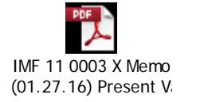

### **Warrant**

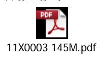

2. (Parent) To record budget authority apportioned by OMB and available for allotment. The only time an apportionment is done for IMF is for Present Value increases to the fund due to Public Law. Any other adjustments (i.e. currency valuation changes) do not require an apportionment. (TC A116)

| 11X0003                                                                                                                                                                                                                  | Debit          | Credit         |
|--------------------------------------------------------------------------------------------------------------------------------------------------------------------------------------------------------------------------|----------------|----------------|
| Budgetary 445000 Unapportioned Authority PYA – X (Current Year) Reimb. Flag – D (Direct) 451000 Apportionment Avail Time – A (Available in Current Period) PYA – X (Current Year) Proprietary | 145,430,113.00 | 145,430,113.00 |

3. (Parent) To record the allotment of authority. (TC A120)

| 11X0003                                                                                                                                                                                                                                     | Debit          | Credit         |
|---------------------------------------------------------------------------------------------------------------------------------------------------------------------------------------------------------------------------------------------|----------------|----------------|
| Budgetary 451000 Apportionment PYA – X (Current Year) Reimb. Flag – D (Direct) 461000 Allotments – Realized Resources Avail Time – A (Available in Current Period) PYA – X (Current Year) Proprietary None | 145,430,113.00 | 145,430,113.00 |

4 (Parent). To record the transfer-out of unobligated unexpired authority to the child account via SF 1151 Nonexpenditure Transfer Authorization. (TC A404) *Actual Nonexpenditure Transfer Authorization is provided below this posting.*

| 11X0003                                         | Debit          | Credit         |
|-------------------------------------------------|----------------|----------------|
| Budgetary                                       |                |                |
| 461000 Allotments – Realized Resources    | 145,430,113.00 |                |
| A Avail Time – A (Available in Current Period)  |                |                |
| PYA – X (Current Year)                          |                |                |
| 417500 Allocation Transfers of Current       |                |                |
| Year Authority for Noninvested Accounts         |                | 145,430,113.00 |
| Authority Type – P (Appropriations)             |                |                |
| BEA – D (Discretionary)                         |                |                |
| Fed/Non-Fed – F (Federal)                       |                |                |
| Trading Partner – 020 (Treasury)                |                |                |
| Trading Partner Main – 0003 (IMF Quota)         |                |                |
| PYA Adj – X (Current Year)                      |                |                |
| Proprietary                                     |                |                |
| 310300 Unexpended Appropriations – Transfers |                |                |
| Out                                             | 145,430,113.00 |                |
| Fed/Non-Fed – F (Federal)                       |                |                |
| Trading Partner – 020 (Treasury)                |                |                |
| Trading Partner Main – 0003 (IMF Quota)         |                |                |
| 101000 Fund Balance with Treasury               |                | 145,430,113.00 |
| Fed/Non-Fed – G (General Fund)                  |                |                |
| Trading Partner – 099 (General Fund)            |                |                |
| Trading Partner Main – 0000 (General Fund)      |                |                |

#### **Nonexpenditure Transfer**

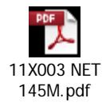

4a (Child). To record the transfer-in of unobligated unexpired authority from the parent account via SF 1151 Nonexpenditure Transfer Authorization. (TC A448)

| 2011X0003                                         | Debit          | Credit         |
|---------------------------------------------------|----------------|----------------|
| Budgetary                                         |                |                |
| 417500 Allocation Transfers of Current-Year    |                |                |
| Authority for Noninvested Accounts                | 145,430,113.00 |                |
| Authority Type – P (Appropriations)               |                |                |
| BEA – D (Discretionary)                           |                |                |
| Fed/Non-Fed – F (Federal)                         |                |                |
| Trading Partner – 011 (EOP)                       |                |                |
| Trading Partner Main – 0003 (IMF Quota)           |                |                |
| PYA Adj – X (Current Year)                        |                | 145,430,113.00 |
| 445000 Unapportioned Authority                 |                |                |
| PYA – X (Current Year) Reimb Flag – D (Direct) |                |                |
|                                                   |                |                |
| Proprietary                                       |                |                |
| 101000 Fund Balance with Treasury              | 145,430,113.00 |                |
| Fed/Non-Fed – G (General Fund)                    |                |                |
| Trading Partner – 099 (General Fund)              |                |                |
| Trading Partner Main – 0000 (General Fund         |                |                |
| 310200 Unexpended Appropriations –                |                |                |
| Transfers-In                                      |                | 145,430,113.00 |
| Fed/Non-Fed – F (Federal)                         |                |                |
| Trading Partner – 011 (EOP)                       |                |                |
| Trading Partner Main – 0003 (IMF Quota)           |                |                |

4b (Child). To record budget authority apportioned by OMB and available for allotment. (TC A116)

| 2011X0003                                                                                                                                                                                                                        | Debit          | Credit         |
|----------------------------------------------------------------------------------------------------------------------------------------------------------------------------------------------------------------------------------|----------------|----------------|
| Budgetary 445000 Unapportioned Authority PYA – X (Current Year) Reimb. Flag – D (Direct) 451000 Apportionment Avail Time – A (Available in Current Period) PYA – X (Current Year) Proprietary None | 145,430,113.00 | 145,430,113.00 |

4c (Child). To record the allotment of authority. (TC A120)

| 2011X0003                                                                                                                                                                                                                                   | Debit          | Credit         |
|---------------------------------------------------------------------------------------------------------------------------------------------------------------------------------------------------------------------------------------------|----------------|----------------|
| Budgetary 451000 Apportionment PYA – X (Current Year) Reimb. Flag – D (Direct) 461000 Allotments – Realized Resources Avail Time – A (Available in Current Period) PYA – X (Current Year) Proprietary None | 145,430,113.00 | 145,430,113.00 |

5 (Child). To record the present value cost. This will cause a reconciliation difference between Treasury and IMF. The credit in 119306 is a contra account balance and serves as an allowance for future loss claims. (TC XXXX) (224 subclass 10 – USSGL 729090 and 224 subclass 06 USSGL 119306)

| 2011X0003                                       | Debit          | Credit         |
|-------------------------------------------------|----------------|----------------|
| Budgetary                                       |                |                |
| 461000 Allotments – Realized Resources    | 145,430,113.00 |                |
| Avail Time – A (Available in Current Period)    |                |                |
| PYA – X (Current Year)                          |                |                |
| 490200 Delivered Orders – Obligations,    |                | 145,430,113.00 |
| Paid Apport Cat - B                          |                |                |
| Apport Cat B – 6011                             |                |                |
| BEA Cat – D (Discretionary)                     |                |                |
| PYA – X (Current Year)                          |                |                |
| Pgm Rpt Cat – 99 (All Other Programs)           |                |                |
| Reimb Flag – D (Direct) Year of BA – NEW     |                |                |
|                                                 |                |                |
| Proprietary                                     |                |                |
| 729090 Losses on International Monetary Fund |                |                |
| Assets                                          | 145,430,113.00 |                |
| Budgetary Impact – D                            |                |                |
| Exch/Nonexch – X (Exchange)                     |                |                |
| Fed/Non-Fed – N (Non-Federal)                   |                |                |
| Program Indicator – P (Assigned to Programs)    |                |                |
| 119306 International Monetary Fund –            |                |                |
| Receivable/Payable Currency Valuation           |                | 145,430,113.00 |
| Adjustment                                      |                |                |

6. (Parent) To record warrant for Quota increase in the International Monetary Fund assets (based Public Law when Quota is increased in SDRs). (TC XXXX) *Note: There are generally two warrants done. To ensure that enough funds are available at the time of disbursement, an initial warrant is requested a couple weeks prior to the funding date. This allows time to havethe paperwork completed and approved and to increase the Fund Balance with Treasury. Since the requirement is to fund 25%, this initial request is sufficient to make the disbursement. Later, a second warrant is requested to true-up the Fund Balance with Treasury to the actual exchange rate used on the funding date.* 

| 11X0003                                             | Debit             | Credit            |
|-----------------------------------------------------|-------------------|-------------------|
| Budgetary                                           |                   |                   |
| 411991 Other Appropriations Realized -           |                   |                   |
| International Monetary Fund – Reserve Tranche | 15,000,000,000.00 |                   |
| Authority Type – P (Appropriations)                 |                   |                   |
| PYA – X (Current Year)                              |                   |                   |
| 411992 Other Appropriations Realized –              | 45,000,000,000.00 |                   |
| International Monetary Fund – Letter of Credit   |                   |                   |
| Authority Type – P (Appropriations)                 |                   |                   |
| PYA – X (Current Year)                              |                   |                   |
| 462090 Unobligated Funds Exempt From             |                   |                   |
| Apportionment – International Monetary           |                   |                   |
| Fund                                                |                   | 60,000,000,000.00 |
| PYA – X (Current Year)                              |                   |                   |
| Proprietary                                         |                   |                   |
| 101000 Fund Balance with Treasury                   | 60,000,000,000.00 |                   |
| Fed/Non-Fed – G (General Fund)                      |                   |                   |
| Trading Partner – 099 (General Fund)                |                   |                   |
| Trading Partner Main – 0000 (General Fund)          |                   |                   |
| 310100 Unexpended Appropriations –                  |                   |                   |
| Appropriations Received                             |                   | 60,000,000,000.00 |
| Fed/Non-Fed – G (General Fund)                      |                   |                   |
| Trading Partner – 099 (General Fund)                |                   |                   |
| Trading Partner Main – 0000 (General Fund)          |                   |                   |

Below are actual documents used for the increase in FY 2016 whereas the posting logic above is illustrative.

#### **Request for the warrant**

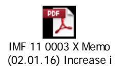

### **Warrant**

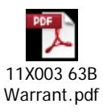

#### **Nonexpenditure Transfer**

7 (Parent). To record the transfer-out of unobligated unexpired authority to the child account via SF 1151 Nonexpenditure Transfer Authorization (Example A). (TC XXXX)

| 11X0003                                           | Debit             | Credit            |
|---------------------------------------------------|-------------------|-------------------|
| Budgetary                                         |                   |                   |
| 462090 Unobligated Funds Exempt From           |                   |                   |
| Apportionment – International Monetary Fund | 60,000,000,000.00 |                   |
| PYA – X (Current Year)                            |                   |                   |
| 417590 Allocation Transfers of Current         |                   |                   |
| Year Authority for Noninvested Accounts –      |                   |                   |
| International Monetary Fund                       |                   | 60,000,000,000.00 |
| Authority Type – P (Appropriations)               |                   |                   |
| Fed/Non-Fed – F (Federal)                         |                   |                   |
| Trading Partner – 020 (Treasury)                  |                   |                   |
| Trading Partner Main – 0003 (IMF Quota)           |                   |                   |
| PYA Adj – X (Current Year)                        |                   |                   |
| Proprietary                                       |                   |                   |
| 310300 Unexpended Appropriations – Transfers   |                   |                   |
| Out                                               |                   |                   |
| Fed/Non-Fed – F (Federal)                         |                   |                   |
| Trading Partner – 020 (Treasury)                  | 60,000,000,000.00 |                   |
| Trading Partner Main – 0003 (IMF Quota)           |                   |                   |
| 101000 Fund Balance with Treasury                 |                   |                   |
| Fed/Non-Fed – G (General Fund)                    |                   |                   |
| Trading Partner – 099 (General Fund)              |                   | 60,000,000,000.00 |
| Trading Partner Main – 0000 (General Fund)        |                   |                   |

8a (Child). To record the transfer-in of unobligated unexpired authority from the parent account via SF 1151 Nonexpenditure Transfer Authorization. (TC XXXX)

| 2011X0003                                                                                       | Debit             | Credit            |
|-------------------------------------------------------------------------------------------------|-------------------|-------------------|
| Budgetary                                                                                       |                   |                   |
| 417590 Allocation Transfers of Current-Year                                                  |                   |                   |
| Authority for Noninvested Accounts – International                                        |                   |                   |
| Monetary Fund                                                                                   | 60,000,000,000.00 |                   |
| Authority Type – P (Appropriations) Fed/Non-Fed – F (Federal) Trading Partner – 011 (EOP) |                   |                   |
| Trading Partner Main – 0003 (IMF Quota) PYA Adj – X (Current Year)                           |                   |                   |
| 462090 Unobligated Funds Exempt From                                                         |                   |                   |
| Apportionment – International Monetary                                                       |                   | 60,000,000,000.00 |
| Fund                                                                                            |                   |                   |
| PYA – X (Current Year)                                                                          |                   |                   |
| Proprietary                                                                                     |                   |                   |
| 101000 Fund Balance with Treasury                                                               |                   |                   |
| Fed/Non-Fed – G (General Fund)                                                                  | 60,000,000,000.00 |                   |
| Trading Partner – 099 (General Fund)                                                            |                   |                   |
| Trading Partner Main – 0000 (General Fund                                                       |                   |                   |
| 310200 Unexpended Appropriations –                                                              |                   |                   |
| Transfers-In                                                                                    |                   | 60,000,000,000.00 |
| Fed/Non-Fed – F (Federal)                                                                       |                   |                   |
| Trading Partner – 011 (EOP)                                                                     |                   |                   |
| Trading Partner Main – 0003 (IMF Quota)                                                         |                   |                   |

### 9 (Child). To record the increase to the Letter of Credit. (TC XXXX) (224 subclass 01 – USGL 119309 and 224 subclass 05 – USSGL 119305)

| 2011X0003                                                       | Debit             | Credit            |
|-----------------------------------------------------------------|-------------------|-------------------|
| Budgetary                                                       |                   |                   |
| None                                                            |                   |                   |
| Proprietary 119309 International Monetary Fund – Currency | 60,000,000,000.00 |                   |
| Holdings                                                        |                   | 60,000,000,000.00 |
| 119305 International Monetary Fund –                            |                   |                   |
| Letter of Credit                                                |                   |                   |

10 (Child). To record the 25 percent to movement to decrease to the Letter of Credit that is moved to FRBNY Account No. 1. (TC XXXX) (224 subclass 05 – USSGL 119305) *Due to the large amount, Fiscal Service Cash Forecasting needs to be notified by FS Form 187 (Agency Report for Treasury Cash Forecasting Advance Notice of Large Deposits or Payments of \$50 Million or More) per Treasury Financial Manual, Volume 1, Part 6, Chapter 8500*

| 2011X0003                                            | Debit             | Credit            |
|------------------------------------------------------|-------------------|-------------------|
| Budgetary                                            |                   |                   |
| None                                                 |                   |                   |
|                                                      |                   |                   |
| Proprietary                                          |                   |                   |
| 119305 International Monetary Fund – Letter of | 45,000,000,000.00 |                   |
| Credit                                               |                   |                   |
| 119333 International Monetary Fund – Reserve      |                   |                   |
| Position                                             | 45,000,000,000.00 |                   |
| 101000 Fund Balance with Treasury                 |                   | 45,000,000,000.00 |
| Fed/Non-Fed – G (General Fund)                       |                   |                   |
| Trading Partner – 099 (General Fund)                 |                   |                   |
| Trading Partner Main – 0000 (General Fund            |                   |                   |
| 119309 International Monetary Fund –                 |                   |                   |
| Currency Holdings                                    |                   | 45,000,000,000.00 |

Below is the actual completed FS 187 that was done in FY 2016 as the above posting logic is illustrative. The excel file shows where Member Countries paid their increase in U.S. Dollars.

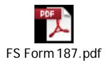

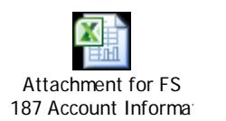

Below is the Daily Treasury Statement, Withdrawals column, under Other Withdrawals: International Monetary Fund for Thursday, February 11, 2016. You will notice that the Fiscal Year to Date is a different amount. The reason is if the transaction is greater than \$50 million, the Fiscal Year to Date picks up all the transactions.

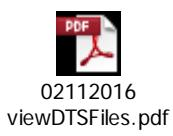

### 11 (Child). To record the monthly activity – payment vouchers. (TC XXXX) (224 subclass 05 – USSGL 119305)

| 312,000,000.00 | 312,000,000.00 |
|----------------|----------------|
|                |                |

### 12 (Child). To record the monthly activity – amendments. (TC XXXX) (224 subclass 05 – USSGL 119305)

| 2011X0003                                                                                                                                                                                                                           | Debit         | Credit        |
|-------------------------------------------------------------------------------------------------------------------------------------------------------------------------------------------------------------------------------------|---------------|---------------|
| Budgetary None                                                                                                                                                                                                                   |               |               |
| Proprietary 101000 Fund Balance with Treasury Fed/Non-Fed – G (General Fund) Trading Partner – 099 (General Fund) Trading Partner Main – 0000 (General Fund 119305 International Monetary Fund – Letter of Credit | 11,000,000.00 | 11,000,000.00 |

13 (Child). To record the monthly activity – Reserve Position (Decrease). (TC XXXX)

| 2011X0003                                                                                                           | Debit         | Credit        |
|---------------------------------------------------------------------------------------------------------------------|---------------|---------------|
| Budgetary None                                                                                                   |               |               |
| Proprietary 119309 International Monetary Fund – Currency Holdings 119333 International Monetary Fund – | 50,000,000.00 |               |
| Reserve Position                                                                                                    |               | 50,000,000.00 |

#### 14 (Child). To record the monthly activity – Reserve Position (Increase). (TC XXXX)

| 2011X0003                                                      | Debit         | Credit        |
|----------------------------------------------------------------|---------------|---------------|
| Budgetary                                                      |               |               |
| None                                                           |               |               |
| Proprietary 119333 International Monetary Fund – Reserve | 40,000,000.00 |               |
| Position                                                       |               |               |
| 119309 International Monetary Fund –                           |               |               |
| Currency Holdings                                              |               | 40,000,000.00 |

### 15 (Child). To record the monthly activity – Currency (Increase). (TC XXXX) (224 subclass 04 – USSGL 11990 and 224 subclass 07 – USSGL 119307)

| Debit         | Credit        |
|---------------|---------------|
|               |               |
| 40,000,000.00 | 40,000,000.00 |
|               |               |

16 (Child). To record the monthly activity – Currency (Decrease). (TC XXXX) (224 subclass 07 – USSGL 119307 and 224 subclass 04 USSGL 119090.)

| 2011X0003                                                       | Debit         | Credit        |
|-----------------------------------------------------------------|---------------|---------------|
| Budgetary None                                               |               |               |
|                                                                 |               |               |
| Proprietary 119307 International Monetary Fund – Deposits | 10,000,000.00 |               |
| with the IMF 119090 Other Cash – International         |               |               |
| Monetary Fund Fed/Non-Fed – N (Non-Federal)                  |               | 10,000,000.00 |

### 17 (Child). To record the monthly activity – Quota (Increase due to CVA). (TC XXXX) (224 subclass 09 – USSGL 119309 and 224 subclass 06 – USSGL 119306)

| 2011X0003                                                                                                                                                                  | Debit          | Credit         |
|----------------------------------------------------------------------------------------------------------------------------------------------------------------------------|----------------|----------------|
| Budgetary None                                                                                                                                                          |                |                |
| Proprietary 119309 International Monetary Fund – Currency Holdings 119306 International Monetary Fund – Receivable/Payable Currency Valuation Adjustment | 410,000,000.00 | 410,000,000.00 |

## 18 (Child). To record the monthly activity – Quota (Decrease due to CVA). (TC XXXX) (224 subclass 06 – USSGL 119306 and 224 subclass 09 – USSGL 119309)

| 2011X0003                                | Debit          | Credit         |
|------------------------------------------|----------------|----------------|
| Budgetary                                |                |                |
| None                                     |                |                |
| Proprietary                              |                |                |
| 119306 International Monetary Fund –     |                |                |
| Receivable/Payable Currency Valuation |                |                |
| Adjustment                               | 375,000,000.00 |                |
| 119309 International Monetary Fund –     |                |                |
| Currency Holdings                        |                | 375,000,000.00 |

19 (Child). To record the monthly activity – Quota (Gain) (TC XXXX) (224 subclass 09 – USSGL 119309 and 224 subclass 18 – USSGL 719090)

| 2011X0003                                                                      | Debit         | Credit        |
|--------------------------------------------------------------------------------|---------------|---------------|
| Budgetary                                                                      |               |               |
| 429590 Adjustments to the International Monetary                               |               |               |
| Fund                                                                           | 90,000,000.00 |               |
| PYA – X (Current Year)                                                         |               |               |
| 462090 Unobligated Funds Exempt From                                           |               |               |
| Apportionment – International Monetary                                      |               | 90,000,000.00 |
| Fund                                                                           |               |               |
| PYA – X (Current Year)                                                         |               |               |
| Proprietary 119309 International Monetary Fund – Currency Holdings | 90,000,000.00 | 90,000,000    |
| 719090 Other Gains on International                                         |               |               |
| Monetary Fund Assets                                                        |               |               |
| Budgetary Impact Indicator – E (Non-Budgetary                                  |               |               |
| Impact) Exch/Nonexch – T (Non-exchange)                                     |               |               |
| Fed/Non-Fed – N (Non-Federal)                                                  |               |               |
| Program Indicator – P (Assigned to Programs)                                   |               |               |

20 (Child). To record the monthly activity – Quota ( Loss) (TC XXXX) (224 subclass 18 – USSGL 729090 and 224 subclass 09 – USSGL 119309)

| 2011X0003                                                                            | Debit         | Credit         |
|--------------------------------------------------------------------------------------|---------------|----------------|
| Budgetary                                                                            |               |                |
| 462090 Unobligated Funds Exempt From                                                 |               |                |
| Apportionment – International Monetary Fund                                       | 75,000,000.00 |                |
| PYA – X (Current Year)                                                               |               |                |
| 429590 Adjustments to the International                                              |               |                |
| Monetary Fund                                                                        |               | 75,000,000.00  |
| PYA – X (Current Year)                                                               |               |                |
|                                                                                      |               |                |
| Proprietary                                                                          |               |                |
| 729090 Other Losses on International                                                 |               |                |
| Monetary Fund Assets                                                                 |               |                |
| Budgetary Impact Indicator – E (Non-Budgetary                                        | 75,000,000.00 |                |
| Impact)                                                                              |               |                |
| Exch/Nonexch – T (Non-exchange)                                                      |               |                |
| Fed/Non-Fed – N (Non-Federal)                                                        |               |                |
| Program Indicator – P (Assigned to Programs) 119309 International Monetary Fund – |               |                |
|                                                                                      |               | 75,000,000,000 |
| Currency Holdings                                                                    |               |                |

21. IMF issues their annual financial statements as of April 30th each year. At this time, the maintenance of value adjustment is settled between the IMF and UST. The IMF assets are in SDRs which is a basket of five different currencies. When there is an increase (Treasury needs more US dollars to satisfy the SDR equivalents), Treasury will request a warrant for this amount. This request is requested in a different TAS (11X0004 Maintenance of Value Adjustment, IMF). For President's Budget presentation, 11X0004 is part of 184-60-0003 (TC XXXX). *For when the maintenance of value adjustment is a decrease, see Part II.*

| 11X0004                                                                                                                                                                                                                                                                                                                                                              | Debit            | Credit           |
|----------------------------------------------------------------------------------------------------------------------------------------------------------------------------------------------------------------------------------------------------------------------------------------------------------------------------------------------------------------------|------------------|------------------|
| Budgetary 411990 Other Appropriations Realized - International Monetary Fund Authority Type – P (Appropriations) PYA – X (Current Year) 462090 Unobligated Funds Exempt From Apportionment – International Monetary Fund PYA – X (Current Year)                                                                                  | 1,183,290,613.25 | 1,183,290,613.25 |
| Proprietary 101000 Fund Balance with Treasury Fed/Non-Fed – G (General Fund) Trading Partner – 099 (General Fund) Trading Partner Main – 0000 (General Fund) 310100 Unexpended Appropriations – Appropriations Received Fed/Non-Fed – G (General Fund) Trading Partner – 099 (General Fund) Trading Partner Main – 0000 (General Fund) | 1,183,290,613.25 | 1,183,290,613.25 |

The below is the supporting documentation for the Maintenance of Value (MOV), request for the warrant and warrant for the above posting logic.

#### **FY 2016 IMF MOV Signed Package – Approving the MOV Settlement with IMF**

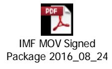

#### **Memo Requesting the Warrant in 11X0004**

IMF 11 0004 X Memo (08.26.16) Warrant I

#### **Warrant**

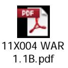

22. To record the transfer-out of maintenance of value adjustment from 11X0004 to 11X0003 via SF 1151 Nonexpenditure Transfer Authorization. (TC XXXX)

| 11X0004                                           | Debit            | Credit           |
|---------------------------------------------------|------------------|------------------|
| Budgetary                                         |                  |                  |
| 462090 Unobligated Funds Exempt From           |                  |                  |
| Apportionment – International Monetary Fund | 1,183,290,613.25 |                  |
| PYA – X (Current Year)                            |                  |                  |
| 417590 Allocation Transfers of Current         |                  |                  |
| Year Authority for Noninvested Accounts –      |                  |                  |
| International Monetary Fund                       |                  |                  |
| Authority Type – P (Appropriations)               |                  | 1,183,290,613.25 |
| Fed/Non-Fed – F (Federal)                         |                  |                  |
| Trading Partner – 011 (EOP)                       |                  |                  |
| Trading Partner Main – 0003 (IMF Quota)           |                  |                  |
| PYA Adj – X (Current Year)                        |                  |                  |
| Proprietary                                       |                  |                  |
| 310300 Unexpended Appropriations – Transfers   |                  |                  |
| Out                                               | 1,183,290,613.25 |                  |
| Fed/Non-Fed – F (Federal)                         |                  |                  |
| Trading Partner – 011 (Treasury)                  |                  |                  |
| Trading Partner Main – 0003 (IMF Quota)           |                  |                  |
| 101000 Fund Balance with Treasury                 |                  | 1,183,290,613.25 |
| Fed/Non-Fed – G (General Fund)                    |                  |                  |
| Trading Partner – 099 (General Fund)              |                  |                  |
| Trading Partner Main – 0000 (General Fund)        |                  |                  |

#### **Nonexpenditure Transfer from 11X0004 to 11X0003**

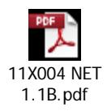

23a (Parent). To record the transfer-in of maintenance of value adjustment from 11X0004 to 11X0003 via SF 1151 Nonexpenditure Transfer Authorization. (TC XXXX)

| 11X0003                                                                                                                                                                  | Debit            | Credit           |
|--------------------------------------------------------------------------------------------------------------------------------------------------------------------------|------------------|------------------|
| Budgetary                                                                                                                                                                |                  |                  |
| 417590 Allocation Transfers of Current-Year                                                                                                                           |                  |                  |
| Authority for Noninvested Accounts – International                                                                                                                 |                  |                  |
| Monetary Fund                                                                                                                                                            | 1,183,290,613.25 |                  |
| Authority Type – P (Appropriations) Fed/Non-Fed – F (Federal) Trading Partner – 011 (EOP) Trading Partner Main – 0004 (IMF Quota) PYA Adj – X (Current Year) |                  |                  |
| 462090 Unobligated Funds Exempt From                                                                                                                                  |                  |                  |
| Apportionment – International Monetary                                                                                                                                |                  | 1,183,290,613.25 |
| Fund                                                                                                                                                                     |                  |                  |
| PYA – X (Current Year)                                                                                                                                                   |                  |                  |
| Proprietary 101000 Fund Balance with Treasury                                                                                                                         | 1,183,290,613.25 |                  |
| Fed/Non-Fed – G (General Fund) Trading Partner – 099 (General Fund) Trading Partner Main – 0000 (General Fund                                                      |                  |                  |
| 310200 Unexpended Appropriations –                                                                                                                                       |                  |                  |
| Transfers-In                                                                                                                                                             |                  | 1,183,290,613.25 |
| Fed/Non-Fed – F (Federal)                                                                                                                                                |                  |                  |
| Trading Partner – 011 (EOP)                                                                                                                                              |                  |                  |
| Trading Partner Main – 0004 (IMF Quota)                                                                                                                                  |                  |                  |

23b (Parent). To record the transfer-out of maintenance of value adjustment to 2011X0003 via SF 1151 Nonexpenditure Transfer Authorization. (TC XXXX)

| 11X0003                                                                                                                                                                                                                                                                                                                                                                                                                                    | Debit            | Credit           |
|--------------------------------------------------------------------------------------------------------------------------------------------------------------------------------------------------------------------------------------------------------------------------------------------------------------------------------------------------------------------------------------------------------------------------------------------|------------------|------------------|
| Budgetary 462090 Unobligated Funds Exempt From Apportionment – International Monetary Fund PYA – X (Current Year) 417590 Allocation Transfers of Current Year Authority for Noninvested Accounts – International Monetary Fund Authority Type – P (Appropriations) Fed/Non-Fed – F (Federal) Trading Partner – 020 (Treasury) Trading Partner Main – 0003 (IMF Quota) PYA Adj – X (Current Year) | 1,183,290,613.25 | 1,183,290,613.25 |
| Proprietary 310300 Unexpended Appropriations – Transfers Out Fed/Non-Fed – F (Federal) Trading Partner – 020 (Treasury) Trading Partner Main – 0003 (IMF Quota) 101000 Fund Balance with Treasury Fed/Non-Fed – G (General Fund) Trading Partner – 099 (General Fund) Trading Partner Main – 0000 (General Fund)                                                                                             | 1,183,290,613.25 | 1,183,290,613.25 |

23c (Child). To record the transfer-in of maintenance of value adjustment from 11X0003 via SF 1151 Nonexpenditure Transfer Authorization. (TC XXXX)

| 2011X0003                                                | Debit            | Credit           |
|----------------------------------------------------------|------------------|------------------|
| Budgetary                                                |                  |                  |
| 417590 Allocation Transfers of Current-Year           |                  |                  |
| Authority for Noninvested Accounts - International    |                  |                  |
|                                                          |                  |                  |
| Monetary Fund                                            | 1,183,290,613.25 |                  |
| Authority Type – P (Appropriations)                      |                  |                  |
| Fed/Non-Fed – F (Federal) Trading Partner – 011 (EOP) |                  |                  |
| Trading Partner Main – 0003 (IMF Quota)                  |                  |                  |
| PYA Adj – X (Current Year)                               |                  |                  |
| 462090 Unobligated Funds Exempt From                  |                  |                  |
| Apportionment – International Monetary                |                  |                  |
| Fund                                                     |                  | 1,183,290,613.25 |
| PYA – X (Current Year)                                   |                  |                  |
| Proprietary                                              |                  |                  |
| 101000 Fund Balance with Treasury                        |                  |                  |
| Fed/Non-Fed – G (General Fund)                           | 1,183,290,613.25 |                  |
| Trading Partner – 099 (General Fund)                     |                  |                  |
| Trading Partner Main – 0000 (General Fund                |                  |                  |
| 310200 Unexpended Appropriations –                       |                  | 1,183,290,613.25 |
| Transfers-In                                             |                  |                  |
| Fed/Non-Fed – F (Federal)                                |                  |                  |
| Trading Partner – 011 (EOP)                              |                  |                  |
| Trading Partner Main – 0003 (IMF Quota)                  |                  |                  |

23d (Child). To record the Amendment to Letter of Credit for Maintenance of Value due IMF. (TC XXXX) (224 Subclass 06 – USSGL 119306 and 224 subclass 05 – USSGL 119305)

| 2011X0003                                                | Debit            | Credit           |
|----------------------------------------------------------|------------------|------------------|
| Budgetary                                                |                  |                  |
| None                                                     |                  |                  |
| Proprietary 119306 International Monetary Fund –   |                  |                  |
| Receivable/Payable Currency Valuation                    | 1,183,290,613.25 |                  |
| 119305 International Monetary Fund – Letter of Credit |                  | 1,183,290,613.25 |

#### 224/RT7/USSGL Matrix for IMF Quota

| 224      | Subclass Title     | RT7 | Business Line    | USSGL  | Old CSGL | New CSGL                    |
|----------|--------------------|-----|------------------|--------|----------|-----------------------------|
| Subclass |                    |     |                  |        |          |                             |
| 01       | Direct Quota       | 961 | Reserve Position | 119309 | 20A1410  | 81140001                    |
| 09       | Maintenance of     | 961 | Reserve Position | 119309 | 20A1411  | 81150001                    |
|          | Value Adjustment   |     |                  |        |          |                             |
|          |                    |     |                  |        |          |                             |
|          |                    |     |                  |        |          |                             |
| 04       | Dollar Deposits    |     | Miscellaneous    | 119090 | 20A1423  | 81700001                    |
| 05       | Letter of Credit   | 961 | Reserve Position | 119305 | 20A1416  | 81160001                    |
| 06       | Receivable/Payable | 961 | Reserve Position | 119306 | 20A1418  | 81170001                    |
|          | for Currency       |     |                  |        |          |                             |
|          | Valuation          |     |                  |        |          |                             |
|          | Adjustment         |     |                  |        |          |                             |
| 07       | Dollar Deposits    | 961 | Reserve Position | 119307 | 20A1422  | 81180001                    |
|          | with IMF           |     |                  |        |          |                             |
| 18       | Quota FX rate      | 961 | Miscellaneous    | 719090 | N/A      | 87100001                    |
|          | changes            |     |                  | 729090 |          | (has not been established i |
|          |                    |     |                  |        |          | GL yet                      |
|          |                    |     |                  |        |          |                             |

#### **Subclass 1**

| Transaction                                       | Column 2                                      | Column 3                                             | MTS Table & Line        | MTS Line Titles                                          |  |
|---------------------------------------------------|-----------------------------------------------|------------------------------------------------------|----------------------------|----------------------------------------------------------|--|
| 9                                                 |                                               | 60,000,000,000.00                                    | 6 8114                     | Direct Quota Payments                                 |  |
|                                                   | -                                             | 60,000,000,000.00                                    |                            |                                                          |  |
| Subclass 4 Transaction                         | Column 2                                      | Column 3                                             |                            |                                                          |  |
| 15                                                |                                               | 40,000,000.00                                        |                            |                                                          |  |
| 16                                                |                                               | (10,000,000.00)                                      |                            |                                                          |  |
|                                                   |                                               | 30,000,000.00                                        |                            |                                                          |  |
| Subclass 5 Transaction 9 10 12 23d | Column 2 11,000,000.00 1,183,290,613.25 | Column 3 (60,000,000,000.00) 15,000,000,000.00 | 6 8116 6 8116 6 8116 | Letter of Credit Letter of Credit Letter of Credit |  |
|                                                   | 1,1,94,290,613.24                             | -45,000,000,000.00                                   |                            |                                                          |  |
| Subclass 5 Transaction 11                   | ALC 20019701 Column 2 0.00              | Column 3 312,000,000.00                           | 6 8116                     | Letter of Credit                                         |  |
|                                                   |                                               | 312,000,000.00                                       |                            |                                                          |  |
| Subclass 6 Transaction                         | Column 2                                      | Column 3                                             |                            | REC/PAY FOR                                              |  |
| 5                                                 |                                               | (145,430,113.00)                                     | 6 8117                     | INTERIM MOV Adjustments REC/PAY FOR INTERIM MOV |  |
| 18                                                |                                               | 375,000,000.00                                       | 6 8117                     | Adjustments                                              |  |
|                                                   |                                               |                                                      |                            |                                                          |  |

Page **40** of **78**

| 17          |          | (410,000,000.00)   | 6 8117 | REC/PAY FOR INTERIM MOV Adjustments REC/PAY FOR |
|-------------|----------|--------------------|--------|----------------------------------------------------------|
| 23d         |          | 1,183,290,613.25   | 6 8117 | INTERIM MOV Adjustments                               |
|             | -        | 1,003,160,500.25   |        |                                                          |
| Subclass 7  |          |                    |        |                                                          |
| Transaction | Column 2 | Column 3           |        |                                                          |
| 15          |          | (40,000,000.00)    | 6 8118 | Dollar Deposits with IMF Dollar Deposits           |
| 16          |          | 10,000,000.00      | 6 8118 | With IMF                                                 |
|             |          | -30,000,000.00     |        |                                                          |
| Subclass 09 |          |                    |        |                                                          |
| Transaction | Column 2 | Column 3           |        |                                                          |
| 18          |          | (375,000,000.00)   | 6 8115 | MOV Adjustments MOV                                |
| 17          |          | 410,000,000.00     | 6 8115 | Adjustments MOV                                       |
| 19          |          | 90,000,000.00      | 6 8115 | Adjustments MOV                                       |
| 20          |          | (75,000,000.00)    | 6 8115 | Adjustments                                              |
|             | -        | - 50,000,000.00 |        |                                                          |
| Subclass 10 |          |                    |        |                                                          |
| Transaction | Column 2 | Column 3           |        |                                                          |
| 5           |          | 145,430,113.00     | 5 4373 | Outlays                                                  |
|             | -        | 145,430,113.00     |        |                                                          |
| Subclass 18 |          |                    |        |                                                          |
| Transaction | Column 2 | Column 3           |        |                                                          |
| 19          |          | (90,000,000.00)    |        |                                                          |

Page **41** of **78**

| 20 | 75,000,000.00   |
|----|-----------------|
|    | (15,000,000.00) |

#### SF-224 **STATEMENT OF TRANSACTIONS**

**DEPT. OR AGENCY Contact: AGENCY LOCATION CODE**

| TREASURY                                                                                                                                                       | Jeffrey Nester 202-XXX-XXXX                                                               |  | 20-01-0099                                                                                                                                             |  |
|----------------------------------------------------------------------------------------------------------------------------------------------------------------|-------------------------------------------------------------------------------------------|--|--------------------------------------------------------------------------------------------------------------------------------------------------------|--|
| BUREAU OR OFFICE                                                                                                                                               | Jeffrey.Nester@treasury.gov                                                               |  | ACCOUNTING PERIOD                                                                                                                                      |  |
| IMF                                                                                                                                                            |                                                                                           |  | November 2017                                                                                                                                          |  |
|                                                                                                                                                                | SECTION I - Classification of Disbur. and Collections by Appro., Fund and Receipt Account |  |                                                                                                                                                        |  |
| Appro. Fund or                                                                                                                                                 | Receipts and Revolving                                                                    |  | Net Disbursements                                                                                                                                      |  |
| Receipt Account                                                                                                                                                | Fund Repayments                                                                           |  |                                                                                                                                                        |  |
| (1)                                                                                                                                                            | (2)                                                                                       |  | (3)                                                                                                                                                    |  |
| (01)20-11X0003 (04)20-11X0003 (05)20-11X0003 (05)20-11X0003 (06)20-11X0003 (07)20-11X0003 (09)20-11X0003 (10)20-11X0003 (18)20-11X0003 | 1,194,290,613.25                                                                          |  | 60,000,000,000.00 30,000,000.00 (45,000,000,000.00) 1,003,160,500.25 (30,000,000.00) 50,000,000.00 145,430,113.00 (15,000,000.00) |  |
| COLUMNAR TOTALS NET TOTAL SECTION I (Column 3 minus column2)                                                                                                | 1,194,290,613.25                                                                          |  | 16,183,590,613.25                                                                                                                                      |  |
|                                                                                                                                                                |                                                                                           |  | 14,989,300,000.00                                                                                                                                      |  |
|                                                                                                                                                                | Section II - Control Totals of Disbursements and Collections Classified in Section I      |  |                                                                                                                                                        |  |

 **1. ADD: Payment Transaction (Net) Classified in Section I, Accomplished by**

| Disbursing Office in:                                                        |                                    | 15,000,000,000.00  |
|------------------------------------------------------------------------------|------------------------------------|--------------------|
| This Month 15,000,000,000.00                                              |                                    |                    |
| 2. DEDUCT: Collections Received This Month (net) and Classified in Section I |                                    |                    |
| 3. NET TOTAL, SECTION II (MUST AGREE WITH NET TOTAL OF SECTION I)            |                                    | 14,989,300.00.00   |
|                                                                              |                                    |                    |
|                                                                              | SECTION III- Status of Collections |                    |
|                                                                              |                                    |                    |
| 1. Balance of Undeposited Collections, Close of                              |                                    |                    |
| Preceding Month                                                              |                                    |                    |
| 2. ADD: Collections Received This Month (Same as Section II, Item 2)         | 11,000,000.00                      |                    |
| 3. DEDUCT: Deposits Presented or Mailed to Bank In:                          |                                    |                    |
| This Month 11,000,000.00                                                  | Prior Month                        |                    |
|                                                                              |                                    | 11,000,000.00      |
| 4. NET TOTAL, SECTION III – Balance of Undeposited Collections,              |                                    |                    |
| Close of Month                                                               | 00.00                              |                    |
|                                                                              |                                    |                    |
| DATE                                                                         |                                    | SIGNATURE AND TITL |
|                                                                              |                                    |                    |

| DEPT. OR AGENCY                                                                           | Contact:                                                                             |                                    |            | AGENCY LOCATION CODE |  |  |
|-------------------------------------------------------------------------------------------|--------------------------------------------------------------------------------------|------------------------------------|------------|----------------------|--|--|
| TREASURY                                                                                  | Jeffrey Nester 202-XXX-XXXX                                                          |                                    | 20-01-9701 |                      |  |  |
| BUREAU OR OFFICE                                                                          |                                                                                      | Jeffrey.Nester@treasury.gov        |            | ACCOUNTING PERIOD    |  |  |
| IMF                                                                                       |                                                                                      |                                    |            | November 2017        |  |  |
| SECTION I - Classification of Disbur. and Collections by Appro., Fund and Receipt Account |                                                                                      |                                    |            |                      |  |  |
|                                                                                           |                                                                                      |                                    |            |                      |  |  |
| Appro. Fund or                                                                            |                                                                                      | Receipts and Revolving             |            | Net Disbursements    |  |  |
| Receipt Account                                                                           |                                                                                      | Fund Repayments                    |            |                      |  |  |
| (1)                                                                                       |                                                                                      | (2)                                |            | (3)                  |  |  |
| (05)20-11X0003                                                                            |                                                                                      |                                    |            | 312,000,000.00       |  |  |
|                                                                                           |                                                                                      |                                    |            |                      |  |  |
|                                                                                           |                                                                                      |                                    |            |                      |  |  |
| COLUMNAR TOTALS                                                                           |                                                                                      |                                    |            |                      |  |  |
|                                                                                           |                                                                                      |                                    |            |                      |  |  |
| NET TOTAL SECTION I (Column 3 minus column2)                                              |                                                                                      |                                    |            | 312,000,000.00       |  |  |
|                                                                                           |                                                                                      |                                    |            |                      |  |  |
|                                                                                           | Section II - Control Totals of Disbursements and Collections Classified in Section I |                                    |            |                      |  |  |
| 1. ADD: Payment Transaction (Net) Classified in Section I, Accomplished by                |                                                                                      |                                    |            |                      |  |  |
| Disbursing Office in:                                                                     |                                                                                      |                                    |            |                      |  |  |
|                                                                                           |                                                                                      |                                    |            | 312,000,000.00       |  |  |
| This Month 312,000,000.00                                                              |                                                                                      | Prior Month                        |            |                      |  |  |
|                                                                                           |                                                                                      |                                    |            |                      |  |  |
| 2. DEDUCT: Collections Received This Month (net) and Classified in Section I              |                                                                                      |                                    |            |                      |  |  |
| 3. NET TOTAL, SECTION II (MUST AGREE WITH NET TOTAL OF SECTION I)                         |                                                                                      |                                    |            | 312,000,000.00       |  |  |
|                                                                                           |                                                                                      |                                    |            |                      |  |  |
|                                                                                           |                                                                                      | SECTION III- Status of Collections |            |                      |  |  |
|                                                                                           |                                                                                      |                                    |            |                      |  |  |
|                                                                                           |                                                                                      |                                    |            |                      |  |  |

| 1. Balance of Undeposited Collections, Close of                      |             |                    |
|----------------------------------------------------------------------|-------------|--------------------|
| Preceding Month                                                      |             |                    |
| 2. ADD: Collections Received This Month (Same as Section II, Item 2) | 0.00        |                    |
| 3. DEDUCT: Deposits Presented or Mailed to Bank In:                  |             |                    |
| This Month 0.00                                                   | Prior Month |                    |
|                                                                      |             | 0.00               |
| 4. NET TOTAL, SECTION III – Balance of Undeposited Collections,      |             |                    |
| Close of Month                                                       | 00.00       |                    |
|                                                                      |             |                    |
| DATE                                                                 |             | SIGNATURE AND TITL |
|                                                                      |             |                    |
|                                                                      |             |                    |

### Monthly Treasury Statement

Table 5 Outlays of the U.S. Government November 2017 and Other Periods

Classification Gross Outlays Applica ble Receipt s Outlays Gross Outlays Applicable Receipts Outlays Gross Outlays Applicable Receipts Outlays International Assistance Programs: International Monetary Programs 145,430,113.00 0.00 145,430,113.00 145,430,113.00 0.00 145,430,113.00 0.00 0.00 0.00 This Month Current Fiscal Year to Date Prior Fiscal Year to Date

#### Table 6 Means of Financing the Deficit or Disposition of Surplus Nov 2017 and Other Periods

| Nov 2017 and Other Periods ACCOUNT |                  |                  |                                 |                   |              |                   |                     |
|---------------------------------------|------------------|------------------|---------------------------------|-------------------|--------------|-------------------|---------------------|
|                                       |                  | NET              | NET TRANSACTIONS                | NET TRANSACTIONS  | BALANCES     | ACCOUNT BALANCES  |                     |
|                                       |                  | TRANSACTIONS     | FISCAL YEAR TO                  | PRIOR FISCAL YEAR | BEGINNING OF | BEGINNING OF THIS | ACCOUNT BALANCES    |
| MTS Line Code                         | TITLE            | THIS MONTH       | DATE THIS YEAR                  | TO DATE           | THIS FISCAL  | MONTH             | CLOSE OF THIS MONTH |
|                                       | DIRECT QUOTA     |                  |                                 |                   |              |                   |                     |
| 9510                                  | PAYMENTS         | 60,000,000,000   | 60,000,000,000                  |                   | 0.00         | 0.00              | 60,000,000,000.00   |
|                                       | MAINTENANCE OF   |                  |                                 |                   |              |                   |                     |
|                                       | VALUE            |                  |                                 |                   |              |                   |                     |
| 9511                                  | ADJUSTMENTS      | -20,000,000.00   | -20,000,000.00                  |                   | 0.00         | 0.00              | -20,000,000.00      |
|                                       |                  |                  |                                 |                   |              |                   |                     |
|                                       | LETTER OF CREDIT |                  |                                 |                   |              |                   |                     |
| 9512                                  | ISSUED TO IMF    |                  | -46484290613 -46,484,290,613.25 |                   | 0.00         | 0.00              | -46,484,290,613.25  |
|                                       |                  |                  |                                 |                   |              |                   |                     |
|                                       | DOLLAR DEPOSITS  |                  |                                 |                   |              |                   |                     |
| 9513                                  | WITH THE IMF     | -30,000,000.00   | -30,000,000.00                  |                   | 0.00         | 0.00              | -30,000,000.00      |
|                                       | RECEIVABLE/PAYA  |                  |                                 |                   |              |                   |                     |
|                                       | BLE (-) FOR      |                  |                                 |                   |              |                   |                     |
|                                       | INTERIM          |                  |                                 |                   |              |                   |                     |
|                                       | MAINTENANCE OF   |                  |                                 |                   |              |                   |                     |
|                                       | VALUE            |                  |                                 |                   |              |                   |                     |
| 9515                                  | ADJUSTMENTS      | 1,218,290,613.25 | 1,218,290,613.25                |                   | 0.00         | 0.00              | 1,218,290,613.25    |
|                                       | LOANS TO         |                  |                                 |                   |              |                   |                     |
|                                       | INTERNATIONAL    |                  |                                 |                   |              |                   |                     |
| 9517                                  | MONETARY FUND    |                  |                                 |                   |              |                   |                     |
|                                       | OTHER CASH AND   |                  |                                 |                   |              |                   |                     |
|                                       | MONETARY         |                  |                                 |                   |              |                   |                     |
| 9518                                  | ASSETS           | 15,000,000.00    | 15,000,000.00                   |                   | 0.00         | 0.00              | 15,000,000.00       |

### Combined Statement

Combined Statement of Receipts, Outlays and Balances of the US Government Appropriations, Outlays, and Balances

| Appropriation or Fund Account Title                                                                                               | Account Symbol Period of Availability | ATA | AID | MAIN | SUB | Balances, Beginning of Fiscal Year | Appropriations and Transfers Other Obligational Authority | Borrowings and Investment (Net) | Outlays (Net) | Balances Withdrawn and Other Transactions | Balances, End of Fiscal Year |
|--------------------------------------------------------------------------------------------------------------------------------------------|---------------------------------------------|-----|-----|------|-----|------------------------------------------|-----------------------------------------------------------------|------------------------------------|------------------|----------------------------------------------------|------------------------------------|
| United States Quota, International Monetary Fund, Funds Appropriated to the President Fund Resources: Transfer To: |                                             |     |     |      |     |                                          |                                                                 |                                    |                  |                                                    |                                    |

Treasury No Year 020 011 0003 000 0.00 0.00 ---------- 145,430,113.00 14,699,000,000.00

#### Pre-Closing Trial Balance

| IMF 2011X0003                                          | Debit              | Credit             |
|--------------------------------------------------------|--------------------|--------------------|
| Proprietary                                            |                    |                    |
| 101000 Fund Balance with Treasury                      | 89,940,540,615.24  |                    |
| 119090 Other Cash – International Monetary Fund     | 179,191,236.20     |                    |
| 119305 International Monetary Fund – Letter of      |                    | 89,795,110,502.23  |
| Credit                                                 |                    |                    |
| 119306 International Monetary Fund –                   | 1,084,947,581.15   |                    |
| Receivable/Payable Currency Valuation                  |                    |                    |
| 119307 International Monetary Fund – Dollar Deposit |                    | 179,191,236.20     |
| with the IMF                                           |                    |                    |
| 119309 International Monetary Fund – Currency       | 89,016,624,336.56  |                    |
| Holdings                                               |                    |                    |
| 119333 International Monetary Fund – Reserve     | 23,181,160,920.01  |                    |
| Position                                               |                    |                    |
| 310000 Unexpended Appropriations                       |                    | 43,912,819,888.99  |
| 310200 Unexpended Appropriations – Transfers-In     |                    | 61,328,720,726.25  |
| 310300 Unexpended Appropriations – Transfers-Out    |                    |                    |
| 331000 Cumulative Results of Operations             |                    | 8,317,052,448.49   |
| 719090 Other Gains on International Monetary Fund      |                    | 90,000,000.00      |
| Assets                                                 |                    |                    |
| 729090 Other Losses on International Monetary Fund     | 220,430,113.00     |                    |
| TOTAL                                                  | 203,622,894,802.16 | 203,622,894,802.16 |
|                                                        |                    |                    |
| Budgetary                                              |                    |                    |
| 417500 Allocations Transfers of Current-Year           | 145,430,113.00     |                    |
| Authority for Non-invested Accounts                    |                    |                    |
| 417590 Allocations Transfers of Current-Year           | 61,183,290,613.25  |                    |
| Authority for Non-invested Accounts – International |                    |                    |
| Monetary Fund                                          |                    |                    |
| 420190 Total Actual Resources – Collected –   | 52,229,872,337.48  |                    |
| International Monetary Fund                            |                    |                    |
| 429590 Adjustment to the International Monetary        | 15,000,000.00      |                    |
| Fund                                                   |                    |                    |
| 462090 Unobligated Funds Exempt From                   |                    | 113,428,162,950.73 |
| Apportionment – International Monetary Fund         |                    |                    |
| 490200 Delivered Orders – Obligations, Paid         |                    | 145,430,113.00     |
| TOTAL                                                  | 113,573,593,063.73 | 113,573,593,063.73 |

| IMF 11X0003                                             | Debit             | Credit            |
|---------------------------------------------------------|-------------------|-------------------|
| Proprietary                                             |                   |                   |
| 310100 Unexpended Appropriations –                   |                   | 60,145,430,113.00 |
| Appropriations Received                                 |                   |                   |
| 310200 Unexpended Appropriations – Transfers-In      |                   | 1,183,290,613.25  |
| 310300 Unexpended Appropriations – Transfers-Out     | 61,328,720,726.25 |                   |
| TOTAL                                                   | 61,328,720,726.25 | 61,328,720,726.25 |
|                                                         |                   |                   |
| Budgetary                                               |                   |                   |
| 411900 Other Appropriations Realized                    | 145,430,113.00    |                   |
| 411991 Other Appropriations Realized – International | 15,000,000,000.00 |                   |
| Monetary Fund – Reserve Tranche                      |                   |                   |
| 411992 Other Appropriations Realized – International | 45,000,000,000.00 |                   |
| Monetary Fund – Letter of Credit                     |                   |                   |
| 417500 Allocations Transfers of Current-Year            |                   | 145,430,113.00    |
| Authority for Non-invested Accounts                     |                   |                   |
| 417590 – Allocations Transfers of Current-Year       |                   | 60,000,000,000.00 |
| Authority in Non-invested Accounts – International   |                   |                   |
| Monetary Fund                                           |                   |                   |
| TOTAL                                                   | 60,145,430,113.00 | 60,145,430,113.00 |

| IMF 11X0004                                             | Debit            | Credit           |
|---------------------------------------------------------|------------------|------------------|
| Proprietary                                             |                  |                  |
| 310100 Unexpended Appropriations –                   |                  | 1,183,290,613.25 |
| Appropriations Received                                 |                  |                  |
| 310300 Unexpended Appropriations – Transfers-Out     | 1,183,290,613.25 |                  |
| TOTAL                                                   | 1,183,290,613.25 | 1,183,290,613.25 |
|                                                         |                  |                  |
| Budgetary                                               |                  |                  |
| 411990 Other Appropriations Realized – International | 1,183,290,613.25 |                  |
| Monetary Fund                                           |                  |                  |
| 417590 Allocations Transfers of Current-Year            |                  | 1,183,290,613.25 |
| Authority for Non-invested Accounts – International  |                  |                  |
| Monetary Fund                                           |                  |                  |
| TOTAL                                                   | 1,183,290,613.25 | 1,183,290,613.25 |

#### Closing Entries

24. (Parent) To record the consolidation of actual net-funded resources and reductions for withdrawn funds (TC F302).

| 11X0003                                                                                                                                                                                 | Debit          | Credit         |
|-----------------------------------------------------------------------------------------------------------------------------------------------------------------------------------------|----------------|----------------|
| Budgetary 417500 Allocation Transfers of Current Year Authority for Non-invested Accounts 420100 Total Actual Resources - Collected 411900 Other Appropriations Realized | 145,430,113.00 | 145,430,113.00 |
| Proprietary N/A                                                                                                                                                                      |                |                |

25. (Parent) To record the consolidation of actual net-funded resources and reductions for withdrawn funds (TC XXXX) *Note: If the balances did not net zero, there would be a balance in 420190.*

| 11X0003                                        | Debit             | Credit            |
|------------------------------------------------|-------------------|-------------------|
| Budgetary                                      |                   |                   |
| 417590 Allocation Transfers of Current Year    |                   |                   |
| Authority for Non-invested Accounts –          |                   |                   |
| International Monetary Fund                    | 60,000,000,000.00 |                   |
| 420190 Total Actual Resources – Collected – |                   |                   |
| International Monetary Fund                    |                   |                   |
| 411991 Other Appropriations Realized -      |                   |                   |
| International Monetary Fund Reserve            |                   |                   |
| Tranche                                        |                   | 15,000,000,000.00 |
| 411992 Other Appropriations Realized -         |                   |                   |
| International Monetary Fund Letter of          |                   |                   |
| Credit                                         |                   | 45,000,000,000.00 |
|                                                |                   |                   |
|                                                |                   |                   |
| Proprietary                                    |                   |                   |
| N/A                                            |                   |                   |

26. (Parent) To record closing of fiscal-year activity to unexpended appropriations (TC F342).

| 11X0003                                            | Debit             | Credit            |
|----------------------------------------------------|-------------------|-------------------|
| Budgetary N/A                                   |                   |                   |
| Proprietary                                        |                   |                   |
| 310100 Unexpended Appropriations –                 |                   |                   |
| Appropriations Received                            | 60,145,430,113.00 |                   |
| 310200 Unexpended Appropriations – Transfers-In | 1,183,290,613.25  |                   |
| 310300 Unexpended Appropriations –                 |                   |                   |
| Transfers-Out                                      |                   | 61,328,720,726.25 |

27. To record the consolidation of actual net-funded resources and reductions for withdrawn funds (TC F3XX). *Note: If the balances did not net zero, there would be a balance in 420190.*

| 11X0004                                                  | Debit            | Credit           |
|----------------------------------------------------------|------------------|------------------|
| Budgetary 417590 Allocation Transfers of Current Year |                  |                  |
| Authority for Non-invested Accounts –                    |                  |                  |
| International Monetary Fund                              | 1,183,290,613.25 |                  |
| 420190 Total Actual Resources - Collected –           |                  |                  |
| International Monetary Fund                              |                  |                  |
| 411990 Other Appropriations Realized –                   |                  |                  |
| International Monetary Fund                              |                  | 1,183,290,613.25 |
|                                                          |                  |                  |
| Proprietary                                              |                  |                  |
| N/A                                                      |                  |                  |

28. To record closing of fiscal-year activity to unexpended appropriations (TC F342).

| 11X0004                                                                      | Debit            | Credit           |
|------------------------------------------------------------------------------|------------------|------------------|
| Budgetary                                                                    |                  |                  |
| N/A                                                                          |                  |                  |
| Proprietary 310100 Unexpended Appropriations – Appropriations Received | 1,183,290,613.25 |                  |
| 310300 Unexpended Appropriations – Transfers-Out                          |                  | 1,183,290,613.25 |

### 29. (Child) To record the consolidation of actual net-funded resources and reductions for withdrawn funds (TC F302).

| 2011X0003                                                                                                                                                         | Debit          | Credit         |
|-------------------------------------------------------------------------------------------------------------------------------------------------------------------|----------------|----------------|
| Budgetary 420100 Total Actual Resources – Collected 417500 Allocation Transfers of Current Year Authority for Non-invested Accounts Proprietary | 145,430,113.00 | 145,430,113.00 |
| N/A                                                                                                                                                               |                |                |

#### 30. (Child) To record the closing of paid delivered orders to total actual resources (TC F314).

| 2011X0003                                                                                                  | Debit          | Credit         |
|------------------------------------------------------------------------------------------------------------|----------------|----------------|
| Budgetary 490200 Delivered Orders – Obligations Paid 420100 Total Actual Resources – Collected | 145,430,113.00 | 145,430,113.00 |
| Proprietary N/A                                                                                         |                |                |

### 31. (Child) To record the consolidation of actual net-funded resources and reductions for withdrawn funds (TC FXXXX).

| 2011X0003                                                                           | Debit             | Credit            |
|-------------------------------------------------------------------------------------|-------------------|-------------------|
| Budgetary                                                                           |                   |                   |
| 420190 Total Actual Resources – Collected – International Monetary Fund       | 61,183,290,613.25 |                   |
| 417590 Allocations Transfers of Current Year Authority for Non-invested Accounts |                   |                   |
| – International Monetary Fund                                                    |                   | 61,183,290,613.25 |
| Proprietary                                                                         |                   |                   |
| N/A                                                                                 |                   |                   |

### 32. (Child) To record closing of revenue, expense, and other financing source accounts to cumulative results of operations (TC F336).

| 2011X0003                                       | Debit          | Credit         |
|-------------------------------------------------|----------------|----------------|
| Budgetary                                       |                |                |
| N/A                                             |                |                |
| Proprietary                                     |                |                |
| 331000 Cumulative Results of Operations         | 130,430,113.00 |                |
| 719090 Other Gains on International Monetary |                |                |
| Fund Assets                                     | 90,000,000.00  |                |
| 729090 Other Losses on International         |                |                |
| Monetary Fund Assets                            |                | 220,430,113.00 |

### 33. To record closing of fiscal-year activity to unexpended appropriations (TC F342).

| 11X0004                                                                                                               | Debit             | Credit            |
|-----------------------------------------------------------------------------------------------------------------------|-------------------|-------------------|
| Budgetary N/A                                                                                                      |                   |                   |
| Proprietary 310200 Unexpended Appropriations – Transfers-In 310000 Unexpended Appropriations – Cumulative | 61,328,720,726.25 | 61,328,720,726.25 |

#### Post-Closing Trial Balance

| IMF 2011X0003                                          | Debit              | Credit             |
|--------------------------------------------------------|--------------------|--------------------|
| Proprietary                                            |                    |                    |
| 101000 Fund Balance with Treasury                      | 89,940,540,615.24  |                    |
| 119090 Other Cash – International Monetary Fund     | 179,191,236.20     |                    |
| 119305 International Monetary Fund – Letter of      |                    | 89,795,110,502.23  |
| Credit                                                 |                    |                    |
| 119306 International Monetary Fund –                   | 1,084,947,581.15   |                    |
| Receivable/Payable Currency Valuation                  |                    |                    |
| 119307 International Monetary Fund – Dollar Deposit |                    | 179,191,236.20     |
| with the IMF                                           |                    |                    |
| 119309 International Monetary Fund – Currency       | 89,016,624,336.56  |                    |
| Holdings                                               |                    |                    |
| 119333 International Monetary Fund – Reserve        | 23,181,160,920.01  |                    |
| Position                                               |                    |                    |
| 310000 Unexpended Appropriations                       |                    | 105,241,540,615.24 |
| 331000 Cumulative Results of Operations             |                    | 8,186,622,335.49   |
| TOTAL                                                  | 203,402,464,689.16 | 203,402,464,689.16 |
|                                                        |                    |                    |
| Budgetary                                              |                    |                    |
| 420190 Total Actual Resources – Collected –   | 113,413,162,950.73 |                    |
| International Monetary Fund                            |                    |                    |
| 429590 Adjustment to the International Monetary        | 15,000,000.00      |                    |
| Fund                                                   |                    |                    |
| 462090 Unobligated Funds Exempt From                   |                    | 113,428,162,950.73 |
| Apportionment – International Monetary Fund         |                    |                    |
| TOTAL                                                  | 113,428,162,950.73 | 113,428,162,950.73 |

| IMF 11X0003                                      | Debit | Credit |
|--------------------------------------------------|-------|--------|
| Proprietary                                      |       |        |
| 310000 Unexpended Appropriations - Cumulative |       |        |
| TOTAL                                            |       |        |
|                                                  |       |        |
| Budgetary                                        |       |        |
| 420100 Total Actual Resources - Collected     |       |        |
| TOTAL                                            |       |        |

| IMF 11X0004                                         | Debit | Credit |
|-----------------------------------------------------|-------|--------|
| Proprietary                                         |       |        |
| 310000 Unexpended Appropriations – Cumulative |       |        |
| TOTAL                                               |       |        |
|                                                     |       |        |
| Budgetary                                           |       |        |
| 420100 Total Actual Resources - Collected        |       |        |
| TOTAL                                               |       |        |

### Control Checks

|            | 2011X0003                                  |  | 11X0003             | 11X0004            |
|------------|--------------------------------------------|--|---------------------|--------------------|
|            | Beginning Balances - after closing entries |  |                     |                    |
| 310000     | (105,241,540,615.24)                       |  |                     |                    |
| 331000     | (8,186,622,335.49)                         |  |                     |                    |
|            | (113,428,162,950.73)                       |  |                     |                    |
| 420190     | 113,413,162,950.73                         |  |                     |                    |
| 429590     | 15,000,000.00                              |  |                     |                    |
|            | 113,428,162,950.73                         |  |                     |                    |
| Difference | -                                          |  |                     |                    |
| Transfers  |                                            |  |                     |                    |
| 310200     | (61,328,720,726.25)                        |  | (1,183,290,613.25)  |                    |
| 310300     |                                            |  | 61,328,720,726.25   | 1,183,290,613.25   |
|            | (61,328,720,726.25)                        |  | 60,145,430,113.00   | 1,183,290,613.25   |
| 417500     | 145,430,113.00                             |  | (145,430,113.00)    |                    |
| 417590     | 61,183,290,613.25                          |  | (60,000,000,000.00) | (1,183,290,613.25) |
|            | 61,328,720,726.25                          |  | (60,145,430,113.00) | (1,183,290,613.25) |
| Difference | -                                          |  | -                   | -                  |
|            |                                            |  |                     |                    |

|                | 2011X0003            | 11X0003                | 11X0004            |
|----------------|----------------------|------------------------|--------------------|
| Assets         |                      |                        |                    |
| 101000         | 89,940,540,615.24    |                        |                    |
| 119090         | 179,191,236.20       |                        |                    |
| 119305         | (89,795,110,502.23)  |                        |                    |
| 119306         | 1,084,947,581.15     |                        |                    |
| 119307         | (179,191,236.20)     |                        |                    |
| 119309         | 89,016,624,336.56    |                        |                    |
| 119333         | 23,181,160,920.01    |                        |                    |
|                | 113,428,162,950.73   |                        |                    |
|                |                      |                        |                    |
| 462000         |                      |                        |                    |
| 426090         | (113,428,162,950.73) |                        |                    |
|                | (113,428,162,950.73) |                        |                    |
|                |                      |                        |                    |
| Difference     | -                    |                        |                    |
| Appropriations | Received             |                        |                    |
| 310100         |                      | (60, 145, 430, 113.00) | (1,183,290,613.25) |
| 411900         |                      | 145, 430, 113.00       |                    |
| 411990         |                      | -                      | 1,183,290,613.25   |
| 411991         |                      | 45,000,000,000.00      |                    |
| 411992         |                      | 15,000,000,000.00      |                    |
|                |                      | 60, 145, 430, 113.00   | 1,183,290,613.25   |
| Difference     |                      | -                      | _                  |

#### **Balance Sheet**

#### As of September 30, 2016

|    | Balance Sheet                                                                                                              | 11X0003 | 11X0004 | 2011X0003          | Total              |
|----|----------------------------------------------------------------------------------------------------------------------------|---------|---------|--------------------|--------------------|
|    | Assets                                                                                                                     |         |         |                    |                    |
|    | Intragovernmental                                                                                                          |         |         |                    |                    |
| 1  | Fund Balance with Treasury (101000 E)                                                                                      |         |         | 89,940,540,615.24  | 89,940,540,615.24  |
| 6  | Total intragovernmental                                                                                                    | 0.00    | 0.00    | 89,940,540,615.24  | 89,940,540,615.24  |
| 7  | Cash and other monetary assets (119090 E, 119305 E, 119306 E, 119307 E, 119309 E, 119333 E)                             | 0.00    |         | 23,487,622,335.49  | 23,487,622,335.49  |
| 15 | Total assets                                                                                                               | 0.00    | 0.00    | 113,428,162,950.73 | 113,428,162,950.73 |
|    | Net Position                                                                                                               |         |         |                    |                    |
| 31 | Unexpended appropriations - All O ther Funds (Combined or Consolidated Totals) (310000 B, 310100 E, 310200 E, 310300 E) | 0.00    | 0.00    | 105,241,540,615.24 | 105,241,540,615.24 |
| 33 | Cumulative results of operations - All O ther Funds (Combined or Consolidated Totals) (331000 B, 719090 E, 729090 E)    |         |         | 8,186,622,335.49   | 8,186,622,335.49   |
| 35 | Total Net Position - All O ther Funds (Combined or Consolidated Totals)                                                 | 0.00    | 0.00    | 113,428,162,950.73 | 113,428,162,950.73 |
| 36 | Total Net Position                                                                                                         | 0.00    | 0.00    | 113,428,162,950.73 | 113,428,162,950.73 |
| 37 | Total liabilities and net position                                                                                         | 0.00    | 0.00    | 113,428,162,950.73 | 113,428,162,950.73 |

#### **Statement of Net Cost**

For the year ended September 30, 2016

*There is no Statement of Net Cost as there are no Operating Expenses or Exchange Revenue.*

| Statement of Net Cost |                        |  | 11X0004 | 2011X0003 | Total |
|-----------------------|------------------------|--|---------|-----------|-------|
|                       |                        |  |         |           |       |
|                       | Gross Program Costs:   |  |         |           |       |
|                       | Program A:             |  |         |           |       |
| 1                     | Gross costs            |  |         |           |       |
| 2                     | Less: earned revenue   |  |         |           |       |
| 3                     | Net program costs:     |  |         |           |       |
| 8                     | Net cost of operations |  |         |           |       |

#### **Statement of Changes in Net Position**

For the year ended September 30, 2016

|    |                                                                 | 11X0003             | 11X0004            | 2011X0003          | Total              |
|----|-----------------------------------------------------------------|---------------------|--------------------|--------------------|--------------------|
|    | Statement of Changes in Net Position                            |                     |                    |                    |                    |
|    | Cumulative Results from Operations:                             |                     |                    |                    |                    |
| 1  | Beginning Balances (331000 B)                                   |                     |                    | 8,317,052,448.49   | 8,317,052,448.49   |
| 3  | Beginning balances, as adjusted                                 |                     |                    | 8,317,052,448.49   | 8,317,052,448.49   |
|    | Other Financing Sources (Nonexchange):                          |                     |                    |                    |                    |
| 13 | Other (+/-) (719090 E, 729090 E)                                |                     |                    | (130,430,113.00)   | (130,430,113.00)   |
| 14 | Total Financing Sources                                         |                     |                    | (130,430,113.00)   | (130,430,113.00)   |
| 15 | Net Cost of Operations (+/-)                                    |                     |                    |                    | -                  |
| 16 | Net Change                                                      |                     |                    | (130,430,113.00)   | (130,430,113.00)   |
| 17 | Cumulative Results of Operations                                |                     |                    | 8,186,622,335.49   | 8,186,622,335.49   |
|    | Unexpended Appropriations:                                      |                     |                    |                    |                    |
| 18 | Beginning Balance (310000 B)                                    |                     |                    | 43,912,819,888.99  | 43,912,819,888.99  |
| 20 | Beginning balance, as adjusted                                  |                     |                    | 43,912,819,888.99  | 43,912,819,888.99  |
|    | Budgetary Financing Sources:                                    |                     |                    |                    |                    |
| 21 | Appropriations received (310100 E)                              | 60,145,430,113.00   | 1,183,290,613.25   |                    | 61,328,720,726.25  |
| 22 | Appropriations transferred-in/out (+/-) (310200 E, 310300 E) | (60,145,430,113.00) | (1,183,290,613.25) | 61,328,720,726.25  | -                  |
| 25 | Total Budgetary Financing Sources                               | -                   | -                  | 61,328,720,726.25  | 61,328,720,726.25  |
| 26 | Total Unexpended Appropriations                                 | -                   | -                  | 105,241,540,615.24 | 105,241,540,615.24 |
| 27 | Net Position                                                    | -                   | -                  | 113,428,162,950.73 | 113,428,162,950.73 |

#### **Statement of Budgetary Resources**

For the year ended September 30, 2016

| Statement of Budgetary Resources |                                                                      |      | 11X0004 | 2011X0003        | Total            |
|----------------------------------|----------------------------------------------------------------------|------|---------|------------------|------------------|
|                                  | Budgetary Resources                                                  |      |         |                  |                  |
| 1290                             | Appropriations (discretionary and mandatory) (411900 E, 417500 E) | 0.00 |         | 145,430,113.00   | 145,430,113.00   |
| 1910                             | Total budgetary resources                                            | 0.00 | 0.00    | 145,430,113.00   | 145,430,113.00   |
| 2190                             | New obligations and upward adjustments (total) (490200 E)            |      |         | 145,430,113.00   | 145,430,113.00   |
| 2500                             | Total budgetary resources                                            | 0.00 | 0.00    | 145,430,113.00   | 145,430,113.00   |
|                                  | Change in obligated balance:                                         |      |         |                  |                  |
| 3012                             | New obligations and upward adjustments (490200 E)                    |      |         | 145,430,113.00   | 145,430,113.00   |
| 3020                             | Outlays (gross) (-) (490200 E)                                       |      |         | (145,430,113.00) | (145,430,113.00) |
| 3200                             | Obligated balance, end of year (+ or -)                              |      |         | 0.00             | 0.00             |
|                                  | Budget authority and outlays, net:                                   |      |         |                  |                  |
| 4175                             | Budget authority, gross (discretionary and mandatory)                | 0.00 | 0.00    | 145,430,113.00   | 145,430,113.00   |
| 4180                             | Budget authority, net (total) (discretionary and mandatory)          | 0.00 | 0.00    | 145,430,113.00   | 145,430,113.00   |
| 4185                             | Outlays, gross (discretionary and mandatory) (490200 E)              | 0.00 | 0.00    | 145,430,113.00   | 145,430,113.00   |
| 4190                             | Outlays, net (total) (discretionary and mandatory)                   | 0.00 | 0.00    | 145,430,113.00   | 145,430,113.00   |
| 4210                             | Agency outlays, net (discretionary and mandatory)                    | 0.00 | 0.00    | 145,430,113.00   | 145,430,113.00   |

#### SF 133 Report on Budget Execution and Budgetary Resources

| SF 133             |      |                                                                           | 11X0003          | 11X0004 | 2011X0003        | Total            |
|--------------------|------|---------------------------------------------------------------------------|------------------|---------|------------------|------------------|
|                    |      | Report on Budget Execution and Budgetary Resources and Budget Program and |                  |         |                  |                  |
| Financing Schedule |      |                                                                           |                  |         |                  |                  |
| S/P                |      | BUDGETARY RESO URCES                                                      |                  |         |                  |                  |
|                    |      |                                                                           |                  |         |                  |                  |
| S/P                |      | 1050 Unobligated balance (total)                                          |                  |         |                  |                  |
| S/P                |      | Budget authority:                                                         |                  |         |                  |                  |
| S/P                |      | Appropriations:                                                           |                  |         |                  |                  |
| S/P                |      | Discretionary:                                                            |                  |         |                  |                  |
| S/P                | 1100 | Appropriation (411900 E)                                                  | 145,430,113.00   |         |                  | 145,430,113.00   |
| S/P                |      | Nonexpenditure transfers:                                                 |                  |         |                  |                  |
| S/P                | 1120 | Appropriations transferred to other accounts (-) (417500 E)               | (145,430,113.00) |         |                  | (145,430,113.00) |
| S/P                | 1121 | Appropriations transferred from other accounts (417500 E)                 |                  |         | 145,430,113.00   | 145,430,113.00   |
| S/P                |      | 1160 Appropriation, discretionary (total)                                 | -                | -       | 145,430,113.00   | 145,430,113.00   |
| S/P                |      | 1900 Budget authority (total)                                             | -                | -       | 145,430,113.00   | 145,430,113.00   |
| S                  |      | 1910 Total budgetary resources                                            | -                | -       | 145,430,113.00   | 145,430,113.00   |
| S                  |      | STATUS O F BUDGETARY RESO URCES                                           |                  |         |                  |                  |
| S                  |      | New obligations and upward adjustments:                                   |                  |         |                  |                  |
| S                  |      | Direct:                                                                   |                  |         |                  |                  |
| S                  | 2002 | Category B (by project) (490200 E)                                        |                  |         | 145,430,113.00   | 145,430,113.00   |
| S                  |      | 2004 Direct obligations (total)                                           |                  |         | 145,430,113.00   | 145,430,113.00   |
| S                  | 2170 | New obligations, unexpired accounts (490200 E)                            |                  |         | 145,430,113.00   | 145,430,113.00   |
| S                  |      | 2190 New obligations and upward adjustments (total)                       |                  |         | 145,430,113.00   | 145,430,113.00   |
| S                  |      | 2500 Total budgetary resources                                            |                  |         | 145,430,113.00   | 145,430,113.00   |
| S                  |      | Memorandum (non-add) entries:                                             |                  |         |                  |                  |
| S                  | 2501 | Subject to apportionment - excluding anticipated amounts (490200 E)       |                  |         | 145,430,113.00   | 145,430,113.00   |
| S/P                |      | CHANGE IN O BLIGATED BALANCE                                              |                  |         |                  |                  |
| S/P                | 3010 | New obligations, unexpired accounts (490200 E)                            |                  |         | 145,430,113.00   | 145,430,113.00   |
| S/P                | 3020 | Outlays (gross) (-) (490200 E)                                            |                  |         | (145,430,113.00) | (145,430,113.00) |
| S/P                |      | 3200 O bligated balance, end of year (+ or -)                             |                  |         | -                |                  |
| S/P                |      | BUDGET AUTHO RITY AND O UTLAYS, NET                                       |                  |         |                  |                  |
| S/P                |      | Discretionary:                                                            |                  |         |                  |                  |
| S/P                |      | Gross budget authority and outlays:                                       |                  |         |                  |                  |
| S/P                |      | 4000 Budget authority, gross                                              | -                | -       | 145,430,113.00   | 145,430,113.00   |
| S/P                | 4010 | O utlays from new discretionary authority (490200 E)                      |                  |         | 145,430,113.00   | 145,430,113.00   |
| S/P                |      | 4020 Outlays, gross (total)                                               |                  |         | 145,430,113.00   | 145,430,113.00   |
| S/P                |      | 4070 Budget authority, net (discretionary)                                |                  |         | 145,430,113.00   | 145,430,113.00   |
| S/P                |      | 4080 O utlays, net (discretionary)                                        |                  |         | 145,430,113.00   | 145,430,113.00   |
| S/P                |      | 4180 Budget authority, net (total)                                        |                  |         | 145,430,113.00   | 145,430,113.00   |
| S/P                |      | 4190 Outlays, net (total)                                                 |                  |         | 145,430,113.00   | 145,430,113.00   |

#### **Schedule P**

| Schedule P                                                                                      |             |                                                                       | 11X0003           | 11X0004 | 2011X0003         | Total             |
|-------------------------------------------------------------------------------------------------|-------------|-----------------------------------------------------------------------|-------------------|---------|-------------------|-------------------|
| Report on Budget Execution and Budgetary Resources and Budget Program and Financing Schedule |             |                                                                       |                   |         |                   |                   |
|                                                                                                 |             |                                                                       |                   |         |                   |                   |
|                                                                                                 |             |                                                                       |                   |         |                   |                   |
| Assoc. Report                                                                                | Line No. | USSGL Account Title                                                   |                   |         |                   |                   |
| S/P                                                                                             |             | BUDGETARY RESO URCES                                                  |                   |         |                   |                   |
|                                                                                                 |             |                                                                       |                   |         |                   |                   |
| P                                                                                               |             | All accounts:                                                         |                   |         |                   |                   |
| P                                                                                               | 0900        | Total new obligations, unexpired accounts (490200 E)                  |                   |         | 145,430,113.00    | 145,430,113.00    |
| S/P                                                                                             |             | Budget authority:                                                     |                   |         |                   |                   |
| S/P                                                                                             |             | Appropriations:                                                       |                   |         |                   |                   |
| S/P                                                                                             |             | Discretionary:                                                        |                   |         |                   |                   |
| S/P                                                                                             | 1100        | Appropriation (411900 E)                                              | 145,430,113.00    |         |                   | 145,430,113.00    |
| S/P                                                                                             |             | Nonexpenditure transfers:                                             |                   |         |                   |                   |
| S/P                                                                                             | 1120        | Appropriations transferred to other accounts (-) (417500 E)           | (145,430,113.00)  |         | 145,430,113.00    | -                 |
| S/P                                                                                             | 1121        | Appropriations transferred from other accounts (417500 E)             |                   |         |                   |                   |
| S/P                                                                                             |             | 1160 Appropriation, discretionary (total)                             | -                 | -       | 145,430,113.00    | 145,430,113.00    |
| S/P                                                                                             |             | 1900 Budget authority (total)                                         | -                 | -       | 145,430,113.00    | 145,430,113.00    |
| P                                                                                               |             | 1930 Total budgetary resources available                              | -                 | -       | 145,430,113.00    | 145,430,113.00    |
|                                                                                                 |             |                                                                       |                   |         |                   |                   |
| S/P                                                                                             |             | CHANGE IN O BLIGATED BALANCE                                          |                   |         |                   |                   |
| S/P                                                                                             | 3010        | New obligations, unexpired accounts (490200 E)                        |                   |         | 145,430,113.00    | 145,430,113.00    |
| S/P                                                                                             | 3020        | Outlays (gross) (-) (490200 E)                                        |                   |         | (145,430,113.00)  | (145,430,113.00)  |
| S/P                                                                                             |             | 3200 O bligated balance, end of year (+ or -)                         |                   |         | -                 |                   |
| S/P                                                                                             |             | BUDGET AUTHO RITY AND O UTLAYS, NET                                   |                   |         |                   |                   |
| S/P                                                                                             |             | Discretionary:                                                        |                   |         |                   |                   |
| S/P                                                                                             |             | Gross budget authority and outlays:                                   |                   |         |                   |                   |
| S/P                                                                                             |             | 4000 Budget authority, gross                                          | -                 | -       | 145,430,113.00    | 145,430,113.00    |
| S/P                                                                                             | 4010        | O utlays from new discretionary authority (490200 E)                  |                   |         | 145,430,113.00    | 145,430,113.00    |
| S/P                                                                                             |             | 4020 Outlays, gross (total)                                           |                   |         | 145,430,113.00    | 145,430,113.00    |
| S/P                                                                                             |             | 4070 Budget authority, net (discretionary)                            | -                 | -       | 145,430,113.00    | 145,430,113.00    |
| S/P                                                                                             |             | 4080 O utlays, net (discretionary)                                    |                   |         | 145,430,113.00    | 145,430,113.00    |
| S/P                                                                                             |             | Budget authority and outlays, net (total)                             |                   |         |                   |                   |
| S/P                                                                                             |             | 4180 Budget authority, net (total)                                    |                   |         |                   |                   |
| S/P                                                                                             |             | 4190 Outlays, net (total)                                             | -                 | -       | 145,430,113.00    | 145,430,113.00    |
| P                                                                                               |             | MEMO RANDUM (NO N-ADD) ENTRIES:                                       |                   |         |                   |                   |
| P                                                                                               |             | International Monetary Fund:                                          |                   |         |                   |                   |
| P                                                                                               |             | 5110 IMF quota reserve tranche increase (P.L. xxx-xxx) (411991)       | 45,000,000,000.00 |         |                   | 45,000,000,000.00 |
| P                                                                                               |             | 5111 IMF quota letter of credit increase (P.L. xxx-xxx) (411992)      | 15,000,000,000.00 |         |                   | 15,000,000,000.00 |
| P                                                                                               |             | 5112 IMF quota reserve tranche, total (119333 E)                      |                   |         | 23,181,160,920.01 | 23,181,160,920.01 |
| P                                                                                               |             | 5113 IMF quota letter of credit, total (119306 E, 119307 E, 119309 E) |                   |         | 89,922,380,681.51 | 89,922,380,681.51 |

#### **Reclassified Balance Sheet for the Closing Package**

As of September 30, 2016

|      | Reclassified Balance Sheet                                                                                                             | Total              |  |  |
|------|----------------------------------------------------------------------------------------------------------------------------------------|--------------------|--|--|
| 1    | Assets                                                                                                                                 |                    |  |  |
| 2    | Non-federal                                                                                                                            |                    |  |  |
| 2.1  | Cash and other monetary assets (119090 E, 119305 E, 119306 E, 119307 E, 119309 E, 119333 E)                                         | 23,487,622,335.49  |  |  |
| 2.9  | Total non-federal assets                                                                                                               | 23,487,622,335.49  |  |  |
|      |                                                                                                                                        |                    |  |  |
| 3    | Federal                                                                                                                                |                    |  |  |
| 3.1  | Fund balance with Treasury (RC 40) (101000)                                                                                            | 89,940,540,615.24  |  |  |
| 3.14 | Total federal assets                                                                                                                   | 89,940,540,615.24  |  |  |
| 4    | Total assets                                                                                                                           | 113,428,162,950.73 |  |  |
| 9    | Net position:                                                                                                                          |                    |  |  |
|      | Net position - funds other than those from dedicated collections 310000 B, 310100 E, 310200 E, 310300 E, 331000 B, 719090 E, 729090 |                    |  |  |
| 9.2  | E)                                                                                                                                     | 113,428,162,950.73 |  |  |
| 10   | Total net position                                                                                                                     | 113,428,162,950.73 |  |  |
| 11   | Total liabilities and net position                                                                                                     | 113,428,162,950.73 |  |  |

#### **Reclassified Statement of Net Cost for the Closing Package**

For year ended September 30, 2016

*There is no Reclassified Statement of Net Cost as there are no Operating Expenses or Exchange Revenue.*

#### **Reclassified Statement of Net Cost**

- **1 Gross cost**
- **2 Non-federal gross cost**
- **6 Total non-federal gross cost**
- **7 Federal gross cost**
- **9 Department total gross cost**
- **10 Earned revenue**
- **11 Non-federal earned revenue**
- **14 Department total earned revenue**
- **15 Net cost of operations**

#### **Reclassified Statement of Changes in Net Position for the Closing Package**

For year ended September 30, 2016

|      | Reclassified Stmt. of Operations and Changes in Net Position                                           | Total               |
|------|--------------------------------------------------------------------------------------------------------|---------------------|
| 1    | Net position, beginning of period (310000 B, 331000 B)                                                 | 52,229,872,337.48   |
| 4    | Net position, beginning of period - adjusted                                                           | 52,229,872,337.48   |
| 5    | Non-federal non-exchange revenue:                                                                      |                     |
| 5.7  | Other taxes and receipts (719090 E, 729090 E)                                                          | (130,430,113.00)    |
| 5.9  | Total non-federal non-exchange revenue                                                                 | (130,430,113.00)    |
| 7    | Budgetary financing sources:                                                                           |                     |
| 7.1  | Appropriations received as adjusted (rescissions and other adjustments) (RC 41) (310100 E)          | 61,328,720,726.25   |
| 7.6  | Non-expenditure transfers-in of unexpended appropriations and financing sources (RC 08) (310200 E)  | (61,328,720,726.25) |
| 7.7  | Non-expenditure transfers-out of unexpended appropriations and financing sources (RC 08) (310300 E) | 61,328,720,726.25   |
| 7.18 | Total budgetary financing sources                                                                      | 61,328,720,726.25   |
| 9    | Net cost of operations (+/-)                                                                           |                     |
| 10   | Net position, end of period                                                                            | 113,428,162,950.73  |

#### **GTAS Edits and Validations Changes**

#### **Validation 76**

| 76E | USSGLs Limited to IMF | 119307, 119309, 119333, 411990, 417590, 417690, 420190, 462090, 719090, and 729090 are restricted to IMF TAS only. |      | CONCATENATED TAS |
|-----|-----------------------------|-----------------------------------------------------------------------------------------------------------------------------|------|------------------|
|     |                             | Add 119090, 411991, 411992, 429590, 435190                                                                               | Pass | 011 X0003000     |
|     |                             |                                                                                                                             | Pass | 011 X0004000     |
|     |                             |                                                                                                                             | Pass | 011 X0074000     |
|     |                             |                                                                                                                             | Pass | 020011 X0003000  |
|     |                             |                                                                                                                             | Pass | 020011 X0074000  |

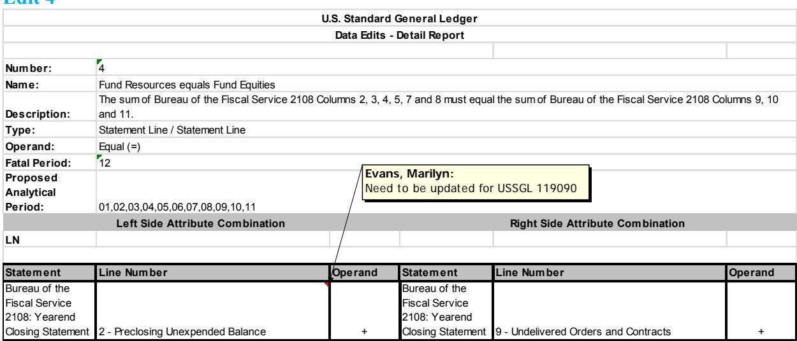

119307 E 119309 E 119333 E

|                                   |                                                                                                                                                                   |                                        | U.S. Standard General Ledger     |        |
|-----------------------------------|-------------------------------------------------------------------------------------------------------------------------------------------------------------------|----------------------------------------|----------------------------------|--------|
|                                   |                                                                                                                                                                   |                                        | Data Edits - Detail Report       |        |
|                                   |                                                                                                                                                                   |                                        |                                  |        |
| Number:                           | 7                                                                                                                                                                 |                                        |                                  |        |
| Name:                             |                                                                                                                                                                   | Reserve Position Business Line Balance |                                  |        |
| Description:                      | Verify that the balances of the USSGL account(s) must equal the balance for Reserve Position (RESPOS) from the Central Accounting and Reporting System (CARS). |                                        |                                  |        |
| Type:                             | USSGL / SMAF                                                                                                                                                      |                                        |                                  |        |
| Operand:                          | Equal (=)                                                                                                                                                         |                                        |                                  |        |
| Fatal Period:                     | 12                                                                                                                                                                |                                        |                                  |        |
| Proposed Analytical Period: | 01,02,03,04,05,06,07,08,09,10,11                                                                                                                                  |                                        |                                  |        |
|                                   |                                                                                                                                                                   | Left Side Attribute Combination        | Right Side Attribute Combination |        |
| SM                                |                                                                                                                                                                   |                                        |                                  |        |
|                                   |                                                                                                                                                                   |                                        |                                  |        |
| USSGL ACCOUNT                  |                                                                                                                                                                   |                                        |                                  |        |
| NUMBER                            | Begin/End                                                                                                                                                         | Fed/NonFed                             | Business Line                    |        |
| 119300                            | E                                                                                                                                                                 | N                                      | RESPOS                           | delete |
| 119305                            | E                                                                                                                                                                 |                                        |                                  |        |
| 119306                            | E                                                                                                                                                                 |                                        |                                  |        |

|                                   |                                       | U.S. Standard General Ledger                                                                                |  |
|-----------------------------------|---------------------------------------|-------------------------------------------------------------------------------------------------------------|--|
|                                   |                                       | Data Edits - Detail Report                                                                                  |  |
|                                   |                                       |                                                                                                             |  |
| Number:                           | 22                                    |                                                                                                             |  |
| Name:                             | Beginning Proprietary Account Balance |                                                                                                             |  |
| Description:                      |                                       | The sum of the beginning balances for the proprietary USSGL accounts must equal zero for each reported TAS. |  |
| Type:                             | USSGL / Zero                          |                                                                                                             |  |
| Operand:                          | Equal (=)                             |                                                                                                             |  |
| Fatal Period:                     | 01,02,03,04,05,06,07,08,09,10,11,12   |                                                                                                             |  |
| Proposed Analytical Period: |                                       |                                                                                                             |  |
|                                   | Left Side Attribute Combination       | Right Side Attribute Combination                                                                            |  |
| SZ                                |                                       |                                                                                                             |  |
|                                   |                                       |                                                                                                             |  |
| USSGL ACCOUNT NUMBER        |                                       |                                                                                                             |  |
|                                   |                                       |                                                                                                             |  |
|                                   | Begin/End                             | Zero                                                                                                        |  |
| 101000                            | B                                     | \$0                                                                                                         |  |
| 110100 110300                  | B B                                |                                                                                                             |  |
| 110900                            | B                                     |                                                                                                             |  |
| 111000                            | B                                     |                                                                                                             |  |
| 112000                            | B                                     |                                                                                                             |  |
| 112500                            | B                                     |                                                                                                             |  |
| 113000                            | B                                     |                                                                                                             |  |
| 113500                            | B                                     |                                                                                                             |  |
| 114500                            | B                                     |                                                                                                             |  |
| 119000                            | B                                     |                                                                                                             |  |

|                                   |                                     |                                                                                                                      | U.S. Standard General Ledger     |     |  |  |
|-----------------------------------|-------------------------------------|----------------------------------------------------------------------------------------------------------------------|----------------------------------|-----|--|--|
|                                   |                                     |                                                                                                                      | Data Edits - Detail Report       |     |  |  |
|                                   | 23                                  |                                                                                                                      |                                  |     |  |  |
| Number: Name:                  | Ending Proprietary Account Balance  |                                                                                                                      |                                  |     |  |  |
| Description:                      |                                     |                                                                                                                      |                                  |     |  |  |
| Type:                             | USSGL / Zero                        | The sum of the pre-closing ending balances for the proprietary USSGL accounts must equal zero for each reported TAS. |                                  |     |  |  |
| Operand:                          | Equal (=)                           |                                                                                                                      |                                  |     |  |  |
| Fatal Period:                     | 01,02,03,04,05,06,07,08,09,10,11,12 |                                                                                                                      |                                  |     |  |  |
| Proposed Analytical Period: |                                     |                                                                                                                      |                                  |     |  |  |
|                                   | Left Side Attribute Combination     |                                                                                                                      | Right Side Attribute Combination |     |  |  |
| SZ                                |                                     |                                                                                                                      |                                  |     |  |  |
| USSGL ACCOUNT NUMBER        | Begin/End                           |                                                                                                                      | Zero                             |     |  |  |
| 101000                            | E                                   |                                                                                                                      | \$0                              |     |  |  |
| 109000                            | E                                   |                                                                                                                      |                                  |     |  |  |
| 110100                            | E                                   |                                                                                                                      |                                  |     |  |  |
| 110300                            | E                                   |                                                                                                                      |                                  |     |  |  |
| 110900                            | E                                   |                                                                                                                      |                                  |     |  |  |
| 111000                            | E                                   |                                                                                                                      |                                  |     |  |  |
| 112000                            | E                                   |                                                                                                                      |                                  |     |  |  |
| 112500                            | E                                   |                                                                                                                      |                                  |     |  |  |
| 113000                            | E                                   |                                                                                                                      |                                  |     |  |  |
| 113500                            | E                                   |                                                                                                                      |                                  |     |  |  |
| 114500                            | E                                   |                                                                                                                      |                                  |     |  |  |
| 119000                            | E                                   |                                                                                                                      |                                  |     |  |  |
| 119090                            | E                                   |                                                                                                                      |                                  | add |  |  |

|                                   |                                                                                                                                |  | U.S. Standard General Ledger     |     |
|-----------------------------------|--------------------------------------------------------------------------------------------------------------------------------|--|----------------------------------|-----|
|                                   |                                                                                                                                |  | Data Edits - Detail Report       |     |
|                                   |                                                                                                                                |  |                                  |     |
| Number:                           | 24                                                                                                                             |  |                                  |     |
| Name: Description:             | Ending Budgetary Account Balance                                                                                               |  |                                  |     |
| Type:                             | The sum of the pre-closing ending balance of USSGL 4000-series accounts must equal zero for each reported TAS. USSGL / Zero |  |                                  |     |
| Operand:                          | Equal (=)                                                                                                                      |  |                                  |     |
| Fatal Period:                     | 01,02,03,04,05,06,07,08,09,10,11,12                                                                                            |  |                                  |     |
| Proposed Analytical Period: |                                                                                                                                |  |                                  |     |
|                                   | Left Side Attribute Combination                                                                                                |  | Right Side Attribute Combination |     |
| SZ                                |                                                                                                                                |  |                                  |     |
|                                   |                                                                                                                                |  |                                  |     |
| USSGL ACCOUNT                  |                                                                                                                                |  |                                  |     |
| NUMBER                            | Begin/End                                                                                                                      |  | Zero                             |     |
| 411900                            | E                                                                                                                              |  |                                  |     |
| 411990                            | E                                                                                                                              |  |                                  |     |
| 411991                            | E                                                                                                                              |  |                                  | add |
| 411992                            | E                                                                                                                              |  |                                  | add |
| 412000                            | E                                                                                                                              |  |                                  |     |
| 412100                            | E                                                                                                                              |  |                                  |     |
| 429000                            | E                                                                                                                              |  |                                  |     |
| 429500                            | E                                                                                                                              |  |                                  |     |
| 429590                            | E                                                                                                                              |  |                                  | add |
| 431000                            | E                                                                                                                              |  |                                  |     |
| 432000                            | E                                                                                                                              |  |                                  |     |
| 435000                            | E                                                                                                                              |  |                                  |     |
| 435100                            | E                                                                                                                              |  |                                  |     |
| 435190                            | E                                                                                                                              |  |                                  | add |
| 435500                            | E                                                                                                                              |  |                                  |     |

|                                             |                                                                                                             |                                 |  | U.S. Standard General Ledger                                                                                                                                                                                   |  |  |  |
|---------------------------------------------|-------------------------------------------------------------------------------------------------------------|---------------------------------|--|----------------------------------------------------------------------------------------------------------------------------------------------------------------------------------------------------------------|--|--|--|
|                                             |                                                                                                             |                                 |  | Data Edits - Detail Report                                                                                                                                                                                     |  |  |  |
|                                             |                                                                                                             |                                 |  |                                                                                                                                                                                                                |  |  |  |
| Number:                                     | 49                                                                                                          |                                 |  |                                                                                                                                                                                                                |  |  |  |
| Normal Warrants Edit (4000 series) Name: |                                                                                                             |                                 |  |                                                                                                                                                                                                                |  |  |  |
| Description:                                |                                                                                                             |                                 |  | The BETC balances from the Central Accounting and Reporting System (CARS) that represent all the normal w arrant activity should equal the sum of USSGL accounts 411100+411200+411500+411700+411800+411900. |  |  |  |
| Type:                                       | USSGL / SMAF                                                                                                |                                 |  |                                                                                                                                                                                                                |  |  |  |
| Operand:                                    | Equal (=)                                                                                                   |                                 |  | Evans, Marilyn: GTAS needs to double check me as the                                                                                                                                                        |  |  |  |
| Fatal Period:                               |                                                                                                             |                                 |  |                                                                                                                                                                                                                |  |  |  |
| Proposed Analytical Period:           | reason we added 90 to the end so no new BETC needed to be created 01,02,03,04,05,06,07,08,09,10,11,12 |                                 |  |                                                                                                                                                                                                                |  |  |  |
|                                             |                                                                                                             | Left Side Attribute Combination |  | Right Side Attribute Combination                                                                                                                                                                               |  |  |  |
| SM                                          |                                                                                                             |                                 |  |                                                                                                                                                                                                                |  |  |  |
|                                             |                                                                                                             |                                 |  |                                                                                                                                                                                                                |  |  |  |
| USSGL ACCOUNT NUMBER                  | Begin/End                                                                                                   |                                 |  | BETC                                                                                                                                                                                                           |  |  |  |
| 411100                                      | E                                                                                                           |                                 |  | AP                                                                                                                                                                                                             |  |  |  |
| 411200                                      | E                                                                                                           |                                 |  | APADV                                                                                                                                                                                                          |  |  |  |
| 411500                                      | E                                                                                                           |                                 |  | APBGT                                                                                                                                                                                                          |  |  |  |
| 411600                                      | E                                                                                                           |                                 |  | APCRREF                                                                                                                                                                                                        |  |  |  |
| 411700                                      | E                                                                                                           |                                 |  | APIND                                                                                                                                                                                                          |  |  |  |
| 411800                                      | E                                                                                                           |                                 |  | APINDYEC                                                                                                                                                                                                       |  |  |  |
| 411900                                      | E                                                                                                           |                                 |  | APINDYED                                                                                                                                                                                                       |  |  |  |
| 411990                                      | E                                                                                                           |                                 |  | add APLIMIND                                                                                                                                                                                                |  |  |  |
| 411991                                      | E                                                                                                           |                                 |  | add APOTH                                                                                                                                                                                                   |  |  |  |
| 411992                                      | E                                                                                                           |                                 |  | APROP add                                                                                                                                                                                                   |  |  |  |
|                                             |                                                                                                             |                                 |  | RS                                                                                                                                                                                                             |  |  |  |
|                                             |                                                                                                             |                                 |  | SWYE                                                                                                                                                                                                           |  |  |  |
|                                             |                                                                                                             |                                 |  |                                                                                                                                                                                                                |  |  |  |

| U.S. Standard General Ledger |  |  |
|------------------------------|--|--|
| Closing Edits Detail Report  |  |  |

| Edit No | Prior Year USSGL Account | Beginning Ending Balance Indicator | Authority Type Code | TAS Status | Reporting Type Code | TAS Status Transitioning Code | Beginning Balance USSGL Account |     |
|------------|-----------------------------------|---------------------------------------------|------------------------|---------------|------------------------|-------------------------------------|------------------------------------------|-----|
| 21         | 412200                            | E                                           |                        |               |                        |                                     | 412200                                   |     |
|            | 411990                            | E                                           |                        |               |                        |                                     | 420190                                   |     |
|            | 411991                            | E                                           |                        |               |                        |                                     | 420190                                   | add |
|            | 411992                            | E                                           |                        |               |                        |                                     | 420190                                   | add |
|            | 417590                            | E                                           |                        |               |                        |                                     | 420190                                   |     |
|            | 417690                            | E                                           |                        |               |                        |                                     | 420190                                   |     |
|            | 420190                            | E                                           |                        |               |                        |                                     | 420190                                   |     |
|            | 435190                            | E                                           |                        |               |                        |                                     | 420190                                   | add |
|            | 422100                            | E                                           |                        |               |                        |                                     | 422100                                   |     |
|            | 423000                            | E                                           |                        |               |                        |                                     | 422100                                   |     |
|            | 422200                            | E                                           |                        |               |                        |                                     | 422200                                   |     |
|            | 423100                            | E                                           |                        |               |                        |                                     | 422200                                   |     |
|            | 419900                            | E                                           |                        |               |                        |                                     | 422500                                   |     |
|            | 422500                            | E                                           |                        |               |                        |                                     | 422500                                   |     |
|            | 423200                            | E                                           |                        |               |                        |                                     | 422500                                   |     |
|            | 423300                            | E                                           |                        |               |                        |                                     | 425100                                   |     |
|            | 425100                            | E                                           |                        |               |                        |                                     | 425100                                   |     |
|            | 428300                            | E                                           |                        |               |                        |                                     | 428300                                   |     |
|            | 428500                            | E                                           |                        |               |                        |                                     | 428500                                   |     |
|            | 428600                            | E                                           |                        |               |                        |                                     | 428600                                   |     |
|            | 423400                            | E                                           |                        |               |                        |                                     | 428700                                   |     |
|            | 428700                            | E                                           |                        |               |                        |                                     | 428700                                   |     |
|            | 429500                            | E                                           |                        |               |                        |                                     | 429500                                   |     |
|            | 429590                            | E                                           |                        |               |                        |                                     | 429590                                   | add |

| U.S. Standard General Ledger Closing Edits Detail Report |                                   |                                             |                        |               |                        |                                     |                                          |        |
|-------------------------------------------------------------|-----------------------------------|---------------------------------------------|------------------------|---------------|------------------------|-------------------------------------|------------------------------------------|--------|
| Edit No                                                  | Prior Year USSGL Account | Beginning Ending Balance Indicator | Authority Type Code | TAS Status | Reporting Type Code | TAS Status Transitioning Code | Beginning Balance USSGL Account |        |
| 45                                                          | 101000                            | E                                           |                        |               |                        |                                     | 101000                                   |        |
|                                                             | 110100                            | E                                           |                        |               |                        |                                     | 110100                                   |        |
|                                                             | 110300                            | E                                           |                        |               |                        |                                     | 110300                                   |        |
|                                                             | 110900                            | E                                           |                        |               |                        |                                     | 110900                                   |        |
|                                                             | 111000                            | E                                           |                        |               |                        |                                     | 111000                                   |        |
|                                                             | 112000                            | E                                           |                        |               |                        |                                     | 112000                                   |        |
|                                                             | 112500                            | E                                           |                        |               |                        |                                     | 112500                                   |        |
|                                                             | 113000                            | E                                           |                        |               |                        |                                     | 113000                                   |        |
|                                                             | 113500                            | E                                           |                        |               |                        |                                     | 113500                                   |        |
|                                                             | 114500                            | E                                           |                        |               |                        |                                     | 114500                                   |        |
|                                                             | 119000                            | E                                           |                        |               |                        |                                     | 119000                                   |        |
|                                                             | 119090                            | E                                           |                        |               |                        |                                     | 119090                                   | add    |
|                                                             | 119300                            | E                                           |                        |               |                        |                                     | 119300                                   | delete |
|                                                             | 119305                            | E                                           |                        |               |                        |                                     | 119305                                   |        |

# Part II Decrease in Maintenance of Value Adjustment

1. (Child) To record in the child account the debit voucher Letter Of Credit for Maintenance of Value due U.S. Treasury. (TC XXXX)

| 2011X0003                                                        | Debit            | Credit           |
|------------------------------------------------------------------|------------------|------------------|
| Budgetary                                                        |                  |                  |
| None                                                             |                  |                  |
| Proprietary 119305 International Monetary Fund – Letter of |                  |                  |
| Credit                                                           | 4,144,394,378.00 |                  |
| 119306 International Monetary Fund –                             |                  |                  |
| Receivable/Payable Currency Valuation                            |                  | 4,144,394,379.00 |

*2.* (Child) To record in the child account the decrease for the maintenance of value adjustment and transfer the excess to 11X0003 via SF 1151 Nonexpenditure Transfer Authorization. As the original and subsequent increases to the unobligated balance were done in previous years, this will be a transfer of prior-year balances. (TC AXXX)

| 2011X0003                                                                                                                                                | Debit            | Credit           |
|----------------------------------------------------------------------------------------------------------------------------------------------------------|------------------|------------------|
| Budgetary 462090 Unobligated Funds Exempt From                                                                                                        |                  |                  |
| Apportionment – International Monetary Fund PYA – X (Current Year)                                                                                 | 4,144,394,378.00 |                  |
| 417690 Allocation Transfers of Prior-Year Balances - International Monetary Fund Authority Type – P (Appropriations)                      |                  | 4,144,394,378.00 |
| Fed/Non-Fed – F (Federal) Trading Partner – 011 (EOP) Trading Partner Main – 0003 (IMF Quota) PYA Adj – X (Current Year)                        |                  |                  |
| Proprietary 310300 Unexpended Appropriations – Transfers Out                                                                                    |                  |                  |
| Fed/Non-Fed – F (Federal) Trading Partner – 011 (EOP) Trading Partner Main – 0003 (IMF                                                             | 4,144,394,378.00 |                  |
| 101000 Fund Balance with Treasury Fed/Non-Fed – G (General Fund) Trading Partner – 099 (General Fund) Trading Partner Main – 0000 (General Fund |                  | 4,144,394,378.00 |

3. (Parent) To record in the parent the transfer in of the excess funds due to the maintenance of value decrease adjustment. (TC XXXX)

| 11X0003                                   | Debit            | Credit           |
|-------------------------------------------|------------------|------------------|
| Budgetary                                 |                  |                  |
| 417690 Allocation Transfers of Prior-Year |                  |                  |
| Balances - International Monetary Fund |                  |                  |
| Authority Type – P (Appropriations)       | 4,144,394,378.00 |                  |
| Fed/Non-Fed – F (Federal)                 |                  |                  |
| Trading Partner – 011 (EOP)               |                  |                  |
| Trading Partner Main – 0003 (IMF Quota)   |                  |                  |
| PYA Adj – X (Current Year)                |                  |                  |
| 462090 Unobligated Funds Exempt From      |                  |                  |
| Apportionment – International Monetary |                  | 4,144,394,378.00 |
| Fund                                      |                  |                  |
| PYA – X (Current Year)                    |                  |                  |
| Proprietary                               |                  |                  |
| 101000 Fund Balance with Treasury         | 4,144,394,378.00 |                  |
| Fed/Non-Fed – G (General Fund)            |                  |                  |
| Trading Partner – 099 (General Fund)      |                  |                  |
| Trading Partner Main – 0000 (General Fund |                  |                  |
| 310200 Unexpended Appropriations –        |                  |                  |
| Transfers-In                              |                  | 4,144,394,378.00 |
| Fed/Non-Fed – F (Federal)                 |                  |                  |
| Trading Partner – 020 ( Treasury)         |                  |                  |
| Trading Partner Main – 0003 (IMF)         |                  |                  |

4. (Parent) To record the return of the excess funds due to the maintenance of value decrease adjustment as a partial cancellation via a surplus warrant. (TC XXXX)

| 11X0003                                                                                                                                                                                                                                        | Debit            | Credit           |
|------------------------------------------------------------------------------------------------------------------------------------------------------------------------------------------------------------------------------------------------|------------------|------------------|
| Budgetary 462090 Unobligated Funds Exempt From Apportionment – International Monetary Fund                                                                                                                                         | 4,144,394,378.00 |                  |
| PYA – X (Current Year) 435190 Partial Cancellation of Authority - International Monetary Fund PYA Adj – X (Current Year)                                                                                                           |                  | 4,144,394,378.00 |
| Proprietary 310600 Unexpended Appropriations – Adjustments Fed/Non-Fed – G (General Fund)                                                                                                                                             | 4,144,394,378.00 |                  |
| Trading Partner – 099 (General Fund) Trading Partner Main – 0000 (General Fund) 101000 Fund Balance with Treasury Fed/Non-Fed – G (General Fund) Trading Partner – 099 (General Fund) Trading Partner Main – 0000 (General Fund |                  | 4,144,394,378.00 |

#### Below are samples

#### *Request to Fiscal Service for the Surplus Warrant*

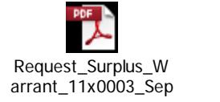

*Non-Expenditure Transfer from Child to Parent – The transfer only covers the excess that was in the Child account as part was in the Parent*

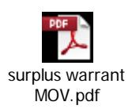

### *Surplus Warrant*

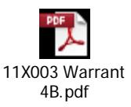

#### List of Abbreviations

Apport Cat Apportionment Category Code

Apport Cat B Apportionment Category B Program Code

Auth Type Code Authority Type Code Avail Time Availability Time Indicator

Bal Sheet Balance Sheet

BEA Cat Budget Enforcement Act Category Indicator

BETC Business Event Type Code

BUDG Budgetary

Cohort Yr Credit Cohort Year

CVA Currency Valuation Adjustment Cust/Noncust Custodial/Noncustodial Indicator Exch/Nonexch Exchange/Nonexchange Indicator EOP Executive Office Of The President

Fed/Non-Fed Federal Non-Federal Code FRBNY Federal Reserve Bank New York

FX Exchange Rate FY Fiscal Year

IMF International Monetary Fund

LOC Letter Of Credit MOV Maintenance of Value MTS Monthly Treasury Statement

Normal Bal Normal Balance

OFP Office of Fiscal Projections Pgm Rpt Cat Program Report Category

PROP Proprietary

PYA Prior Year Adjustment Code Reclass Stmts Reclassification of Statement Reimb Flag Reimbursable Flag Indicator

RMB Chinese renminbi RTP Reserve Tranche Position SDR Special Drawing Rights

SF1151 Standard Form Nonexpenditure Transfer Authorization

SGL Standard General Ledger

Stmt of Budg Res Statement of Budgetary Resources Stmt of Changes in Net Pos Statement of Changes in Net Position Stmt of Cust Activ Statement of Custodial Activity

Stmt of Net Cost Statement of Net Cost

TAFS Treasury Appropriation Fund Symbol TAS Status Treasury Account Symbol Status Code

TC Transaction Code

Trading Parter Trading Partner Agency Identifier Trading Partner Main Trading Partner Main Account Code

Trans Code Treasury Account Symbol Status Transitioning Code

USSGL United States Standard General Ledger

US United States USD United States Dollar

Year of BA Year of Budget Authority Indicator