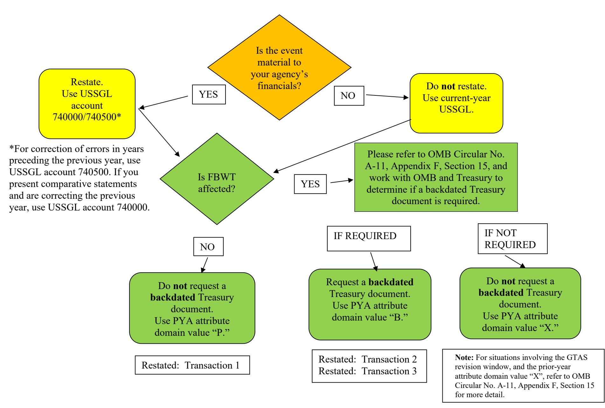

# **PRIOR-PERIOD ADJUSTMENTS DUE TO CORRECTION OF ERRORS -YEARS PRECEDING THE PRIOR YEAR**

### **EFFECTIVE FISCAL 2022**

### **PREPARED BY:**

**GENERAL LEDGER AND ADVISORY BRANCH FISCAL ACCOUNTING OPERATIONS BUREAU OF THE FISCAL SERVICE U.S. DEPARTMENT OF THE TREASURY**

# Version History

| Version Number | Date       | Description of Change                                                    | Effective USSGL TFM |
|----------------|------------|--------------------------------------------------------------------------|------------------------|
| 1.0            | 06/03/2010 | Original Version                                                         | Bulletin No. 2010-04   |
| 2.0            | 08/17/2022 | Updated USSGL accounts, trial balances, and financial statement updates. | Bulletin No. 2022-16   |
| 2.1            | 3/20/2024  | Revised background information and flowchart comment to add clarity      | Bulletin No. 2022-16   |

# **Overview**

Prior-period adjustments (PPAs) may occur as a result of material corrections of errors and/or changes in accounting principles applied to an agency's prior-year financial statements. FASB's Accounting Principles Board Opinion No. 20 notes that "Errors in financial statements result from mathematical mistakes, mistakes in the application of accounting principles, or oversight or misuse of facts that existed at the time the financial statements were prepared." (Par. 13)

Statement of Federal Financial Accounting Standards (SFFAS) No. 21, *Reporting Corrections of Errors and Changes in Accounting Principles,* requires entities to restate prior period financial statements for material corrections of error(s) identified in the current period, if the statements are provided for comparative purposes and if the effect of the error(s) would be material in either period. "When errors are discovered after the issuance of financial statements, and if the financial statements would be materially misstated absent corrections of the errors, corrections should be made as follows:

- If only the current period statements are presented, then the cumulative effect of correcting the error should be reported as a prior period adjustment. The adjustment should be made to the beginning balance of cumulative results of operations, in the statement of changes in net position. (See SFFAS 21, Par. 10a, and Statement Presentation Table below.)
- If comparative financial statements are presented, then the error should be corrected in the earliest affected period presented by correcting any individual amounts on the financial statements. If the earliest period presented is not the period in which the error occurred and the cumulative effect is attributable to prior periods, then the cumulative effect should be reported as a prior period adjustment. The adjustment should be made to the beginning balance of cumulative results of operations, in the statement of changes in net position for the earliest period presented. (See SFFAS 21, Par. 10b and Statement Presentation Table below.)

For changes in accounting principles, prior period financial statements should not be restated, unless specified by the newly respective accounting principles. This scenario focuses on PPAs as they relate to corrections of errors **only**. As a result, the Reclassified Statement of Operation and Changes in Net Position (RSOCNP) crosswalk has separate lines and USSGL accounts to distinguish between corrections of errors for the prior year (USSGL account 740000) and corrections of errors in years preceding the prior year (USSGL account 740500).

Due to the complexity of the scenario and the way it is presented, we suggest the use of a color printer when generating a hardcopy. For purposes of this scenario:

- Budgetary transactions are highlighted in light green
- Proprietary transactions are highlighted in blue
- And "Work Paper Only" transactions are highlighted in peach

### **Statement Presentation Table (for material errors only)**

|                                                                                                                           | If Comparative Financial Statements Are Being Presented (that is, XXCY and XXPY):                                                                                                                                                                                                                                         | If Only Current Period Statements Are Being Presented (that is, XXCY):                                                                                                                                                                                                                                                                                                                                                                                                                                           |
|---------------------------------------------------------------------------------------------------------------------------|------------------------------------------------------------------------------------------------------------------------------------------------------------------------------------------------------------------------------------------------------------------------------------------------------------------------------------|------------------------------------------------------------------------------------------------------------------------------------------------------------------------------------------------------------------------------------------------------------------------------------------------------------------------------------------------------------------------------------------------------------------------------------------------------------------------------------------------------------------------|
| If the error occurred during the earliest affected period presented in the financial statements (i.e., XXPY): | Then, the adjustment is made to the earliest affected period presented by correcting any individual amounts on the financial statements. See Correction of Errors that Occurred in Previous Periods Prior-Period Adjustments (Financial Reporting) and Prior-Year Adjustments (Budgetary Reporting) Scenario. | Then, the adjustment is made to the beginning balance of cumulative results of operations on line 11B (Corrections of errors) of the SCNP. (USSGL account 740000). Also, adjustment made to beginning balance of cumulative results of operations on the RSOCNP if non-federal, line 2.2 (Corrections of errors – non-federal) and if federal line 3.2 (Correction of errors – federal                                                                                       |
| If the error occurred before the earliest period presented in the financial statements (i.e., XXPY 1):     | Then, the adjustment is made to the beginning balance of cumulative results of operations on the SCNP, line 11B (Corrections of errors), for the earliest period presented. (USSGL account 740500) This scenario reflects this example.                                                                 | (RC 29)). (USSGL account 740000). Then, the adjustment is made to the beginning balance of cumulative results of operations on the SCNP, line 11B (Correction of errors). (USSGL account 740000). Also, adjustment made to beginning balance of cumulative results of operations on the RSOCNP if non-federal, line 2.2 (Corrections of errors – non-federal) and if federal line 3.2 (Correction of errors – federal (RC 29)). (USSGL account 740000). |

**Note**: The Statement of Changes in Net Position (SCNP) current-year unadjusted beginning balance must agree with the restated ending balance shown on the prior-year SCNP. **USSGL account 740500 can be used only if comparative financial statements are being presented.**

This scenario uses Prior Year Adjustment Code (PY Adj) as they are defined in the USSGL Treasury Financial Manual (TFM) which is governed by OMB Circular No. A-11.

### **PY Adj Attribute Definition for GTAS Reporting**

Use when changes to obligated or unobligated balances occurred in the previous fiscal year but were not recorded in the appropriate Treasury Appropriation Fund Symbol (TAFS) as of October 1 of the current fiscal year or during the GTAS window. Exclude upward and downward adjustments to current-year/prior-year obligations and most reclassifications from clearing accounts.

#### **Domain Definitions**

### **"B" – Adjustments to prior-year reporting backdated in Treasury's central accounting system**

Use when a PYA **does** affect the Fund Balance With Treasury (FBWT) and **is** backdated in Treasury's central accounting system after the GTAS window has closed for the period being adjusted.

### **"P" – Adjustments to prior-year reporting not backdated in Treasury's central accounting system**

Use when a PYA does **not** affect FBWT and is **not** backdated in Treasury's central accounting System after the GTAS revision window has closed for the period being adjusted.

### **"X" – Not an adjustment to prior-year reporting**

Use when a PYA does not meet the requirements of domains "B" or "P" and for current-period activity. **Note:** For situations involving the GTAS revision window, and the prior-year attribute domain value "X", refer to OMB Circular No. A-11, Appendix F, Section 15 for more detail.

**Note**: The flowchart on the following page can assist with determining:

- 1) Whether or not to restate prior-year financial statements;
- 2) Whether to use USSGL account 740500, "Prior-Period Adjustments Due to Corrections of Errors -Years Preceding the Prior-Year," or a different account.
- 3) Which PY Adj attribute to use and
- 4) Which financial statement the collective information impacts.

Page **6** of **39** 

This document provides guidance for correcting both financial and budgetary reporting errors. The following scenario assumes the activity occurs in a no-year Treasury Account Symbol (TAS). As presented graphically in the previous flowchart, there are six possible reporting outcomes when correcting errors, however, **this scenario only addresses the restated material errors**. The transactions, listed in the detailed chart below, correspond with the transaction numbers in the illustrative transaction section and represent each of the three possible outcomes.

|                                    |                                                              |                       | AFFECTS PROPRIETARY               |                                                             | AFFECTS BUDGETARY                               |                                            |                                            |
|------------------------------------|--------------------------------------------------------------|-----------------------|--------------------------------------|-------------------------------------------------------------|----------------------------------------------------|--------------------------------------------|--------------------------------------------|
| Illustrative Transaction No. | USSGL Account                                                | Transaction Amount | Is it Proprietarily Material?1 | Are Comparative Financial Statements Presented? | Is FBWT USSGL Account 101000 Affected? | Is a backdated document required? | Results                                    |
| 1                                  | 490100 Delivered Orders – Obligations, Unpaid | \$4,000,000           | YES                                  | YES                                                         | NO                                                 | Does Not Apply                          | Not backdated. Use attribute "P." |
| 2                                  | 490200 Delivered Orders – Obligations, Paid      | \$6,000,000           | YES                                  | YES                                                         | YES                                                | YES                                        | Backdated. Use attribute "B."        |
| 3                                  | 490200 Delivered Orders – Obligations, Paid      | \$250,000             | YES                                  | YES                                                         | YES                                                | YES                                        | Backdated. Use attribute "B."        |

1 Each agency should determine its materiality threshold. This scenario assumes that all "YES" answers in this column indicate the amount is material.

## **Listing of USSGL Accounts Used In This Scenario**

| Account     |                                                                                                                           |
|-------------|---------------------------------------------------------------------------------------------------------------------------|
| Number      | Account Name                                                                                                              |
| Budgetary   |                                                                                                                           |
| 411900      | Other Appropriations Realized                                                                                             |
| 420100      | Total Actual Resources – Collected                                                                                     |
| 445000      | Unapportioned - Unexpired Authority                                                                              |
| 451000      | Apportionments                                                                                                            |
| 461000      | Allotments – Realized Resources                                                                                        |
| 490100      | Delivered Orders – Obligations, Unpaid                                                                                 |
| 490200      | Delivered Orders – Obligations, Paid                                                                                   |
| Proprietary |                                                                                                                           |
| 101000      | Fund Balance With Treasury                                                                                                |
| 198000      | Asset for Agency's Custodial and Non-Entity Liabilities – General Fund of the U.S. Government                          |
| 201000      | Liability for Fund Balance With Treasury                                                                                  |
| 211000      | Accounts Payable                                                                                                          |
| 310000      | Unexpended Appropriations – Cumulative                                                                                 |
| 310100      | Unexpended Appropriations – Appropriations Received                                                                    |
| 310500      | Unexpended Appropriations – Prior-Period Adjustments Due to Corrections of Errors – Years Preceding the Prior Year  |
| 310700      | Unexpended Appropriations – Used- Accrued                                                                           |
| 310710      | Unexpended Appropriations Used - Disbursed                                                                             |
| 320100      | Appropriations Outstanding – Warrants Issued                                                                           |
| 320700      | Appropriations Outstanding - Used - Accrued                                                                      |
| 320800      | Appropriations Outstanding – Prior – Period Adjustments                                                             |
| 331000      | Cumulative Results of Operations                                                                                          |
| 570000      | Expended Appropriations -Used - Accrued                                                                             |
| 570005      | Appropriations - Expended - Accrued                                                                              |
| 570010      | Expended Appropriations - Disbursed                                                                                    |
| 570500      | Expended Appropriations – Prior-Period Adjustments Due to Corrections of Errors – Years Preceding the Prior Year |
| 570810      | Appropriations – Expended- Prior-Period Adjustments                                                                 |
| 610000      | Operating Expenses/Program Costs                                                                                          |
| 740500      | Prior-Period Adjustments Due to Corrections of Errors – Years Preceding the Prior Year                              |

#### **Assumptions**

- 1. For the illustrative transactions that begin on page 15, assume the following:
- 2. The following entries in this scenario show that unapportioned authority is reclassified from the PY Adj attribute domain value "X" to the "P" or "B" domain value when a Prior Year Adjustment transaction is processed. Please refer to OMB Circular No. A-11, Appendix F, Section 15, and work with OMB and Treasury to determine if a backdated Treasury document is required.
- 3. If a back dated document is needed, the entity should complete a back dated document request located at: [Backdated Treasury](https://community.max.gov/display/Budget/Backdated+Treasury+Documents)  Documents - Budget Community - [MAX Federal Community](https://community.max.gov/display/Budget/Backdated+Treasury+Documents)
- 4. Prior-period and prior-year adjustments are not standard so there will be transactions that do not have Transaction Codes listed.
- 5. The materiality of a transaction, with respect to restatement requirements, is known when posted.
- 6. The agency's accounting system for the prior period cannot be reopened.
- 7. The activity occurs in a no-year TAFS.
- 8. The GTAS BEA Category Indicator Attribute for illustrations purposes is discretionary.
- 9. The GTAS Reimbursable Flag Indicator is direct.
- 10. General Fund Transactions have been added to scenario.
- 11. Comparative financial statements are presented.
- 12. Budgetary transactions highlighted in light green are prior-year activities that flow to the "Fiscal 2022 Prior-Year Adjustments Activity," Column 7 of the *Financial System Activity and Trial Balance for Budgetary Accounts* chart, on page 25.

- 13. Proprietary transactions highlighted in blue are PPAs that: require financial restatement; flow to the "FY 2022 Prior-Period Adjustments," Column 3 of the *Work Paper Trial Balance for Proprietary Accounts* chart, on page 26; and are entered into the accounting system.
- 14. "Work Paper Only" transactions highlighted in peach are PPAs that: require restatement; flow to the "FY 22 Prior-Period Work-Paper Adjustments," Column 4 of the *Work Paper Trial Balance for Proprietary Accounts* chart, on page 26; and are not entered in an agency's accounting system. These transactions occur outside the system and are used in calculations to determine amounts to be presented in published restated financial statements and reports. When the agency's system cannot be reopened, balances still must be impacted appropriately. However, current-period financial statements cannot be prepared directly from the agency's accounting system. Therefore, Work Paper adjustments are necessary.
- 15. All transactions not highlighted: are current-year transactions, are posted in the accounting system, and do not fall into any of the three highlighted categories (green, blue, or peach).

# **Prior-Year Trial Balances**

#### **System Pre-closing Trial Balance – Fiscal 2021**

| USSGL Account                                                     | Debit          | Credit         |
|-------------------------------------------------------------------|----------------|----------------|
|                                                                   | (in thousands) | (in thousands) |
| Budgetary                                                         |                |                |
| 411900 (X) Other Appropriations Realized                    | 12,000         |                |
| 445000 (X) Unapportioned - Unexpired Authority     |                | 11,000         |
| 490100 (X) Delivered Orders – Obligations, Unpaid        |                | 1,000          |
| Total                                                             | 12,000         | 12,000         |
| Proprietary                                                       |                |                |
| 101000 (G) Fund Balance With Treasury                          | 12,000         |                |
| 211000 (F) Accounts Payable                                       |                | 1,000          |
| 310100 (G) Unexpended Appropriations – Appropriations Received |                | 12,000         |
| 310700 (G) Unexpended Appropriations – Used -Accrued        | 1,000          |                |
| 570000 (G) Expended Appropriations – Used- Accrued       |                | 1,000          |
| 610000 (F) Operating Expenses/Program Costs                    | 1,000          |                |
| Total                                                             | 14,000         | 14,000         |

#### **General Fund of the U.S. Government**

#### **System Pre-closing Trial Balance – Fiscal 2021**

| USSGL Account                                                         | Debit          | Credit         |
|-----------------------------------------------------------------------|----------------|----------------|
|                                                                       | (in thousands) | (in thousands) |
| Budgetary                                                             |                |                |
| None                                                                  |                |                |
| Total                                                                 | -              | -              |
| Proprietary                                                           |                |                |
| 201000 (F) Liability for Fund Balance With Treasury                   |                | 12,000         |
| 320100 (F) Appropriations Outstanding – Warrants Issued            | 12,000         |                |
| 320700 (F) Appropriations Outstanding – Used - Accrued |                | 1,000          |
| 570005 (F) Appropriations - Expended – Accrued               | 1,000          |                |
| Total                                                                 | 13,000         | 13,000         |

#### **System Post-closing Trial Balance – Fiscal 2021 / Beginning Balance – Fiscal 2022**

| USSGL Account                                                 | Debit          | Credit         |
|---------------------------------------------------------------|----------------|----------------|
|                                                               | (in thousands) | (in thousands) |
| Budgetary                                                     |                |                |
| 420100 Total Actual Resources – Collected               | 12,000         |                |
| 445000 (X) Unapportioned - Unexpired Authority |                | 11,000         |
| 490100 (X) Delivered Orders – Obligations, Unpaid    |                | 1,000          |
| Total                                                         | 12,000         | 12,000         |
| Proprietary                                                   |                |                |
| 101000 (G) Fund Balance With Treasury                      | 12,000         |                |
| 211000 (F) Accounts Payable                                   |                | 1,000          |
| 310000 Unexpended Appropriations – Cumulative              |                | 11,000         |
| 320000 Appropriations Outstanding - Cumulative             |                | -              |
| Total                                                         | 12,000         | 12,000         |

#### **General Fund of the U.S. Government**

#### **System Post-closing Trial Balances – Fiscal 2021 / Beginning Balance – Fiscal 2022**

| USSGL Account                                       | Debit          | Credit         |
|-----------------------------------------------------|----------------|----------------|
|                                                     | (in thousands) | (in thousands) |
| Budgetary                                           |                |                |
| None                                                |                |                |
| Total                                               | -              | -              |
| Proprietary                                         |                |                |
| 201000 (F) Liability for Fund Balance With Treasury |                | 12,000         |
| 320000 Appropriations Outstanding - Cumulative   | 11,000         |                |
| 331000 Cumulative Results of Operations             | 1,000          |                |
| Total                                               | 12,000         | 12,000         |

# **Illustrative Transactions (The agency produces comparative financial statements.)**

**Note:** Amounts in this Scenario are rounded in the thousands.

A. To record budgetary authority apportioned by the Office of Management and Budget and available for allotments. OMB apportions \$10,250,000 of the \$11,000,000 prior-year unobligated balance. **(Refer to page 13 for beginning balance**) Generally, the initial apportionment will not include an amount to cover corrections of errors.

| System Only                                | Work Paper Only |        |      |                   |    |    |    |  |
|--------------------------------------------|-----------------|--------|------|-------------------|----|----|----|--|
|                                            | DR              | CR     | TC   |                   | DR | CR | TC |  |
| Budgetary Entry                            |                 |        |      | Budgetary Entry   |    |    |    |  |
| 445000 (X) Unapportioned - Unexpired | 10,250          |        |      | None              |    |    |    |  |
| Authority                                  |                 |        | A116 |                   |    |    |    |  |
| 451000 Apportionments                      |                 | 10,250 |      |                   |    |    |    |  |
|                                            |                 |        |      |                   |    |    |    |  |
|                                            |                 |        |      | Proprietary Entry |    |    |    |  |
| Proprietary Entry                          |                 |        |      | None              |    |    |    |  |
| None                                       |                 |        |      |                   |    |    |    |  |
| General Fund of the U.S. Government (099)  |                 |        |      |                   |    |    |    |  |
| Budgetary Entry                            |                 |        |      |                   |    |    |    |  |
| None                                       |                 |        |      |                   |    |    |    |  |
|                                            |                 |        |      |                   |    |    |    |  |
| Proprietary Entry                          |                 |        |      |                   |    |    |    |  |
| None                                       |                 |        |      |                   |    |    |    |  |

| B. To record the allotment of authority. The agency allots \$10,250,000 of the \$11,000,000 prior-year unobligated balance. |                 |        |      |                   |    |    |    |  |
|-----------------------------------------------------------------------------------------------------------------------------|-----------------|--------|------|-------------------|----|----|----|--|
| System Only                                                                                                                 | Work Paper Only |        |      |                   |    |    |    |  |
|                                                                                                                             | DR              | CR     | TC   |                   | DR | CR | TC |  |
| Budgetary Entry                                                                                                             |                 |        |      | Budgetary Entry   |    |    |    |  |
| 451000 Apportionments                                                                                                       | 10,250          |        |      | None              |    |    |    |  |
| 461000 Allotments – Realized                                                                                          |                 | 10,250 | A120 |                   |    |    |    |  |
| Resources                                                                                                                   |                 |        |      |                   |    |    |    |  |
|                                                                                                                             |                 |        |      |                   |    |    |    |  |
| Proprietary Entry                                                                                                           |                 |        |      | Proprietary Entry |    |    |    |  |
| None                                                                                                                        |                 |        |      | None              |    |    |    |  |
| General Fund of the U.S. Government (099)                                                                                   |                 |        |      |                   |    |    |    |  |
| Budgetary Entry                                                                                                             |                 |        |      |                   |    |    |    |  |
| None                                                                                                                        |                 |        |      |                   |    |    |    |  |
|                                                                                                                             |                 |        |      |                   |    |    |    |  |
| Proprietary Entry                                                                                                           |                 |        |      |                   |    |    |    |  |
| None                                                                                                                        |                 |        |      |                   |    |    |    |  |

1. **During fiscal 2022, an error that occurred in fiscal 2020 was discovered.** The error understated expenses by \$4,000,000. A bill for a delivered unpaid order had not been recorded. No prior related obligation had been previously recorded. **The error is material** and requires restatement of the proprietary financial statements. [2](#page-16-0)

| System Only                                                                                                                                                                                                                                                                                                                                                                                                                                                                                                                                                                                            |                         |                         | Work Paper Only3 |                                                                                                                                                                                                                                                                                                                                                                                                                                                                                                                                                                                              |                         |                         |    |
|--------------------------------------------------------------------------------------------------------------------------------------------------------------------------------------------------------------------------------------------------------------------------------------------------------------------------------------------------------------------------------------------------------------------------------------------------------------------------------------------------------------------------------------------------------------------------------------------------------|-------------------------|-------------------------|------------------|----------------------------------------------------------------------------------------------------------------------------------------------------------------------------------------------------------------------------------------------------------------------------------------------------------------------------------------------------------------------------------------------------------------------------------------------------------------------------------------------------------------------------------------------------------------------------------------------|-------------------------|-------------------------|----|
| `                                                                                                                                                                                                                                                                                                                                                                                                                                                                                                                                                                                                      | DR                      | CR                      | TC               |                                                                                                                                                                                                                                                                                                                                                                                                                                                                                                                                                                                              | DR                      | CR                      | TC |
| Budgetary Entry 445000 (P) Unapportioned – Unexpired Authority 4901004 (P) Delivered Orders –Obligations, Unpaid Proprietary Entry (prior-year activity) 740500 (Z) Prior-Period Adjustments Due to Corrections of Errors –Years Preceding the Prior-Year 211000 (F) Accounts Payable 310500 (G) Unexpended Appropriations – Prior-Period Adjustments Due to Corrections of Errors – Years Preceding the Prior-Year 570500 (G) Expended Appropriations – Prior- Period Adjustments Due to Corrections of Errors – Years Preceding the Prior-Year | 4,000 4,000 4,000 | 4,000 4,000 4,000 | D312 D304     | Budgetary Entry None Proprietary Entry 610000 (F) Operating Expenses/Program Costs 740500 (Z) Prior-Period Adjustments Due to Corrections of Errors–Years Preceding the Prior-Year 570500 (Z) Expended Appropriations – Prior-Period Adjustments Due to Corrections of Errors– Years Preceding the Prior-Year 570000 (G) Expended Appropriations-Used-Accrued 310700 (G) Unexpended Appropriations – Used 310500 (Z) Unexpended Appropriations –Prior- Period Adjustments to Corrections of Errors – Years Preceding the Prior-Year | 4,000 4,000 4,000 | 4,000 4,000 4,000 |    |
|                                                                                                                                                                                                                                                                                                                                                                                                                                                                                                                                                                                                        |                         |                         |                  | General Fund of the U.S. Government (099)                                                                                                                                                                                                                                                                                                                                                                                                                                                                                                                                                    |                         |                         |    |
| Budgetary Entry None Proprietary Entry 570810 (F) Appropriations – Expended- Prior-Period Adjustments 320800 (F) Appropriations Outstanding – Prior –                                                                                                                                                                                                                                                                                                                                                                                                                             |                         |                         |                  | Period Adjustments Due to Corrections of Errors                                                                                                                                                                                                                                                                                                                                                                                                                                                                                                                                              | 4,000                   | 4,000                   |    |

2 A budgetary entry also is required to reflect a beginning balance adjustment. The PYA attribute domain value "P" is used because FBWT is **not** affected. A matching backdated Treasury central accounting document is not prepared after the GTAS window period has closed for the period being corrected.

3 Cross reference all "Work Paper Only Entries" to page 26.

4 USSGL account 490100 was used because USSGL account 480100 was not previously recorded.

1B. Because the prior-year unobligated balance was carried over and then allotted, the agency must show the decrease to the current year accounts 461000 and 445000.

|       |       |    | Work Paper Only   |    |    |    |
|-------|-------|----|-------------------|----|----|----|
| DR    | CR    | TC |                   | DR | CR | TC |
|       |       |    | Budgetary Entry   |    |    |    |
| 4,000 |       |    | None              |    |    |    |
|       | 4,000 |    |                   |    |    |    |
|       |       |    |                   |    |    |    |
|       |       |    | Proprietary Entry |    |    |    |
|       |       |    | None              |    |    |    |
|       |       |    |                   |    |    |    |

5 An attribute to crosswalk to the SF 133 is not needed.

| payment for a delivered paid order has not been recorded. The error is material System Only                                                                                                                                                                                                                                                                                                                                                                                  |                | and requires restatement of the proprietary financial statements. Work Paper Only |              |                                                                                                                                                                                                                                                                                                                                                                                                                                                                                                                                                                                    |                         |                         |    |
|---------------------------------------------------------------------------------------------------------------------------------------------------------------------------------------------------------------------------------------------------------------------------------------------------------------------------------------------------------------------------------------------------------------------------------------------------------------------------------|----------------|--------------------------------------------------------------------------------------|--------------|------------------------------------------------------------------------------------------------------------------------------------------------------------------------------------------------------------------------------------------------------------------------------------------------------------------------------------------------------------------------------------------------------------------------------------------------------------------------------------------------------------------------------------------------------------------------------------|-------------------------|-------------------------|----|
|                                                                                                                                                                                                                                                                                                                                                                                                                                                                                 | DR             | CR                                                                                   | TC           |                                                                                                                                                                                                                                                                                                                                                                                                                                                                                                                                                                                    | DR                      | CR                      | TC |
| Budgetary Entry 445000 (B) Unapportioned – Unexpired Authority 490200 (B) Delivered Orders –Obligations, Paid                                                                                                                                                                                                                                                                                                                                                    | 6,000          | 6,000                                                                                | B102 7    | Budgetary Entry None                                                                                                                                                                                                                                                                                                                                                                                                                                                                                                                                                            |                         |                         |    |
| Proprietary Entry (prior-year activity) 740500 (Z) Prior-Period Adjustments Due to Corrections of Errors –Years Preceding the Prior-Year 101000 (G) Fund Balance With Treasury 310500 (G) Unexpended Appropriations – Prior-Period Adjustments Due to Corrections of Errors – Years Preceding the Prior-Year 570500 (G) Expended Appropriations – Prior-Period Adjustments Due to Corrections of Errors – Years Preceding the Prior-Year | 6,000 6,000 | 6,000 6,000                                                                       | D306 D304 | Proprietary Entry 610000 (F) Operating Expenses/Program Costs 740500 (Z) Prior-Period Adjustments Due to Corrections of Errors – Years Preceding the Prior-Year 570500 (Z) Expended Appropriations – Prior-Period Adjustments Due to Corrections of Errors– Years Preceding the Prior-Year 570010 (G) Expended Appropriations - Disbursed 310710 (G) Unexpended Appropriations – Used Disbursed 310500 (Z) Unexpended Appropriations – Prior-Period Adjustments to Corrections of Errors – Years Preceding the Prior-Year | 6,000 6,000 6,000 | 6,000 6,000 6,000 |    |
|                                                                                                                                                                                                                                                                                                                                                                                                                                                                                 |                |                                                                                      |              | General Fund of the U.S. Government (099)                                                                                                                                                                                                                                                                                                                                                                                                                                                                                                                                          |                         |                         |    |
| Budgetary Entry                                                                                                                                                                                                                                                                                                                                                                                                                                                                 |                |                                                                                      |              |                                                                                                                                                                                                                                                                                                                                                                                                                                                                                                                                                                                    |                         |                         |    |
| None Proprietary Entry 201000 (F) Liability for Fund Balance With Treasury 198000 (F020) Asset for Agency's Custodial and Non-Entity Liabilities – 570810 (F) Appropriations – Expended- Prior-Period Adjustments                                                                                                                                                                                                                                             |                |                                                                                      |              | General Fund of the U.S. Government                                                                                                                                                                                                                                                                                                                                                                                                                                                                                                                                                | 6,000 6,000          | 6,000                   |    |

320800 (F) Appropriations Outstanding – Prior – Period Adjustments Due to Corrections of Errors

6,000

6 A budgetary entry also is required to reflect a beginning balance adjustment. The PYA attribute domain value "B" is used because the agency referred to OMB Circular A-11, Appendix F, Section 15 and worked with OMB & Treasury to determine that a back dated document was needed. A backdated Treasury central accounting document is prepared after the GTAS window period has closed for the period being corrected.

7 TC B102 substitute D306 for proprietary.

2B. Because the prior-year unobligated balance was carried over and then allotted, the agency must show the decrease to the current year accounts 461000 and 445000.

| System Only                                          |       | Work Paper Only |    |                   |    |    |    |
|------------------------------------------------------|-------|-----------------|----|-------------------|----|----|----|
|                                                      | DR    | CR              | TC |                   | DR | CR | TC |
| Budgetary Entry                                      |       |                 |    | Budgetary Entry   |    |    |    |
| 4610008 Allotments – Realized Resources        | 6,000 |                 |    | None              |    |    |    |
| 445000 (X) Unapportioned – Unexpired Authority |       | 6,000           |    |                   |    |    |    |
|                                                      |       |                 |    |                   |    |    |    |
| Proprietary Entry                                    |       |                 |    | Proprietary Entry |    |    |    |
| None                                                 |       |                 |    | None              |    |    |    |

8 An attribute to crosswalk to the SF 133 is not needed.

| 3. During fiscal 2022, an error that occurred in fiscal 2020                                                                                                                                                                                                                                                                                                                                                                                                                                                                                                                                             |                                                                                                | was discovered.   |                        | The error understated expenses and overstated FBWT by \$250,000. A bill and and requires restatement of the proprietary financial statements.                                                                                                                                                                                                                                                                                                                                                                |  |                                                                                              |  |
|----------------------------------------------------------------------------------------------------------------------------------------------------------------------------------------------------------------------------------------------------------------------------------------------------------------------------------------------------------------------------------------------------------------------------------------------------------------------------------------------------------------------------------------------------------------------------------------------------------|------------------------------------------------------------------------------------------------|-------------------|------------------------|-----------------------------------------------------------------------------------------------------------------------------------------------------------------------------------------------------------------------------------------------------------------------------------------------------------------------------------------------------------------------------------------------------------------------------------------------------------------------------------------------------------------------|--|----------------------------------------------------------------------------------------------|--|
|                                                                                                                                                                                                                                                                                                                                                                                                                                                                                                                                                                                                          | payment for a delivered paid order has not been recorded. The error is material System Only |                   |                        |                                                                                                                                                                                                                                                                                                                                                                                                                                                                                                                       |  | 9 DR CR TC 250 250 250 250 250 Prior- 250 250 250 250 |  |
|                                                                                                                                                                                                                                                                                                                                                                                                                                                                                                                                                                                                          |                                                                                                | CR                | TC                     | Work Paper Only                                                                                                                                                                                                                                                                                                                                                                                                                                                                                                       |  |                                                                                              |  |
| Budgetary Entry 445000(B) Unapportioned – Unexpired Authority 490200 (B) Delivered Orders –Obligations, Paid Proprietary Entry (prior-year activity) 740500 (Z) Prior-Period Adjustments Due to Corrections of Errors –Years Preceding the Prior-Year 101000 (G) Fund Balance With Treasury 310500 (G) Unexpended Appropriations – Prior-Period Adjustments Due to Corrections of Errors – Years Preceding the Prior-Year 570500 (G) Expended Appropriations – Prior-Period Adjustments Due to Corrections of Errors – Years Preceding the Prior-Year | DR 250 250 250                                                                        | 250 250 250 | B10210 D306 D304 | Budgetary Entry None Proprietary Entry 610000 (F) Operating Expenses/Program Costs 740500 (Z) Prior-Period Adjustments Due to Corrections of Errors – Years Preceding the Prior- Year 570500 (Z) Expended Appropriations – Prior-Period Adjustments Due to Corrections of Errors– Years Preceding the Prior-Year 570010 (G) Expended Appropriations - Disbursed 310710 (G) Unexpended Appropriations – Used Disbursed 310500 (Z) Unexpended Appropriations – |  |                                                                                              |  |
| Budgetary Entry None                                                                                                                                                                                                                                                                                                                                                                                                                                                                                                                                                                                  |                                                                                                |                   |                        | Period Adjustments to Corrections of Errors – Years Preceding the Prior-Year General Fund of the U.S. Government (099)                                                                                                                                                                                                                                                                                                                                                                                       |  |                                                                                              |  |
| Proprietary Entry 201000 (F) Liability for Fund Balance With Treasury 198000 (F020) Asset for Agency's Custodial and Non-Entity Liabilities – General Fund of the U.S. Government 570810 (F) Appropriations – Expended- Prior-Period Adjustments 320800 (F) Appropriations Outstanding – Prior – Period Adjustments Due to Corrections of Errors                                                                                                                                                                                                                           |                                                                                                |                   |                        |                                                                                                                                                                                                                                                                                                                                                                                                                                                                                                                       |  | 250                                                                                          |  |

9 A budgetary entry also is required to reflect a beginning balance adjustment. The PYA attribute domain value "B" is used because the agency referred to OMB Circular A-11, Appendix F, Section 15 and worked with OMB & Treasury to determine that a back dated document was needed. A backdated Treasury central accounting document is prepared after the GTAS window period has closed for the period being corrected.

10 TC B102 substitute D306 for proprietary.

3B. Because the prior-year unobligated balance was carried over and then allotted, the agency must show the decrease to the current year accounts 461000 and 445000.

| System Only                                          | Work Paper Only |     |    |                   |    |    |    |
|------------------------------------------------------|-----------------|-----|----|-------------------|----|----|----|
|                                                      | DR              | CR  | TC |                   | DR | CR | TC |
| Budgetary Entry                                      |                 |     |    | Budgetary Entry   |    |    |    |
| 46100011 Allotments – Realized Resources       | 250             |     |    | None              |    |    |    |
| 445000 (X) Unapportioned – Unexpired Authority |                 | 250 |    |                   |    |    |    |
|                                                      |                 |     |    |                   |    |    |    |
| Proprietary Entry                                    |                 |     |    | Proprietary Entry |    |    |    |
| None                                                 |                 |     |    | None              |    |    |    |

**Note:** No examples of PYA attribute domain value "X" are shown for prior-year errors in this scenario because the "X" is only used with a backdated document during a GTAS revision window. When using USSGL account 740500, the "X" will not apply because USSGL account 740500 is used when the error is discovered in years preceding the prior-year. Therefore, with USSGL account 740500, the error would be discovered too late to correct something during the GTAS revision window.

11 An attribute to crosswalk to the SF 133 is not needed.

## **Fiscal 2022 Accounting System Activity Summary**

(Assumes agency's accounting system was not reopened to record PPAs or PYAs.)

| USSGL         | System       | System       | System         | System          | System      | System         |
|---------------|--------------|--------------|----------------|-----------------|-------------|----------------|
| Budgetary     | Post-closing | Activity     | Activity       | Pre-closing     | Closing     | Post-closing   |
| and           | Trial        | Fiscal 2022  | Fiscal 2022    | Trial Balance   | Entries     | Trial Balance  |
| Proprietary   | Balance      | (Transaction | (Transactions  | Fiscal 2022     | Fiscal 2022 | Fiscal 2022    |
| Accounts      | Fiscal 2021  | A and B)  | 1,2, and 3) | (calc. Col. 2 + |             | (calc.         |
|               |              |              |                | 3 + 4)       |             | Col. 5 + 6) |
|               |              |              |                |                 |             |                |
| Column 1      | Column 2     | Column 3     | Column 4       | Column 5        | Column 6    | Column 7       |
| 420100        | 12,000       |              |                | 12,000          | (6,250)     | 5,750          |
| 445000 (B)    |              |              | 6,250          | 6,250           | (6,250)     | -              |
| 445000 (P) |              |              | 4,000          | 4,000           | (4,000)     | -              |
| 445000 (X) | (11,000)     | 10,250       | (10,250)       | (11,000)        | 10,250      | (750)          |
| 461000        |              | (10,250)     | 10,250         | -               |             | -              |
| 490100 (P) |              |              | (4,000)        | (4,000)         | 4,000       | -              |
| 490100 (X) | (1,000)      |              |                | (1,000)         | (4,000)     | (5,000)        |
| 490200 (B) |              |              | (6,250)        | (6,250)         | 6,250       | -              |
| Total         | -            |              | -              | -               | -           | -              |
|               |              |              |                |                 |             |                |
| 101000 (G) | 12,000       |              | (6,250)        | 5,750           |             | 5,750          |
| 211000 (F)    | (1,000)      |              | (4,000)        | (5,000)         |             | (5,000)        |
| 310000        | (11,000)     |              |                | (11,000)        | 10,250      | (750)          |
| 310500 (G)    |              |              | 10,250         | 10,250          | (10,250)    | -              |
| 570500 (G)    |              |              | (10,250)       | (10,250)        | 10,250      | -              |
| 610000 (F)    |              |              | -              | -               | -           | -              |
| 740500 (Z)    |              |              | 10,250         | 10,250          | (10,250)    | -              |
| Total         | -            |              | -              | -               | -           | -              |

### **Work Paper Trial Balance for Budgetary Accounts – SBR ONLY[12](#page-23-0)**

| Budgetary | Prior        | Fiscal    | Fiscal 2022   | Restated         | Restated | Restated               | Fiscal 2022  | Fiscal 2022      |
|-----------|--------------|-----------|---------------|------------------|----------|------------------------|--------------|------------------|
| Accounts  | Year         | 2021      | Prior-Period  | Pre-close        | Fiscal   | Post-close             | Current-Year | SBR for          |
|           | Adjustment   | Published | Adjustments   | for Fiscal 2021  | 2021     | Fiscal 2021            | Activity for | Publication      |
|           | Attribute    | Pre-close | (Transactions | SBR              | SBR      | SBR                    | SBR          | (Calc. Col. 7+8) |
|           | (N/A for the |           | 1, 2, and 3)  | (Calc. Col. 3+4) | Closing  | (Calc. Col. 5+6) |              |                  |
|           | SBR)         |           |               |                  | Entries  |                        |              |                  |
|           |              |           |               |                  |          |                        |              |                  |
| Column 1  | Column 2     | Column 3  | Column 4      | Column 5         | Column 6 | Column 7               | Column 8     | Column 9         |
| 411900    | N/A          | 12,000    |               | 12,000           | (12,000) | -                      |              | -                |
| 420100    | N/A          |           |               | -                | 5,750    | 5,750                  |              | 5,750            |
| 445000    | N/A          | (11,000)  | 10,250        | (750)            | -        | (750)                  |              | (750)            |
| 490100    | N/A          | (1,000)   | (4,000)       | (5,000)          |          | (5,000)                |              | (5,000)          |
| 490200    | N/A          |           | (6,250)       | (6,250)          | 6,250    | -                      |              | -                |
| Total     |              | -         | -             | -                | -        | -                      | -            | -                |

12 Considers FASAB Standard No. 21 requirements regarding PPAs but does not consider OMB Circular No. A-11 requirements regarding PYAs.

# **Financial System Activity and Trial Balance for Budgetary Accounts (Used To Prepare SF 133/Schedule P and 2022 SBR)[13](#page-24-0)**

| Budgetary Accounts | Prior-Year Adjustment Attribute | Fiscal 2021 Trial Bal. (used to prepare SF 133/Schedule P) | Fiscal 2021 Closing Entries Activity | Fiscal 2021 Post-closing Trial Balance (Calc. Col. 3+4) | Fiscal 2022 Apportionment and Allotment (Transactions A & B) | Fiscal 2022 Prior-Year Adjustments Activity (Transactions 1, 2 and 3 with "B" and "P" PYA domains) | Fiscal 2022 Prior-Year Activity | Fiscal 2022 Trial Balance (used to prepare SF 133/Schedule P) (Calc. Col.5+6+7+8) |
|-----------------------|---------------------------------------|------------------------------------------------------------------------|-----------------------------------------------|------------------------------------------------------------------------|-----------------------------------------------------------------------------|-------------------------------------------------------------------------------------------------------------------------|---------------------------------------|-----------------------------------------------------------------------------------------------|
| Column 1              | Column 2                              | Column 3                                                               | Column 4                                      | Column 5                                                               | Column 6                                                                    | Column 7                                                                                                                | Column 8                              | Column 9                                                                                      |
| 411900                | X                                     | 12,000                                                                 | (12,000)                                      | -                                                                      |                                                                             | -                                                                                                                       |                                       | -                                                                                             |
| 420100                |                                       |                                                                        | 12,000                                        | 12,000                                                                 |                                                                             | -                                                                                                                       |                                       | 12,000                                                                                        |
| 445000                | B                                     |                                                                        |                                               | -                                                                      |                                                                             | 6,250                                                                                                                   |                                       | 6,250                                                                                         |
| 445000                | P                                     |                                                                        |                                               | -                                                                      |                                                                             | 4,000                                                                                                                   |                                       | 4,000                                                                                         |
| 445000                | X                                     | (11,000)                                                               |                                               | (11,000)                                                               | 10,250                                                                      | (10,250)                                                                                                                |                                       | (11,000)                                                                                      |
| 461000                |                                       |                                                                        |                                               | -                                                                      | (10,250)                                                                    | 10,250                                                                                                                  |                                       | -                                                                                             |
| 490100                | P                                     |                                                                        |                                               | -                                                                      |                                                                             | (4,000)                                                                                                                 |                                       | (4,000)                                                                                       |
| 490100                | X                                     | (1,000)                                                                |                                               | (1,000)                                                                |                                                                             |                                                                                                                         |                                       | (1,000)                                                                                       |
| 490200                | B                                     |                                                                        |                                               | -                                                                      |                                                                             | (6,250)                                                                                                                 |                                       | (6,250)                                                                                       |
| Total                 |                                       | -                                                                      | -                                             | -                                                                      | -                                                                           | -                                                                                                                       | -                                     | -                                                                                             |

13 Includes OMB Circular No. A-11 requirements regarding PYAs.

**Work Paper Trial Balance for Proprietary Accounts – Restated Fiscal 2022 Comparative Financials**

| Proprietary   | Fiscal 2021   | Fiscal 2022           | Fiscal 2022           | Fiscal 2021 | Fiscal 2021              | Fiscal 2021              | Fiscal 2021               | Fiscal 2022       | Fiscal 2022               |
|---------------|---------------|-----------------------|-----------------------|-------------|--------------------------|--------------------------|---------------------------|-------------------|---------------------------|
| Accounts      | Published     | Prior-Period          | Prior-Period          | Restated    | Work-Paper               | Accounting               | Restated                  | Current           | Pre-close                 |
|               | Comparative   | Adjustments           | Work-Paper            | Pre-close   | Closing                  | System                   | Post-close                | Year Activity     | after Fiscal              |
|               | Financials    | (transactions         | Adjustments           | for Fiscal  | Entries for              | Entries for              | Equals                    | (excludes         | 2021                      |
|               | (Pre-Close)   | 1, 2, and 3 as        | (for                  | 2022        | Restated                 | Restated                 | Fiscal 2022               | prior-period      | Restatement               |
|               | (See page 10) | posted in             | transactions 1,       | Comparative | Fiscal 2022              | Fiscal 2022              | Beginning                 | adjustments to    | for Fiscal                |
|               |               | agency                | 2, and 3 not          | Financials  | Comparative              | Comparative              | Balances for              | fiscal 2021 in | 2022                      |
|               |               | accounting system) | recorded in agency | (calc. col. | Financials (See pages | Financials (See pages | Fiscal 2022               | column 3)         | Comparative               |
|               |               |                       | accounting            | 2+3+4)      | 25—29 Work               | 25-29 System             | Comparative Financials |                   | Financials (calc. col. |
|               |               |                       | system)               |             | Paper Only               | Only Entries)            | (calc. col.               |                   | 8+9)                      |
|               |               |                       |                       |             | Entries)                 |                          | 5+6+7)                    |                   |                           |
|               |               |                       |                       |             |                          |                          |                           |                   |                           |
| Column 1      | Column 2      | Column 3              | Column 4              | Column 5    | Column 6                 | Column 7                 | Column 8                  | Column 9          | Column 10                 |
| 101000 (G)    | 12,000        | (6,250)               |                       | 5,750       |                          |                          | 5,750                     | -                 | 5,750                     |
| 211000 (F)    | (1,000)       | (4,000)               |                       | (5,000)     |                          |                          | (5,000)                   | -                 | (5,000)                   |
| 310000        |               |                       |                       |             | (11,000)                 | 10,250                   | (750)                     | -                 | (750)                     |
| 310100 (G) | (12,000)      |                       |                       | (12,000)    | 12,000                   |                          | -                         | -                 | -                         |
| 310500 (G) |               | 10,250                |                       | 10,250      |                          | (10,250)                 |                           | -                 | -                         |
| 310500(Z)     |               |                       | (10,250)              | (10,250)    | 10,250                   |                          |                           |                   | -                         |
| 310700(G)     | 1,000         |                       | 4,000                 | 5,000       | (5,000)                  |                          | -                         | -                 | -                         |
| 310710(G)     |               |                       | 6,250                 | 6,250       | (6,250)                  |                          | -                         |                   | -                         |
| 331000        |               |                       |                       | -           | -                        | -                        | -                         | -                 | -                         |
| 570000 (G) | (1,000)       |                       | (4,000)               | (5,000)     | 5,000                    |                          | -                         | -                 | -                         |
| 570010(G)     |               |                       | (6,250)               | (6,250)     | 6,250                    |                          |                           |                   | -                         |
| 570500(G)     |               | (10,250)              |                       | (10,250)    |                          | 10,250                   |                           | -                 | -                         |
| 570500(Z)     |               |                       | 10,250                | 10,250      | (10,250)                 |                          |                           |                   |                           |
| 610000 (F) | 1,000         |                       | 10,250                | 11,250      | (11,250)                 |                          | -                         | -                 | -                         |
| 740500 (Z) | -             | 10,250                | (10,250)              | -           | 10,250                   | (10,250)                 | -                         | -                 | -                         |
| Total         | -             | -                     | -                     | -           | -                        | -                        | -                         | -                 | -                         |

# **Closing Entries for Fiscal 2022**

C-1. Close prior-year adjustment attribute domain values "P" and "B" to "X." **System Only Debit Credit TC Work Paper Only Debit Credit TC Budgetary Entry** 445000 (X) Unapportioned-Unexpired Authority 445000 (B) Unapportioned - Unexpired Authority 445000 (P) Unapportioned – Unexpired Authority 490100 (P) Delivered Orders – Obligations, Unpaid 490100 (X) Delivered Orders – Obligations, Unpaid 490200 (B) Delivered Orders – Obligations, Paid 490200 (X) Delivered Orders – Obligations, Paid **Proprietary Entry** None 10,250 4,000 6,250 6,250 4,000 4,000 6,250 Footnote [14](#page-26-0) **Budgetary Entry** None **Proprietary Entry** None

14 TCs between the same USSGL accounts and differentiated by only attributes are not displayed in the USSGL TFM Section III.

C-2. Close revenues, expenses, and other financing sources to cumulative results of operations.

| System Only                                                                                                                                                                                       | Debit  | Credit | TC   | Work Paper Only                                                                                                                                                                       | Debit          | Credit | TC   |
|---------------------------------------------------------------------------------------------------------------------------------------------------------------------------------------------------|--------|--------|------|---------------------------------------------------------------------------------------------------------------------------------------------------------------------------------------|----------------|--------|------|
| Budgetary Entry None                                                                                                                                                                           |        |        |      | Budgetary Entry None                                                                                                                                                               |                |        |      |
| Proprietary Entry 570500 (G) Expended Appropriations – Prior-Period Adjustments Due to Corrections of Errors –Years Preceding the Prior Year 331000 Cumulative Results of | 10,250 | 10,250 | F336 | Proprietary Entry 570000 (G) Expended Appropriations - Used-Accrued 570010 (G) Expended Appropriations - Disbursed 331000 Cumulative Results of                     | 5,000 6,250 | 11,250 | F336 |
| Operations 331000 Cumulative Results of Operations 740500 (Z) Prior-Period Adjustments Due to Corrections of Errors – Years Preceding the Prior                              | 10,250 | 10,250 | F340 | Operations 331000 Cumulative Results of Operations 610000 (F) Operating Expenses/ Programs Costs                                                                             | 11,250         | 11,250 |      |
| Year                                                                                                                                                                                              |        |        |      | 331000 Cumulative Results of Operations 570500 (Z) Expended Appropriations – Prior-Period Adjustments Due to Corrections of Errors – Years Preceding the Prior Year | 10,250         | 10,250 | F338 |
|                                                                                                                                                                                                   |        |        |      | 740500 (Z) Prior-Period Adjustments Due to Corrections of Errors – Years Preceding the Prior Year 331000 Cumulative Results of Operations                              | 10,250         | 10,250 |      |

C-3. To close fiscal year activity to unexpended appropriations.

| System Only                                                                                                                                                                                                                                         | Debit  | Credit | TC   | Work Paper Only                                                                                                                                                                                                                                                                                                                                                                                                                                                                                                               | Debit                      | Credit                   | TC   |
|-----------------------------------------------------------------------------------------------------------------------------------------------------------------------------------------------------------------------------------------------------|--------|--------|------|-------------------------------------------------------------------------------------------------------------------------------------------------------------------------------------------------------------------------------------------------------------------------------------------------------------------------------------------------------------------------------------------------------------------------------------------------------------------------------------------------------------------------------|----------------------------|--------------------------|------|
| Budgetary Entry None Proprietary Entry 310000 Unexpended Appropriations – Cumulative 310500 (G) Unexpended Appropriations – Prior-Period Adjustments Due to Corrections of Errors – Years Preceding the Prior Year | 10,250 | 10,250 | F342 | Budgetary Entry None Proprietary Entry 310000 Unexpended Appropriations – Cumulative 310700 (G) Unexpended Appropriations – Used – Accrued 310710 (G) Unexpended Appropriations – Used – Disbursed 310100 (G) Unexpended Appropriations – Appropriations Received 310500 (Z) Unexpended Appropriations – Prior-Period Adjustments Due to Corrections of Errors -Years Preceding the Prior Year 310000 Unexpended Appropriations – Cumulative | 11,250 12,000 10,250 | 5,000 6,250 22,250 | F342 |
|                                                                                                                                                                                                                                                     |        |        |      |                                                                                                                                                                                                                                                                                                                                                                                                                                                                                                                               |                            |                          |      |

C-4. To record the closing of paid delivered orders to total actual resources.

| System Only                                                                                                           | Debit | Credit | TC   | Work Paper Only           | Debit | Credit | TC |
|-----------------------------------------------------------------------------------------------------------------------|-------|--------|------|---------------------------|-------|--------|----|
| Budgetary Entry 490200 (X) Delivered Orders – Obligations, Paid 420100 Total Actual Resources – Collected | 6,250 | 6,250  | F314 | Budgetary Entry None   |       |        |    |
| Proprietary Entry None                                                                                             |       |        |      | Proprietary Entry None |       |        |    |
|                                                                                                                       |       |        |      |                           |       |        |    |
|                                                                                                                       |       |        |      |                           |       |        |    |

### **Post-closing Trial Balances – Fiscal 2022**

Note: The Post-closing Trial Balance (Work Paper) – Fiscal 2022 equals the Post-closing Trial Balance (System) – Fiscal 2022.

### **Post-closing Trial Balance (Work Paper) – Fiscal 2022**

| USSGL Account                                           | Debit | Credit |
|---------------------------------------------------------|-------|--------|
| Budgetary                                               |       |        |
| 420100 Total Actual Resources – Collected         | 5,750 | -      |
| 445000 (X) Unapportioned – Unexpired Authority    | -     | 750    |
| 490100 (X) Delivered Orders – Obligations, Unpaid | -     | 5,000  |
| Total                                                   | 5,750 | 5,750  |
| Proprietary                                             |       |        |
| 101000 (G) Fund Balance With Treasury                | 5,750 | -      |
| 211000 (F) Accounts Payable                          | -     | 5,000  |
| 310000 Unexpended Appropriations – Cumulative  | -     | 750    |
| Total                                                   | 5,750 | 5,750  |

#### **Post-closing Trial Balance (Accounting System) – Fiscal 2022**

| USSGL Account                                           | Debit | Credit |
|---------------------------------------------------------|-------|--------|
| Budgetary                                               |       |        |
| 420100 Total Actual Resources – Collected         | 5,750 | -      |
| 445000 (X) Unapportioned – Unexpired Authority    | -     | 750    |
| 490100 (X) Delivered Orders – Obligations, Unpaid | -     | 5,000  |
| Total                                                   | 5,750 | 5,750  |
| Proprietary                                             |       |        |
| 101000 (G) Fund Balance With Treasury                | 5,750 | -      |
| 211000 (F) Accounts Payable                          | -     | 5,000  |
| 310000 Unexpended Appropriations – Cumulative  | -     | 750    |
| Total                                                   | 5,750 | 5,750  |

| BALANCE SHEET                                                                                                                                    |                                                         |                                                                                |                                                                                                         |
|--------------------------------------------------------------------------------------------------------------------------------------------------|---------------------------------------------------------|--------------------------------------------------------------------------------|---------------------------------------------------------------------------------------------------------|
|                                                                                                                                                  | Fiscal 2022 (in thousands) (pg. 26 col. 10) | Fiscal 2021 (Restated Pre-close) (in thousands) (pg. 26 col. 8) | Fiscal 2021 (Published) Not Part of Comparative Statements (in thousands) (pg. 13) |
| Assets (Note 2)                                                                                                                               |                                                         |                                                                                |                                                                                                         |
| Intra-governmental                                                                                                                               |                                                         |                                                                                |                                                                                                         |
| 1 Fund Balance with Treasury (Note 3) (RC 40) (101000E)                                                                                    | 5,750                                                   | 5,750                                                                          | 12,000                                                                                                  |
| 7 Total Intra-governmental (calc.)                                                                                                               | 5,750                                                   | 5,750                                                                          | 12,000                                                                                                  |
| 18 Total other than intra-governmental (calc.)                                                                                          | 5,750                                                   | 5,750                                                                          | 12,000                                                                                                  |
| Liabilities: (Note 13)                                                                                                                        |                                                         |                                                                                |                                                                                                         |
| Intra-governmental                                                                                                                               |                                                         |                                                                                |                                                                                                         |
| 22 Accounts payable (Note 17)                                                                                                                 |                                                         |                                                                                |                                                                                                         |
| 22.2 Accounts Payable (RC 22) (211000E)                                                                                                 | 5,000                                                   | 5,000                                                                          | 1,000                                                                                                   |
| 27 Total Intra-governmental (calc.)                                                                                                        | 5,000                                                   | 5,000                                                                          | 1,000                                                                                                   |
| 39 Total liabilities(calc.)                                                                                                                   | 5,000                                                   | 5,000                                                                          | 1,000                                                                                                   |
|                                                                                                                                                  |                                                         |                                                                                |                                                                                                         |
| Commitments and Contingencies (Note 19)                                                                                                          |                                                         |                                                                                |                                                                                                         |
| Net position:                                                                                                                                    |                                                         |                                                                                |                                                                                                         |
| 41 Total Unexpended Appropriation (Consolidated)                                                                                                 |                                                         |                                                                                |                                                                                                         |
| 41.2 Unexpended appropriations – Funds from other than Dedicated Collections (310000B, 310100E, 310500E, 310700E)                 | 750                                                     | 750                                                                            | 11,000                                                                                                  |
| 42 Total Cumulative Results of Operations (Consolidated)                                                                                         |                                                         |                                                                                |                                                                                                         |
| 42.2 Cumulative results of operations – Funds from other than Dedicated Collections (570000E, 570500E, 610000E, 740500E) | -                                                       | -                                                                              | -                                                                                                       |
| 43 Total net position (calc.)                                                                                                              | 750                                                     | 750                                                                            | 11,000                                                                                                  |
| 44 Total liabilities and net position (calc.)                                                                                                 | 5,750                                                   | 5,750                                                                          | 12,000                                                                                                  |

 **Balances come from pg. 26**

| STATEMENT OF NET COST                                       |                |                                                                                |                            |
|-------------------------------------------------------------|----------------|--------------------------------------------------------------------------------|----------------------------|
|                                                             | Fiscal 2022    | Fiscal 2022 (Restated Pre-close Published in Fiscal 2021 Comparative) | Fiscal 2021 (Published) |
|                                                             | (in thousands) | (in thousands)                                                                 |                            |
| Gross Program Costs (Note 21):                           |                |                                                                                |                            |
| Program A:                                                  |                |                                                                                |                            |
| 1 Gross costs (610000E)                                     | -              | 1,000                                                                          | 1,000                      |
| 3 Net program costs: (calc.)                             | -              | 1,000                                                                          | 1,000                      |
| 5 Net program costs including Assumption Changes:(calc.) | -              | 1,000                                                                          | 1,000                      |
| 8 Net cost of operations (calc.)                            | -              | 1,000                                                                          | 1,000                      |

### **Balances from pg. 26**

| STATEMENT OF CHANGES IN NET POSITION                               |                                                  |                                                                 |  |
|--------------------------------------------------------------------|--------------------------------------------------|-----------------------------------------------------------------|--|
|                                                                    | All Other Funds Fiscal 2022 (in thousands) | All Other Funds Fiscal 2021 (Published) (in thousands) |  |
| Unexpended Appropriations:                                         |                                                  |                                                                 |  |
| 1 Beginning Balance (310000B)                                   | 750                                              | -                                                               |  |
| 2 Adjustments (+/-)                                             |                                                  |                                                                 |  |
| 2B Correction of errors (+/-) (310500E)                            | -                                                | (10,250)                                                        |  |
| 3 Beginning balance, as adjusted (calc.)                        | 750                                              | (10,250)                                                        |  |
| 4 Appropriations received (310100E)                             | -                                                | 12,000                                                          |  |
| 7 Appropriations used (310700E)                                 | -                                                | (1,000)                                                         |  |
| 8 Net Change in Unexpended Appropriations (calc.)            | -                                                | 11,000                                                          |  |
| 9 Total Unexpended Appropriations - Ending (calc.)     | 750                                              | 750                                                             |  |
| Cumulative Results of Operations:                               |                                                  |                                                                 |  |
| 10 Beginning Balances (331000E)                                 | -                                                | -                                                               |  |
| 11 Adjustments: (+/-)                                        |                                                  |                                                                 |  |
| 11B Corrections of errors (+/-) (570500E, 740500E)                 | -                                                | -                                                               |  |
| 12 Beginning balances, as adjusted (calc.)                      | -                                                | -                                                               |  |
| 14 Appropriations used (570000E)                                | -                                                | 1,000                                                           |  |
| 21 Net Cost of Operations (+/-)                                    | -                                                | 1,000                                                           |  |
| 22 Net Change in Cumulative Results of Operations (calc.) | -                                                | -                                                               |  |
| 23 Cumulative Results of Operations – Ending (calc.)            | -                                                | -                                                               |  |
| 24 Net Position (calc.)                                            | 750                                              | 750                                                             |  |

| STATEMENT OF BUDGETARY RESOURCES |                                                                                                                                                 |                                                |                                                       |
|----------------------------------|-------------------------------------------------------------------------------------------------------------------------------------------------|------------------------------------------------|-------------------------------------------------------|
|                                  |                                                                                                                                                 | Fiscal 2022 Col. 9 Ending (in thousands) | Fiscal 2021 Published (in thousands)            |
|                                  |                                                                                                                                                 | Page 25                                        | Beg Balances: All zero Ending Bals: Page 24, Col 5 |
| Line No.                      | Budgetary resources:                                                                                                                            |                                                |                                                       |
| 1071                             | Unobligated balance from prior year budget authority, net (discretionary and mandatory) (Note 26) (420100B, 490100B, E, 490200E) | 750*                                           |                                                       |
| 1290                             | Appropriations (discretionary and mandatory) (411900E,)                                                                                      | -                                              | 12,000                                                |
| 1910                             | Total budgetary resources                                                                                                                       | 750                                            | 12,000                                                |
|                                  | Status of Budgetary Resources:                                                                                                                  |                                                |                                                       |
| 2190                             | New obligations and upward adjustments (total) (490100E)                                                                                        | -                                              | 11,250                                                |
|                                  | Unobligated balance, end of year:                                                                                                               |                                                |                                                       |
| 2405                             | Unapportioned, unexpired accounts (445000E)                                                                                                     | 750                                            | 750                                                   |
| 2412                             | Unexpired unobligated balance, end of year                                                                                                      | 750                                            | 750                                                   |
| 2490                             | Unobligated balance, end of year (total)                                                                                                        | 750                                            | 750                                                   |
| 2500                             | Total budgetary resources                                                                                                                       | 750                                            | 12,000                                                |
|                                  | Outlays, Net and Disbursements, Net                                                                                                             |                                                |                                                       |
| 4190                             | Outlays, net (total) (discretionary and mandatory)                                                                                              | -                                              | 6,250                                                 |

For the Line 1071 balance of \$750: 420100 Beginning \$12,000 (column 3- 411900 closed to 420100) + 490100 Beginning (1,000) (column 3) + 490100 Ending (4,000) (column 4 – this was with PYA attribute P and shows on line 1020 of the SF 133) + 490200 Ending (6,250) (this was with PYA B and shows on line 1020 of the SF 133)

#### **Balances from pg. 25**

|      | SF 133 and Schedule P - Report on Budget Execution and Budgetary Resources                                                       |          |            |  |
|------|----------------------------------------------------------------------------------------------------------------------------------------|----------|------------|--|
|      | and Budget Program and Financing Schedule                                                                                              | SF 133   | Schedule P |  |
|      | BUDGETARY RESOURCES                                                                                                                    |          |            |  |
|      | All accounts:                                                                                                                          |          |            |  |
| 0900 | Total new obligations, unexpired accounts (490100E PYA "X" – 490100B PYA "X", 490200E PYA "X" (1,000) – (1,000) + (250) |          | 250        |  |
|      | Unobligated balance:                                                                                                                   |          |            |  |
| 1000 | Unobligated balance brought forward, Oct 1 (420100B, 490100B PYA "X" 12,000 + (1,000)                                               | 11,000   | 11,000     |  |
|      | Adjustments:                                                                                                                           |          |            |  |
| 1020 | Adjustment to unobligated balance brought forward, Oct 1 (+ or -) (490100E PYA "P," 490200E PYA "B" (4,000) + (6,250)               | (10,250) | (10,250)   |  |
| 1900 | Budget authority (total)                                                                                                               | -        | -          |  |
| 1910 | Total budgetary resources (calc.)                                                                                                   | 750      |            |  |
| 1930 | Total budgetary resources available (calc.)                                                                                         |          | 750        |  |
|      | Memorandum (non-add) entries                                                                                                           |          |            |  |
|      | All accounts:                                                                                                                          |          |            |  |
| 1941 | Unexpired unobligated balance, end of year (445000E)                                                                                   |          | 750        |  |
|      | STATUS OF BUDGETARY RESOURCES                                                                                                          |          |            |  |
|      | New obligations and upward adjustments:                                                                                                |          |            |  |
|      | Direct:                                                                                                                                |          |            |  |
| 2001 | Category A (by quarter) (490100E PYA "X" - 490100B PYA "X)                                                                    | -        |            |  |
| 2004 | Direct obligations (total)                                                                                                             | -        |            |  |
| 2170 | New obligations, unexpired accounts (490100E PYA "X" - 490100B PYA "X)                                                              | -        |            |  |
| 2190 | New obligations and upward adjustments (total)                                                                                         | -        |            |  |
|      | Unobligated balance:                                                                                                                   |          |            |  |
| 2403 | Other (445000E PYA "B," "P," and "X") (6,250) + (4,000) – 11,000                                                                 | 750      |            |  |
| 2412 | Unexpired unobligated balance, end of year                                                                                             | 750      |            |  |
| 2500 | Total budgetary resources (calc.)                                                                                                   | 750      |            |  |

|      | SF 133 and Schedule P - Report on Budget Execution and Budgetary Resources and Budget Program and Financing Schedule |         |            |  |  |
|------|-------------------------------------------------------------------------------------------------------------------------------|---------|------------|--|--|
|      |                                                                                                                               | SF 133  | Schedule P |  |  |
| 2501 | Subject to apportionment unobligated balance, end of year (445000E PYA "B," "P," and "X") (6,250) + (4,000) – 11,000 | 750     |            |  |  |
|      | CHANGE IN OBLIGATED BALANCE                                                                                                   |         |            |  |  |
|      | Unpaid obligations:                                                                                                           |         |            |  |  |
| 3000 | Unpaid obligations, brought forward, Oct 1 (490100B PYA "X") 1,000                                                            | 1,000   | 1,000      |  |  |
| 3001 | Adjustment to unpaid obligations, brought forward, Oct 1 (+ or -) (490100E PYA "P") 4,000                            | 4,000   | 4,000      |  |  |
| 3010 | New obligations, unexpired accounts (490100B, 490100E PYA "X")                                                             | -       | -          |  |  |
| 3020 | Outlays gross (-)                                                                                                             | -       | -          |  |  |
| 3050 | Unpaid obligations, end of year (490100E PYA "P" + 490100E PYA "X")                                                           | 5,000   | 5,000      |  |  |
|      | Memorandum (non-add) entries:                                                                                                 |         |            |  |  |
| 3100 | Obligated balance, start year (+ or -) (calc.)                                                                             | 5,000   | 5,000      |  |  |
| 3200 | Obligated balance, end of year (+ or -) (calc.)                                                                            | 5,000   | 5,000      |  |  |
|      | Discretionary:                                                                                                                |         |            |  |  |
|      | Gross budget authority and outlays:                                                                                           |         |            |  |  |
| 4000 | Budget authority, gross                                                                                                    | -       | -          |  |  |
|      | Outlays, gross                                                                                                                |         |            |  |  |
| 4010 | Outlays from new discretionary authority                                                                                      | -       | -          |  |  |
| 4020 | Outlays, gross (total) (calc.)                                                                                             | -       | -          |  |  |
| 4070 | Budget authority, net (discretionary) (calc.)                                                                              | -       | -          |  |  |
| 4080 | Outlays, net (discretionary) (calc.)                                                                                       | -       | -          |  |  |
| 4180 | Budget authority, net (total) (calc.)                                                                                      | -       | -          |  |  |
| 4190 | Outlays, net (total) (calc.)                                                                                               | -       | -          |  |  |
| 5311 | Direct unobligated balance, start of year (490100B, PYA "X")                                                                  | (1,000) | (1,000)    |  |  |
| 5313 | Discretionary unobligated balance, start of year (490100B, PYA "X")                                                           | (1,000) | (1,000)    |  |  |
| 5321 | Direct unobligated balance, end of year (445000E PYA "B", "P", "X")                                                           | 750     | 750        |  |  |
| 5323 | Discretionary unobligated balance, end of year (445000E PYA "B", "P", "X")                                                    | 750     | 750        |  |  |
| 5331 | Direct obligated balance, start of year (490100B, PYA "X")                                                                    | 1,000   | 1,000      |  |  |
| 5333 | Discretionary obligated balance, start of year (490100B, PYA "X")                                                             | 1,000   | 1,000      |  |  |
| 5341 | Direct obligated balance, end of year (4901000E PYA "P", "X")                                                                 | 5,000   | 5,000      |  |  |
| 5343 | Discretionary obligated balance, end of year (490100E PYA "P", "X")                                                           | 5,000   | 5,000      |  |  |

**Note: Effective FY 2021, the Reclassified Balance Sheet is the same as the Balance Sheet. Therefore, the Reclassified Balance Sheet is not presented in this scenario.**

| RECLASSIFIED STATEMENT OF NET COST |                                                    |                               |                               |  |  |
|------------------------------------|----------------------------------------------------|-------------------------------|-------------------------------|--|--|
|                                    |                                                    | Fiscal 2022 (in thousands) | Fiscal 2021 (in thousands) |  |  |
| 1                                  | Gross Cost                                         |                               |                               |  |  |
| 7                                  | Federal gross cost                                 |                               |                               |  |  |
|                                    | 7.3 Buy/sell cost (RC24) - Footnote 2 (610000E) | -                             | 1,000                         |  |  |
| 8                                  | Total federal gross cost (calc.)                | -                             | 1,000                         |  |  |
| 9                                  | Department total gross cost (calc.)                | -                             | 1,000                         |  |  |
| 10                                 | Earned revenue                                     |                               |                               |  |  |
| 14                                 | Department total earned revenue (calc.)            | -                             | -                             |  |  |
| 15                                 | Net cost of operations (calc.)                     | -                             | 1,000                         |  |  |

| RECLASSIFIED STATEMENT OF OPERATIONS AND CHANGES IN NET POSITION                                                          |                               |                               |  |  |
|---------------------------------------------------------------------------------------------------------------------------|-------------------------------|-------------------------------|--|--|
|                                                                                                                           | Fiscal 2022 (in thousands) | Fiscal 2021 (in thousands) |  |  |
| 1 Net position, beginning of period (310000B)                                                                          | 750                           | -                             |  |  |
| 2 Non-federal prior-period adjustments:                                                                                |                               |                               |  |  |
| 3 Federal prior-period adjustments                                                                                     |                               |                               |  |  |
| 3.3 Corrections of errors – years preceding the prior year - federal (RC 29)                            | -                             | -                             |  |  |
| 3.4 Prior period adjustment to unexpended appropriations – federal (RC 31) (310500E)                                |                               | (10,250)                      |  |  |
| 3.5 Prior-period adjustment to expended appropriations – federal (RC 32) (570500E)                                  |                               | -                             |  |  |
| 4 Net position, beginning of period – adjusted (calc.)                                                              | 750                           | (10,250)                      |  |  |
| 5 Non-federal non-exchange revenue:                                                                                    |                               |                               |  |  |
| 6 Federal non-exchange revenue:                                                                                        |                               |                               |  |  |
| 7 Financing sources:                                                                                                |                               |                               |  |  |
| 7.1 Appropriations received as adjusted (rescissions and other adjustments) (RC 41) – Footnote 1 (310100E) | -                             | 12,000                        |  |  |
| 7.2 Appropriations used (RC 39) (310700E)                                                                              | -                             | (1,000)                       |  |  |
| 7.3 Appropriations expended (RC 38) – Footnote 1 (570000E)                                                          | -                             | 1,000                         |  |  |
| 7.30 Total financing sources (calc.)                                                                                   | -                             | 12,000                        |  |  |
| 8 Net cost of operations (+/-)                                                                                         | -                             | (1,000)                       |  |  |
| 9 Net position, end of period (calc.)                                                                                  | 750                           | 750                           |  |  |