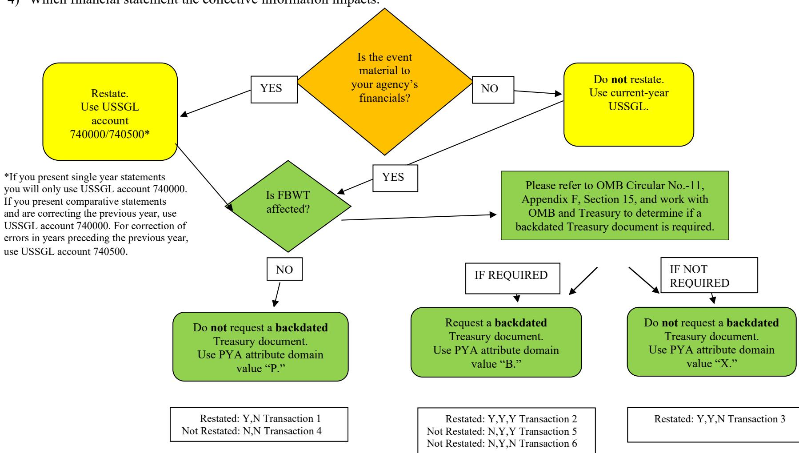

# **PREPARED BY**

**GENERAL LEDGER AND ADVISORY BRANCH FISCAL ACCOUNTING BUREAU OF THE FISCAL SERVICE U.S. DEPARTMENT OF TREASURY**

#### *Version History*

| Version | Date       | Description of Change                                                                                                                                                              |                         |
|---------|------------|------------------------------------------------------------------------------------------------------------------------------------------------------------------------------------|-------------------------|
| Number  |            |                                                                                                                                                                                    | USSGL TFM               |
| 1.0     | 01/21/2016 | Original Version                                                                                                                                                                   | S2 08-03                |
| 2.0     | 08/17/2022 | Added Prior-Year Trial Balances for General Fund, corrected prior year attribute domain values through document, changing 7-digit USSGL accounts to 6-digit, and other updates. | Bulletin No. 2016-12 |
| 2.1     | 3/20/2024  | Revised background information and flowchart comment to add clarity                                                                                                                | Bulletin No. 2016-12 |

 **Page 1 of 38 August 2022**

*This scenario uses information from the August 2022 U.S. Standard General Ledger, which is a Supplement to the Treasury Financial Manual (TFM) See Bulletin No.2022-16 Part 2, Section V SF 133: Report on Budget Execution and Budgetary Resources & Schedule P Budget Program and Financing Schedule and Part II, Sections I through V.* 

## **Background**

Occasionally, financial statements and other Treasury central accounting documents require adjustments to correct errors that occurred in previous periods. The Federal Accounting Standards Advisory Board (FASAB) and the Office of Management and Budget (OMB) provide guidance to account for these events.

## **Prior-Period Adjustments (PPAs)**

Prior-period adjustments (PPAs) may occur as a result of material corrections of errors and/or changes in accounting principles applied to an agency's prior-year financial statements. FASB's Accounting Principles Board Opinion No. 20 notes that "Errors in financial statements result from mathematical mistakes, mistakes in the application of accounting principles, or oversight or misuse of facts that existed at the time the financial statements were prepared." (Par. 13)

Statement of Federal Financial Accounting Standards (SFFAS) No. 21, *Reporting Corrections of Errors and Changes in Accounting Principles,*  requires entities restate prior-period financial statements for material corrections of error(s) identified in the current period, if the statements are provided for comparative purposes, and if the effect of the error(s) would be material in either period." "When errors are discovered after the issuance of financial statements, and if the financial statements would be materially misstated absent corrections of the errors, corrections should be made as follows:

- If only the current period statements are presented, then the cumulative effect of correcting the error should be reported as a prior period adjustment. The adjustment should be made to the beginning balance of cumulative results of operations, in the statement of changes in net position. (See SFFAS 21, Par. 10a, and Statement Presentation Table below.)
- If comparative financial statements are presented, then the error should be corrected in the earliest affected period presented by correcting any individual amounts on the financial statements. If the earliest period presented is not the period in which the error occurred and the cumulative effect is attributable to prior periods, then the cumulative effect should be reported as a prior period adjustment. The adjustment should be made to the beginning balance of cumulative results of operations, in the statement of changes in net position for the earliest period presented. (See SFFAS 21, Par. 10b and Statement Presentation Table below.)

As a result, the Reclassified Statement of Operation and Changes in Net Position (RSOCNP) crosswalk has separate lines and USSGL accounts to distinguish between corrections of errors for the prior year (USSGL account 740000) and corrections of errors in years preceding the prior year (USSGL account 740500).

 **Page 2 of 38 August 2022**

#### **Statement Presentation Table (for material errors only)**

|                                                                                 | If Comparative Financial Statements Are            | If Only Current Period Statements Are Being Presented (that is,              |  |  |
|---------------------------------------------------------------------------------|----------------------------------------------------|------------------------------------------------------------------------------|--|--|
|                                                                                 | Being Presented (that is, 2022 and 2021):       | 2022):                                                                       |  |  |
| If the error occurred during                                                    | Then, the adjustment is made to the earliest       | Then, the adjustment is made to the beginning balance of cumulative          |  |  |
| the earliest affected period                                                    | affected period presented by correcting any        | results of operations on line 11B (Corrections of errors) of the SCNP.       |  |  |
| presented in the financial                                                      | individual amounts on the financial statements.    | (USSGL account 740000). Also, adjustment made to beginning balance of        |  |  |
| scenario reflects this example.). statements (that is, 2021): (This       |                                                    | cumulative results of operations on the RSOCNP if non-federal, line 2.2      |  |  |
|                                                                                 |                                                    | (Corrections of errors – non-federal) and if federal line 3.2 (Correction of |  |  |
|                                                                                 |                                                    | errors – federal (RC 29)). (USSGL account 740000).                        |  |  |
| If the error occurred before                                                    | Then, the adjustment is made to the beginning      | Then, the adjustment is made to the beginning balance of cumulative          |  |  |
| the earliest period presented                                                   | balance of cumulative results of operations on     | results of operations on line 11B (Corrections of errors) of the SCNP.    |  |  |
| in the financial statements line 11B (Corrections of errors) of the SCNP for |                                                    | (USSGL account 740000). Also, adjustment made to beginning balance of        |  |  |
| (that is, 2020 or prior):                                                       | the earliest period presented. See Prior-Period | cumulative results of operations on the RSOCNP if non-federal, line 2.2      |  |  |
|                                                                                 | Adjustments Due to Correction of Errors-Years      | (Corrections of errors – non-federal) and if federal line 3.2 (Correction of |  |  |
|                                                                                 | Preceding the Prior Year Scenario. (USSGL       | errors – federal (RC 29)). (USSGL account 740000).                           |  |  |
|                                                                                 | account 740500)                                    |                                                                              |  |  |

**Note**: The Statement of Changes in Net Position (SCNP) current-year unadjusted beginning balance must agree with the restated ending balance shown on the prior-year SCNP. USSGL account 740500 can be used only if comparative financial statements are being presented.

This scenario uses Prior Year Adjustment Code (PY Adj) as they are defined in the USSGL Treasury Financial Manual (TFM) which is governed by OMB Circular No. A-11.

## **PY Adj Attribute Definition for GTAS Reporting**

Use when changes to obligated or unobligated balances occurred in the previous fiscal year but were not recorded in the appropriate Treasury Appropriation Fund Symbol (TAFS) as of October 1 of the current fiscal year or during the GTAS window. Exclude upward and downward adjustments to current-year/prior-year obligations and most reclassifications from clearing accounts.

#### **Domain Definitions**

#### **"B" – Adjustments to prior-year reporting - backdated in Treasury's central accounting system**

Use when a PYA **does** affect the Fund Balance With Treasury (FBWT) and **is** backdated in Treasury's central accounting system after the GTAS window has closed for the period being adjusted.

#### **"P" – Adjustments to prior-year reporting - not backdated in Treasury's central accounting system**

Use when a PYA does **not** affect FBWT and is **not** backdated in Treasury's central accounting system after the GTAS window has closed for the period being adjusted.

**"X" – Not an adjustment to prior-year reporting**

 **Page 3 of 38 August 2022**

Use when a PYA does not meet the requirements of domains "B" or "P" and for current-period activity. **Note:** For situations involving the GTAS revision window, and the prior-year attribute domain value "X", refer to OMB Circular No. A-11, Appendix F, Section 15 for more detail.

**Note**: The flowchart below can assist with determining:

- 1) Whether or not to restate prior-year financial statements;
- 2) Whether to use USSGL account 740000, "Prior-Period Adjustments Due to Corrections of Errors," or a different account;
- 3) Which PY Adj attribute to use and
- 4) Which financial statement the collective information impacts.

Page 4 of 38 August 2022

This document provides guidance for correcting both financial and budgetary reporting errors. The following scenario assumes the activity occurs in a no-year Treasury Account Fund Symbol (TAFS). As presented graphically in the previous flowchart, there are six different possible reporting outcomes when correcting errors. The transactions, listed in the detailed chart below, correspond with the transaction numbers in the illustrative

transaction section and represent each of the six possible outcomes.

|                                          |                                                          | AFFECTS PROPRIETARY |                                      | AFFECTS BUDGETARY                                                                     |                                                    |                                             |                                            |
|------------------------------------------|----------------------------------------------------------|------------------------|--------------------------------------|------------------------------------------------------------------------------------------|----------------------------------------------------|---------------------------------------------|--------------------------------------------|
| Illustrative Transaction No. 1. | USSGL Account 490100 Delivered Orders              | Transaction Amount  | Is it Proprietarily Material?1 | Result Restate                                                                        | Is FBWT USSGL Account 101000 Affected? | Is a back dated document required? | Results Not                             |
|                                          | Obligations Unpaid                                       | \$2,000,000            | YES                                  | (Use Proprietary Account 740000)                                                      | NO                                                 | Does Not Apply                           | Backdated – Use Attribute "P"        |
| 2.                                       | 490200 Delivered Orders – Obligations Paid            | \$7,000,000            | YES                                  | Restate (Use Proprietary Account 740000)                                           | YES                                                | YES                                         | Backdated – Use Attribute "B"        |
| 3.                                       | 490200 Delivered Orders – Obligations Paid            | \$450,000              | YES                                  | Restate (Use Proprietary Account 740000)                                           | YES                                                | NO                                          | Not Backdated – Use Attribute "X" |
| 4.                                       | 490100 Delivered Orders – Obligations Unpaid | \$100,000              | NO                                   | Do Not Restate (Proprietary Account 740000 Not Used – Run Through Current-Year) | NO                                                 | Does Not Apply                           | Not Backdated – Use Attribute "P" |
| 5.                                       | 490200 Delivered Orders – Obligations Paid            | \$500,000              | NO                                   | Do Not Restate (Proprietary Account 740000 Not Used – Run Through Current-Year) | YES                                                | YES                                         | Backdated – Use Attribute "B"        |
| 6.                                       | 490200 Delivered Orders – Obligations Paid            | \$50,000               | NO                                   | Do Not Restate (Proprietary Account 740000 Not Used – Run Through Current-Year) | YES                                                | YES                                         | Backdated – Use Attribute "B"        |

 **Page 5 of 38 August 2022**

1 Each agency should determine its materiality threshold. This scenario assumes that all "YES" answers in this column indicate the amount is material.

## **Listing of USSGL Accounts Used In This Scenario**

| Account Number | Account Title                                                                                    |
|----------------|--------------------------------------------------------------------------------------------------|
| Budgetary      |                                                                                                  |
| 411900         | Other Appropriations Realized                                                                    |
| 420100         | Total Actual Resources – Collected                                                            |
| 445000         | Unapportioned - Unexpired Authority                                                     |
| 451000         | Apportionments                                                                                   |
| 461000         | Allotments – Realized Resources                                                               |
| 490100         | Delivered Orders – Obligations, Unpaid                                                        |
| 490200         | Delivered Orders – Obligations, Paid                                                          |
| Proprietary    |                                                                                                  |
| 101000         | Fund Balance With Treasury                                                                       |
| 198000         | Asset for Agency's Custodial and Non-Entity Liabilities – General Fund of the U.S. Government |
| 201000         | Liability for Fund Balance With Treasury                                                         |
| 211000         | Accounts Payable                                                                                 |
| 310000         | Unexpended Appropriations – Cumulative                                                        |
| 310100         | Unexpended Appropriations – Appropriations Received                                           |
| 310700         | Unexpended Appropriations – Used - Accrued                                              |
| 310710         | Unexpended Appropriations – Used - Disbursed                                               |
| 310800         | Unexpended Appropriations – Prior-Period Adjustments Due to Corrections of Errors             |
| 320000         | Appropriations Outstanding - Cumulative                                                       |
| 320100         | Appropriations Outstanding – Warrants Issued                                                  |
| 320700         | Appropriations Outstanding – Used - Accrued                                             |
| 320710         | Appropriations Outstanding – Used- Disbursed                                               |
| 320800         | Appropriations Outstanding – Prior – Period Adjustments                                    |
| 331000         | Cumulative Results of Operations                                                                 |
| 570000         | Expended Appropriations – Used - Accrued                                                |
| 570005         | Appropriations – Expended - Accrued                                                     |
| 570006         | Appropriations – Expended - Disbursed                                                      |
| 570010         | Expended Appropriations - Disbursed                                                           |
| 570800         | Expended Appropriations – Prior-Period Adjustments Due to Corrections of Errors            |
| 570810         | Appropriations – Expended- Prior-Period Adjustments                                        |
| 610000         | Operating Expenses/Program Costs                                                                 |
| 740000         | Prior-Period Adjustments Due to Corrections of Errors                                            |

## **Assumptions**

For the illustrative transactions that begin on page 12, assume the following:

- 1. The following entries in this scenario show that unapportioned authority is reclassified from the PY Adj attribute domain value "X" to the "P" or "B" domain value when a Prior Year Adjustment transaction is processed. Please refer to OMB Circular No. A-11, Appendix F, Section 15, and work with OMB and Treasury to determine if a backdated Treasury document is required.
- 2. If a backdated document is needed, the entity should complete a backdated document request located at: Backdated Treasury Documents Budget Community MAX Federal Community
- 3. Prior-period and prior-year adjustments are not standard so there will be transactions that do not have Transaction Codes listed.
- 4. The materiality of a transaction, with respect to restatement requirements, is known when posted.
- 5. The agency's accounting system for the prior-period cannot be reopened.
- 6. The activity occurs in a no-year TAFS.
- 7. The GTAS BEA Category Indicator Attribute for illustrations purposes is discretionary.
- 8. The GTAS Reimbursable Flag Indicator is direct.
- 9. Comparative financial statements are presented.
- 10. Budgetary transactions highlighted in light green are prior-year activities that flow to the "Prior-year Adjustments," column 7 of the *Financial System Activity and Trial Balance for Budgetary Accounts* chart on page 22.
- 11. Proprietary transactions highlighted in blue are PPAs that a) require financial restatement, b) flow to the "FY22 Prior-period Adjustments," column 3 of the *Work Paper Trial Balance for Proprietary Accounts* chart on page 23 and c) are entered into the accounting system.
- 12. "Work Paper Only" transactions highlighted in peach are PPAs that a) require restatement, b) flow to the "FY22 Prior-period Work-Paper Adjustments," column 4 of the *Work Paper Trial Balance for Proprietary Accounts* chart on page 23, and c) are not entered in an agency's accounting system. These transactions occur outside the system and are used in calculations to determine amounts to be presented in published restated financial statements and reports. When the agency's system cannot be reopened, balances still must be impacted appropriately. However, current-period financial statements cannot be prepared directly from the agency's accounting system. Therefore, Work Paper adjustments are necessary.
- 13. All transactions not highlighted a) are current-year transactions, b) are posted in the accounting system, and c) do not fall into any of the three highlighted categories (green, blue, or peach).

# **Prior-Year Trial Balances**

**Note: "X" is the Prior Year Adjustment (PYA) Attribute "X" – Not an adjustment to prior-year reporting.**

## **System Preclosing Trial Balances– Fiscal 2021**

| USSGL Account                                                        | Debit          | Credit         |
|----------------------------------------------------------------------|----------------|----------------|
|                                                                      | (in thousands) | (in thousands) |
| Budgetary                                                            |                |                |
| 411900 (X) Other Appropriations Realized                       | 12,000         |                |
| 445000 (X) Unapportioned – Unexpired Authority              |                | 11,000         |
| 490100 (X) Delivered Orders – Obligations, Unpaid           |                | 1,000          |
| Total                                                                | 12,000         | 12,000         |
|                                                                      |                |                |
| Proprietary                                                          |                |                |
| 101000 (G) Fund Balance With Treasury                          | 12,000         |                |
| 211000 (F) Accounts Payable                                    |                | 1,000          |
| 310100 (G) Unexpended Appropriations – Appropriations    |                | 12,000         |
| Received                                                             |                |                |
| 310700 (G) Unexpended Appropriations – Used - Accrued | 1,000          |                |
| 570000 (G) Expended Appropriations – Used - Accrued   |                | 1,000          |
| 610000 (F) Operating Expenses/Program Costs                    | 1,000          |                |
| Total                                                                | 14,000         | 14,000         |

## **General Fund of the U.S. Government**

#### **System Preclosing Trial Balances – Fiscal 2021**

| USSGL Account                                                      | Debit          | Credit         |
|--------------------------------------------------------------------|----------------|----------------|
|                                                                    | (in thousands) | (in thousands) |
| Budgetary                                                          |                |                |
| None                                                               |                |                |
| Total                                                              | -              | -              |
| Proprietary                                                        |                |                |
| 201000 (F) Liability for Fund Balance With Treasury                |                | 12,000         |
| 320100 (F) Appropriations Outstanding – Warrants Issued         | 12,000         |                |
| 320700 (F) Appropriations Outstanding – Used - Accrued |                | 1,000          |
| 570005 (F) Appropriations – Expended - Accrued            | 1,000          |                |
| Total                                                              | 13,000         | 13,000         |

#### **System Post-closing Trial Balances – Fiscal 2021 / Beginning Balance – Fiscal 2022**

**Note: "X" is the Prior Year Adjustment (PYA) Attribute "X" – Not an adjustment to prior-year reporting.**

| USSGL Account                                                 | Debit          | Credit         |
|---------------------------------------------------------------|----------------|----------------|
|                                                               | (in thousands) | (in thousands) |
| Budgetary                                                     |                |                |
| 420100 Total Actual Resources – Collected               | 12,000         |                |
| 445000 (X) Unapportioned – Unexpired Authority |                | 11,000         |
| 490100 (X) Delivered Orders – Obligations, Unpaid    |                | 1,000          |
| Total                                                         | 12,000         | 12,000         |
|                                                               |                |                |
| Proprietary                                                   |                |                |
| 101000 (G) Fund Balance With Treasury                   | 12,000         |                |
| 211000 (F) Accounts Payable                             |                | 1,000          |
| 310000 Unexpended Appropriations – Cumulative           |                | 11,000         |
| Total                                                         | 12,000         | 12,000         |
|                                                               |                |                |

#### **General Fund of the U.S. Government**

## **System Post-closing Trial Balances – Fiscal 2021 / Beginning Balances – Fiscal 2022**

| USSGL Account                                       | Debit          | Credit         |
|-----------------------------------------------------|----------------|----------------|
|                                                     | (in thousands) | (in thousands) |
| Budgetary                                           |                |                |
| None                                                |                |                |
| Total                                               | -              | -              |
| Proprietary                                         |                |                |
| 201000 (F) Liability for Fund Balance With Treasury |                | 12,000         |
| 320000 Appropriations Outstanding - Cumulative   | 11,000         |                |
| 331000 Cumulative Results of Operations             | 1,000          |                |
| Total                                               | 12,000         | 12,000         |

**Note:** Amounts in this Scenario are rounded in the thousands.

A. To record budgetary authority apportioned by the Office of Management and Budget and available for allotments. OMB apportions \$10,100,000 of the \$11,000,000 prior-year unobligated balance. **(Refer to page 8 for beginning balance)** Generally, the initial apportionment will not include an amount to cover corrections of errors.

| System Only                          | Work Paper Only |        |      |                                           |    |    |    |
|--------------------------------------|-----------------|--------|------|-------------------------------------------|----|----|----|
|                                      | DR              | CR     | TC   |                                           | DR | CR | TC |
| Budgetary Entry                      |                 |        |      | Budgetary Entry                           |    |    |    |
| 445000 (X) Unapportioned - Unexpired | 10,100          |        |      | None                                      |    |    |    |
| Authority                            |                 |        | A116 |                                           |    |    |    |
| 451000 Apportionments                |                 | 10,100 |      |                                           |    |    |    |
|                                      |                 |        |      |                                           |    |    |    |
| Proprietary Entry                    |                 |        |      | Proprietary Entry                         |    |    |    |
| None                                 |                 |        |      | None                                      |    |    |    |
|                                      |                 |        |      |                                           |    |    |    |
|                                      |                 |        |      | General Fund of the U.S. Government (099) |    |    |    |
| Budgetary Entry                      |                 |        |      |                                           |    |    |    |
| None                                 |                 |        |      |                                           |    |    |    |
|                                      |                 |        |      |                                           |    |    |    |
| Proprietary Entry                    |                 |        |      |                                           |    |    |    |
| None                                 |                 |        |      |                                           |    |    |    |

#### **PYA**

| B. To record the allotment of authority. The agency allots \$10,100,000 of the \$11,000,000 prior-year unobligated balance. |                 |        |      |                                           |    |    |    |  |
|-----------------------------------------------------------------------------------------------------------------------------------|-----------------|--------|------|-------------------------------------------|----|----|----|--|
| System Only                                                                                                                       | Work Paper Only |        |      |                                           |    |    |    |  |
|                                                                                                                                   | DR              | CR     | TC   |                                           | DR | CR | TC |  |
| Budgetary Entry                                                                                                                   |                 |        |      | Budgetary Entry                           |    |    |    |  |
| 451000 Apportionments                                                                                                             | 10,100          |        |      | None                                      |    |    |    |  |
| 461000 Allotments – Realized Resources                                                                                            |                 | 10,100 | A120 |                                           |    |    |    |  |
|                                                                                                                                   |                 |        |      |                                           |    |    |    |  |
|                                                                                                                                   |                 |        |      |                                           |    |    |    |  |
| Proprietary Entry                                                                                                                 |                 |        |      | Proprietary Entry                         |    |    |    |  |
| None                                                                                                                              |                 |        |      | None                                      |    |    |    |  |
|                                                                                                                                   |                 |        |      |                                           |    |    |    |  |
|                                                                                                                                   |                 |        |      | General Fund of the U.S. Government (099) |    |    |    |  |
| Budgetary Entry                                                                                                                   |                 |        |      |                                           |    |    |    |  |
| None                                                                                                                              |                 |        |      |                                           |    |    |    |  |
|                                                                                                                                   |                 |        |      |                                           |    |    |    |  |
| Proprietary Entry                                                                                                                 |                 |        |      |                                           |    |    |    |  |
| None                                                                                                                              |                 |        |      |                                           |    |    |    |  |

1. During fiscal 2022, an error that occurred in fiscal 2021 was discovered. The error understated expenses by \$2,000,000. A bill for a delivered unpaid order had not been recorded. No prior related obligation had been previously recorded. **The error is material** and requires restatement of the proprietary financial statements. [2](#page-14-0)

| System Only                                                              |       |       |       | Work Paper Only                                         |       |       |    |
|--------------------------------------------------------------------------|-------|-------|-------|---------------------------------------------------------|-------|-------|----|
|                                                                          | DR    | CR    | TC    |                                                         | DR    | CR    | TC |
| Budgetary Entry                                                          |       |       |       | Budgetary Entry                                         |       |       |    |
| 445000 (P) Unapportioned – Unexpired Authority                           | 2,000 |       |       | None                                                    |       |       |    |
| 490100 (P) Delivered Orders – Obligations,                               |       | 2,000 | B4023 |                                                         |       |       |    |
| Unpaid                                                                   |       |       |       | Proprietary Entry                                       |       |       |    |
|                                                                          |       |       |       | 610000 (F) Operating Expenses/Program Costs             | 2,000 |       |    |
| Proprietary Entry (prior-year activity)                                  |       |       |       | 740000 (Z) Prior-Period Adjustments Due to           |       |       |    |
| 740000 (Z) Prior-Period Adjustments Due to                               | 2,000 |       | D312  | Corrections of Errors                                   |       | 2,000 |    |
| Corrections of Errors                                                    |       |       |       | 570800 (G) Expended Appropriations – Prior-Period       | 2,000 |       |    |
| 211000 (F) Accounts Payable                                              |       | 2,000 |       | Adjustments Due to Corrections of Errors                |       |       |    |
| 310800 (G) Unexpended Appropriations – Prior                             |       |       |       | 570000 (G) Expended Appropriations -Used –              |       |       |    |
| Period Adjustments Due to Corrections of Errors                          | 2,000 |       |       | Accrued                                                 |       | 2,000 |    |
| 570800 (G) Expended Appropriations –                                     |       |       | D304  | 310700 (G) Unexpended Appropriations – Used -           | 2,000 |       |    |
| Prior-Period Adjustments Due to Corrections of                           |       | 2,000 |       | Accrued                                                 |       |       |    |
| Errors                                                                   |       |       |       | 310800 (G) Unexpended Appropriations –                  |       | 2,000 |    |
|                                                                          |       |       |       | Prior-Period Adjustments to Corrections of Errors |       |       |    |
|                                                                          |       |       |       | General Fund of the U.S. Government (099)               |       |       |    |
| Budgetary Entry                                                          |       |       |       |                                                         |       |       |    |
| None                                                                     |       |       |       |                                                         |       |       |    |
|                                                                          |       |       |       |                                                         |       |       |    |
| Proprietary Entry                                                        |       |       |       |                                                         |       |       |    |
| 570810 (F) Appropriations – Expended- Prior-Period Adjustments           |       |       |       |                                                         | 2,000 |       |    |
| 320800 (F) Appropriations Outstanding – Prior – Period Adjustments |       |       |       |                                                         |       | 2,000 |    |

1B. Because the prior-year unobligated balance was carried over and then allotted, the agency must show the decrease to the current year accounts 461000 and 445000.

| System Only                                       |       |       | Work Paper Only |                   |    |    |    |
|---------------------------------------------------|-------|-------|-----------------|-------------------|----|----|----|
|                                                   | DR    | CR    | TC              |                   | DR | CR | TC |
| Budgetary Entry                                   |       |       |                 | Budgetary Entry   |    |    |    |
| 461000 Allotments – Realized Resources         | 2,000 |       |                 | None              |    |    |    |
| 445000 (X) Unapportioned – Unexpired Authority |       | 2,000 |                 |                   |    |    |    |
|                                                   |       |       |                 |                   |    |    |    |
| Proprietary Entry                                 |       |       |                 | Proprietary Entry |    |    |    |
| None                                              |       |       |                 | None              |    |    |    |

2 A budgetary entry also is required to reflect a beginning balance adjustment. The PYA attribute domain value "P" is used because FBWT is **not** affected. A matching backdated Treasury central accounting document is not prepared after the GTAS window period has closed for the period being corrected.

3 TC B402 without previously recording USSGL account 480100.

2. During fiscal 2022, an error that occurred in fiscal 2021 was discovered. It understated expenses and overstated cash by \$7,000,000. A bill and payment for a delivered paid order has not been recorded. **The error is material** and requires restatement of the proprietary financial statements. [4](#page-15-0)

| 4 delivered paid order has not been recorded. The error is material and requires restatement of the proprietary financial statements. |                    |       |       |                                                   |       |       |    |  |
|---------------------------------------------------------------------------------------------------------------------------------------------|--------------------|-------|-------|---------------------------------------------------|-------|-------|----|--|
| System Only                                                                                                                                 | Work Paper Only    |       |       |                                                   |       |       |    |  |
|                                                                                                                                             | DR                 | CR    | TC    |                                                   | DR    | CR    | TC |  |
| Budgetary Entry                                                                                                                             |                    |       |       | Budgetary Entry                                   |       |       |    |  |
| 445000 (B) Unapportioned – Unexpired Authority                                                                                              | 7,000              |       | B1025 | None                                              |       |       |    |  |
| 490200 (B) Delivered Orders –Obligations, Paid                                                                                              |                    | 7,000 |       |                                                   |       |       |    |  |
|                                                                                                                                             |                    |       |       | Proprietary Entry                                 |       |       |    |  |
| Proprietary Entry (prior-year activity)                                                                                                     |                    |       |       | 610000 (F) Operating Expenses/Program Costs       | 7,000 |       |    |  |
| 740000 (Z) Prior-Period Adjustments Due to                                                                                                  | 7,000              |       |       | 740000 (Z) Prior-Period Adjustments Due to        |       | 7,000 |    |  |
| Corrections of Errors                                                                                                                       |                    |       | D306  | Corrections of Errors                             |       |       |    |  |
| 101000 (G) Fund Balance With Treasury                                                                                                       |                    | 7,000 |       | 570800 (G) Expended Appropriations – Prior-Period | 7,000 |       |    |  |
| 310800 (G) Unexpended Appropriations – Prior                                                                                                | 7,000              |       |       | Adjustments Due to Corrections of Errors          |       |       |    |  |
| Period Adjustments Due to Corrections of Errors                                                                                             |                    |       |       | 570010(G)Expended Appropriations –                |       | 7,000 |    |  |
| 570800 (G) Expended Appropriations – Prior-                                                                                                 |                    | 7,000 | D304  | Disbursed                                         |       |       |    |  |
| Period Adjustments Due to Corrections of Error                                                                                              |                    |       |       | 310710(G) Unexpended Appropriations–Used          | 7,000 |       |    |  |
|                                                                                                                                             |                    |       |       | Disbursed                                         |       |       |    |  |
|                                                                                                                                             |                    |       |       | 310800 (G) Unexpended Appropriations –Prior-      |       | 7,000 |    |  |
|                                                                                                                                             |                    |       |       | Period Adjustments to Corrections of Errors       |       |       |    |  |
|                                                                                                                                             |                    |       |       | General Fund of the U.S. Government (099)         |       |       |    |  |
| Budgetary Entry                                                                                                                             |                    |       |       |                                                   |       |       |    |  |
| None                                                                                                                                        |                    |       |       |                                                   |       |       |    |  |
|                                                                                                                                             |                    |       |       |                                                   |       |       |    |  |
| Proprietary Entry                                                                                                                           |                    |       |       |                                                   |       |       |    |  |
| 201000 (F) Liability for Fund Balance With Treasury                                                                                         |                    |       |       |                                                   |       |       |    |  |
| 198000 (F) Asset for Agency's Custodial and Non-Entity Liabilities – General Fund of the U.S. Government                                    |                    |       |       |                                                   |       | 7,000 |    |  |
| 570810 (F) Appropriations – Expended- Prior-Period Adjustments                                                                              |                    |       |       |                                                   | 7,000 |       |    |  |
| 320800 (F) Appropriations Outstanding – Prior –                                                                                          | Period Adjustments |       |       |                                                   |       | 7,000 |    |  |

| 2B. Because the prior-year unobligated balance was carried over and then allotted, the agency must show the decrease to the current year accounts 461000 and 445000. |       |       |    |                   |    |    |    |  |  |
|-------------------------------------------------------------------------------------------------------------------------------------------------------------------------|-------|-------|----|-------------------|----|----|----|--|--|
| System Only                                                                                                                                                             |       |       |    | Work Paper Only   |    |    |    |  |  |
|                                                                                                                                                                         | DR    | CR    | TC |                   | DR | CR | TC |  |  |
| Budgetary Entry                                                                                                                                                         |       |       |    | Budgetary Entry   |    |    |    |  |  |
| 461000 Allotments – Realized Resources                                                                                                                               | 7,000 |       |    | None              |    |    |    |  |  |
| 445000 (X) Unapportioned – Unexpired Authority                                                                                                                       |       | 7,000 |    |                   |    |    |    |  |  |
|                                                                                                                                                                         |       |       |    |                   |    |    |    |  |  |
| Proprietary Entry                                                                                                                                                       |       |       |    | Proprietary Entry |    |    |    |  |  |
| None                                                                                                                                                                    |       |       |    | None              |    |    |    |  |  |

4 A budgetary entry also is required to reflect a beginning balance adjustment. The PYA attribute domain value "B" is used because a backdated Treasury central accounting document is prepared after the GTAS window period has closed for the period being corrected.

5 TC B102 substitute D306 for proprietary.

3. During revision window for fiscal 21, an error that occurred in fiscal 2021 was discovered. It understated expenses \$450,000. A bill for a delivered paid order has not been recorded. **The error is material** and requires restatement of the proprietary financial statements. The agency referred to OMB Circular A-11, Appendix F, Section 15 and worked with OMB & Treasury and determined that a back dated document with PYA attribute "X" is required.

| System Only                                                                                                                                                  |                                                                                                                                                                                                             |     |              | Work Paper Only                                                                                                                                                                                                     |            |     |    |  |
|--------------------------------------------------------------------------------------------------------------------------------------------------------------|-------------------------------------------------------------------------------------------------------------------------------------------------------------------------------------------------------------|-----|--------------|---------------------------------------------------------------------------------------------------------------------------------------------------------------------------------------------------------------------|------------|-----|----|--|
|                                                                                                                                                              | DR                                                                                                                                                                                                          | CR  | TC           |                                                                                                                                                                                                                     | DR         | CR  | TC |  |
| Budgetary Entry 461000 Allotments – Realized Resources 490200 (X) Delivered Orders – Obligations, Paid                                           | 450                                                                                                                                                                                                         | 450 | B1026        | Budgetary Entry None                                                                                                                                                                                             |            |     |    |  |
| Proprietary Entry (prior-year activity)                                                                                                                      |                                                                                                                                                                                                             |     |              | Proprietary Entry                                                                                                                                                                                                   |            |     |    |  |
| 740000 (Z) Prior-Period Adjustments Due to Corrections of Errors 101000 (G) Fund Balance With Treasury 310800 (G) Unexpended Appropriations –    | 450 450                                                                                                                                                                                                  | 450 | D306 D304 | 610000 (F) Operating Expenses/Program Costs 740000 (Z) Prior-Period Adjustments Due to Corrections of Errors 570800 (G) Expended Appropriations – Prior-Period Adjustments Due to Corrections of Errors | 450 450 | 450 |    |  |
| Prior-Period Adjustments Due to Corrections of Errors 570800 (G) Expended Appropriations – Prior-Period Adjustments Due to Corrections of Errors |                                                                                                                                                                                                             | 450 |              | 570010(G) Expended Appropriations – Disbursed 310710(G) Unexpended Appropriations – Used – Disbursed 310800 (G) Unexpended Appropriations –                                                       | 450        | 450 |    |  |
|                                                                                                                                                              |                                                                                                                                                                                                             |     |              | Prior-Period Adjustments to Corrections of Errors                                                                                                                                                                |            | 450 |    |  |
|                                                                                                                                                              |                                                                                                                                                                                                             |     |              |                                                                                                                                                                                                                     |            |     |    |  |
|                                                                                                                                                              |                                                                                                                                                                                                             |     |              | General Fund of the U.S. Government (099)                                                                                                                                                                           |            |     |    |  |
| Budgetary Entry None Proprietary Entry                                                                                                                 |                                                                                                                                                                                                             |     |              |                                                                                                                                                                                                                     |            |     |    |  |
| 201000 (F) Liability for Fund Balance With Treasury                                                                                                          |                                                                                                                                                                                                             |     |              |                                                                                                                                                                                                                     | 450        |     |    |  |
| 320800 (F) Appropriations Outstanding –                                                                                                                      | 198000 (F) Asset for Agency's Custodial and Non-Entity Liabilities – General Fund of the U.S. Government 570810 (F) Appropriations – Expended- Prior-Period Adjustments Prior – Period Adjustments |     |              |                                                                                                                                                                                                                     |            |     |    |  |

6 TC B102 substitute D306 for proprietary.

4. During fiscal 2022, an error that occurred in fiscal 2021 was discovered. It understated expenses by \$100,000. A bill for a delivered unpaid order had not been recorded. No prior related obligation had been previously recorded. **The error is immaterial** and does not require restatement of the proprietary financial statements.[7](#page-17-0)

| System Only                                                                                                                                                                                                                                 | Work Paper Only |            |       |                                           |     |     |    |
|---------------------------------------------------------------------------------------------------------------------------------------------------------------------------------------------------------------------------------------------|-----------------|------------|-------|-------------------------------------------|-----|-----|----|
|                                                                                                                                                                                                                                             | DR              | CR         | TC    |                                           | DR  | CR  | TC |
| Budgetary Entry 445000 (P) Unapportioned - Unexpired Authority 490100 (P) Delivered Orders –Obligations, Unpaid                                                                                                                    | 100             | 100        | B4028 | Budgetary Entry None                   |     |     |    |
| Proprietary Entry (current-year activity) 610000 (F) Operating Expenses/Program Costs 211000 (F) Accounts Payable 310700 (G) Unexpended Appropriations – Used - Accrued 570000 (G) Expended Appropriations-Used – Accrued | 100 100      | 100 100 | B134  | Proprietary Entry None                 |     |     |    |
|                                                                                                                                                                                                                                             |                 |            |       |                                           |     |     |    |
|                                                                                                                                                                                                                                             |                 |            |       | General Fund of the U.S. Government (099) |     |     |    |
| Budgetary Entry None                                                                                                                                                                                                                     |                 |            |       |                                           |     |     |    |
|                                                                                                                                                                                                                                             |                 |            |       |                                           |     |     |    |
| Proprietary Entry                                                                                                                                                                                                                           |                 |            |       |                                           |     |     |    |
| 570005 (F) Appropriations – Expended - Accrued                                                                                                                                                                                              |                 |            |       |                                           | 100 |     |    |
| 320700 (F) Appropriations Outstanding- Used -                                                                                                                                                                                            | Accrued         |            |       |                                           |     | 100 |    |

4B. Because the prior-year unobligated balance was carried over and then allotted, the agency must show the decrease to the current year accounts 461000 and 445000.

| System Only                                       |     |     | Work Paper Only |                   |    |    |    |
|---------------------------------------------------|-----|-----|-----------------|-------------------|----|----|----|
|                                                   | DR  | CR  | TC              |                   | DR | CR | TC |
| Budgetary Entry                                   |     |     |                 | Budgetary Entry   |    |    |    |
| 461000 Allotments – Realized Resources         | 100 |     |                 | None              |    |    |    |
| 445000 (X) Unapportioned – Unexpired Authority |     | 100 |                 |                   |    |    |    |
|                                                   |     |     |                 |                   |    |    |    |
| Proprietary Entry                                 |     |     |                 | Proprietary Entry |    |    |    |
| None                                              |     |     |                 | None              |    |    |    |

7 A budgetary entry also is required to reflect a beginning balance adjustment. The PYA attribute domain value "P" is used because FBWT is not affected. A matching backdated Treasury central accounting document is not prepared after the GTAS window period has closed for the period being corrected.

8 TC B402 without previously recording USSGL account 480100.

5. During fiscal 2022, an error that occurred in fiscal 2021 was discovered. It understated expenses and overstated cash by \$500,000. A bill for a delivered paid order had not been recorded. No prior related obligation had been previously recorded. **The error is immaterial** and does not require restatement of the proprietary financial statements. [9](#page-18-0)

| System Only                                                                                                                                                                                                                                                                                               | Work Paper Only |            |      |                                           |    |            |    |
|-----------------------------------------------------------------------------------------------------------------------------------------------------------------------------------------------------------------------------------------------------------------------------------------------------------|-----------------|------------|------|-------------------------------------------|----|------------|----|
|                                                                                                                                                                                                                                                                                                           | DR              | CR         | TC   |                                           | DR | CR         | TC |
| Budgetary Entry                                                                                                                                                                                                                                                                                           |                 |            |      | Budgetary Entry                           |    |            |    |
| 445000 (B) Unapportioned – Unexpired Authority                                                                                                                                                                                                                                                            | 500             |            | B102 | None                                      |    |            |    |
| 490200 (B) Delivered Orders – Obligations, Paid                                                                                                                                                                                                                                                           |                 | 500        |      |                                           |    |            |    |
| Proprietary Entry (current-year activity) 610000 (F) Operating Expenses/Program Costs 101000 (G) Fund Balance With Treasury 310710 (G) Unexpended Appropriations – Used Disbursed 570010 (G) Expended Appropriations – Disbursed                                                        | 500 500      | 500 500 | B234 | Proprietary Entry None                 |    |            |    |
|                                                                                                                                                                                                                                                                                                           |                 |            |      | General Fund of the U.S. Government (099) |    |            |    |
| Budgetary Entry None                                                                                                                                                                                                                                                                                   |                 |            |      |                                           |    |            |    |
| Proprietary Entry 201000 (F) Liability for Fund Balance With Treasury 198000 (F) Asset for Agency's Custodial and Non-Entity Liabilities – General Fund of the U.S. Government 570006 (F) Appropriations – Expended - Disbursed 320710 (F) Appropriations Outstanding- Used - Disbursed |                 |            |      |                                           |    | 500 500 |    |

5B. Because the prior-year unobligated balance was carried over and then allotted, the agency must show the decrease to the current year accounts 461000 and 445000.

| System Only                                       |     | Work Paper Only |    |                   |    |    |    |
|---------------------------------------------------|-----|-----------------|----|-------------------|----|----|----|
|                                                   | DR  | CR              | TC |                   | DR | CR | TC |
| Budgetary Entry                                   |     |                 |    | Budgetary Entry   |    |    |    |
| 461000 Allotments – Realized Resources         | 500 |                 |    | None              |    |    |    |
| 445000 (X) Unapportioned – Unexpired Authority |     | 500             |    |                   |    |    |    |
|                                                   |     |                 |    |                   |    |    |    |
| Proprietary Entry                                 |     |                 |    | Proprietary Entry |    |    |    |
| None                                              |     |                 |    | None              |    |    |    |

9 A budgetary entry also is required to reflect a beginning balance adjustment. The PYA attribute domain value "B" is used because the agency referred to OMB Circular A-11, Appendix F, Section 15 and worked with OMB & Treasury to determine that a back dated document was needed. A backdated Treasury central accounting document is prepared after the GTAS window period has closed for the period being corrected.

6. During fiscal 2022, an error that occurred in fiscal 2021 was discovered. It understated expenses and overstated cash by \$50,000. A bill for a delivered paid order had not been recorded. No prior related obligation had been previously recorded. **The error is immaterial** and does not require restatement of the proprietary financial statements. [10](#page-19-0)

| System Only                                                                                              |    | Work Paper Only DR CR TC |      |                                           |    |    |  |  |
|----------------------------------------------------------------------------------------------------------|----|-----------------------------------|------|-------------------------------------------|----|----|--|--|
|                                                                                                          | DR | CR                                | TC   |                                           |    |    |  |  |
| Budgetary Entry                                                                                          |    |                                   |      | Budgetary Entry                           |    |    |  |  |
| 445000(B) Unapportioned – Unexpired Authority                                                            | 50 |                                   |      | None                                      |    |    |  |  |
| 490200 (B) Delivered Orders – Obligations, Paid                                                          |    | 50                                | B102 |                                           |    |    |  |  |
|                                                                                                          |    |                                   |      |                                           |    |    |  |  |
| Proprietary Entry (current-year activity)                                                                |    |                                   |      |                                           |    |    |  |  |
| 610000 (F) Operating Expenses/Program Costs                                                              | 50 |                                   |      | Proprietary Entry                         |    |    |  |  |
| 101000 (G) Fund Balance With Treasury                                                                    |    | 50                                |      | None                                      |    |    |  |  |
| 310710 (G) Unexpended Appropriations – Used- Disbursed                                                   | 50 |                                   | B234 |                                           |    |    |  |  |
| 570010 (G) Expended Appropriations - Disbursed                                                           |    | 50                                |      |                                           |    |    |  |  |
|                                                                                                          |    |                                   |      |                                           |    |    |  |  |
|                                                                                                          |    |                                   |      | General Fund of the U.S. Government (099) |    |    |  |  |
| Budgetary Entry                                                                                          |    |                                   |      |                                           |    |    |  |  |
| None                                                                                                     |    |                                   |      |                                           |    |    |  |  |
|                                                                                                          |    |                                   |      |                                           |    |    |  |  |
| Proprietary Entry                                                                                        |    |                                   |      |                                           |    |    |  |  |
| 201000 (F) Liability for Fund Balance With Treasury                                                      | 50 |                                   |      |                                           |    |    |  |  |
| 198000 (F) Asset for Agency's Custodial and Non-Entity Liabilities – General Fund of the U.S. Government |    | 50                                |      |                                           |    |    |  |  |
| 570006 (F) Appropriations – Expended - Disbursed                                                         |    |                                   |      |                                           | 50 |    |  |  |
| 320700 (F) Appropriations Outstanding – Used - Accrued                                             |    |                                   |      |                                           |    | 50 |  |  |

| 6B. Because the prior-year unobligated balance was carried over and then allotted, the agency must show the decrease to the current year accounts 461000 and 445000. |    |    |                 |                   |    |    |    |  |  |  |
|----------------------------------------------------------------------------------------------------------------------------------------------------------------------|----|----|-----------------|-------------------|----|----|----|--|--|--|
| System Only                                                                                                                                                          |    |    | Work Paper Only |                   |    |    |    |  |  |  |
| DR CR TC                                                                                                                                                       |    |    |                 |                   | DR | CR | TC |  |  |  |
| Budgetary Entry                                                                                                                                                      |    |    |                 | Budgetary Entry   |    |    |    |  |  |  |
| 461000 Allotments – Realized Resources                                                                                                                            | 50 |    |                 | None              |    |    |    |  |  |  |
| 445000 (X) Unapportioned – Unexpired Authority                                                                                                                    |    | 50 |                 |                   |    |    |    |  |  |  |
|                                                                                                                                                                      |    |    |                 |                   |    |    |    |  |  |  |
| Proprietary Entry                                                                                                                                                    |    |    |                 | Proprietary Entry |    |    |    |  |  |  |
| None                                                                                                                                                                 |    |    |                 | None              |    |    |    |  |  |  |

10 A budgetary entry also is required to reflect a beginning balance adjustment. The PYA attribute domain value "B" is used because the agency referred to OMB Circular A-11, Appendix F, Section 15 and worked with OMB & Treasury to determine that a back dated document was needed. A backdated Treasury central accounting document is prepared after the GTAS window period has closed for the period being corrected.

## **Fiscal 2022 Accounting System Activity Summary**

(Assumes agency's accounting system was not reopened to record PPAs or PYAs.)

| USSGL System |                | System           | System           | System         | System         |
|-----------------|----------------|------------------|------------------|----------------|----------------|
| Budgetary       | Post-closing   | Activity         | Preclosing Trial | Closing        | Post-closing   |
| and             | Trial          | Fiscal 2022      | Balances Fiscal  | Entries        | Trial Balances |
| Proprietary     | Balances       | (transactions    | 2022             | Fiscal 2022    | Fiscal 2022    |
| Accounts        | Fiscal 2021    | A,B,1,2,3,4,5,6) | (calc.           |                | (calc.         |
|                 |                |                  | Col. 2 + 3)      |                | Col. 4 + 5)    |
|                 |                |                  |                  |                |                |
| Column 1        | Column 2       | Column 3         | Column 4         | Column 5       | Column 6       |
|                 | (in thousands) | (in thousands)   | (in thousands)   | (in thousands) | (in thousands) |
| 420100          | 12,000         |                  | 12,000           | (8,000)        | 4,000          |
| 445000 (B)   |                | 7,550            | 7,550            | (7,550)        | -              |
| 445000 (P)   |                | 2,100            | 2,100            | (2,100)        | -              |
| 445000 (X)   | (11,000)       | 450              | (10,550)         | 9,650          | (900)          |
| 461000          | -              | -                | -                | -              | -              |
| 490100 (P)   |                | (2,100)          | (2,100)          | 2,100          | -              |
| 490100 (X)   | (1,000)        |                  | (1,000)          | (2,100)        | (3,100)        |
| 490200 (B)   |                | (7,550)          | (7,550)          | 7,550          | -              |
| 490200 (X)   | -              | (450)            | (450)            | 450            | -              |
| Total           | -              | -                | -                | -              | -              |
|                 |                |                  |                  |                |                |
| 101000 (G)   | 12,000         | (8,000)          | 4,000            |                | 4,000          |
| 211000 (F)   | (1,000)        | (2,100)          | (3,100)          |                | (3,100)        |
| 310000          | (11,000)       |                  | (11,000)         | 10,100         | (900)          |
| 310700 (G)   |                | 100              | 100              | (100)          | -              |
| 310710 (G)      |                | 550              | 550              | (550)          |                |
| 310800 (G)   |                | 9,450            | 9,450            | (9,450)        | -              |
| 331000          |                | -                | -                | -              |                |
| 570000 (G)   |                | (100)            | (100)            | 100            | -              |
| 570010 (G)      |                | (550)            | (550)            | 550            |                |
| 570800 (G)   |                | (9,450)          | (9,450)          | 9,450          | -              |
| 610000 (F)   |                | 650              | 650              | (650)          | -              |
| 740000 (Z)   |                | 9,450            | 9,450            | (9,450)        | -              |
| Total           | -              | -                | -                | -              | -              |

**PYA Work Paper Trial Balance for Budgetary Accounts – Statement of Budgetary Resources (SBR) ONLY**[11](#page-21-0)

| USSGL Budgetary Accounts | Prior Year Adjustment Attribute (N/A for the SBR) | Fiscal 2021 Published Pre-close | Fiscal 2022 Prior-Period Adjustments (transactions 1, 2, and 3) | Restated Pre-close for Fiscal 2021 SBR (Calc. Col. 3+4) | Restated Fiscal 2021 SBR Closing Entries | Restated Post-Close Fiscal 2021 SBR (Calc. Col. 5+6) | Fiscal 2022 Current Year Activity for SBR (transactions 4, 5, and 6) | Fiscal 2022 SBR for Publication (Calc. Col. 7+8) |
|--------------------------------|------------------------------------------------------------------|---------------------------------------|-----------------------------------------------------------------------------|------------------------------------------------------------------------|------------------------------------------------------|---------------------------------------------------------------------|----------------------------------------------------------------------------------------|--------------------------------------------------------------|
| Column 1                       | Column 2                                                         | Column 3 (in thousands)         | Column 4 (in thousands)                                               | Column 5 (in thousands)                                             | Column 6 (in thousands)                           | Column 7 (in thousands)                                       | Column 8 (in thousands)                                                          | Column 9 (in thousands)                                |
| 411900                         | N/A                                                              | 12,000                                |                                                                             | 12,000                                                                 | (12,000)                                             | -                                                                   |                                                                                        | -                                                            |
| 420100                         | N/A                                                              |                                       |                                                                             | -                                                                      | 4,550                                                | 4,550                                                               |                                                                                        | 4,550                                                        |
| 445000                         | N/A                                                              | (11,000)                              | 9,450                                                                       | (1,550)                                                                |                                                      | (1,550)                                                             | 650                                                                                    | (900)                                                        |
| 490100                         | N/A                                                              | (1,000)                               | (2,000)                                                                     | (3,000)                                                                |                                                      | (3,000)                                                             | (100)                                                                                  | (3,100)                                                      |
| 490200                         | N/A                                                              |                                       | (7,450)                                                                     | (7,450)                                                                | 7,450                                                | -                                                                   | (550)                                                                                  | (550)                                                        |
| Total                          |                                                                  | -                                     | -                                                                           | -                                                                      | -                                                    | -                                                                   | -                                                                                      | -                                                            |

11 Considers FASAB Standard No. 21 requirements regarding PPAs but does not consider OMB Circular No. A-11 requirements regarding PYAs.

**PYA**

**Financial System Activity and Trial Balance for Budgetary Accounts (used to prepare SF 133/Schedule P and 2022 SBR) [12](#page-22-0)**

| USSGL Budgetary Accounts | Prior-Year Adjustment Attribute | Fiscal 2021 Trial Bal. (used to prepare SF 133/Schedule P) | Fiscal 2021 Closing Entries Activity | Fiscal 2021 Post- Closing Trial Balances (Calc. Col. 3+4) | Fiscal 2022 Apportionment and Allotment Transactions "A & B" | Fiscal 2022 Prior-Year Adjustments Activity (transactions 1, 2, 4, 5 and 6 with "B" and "P" domains) | Fiscal 2022 Current Year Activity (transaction 3 with X domain) | Fiscal 2022 Trial Bal. (used to prepare SF 133/Schedule P) (Calc. Col. 5+6+7+8) |
|--------------------------------|---------------------------------------|------------------------------------------------------------------------|-----------------------------------------------|--------------------------------------------------------------------------|--------------------------------------------------------------------------|---------------------------------------------------------------------------------------------------------------------------|--------------------------------------------------------------------------------------|------------------------------------------------------------------------------------------------------|
| Column 1                       | Column 2                              | Column 3 (in thousands)                                             | Column 4 (in thousands)                    | Column 5 (in thousands)                                               | Column 6 (in thousands)                                               | Column 7 (in thousands)                                                                                                | Column 8 (in thousands)                                                        | Column 9 (in thousands)                                                                           |
| 411900                         | X                                     | 12,000                                                                 | (12,000)                                      | -                                                                        |                                                                          | -                                                                                                                         |                                                                                      | -                                                                                                    |
| 420100                         |                                       |                                                                        | 12,000                                        | 12,000                                                                   |                                                                          | -                                                                                                                         |                                                                                      | 12,000                                                                                               |
| 445000                         | B                                     |                                                                        |                                               | -                                                                        |                                                                          | 7,550                                                                                                                     |                                                                                      | 7,550                                                                                                |
| 445000                         | P                                     |                                                                        |                                               | -                                                                        |                                                                          | 2,100                                                                                                                     |                                                                                      | 2,100                                                                                                |
| 445000                         | X                                     | (11,000)                                                               |                                               | (11,000)                                                                 | 10,100                                                                   | (9,650)                                                                                                                   |                                                                                      | (10,550)                                                                                             |
| 461000                         |                                       |                                                                        |                                               | -                                                                        | (10,100)                                                                 | 9,650                                                                                                                     | 450                                                                                  | -                                                                                                    |
| 490100                         | P                                     |                                                                        |                                               | -                                                                        |                                                                          | (2,100)                                                                                                                   |                                                                                      | (2,100)                                                                                              |
| 490100                         | X                                     | (1,000)                                                                |                                               | (1,000)                                                                  |                                                                          |                                                                                                                           |                                                                                      | (1,000)                                                                                              |
| 490200                         | B                                     |                                                                        |                                               | -                                                                        |                                                                          | (7,550)                                                                                                                   |                                                                                      | (7,550)                                                                                              |
| 490200                         | X                                     |                                                                        |                                               | -                                                                        |                                                                          |                                                                                                                           | (450)                                                                                | (450)                                                                                                |
| Total                          |                                       | -                                                                      | -                                             | -                                                                        |                                                                          | -                                                                                                                         | -                                                                                    | -                                                                                                    |

12 Includes OMB Circular No. A-11 requirements regarding PYAs. This chart is not used for the SBR.

**PYA Work Paper Trial Balance for Proprietary Accounts – Restated Fiscal 2022 Comparative Financials**

| USSGL Proprietary Accounts | Fiscal 2021 Published Comparative Financials (Pre-close) | Fiscal 2022 Prior-Period Adjustments (transactions 1, 2, and 3 as posted in agency accounting system) | Fiscal 2022 Prior-Period Work-Paper Adjustments (for transactions 1, 2, and 3 not recorded in agency accounting system) | Fiscal 2021 Restated Pre-close for Fiscal 2022 Comparative Financials (calc. col. 2+3+4) | Fiscal 2021 Work-Paper Closing Entries for Restated Fiscal 2022 Comparative Financials (Note: these entries are not illustrated) | Fiscal 2021 Restated Post-close = Fiscal 2022 Beginning Balances for Fiscal 2022 Comparative Financials (calc. col. 5+6) | Fiscal 2022 Current Year Activity (transactions 4, 5, and 6) | Fiscal 2022 Pre-close after Fiscal 2021 Restatement for Fiscal 2022 Comparative Financials (calc. col. 7+8) |
|----------------------------------|----------------------------------------------------------------------|-------------------------------------------------------------------------------------------------------------------------------|-------------------------------------------------------------------------------------------------------------------------------------------------------|------------------------------------------------------------------------------------------------------------------|-------------------------------------------------------------------------------------------------------------------------------------------------------------------|-----------------------------------------------------------------------------------------------------------------------------------------------------|-----------------------------------------------------------------------------|-------------------------------------------------------------------------------------------------------------------------------------------|
| Column 1                         | Column 2                                                             | Column 3                                                                                                                      | Column 4                                                                                                                                              | Column 5                                                                                                         | Column 6                                                                                                                                                          | Column 7                                                                                                                                            | Column 8                                                                    | Column 9                                                                                                                                  |
|                                  | (in thousands)                                                       | (in thousands)                                                                                                                | (in thousands)                                                                                                                                        | (in thousands)                                                                                                   | (in thousands)                                                                                                                                                    | (in thousands)                                                                                                                                      | (in thousands)                                                              | (in thousands)                                                                                                                            |
| 101000                           | 12,000                                                               | (7,450)                                                                                                                       |                                                                                                                                                       | 4,550                                                                                                            |                                                                                                                                                                   | 4,550                                                                                                                                               | (550)                                                                       | 4,000                                                                                                                                     |
| 211000 (F)                    | (1,000)                                                              | (2,000)                                                                                                                       |                                                                                                                                                       | (3,000)                                                                                                          |                                                                                                                                                                   | (3,000)                                                                                                                                             | (100)                                                                       | (3,100)                                                                                                                                   |
| 310000                           | -                                                                    |                                                                                                                               |                                                                                                                                                       | -                                                                                                                | (1,550)                                                                                                                                                           | (1,550)                                                                                                                                             | -                                                                           | (1,550)                                                                                                                                   |
| 310100 (G)                    | (12,000)                                                             |                                                                                                                               |                                                                                                                                                       | (12,000)                                                                                                         | 12,000                                                                                                                                                            | -                                                                                                                                                   | -                                                                           | -                                                                                                                                         |
| 310700 (G)                    | 1,000                                                                |                                                                                                                               | 2000                                                                                                                                                  | 3,000                                                                                                            | (3,000)                                                                                                                                                           | -                                                                                                                                                   | 100                                                                         | 100                                                                                                                                       |
| 310710 (G)                       |                                                                      |                                                                                                                               | 7,450                                                                                                                                                 | 7,450                                                                                                            | (7,450)                                                                                                                                                           | -                                                                                                                                                   | 550                                                                         | 550                                                                                                                                       |
| 310800 (G)                    | -                                                                    | 9,450                                                                                                                         | (9,450)                                                                                                                                               | -                                                                                                                |                                                                                                                                                                   | -                                                                                                                                                   | -                                                                           | -                                                                                                                                         |
| 331000                           | -                                                                    |                                                                                                                               |                                                                                                                                                       | -                                                                                                                |                                                                                                                                                                   | -                                                                                                                                                   | -                                                                           | -                                                                                                                                         |
| 570000(G)                        | (1,000)                                                              |                                                                                                                               | (2,000)                                                                                                                                               | (3,000)                                                                                                          | 3,000                                                                                                                                                             | -                                                                                                                                                   | (100)                                                                       | (100)                                                                                                                                     |
| 570010 (G)                       |                                                                      |                                                                                                                               | (7,450)                                                                                                                                               | (7,450)                                                                                                          | 7,450                                                                                                                                                             | -                                                                                                                                                   | (550)                                                                       | (550)                                                                                                                                     |
| 570800 (G)                    | -                                                                    | (9,450)                                                                                                                       | 9,450                                                                                                                                                 | -                                                                                                                |                                                                                                                                                                   | -                                                                                                                                                   | -                                                                           | -                                                                                                                                         |
| 610000 (F)                       | 1,000                                                                |                                                                                                                               | 9,450                                                                                                                                                 | 10,450                                                                                                           | (10,450)                                                                                                                                                          | -                                                                                                                                                   | 650                                                                         | 650                                                                                                                                       |
| 740000 (Z)                    | -                                                                    | 9,450                                                                                                                         | (9,450)                                                                                                                                               | -                                                                                                                |                                                                                                                                                                   | -                                                                                                                                                   | -                                                                           | -                                                                                                                                         |
| Total                            | -                                                                    | -                                                                                                                             | -                                                                                                                                                     | -                                                                                                                | -                                                                                                                                                                 | -                                                                                                                                                   | -                                                                           | -                                                                                                                                         |

## **Fiscal 2021 Preclosing Trial Balance Comparisons**

| BUDGETARY  Fiscal 2021 Preclosing Ending  Trial Balances | Fiscal 202 (SF 133/Sc | chedule P)     | Restated pre-close for Fiscal 2021 SBR (for Fiscal 2022 Comparative Financials) (from page 21, col. 5) |                |  |  |
|----------------------------------------------------------|--------------------------|----------------|-----------------------------------------------------------------------------------------------------------------|----------------|--|--|
| USSGL Account                                            | Debit                    | Credit         | Debit                                                                                                           | Credit         |  |  |
|                                                          | (in thousands)           | (in thousands) | (in thousands)                                                                                                  | (in thousands) |  |  |
| 411900 (X) Other Appropriations Realized                 | 12,000                   |                | 12,000                                                                                                          |                |  |  |
| 420100 Total Actual Resources – Collected                |                          |                |                                                                                                                 |                |  |  |
| 445000 (B) Unapportioned - Unexpired Authority           |                          |                |                                                                                                                 |                |  |  |
| 445000 (P) Unapportioned - Unexpired Authority           |                          |                |                                                                                                                 |                |  |  |
| 445000 (X) Unapportioned – Unexpired Authority           |                          | 11,000         |                                                                                                                 | 1,550          |  |  |
| 490100 (P) Delivered Orders – Obligations, Unpaid        |                          |                |                                                                                                                 |                |  |  |
| 490100 (X) Delivered Orders – Obligations, Unpaid        |                          | 1,000          |                                                                                                                 | 3,000          |  |  |
| 490200 (X) Delivered Orders – Obligations, Paid          |                          | ŕ              |                                                                                                                 | 7,450          |  |  |
| Total                                                    | 12,000                   | 12,000         | 12,000                                                                                                          | 12,000         |  |  |
| PROPRIETARY                                              | Fiscal 202               | 21 System      | Fiscal 2021 Work Paper                                                                                          |                |  |  |
|                                                          | Published in             | Fiscal 2021    | (for Restated Fiscal 2021 in Fiscal                                                                             |                |  |  |
| Fiscal 2021 Preclosing Ending                            | Comparativ               | e Financials   | 2022 Comparative Financials)                                                                                    |                |  |  |
| Trial Balances                                           | _                        |                | (from page 23, col. 5)                                                                                          |                |  |  |
| USSGL Account                                            | Debit                    | Credit         | Debit                                                                                                           | Credit         |  |  |
|                                                          | (in thousands)           | (in thousands) | (in thousands)                                                                                                  | (in thousands) |  |  |
| 101000 (G) Fund Balance With Treasury                    | 12,000                   | į              | 4,550                                                                                                           |                |  |  |
| 211000 (F) Accounts Payable                              |                          | 1,000          |                                                                                                                 | 3,000          |  |  |
| 310100 (G) Unexpended Appropriations –                   |                          |                |                                                                                                                 |                |  |  |
| Appropriations Received                                  |                          | 12,000         |                                                                                                                 | 12,000         |  |  |
| 310700 (G) Unexpended Appropriations – Used -            | 1,000                    |                | 3,000                                                                                                           |                |  |  |
| Accrued                                                  | ·                        |                |                                                                                                                 |                |  |  |
| 310710(G) Unexpended Appropriations – Used -             |                          |                | 7,450                                                                                                           |                |  |  |
| Disbursed                                                |                          |                |                                                                                                                 |                |  |  |
| 310800 (Z) Unexpended Appropriations – Prior-Period      |                          |                |                                                                                                                 |                |  |  |
| Adjustments Due to Corrections of Errors                 |                          |                |                                                                                                                 |                |  |  |
| 310800 (G) Unexpended Appropriations – Prior-Period      |                          |                |                                                                                                                 |                |  |  |
| Adjustments Due to Corrections of Errors                 |                          |                |                                                                                                                 |                |  |  |
| 570000 (G) Expended Appropriations – Used- Accrued       |                          | 1,000          |                                                                                                                 | 3,000          |  |  |
| 570010 (G) Expended Appropriations - Disbursed           |                          |                |                                                                                                                 | 7,450          |  |  |
| 570800 (Z) Expended Appropriations – Prior-Period        |                          |                |                                                                                                                 | ·              |  |  |
| Adjustments Due to Corrections of Errors                 |                          |                |                                                                                                                 |                |  |  |
| 570800 (G) Expended Appropriations – Prior-Period        |                          |                |                                                                                                                 |                |  |  |
| Adjustments Due to Corrections of Errors                 |                          |                |                                                                                                                 |                |  |  |
| 610000 (F) Operating Expenses/Program Costs              | 1,000                    |                | 10,450                                                                                                          |                |  |  |
| Total                                                    | 14,000                   | 14,000         | 25,450                                                                                                          | 25,450         |  |  |

Differences between SF 133/Schedule P and SBR explained:

PPAs are required for material corrections of errors, and fiscal 2021 statements are restated. For details about the material corrections, see transactions 1, 2, and 3 and column 4 of the *Work Paper Trial Balance for Budgetary Accounts – SBR Only*. OMB Circular No. A-11 does not permit restatement of the SF 133. OMB Circular No. A-136 requires restatement of the SBR for material corrections

Differences between fiscal 2021 Published and Fiscal 2021 Work Paper for Fiscal 2021 Restated explained:

PPAs are required for material corrections of errors, and fiscal 2021 is restated for presentation in fiscal 2022 Comparative Financials. For details about the material corrections, see transactions 1, 2, and 3 and column 4 of the *Work Paper Trial Balance for Proprietary Accounts – Restated FY 21 Financials.* See fiscal 2022 trial balances for impact of PPAs on the system.

## **Fiscal 2022 Preclosing Trial Balance Comparisons**

| BUDGETARY Fiscal 2022Preclosing Ending Trial Balances          | Fiscal 2022                                    | System (SF 133/Schedule P) | Fiscal 2022 SBR for Publication (after Fiscal 2021 Restated SBR in Fiscal 2022 Comparative Financials) (from page 21, col. 9) |                |  |  |
|----------------------------------------------------------------------|------------------------------------------------|-------------------------------|-------------------------------------------------------------------------------------------------------------------------------------------------|----------------|--|--|
| USSGL Account                                                        | Debit                                          | Credit                        | Debit                                                                                                                                           | Credit         |  |  |
|                                                                      | (in thousands)                                 | (in thousands)                | (in thousands)                                                                                                                                  | (in thousands) |  |  |
| 420100 Total Actual Resources – Collected                      | 12,000                                         |                               | 4,550                                                                                                                                           |                |  |  |
| 445000 Unapportioned – Unexpired Authority                        |                                                |                               |                                                                                                                                                 | 900            |  |  |
| 445000 (B) Unapportioned - Unexpired Authority        | 7,550                                          |                               |                                                                                                                                                 |                |  |  |
| 445000 (P) Unapportioned - Unexpired Authority           | 2,100                                          |                               |                                                                                                                                                 |                |  |  |
| 445000 (X) Unapportioned - Unexpired Authority        |                                                | 10,550                        |                                                                                                                                                 |                |  |  |
| 490100 Delivered Orders – Obligations, Unpaid                     |                                                |                               |                                                                                                                                                 | 3,100          |  |  |
| 490100 (P) Delivered Orders – Obligations, Unpaid           |                                                | 2,100                         |                                                                                                                                                 |                |  |  |
| 490100 (X) Delivered Orders – Obligations, Unpaid           |                                                | 1,000                         |                                                                                                                                                 |                |  |  |
| 490200 Delivered Orders – Obligations, Paid                       |                                                |                               |                                                                                                                                                 | 550            |  |  |
| 490200 (B) Delivered Orders – Obligations, Paid             |                                                | 7,550                         |                                                                                                                                                 |                |  |  |
| 490200 (X) Delivered Orders – Obligations, Paid             |                                                | 450                           |                                                                                                                                                 |                |  |  |
| Total                                                                | 21,650                                         | 21,650                        | 4,550                                                                                                                                           | 4,550          |  |  |
| PROPRIETARY Fiscal 2022 Preclosing Ending Trial Balances | Fiscal 2022 System (Page 20 Column 4) |                               | Fiscal 2022 Work Paper (after Fiscal 2021 Restated in Fiscal 2022 Comparative Financials)                               |                |  |  |
|                                                                      |                                                |                               | (from page 23, col. 9)                                                                                                                          |                |  |  |
| USSGL Account                                                        | Debit                                          | Credit                        | Debit                                                                                                                                           | Credit         |  |  |
|                                                                      | (in thousands)                                 | (in thousands)                | (in thousands)                                                                                                                                  | (in thousands) |  |  |
| 101000 (G) Fund Balance With Treasury                          | 4,000                                          |                               | 4,000                                                                                                                                           |                |  |  |
| 211000 (N) Accounts Payable                                    |                                                | 3,100                         |                                                                                                                                                 | 3,100          |  |  |
| 310000 Unexpended Appropriations – Cumulative                  |                                                | 11,000                        |                                                                                                                                                 | 1,550          |  |  |
| 310700 (G) Unexpended Appropriations – Used Accrued      | 100                                            |                               | 100                                                                                                                                             |                |  |  |
| 310710(G) Unexpended Appropriations – Used - Disbursed         | 550                                            |                               | 550                                                                                                                                             |                |  |  |
| 310800 (G) Unexpended Appropriations – Prior-Period         |                                                |                               |                                                                                                                                                 |                |  |  |
| Adjustments Due to Corrections of Errors                          | 9,450                                          |                               |                                                                                                                                                 |                |  |  |
| 570000 (G) Expended Appropriations – Used - Accrued   |                                                | 100                           |                                                                                                                                                 | 100            |  |  |
| 570010 (G) Expended Appropriations - Disbursed                    |                                                | 550                           |                                                                                                                                                 | 550            |  |  |
| 570800 (G) Expended Appropriations – Prior-Period           |                                                |                               |                                                                                                                                                 |                |  |  |
| Adjustments Due to Corrections of Errors                          |                                                | 9,450                         |                                                                                                                                                 |                |  |  |
| 610000 (F) Operating Expenses/Program Costs                    | 650                                            |                               | 650                                                                                                                                             |                |  |  |
| 740000 (Z) Prior-Period Adjustments Due to                     | 9,450                                          |                               |                                                                                                                                                 |                |  |  |
| Corrections of Errors                                                |                                                |                               |                                                                                                                                                 |                |  |  |
| Total                                                                | 24,200                                         | 24,200                        | 5,300                                                                                                                                           | 5,300          |  |  |

Differences between SF 133/Schedule P and SBR explained:

The fiscal 2021 SBR was restated to reflect material PPAs, however, the fiscal 2021 SF 133/Schedule P was not. Also, there are different rules for determining what events/transactions qualify as PPAs to financial statements and those that qualify as PPAs to the SF 133. The SF 133/Schedule P is prepared directly from system entries, while the SBR is adjusted on the Work Paper.

Differences between fiscal 2022 system and fiscal 2022 Work Paper adjustments explained:

Agency accounting systems are assumed to not be reopened in order to post PPAs to the actual system records. Restatements are assumed to be prepared through Work Papers.

## **Closing Entries for Fiscal 2022**

C-1. Close prior-year adjustment attribute domain values "P" and "B" to "X."

| System Only                                                                                                                                                                                                     | Debit          | Credit         | TC             | Work Paper Only           | Debit | Credit | TC |
|-----------------------------------------------------------------------------------------------------------------------------------------------------------------------------------------------------------------|----------------|----------------|----------------|---------------------------|-------|--------|----|
| Budgetary Entry 445000 (X) Unapportioned – Unexpired Authority 445000 (B) Unapportioned – Unexpired Authority 445000 (P) Unapportioned – Unexpired Authority                                           | 9,650          | 7,550 2,100 | Footnote 13 | Budgetary Entry None   |       |        |    |
| 490100 (P) Delivered Orders – Obligations, Unpaid 490100 (X) Delivered Orders – Obligations, Unpaid 490200 (B) Delivered Orders – Obligations, Paid 490200 (X) Delivered Orders – Obligations, Paid | 2,100 7,550 | 2,100 7,550 |                |                           |       |        |    |
| Proprietary Entry None                                                                                                                                                                                       |                |                |                | Proprietary Entry None |       |        |    |
|                                                                                                                                                                                                                 |                |                |                |                           |       |        |    |

13 TCs between the same USSGL accounts and differentiated by only attributes are not displayed in the USSGL TFM Section III.

C-2. Close revenues, expenses, and other financing sources to cumulative results of operations.

| System Only                                                                                                                                                                                                                                                                                                                                                                                                                                                               | Debit                               | Credit                 | TC           | Work Paper Only                                                                                                                                                                                                                                          | Debit             | Credit     | TC   |
|---------------------------------------------------------------------------------------------------------------------------------------------------------------------------------------------------------------------------------------------------------------------------------------------------------------------------------------------------------------------------------------------------------------------------------------------------------------------------|-------------------------------------|------------------------|--------------|----------------------------------------------------------------------------------------------------------------------------------------------------------------------------------------------------------------------------------------------------------|-------------------|------------|------|
| Budgetary Entry None Proprietary Entry                                                                                                                                                                                                                                                                                                                                                                                                                              |                                     |                        |              | Budgetary Entry None Proprietary Entry                                                                                                                                                                                                             |                   |            |      |
| 570000 (G) Expended Appropriations – Used - Accrued 570010(G) Expended Appropriations – Disbursed 570800 (G) Expended Appropriations – Prior Period Adjustments Due to Corrections of Errors 331000 Cumulative Results of Operations 331000 Cumulative Results of Operations 610000 (F) Operating Expenses/ Program Costs 331000 Cumulative Results of Operations 740000 (Z) Prior-Period Adjustments Due to Corrections of Errors | 100 550 9,450 650 9,450 | 10,100 650 9,450 | F336 F340 | 570000 (G) Expended Appropriations - Used – Accrued 570010(G) Expended Appropriations – Disbursed 331000 Cumulative Results of Operations 331000 Cumulative Results of Operations 610000 (F) Operating Expenses/Program Costs | 100 550 650 | 650 650 | F336 |

C-3. To close fiscal year activity to unexpended appropriations.

| System Only                                                                                                                                                                                                                                                                                        | Debit  | Credit             | TC   | Work Paper Only                                                                                                                   | Debit | Credit | TC   |
|----------------------------------------------------------------------------------------------------------------------------------------------------------------------------------------------------------------------------------------------------------------------------------------------------|--------|--------------------|------|-----------------------------------------------------------------------------------------------------------------------------------|-------|--------|------|
| Budgetary Entry None                                                                                                                                                                                                                                                                            |        |                    |      | Budgetary Entry None                                                                                                           |       |        |      |
| Proprietary Entry 310000 Unexpended Appropriations – Cumulative 310700 (G) Unexpended Appropriations – Used – Accrued 310710(G) Unexpended Appropriation Used-Disbursed 310800 (G) Unexpended Appropriations – Prior-Period Adjustments Due to Corrections of Errors | 10,100 | 100 550 9450 | F342 | Proprietary Entry 310000 Unexpended Appropriations – Cumulative 310700 (G) Unexpended Appropriations – Used - Accrued | 650   | 650    | F342 |

C-4. To record the closing of paid delivered orders to total resources.

| System Only                                                                                                           | Debit | Credit | TC   | Work Paper Only                                                                                                       | Debit | Credit | TC   |
|-----------------------------------------------------------------------------------------------------------------------|-------|--------|------|-----------------------------------------------------------------------------------------------------------------------|-------|--------|------|
| Budgetary Entry 490200 (X) Delivered Orders – Obligations, Paid 420100 Total Actual Resources – Collected | 8,000 | 8,000  | F314 | Budgetary Entry 490200 (X) Delivered Orders – Obligations, Paid 420100 Total Actual Resources – Collected | 450   | 450    | F314 |
|                                                                                                                       |       |        |      |                                                                                                                       |       |        |      |
| Proprietary Entry None                                                                                             |       |        |      | Proprietary Entry None                                                                                             |       |        |      |
|                                                                                                                       |       |        |      |                                                                                                                       |       |        |      |

## **Post-closing Trial Balances – Fiscal 2022**

Note: The Post-Closing Trial Balances (Work Paper) – Fiscal 2022 equals the Post-closing Trial Balances (System) – Fiscal 2022.

## **Post-closing Trial Balances (Work Paper) – Fiscal 2022**

| USSGL Account                                              | Debit          | Credit         |  |
|------------------------------------------------------------|----------------|----------------|--|
|                                                            | (in thousands) | (in thousands) |  |
| Budgetary                                                  |                |                |  |
| 420100 Total Actual Resources – Collected            | 4,000          | -              |  |
| 445000 Unapportioned – Unexpired Authority           | -              | 900            |  |
| 490100 (X) Delivered Orders – Obligations, Unpaid | -              | 3,100          |  |
| Total                                                      | 4,000          | 4,000          |  |
|                                                            |                |                |  |
| Proprietary                                                |                |                |  |
| 101000 (G) Fund Balance With Treasury                | 4,000          | -              |  |
| 211000 (F) Accounts Payable                          | -              | 3,100          |  |
| 310000 Unexpended Appropriations – Cumulative     | -              | 900            |  |
| Total                                                      | 4,000          | 4,000          |  |

## **Post-closing Trial Balances (Accounting System) – Fiscal 2022**

| USSGL Account                                              | Debit          | Credit         |
|------------------------------------------------------------|----------------|----------------|
|                                                            | (in thousands) | (in thousands) |
| Budgetary                                                  |                |                |
| 420100 Total Actual Resources – Collected            | 4,000          | -              |
| 445000 Unapportioned – Unexpired Authority           | -              | 900            |
| 490100 (X) Delivered Orders – Obligations, Unpaid | -              | 3,100          |
| Total                                                      | 4,000          | 4,000          |
| Proprietary                                                |                |                |
| 101000 (G) Fund Balance With Treasury                | 4,000          | -              |
| 211000 (F) Accounts Payable                          | -              | 3,100          |
| 310000 Unexpended Appropriations – Cumulative        | -              | 900            |
| Total                                                      | 4,000          | 4,000          |

#### **PYA**

|                                                                                                                                                                                                                   | BALANCE SHEET                               |                                                                     |                                                                                                        |
|-------------------------------------------------------------------------------------------------------------------------------------------------------------------------------------------------------------------|---------------------------------------------|---------------------------------------------------------------------|--------------------------------------------------------------------------------------------------------|
|                                                                                                                                                                                                                   | Fiscal 2022 (column 9) (in thousands) | Fiscal 2021 (Restated Pre-close) (column 5) (in thousands) | Fiscal 2021 (Published) Not Part of Comparative Statements (column 2) (in thousands) |
| Assets (Note 2)                                                                                                                                                                                                |                                             |                                                                     |                                                                                                        |
| Intra-governmental                                                                                                                                                                                                |                                             |                                                                     |                                                                                                        |
| (101000E) 1 Fund Balance with Treasury (Note 3) (RC 40)                                                                                                                                                  | 4,000                                       | 4,550                                                               | 12,000                                                                                                 |
| 7 Total Intra-governmental (calc.)                                                                                                                                                                                | 4,000                                       | 4,550                                                               | 12,000                                                                                                 |
| 19 Total assets (calc.)                                                                                                                                                                                     | 4,000                                       | 4,550                                                               | 12,000                                                                                                 |
| Liabilities: (Note 13) Intra-governmental 22 Accounts payable (Note 17)                                                                                                                                  |                                             |                                                                     |                                                                                                        |
| 22.2 Accounts payable (RC 22) (211000E)                                                                                                                                                               | 3,100                                       | 3,000                                                               | 1,000                                                                                                  |
| 39 Total liabilities (calc.)                                                                                                                                                                                   | 3,100                                       | 3,000                                                               | 1,000                                                                                                  |
| Net position: 41 Total Unexpended Appropriation (Consolidated) 41.2 Unexpended appropriations – Funds from other than Dedicated Collections (310000B, 310100E, 310700E, 310710E) |                                             |                                                                     |                                                                                                        |
| 42 Total Cumulative Results of Operations (Consolidated)                                                                                                                                                          |                                             |                                                                     |                                                                                                        |
| 42.2 Cumulative results of operations – Funds from other than Dedicated Collections (570000E, 570010E, 610000E)                                                                              | 900                                         | 1,550                                                               | 11,000                                                                                                 |
| 43 Total net position (calc.)                                                                                                                                                                                  | -                                           | -                                                                   | -                                                                                                      |
| 44 Total liabilities and net position (calc.)                                                                                                                                                                  | 4,000                                       | 4,550                                                               | 12,000                                                                                                 |
|                                                                                                                                                                                                                   |                                             |                                                                     |                                                                                                        |

| STATEMENT OF NET COST                                           |                                             |                                                                     |                                                                                                        |  |
|-----------------------------------------------------------------|---------------------------------------------|---------------------------------------------------------------------|--------------------------------------------------------------------------------------------------------|--|
|                                                                 | Fiscal 2022 (column 9) (in thousands) | Fiscal 2021 (Restated Pre-close) (column 5) (in thousands) | Fiscal 2021 (Published) Not Part of Comparative Statements (column 2) (in thousands) |  |
| Gross Program Costs (Note 21):                            |                                             |                                                                     |                                                                                                        |  |
| Program A:                                                      |                                             |                                                                     |                                                                                                        |  |
| 1 Gross costs (610000E)                                      | 650                                         | 10,450                                                              | 1,000                                                                                                  |  |
| 3 Net program costs: (calc.)                              | 650                                         | 10,450                                                              | 1,000                                                                                                  |  |
| 5 Net program costs including Assumption Changes: (calc.) | 650                                         | 10,450                                                              | 1,000                                                                                                  |  |
| 8 Net cost of operations (calc.)                             | 650                                         | 10,450                                                              | 1,000                                                                                                  |  |

#### **PYA**

| STATEMENT OF CHANGES IN NET POSITION                     |                                              |                                                         |  |
|----------------------------------------------------------|----------------------------------------------|---------------------------------------------------------|--|
|                                                          | All Other Funds Fiscal 2022 (column 9) | All Other Funds Fiscal 2021 (Restated) (column 5) |  |
|                                                          | (in thousands)                               | (in thousands)                                          |  |
| Unexpended Appropriations:                               |                                              |                                                         |  |
| 1 Beginning Balance (310000B)                      | 1,550                                        | -                                                       |  |
| 2 Adjustments (+/-)                                   |                                              |                                                         |  |
| 2B Corrections of errors (+/-) (310800E)           | -                                            | -                                                       |  |
| (calc.) 3 Beginning balance, as adjusted           | 1,550                                        | -                                                       |  |
| 4 Appropriations received (310100E)                | -                                            | 12,000                                                  |  |
| (310700E, 310710E) 7 Appropriations used           | (650)                                        | (10,450)                                                |  |
| 8 Net Change in Unexpended Appropriations (calc.)  | (650)                                        | 1,550                                                   |  |
| 9 Total Unexpended Appropriations – Ending (calc.) | 900                                          | 1,550                                                   |  |
| Cumulative Results of Operations:                        |                                              |                                                         |  |
| 10 Beginning Balances (331000E)                    | -                                            | -                                                       |  |
| 11 Adjustments (+/-)                                  |                                              |                                                         |  |
| 11B Corrections of errors (+/-) (570800E, 740000E)       | -                                            | -                                                       |  |
| 12 Beginning balances, as adjusted (calc.)         | -                                            | -                                                       |  |
| (570000E, 570010E) 14 Appropriations used       | 650                                          | 10,450                                                  |  |
| 21 Net Cost of Operations (+/-)                       | 650                                          | 10,450                                                  |  |
| 22 Net Change in Cumulative Results of Operations  | -                                            | -                                                       |  |
| 23 Cumulative Results of Operations - Ending -  |                                              |                                                         |  |
| 24 Net Position                                          | 900                                          | 1,550                                                   |  |

|             | STATEMENT OF BUDGETARY RESOURCES                                                                                                       | Fiscal 2022 Col. 9 Ending (in thousands) | Fiscal 2021 Restated (in thousands) Beg Balances: All zero Ending Bals: Page 21, Col 5 |
|-------------|----------------------------------------------------------------------------------------------------------------------------------------|------------------------------------------------|----------------------------------------------------------------------------------------------------|
| Line No. | Budgetary resources:                                                                                                                   |                                                |                                                                                                    |
| 1071        | Unobligated balance from prior year budget authority, net (Note 26) (420100B, 490100E, (discretionary and mandatory) 490200E) | 1,350*                                         | -                                                                                                  |
| 1290        | (411900E, Appropriations (discretionary and mandatory) 411900X)                                                                  | -                                              | 12,000                                                                                             |
| 1910        | Total budgetary resources                                                                                                              | 1,350                                          | 12,000                                                                                             |
|             | Status of Budgetary Resources:                                                                                                         |                                                |                                                                                                    |
| 2190        | New obligations and upward adjustments (total) (490100B, 490100E, 490200E)                                                          | 450                                            | 10,450                                                                                             |
|             | Unobligated balance, end of year:                                                                                                      |                                                |                                                                                                    |
| 2405        | Unapportioned, unexpired accounts (445000E)                                                                                            | 900                                            | 1,550                                                                                              |
| 2412        | Unexpired unobligated balance, end of year                                                                                             | 900                                            | 1,550                                                                                              |
| 2490        | Unobligated balance, end of year (total)                                                                                               | 1,350                                          | 1,550                                                                                              |
| 2500        | Total budgetary resources                                                                                                              | 1,350                                          | 12,000                                                                                             |
|             | Outlays, Net and Disbursements, Net                                                                                                 |                                                |                                                                                                    |
| 4190        | Outlays, net (total) (discretionary and mandatory) (490200E, 490200X)                                                            | 450                                            | 7,450                                                                                              |

\*For Line 1071 to get the balance of \$1,350: 420100 Beginning \$4,550 + 490200 Ending (550) + 490100 Ending (\$3,100) – do not include 490100 Beginning (\$3,000) because \$3,000 was already included in the restated amount and therefore picked up in the beginning balance. In addition, the \$450 (490200X) from Transaction #3 must be added back because it was closed to 420100 and then picked up in the \$4,550 balance of 420100 beginning on Line 1071, and not picked up on line 1020 of the SF133/Sch P because it had PYA "X."

## **Fiscal 2022 SF 133 STATEMENT OF BUDGETARY EXECUTION AND BUDGETARY RESOURCES & SCHEDULE P BUDGET PROGRAM AND FINANCING SCHEDULE**

| SF 133: Report on Budget Execution and Budgetary Resources & Budget Program and Financing Schedule (Schedule P) |                                                                                                                                       |                                                          |                                                              |
|--------------------------------------------------------------------------------------------------------------------|---------------------------------------------------------------------------------------------------------------------------------------|----------------------------------------------------------|--------------------------------------------------------------|
|                                                                                                                    |                                                                                                                                       | SF 133 Beg Bal pg 22 col 5 End Bal: pg 22 col 9 | Schedule P Beg Bal pg 22 col 5 End Bal: pg 22 col 9 |
|                                                                                                                    | BUDGETARY RESOURCES                                                                                                                   |                                                          |                                                              |
|                                                                                                                    | All accounts:                                                                                                                         |                                                          |                                                              |
| 0900                                                                                                               | (490100E PYA "X"– 490100B PYA "X", Total new obligations, unexpired accounts 490200E PYA "X" (1,000) – (1,000) + (450) |                                                          | 450                                                          |
|                                                                                                                    | Unobligated balance:                                                                                                                  |                                                          |                                                              |
| 1000                                                                                                               | Unobligated balance brought forward, Oct 1 (420100B, 490100B PYA "X") 12,000 + (1,000)                                       | 11,000                                                   | 11,000                                                       |
|                                                                                                                    | Adjustments:                                                                                                                          |                                                          |                                                              |
| 1020                                                                                                               | Adjustment to unobligated balance brought forward, Oct 1 (+ or -) (490100E PYA "P" 490200E PYA "B" (2,100) + (7,500)         | (9,650)                                                  | (9,650)                                                      |
| 1070                                                                                                               | Unobligated Balance (total)                                                                                                        |                                                          |                                                              |
| 1900                                                                                                               | Budget authority (total)                                                                                                              | -                                                        | -                                                            |
| 1910                                                                                                               | Total budgetary resources                                                                                                             | 1,350                                                    |                                                              |
| 1930                                                                                                               | Total budgetary resources available                                                                                                   |                                                          | 1,350                                                        |
|                                                                                                                    | Memorandum (non-add) entries:                                                                                                         |                                                          |                                                              |
|                                                                                                                    | All accounts:                                                                                                                         |                                                          |                                                              |
| 1941                                                                                                               | (445000E) Unexpired unobligated balance, end of year                                                                               |                                                          | 900                                                          |
|                                                                                                                    | STATUS OF BUDGETARY RESOURCES                                                                                                         |                                                          |                                                              |
|                                                                                                                    | New obligations and upward adjustments:                                                                                               |                                                          |                                                              |
|                                                                                                                    | Direct:                                                                                                                               |                                                          |                                                              |
| 2001                                                                                                               | Category A (by quarter) (490200E PYA "X," 490100E PYA "X"- 490100B PYA "X")                                            | 450                                                      |                                                              |
| 2004                                                                                                               | Direct obligations (total)                                                                                                            | 450                                                      |                                                              |
| 2170                                                                                                               | (490100B,E PYA "X" 490200E PYA "X" 1000-1000+450) New obligations, unexpired accounts                                           | 450                                                      |                                                              |
| 2190                                                                                                               | New obligations and upward adjustments (total)                                                                                        | 450                                                      |                                                              |
|                                                                                                                    | Unobligated balance:                                                                                                                  |                                                          |                                                              |
| 2403                                                                                                               | Other (445000E PYA "B," "P," and "X") (7,550) + (2,100) - 10,550                                                             | 900                                                      |                                                              |
| 2412                                                                                                               | Unexpired unobligated balance; end of year                                                                                            | 900                                                      |                                                              |
| 2490                                                                                                               | Unobligated balance, end of year (total)                                                                                              | 900                                                      |                                                              |
| 2500                                                                                                               | Total budgetary resources                                                                                                             | 1,350                                                    |                                                              |

| SF 133: Report on Budget Execution and Budgetary Resources & Budget Program and Financing Schedule (Schedule P) |                                                                                                                              |                                                          |                                                              |
|--------------------------------------------------------------------------------------------------------------------|------------------------------------------------------------------------------------------------------------------------------|----------------------------------------------------------|--------------------------------------------------------------|
|                                                                                                                    |                                                                                                                              | SF 133 Beg Bal pg 22 col 5 End Bal: pg 22 col 9 | Schedule P Beg Bal pg 22 col 5 End Bal: pg 22 col 9 |
|                                                                                                                    | CHANGE IN OBLIGATED BALANCE                                                                                                  |                                                          |                                                              |
| 2501                                                                                                               | Subject to apportionment unobligated balance, end of year (445000E PYA "B," "P," and "X") (7,550) + (2,100) - 10,550   | 900                                                      |                                                              |
| 3000                                                                                                               | (490100B PYA "X") 1,000 Unpaid obligations, brought forward, Oct 1                                                        | 1,000                                                    | 1,000                                                        |
| 3001                                                                                                               | Adjustment to unpaid obligations, brought forward, Oct 1 (+ or -) (490100E PYA "P") 2,100                           | 2,100                                                    | 2,100                                                        |
| 3010                                                                                                               | (490100B PYA "X"- 490100E PYA "X"+ 490200E PYA New obligations, unexpired accounts "X" -1,000 - (1,000) + 450 | 450                                                      | 450                                                          |
| 3020                                                                                                               | Outlays (gross) (-) (490200E PYA "X")                                                                               | (450)                                                    | (450)                                                        |
| 3050                                                                                                               | Unpaid obligations, end of year (490100E, PYA "P, X") 2,100+1,000                                                         | 3,100                                                    | 3,100                                                        |
|                                                                                                                    | Memorandum (non-add) entries:                                                                                                |                                                          |                                                              |
| 3100                                                                                                               | Obligated balance, start of year (+ or -)                                                                              | 3,100                                                    | 3,100                                                        |
| 3200                                                                                                               | Obligated balance, end of year (+ or -)                                                                                      | 3,100                                                    | 3,100                                                        |
|                                                                                                                    | BUDGET AUTHORITY AND OUTLAYS, NET                                                                                            |                                                          |                                                              |
|                                                                                                                    | Discretionary:                                                                                                               |                                                          |                                                              |
|                                                                                                                    | Gross budget authority and outlays:                                                                                          |                                                          |                                                              |
| 4000                                                                                                               | Budget authority, gross                                                                                                   | -                                                        | -                                                            |
|                                                                                                                    | Outlays, gross                                                                                                               |                                                          |                                                              |
| 4010                                                                                                               | Outlays from new discretionary authority (490200E,PYA"X")                                                                 | 450                                                      | 450                                                          |
| 4020                                                                                                               | Outlays, gross (total)                                                                                                       | 450                                                      | 450                                                          |
| 4070                                                                                                               | Budget authority, net (discretionary)                                                                                        | -                                                        | -                                                            |
| 4080                                                                                                               | Outlays, net (discretionary)                                                                                                 | 450                                                      | 450                                                          |
| 4180                                                                                                               | Budget authority, net (total)                                                                                                | -                                                        | -                                                            |
| 4190                                                                                                               | Outlays, net (total)                                                                                                         | 450                                                      | 450                                                          |
| 5311                                                                                                               | Direct unobligated balance, start of year (420100B, 490100B)                                                                 | 11,000                                                   | 11,000                                                       |
| 5313                                                                                                               | Discretionary unobligated balance, start of year (420100B, 490100B)                                                       | 11,000                                                   | 11,000                                                       |
| 5321                                                                                                               | (445000E, PYA "B,P,X") Direct unobligated balance, end of year                                                         | 900                                                      | 900                                                          |
| 5323                                                                                                               | Discretionary unobligated balance, end of year (445000E, PYA "B,P,X")                                                        | 900                                                      | 900                                                          |
| 5331                                                                                                               | Direct obligated balance, start o year (490100B, PYA "X")                                                              | 1,000                                                    | 1,000                                                        |
| 5333                                                                                                               | Discretionary obligated balance, start of year (490100B, PYA"X")                                                       | 1,000                                                    | 1,000                                                        |
| 5341                                                                                                               | Direct obligated balance, end of year (490100E PYA "P,X")                                                                 | 3,100                                                    | 3,100                                                        |
| 5343                                                                                                               | Discretionary obligated balance, end of year (490100E PYA "P,X")                                                             | 3,100                                                    | 3,100                                                        |

#### **Reclassified Financial Statements**

**Note: Effective FY 2021, the Reclassified Balance Sheet is the same as the Balance Sheet. Therefore, the Reclassified Balance Sheet is not presented in this scenario.**

| RECLASSIFIED STATEMENT OF NET COST |                                                    |                               |                               |
|------------------------------------|----------------------------------------------------|-------------------------------|-------------------------------|
|                                    |                                                    | Fiscal 2022 (in thousands) | Fiscal 2021 (in thousands) |
| 1                                  | Gross cost                                         |                               |                               |
| 7                                  | Federal gross cost                                 |                               |                               |
|                                    | Footnote 2 (610000E) 7.3 Buy/sell cost (RC24) - | 650                           | 10,450                        |
| 8                                  | Total federal gross cost (calc.)                   | 650                           | 10,450                        |
| 9                                  | Department total gross cost (calc)                 | 650                           | 10,450                        |
| 10                                 | Earned revenue                                     |                               |                               |
| 14                                 | Department total earned revenue (calc.)         | -                             | -                             |
| 15                                 | Net cost of operations (calc.)                     | 650                           | 10,450                        |

| RECLASSIFIED STATEMENT OF OPERATIONS AND CHANGES IN NET POSITION                                                          |                               |                               |
|---------------------------------------------------------------------------------------------------------------------------|-------------------------------|-------------------------------|
|                                                                                                                           | Fiscal 2022 (in thousands) | Fiscal 2021 (in thousands) |
| 1 Net position, beginning of period (310000B)                                                                          | (1,550)                       | -                             |
| 2 Non-federal prior-period adjustments:                                                                                |                               |                               |
| 3 Federal prior-period adjustments                                                                                     |                               |                               |
| (740000E) 3.2 Corrections of errors –federal (RC 29)                                                             | -                             | -                             |
| 3.4 Prior period adjustment to unexpended appropriations – federal (RC 31) (310800E)                                | -                             | -                             |
| 3.5 Prior period adjustment to expended appropriations – federal (RC 32) (570800E)                               | -                             | -                             |
| 4 Net position, beginning of period – adjusted (calc.)                                                              | (1,550)                       | -                             |
| 5 Non-federal non-exchange revenue:                                                                                    |                               |                               |
| 6 Federal non-exchange revenue:                                                                                        |                               |                               |
| 7 Financing sources:                                                                                                |                               |                               |
| 7.1 Appropriations received as adjusted (rescissions and other adjustments) (RC 41) – Footnote 1 (310100E) | -                             | (12,000)                      |
| 7.2 Appropriations used (RC 39) (310700E, 310710E)                                                               | 650                           | 10,450                        |
| 7.3 Appropriations expended (RC 38) – Footnote 1 (570000E, 570010E)                                           | (650)                         | (10,450)                      |
| 7.30 Total financing sources (calc.)                                                                                   | -                             | (12,000)                      |
| 8 Net cost of operations (+/-)                                                                                         | 650                           | 10,450                        |
| 9 Net position, end of period (calc.)                                                                                  | (900)                         | (1,550)                       |