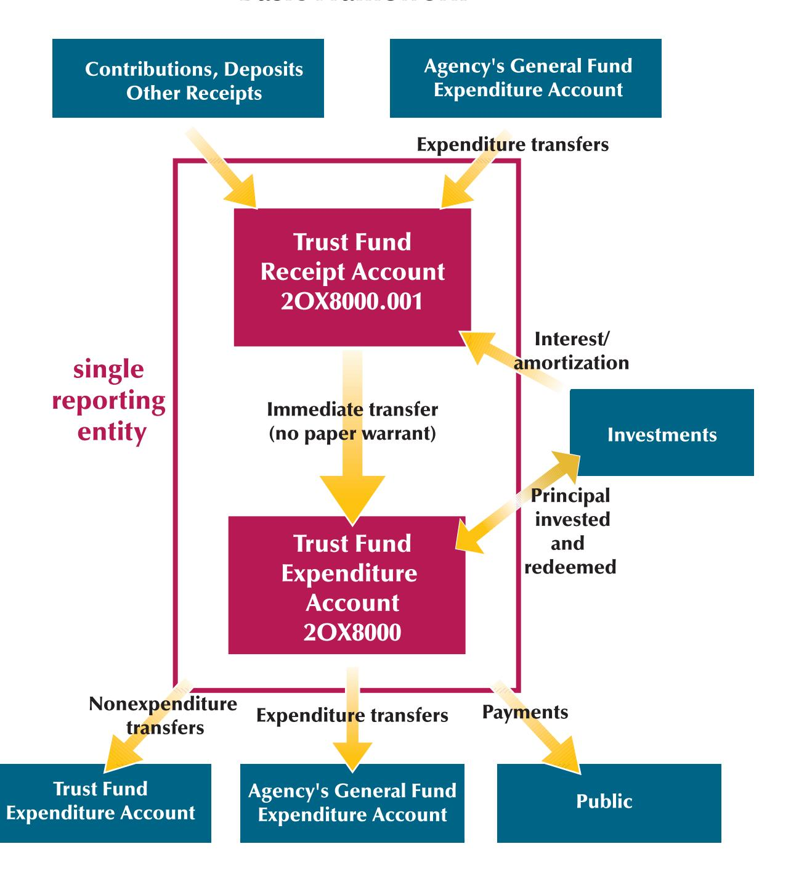
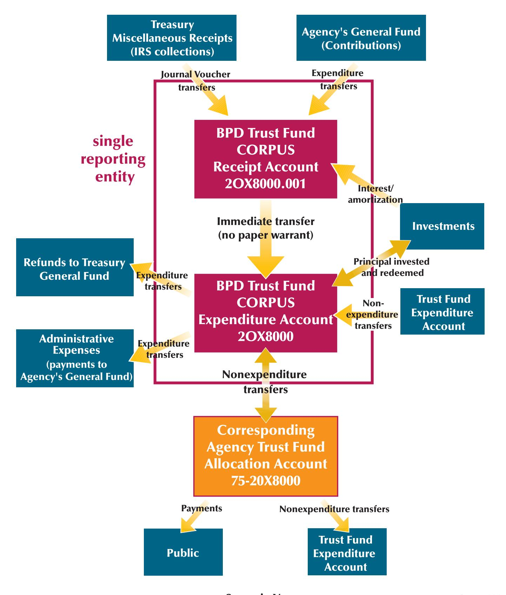
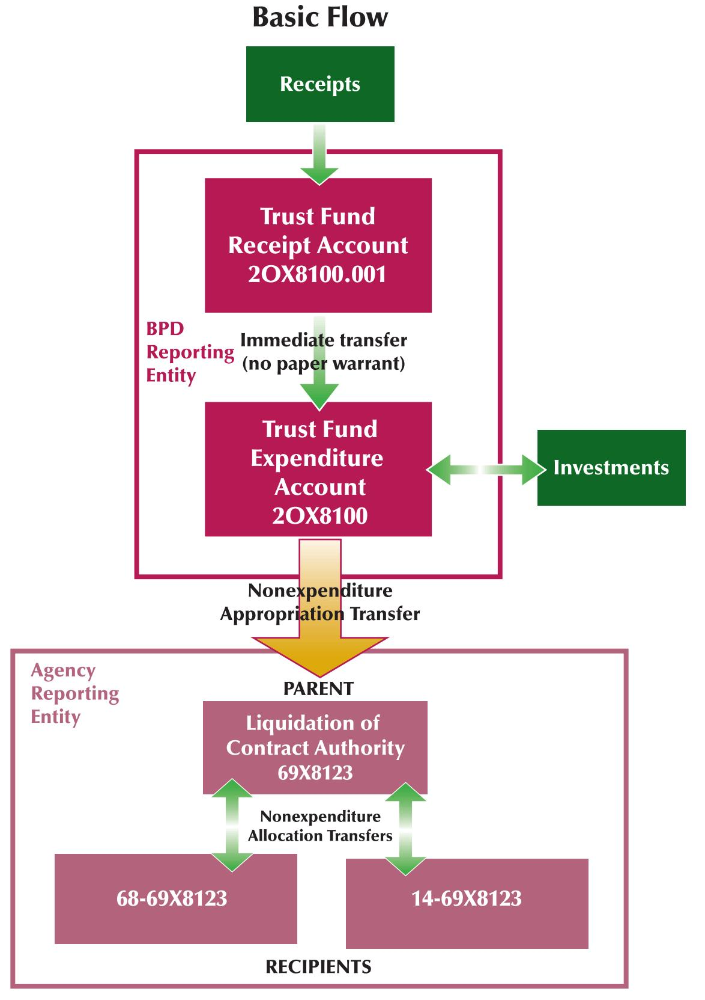
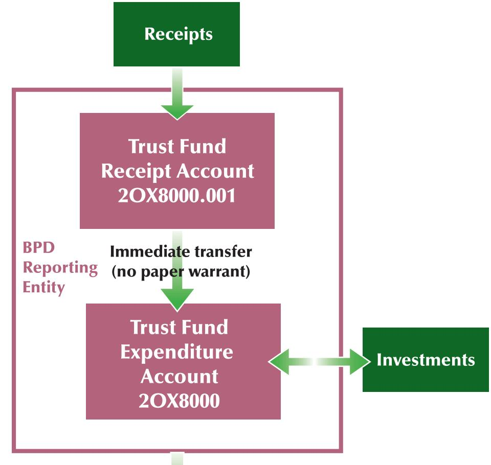
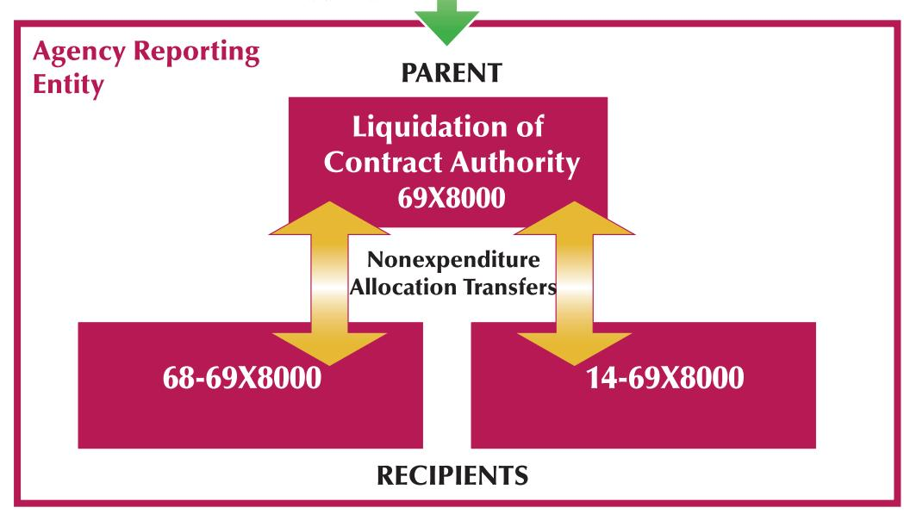

# Agency-Managed Trust Funds Basic Framework

V June 2001

# **Treasury-Managed Trust Fund Allocation Accounts**

#### **Basic Framework**

Scenario V June 2001

# Appropriations to Liquidate Contract Authority— Funded by Nonexpenditure Transfers

Scenario VII June 2001

## **Transfers of Contract Authority**

## **Basic Flow**

### Nonexpenditure Appropriation Transfers

**Scenario VIII**