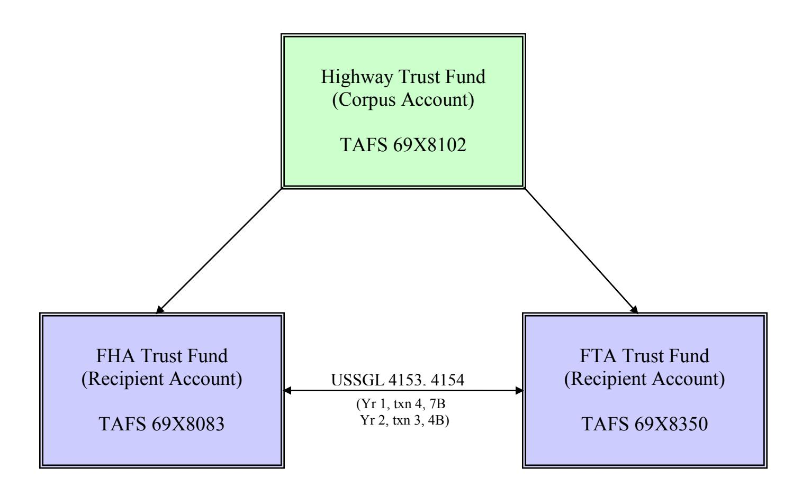

### **Trust Fund Transfers of Contract Authority – Nonallocation Transfers**

**Guidance Specific to the Highway Trust Fund (69X8102) and**

**Recipient Trust Funds (69X8083 and 69X8350)**

### **PREPARED BY:**

**UNITED STATES STANDARD GENERAL LEDGER DIVISION ACCOUNTING SYSTEMS AND STANDARDS DIRECTORATE GOVERNMENTWIDE ACCOUNTING BUREAU OF THE FISCAL SERVICE DEPARTMENT OF THE TREASURY**

| Version Number | Date     | Description of Change Effective USSGL |                 |
|-------------------|----------|---------------------------------------------|-----------------|
| 1.0               | 6/6/2011 | Original version                         | TFM S2 11-01 |

#### **Background**

This scenario illustrates accounting and reporting of contract authority activity pertaining to the Department of Transportation's Highway Trust Fund (HTF). The Highway Trust Fund consists of a Treasury Appropriation Fund Symbol (TAFS) "corpus" account, and several "recipient" accounts. Only two of the HTF recipient accounts are subject to the guidance in this scenario, and they are listed below. Note, transactions for the HTF "corpus" account are NOT illustrated in this scenario, only the "recipient" accounts are illustrated.

#### Highway Trust Fund TAFS "corpus" account

• 69X8102, "Highway Trust Fund"

#### Highway Trust Fund TAFS "recipient" accounts (non-allocation)

- 69X8083, "Federal-Aid Highways (Liquidation of Contract Authorization), Federal Highway Administration"
- 69X8350, "Formula and Bus Grants, Liquidation of Contract Authorization, Federal Transit Administration, Transportation"

The HTF corpus account is managed by the Bureau of the Fiscal Service (Fiscal Service). The Fiscal Service is responsible for recording the collection and investment of receipts. For example, the Fiscal Service-managed HTF collects earmarked taxes on gasoline and other fuels. The HTF does not have any type of budget authority including contract authority. It does not maintain, track, or record contract authority. Instead, it is the primary **source of funding** for the recipient accounts.

The HTF recipient accounts are managed by the Department of Transportation. All of the contract authority and appropriations to liquidate contract authority reside with the recipient accounts. The recipient TAFS is the account in which contract authority and appropriation to liquidate contract authority are granted and program activities are managed. It captures the activity pertaining to contract authority, the appropriations to liquidate contract authority, as well as obligations and disbursements of the fund. Note that while the appropriation to liquidate contract authority is granted in appropriation acts (for the HTF), the funds (i.e. Fund Balance With Treasury) will not be transferred via SF 1151: Nonexpenditure Transfer Authorization until actually needed for disbursement*.* This is for cash management purposes so that the interest earned on investments in the HTF corpus account is maximized.

In some instances, however, the recipient accounts are also granted the authority to *transfer contract authority* from one recipient account to another, as well as the authority to *transfer appropriations to liquidate contract authority*. The transfer of contract

authority can be in the form of either allocation or nonallocation transfers, each resulting in different budgetary accounting and reporting on the SF 133/P&F. This scenario, which pertains only to the 3 TAFS listed previously, illustrates the *nonallocation transfers of contract authority*, and required the establishment of two new USSGL accounts. See the account proposals and justifications that follow.

This scenario follows USSGL TFM S2 11-01 (June 2011) fiscal 2011 crosswalks.

# **Basic Illustration of Trust Fund Flows**

#### **NEW USSGL ACCOUNTS FOR FISCAL 2012**:

**Account Number**: 4153

**Account Title**: Transfers of Contract Authority - Nonallocation

**Normal Balance**: Debit

**Definition**: The amount of contract authority transferred between two nonallocation Treasury Appropriation Fund Symbols. This occurs before the actual transfer of funds, which will later be accomplished as a nonexpenditure nonallocation transfer. Only the Department of Transportation may use this account. Although the normal balance for this account is debit, it is acceptable for this account to have a credit balance. This account is reduced at yearend by the amount of appropriations received to liquidate contract authority – nonallocation – transferred. This account does not close at yearend.

**Justification**: To differentiate transfers of contract authority between those that are accomplished as allocation transfers (USSGL account 4137) from and those that are accomplished as nonallocation transfers (USSGL 4153).

**Account Number**: 4154

**Account Title**: Appropriation To Liquidate Contract Authority – Nonallocation – Transferred

**Normal Balance**: Debit

**Definition**: The amount of liquidating appropriations received during the fiscal year to fund contract authority transferred from one nonallocation Treasury Appropriation Fund Symbol to another. The transfer is accomplished via SF 1151: Nonexpenditure Transfer Authorization. Only the Department of Transportation may use this account. Although the normal balance for this account is debit, it is acceptable for this account to have a credit balance.

**Justification**: To capture the nonexpenditure transfer of appropriations to liquidate contract authority.

|         | Impact on FACTS II Attribute Table Fiscal 2012 |        |        |      |                  |       |       |      |     |        |       |           |
|---------|------------------------------------------------|--------|--------|------|------------------|-------|-------|------|-----|--------|-------|-----------|
| USSGL   |                                                |        |        |      |                  |       |       |      |     |        |       |           |
| Account | USSGL Account Attributes                       |        |        |      |                  |       |       |      |     |        |       |           |
|         |                                                |        |        |      |                  | Dir   | Dir   | Year |     |        |       |           |
|         | Normal                                         | Debit/ | Begin/ | Auth | BEA              | Trans | Trans | of   | PY  | TAFS   | Fund  |           |
|         | Balance                                        | Credit | End    | Type | Cat 1 | Agy   | Acct  | BA   | Adj | Status | Type  | Def/Indef |
| 4153    | D                                              | Y      | В      |      |                  | Y     | Y     | Y    | Y   | U      | $Y^2$ | Y         |
| 4153    | D                                              | Y      | Е      |      |                  | Y     | Y     | Y    | Y   | U      | $Y^2$ | Y         |
| 4154    | D                                              | Y      | Е      |      |                  |       |       |      | Y   | U      | $Y^2$ | Y         |

|         | Impact on USSGL Crosswalks                                        |       |         |          |                     |                   |            |         |  |  |  |  |
|---------|-------------------------------------------------------------------|-------|---------|----------|---------------------|-------------------|------------|---------|--|--|--|--|
|         | Fiscal 2012                                                       |       |         |          |                     |                   |            |         |  |  |  |  |
|         | Stmt of Stmt of                                                   |       |         |          |                     |                   |            |         |  |  |  |  |
| USSGL   | SF 133/                                                           | USSGL | Balance | Stmt of  | Changes in          | Stmt of           | Budgetary  | Reclass |  |  |  |  |
| Account | P&F                                                               | 2108  | Sheet   | Net Cost | <b>Net Position</b> | <b>Cust Activ</b> | Resources  | Stmts   |  |  |  |  |
| 4153    | Lines 1000, 1020 3 1013 "BAL" 1610/1611 "NEW" | Col 7 | n/a     | n/a      | n/a                 | n/a               | Lines 1, 4 | n/a     |  |  |  |  |
| 4154    | Lines 1020 1137                                             | Col 7 | n/a     | n/a      | n/a                 | n/a               | Line 6     | n/a     |  |  |  |  |

&lt;sup>1 BEA Category is not required in FACTS II; however, BEA Category for USSGL account 4153 pertains to domain value "M" Mandatory only, and USSGL account 4154 pertains to domain value "D" Discretionary only.

2 Limited to domain value "7" Trust (non-revolving) Fund only

3 SF 133/P&F line 1013 is a projected new line. Refer to OMB Circular No. A-11 (2011 release) for actual line number and title.

### **Listing of USSGL Accounts Used in This Scenario**

| Account     |                                                                                         |
|-------------|-----------------------------------------------------------------------------------------|
| Number      | Account Name                                                                            |
| Budgetary   |                                                                                         |
| 4126        | Amounts Appropriated From Specific Invested TAFS – Receivable                        |
| 4131        | Current-Year Contract Authority Realized                                                |
| 4135        | Contract Authority Liquidated                                                           |
| 4136        | Contract Authority to be Liquidated by Trust Funds                                   |
| 4138        | Appropriation to Liquidate Contract Authority                                           |
| 4139        | Contract Authority Carried Forward                                                      |
| 4153        | Transfers of Contract Authority - Nonallocation                                      |
| 4154        | Appropriation to Liquidate Contract Authority - Nonallocation - Transferred |
| 4170        | Transfers – Current-Year Authority                                                   |
| 4201        | Total Actual Resources – Collected                                                   |
| 4450        | Unapportioned Authority                                                                 |
| 4510        | Apportionments                                                                          |
| 4610        | Allotments – Realized Resources                                                      |
| 4801        | Undelivered Orders - Obligations, Unpaid                                             |
| 4902        | Delivered Orders - Obligations, Paid                                                 |
| Proprietary |                                                                                         |
| 1010        | Fund Balance With Treasury                                                              |
| 1330        | Receivable for Transfers of Currently Invested Balances                                 |
| 2150        | Payable for Transfers of Currently Invested Balances                                    |
| 3310        | Cumulative Results of Operations                                                        |
| 5755        | Nonexpenditure Financing Sources - Transfers-In                                      |
| 5765        | Nonexpenditure Financing Sources - Transfers-Out                                     |
| 6100        | Operating Expenses/Program Costs                                                        |

# **USSGL Scenario**

### **Assumptions Specific to this Scenario**

- Appropriations to liquidate contract authority are classified as discretionary budget authority
- Transfers of contract authority nonallocation are classified as mandatory budget authority
- Beginning trial balances are not applicable in Year 1 of this scenario
- Trust Fund A and Trust Fund B represent the HTF "recipient" accounts 69X8083 and 69X8350. In practice, the activity illustrated in Trust Fund A also occurs in Trust Fund B. Additionally, the transfers that occur from A to B also occur from B to A.
- The HTF "corpus" account 69X8102 is not illustrated in this scenario

### **Illustrative Transactions**

#### **Year 1**

| 1. To record the enactment of public law for new contract authority.                                                             |         |         |      |              |    |    |    |  |  |  |
|-------------------------------------------------------------------------------------------------------------------------------------|---------|---------|------|--------------|----|----|----|--|--|--|
| Trust Fund A                                                                                                                        | DR      | CR      | TC   | Trust Fund B | DR | CR | TC |  |  |  |
| Budgetary Entry 4131 Current-Year Contract Authority Realized 4450 Unapportioned Authority Proprietary Entry None | 500,000 | 500,000 | A166 | N/A          |    |    |    |  |  |  |

| 2.   | To record the apportionment and subsequent allotment of authority. |         |         |      |              |    |    |    |  |  |
|------|--------------------------------------------------------------------|---------|---------|------|--------------|----|----|----|--|--|
|      | Trust Fund A                                                       | DR      | CR      | TC   | Trust Fund B | DR | CR | TC |  |  |
|      | Budgetary Entry                                                    |         |         |      |              |    |    |    |  |  |
| 4450 | Unapportioned Authority                                            | 500,000 |         |      |              |    |    |    |  |  |
|      | 4510 Apportionments                                             |         | 500,000 | A116 |              |    |    |    |  |  |
|      |                                                                    |         |         |      |              |    |    |    |  |  |
| and  |                                                                    |         |         |      |              |    |    |    |  |  |
|      |                                                                    |         |         |      | N/A          |    |    |    |  |  |
| 4510 | Apportionments                                                     | 500,000 |         |      |              |    |    |    |  |  |
|      | 4610 Allotments – Realized                                   |         |         |      |              |    |    |    |  |  |
|      | Resources                                                          |         | 500,000 | A120 |              |    |    |    |  |  |
|      | Proprietary Entry                                                  |         |         |      |              |    |    |    |  |  |
| None |                                                                    |         |         |      |              |    |    |    |  |  |

#### **Year 1**

3. Trust Fund A records an appropriation to liquidate contract authority. The amount is appropriated from the Highway Trust Fund corpus 69X8102 (not illustrated) to Trust Fund A for contract authority to be used in either Trust Fund A or Trust Fund B. (Trust Fund A will later be granted the authority to transfer the appropriation to liquidate contract authority to Trust Fund B to cover obligations when needed for disbursement.) Since the Highway Trust Fund corpus is invested, the actual fund balance will not be transferred from the corpus account to Trust Fund A until funds are needed for disbursement.

| Trust Fund A                                                                                                                                                            | DR      | CR      | TC   | Trust Fund B | DR | CR | TC |
|-------------------------------------------------------------------------------------------------------------------------------------------------------------------------|---------|---------|------|--------------|----|----|----|
| 4 Budgetary Entry 4126 Amounts Appropriated from Specific Invested TAFS – Receivable 4136 Contract Authority to be Liquidated by Trust Funds | 100,000 | 100,000 | A173 | N/A          |    |    |    |
| Proprietary Entry 1330 Receivable for Transfers of Currently Invested Balances 5755 Nonexpenditure Financing Sources - Transfers-In             | 100,000 | 100,000 |      |              |    |    |    |

 4 This transaction represents a receivable from the Highway Trust Fund corpus TAFS 69X8102 (not illustrated).

#### **Year 1**

4. Trust Fund A transfers contract authority to Trust Fund B, prior to the actual transfer of liquidating authority and fund balance. This is based upon legislative guidance. The transfer of contract authority gives Trust Fund B the authority from which to obligate. Trust Fund B must request an SF 1151: Nonexpenditure Transfer Authorization prior to disbursing funds (see transaction #7B).

| Trust Fund A                                                                                                                                              | DR      | CR      | TC   | Trust Fund B                                                                                                                                             | DR      | CR      | TC   |
|-----------------------------------------------------------------------------------------------------------------------------------------------------------|---------|---------|------|----------------------------------------------------------------------------------------------------------------------------------------------------------|---------|---------|------|
| Budgetary Entry 4610 Allotments – Realized Resources 4153 Transfers of Contract Authority - Nonallocation (NEW)5               | 100,000 | 100,000 | TC   | Budgetary Entry 4153 Transfers of Contract Authority – Nonallocation (NEW) 4450 Unapportioned Authority                             | 100,000 | 100,000 | TC   |
| Proprietary Entry 5765 Nonexpenditure Financing Sources - Transfers-Out 2150 Payable for Transfers of Currently Invested Balances | 100,000 | 100,000 | A163 | Proprietary Entry 1330 Receivable for Transfers of Currently Invested Balances 5755 Nonexpenditure Financing Sources - Transfers-In | 100,000 | 100,000 | A161 |

 5 In this transaction, Trust Fund A is transferring contract authority from current-year authority (Year Of Budget Authority Code domain value "NEW"). If the transfer had represented a transfer of contract authority from prior-year balances instead, domain value "BAL" would have been assigned.

#### **Year 1**

5. To record the apportionment and subsequent allotment of authority in Trust Fund B, related to the transfer-in of contract authority received in #4.

| Trust Fund A | DR | CR | TC | Trust Fund B                                                                 | DR      | CR      | TC   |
|--------------|----|----|----|------------------------------------------------------------------------------|---------|---------|------|
| N/A          |    |    |    | Budgetary Entry 4450 Unapportioned Authority 4510 Apportionments | 100,000 | 100,000 | A116 |
|              |    |    |    | and                                                                          |         |         |      |
|              |    |    |    | 4510 Apportionments 4610 Allotments – Realized Resources      | 100,000 | 100,000 | A120 |
|              |    |    |    | Proprietary Entry None                                                    |         |         |      |

| 6. To record current-year undelivered ORDER A in Trust Fund B. |    |    |    |                                                                                                                                                   |        |        |      |  |  |  |
|-------------------------------------------------------------------------|----|----|----|---------------------------------------------------------------------------------------------------------------------------------------------------|--------|--------|------|--|--|--|
| Trust Fund A                                                            | DR | CR | TC | Trust Fund B                                                                                                                                      | DR     | CR     | TC   |  |  |  |
| N/A                                                                     |    |    |    | Budgetary Entry 4610 Allotments – Realized Resources 4801 Undelivered Orders - Obligations, Unpaid Proprietary Entry None | 70,000 | 70,000 | B306 |  |  |  |

#### **Year 1**

- 7. Trust Fund B is ready to make a payment and disbursement of funds related to ORDER A, but first must request a nonexpenditure transfer of funds from Trust Fund A. However, in order to transfer funds to Trust Fund B, Trust Fund A must first request a nonexpenditure transfer of funds from the Highway Trust Fund corpus TAFS (69X8102) (corpus not illustrated), **representing the appropriation to liquidate contract authority** (7A). The subsequent transfer of funds from Trust Fund A to B will then represent the *transfer of* **the appropriation to liquidate contract authority** (7B).
- 7A. To record the nonexpenditure transfer-in (SF 1151) of funds from the Highway Trust Fund corpus (not illustrated) to Trust Fund A. This represents the **appropriation to liquidate contract authority**. It reduces the receivable amount of the appropriation of contract authority to be liquidated established in transaction #3.

| Trust Fund A                          | DR     | CR     | TC   | Trust Fund B | DR | CR | TC |
|---------------------------------------|--------|--------|------|--------------|----|----|----|
| Budgetary Entry                       |        |        |      |              |    |    |    |
| 4136 Contract Authority to be      |        |        |      |              |    |    |    |
| Liquidated by Trust Funds             | 70,000 |        |      |              |    |    |    |
| 4126 Amounts Appropriated          |        |        |      |              |    |    |    |
| From Specific Invested                |        |        |      |              |    |    |    |
| TAFS – Receivable                  |        | 70,000 |      |              |    |    |    |
| and                                   |        |        |      |              |    |    |    |
| 4138 Appropriation to Liquidate    |        |        |      |              |    |    |    |
| Contract Authority                    | 70,000 |        | A175 | N/A          |    |    |    |
| 4135 Contract Authority            |        |        |      |              |    |    |    |
| Liquidated                            |        | 70,000 |      |              |    |    |    |
| Proprietary Entry                  |        |        |      |              |    |    |    |
| 1010 Fund Balance With Treasury | 70,000 |        |      |              |    |    |    |
| 1330 Receivable for Transfers      |        |        |      |              |    |    |    |
| of Currently Invested                 |        |        |      |              |    |    |    |
| Balances                              |        | 70,000 |      |              |    |    |    |

#### **Year 1**

| 7B. | To record the immediate nonexpenditure transfer (SF 1151)                                                                              |  | of funds from Trust Fund A to B. This represents the transfer of |  | the |
|-----|----------------------------------------------------------------------------------------------------------------------------------------|--|------------------------------------------------------------------|--|-----|
|     | appropriation to liquidate contract authority. It is directly related to transaction #4: it reduces the proprietary payable/receivable |  |                                                                  |  |     |
|     | (2150/1330), and it is related to (but does not reduce) the budgetary transfer of contract authority (USSGL 4153). USSGL 4153 is not   |  |                                                                  |  |     |
|     | reduced until closing.                                                                                                                 |  |                                                                  |  |     |

| Trust Fund A                        | DR     | CR     | TC   | Trust Fund B                                  | DR     | CR     | TC   |
|-------------------------------------|--------|--------|------|-----------------------------------------------|--------|--------|------|
| Budgetary Entry                     |        |        |      | Budgetary Entry                               |        |        |      |
| 4154 Appropriation to Liquidate  |        |        |      | 4170 Transfers – Current-Year Authority | 70,000 |        |      |
| Contract Authority -                |        |        |      | 4154 Appropriation to                      |        |        |      |
| Nonallocation – Transferred   | 70,000 |        |      | Liquidate Contract                            |        |        |      |
| 4170 Transfers – Current-Year |        |        |      | Authority – Nonallocation                  |        |        |      |
| Authority                           |        | 70,000 | TC   | - Transferred                              |        | 70,000 | TC   |
|                                     |        |        | A160 |                                               |        |        | A157 |
| Proprietary Entry                   |        |        |      | Proprietary Entry                             |        |        |      |
| 2150 Payable for Transfers of |        |        |      | 1010 Fund Balance With Treasury            | 70,000 |        |      |
| Currently Invested Balances         | 70,000 |        |      | 1330 Receivable for Transfers of           |        |        |      |
| 1010 Fund Balance With           |        |        |      | Currently Invested Balances                   |        | 70,000 |      |
| Treasury                            |        | 70,000 |      |                                               |        |        |      |

7C. To record payment and disbursement of funds from Trust Fund B, related to the ORDER A obligation established in #6.

| Trust Fund A | DR | CR | TC                                                                                                                           | Trust Fund B                                                                                           | DR     | CR     | TC |
|--------------|----|----|------------------------------------------------------------------------------------------------------------------------------|--------------------------------------------------------------------------------------------------------|--------|--------|----|
| N/A          |    |    | Budgetary Entry 4801 Undelivered Orders - Obligations, Unpaid 4902 Delivered Orders - Obligations, Paid | 70,000                                                                                                 | 70,000 | B107   |    |
|              |    |    |                                                                                                                              | Proprietary Entry 6100 Operating Expenses/Program Costs 1010 Fund Balance With Treasury | 70,000 | 70,000 |    |

#### **Year 1**

| Preclosing Adjusted Trial Balances                                            |         |                    |                                                                                              |         |         |  |  |  |  |
|-------------------------------------------------------------------------------|---------|--------------------|----------------------------------------------------------------------------------------------|---------|---------|--|--|--|--|
| Trust Fund A                                                                  | Debit   | Credit             | Trust Fund B                                                                                 | Debit   | Credit  |  |  |  |  |
| Budgetary                                                                     |         |                    | Budgetary                                                                                    |         |         |  |  |  |  |
| 4126 Amounts Appropriated From Specific Invested TAFS – Receivable      | 30,000  |                    | 4153 Transfers of Contract Authority - Nonallocation (NEW)                             | 100,000 |         |  |  |  |  |
| 4131 Current-Year Contract Authority Realized                              | 500,000 |                    | 4154 Appropriation to Liquidate Contract Authority - Nonallocation - Transferred |         | 70,000  |  |  |  |  |
| 4135 Contract Authority Liquidated                                            |         | 70,000             | 4170 Transfers – Current-Year Authority                                                   | 70,000  |         |  |  |  |  |
| 4136 Contract Authority to be Liquidated by Trust Funds                    |         | 30,000             | 4450 Unapportioned Authority                                                                 |         | 0       |  |  |  |  |
| 4138 Appropriation to Liquidate Contract Authority                         | 70,000  |                    | 4510 Apportionments                                                                          |         | 0       |  |  |  |  |
| 4153 Transfers of Contract Authority - Nonallocation (NEW)              |         | 100,000            | 4610 Allotments – Realized Resources                                                      |         | 30,000  |  |  |  |  |
| 4154 Appropriation to Liquidate Contract Authority - Nonallocation - |         |                    | 4801 Undelivered Orders - Obligations, Unpaid                                          |         | 0       |  |  |  |  |
| Transferred                                                                   | 70,000  |                    |                                                                                              |         |         |  |  |  |  |
| 4170 Transfers – Current-Year Authority                                    |         | 70,000             | 4902 Delivered Orders - Obligations, Paid                                                 |         | 70,000  |  |  |  |  |
| 4450 Unapportioned Authority                                                  |         | 0                  |                                                                                              |         |         |  |  |  |  |
| 4510 Apportionments                                                           |         | 0                  |                                                                                              |         |         |  |  |  |  |
| 4610 Allotments – Realized Resources Total                              | 670,000 | 400,000 670,000 | Total                                                                                        | 170,000 | 170,000 |  |  |  |  |
|                                                                               |         |                    |                                                                                              |         |         |  |  |  |  |
| Proprietary                                                                   |         |                    | Proprietary                                                                                  |         |         |  |  |  |  |
| 1010 Fund Balance With Treasury                                            | 0       |                    | 1010 Fund Balance With Treasury                                                           | 0       |         |  |  |  |  |
| 1330 Receivable for Transfers of Currently Invested Balances               | 30,000  |                    | 1330 Receivable for Transfers of Currently Invested Balances                              | 30,000  |         |  |  |  |  |

| 2150 Payable for Transfers of |         |         | 5755 Nonexpenditure Financing         |        |         |
|----------------------------------|---------|---------|---------------------------------------|--------|---------|
| Currently Invested Balances      |         | 30,000  | Sources - Transfers-In             |        | 100,000 |
| 5755 Nonexpenditure Financing    |         |         |                                       |        |         |
| Sources - Transfers-In        |         | 100,000 | 6100 Operating Expenses/Program Costs | 70,000 |         |
| 5765 Nonexpenditure Financing    |         |         |                                       |        |         |
| Sources - Transfers-Out       | 100,000 |         |                                       |        |         |
| Total                            | 130,000 | 130,000 | Total                                 | 100,00 | 100,000 |

### **CLOSING ENTRIES**

#### **Year 1**

| C1. To record the consolidation of actual net-funded resources.                                                                                              |        |        |      |                                                                                                                                                   |        |        |      |  |  |
|-----------------------------------------------------------------------------------------------------------------------------------------------------------------|--------|--------|------|---------------------------------------------------------------------------------------------------------------------------------------------------|--------|--------|------|--|--|
| Trust Fund A                                                                                                                                                    | DR     | CR     | TC   | Trust Fund B                                                                                                                                      | DR     | CR     | TC   |  |  |
| Budgetary Entry 4170 Transfers – Current-Year Authority 4138 Appropriation to Liquidate Contract Authority Proprietary Entry None | 70,000 | 70,000 | F302 | Budgetary Entry 4201 Total Actual Resources – Collected 4170 Transfers – Current Year Authority Proprietary Entry None | 70,000 | 70,000 | F302 |  |  |

#### **Year 1**

| C2. To record the closing of fiscal-year contract authority.                                                                                                                                     |                   |         |      |              |    |    |    |  |  |  |
|-----------------------------------------------------------------------------------------------------------------------------------------------------------------------------------------------------|-------------------|---------|------|--------------|----|----|----|--|--|--|
| Trust Fund A                                                                                                                                                                                        | DR                | CR      | TC   | Trust Fund B | DR | CR | TC |  |  |  |
| Budgetary Entry 4135 Contract Authority Liquidated 4139 Contract Authority Carried Forward 4131 Current-Year Contract Authority Realized Proprietary Entry None | 70,000 430,000 | 500,000 | F304 | N/A          |    |    |    |  |  |  |

| C3. To record the closing of appropriations to liquidate contract authority - transferred.                                                                                                                 |        |        |      |                                                                                                                                                                                                                  |        |        |       |  |  |
|------------------------------------------------------------------------------------------------------------------------------------------------------------------------------------------------------------------|--------|--------|------|------------------------------------------------------------------------------------------------------------------------------------------------------------------------------------------------------------------|--------|--------|-------|--|--|
| Trust Fund A                                                                                                                                                                                                     | DR     | CR     | TC   | Trust Fund B                                                                                                                                                                                                     | DR     | CR     | TC    |  |  |
| Budgetary Entry 4153 Transfers of Contract Authority – Nonallocation 4154 Appropriation to Liquidate Contract Authority - Nonallocation - Transferred Proprietary Entry None | 70,000 | 70,000 | F305 | Budgetary Entry 4154 Appropriation to Liquidate Contract Authority - Nonallocation – Transferred 4153 Transfers of Contract Authority - Nonallocation Proprietary Entry None | 70,000 | 70,000 | F305R |  |  |

#### **Year 1**

| C4. To record the closing of unobligated balances in programs subject to apportionment to unapportioned authority.               |         |         |      |                                                                                                                                     |         |         |      |  |
|-------------------------------------------------------------------------------------------------------------------------------------|---------|---------|------|-------------------------------------------------------------------------------------------------------------------------------------|---------|---------|------|--|
| Trust Fund A                                                                                                                        | DR      | CR      | TC   | Trust Fund B                                                                                                                        | DR      | CR      | TC   |  |
| Budgetary Entry 4610 Allotments – Realized Resources 4450 Unapportioned Authority Proprietary Entry None | 400,000 | 400,000 | F308 | Budgetary Entry 4610 Allotments – Realized Resources 4450 Unapportioned Authority Proprietary Entry None | 110,000 | 110,000 | F308 |  |

| C5. To record the closing of paid delivered orders to total actual resources. |    |    |    |                                                                                                                        |        |        |      |  |
|----------------------------------------------------------------------------------|----|----|----|------------------------------------------------------------------------------------------------------------------------|--------|--------|------|--|
| Trust Fund A                                                                     | DR | CR | TC | Trust Fund B                                                                                                           | DR     | CR     | TC   |  |
| Budgetary Entry None Proprietary Entry None                             |    |    |    | Budgetary Entry 4902 Delivered Orders - Obligations, Paid 4201 Total Actual Resources – Collected | 70,000 | 70,000 | F314 |  |
|                                                                                  |    |    |    | Proprietary Entry None                                                                                              |        |        |      |  |

#### **Year 1**

| C6. To record the closing of revenue, expense, and other financing source accounts to cumulative results of operations.                                                     |         |         |      |                                                                                                                                                                                                                |         |                  |            |  |  |
|--------------------------------------------------------------------------------------------------------------------------------------------------------------------------------|---------|---------|------|----------------------------------------------------------------------------------------------------------------------------------------------------------------------------------------------------------------|---------|------------------|------------|--|--|
| Trust Fund A                                                                                                                                                                   | DR      | CR      | TC   | Trust Fund B DR CR                                                                                                                                                                                       |         |                  |            |  |  |
| Budgetary Entry None Proprietary Entry 5755 Nonexpenditure Financing Sources - Transfers-In 5765 Nonexpenditure Financing Sources - Transfers-In | 100,000 | 100,000 | F336 | Budgetary Entry None Proprietary Entry 5755 Nonexpenditure Financing Sources - Transfers-In 3310 Cumulative Results of Operations 6100 Operating Expenses/Program Costs | 100,000 | 30,000 70,000 | TC F336 |  |  |

#### **Year 1**

| Postclosing Trial Balances                                               |         |         |                                                         |        |        |  |  |  |
|--------------------------------------------------------------------------|---------|---------|---------------------------------------------------------|--------|--------|--|--|--|
| Trust Fund A                                                             | Debit   | Credit  | Trust Fund B                                            | Debit  | Credit |  |  |  |
| Budgetary                                                                |         |         | Budgetary                                               |        |        |  |  |  |
| 4126 Amounts Appropriated From Specific Invested TAFS – Receivable | 30,000  |         | 4153 Transfers of Contract Authority - Nonallocation | 30,000 |        |  |  |  |
| 4136 Contract Authority to be Liquidated by Trust Funds               |         | 30,000  | 4450 Unapportioned Authority                            |        | 30,000 |  |  |  |
| 4139 Contract Authority Carried Forward                                  | 430,000 |         | Total 30,000                                         |        | 30,000 |  |  |  |
| 4153 Transfers of Contract Authority -                                   |         |         |                                                         |        |        |  |  |  |
| Nonallocation                                                            |         | 30,000  |                                                         |        |        |  |  |  |
| 4450 Unapportioned Authority                                             |         | 400,000 |                                                         |        |        |  |  |  |
| Total                                                                    | 460,000 | 460,000 |                                                         |        |        |  |  |  |
|                                                                          |         |         |                                                         |        |        |  |  |  |
| Proprietary                                                              |         |         | Proprietary                                             |        |        |  |  |  |
| 1330 Receivable for Transfers of                                         |         |         | 1330 Receivable for Transfers of                        |        |        |  |  |  |
| Currently Invested Balances                                              | 30,000  |         | Currently Invested Balances                             | 30,000 |        |  |  |  |
| 2150 Payable for Transfers of                                         |         |         |                                                         |        |        |  |  |  |
| Currently Invested Balances                                              |         | 30,000  | 3310 Cumulative Results of Operations                   |        | 30,000 |  |  |  |
| Total                                                                    | 30,000  | 30,000  | Total                                                   | 30,000 | 30,000 |  |  |  |

**Year 1**

### **SF 133 STATEMENT OF BUDGETARY EXECUTION AND BUDGETARY RESOURCES and PROGRAM AND FINANCING (P&F) SCHEDULE**

|                                                                           | Trust    | Trust    | Trust    | Trust    |
|---------------------------------------------------------------------------|----------|----------|----------|----------|
|                                                                           | Fund A   | Fund A   | Fund B   | Fund B   |
|                                                                           |          |          |          |          |
|                                                                           | SF133    | P&F      | SF133    | P&F      |
|                                                                           | Line     | Line     | Line     | Line     |
| BUDGETARY RESOURCES                                                       |          |          |          |          |
| Unobligated balance:                                                      |          |          |          |          |
| 1000 Unobligated balance brought forward, October 1                       |          |          |          |          |
|                                                                           |          |          |          |          |
| Budget Authority:                                                         |          |          |          |          |
| Appropriations:                                                           |          |          |          |          |
| Discretionary:                                                            |          |          |          |          |
| 1102 Appropriation (trust fund) (4126E-B, 4138E)                          | 100,000  | 100,000  |          |          |
|                                                                           |          |          |          |          |
| Non-expenditure transfers:                                                |          |          |          |          |
| 1120 Appropriations transferred to other accounts (-) (4170E)             |          |          |          |          |
| (discretionary)                                                           | (70,000) | (70,000) |          |          |
| 1121 Appropriations transferred from other accounts (4170E)               |          |          |          |          |
| (discretionary)                                                           |          |          | 70,000   | 70,000   |
|                                                                           |          |          |          |          |
| Adjustments:                                                              |          |          |          |          |
| 1137 Appropriations applied to liquidate contract authority (-) (4135E,   |          |          |          |          |
| 4136E-B, 4154E)                                                           | 30,000)  | (30,000) | (70,000) | (70,000) |
| 1160 Appropriations (total). This line is calculated. Equals sum of lines |          |          |          |          |
| 1100 through 1152 (SF 133) and lines 1100 through 1139 (P&F).             | 0        | 0        | 0        | 0        |
|                                                                           |          |          |          |          |
| Contract authority:                                                       |          |          |          |          |
| Mandatory:                                                                |          |          |          |          |
|                                                                           |          |          |          |          |

| 1600 Contract authority (4131E)                                                 | 500,000   | 500,000   |          |          |
|---------------------------------------------------------------------------------|-----------|-----------|----------|----------|
|                                                                                 |           |           |          |          |
| Nonexpenditure transfers:                                                       |           |           |          |          |
| 1610 Contract authority transferred to other accounts (-) (4153E-B "NEW")    |           |           |          |          |
| (mandatory)                                                                     | (100,000) | (100,000) |          |          |
| 1611 Contact authority transferred from other accounts (4153E-B "NEW")       |           |           |          |          |
| (mandatory)                                                                     |           |           | 100,000  | 100,000  |
| All Accounts:                                                                   |           |           |          |          |
| 1941 Unexpired unobligated balance carried forward, end of year (4610E)      | n/a       | 400,000   | n/a      | 30,000   |
| STATUS OF BUDGETARY RESOURCES                                                   |           |           |          |          |
| Obligations incurred:                                                           |           |           |          |          |
| Direct:                                                                         |           |           |          |          |
| 2001 Category A (by quarter) (4801E-B, 4902E)                                   |           |           | 70,000   | n/a      |
| 2004 Direct obligations (total) This line is calculated. Equals sum of lines |           |           |          |          |
| 2001 through 2003.                                                              |           |           | 70,000   | n/a      |
| Unobligated Balance                                                             |           |           |          |          |
| Apportioned                                                                     |           |           |          |          |
| 2201 Available in the current period (4610E)                                 | 400,000   | n/a       | 30,000   | n/a      |
| 2500 Total budgetary resources (Sum of lines 20012403. Also equals line         |           |           |          |          |
| 1910 of the Schedule of Budgetary Resources)                                    | 400,000   | n/a       | 100,000  | n/a      |
| CHANGE IN OBLIGATED BALANCE                                                     |           |           |          |          |
| Obligated balance, start of year (net):                                         |           |           |          |          |
| 3000 Unpaid obligations, brought forward, October 1 (gross)                     |           |           | 0        | 0        |
| 3030 Obligations incurred, unexpired accounts (4801E-B, 4902E)                  |           |           | 70,000   | 70,000   |
| 3040 Outlays (gross) (-) (4902E)                                             |           |           | (70,000) | (70,000) |
|                                                                                 |           |           |          |          |
| Obligated balance, end of year (net):                                           |           |           |          |          |
| 3090 Unpaid obligations, end of year (gross) (4801E)                         |           |           |          |          |

| 3100 Obligated balance, end of year (net) (calc. lines 3000, 3001, 3010,    |         |         |         |         |
|--------------------------------------------------------------------------------|---------|---------|---------|---------|
| 3011, 3030, 3031, 3040, 3050, 3051, 3060, 3061, 3070, 3071, 3080, and 3081) |         |         |         |         |
|                                                                                |         |         |         |         |
|                                                                                |         |         |         |         |
| BUDGET AUTHORITY AND OUTLAYS, NET                                              |         |         |         |         |
| Mandatory:                                                                     |         |         |         |         |
| Gross budget authority and outlays:                                            |         |         |         |         |
| 4090 Budget authority, gross (This line is calculated. Equals the sum of    |         |         |         |         |
| mandatory budget authority [Lines 1200 through 1252, 1270 through 1273,        |         |         |         |         |
| 1400 through 1430, 1600 through 1631, and 1800 through 1842 (SF 133).          |         |         |         |         |
| Lines 1200 through 1239, 1270 through 1273, 1400 through 1420, 1600            |         |         |         |         |
| through 1622, and 1800 through 1827 (P&F)].)                                   | 400,000 | 400,000 |         |         |
| 4100 Outlays from new mandatory authority (4902E)                        |         |         | 70,000  | 70,000  |
| 4110 Total outlays, gross (4902E)                                              |         |         | 70,000  | 70,000  |
|                                                                                |         |         |         |         |
| 4160 Budget authority, net (mandatory)                                         | 400,000 | 400,000 | 100,000 | 100,000 |
| 4170 Outlays, net (mandatory)                                                  |         |         | 70,000  | 70,000  |
|                                                                                |         |         |         |         |
| 4180 Budget authority, net (discretionary and mandatory)                       | 400,000 | 400,000 | 100,000 | 100,000 |
| 4190 Outlays, net (discretionary and mandatory)                                |         |         | 70,000  | 70,000  |

#### **Year 1**

| USSGL 2108: YEAREND CLOSING STATEMENT                                 |              |              |  |
|--------------------------------------------------------------------------|--------------|--------------|--|
|                                                                          | Trust Fund A | Trust Fund B |  |
| Column 2 Balance of Contract Authority, Treasury Supplied                | 0            | 0            |  |
| Column 3 New Contract Authority (4131E)                                  | 500,000      | 0            |  |
| Column 4 Appropriations to Liquidate (4135E, 4136E-B)                    | 100,000      | 0            |  |
| Column 5 Writeoffs, Restorations or Adjustments                          | 0            | 0            |  |
| Column 6 Balance of Unfunded Contract Authority (4131E, 4135E, 4136E) | 400,000      | 0            |  |
| Column 7 Reimbursements Earned and Refunds (4126E, 4153E, 4154E)         | 0            | 30,000       |  |
| Column 9 Undelivered Orders and Contracts                                | 0            | 0            |  |
| Column 10 Accounts Payable and Other Liabilities                         | 0            | 0            |  |
| Column 11 Unobligated Balance (4610E)                                    | 400,000      | 30,000       |  |
| FACTS II Edit Check 5: Col 5, 6, 7, 8 = Col 9, 10, 11                    | YES          | YES          |  |

#### **Year 1**

| BALANCE SHEET                                                                            |              |              |  |
|------------------------------------------------------------------------------------------|--------------|--------------|--|
|                                                                                          | Trust Fund A | Trust Fund B |  |
| Assets:                                                                                  |              |              |  |
| Intragovernmental:                                                                       |              |              |  |
| 1. Fund Balance With Treasury (Note 3) (1010E)                                           | 0            | 0            |  |
| 3. Accounts Receivable (Note 6) (1330E)                                                  | 30,000       | 30,000       |  |
| 6. Total Intragovernmental (calc.)                                                       | 30,000       | 30,000       |  |
| 15. Total Assets (calc.)                                                                 | 30,000       | 30,000       |  |
| Liabilities:                                                                             |              |              |  |
| Intragovernmental:                                                                       |              |              |  |
| 17. Accounts Payable (2150E)                                                             | 30,000       | 0            |  |
| 20. Total Intragovernmental (calc.)                                                      | 30,000       | 0            |  |
| 28. Total Liabilities (calc.)                                                            | 30,000       | 0            |  |
| Net Position:                                                                            |              |              |  |
| 32. Cumulative Results of Operations – Earmarked Funds (Note 21) (5755E, 5765E, |              |              |  |
| 6100E)                                                                                   | 0            | 30,000       |  |
| 34. Total Net Position (calc.)                                                           | 0            | 30,000       |  |
| 35. Total Liabilities and Net Position (calc.)                                           | 30,000       | 30,000       |  |

#### **Year 1**

| STATEMENT OF NET COST                   |              |              |  |
|-----------------------------------------|--------------|--------------|--|
|                                         | Trust Fund A | Trust Fund B |  |
| Program Costs:                          |              |              |  |
| 1. Gross costs (Note 22) (6100E)        |              | 70,000       |  |
| 3. Net Program Costs (sum of 1 minus 2) |              | 70,000       |  |
| 8. Net cost of operations               |              | 70,000       |  |

#### **Year 1**

| STATEMENT OF CHANGES IN NET POSITION                              |                 |                 |  |
|-------------------------------------------------------------------|-----------------|-----------------|--|
|                                                                   | Trust Fund A    | Trust Fund B    |  |
|                                                                   | All Other Funds | All Other Funds |  |
| Budgetary Financing Sources:                                      |                 |                 |  |
| 8. Transfers-In/Out Without Reimbursement (+/-) (5755E, 5765E) | 0               | 100,000         |  |
|                                                                   |                 |                 |  |
| 14. Total Financing Sources (sum of 4 through 13)                 | 0               | 100,000         |  |
|                                                                   |                 |                 |  |
| 15. Net Cost of Operations (+/-)                                  | 0               | 70,000          |  |
|                                                                   |                 |                 |  |
| 16. Net Change (sum of 14 minus 15)                               | 0               | 30,000          |  |
|                                                                   |                 |                 |  |
| 17. Cumulative Results of Operations (sum of 3 and 16)            | 0               | 30,000          |  |
|                                                                   |                 |                 |  |
| 27. Net Position (sum of 17 and 26)                               | 0               | 30,000          |  |

#### **Year 1**

| STATEMENT OF BUDGETARY RESOURCES                             | Trust Fund A | Trust Fund B |
|--------------------------------------------------------------|--------------|--------------|
| BUDGETARY RESOURCES                                          |              |              |
| 1. Unobligated balance; start of year                        |              |              |
| Brought forward, October 1 (+or-)                      |              |              |
| 3. Budget authority:                                         |              |              |
| A. Appropriation (4126E-B, 4138E)                         | 100,000      |              |
| C. Contract authority (4131E)                                | 500,000      |              |
| 4. Nonexpenditure transfers, net:                            |              |              |
| Actual transfers, budget authority (+or-) (4153E-B, 4170E)   | (170,000)    | 170,000      |
| 6. Permanently not available: (4135E "P", 4136E-B, 4154E) | (30,000)     | (70,000)     |
| 7. Total budgetary resources                                 | 400,000      | 100,000      |
| STATUS OF BUDGETARY RESOURCES                                |              |              |
| 8. Obligations incurred:                                     |              |              |
| A. Direct: (4902E)                                        |              | 70,000       |
| 9. Unobligated balance:                                      |              |              |
| A. Apportioned: (4610E)                                   | 400,000      | 30,000       |
| 11. Total status of budgetary resources                      | 400,000      | 100,000      |
| CHANGE IN OBLIGATED BALANCES                              |              |              |
| 13. Obligations incurred (+) (4902E)                         |              | 70,000       |
| 14. Gross outlays (-) (4902E)                                |              | (70,000)     |
| NET OUTLAYS                                                  |              |              |
| 19. Net Outlays:                                             |              |              |
| A. Gross outlays (+) (4902E)                                 |              | 70,000       |
| D. Net outlays (calc)                                     |              | 70,000       |

#### **Year 2**

1. To record the apportionment and subsequent allotment of authority in Trust Fund B, related to the transfer-in of contract authority received in Year 1.

| Trust Fund A | DR | CR | TC | Trust Fund B                                                                 | DR     | CR               | TC   |
|--------------|----|----|----|------------------------------------------------------------------------------|--------|------------------|------|
| N/A          |    |    |    | Budgetary Entry 4450 Unapportioned Authority 4510 Apportionments | 30,000 | 30,000 30,000 | A116 |
|              |    |    |    | and                                                                          |        |                  |      |
|              |    |    |    | 4510 Apportionments 4610 Allotments – Realized Resources      | 30,000 |                  | A120 |
|              |    |    |    | Proprietary Entry None                                                    |        |                  |      |

| 2. | To record current-year undelivered ORDER X in Trust Fund B. |    |    |    |                                                                                                                                                   |        |        |      |  |  |
|----|-------------------------------------------------------------|----|----|----|---------------------------------------------------------------------------------------------------------------------------------------------------|--------|--------|------|--|--|
|    | Trust Fund A                                                | DR | CR | TC | Trust Fund B                                                                                                                                      | DR     | CR     | TC   |  |  |
|    | N/A                                                         |    |    |    | Budgetary Entry 4610 Allotments – Realized Resources 4801 Undelivered Orders - Obligations, Unpaid Proprietary Entry None | 20,000 | 20,000 | B306 |  |  |

#### **Year 2**

3. Trust Fund B has determined that it needs to transfer contract authority back to Trust Fund A, from balances received in the previous year.

| Trust Fund A                                                                                                                                          | DR    | CR    | TC   | Trust Fund B                                                                                                                                                       | DR    | CR    | TC   |
|-------------------------------------------------------------------------------------------------------------------------------------------------------|-------|-------|------|--------------------------------------------------------------------------------------------------------------------------------------------------------------------|-------|-------|------|
| Budgetary Entry 4153 Transfers of Contract Authority – Nonallocation (BAL) 4450 Unapportioned Authority                       | 5,000 | 5,000 | TC   | Budgetary Entry 4610 Allotments – Realized Resources 4153 Transfers of Contract Authority - Nonallocation (BAL)                         | 5,000 | 5,000 | TC   |
| Proprietary Entry 2150 Payable for Transfers of Currently Invested Balances 5755 Nonexpenditure Financing Sources - Transfers-In | 5,000 | 5,000 | A167 | Proprietary Entry 5765 Nonexpenditure Financing Sources - Transfers-Out 1330 Receivable for Transfers of Currently Invested Balances | 5,000 | 5,000 | A165 |

#### **Year 2**

- 4. Trust Fund B is ready to make a payment and disbursement of funds related to ORDER X, but first must request a nonexpenditure transfer of funds from Trust Fund A. However, in order to transfer funds to Trust Fund B, Trust Fund A must first request a nonexpenditure transfer of funds from the Highway Trust Fund corpus TAFS (69X8102) (corpus not illustrated), **representing the appropriation to liquidate contract authority** (4A). The subsequent transfer of funds from Trust Fund A to B will then represent the *transfer of* **the appropriation to liquidate contract authority** (4B).
- 4A. To record the nonexpenditure transfer-in (SF 1151) of funds from the Highway Trust Fund corpus (not illustrated) to Trust Fund A. This represents the **appropriation to liquidate contract authority**. It reduces the receivable amount of the appropriation of contract authority to be liquidated that was recorded in year 1.

| Trust Fund A                                               | DR     | CR     | TC   | Trust Fund B | DR | CR | TC |
|------------------------------------------------------------|--------|--------|------|--------------|----|----|----|
| Budgetary Entry                                            |        |        |      |              |    |    |    |
| 4136 Contract Authority to be                           |        |        |      |              |    |    |    |
| Liquidated by Trust Funds                                  | 20,000 |        |      |              |    |    |    |
| 4126 Amounts Appropriated                               |        |        |      |              |    |    |    |
| From Specific Invested                                     |        |        |      |              |    |    |    |
| TAFS – Receivable                                       |        | 20,000 |      |              |    |    |    |
| and                                                        |        |        |      |              |    |    |    |
| 4138 Appropriation to Liquidate                         |        |        |      |              |    |    |    |
| Contract Authority                                         | 20,000 |        | A175 | N/A          |    |    |    |
| 4135 Contract Authority                                 |        |        |      |              |    |    |    |
| Liquidated                                                 |        | 20,000 |      |              |    |    |    |
|                                                            |        |        |      |              |    |    |    |
| Proprietary Entry 1010 Fund Balance With Treasury | 20,000 |        |      |              |    |    |    |
| 1330 Receivable for Transfers                           |        |        |      |              |    |    |    |
| of Currently Invested                                      |        |        |      |              |    |    |    |
| Balances                                                   |        | 20,000 |      |              |    |    |    |

#### **Year 2**

4B. To record the immediate nonexpenditure transfer (SF 1151) of funds from Trust Fund A to B. This represents the *transfer of* **the appropriation to liquidate contract authority**. It is related to the balances of contract authority transferred in year 1.

| Trust Fund A                         | DR     | CR     | TC   | Trust Fund B                                  | DR     | CR     | TC   |
|--------------------------------------|--------|--------|------|-----------------------------------------------|--------|--------|------|
| Budgetary Entry                      |        |        |      | Budgetary Entry                               |        |        |      |
| 4154 Appropriation to Liquidate   |        |        |      | 4170 Transfers – Current-Year Authority | 20,000 |        |      |
| Contract Authority -              |        |        |      | 4154 Appropriation to                      |        |        |      |
| Nonallocation – Transferred    | 20,000 |        |      | Liquidate Contract                            |        |        |      |
| 41706 Transfers – Current-Year |        |        |      | Authority – Nonallocation                  |        |        |      |
| Authority                            |        | 20,000 | TC   | - Transferred                              |        | 20,000 | TC   |
|                                      |        |        | A160 |                                               |        |        | A157 |
| Proprietary Entry                    |        |        |      | Proprietary Entry                             |        |        |      |
| 2150 Payable for Transfers of  |        |        |      | 1010 Fund Balance With Treasury            | 20,000 |        |      |
| Currently Invested Balances          | 20,000 |        |      | 1330 Receivable for Transfers of           |        |        |      |
| 1010 Fund Balance With            |        |        |      | Currently Invested Balances                   |        | 20,000 |      |
| Treasury                             |        | 20,000 |      |                                               |        |        |      |

 6 Note: Even though the balances of contract authority were from year 1, the appropriation to liquidate contract authority occurred in year 2; therefore, USSGL 4170 is appropriate.

#### **Year 2**

| 4C. To record payment and disbursement of funds from Trust Fund B, related to the ORDER X obligation established in #2. |    |    |    |                                                                                                                              |        |        |      |
|-------------------------------------------------------------------------------------------------------------------------------|----|----|----|------------------------------------------------------------------------------------------------------------------------------|--------|--------|------|
| Trust Fund A                                                                                                                  | DR | CR | TC | Trust Fund B                                                                                                                 | DR     | CR     | TC   |
| N/A                                                                                                                           |    |    |    | Budgetary Entry 4801 Undelivered Orders - Obligations, Unpaid 4902 Delivered Orders - Obligations, Paid | 20,000 | 20,000 | B107 |
|                                                                                                                               |    |    |    | Proprietary Entry 6100 Operating Expenses/Program Costs 1010 Fund Balance With Treasury                       | 20,000 | 20,000 |      |

#### **Year 2**

| Preclosing Adjusted Trial Balances                                            |         |         |                                                                               |        |        |  |  |
|-------------------------------------------------------------------------------|---------|---------|-------------------------------------------------------------------------------|--------|--------|--|--|
| Trust Fund A                                                                  | Debit   | Credit  | Trust Fund B                                                                  | Debit  | Credit |  |  |
| Budgetary                                                                     |         |         | Budgetary                                                                     |        |        |  |  |
| 4126 Amounts Appropriated From Specific Invested TAFS – Receivable      | 10,000  |         | 4153 Transfers of Contract Authority - Nonallocation (BAL)              | 25,000 |        |  |  |
|                                                                               |         |         | 4154 Appropriation to Liquidate Contract Authority - Nonallocation - |        |        |  |  |
| 4135 Contract Authority Liquidated                                            |         | 20,000  | Transferred                                                                   |        | 20,000 |  |  |
| 4136 Contract Authority to be Liquidated by Trust Funds                    |         | 10,000  | 4170 Transfers – Current-Year Authority                                    | 20,000 |        |  |  |
| 4138 Appropriation to Liquidate Contract Authority                         | 20,000  |         | 4450 Unapportioned Authority                                                  |        | 0      |  |  |
| 4139 Contract Authority Carried Forward                                    | 430,000 |         | 4510 Apportionments                                                           |        | 0      |  |  |
| 4153 Transfers of Contract Authority - Nonallocation (BAL)              |         | 25,000  | 4610 Allotments – Realized Resources                                       |        | 5,000  |  |  |
| 4154 Appropriation to Liquidate Contract Authority - Nonallocation - |         |         |                                                                               |        |        |  |  |
| Transferred                                                                   | 20,000  |         | 4801 Undelivered Orders - Obligations, Unpaid                           |        | 0      |  |  |
| 4170 Transfers – Current-Year Authority                                    |         | 20,000  | 4902 Delivered Orders - Obligations, Paid                                  |        | 20,000 |  |  |
| 4450 Unapportioned Authority                                                  |         | 405,000 | Total                                                                         | 45,000 | 45,000 |  |  |
| Total                                                                         | 480,000 |         |                                                                               |        |        |  |  |
| Proprietary                                                                   |         |         | Proprietary                                                                   |        |        |  |  |
| 1010 Fund Balance With Treasury                                            | 0       |         | 1010 Fund Balance With Treasury                                            | 0      |        |  |  |
| 1330 Receivable for Transfers of                                              |         |         | 1330 Receivable for Transfers of                                              |        |        |  |  |
| Currently Invested Balances                                                   | 10,000  |         | Currently Invested Balances                                                   | 5,000  |        |  |  |
| 2150 Payable for Transfers of                                              |         |         |                                                                               |        |        |  |  |
| Currently Invested Balances                                                   |         | 5,000   | 3310 Cumulative Results of Operations                                      |        | 30,000 |  |  |
| 5755 Nonexpenditure Financing                                                 |         |         | 5765 Nonexpenditure Financing                                                 |        |        |  |  |

| Sources - Transfers-In |        | 5,000  | Sources - Transfers-Out            | 5,000  |        |
|---------------------------|--------|--------|---------------------------------------|--------|--------|
| Total                     | 10,000 | 10,000 | 6100 Operating Expenses/Program Costs | 20,000 |        |
|                           |        |        | Total                                 | 30,000 | 30,000 |

### **CLOSING ENTRIES**

#### **Year 2**

| C1. To record the consolidation of actual net-funded resources.                                                                                              |        |        |      |                                                                                                                                                   |        |        |      |  |
|-----------------------------------------------------------------------------------------------------------------------------------------------------------------|--------|--------|------|---------------------------------------------------------------------------------------------------------------------------------------------------|--------|--------|------|--|
| Trust Fund A                                                                                                                                                    | DR     | CR     | TC   | Trust Fund B                                                                                                                                      | DR     | CR     | TC   |  |
| Budgetary Entry 4170 Transfers – Current-Year Authority 4138 Appropriation to Liquidate Contract Authority Proprietary Entry None | 20,000 | 20,000 | F302 | Budgetary Entry 4201 Total Actual Resources – Collected 4170 Transfers – Current Year Authority Proprietary Entry None | 20,000 | 20,000 | F302 |  |

#### **Year 2**

| C2. To record the closing of fiscal-year contract authority.                                                                           |        |        |      |              |    |    |    |  |
|-------------------------------------------------------------------------------------------------------------------------------------------|--------|--------|------|--------------|----|----|----|--|
| Trust Fund A                                                                                                                              | DR     | CR     | TC   | Trust Fund B | DR | CR | TC |  |
| Budgetary Entry 4135 Contract Authority Liquidated 4139 Contract Authority Carried Forward Proprietary Entry None | 20,000 | 20,000 | F304 | N/A          |    |    |    |  |

| Trust Fund A DR CR TC Trust Fund B DR CR TC Budgetary Entry Budgetary Entry 4153 Transfers of Contract 4154 Appropriation to Liquidate Authority – Contract Authority - Nonallocation 20,000 Nonallocation – Transferred 20,000 4154 Appropriation to 4153 Transfers of Contract Liquidate Authority - Contract F305 Nonallocation 20,000 Authority – | C3. | To record the closing of appropriations to liquidate contract authority - transferred. |  |  |  |  |  |  |       |  |
|-------------------------------------------------------------------------------------------------------------------------------------------------------------------------------------------------------------------------------------------------------------------------------------------------------------------------------------------------------------------------------------------------------------------------------------------------------|-----|-------------------------------------------------------------------------------------------|--|--|--|--|--|--|-------|--|
|                                                                                                                                                                                                                                                                                                                                                                                                                                                       |     |                                                                                           |  |  |  |  |  |  |       |  |
| Nonallocation - Proprietary Entry Transferred 20,000 None Proprietary Entry                                                                                                                                                                                                                                                                                                                                                            |     |                                                                                           |  |  |  |  |  |  | F305R |  |

#### **Year 2**

| C4. To record the closing of unobligated balances in programs subject to apportionment to unapportioned authority. |    |    |    |                                                                                                                             |       |       |      |
|-----------------------------------------------------------------------------------------------------------------------|----|----|----|-----------------------------------------------------------------------------------------------------------------------------|-------|-------|------|
| Trust Fund A                                                                                                          | DR | CR | TC | Trust Fund B                                                                                                                | DR    | CR    | TC   |
| Budgetary Entry None Proprietary Entry None                                                                  |    |    |    | Budgetary Entry 4610 Allotments – Realized Resources 4450 Unapportioned Authority Proprietary Entry | 5,000 | 5,000 | F308 |
|                                                                                                                       |    |    |    | None                                                                                                                        |       |       |      |

| C5. To record the closing of paid delivered orders to total actual resources. |    |    |    |                                                                                                                        |        |        |      |
|----------------------------------------------------------------------------------|----|----|----|------------------------------------------------------------------------------------------------------------------------|--------|--------|------|
| Trust Fund A                                                                     | DR | CR | TC | Trust Fund B                                                                                                           | DR     | CR     | TC   |
| Budgetary Entry None Proprietary Entry None                             |    |    |    | Budgetary Entry 4902 Delivered Orders - Obligations, Paid 4201 Total Actual Resources – Collected | 20,000 | 20,000 | F314 |
|                                                                                  |    |    |    | Proprietary Entry None                                                                                              |        |        |      |

#### **Year 2**

| C6. To record the closing of revenue, expense, and other financing source accounts to cumulative results of operations.                                   |       |       |      |                                                                                                                                                                                                                 |              |                 |      |
|--------------------------------------------------------------------------------------------------------------------------------------------------------------|-------|-------|------|-----------------------------------------------------------------------------------------------------------------------------------------------------------------------------------------------------------------|--------------|-----------------|------|
| Trust Fund A                                                                                                                                                 | DR    | CR    | TC   | Trust Fund B                                                                                                                                                                                                    |              | CR              | TC   |
| Budgetary Entry None Proprietary Entry 5755 Nonexpenditure Financing Sources - Transfers-In 3310 Cumulative Results of Operations | 5,000 | 5,000 | F336 | Budgetary Entry None Proprietary Entry 3310 Cumulative Results of Operations 5765 Nonexpenditure Financing Sources - Transfers-Out 6100 Operating Expenses/Program Costs | DR 25,000 | 5,000 20,000 | F336 |

#### **Year 2**

### **Postclosing Trial Balances Trust Fund A Debit Credit Trust Fund B Debit Credit** Budgetary Budgetary 4126 Amounts Appropriated From Specific Invested TAFS – Receivable 10,000 **4153 Transfers of Contract Authority - Nonallocation 5,000** 4136 Contract Authority to be Liquidated by Trust Funds 10,000 4450 Unapportioned Authority 5,000 4139 Contract Authority Carried Forward 410,000 **Total 5,000 5,000 4153 Transfers of Contract Authority - Nonallocation 5,000** 4450 Unapportioned Authority 405,000 **Total 420,000 420,000** Proprietary Proprietary 1330 Receivable for Transfers of Currently Invested Balances 10,000 1330 Receivable for Transfers of Currently Invested Balances 5,000 2150 Payable for Transfers of Currently Invested Balances 5,000 3310 Cumulative Results of Operations 5,000 3310 Cumulative Results of Operations 5,000 **Total 10,000 10,000 Total 5,000 5,000**

**Year 2 SF 133 STATEMENT OF BUDGETARY EXECUTION AND BUDGETARY RESOURCES and PROGRAM AND FINANCING (P&F) SCHEDULE**

| FINANCING (P&F) SCHEDULE                                                       |          |          |         |         |
|--------------------------------------------------------------------------------|----------|----------|---------|---------|
|                                                                                | Trust    | Trust    | Trust   | Trust   |
|                                                                                | Fund A   | Fund A   | Fund B  | Fund B  |
|                                                                                |          |          |         |         |
|                                                                                | SF133    | P&F      | SF133   | P&F     |
|                                                                                | Line     | Line     | Line    | Line    |
| BUDGETARY RESOURCES                                                            |          |          |         |         |
| Unobligated balance:                                                           |          |          |         |         |
| 1000 Unobligated balance brought forward, October 1 (4126B, 4136B,          |          |          |         |         |
| 4139B, 4153B)                                                                  | 400,000  | 400,000  | 30,000  | 30,000  |
|                                                                                |          |          |         |         |
| Nonexpenditure transfers:                                                      |          |          |         |         |
| 1013 Unobligated balance of contract authority transferred to or from other |          |          |         |         |
| 7 account (net) (+ or -) (4153E-B, "BAL")                                | 5,000    | 5,000    | (5,000) | (5,000) |
| 1050 Unobligated balance (total). This line is calculated. Equals sum of       |          |          |         |         |
| lines 1000 through 1042 (SF 133) and lines 1000 through 1031 (P&F).            | 405,000  | 405,000  | 25,000  | 25,000  |
|                                                                                |          |          |         |         |
|                                                                                |          |          |         |         |
| Budget Authority:                                                              |          |          |         |         |
| Appropriations:                                                                |          |          |         |         |
| Discretionary:                                                                 |          |          |         |         |
| 1102 Appropriation (trust fund) (4126E-B, 4138E)                               | 0        | 0        |         |         |
|                                                                                |          |          |         |         |
| Non-expenditure transfers:                                                     |          |          |         |         |
| 1120 Appropriations transferred to other accounts (-) (4170E)                  |          |          |         |         |
| (discretionary)                                                                | (20,000) | (20,000) |         |         |
| 1121 Appropriations transferred from other accounts (4170E)                    |          |          |         |         |
| (discretionary)                                                                |          |          | 20,000  | 20,000  |
|                                                                                |          |          |         |         |

 7 SF 133/P&F line 1013 is a projected new line. Refer to OMB Circular No. A-11 (2011 release) for actual line number and title.

| Adjustments:                                                                    |         |         |          |          |
|---------------------------------------------------------------------------------|---------|---------|----------|----------|
|                                                                                 |         |         |          |          |
| 1137 Appropriations applied to liquidate contract authority (-) (4135E,         |         |         |          |          |
| 4136E-B, 4154E)                                                                 | 20,000  | 20,000  | (20,000) | (20,000) |
| 1160 Appropriations (total). This line is calculated. Equals sum of lines       |         |         |          |          |
| 1100 through 1152 (SF 133) and lines 1100 through 1139 (P&F).                   | 0       | 0       | 0        | 0        |
| Contract authority:                                                             |         |         |          |          |
| Mandatory:                                                                      |         |         |          |          |
| Nonexpenditure transfers:                                                       |         |         |          |          |
| 1610 Contract authority transferred to other accounts (-) (4153E-B,             |         |         |          |          |
| "NEW") (mandatory)                                                              | 0       | 0       |          |          |
| 1611 Contact authority transferred from other accounts (4153E-B, "NEW")         |         |         |          |          |
| (mandatory)                                                                     |         |         | 0        | 0        |
|                                                                                 |         |         |          |          |
| All Accounts:                                                                   |         |         |          |          |
| 1941 Unexpired unobligated balance carried forward, end of year (4450E,      |         |         |          |          |
| 4610E)                                                                          | n/a     | 405,000 | n/a      | 5,000    |
|                                                                                 |         |         |          |          |
| STATUS OF BUDGETARY RESOURCES                                                   |         |         |          |          |
| Obligations incurred:                                                           |         |         |          |          |
| Direct:                                                                         |         |         |          |          |
| 2001 Category A (by quarter) (4801E-B, 4902E)                                   |         |         | 20,000   | n/a      |
| 2004 Direct obligations (total) This line is calculated. Equals sum of lines |         |         |          |          |
| 2001 through 2003.                                                              |         |         | 20,000   | n/a      |
|                                                                                 |         |         |          |          |
| Unobligated Balance                                                             |         |         |          |          |
| Apportioned                                                                     |         |         |          |          |
| 2201 Available in the current period (4610E)                                 |         |         |          |          |
| 2403 Other (4450E)                                                              | 405,000 | n/a     | 5,000    | n/a      |
| 2500 Total budgetary resources (Sum of lines 20012403. Also equals line         |         |         |          |          |
| 1910 of the Schedule of Budgetary Resources)                                    | 405,000 | n/a     | 5,000    | n/a      |

| CHANGE IN OBLIGATED BALANCE                                              |   |   |          |          |
|-----------------------------------------------------------------------------|---|---|----------|----------|
| Obligated balance, start of year (net):                                     |   |   |          |          |
| 3000 Unpaid obligations, brought forward, October 1 (gross)                 |   |   | 0        | 0        |
| 3030 Obligations incurred, unexpired accounts (4801E-B, 4902E)              |   |   | 20,000   | 20,000   |
| 3040 Outlays (gross) (-) (4902E)                                         |   |   | (20,000) | (20,000) |
|                                                                             |   |   |          |          |
| Obligated balance, end of year (net):                                       |   |   |          |          |
| 3090 Unpaid obligations, end of year (gross) (4801E)                     |   |   |          |          |
| 3100 Obligated balance, end of year (net) (calc. lines 3000, 3001, 3010, |   |   |          |          |
| 3011, 3030, 3031, 3040, 3050, 3051, 3060, 3061, 3070, 3071, 3080, and       |   |   |          |          |
| 3081)                                                                       |   |   |          |          |
|                                                                             |   |   |          |          |
|                                                                             |   |   |          |          |
| BUDGET AUTHORITY AND OUTLAYS, NET                                           |   |   |          |          |
| Mandatory:                                                                  |   |   |          |          |
| Gross budget authority and outlays:                                         |   |   |          |          |
| 4090 Budget authority, gross (This line is calculated. Equals the sum of |   |   |          |          |
| mandatory budget authority [Lines 1200 through 1252, 1270 through 1273,     |   |   |          |          |
| 1400 through 1430, 1600 through 1631, and 1800 through 1842 (SF 133).       |   |   |          |          |
| Lines 1200 through 1239, 1270 through 1273, 1400 through 1420, 1600         |   |   |          |          |
| through 1622, and 1800 through 1827 (P&F)].)                                | 0 | 0 | 0        | 0        |
| 4100 Outlays from new mandatory authority (4902E)                     |   |   | 20,000   | 20,000   |
| 4110 Total outlays, gross (4902E)                                           |   |   | 20,000   | 20,000   |
|                                                                             |   |   |          |          |
| 4160 Budget authority, net (mandatory)                                      | 0 | 0 | 0        | 0        |
| 4170 Outlays, net (mandatory)                                               |   |   | 20,000   | 20,000   |
|                                                                             |   |   |          |          |
| 4180 Budget authority, net (discretionary and mandatory)                    | 0 | 0 | 0        | 0        |
| 4190 Outlays, net (discretionary and mandatory)                             |   |   | 20,000   | 20,000   |

#### **Year 2**

| USSGL 2108: YEAREND CLOSING STATEMENT                              |              |              |  |
|-----------------------------------------------------------------------|--------------|--------------|--|
|                                                                       | Trust Fund A | Trust Fund B |  |
| Column 2 Balance of Contract Authority, Treasury Supplied             | 0            | 0            |  |
| Column 3 New Contract Authority                                       | 0            | 0            |  |
| Column 4 Appropriations to Liquidate (4135E, 4136E-B)                 | 0            | 0            |  |
| Column 5 Writeoffs, Restorations or Adjustments                       | 0            | 0            |  |
| Column 6 Balance of Unfunded Contract Authority (4131E, 4135E, 4136E, |              |              |  |
| 4139B)                                                                | 400,000      | 0            |  |
| Column 7 Reimbursements Earned and Refunds (4126E, 4153E, 4154E)      | 5,000        | 5,000        |  |
| Column 9 Undelivered Orders and Contracts                             | 0            | 0            |  |
| Column 10 Accounts Payable and Other Liabilities                      | 0            | 0            |  |
| Column 11 Unobligated Balance (4450E, 4610E)                          | 405,000      | 5,000        |  |
| FACTS II Edit Check 5: Col 5, 6, 7, 8 = Col 9, 10, 11                 | YES          | YES          |  |

#### **Year 2**

| BALANCE SHEET                                                                      |              |              |  |
|------------------------------------------------------------------------------------|--------------|--------------|--|
|                                                                                    | Trust Fund A | Trust Fund B |  |
| Assets:                                                                            |              |              |  |
| Intragovernmental:                                                                 |              |              |  |
| 1. Fund Balance With Treasury (Note 3) (1010E)                                     | 0            | 0            |  |
| 3. Accounts Receivable (Note 6) (1330E)                                            | 10,000       | 5,000        |  |
| 6. Total Intragovernmental (calc.)                                                 | 10,000       | 5,000        |  |
| 15. Total Assets (calc.)                                                           | 10,000       | 5,000        |  |
|                                                                                    |              |              |  |
| Liabilities:                                                                       |              |              |  |
| Intragovernmental:                                                                 |              |              |  |
| 17. Accounts Payable (2150E)                                                       | 5,000        | 0            |  |
| 20. Total Intragovernmental (calc.)                                                | 5,000        | 0            |  |
| 28. Total Liabilities (calc.)                                                      | 5,000        | 0            |  |
| Net Position:                                                                      |              |              |  |
| 32. Cumulative Results of Operations – Earmarked Funds (Note 21) (3310B, 5755E, |              |              |  |
| 5765E, 6100E)                                                                      | 5,000        | 5,000        |  |
| 34. Total Net Position (calc.)                                                     | 5,000        | 5,000        |  |
| 35. Total Liabilities and Net Position (calc.)                                     | 10,000       | 5,000        |  |

#### **Year 2**

| STATEMENT OF NET COST                   |              |              |  |
|-----------------------------------------|--------------|--------------|--|
|                                         | Trust Fund A | Trust Fund B |  |
|                                         |              |              |  |
| Program Costs:                          |              |              |  |
| 1. Gross costs (Note 22) (6100E)        |              | 20,000       |  |
| 3. Net Program Costs (sum of 1 minus 2) |              | 20,000       |  |
| 8. Net cost of operations               |              | 20,000       |  |

#### **Year 2**

| STATEMENT OF CHANGES IN NET POSITION                           |                 |                 |  |
|----------------------------------------------------------------|-----------------|-----------------|--|
|                                                                | Trust Fund A    | Trust Fund B    |  |
|                                                                | All Other Funds | All Other Funds |  |
| Cumulative Results of Operations                               |                 |                 |  |
| 1. Beginning Balances (3310B)                                  |                 | 30,000          |  |
| Budgetary Financing Sources:                                   |                 |                 |  |
| 8. Transfers-In/Out Without Reimbursement (+/-) (5755E, 5765E) | 5,000           | (5,000)         |  |
| 14. Total Financing Sources (sum of 4 through 13)              | 5,000           | (5,000)         |  |
| 15. Net Cost of Operations (+/-)                               | 0               | 20,000          |  |
| 16. Net Change (sum of 14 minus 15)                            | 5,000           | (25,000)        |  |
| 17. Cumulative Results of Operations (sum of 3 and 16)         | 5,000           | 5,000           |  |
| 27. Net Position (sum of 17 and 26)                            | 5,000           | 5,000           |  |

**Year 2**

| STATEMENT OF BUDGETARY RESOURCES                                                                | Trust Fund A | Trust Fund B |
|-------------------------------------------------------------------------------------------------|--------------|--------------|
| BUDGETARY RESOURCES                                                                             |              |              |
| 1. Unobligated balance; start of year                                                           |              |              |
| Brought forward, October 1 (+or-) (4126B, 4136B, 4139B, 4153B)                               | 400,000      | 30,000       |
| 3. Budget authority:                                                                            |              |              |
| A. Appropriation (4126E-B, 4138E)                                                               | 0            |              |
| C. Contract authority                                                                           | 0            |              |
| 4. Nonexpenditure transfers, net: Actual transfers, budget authority (+or-) (4153E-B, 4170E) | (15,000)     | 15,000       |
| 6. Permanently not available: (4135E "P", 4136E-B, 4154E)                                       | 20,000       | (20,000)     |
| 7. Total budgetary resources                                                                    | 405,000      | 25,000       |
| STATUS OF BUDGETARY RESOURCES                                                                   |              |              |
| 8. Obligations incurred:                                                                        |              |              |
| A. Direct: (4902E)                                                                              |              | 20,000       |
| 9. Unobligated balance:                                                                         |              |              |
| A. Apportioned: (4450E, 4610E)                                                                  | 405,000      | 5,000        |
| 11. Total status of budgetary resources                                                         | 405,000      | 25,000       |
| CHANGE IN OBLIGATED BALANCES                                                                 |              |              |
| 13. Obligations incurred (+) (4902E)                                                            |              | 20,000       |
| 14. Gross outlays (-) (4902E)                                                                   |              | (20,000)     |
| NET OUTLAYS                                                                                     |              |              |
| 19. Net Outlays:                                                                                |              |              |
| A. Gross outlays (+) (4902E)                                                                    |              | 20,000       |
| D. Net outlays (calc)                                                                           |              | 20,000       |